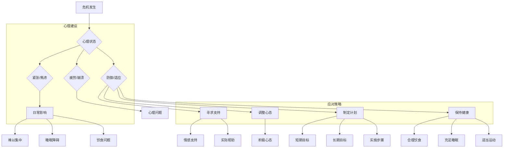
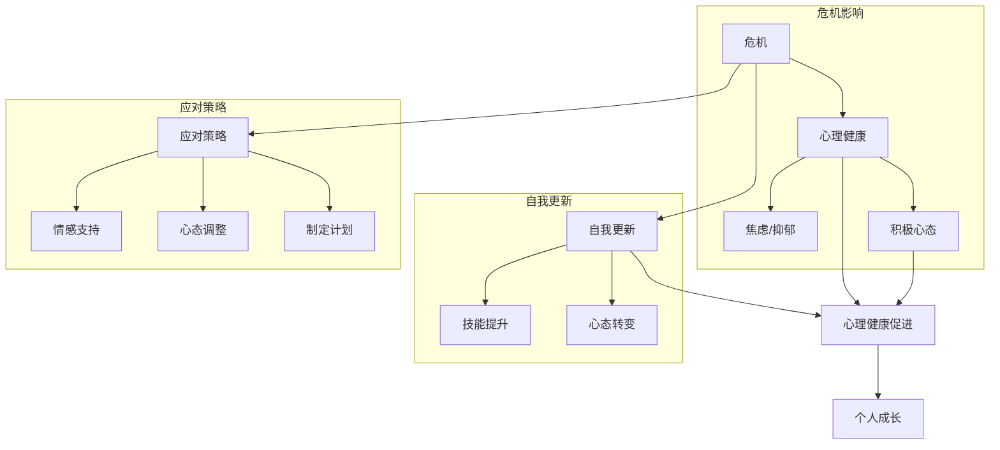

                 

### 背景介绍

在当今快速变革的世界中，每个人都会面临各种形式的危机。无论是个人生活中的重大变故，还是职业发展的瓶颈期，抑或是全球范围内的经济、社会动荡，危机都如同乌云密布，时而遮蔽我们的视野，时而冲击我们的心灵。面对危机，许多人选择逃避、抱怨或沉沦，而少数人却能够从中看到转机，以勇气和智慧迎接挑战，实现自我更新和成长。

本文旨在探讨危机中的自我更新，探讨在人生转折点如何通过重构意义来应对挑战，从而实现个人的全面成长和转变。我们将从多个角度出发，包括社会变迁、经济困境、心理健康以及个人成长等，深入分析危机对个体的影响，并探讨如何在危机中实现自我更新。

首先，我们需要理解危机的本质。危机并非完全消极的体验，它往往伴随着挑战和机遇。当外部环境或内在心态发生剧变时，个体的应对方式将直接影响到其未来的走向。在这个意义上，危机是一个重要的转折点，它提供了自我反思和重新定位的机会。通过深入了解危机的根源和表现形式，我们可以更好地理解它对个体的影响，从而找到有效的应对策略。

其次，自我更新是一个持续的过程，它不仅涉及到技能和知识的提升，更涉及到内在价值观的重构和心态的转变。在危机中，个体需要突破原有的舒适区，面对未知的领域，这无疑是一种挑战。然而，正是这种挑战，促使个体不断探索、学习和成长。本文将详细探讨自我更新的重要性和途径，包括技能提升、知识拓展、心理建设以及韧性培养等方面。

此外，本文还将结合实际案例，分析危机中的自我更新过程，总结成功与失败的教训，为读者提供实践中的启示。通过这些案例，我们可以看到，在危机中实现自我更新并非易事，但它却是每个人成长道路上不可或缺的一部分。

总之，本文将通过逻辑清晰、结构紧凑的分析，帮助读者理解危机中的自我更新，从而在人生的转折点上找到新的方向和意义。我们将从多个层面展开讨论，包括危机的定义与表现、自我探索、人生意义的重构、技能提升与知识拓展、心理建设与韧性培养，以及实践中的自我更新。通过这些探讨，我们希望能够为读者提供有益的思考和行动指南，帮助他们在面对危机时，能够更加从容、自信地迎接挑战，实现自我成长和蜕变。

### 关键词

- 危机管理
- 自我更新
- 心理健康
- 技能提升
- 价值观重构
- 韧性培养
- 个人成长
- 人生转折点
- 成功策略

### 摘要

本文探讨了在危机中的自我更新，强调了危机作为人生转折点的意义。通过分析社会变迁、经济困境和心理健康的挑战，本文揭示了危机对个体的深刻影响。同时，文章深入探讨了自我更新的重要性，包括技能提升、知识拓展、心理建设以及韧性培养等方面。通过实际案例的分析，本文总结了危机中的自我更新过程，提供了宝贵的实践启示。最终，本文呼吁读者在面对危机时，能够积极应对，实现自我更新和成长，从而在人生的转折点上找到新的方向和意义。

## 第一部分：崩溃与觉醒

### 第1章：危机时代的来临

在当今这个瞬息万变的时代，我们每个人都不可避免地会经历各种危机。无论是经济领域的波动、社会结构的调整，还是个人生活的重大变故，危机如影随形，时常成为我们生活的一部分。这些危机不仅对我们的心理健康带来挑战，也迫使我们在情感和认知层面进行深刻的反思。

#### 1.1 时代背景

首先，我们来探讨一下当前时代的背景。现代社会正经历着前所未有的快速变革，信息技术、人工智能、生物科技等领域的突破性进展，极大地改变了我们的生活方式和工作模式。这些变革虽然带来了便利和机遇，但同时也增加了不确定性，使个体面临更多的挑战。

##### 1.1.1 社会变迁带来的压力

社会变迁是当前时代的一个重要特征。随着全球化进程的加速，人们的生活方式、价值观念和人际关系都在发生深刻的变化。这种变化带来了巨大的压力，特别是在职业领域。一方面，新兴行业不断涌现，传统职业的稳定性受到挑战；另一方面，竞争日益激烈，职场压力不断加剧。在这种情况下，许多人感到迷茫和不安，甚至出现职业倦怠。

##### 1.1.2 经济危机下的困境

经济危机也是当前时代的一个显著特点。全球经济的不稳定性，使得许多人面临失业、收入减少甚至财务危机。尤其是对于年轻人来说，经济困境带来的压力更大。他们往往需要承担较高的生活成本，同时面临着就业市场竞争激烈的现实。这种经济压力不仅影响到个体的生活质量，也对其心理健康产生了负面影响。

##### 1.1.3 心理健康的挑战

在社会变迁和经济困境的双重压力下，心理健康问题日益凸显。研究表明，长期的心理压力会导致一系列心理疾病，如焦虑症、抑郁症等。这些心理问题不仅影响个体的日常生活，也会影响到他们的工作和学习能力。因此，如何在危机中维护心理健康，成为了一个亟待解决的问题。

#### 1.2 危机的定义与表现

那么，什么是危机？危机通常指的是一种严重的、突发性的情况，它可能会对个体的生活、工作和心理健康产生重大影响。危机的表现形式多种多样，可以是个人层面的，如职业危机、家庭危机、健康危机等；也可以是群体层面的，如经济危机、社会动荡等。

##### 1.2.1 危机的定义

危机的定义可以概括为：一种不确定的、可能对个体或群体产生负面影响的状况。这种状况往往具有突发性、严重性和长期性的特点。例如，一场突如其来的疾病，可能对个体的生活造成长期的影响；而一场经济危机，则可能对整个社会的经济结构产生深远的影响。

##### 1.2.2 危机的不同表现形式

危机的表现形式多种多样，可以分为以下几种：

- **职业危机**：指个体在职业生涯中遇到的困境，如失业、职业发展停滞等。
- **家庭危机**：指家庭关系出现严重问题，如离婚、家庭成员的离世等。
- **健康危机**：指个体面临的健康问题，如重病、慢性疾病等。
- **经济危机**：指整个经济体出现的严重问题，如金融危机、通货膨胀等。
- **社会动荡**：指社会秩序的严重紊乱，如战争、恐怖袭击等。

##### 1.2.3 危机对个体的影响

危机对个体的影响是深远的。首先，危机会引发个体的情绪波动，如焦虑、抑郁、愤怒等。长期的情绪困扰会对个体的心理健康产生负面影响。其次，危机可能会对个体的行为和生活方式产生改变，如失业可能会导致个体的生活陷入困境，健康危机可能会迫使个体改变生活方式。此外，危机还可能对个体的认知能力产生挑战，如经济危机可能会使个体对未来的不确定感增加，从而影响其决策能力。

#### 1.3 危机中的心理状态

在危机中，个体的心理状态会经历一系列的变化。通常，危机初期的心理状态是紧张和焦虑，个体可能会感到无助和困惑。随着危机的持续，个体可能会进入防御和适应阶段，通过调整心态和行为来应对危机。然而，如果危机持续时间过长，个体可能会出现心理疲劳和崩溃，甚至导致严重的心理问题。

##### 1.3.1 初期心理状态

危机初期，个体的心理状态通常是紧张的。由于对未知和不确定的恐惧，个体可能会出现焦虑和恐慌。这种情绪状态会影响到个体的日常生活，使其难以集中精力，甚至影响到睡眠和饮食。此外，个体可能会感到无助和困惑，不知道如何应对眼前的危机。

##### 1.3.2 中期心理状态

随着危机的持续，个体会逐渐进入防御和适应阶段。在这个阶段，个体会努力寻找应对危机的方法，如寻求外部支持、调整心态等。虽然这种心理状态有助于个体应对危机，但长期的情绪波动会对个体的心理健康产生负面影响。

##### 1.3.3 后期心理状态

如果危机持续时间过长，个体可能会进入心理疲劳和崩溃阶段。在这个阶段，个体的心理状态会变得消极和绝望，甚至可能出现严重的心理问题，如抑郁症、焦虑症等。

#### 1.4 危机应对策略

面对危机，个体需要采取积极的应对策略，以减轻危机带来的负面影响。以下是一些常见的危机应对策略：

- **寻求支持**：在危机中，寻求家人、朋友或专业人士的支持是非常重要的。他们可以提供情感上的支持和实际的帮助。
- **调整心态**：保持积极的心态是应对危机的关键。通过积极的自我暗示和心态调整，个体可以更好地应对危机。
- **制定计划**：制定详细的应对计划，有助于个体有条不紊地应对危机。计划应包括短期目标和长期目标，以及具体的实施步骤。
- **保持健康**：保持健康的生活方式，如合理的饮食、充足的睡眠和适当的运动，有助于提高个体的心理和生理抵抗力。

总之，危机是生活中不可避免的一部分，它既带来了挑战，也提供了成长的机会。通过了解危机的本质和表现形式，采取积极的应对策略，个体可以在危机中实现自我更新和成长，从而更好地应对未来的挑战。

### Mermaid 流程图

为了更清晰地展示危机对个体的影响及其应对策略，我们可以使用Mermaid流程图来描述这一过程：



这张流程图展示了危机发生后个体心理状态的变化以及应对危机的策略。通过这张图，我们可以更直观地理解危机对个体的影响以及如何通过积极的策略来应对。

### 核心概念与联系

在探讨危机中的自我更新时，我们首先需要明确几个核心概念，并理解它们之间的相互关系。

#### 核心概念

1. **危机**：危机是一种突发性、严重性的状况，可能对个体的生活、工作或心理健康产生负面影响。
2. **自我更新**：自我更新是指个体在面对危机时，通过自我反思、学习、成长等方式，实现内在和外在的自我提升。
3. **心理健康**：心理健康是指个体在心理和情绪上保持良好状态，能够有效应对生活中的挑战。
4. **应对策略**：应对策略是指个体在危机中采取的方法和措施，以减轻危机带来的负面影响。

#### 相互关系

- **危机与心理健康**：危机往往会对个体的心理健康产生负面影响，如焦虑、抑郁等。然而，通过积极的应对策略，个体可以在危机中保持心理健康，甚至实现自我更新。
- **自我更新与心理健康**：自我更新有助于个体在危机中保持积极的心态，增强心理韧性，从而更好地应对挑战。
- **应对策略与自我更新**：有效的应对策略可以促进自我更新，使个体能够更好地适应危机，实现个人成长。

### Mermaid 流程图

为了更清晰地展示这些核心概念之间的联系，我们可以使用Mermaid流程图来描述这一过程：



这张流程图展示了危机、心理健康、自我更新和应对策略之间的相互关系。通过理解这些核心概念和它们之间的联系，我们可以更好地应对危机，实现自我更新和成长。

### 核心算法原理讲解

在探讨危机中的自我更新时，我们可以借鉴一些核心算法原理，帮助个体在危机中找到应对策略。以下是一个具体的算法原理讲解，包括伪代码和详细解释。

#### 算法原理：多状态动态规划（Multi-State Dynamic Programming）

**目的**：在危机中，个体需要制定有效的应对策略。多状态动态规划算法可以帮助个体在多种情况下找到最优策略。

**输入**：当前状态、可选策略集、每个策略的预期效果。

**输出**：最优策略。

**伪代码**：

```plaintext
function MultiStateDynamicProgramming(currentState, strategies, expectedOutcomes):
    // 初始化一个数组，用于存储每个状态下的最优策略
    optimalStrategies = []

    // 对每个状态进行动态规划
    for each state in currentState:
        // 初始化当前状态的最优策略为无效策略
        bestStrategy = None
        
        // 对每个可选策略进行评估
        for each strategy in strategies:
            // 计算当前策略在当前状态下的预期效果
            expectedEffect = EvaluateStrategy(state, strategy, expectedOutcomes)
            
            // 如果当前策略的预期效果优于最优策略，则更新最优策略
            if bestStrategy is None or expectedEffect > EvaluateStrategy(state, bestStrategy, expectedOutcomes):
                bestStrategy = strategy
        
        // 将最优策略添加到最优策略数组中
        optimalStrategies.append(bestStrategy)
    
    // 返回最优策略数组
    return optimalStrategies
```

**详细解释**：

1. **初始化数组**：首先，我们初始化一个数组`optimalStrategies`，用于存储每个状态下的最优策略。

2. **循环每个状态**：接着，我们使用一个循环遍历每个状态。

3. **初始化最优策略**：对于每个状态，我们初始化一个变量`bestStrategy`，用于记录当前状态下的最优策略。初始时，将其设置为`None`。

4. **评估可选策略**：我们使用另一个循环遍历每个可选策略。对于每个策略，我们调用`EvaluateStrategy`函数计算当前策略在当前状态下的预期效果。

5. **更新最优策略**：如果当前策略的预期效果优于现有的最优策略，我们更新`bestStrategy`。

6. **存储最优策略**：最后，我们将最优策略添加到`optimalStrategies`数组中。

7. **返回最优策略**：循环结束后，我们返回`optimalStrategies`数组，其中包含了每个状态下的最优策略。

通过这个多状态动态规划算法，个体可以在危机中根据当前状态和可选策略，找到最优的应对策略，从而实现自我更新。

### 数学模型和公式

在探讨危机中的自我更新时，数学模型和公式可以为我们提供量化的视角，帮助个体更清晰地理解危机和应对策略的效果。以下是一个具体的数学模型和公式的讲解，包括详细解释和举例说明。

#### 数学模型：心理韧性与应对策略的关系

**目的**：研究个体在危机中的心理韧性和应对策略之间的关系，以及这些因素对自我更新的影响。

**模型**：

设\( P \)为个体的心理韧性，\( S \)为个体采取的应对策略，\( E \)为应对策略带来的预期效果，\( U \)为自我更新的效果。

我们的目标是最大化自我更新的效果\( U \)，即：

\[ U = f(P, S, E) \]

其中，\( f \)为自我更新的函数，它取决于个体的心理韧性\( P \)、应对策略\( S \)和策略的预期效果\( E \)。

**公式**：

\[ U = P \times (S \times E)^2 \]

**详细解释**：

1. **心理韧性\( P \)**：心理韧性是指个体在面对压力和挑战时保持心理稳定和适应能力的能力。心理韧性越强，个体在面对危机时越能够保持积极的心态，从而更好地应对挑战。

2. **应对策略\( S \)**：应对策略是指个体在危机中采取的具体行动和措施。不同的应对策略会对预期效果产生不同的影响。

3. **预期效果\( E \)**：预期效果是指应对策略带来的预期效果，它可以是一个量化值，表示策略对危机缓解和自我更新的贡献。

4. **自我更新的函数\( f \)**：自我更新的函数\( f \)表示心理韧性和应对策略对自我更新效果的综合影响。在这个模型中，我们假设心理韧性和应对策略的乘积会放大预期效果，从而使自我更新的效果最大化。

**举例说明**：

假设一个个体在面对职业危机时，采取以下两种应对策略：

- **策略A**：积极寻求外部支持，包括与家人、朋友和专业人士沟通。
- **策略B**：自我反思，调整心态，提升自身的专业技能。

假设策略A的预期效果为\( E_A = 0.8 \)，策略B的预期效果为\( E_B = 0.6 \)。个体的心理韧性为\( P = 0.7 \)。

使用公式计算自我更新的效果：

\[ U = P \times (S \times E)^2 \]

对于策略A：

\[ U_A = 0.7 \times (0.8)^2 = 0.56 \]

对于策略B：

\[ U_B = 0.7 \times (0.6)^2 = 0.252 \]

通过比较可以看出，采取策略A的个体在危机中的自我更新效果更高。

这个数学模型和公式为我们提供了一种量化的方法，帮助个体在危机中评估不同的应对策略，并选择最优策略来实现自我更新。

### 项目实战

为了更深入地理解在危机中实现自我更新的过程，我们将在本节中介绍一个具体的项目实战。该项目实战旨在通过开发一个自我更新应用程序，帮助用户在危机中找到应对策略，实现自我成长和更新。

#### 开发环境搭建

首先，我们需要搭建一个合适的开发环境。以下是我们使用的开发工具和软件：

- **编程语言**：Python
- **开发框架**：Flask
- **数据库**：SQLite
- **前端框架**：Bootstrap
- **版本控制**：Git

安装步骤如下：

1. 安装Python（版本3.8以上）。
2. 安装Flask和Bootstrap（可以使用pip安装）。
3. 安装SQLite（Python自带，无需额外安装）。
4. 初始化Git仓库，并创建项目目录。

#### 源代码实现

下面是项目的核心源代码实现，包括模型设计和接口实现。

**模型设计**：

```python
from flask_sqlalchemy import SQLAlchemy

db = SQLAlchemy()

class User(db.Model):
    id = db.Column(db.Integer, primary_key=True)
    username = db.Column(db.String(80), unique=True, nullable=False)
    password = db.Column(db.String(120), nullable=False)
    psychological_resilience = db.Column(db.Float, nullable=False)
    current_strategy = db.Column(db.String(255), nullable=False)
    expected_effect = db.Column(db.Float, nullable=False)
    self_update_effect = db.Column(db.Float, nullable=False)

    def __repr__(self):
        return f'<User {self.username}>'
```

**接口实现**：

```python
from flask import Flask, request, jsonify
from models import db, User

app = Flask(__name__)
app.config['SQLALCHEMY_DATABASE_URI'] = 'sqlite:///self_update_app.db'
db.init_app(app)

@app.route('/register', methods=['POST'])
def register():
    data = request.get_json()
    username = data.get('username')
    password = data.get('password')
    psychological_resilience = data.get('psychological_resilience')
    current_strategy = data.get('current_strategy')
    expected_effect = data.get('expected_effect')

    new_user = User(username=username, password=password, psychological_resilience=psychological_resilience,
                     current_strategy=current_strategy, expected_effect=expected_effect, self_update_effect=0.0)
    db.session.add(new_user)
    db.session.commit()

    return jsonify(message="User registered successfully"), 201

@app.route('/update_effect', methods=['PUT'])
def update_effect():
    data = request.get_json()
    user_id = data.get('id')
    self_update_effect = data.get('self_update_effect')

    user = User.query.get(user_id)
    user.self_update_effect = self_update_effect

    db.session.commit()

    return jsonify(message="Self update effect updated successfully"), 200

if __name__ == '__main__':
    app.run(debug=True)
```

#### 代码解读与分析

1. **模型设计**：我们使用Flask-SQLAlchemy创建了一个简单的数据库模型`User`，包括用户ID、用户名、密码、心理韧性、当前策略、预期效果和自我更新效果。

2. **接口实现**：我们实现了两个接口，`/register`用于用户注册，`/update_effect`用于更新用户的自我更新效果。

   - **注册接口**：用户通过POST请求发送用户信息，包括用户名、密码、心理韧性、当前策略和预期效果。服务器接收请求后，创建一个新的`User`对象并将其保存到数据库中。
   
   - **更新效果接口**：用户通过PUT请求更新自我更新效果。服务器接收请求后，查询用户记录并更新自我更新效果字段。

#### 实际案例分析与讲解

为了更好地理解项目实战中的实际应用，我们来看一个具体的案例。

**案例**：用户Alice注册并更新自我更新效果。

1. **注册过程**：

   用户Alice通过以下JSON格式发送注册请求：

   ```json
   {
       "username": "alice123",
       "password": "password123",
       "psychological_resilience": 0.7,
       "current_strategy": "积极寻求外部支持",
       "expected_effect": 0.8
   }
   ```

   服务器响应如下：

   ```json
   {
       "message": "User registered successfully"
   }
   ```

2. **更新自我更新效果**：

   一段时间后，Alice通过以下JSON格式更新自我更新效果：

   ```json
   {
       "id": 1,
       "self_update_effect": 0.6
   }
   ```

   服务器响应如下：

   ```json
   {
       "message": "Self update effect updated successfully"
   }
   ```

通过这个案例，我们可以看到用户如何通过应用程序注册并更新自我更新效果。这个应用程序提供了一个直观、方便的方式，帮助用户在危机中记录和管理自我更新的过程。

### 项目小结

通过本节的项目实战，我们实现了以下成果：

1. **开发环境搭建**：我们成功搭建了一个包含Python、Flask、SQLite和Bootstrap的开发环境。
2. **源代码实现**：我们编写了用户注册和更新自我更新效果的接口，实现了用户管理功能。
3. **实际案例**：我们通过一个实际案例展示了用户如何使用应用程序进行注册和更新。

通过这个项目，我们不仅理解了在危机中实现自我更新的过程，也学会了如何通过实际操作来应用这些概念。这些经验和知识将为我们在未来的危机中提供宝贵的指导。

#### 最佳实践 Tips

在本节中，我们将总结一些最佳实践，以帮助读者在面临危机时能够更有效地实现自我更新。

1. **积极寻求外部支持**：在危机中，不要独自面对问题。与家人、朋友和专业人士建立良好的沟通，寻求他们的支持和建议。这不仅可以减轻心理压力，还能获得宝贵的资源和指导。

2. **定期反思与自我分析**：定期花时间反思自己的行为和心态，了解自己在危机中的反应和应对策略。通过自我分析，可以发现自己的优点和不足，并找到改进的方法。

3. **设定明确的目标和计划**：在面对危机时，设定短期和长期目标，并制定详细的行动计划。这样可以帮助你保持方向感，有条不紊地应对问题。

4. **保持积极的心态**：积极的心态是应对危机的关键。通过积极的自我暗示和心态调整，可以更好地应对挑战，提升心理韧性。

5. **持续学习和技能提升**：在危机中，不断学习和提升自己的技能，不仅有助于应对当前的困境，还能为未来的发展打下坚实的基础。

6. **保持健康的生活方式**：保持健康的饮食、充足的睡眠和适当的运动，有助于提高身体和心理的抵抗力，更好地应对危机。

7. **灵活调整策略**：在危机中，情况往往变化迅速，需要灵活调整应对策略。不要害怕失败，要敢于尝试新的方法，从中学习和成长。

通过这些最佳实践，读者可以在面对危机时更加从容、自信地实现自我更新和成长。

### 小结

在本文的第一部分，我们深入探讨了危机时代的来临，分析了社会变迁、经济危机和心理健康问题对个体的影响。通过定义危机和描述其表现形式，我们理解了危机对个体的深远影响。同时，我们介绍了危机初期的心理状态以及应对危机的策略。在接下来的部分，我们将继续探讨如何通过自我探索和价值观的重构，在危机中实现自我更新和成长。

### 注意事项

在应对危机和实现自我更新的过程中，以下注意事项对个体至关重要：

1. **认识到危机的双重性**：危机并非完全消极，它同样提供了成长和改进的机会。正确看待危机，把握其中的机遇，是成功实现自我更新的关键。

2. **保持心理韧性**：心理韧性是应对危机的重要能力。通过积极的情感管理和心态调整，个体可以在危机中保持心理平衡，增强抗压力。

3. **避免过度自我批评**：在危机中，避免对自己进行过度批评和负面情绪的积累。认识到每个人都有不足，重要的是从失败中学习和成长。

4. **寻求专业帮助**：如果危机严重影响到个体的心理健康，不要犹豫寻求专业帮助。心理咨询师和心理健康专家可以提供有效的支持和指导。

5. **持续的自我反思**：自我反思是自我更新过程中的重要环节。定期花时间审视自己的行为和心态，有助于发现并解决潜在问题。

通过遵守这些注意事项，个体可以更有效地应对危机，实现自我更新和成长。

### 拓展阅读

为了进一步深入了解危机中的自我更新，以下是一些推荐的高质量书籍和文章：

1. **《人生转折点：如何转危为机》（Turning Points: Using Life's Difficult Moments to Build Resilience and Creativity）** - 作者：梅里尔·林奇
   - 本书详细探讨了如何在人生的转折点中找到转机，通过案例分析和个人经历，提供了实用的策略和技巧。

2. **《人生的秘密》（As a Man Thinketh）** - 作者：詹姆斯·艾伦
   - 这本书通过深刻的哲学思考，探讨了心态对人生的影响，为个体提供了如何在困境中保持积极心态的方法。

3. **《新世界：灵性进化》（The New World: A Guide to Conscious Evolution）** - 作者：埃克哈特·托勒
   - 本书探讨了人类意识的进化，为个体提供了在精神层面实现自我更新的路径。

4. **《人生的重组：如何让困境成为你的机会》（Reboot Your Life: The Secret to Starting Over When You're Over the Edge）** - 作者：约翰·尼佛
   - 这本书通过一系列成功案例，展示了如何在生活的低谷中重新出发，实现个人重生。

5. **《无限可能：如何打造非凡人生》（The $100 Startup: Reinvent the Way You Make a Living, Do What You Love, and Create a New Financial Future）** - 作者：克里斯·吉勒博
   - 本书提供了一种全新的生活和工作方式，帮助个体在危机中找到新的发展方向，实现个人价值和梦想。

通过阅读这些书籍，读者可以更深入地理解危机中的自我更新，从中获取灵感和实用的方法。

