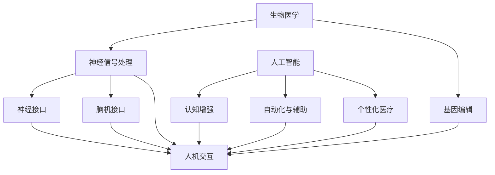

                 

### 文章标题：人类增强技术：改造人性还是失去意义

#### 关键词：人类增强技术、伦理问题、社会影响、技术发展、人工智能、神经科学

#### 摘要：
随着科技的发展，人类增强技术逐渐成为现实，这些技术可能改变人类的身体、认知和情感。本文将从多个角度探讨人类增强技术的意义及其潜在影响，深入分析其伦理问题和社会影响，并探讨其技术实现和发展前景。通过逐步推理和探讨，本文旨在为读者提供一个全面而深入的视角，以思考人类增强技术在改造人性方面的潜力及其可能带来的挑战。

### 目录大纲

1. **引言**
   - 背景介绍
   - 研究意义
   - 文章结构概述

2. **人类增强技术的概念与背景**
   - 定义与分类
   - 发展历史
   - 现状与趋势

3. **核心概念与联系**
   - 生物医学与神经科学基础
   - 人工智能在人类增强中的应用
   - 人机交互的挑战与机遇

4. **伦理与社会问题**
   - 伦理争议
   - 社会影响
   - 法律法规与监管框架

5. **具体应用案例**
   - 医疗领域的增强技术
   - 军事与国防的应用
   - 教育与职业发展的应用

6. **技术发展与未来展望**
   - 新技术的前沿研究
   - 社会适应与调整
   - 未来趋势

7. **人类增强技术的实现与挑战**
   - 技术实现与开发
   - 挑战与解决策略

8. **综合评价**
   - 人类增强技术的利与弊
   - 未来发展方向的建议

9. **结论**

### 引言

#### 背景介绍
人类历史一直在探索如何通过技术手段来提升人类的能力。从古代的假肢到现代的人工智能和神经科学，人类不断增强自身的身体和认知能力。近年来，随着科技的发展，人类增强技术（Human Enhancement Technology）逐渐成为可能。这些技术包括基因编辑、神经接口、增强现实和虚拟现实等，它们不仅能够改善人类的生活质量，还可能改变人类的基本属性和人性。

#### 研究意义
人类增强技术的出现引发了广泛的关注和讨论。这些技术可能带来巨大的社会和经济影响，但同时也引发了一系列复杂的伦理和社会问题。研究人类增强技术的意义在于理解其潜力与风险，探讨其对社会和个人的影响，并为相关政策制定和技术应用提供指导。本文旨在从多个角度对人类增强技术进行深入分析，帮助读者更好地理解这一领域的重要性和挑战。

#### 文章结构概述
本文将按照以下结构展开讨论：

1. **人类增强技术的概念与背景**：介绍人类增强技术的定义、分类和发展历史。
2. **核心概念与联系**：探讨生物医学、神经科学、人工智能和人机交互在人类增强技术中的角色。
3. **伦理与社会问题**：分析人类增强技术可能引发的伦理争议、社会影响和法律法规问题。
4. **具体应用案例**：介绍医疗、军事和教育等领域中的人类增强技术应用实例。
5. **技术发展与未来展望**：探讨人类增强技术的未来研究方向和社会适应性。
6. **实现与挑战**：讨论人类增强技术的技术实现和面临的挑战。
7. **综合评价**：总结人类增强技术的利与弊，并提出未来发展的建议。
8. **结论**：总结全文，强调人类增强技术的意义和挑战。

通过这一系列的探讨，本文希望能够为读者提供一个全面而深入的视角，以思考和评估人类增强技术的未来方向和影响。

### 人类增强技术的概念与背景

#### 定义与分类

人类增强技术是指通过各种技术手段提升人类身体、认知和情感能力的科学和实践。这些技术可以大致分为以下几类：

1. **生物医学增强**：包括基因编辑、基因治疗、药物增强、外科手术等。例如，CRISPR技术可以用于精准编辑人类基因，从而治疗遗传性疾病。

2. **神经科学增强**：涉及神经接口技术、脑机接口（BCI）、认知增强药物等。这些技术可以直接与大脑交互，提高记忆、注意力和认知能力。

3. **人工智能增强**：通过人工智能和机器学习算法增强人类的决策能力、工作效率和创造性。例如，智能助手和自动化系统可以辅助人类完成复杂任务。

4. **增强现实与虚拟现实**：利用虚拟现实（VR）和增强现实（AR）技术提供沉浸式体验，增强人类的感知和互动能力。这些技术在娱乐、教育和军事等领域有广泛应用。

#### 发展历史

人类增强技术的发展可以追溯到古代。例如，假肢和外骨骼的出现使得人类能够克服身体上的缺陷。然而，现代人类增强技术的快速发展始于20世纪末，特别是在生物医学和神经科学领域。

- **1980年代**：神经科学领域的突破性研究，包括电刺激和神经接口技术的应用，为后来的脑机接口（BCI）技术奠定了基础。

- **1990年代**：虚拟现实和增强现实技术的初步应用，为人类提供了全新的感知和互动方式。

- **2000年代**：基因编辑技术的出现，如CRISPR-Cas9，使得科学家能够以极高的精度编辑人类基因组。

- **2010年代**：神经科学和人工智能的结合，脑机接口技术取得了显著进展，如脑-机接口（BMI）和智能增强系统。

#### 现状与趋势

当前，人类增强技术已经从实验室研究逐步走向实际应用。以下是一些关键趋势：

1. **医疗应用**：基因编辑和基因治疗技术在治疗遗传性疾病方面取得突破，如治疗癌症和罕见病。

2. **军事应用**：增强士兵的体能、认知能力和生存能力，提高作战效能。

3. **教育应用**：智能辅导系统和个性化学习平台，帮助学生提高学习效果。

4. **职业发展**：通过认知增强药物和工作辅助系统，提高工作效率和创新能力。

5. **社会趋势**：人们对增强技术的接受度逐渐提高，但同时也对伦理、隐私和安全等问题保持警惕。

未来，随着技术的不断进步，人类增强技术有望在更多领域得到应用，从而进一步提升人类的生活质量和能力。然而，这些技术的广泛应用也带来了诸多挑战，需要在伦理、法律和社会层面进行深入探讨和规范。

### 核心概念与联系

#### 生物医学与神经科学基础

生物医学和神经科学是理解人类增强技术的基础。生物医学关注人体的生理和病理过程，而神经科学则专注于大脑和神经系统的工作原理。

1. **神经信号处理**：神经科学的核心是理解神经信号的传递和处理。神经信号可以通过电刺激或光刺激来传递，例如，脑机接口（BCI）技术通过电信号读取大脑活动，并将其转换为机器指令。

2. **神经接口**：神经接口是一种与大脑或神经系统直接连接的装置。这些接口可以用于记录神经活动、提供反馈或控制外部设备。例如，人工耳蜗通过神经接口将电信号转换为听觉信号。

3. **基因编辑**：基因编辑技术，如CRISPR-Cas9，可以精确地修改DNA序列。这为治疗遗传性疾病和增强特定性状提供了可能。

#### 人工智能在人类增强中的应用

人工智能（AI）在人类增强技术中扮演着关键角色，特别是机器学习和深度学习算法的应用。

1. **认知增强**：通过AI算法，可以分析大脑活动数据，识别模式，从而提高记忆、注意力和决策能力。例如，AI可以辅助医生进行更精确的诊断。

2. **自动化与辅助**：AI技术可以自动化或辅助人类完成复杂任务，如自动驾驶汽车、智能助手等。这些系统可以提高工作效率，减少人为错误。

3. **个性化医疗**：AI可以帮助医生制定个性化治疗方案，通过分析患者的基因组、病史和实时监测数据，提供最佳的治疗方案。

#### 人机交互的挑战与机遇

人机交互（HCI）是理解和应用人类增强技术的重要领域。它涉及如何设计人机界面，使人类能够有效使用增强技术。

1. **用户体验**：人机交互的质量直接影响用户体验。设计直观、易用的界面和交互方式，可以提高用户的接受度和满意度。

2. **可访问性**：人机交互需要考虑到不同用户的需求，包括残障人士和老年人。可访问性设计确保所有人都能够使用增强技术。

3. **隐私和安全**：在人机交互中，隐私和安全是一个关键问题。数据保护和加密技术需要得到充分应用，以确保用户数据的安全。

#### 关系架构

为了更好地理解这些核心概念之间的联系，我们可以使用Mermaid流程图来展示它们之间的关系：

通过这个流程图，我们可以清晰地看到生物医学、神经科学和人工智能如何相互作用，共同构建人类增强技术的基础。

### 伦理问题

#### 人类增强技术的伦理争议

人类增强技术不仅在技术上带来了变革，同时也引发了深刻的伦理争议。以下是一些主要的伦理问题：

1. **平等与不平等**：人类增强技术可能会导致社会不平等的加剧。只有富人和特权阶层能够负担得起这些技术，这可能导致社会分层和分裂。

2. **自然与人造**：人类增强技术是否改变了人类的基本属性？这是关于自然与人造之间界限的争议。有些人认为，过度的人类增强可能会使人失去“人性”。

3. **基因编辑**：基因编辑技术，如CRISPR-Cas9，允许科学家对人类基因进行精准修改。这引发了对基因编辑道德边界的讨论，包括对后代的影响和基因编辑的伦理责任。

4. **隐私问题**：人类增强技术，特别是神经科学和人工智能的应用，涉及到大量的个人数据。这引发了关于隐私保护和数据安全的争议。

5. **不可逆性**：一些人类增强技术是不可逆的，这意味着一旦实施，就可能无法撤销。这引发了对技术风险和后果的担忧。

#### 案例分析：基因编辑技术的伦理问题

基因编辑技术的出现引发了广泛的伦理争议。例如，CRISPR-Cas9技术允许科学家在基因水平上进行精准修改，这为治疗遗传性疾病提供了希望。然而，它也引发了一系列伦理问题：

- **遗传伦理**：基因编辑可能改变人类后代的基因组，这涉及到对后代的责任和伦理问题。父母是否有权决定后代的基因组成？

- **技术滥用**：基因编辑技术可能被用于非医学目的，如改善智力或体能。这引发了对技术滥用和伦理边界的担忧。

- **公平性**：基因编辑技术可能使某些人获得不公平的优势，加剧社会不平等。这需要我们思考如何确保技术的公平应用。

#### 道德框架与伦理原则

为了应对这些伦理争议，需要建立道德框架和伦理原则来指导人类增强技术的发展和应用。以下是一些关键的原则：

1. **尊重个体**：尊重个体的权利和自主性，确保他们在接受人类增强技术时做出知情决策。

2. **公正性**：确保技术的公平应用，避免加剧社会不平等。

3. **透明性**：确保技术的应用过程透明，让公众了解其潜在风险和影响。

4. **责任**：明确技术提供者和使用者的责任，确保他们承担相应的伦理责任。

5. **预防性原则**：在技术发展和应用过程中，采取预防措施，避免潜在的风险和负面影响。

通过这些伦理原则，我们可以更好地引导人类增强技术的发展，确保其在造福人类的同时，避免潜在的伦理危机。

### 社会影响与隐私保护

#### 社会影响

人类增强技术的普及将对社会产生深远的影响。以下是一些关键方面：

1. **社会分层**：人类增强技术可能导致新的社会分层。只有富裕和特权阶层能够负担昂贵的增强技术，这可能导致社会不平等的加剧。

2. **劳动力市场**：增强技术可能会改变劳动力的需求和供应。一些工作可能因为增强技术的应用而消失，而新的工作机会也可能出现。

3. **家庭结构**：人类增强技术可能会影响家庭结构和家庭生活。例如，父母可能更倾向于使用增强技术来改善孩子的健康状况和学习能力。

4. **社会互动**：增强技术可能会改变人类的社会互动方式。虚拟现实和增强现实技术可以提供全新的社交体验，但也可能导致现实世界的社交能力下降。

#### 隐私保护

随着人类增强技术的普及，个人隐私保护成为了一个关键问题。以下是一些关键考虑因素：

1. **数据收集**：人类增强技术通常涉及大量的个人数据收集，包括生物识别信息、健康数据和活动记录。这些数据可能被用于改进技术或商业目的，但也存在隐私泄露的风险。

2. **数据安全**：确保个人数据的安全存储和传输至关重要。加密技术和安全协议需要得到广泛应用，以防止数据泄露和滥用。

3. **隐私权**：个人应有权控制其个人数据的收集和使用。透明性和知情同意是保护隐私权的关键原则。

4. **监管框架**：政府和企业需要制定和执行严格的隐私保护法规，以规范人类增强技术的应用和数据管理。

#### 法律法规与监管框架

为了应对人类增强技术带来的社会和隐私挑战，需要建立全面的法律法规和监管框架。以下是一些关键措施：

1. **立法**：政府应制定专门的法律法规，规范人类增强技术的研发、测试和应用。

2. **监管机构**：设立专门的监管机构，负责监督人类增强技术的合规性和安全性。

3. **伦理审查**：在人类增强技术的研究和应用过程中，应进行严格的伦理审查，确保符合伦理原则。

4. **透明度与公众参与**：提高人类增强技术的透明度，鼓励公众参与讨论和决策，以确保技术的公正性和可持续性。

通过这些法律法规和监管措施，我们可以更好地应对人类增强技术带来的社会和隐私挑战，确保其在造福人类的同时，避免潜在的负面影响。

### 具体应用案例

#### 医疗领域的增强技术

在医疗领域，人类增强技术已经成为改善患者健康状况和治疗疾病的重要工具。以下是一些关键应用案例：

1. **基因治疗**：基因治疗利用基因编辑技术修复或替换有缺陷的基因，以治疗遗传性疾病。例如，CRISPR-Cas9技术已被用于治疗先天性失聪和重症联合免疫缺陷病。

2. **人工器官**：人工器官，如人工心脏、人工肾脏和人工肝脏，为许多器官衰竭的患者提供了新的治疗选择。这些人工器官可以延长患者的生命，提高生活质量。

3. **智能诊断**：人工智能在医疗诊断中发挥了重要作用。通过分析医学图像和患者数据，AI可以提供更准确和快速的诊断结果，帮助医生做出更好的治疗决策。

4. **远程医疗**：增强现实（AR）和虚拟现实（VR）技术使得远程医疗成为可能。医生可以通过AR眼镜直接观察患者，进行远程手术和诊断，从而扩大医疗服务的范围。

#### 军事与国防的应用

人类增强技术在军事和国防领域也有广泛应用，显著提升了士兵的作战效能和生存能力。以下是一些关键应用案例：

1. **增强体能**：通过神经刺激和肌肉增强技术，士兵可以在高强度作战环境中保持更高的体能和耐力。这些技术包括电刺激肌肉训练和可穿戴设备。

2. **认知增强**：认知增强药物和脑机接口技术可以提高士兵的记忆、注意力和决策能力。例如，使用认知增强药物可以提高专注力和反应速度，而脑机接口可以实时分析战场信息，提供更准确的决策支持。

3. **隐形技术**：隐形技术通过改变物体的光学特性，使其在雷达和红外线探测中难以被发现。这种技术在军事侦察和特种作战中具有重要作用。

4. **智能武器系统**：人工智能和机器学习技术被用于开发智能武器系统，如无人战斗机器人和自动导航系统。这些系统可以提高战斗效能，减少士兵的风险。

#### 教育与职业发展的应用

人类增强技术也在教育和个人职业发展中发挥了重要作用，提升了学习效果和工作效率。以下是一些关键应用案例：

1. **个性化学习**：人工智能和大数据分析技术可以为学生提供个性化的学习体验。通过分析学生的学习行为和成绩，AI可以推荐最适合的学习资源和策略。

2. **虚拟教室**：虚拟现实和增强现实技术为远程教育提供了沉浸式学习体验。学生可以通过VR眼镜进入虚拟教室，与教师和同学进行互动，提高学习兴趣和参与度。

3. **职业培训**：通过模拟现实工作环境和场景，增强现实技术可以为职业培训提供更真实的训练体验。例如，医生可以通过VR模拟手术过程，提高手术技能和决策能力。

4. **工作效率提升**：人工智能助手和自动化系统可以帮助员工提高工作效率。例如，智能助手可以处理日常任务，如日程安排、电子邮件管理和数据分析，从而让员工有更多时间专注于核心工作。

这些具体应用案例展示了人类增强技术在各个领域的广泛应用和潜力。随着技术的不断进步，我们可以期待这些应用将为人类带来更多的便利和可能性。

### 技术发展与未来展望

#### 新技术的前沿研究

人类增强技术的未来发展将依赖于一系列前沿研究，这些研究有望带来革命性的突破。以下是一些关键领域：

1. **脑机接口（BMI）**：脑机接口技术的发展正朝着更高级的神经接口和更高效的信号解码方法迈进。例如，研究人员正在探索光学脑机接口（OMI），它利用光信号进行非侵入式的大脑控制，从而减少对电极的需求和不适。

2. **基因编辑技术**：基因编辑技术如CRISPR-Cas9不断改进，使其在精度和效率上更加出色。此外，新的基因编辑工具，如基氮酶（Nucleases），可能会提供更安全的基因编辑方法。

3. **认知增强药物**：研究人员正在开发新一代的认知增强药物，这些药物可以更精确地靶向大脑中的特定区域和分子，提高记忆、注意力和决策能力。

4. **可穿戴与植入设备**：可穿戴设备和植入设备的技术进步将使人类增强更加普遍和便捷。例如，柔性电子设备和生物兼容材料的发展，使得设备可以更舒适地贴合人体，并实现长期监测和干预。

#### 社会适应与调整

随着人类增强技术的普及，社会将面临一系列挑战和机遇。以下是一些关键方面：

1. **社会结构的变化**：人类增强技术可能会导致社会结构的变化，包括新的职业和劳动力市场需求的产生。这需要社会政策进行调整，以确保技术红利能够惠及所有人。

2. **教育和培训**：教育系统需要适应人类增强技术的发展，提供相关的培训和课程，帮助学生和员工掌握这些新技术。

3. **伦理和法律框架**：随着人类增强技术的应用范围不断扩大，需要建立更完善的伦理和法律框架来应对新的伦理挑战和监管需求。

4. **隐私和安全**：隐私和安全问题需要得到高度重视，以确保个人数据和生物信息的安全，防止数据泄露和滥用。

#### 未来趋势

展望未来，人类增强技术将朝着以下几个方向继续发展：

1. **普及化**：随着成本的降低和技术的成熟，人类增强技术将更加普及，成为日常生活中的一部分。

2. **智能化**：人工智能将更深入地集成到人类增强技术中，提供个性化、自适应的支持。

3. **人机融合**：人类与机器的界限将逐渐模糊，人类将更多地依赖机器来增强自身的身体和认知能力。

4. **全球合作**：人类增强技术的发展需要全球合作，包括跨学科研究、国际标准和法规的制定，以及不同文化和法律体系的协调。

通过不断的研究、社会适应和政策调整，人类增强技术有望在未来发挥更大的潜力，为人类社会带来更多福祉。

### 人类增强技术的实现与挑战

#### 技术实现与开发

实现人类增强技术需要综合多个领域的知识和技术，包括生物医学、神经科学、人工智能和材料科学。以下是几个关键步骤和具体应用：

1. **生物医学与神经科学**：
   - **基因编辑**：利用CRISPR-Cas9等基因编辑技术，可以精确修改人体基因，治疗遗传性疾病。例如，研究人员正在开发改进的基因编辑工具，如基氮酶，以提高编辑效率和安全性。
   - **神经接口**：神经接口技术通过电极或光学传感器与大脑直接连接，读取和操纵神经信号。例如，脑机接口（BMI）技术可以用于控制假肢或辅助神经系统疾病的治疗。

2. **人工智能与机器学习**：
   - **认知增强**：通过机器学习算法分析大脑活动数据，可以识别出与特定认知能力相关的脑区，进而设计认知增强策略。例如，研究人员正在开发基于深度学习的脑机接口系统，以提高记忆和注意力。
   - **自动化与辅助**：人工智能可以辅助医生进行诊断和治疗，如通过自然语言处理（NLP）分析病历，或通过计算机视觉辅助手术。例如，AI系统可以在手术过程中实时分析影像，提供精确的操作建议。

3. **材料科学与工程**：
   - **可穿戴设备**：利用柔性电子和纳米材料，可以开发出更舒适、更轻便的可穿戴设备。例如，柔性显示器和传感器可以集成到服装或饰品中，提供健康监测和交互功能。
   - **生物兼容材料**：开发生物兼容材料，如生物降解聚合物和生物活性玻璃，可以用于植入人体，减少排异反应和长期副作用。

#### 挑战与解决策略

尽管人类增强技术在许多领域展示了巨大的潜力，但其实施过程中也面临诸多挑战。以下是一些关键挑战及其解决策略：

1. **技术瓶颈**：
   - **基因编辑的精度和安全性**：当前基因编辑技术存在脱靶效应和潜在的不安全性，需要进一步研究和改进。解决策略包括开发更精确的编辑工具和优化编辑过程，以及建立严格的伦理审查和安全评估机制。
   - **神经接口的信号解码**：大脑信号复杂且动态变化，有效解码这些信号是一个挑战。解决策略包括开发先进的信号处理算法和机器学习模型，以及增加传感器密度和多样性。

2. **伦理与法律问题**：
   - **隐私和数据安全**：人类增强技术涉及大量的个人数据，保护这些数据的安全和隐私至关重要。解决策略包括建立强大的数据保护法律和合规机制，以及采用高级加密和隐私保护技术。
   - **伦理争议**：人类增强技术引发了许多伦理争议，如人类的基本属性和自然与人造的界限。解决策略包括建立跨学科伦理委员会，制定伦理准则和道德规范，并鼓励公众参与讨论。

3. **社会接受度和公平性**：
   - **社会接受度**：人类增强技术的普及需要社会的广泛接受。解决策略包括通过教育和公共宣传提高公众对技术的理解和信任，以及确保技术设计和推广过程中的透明度和可访问性。
   - **公平性**：确保人类增强技术能够惠及所有人，避免加剧社会不平等。解决策略包括制定公平的分配机制，提供经济援助和补贴，以及加强监管和伦理审查。

4. **技术集成与标准化**：
   - **系统集成**：实现不同增强技术之间的有效集成，需要一个统一的技术框架和标准。解决策略包括制定跨学科的标准和协议，以及建立跨领域的合作和研究平台。
   - **标准化**：标准化技术组件和接口，可以提高互操作性和兼容性，降低研发和部署成本。解决策略包括国际标准化组织和行业协会的合作，以及开放源代码和共享技术成果。

通过克服这些技术、伦理和社会挑战，人类增强技术有望在未来实现其潜力，为人类社会带来更多福祉。

### 综合评价

#### 人类增强技术的利与弊

人类增强技术具有显著的潜在好处，但也伴随着一系列风险和挑战。以下是对其利与弊的综合评价：

#### 利：

1. **医疗进步**：人类增强技术在治疗疾病、改善健康状况和延长寿命方面具有巨大潜力。例如，基因编辑技术可以治疗遗传性疾病，而神经科学增强可以改善认知障碍和神经系统疾病。

2. **提升生活质量**：增强技术可以帮助人们克服身体和认知障碍，提高生活质量。例如，人工器官和可穿戴设备可以改善慢性疾病患者的日常生活，而认知增强药物可以提高学习和工作效率。

3. **职业发展**：增强技术可以提升个人的职业能力，创造新的工作机会。例如，智能助手和自动化系统可以提高工作效率，而虚拟现实和增强现实技术可以提供新的职业培训和教育体验。

4. **社会公平**：通过普及人类增强技术，可以减少因身体和认知差异而导致的社会不平等。例如，增强技术可以帮助残障人士更好地融入社会，提高其生活质量和自主性。

#### 弊：

1. **社会分层**：人类增强技术可能导致新的社会不平等。只有富裕和特权阶层能够负担高昂的增强技术，这可能导致社会分层加剧，并引发新的社会矛盾。

2. **伦理争议**：人类增强技术引发了一系列伦理争议，包括对人类基本属性、自然与人造界限的质疑，以及基因编辑和认知增强技术的道德边界。

3. **隐私和安全问题**：人类增强技术涉及大量的个人数据收集和处理，存在隐私泄露和数据滥用的风险。确保数据的安全和隐私保护是一个重大挑战。

4. **技术风险**：人类增强技术可能存在不可预测的风险和副作用，例如基因编辑的脱靶效应和神经接口的长期影响。确保技术的安全性和有效性是至关重要的。

#### 未来发展方向的建议

为了充分利用人类增强技术的潜力，同时减少其潜在风险，以下是一些建议：

1. **加强伦理和法律框架**：建立全面的伦理和法律框架，规范人类增强技术的研发、测试和应用。确保技术的公平性和透明度，保护个人隐私和数据安全。

2. **跨学科合作**：促进不同学科之间的合作，包括生物医学、神经科学、人工智能、社会学和法律等。通过跨学科的研究和合作，可以更好地理解和解决人类增强技术带来的复杂问题。

3. **公众教育和参与**：提高公众对人类增强技术的理解和接受度，通过教育和公共宣传，确保公众能够积极参与技术讨论和决策过程。

4. **技术标准化和互操作性**：制定统一的技术标准，确保不同增强技术之间的互操作性和兼容性。这可以降低研发成本，提高技术的普及率和安全性。

5. **社会适应和政策调整**：随着人类增强技术的普及，社会政策和结构需要相应调整，以应对技术带来的社会变革。包括教育、劳动力市场和社会福利政策的调整，以确保所有人都能公平受益。

通过这些建议，我们可以更好地引导人类增强技术的发展，使其为人类社会带来更多福祉。

### 结论

人类增强技术作为现代科技发展的前沿领域，正迅速改变我们的生活方式和社会结构。本文从多个角度对人类增强技术进行了深入探讨，包括其概念与背景、核心概念与联系、伦理问题、社会影响、应用案例、技术实现与挑战，以及综合评价。我们认识到，人类增强技术具有巨大的潜力，能够改善人类的生活质量和能力，但同时也伴随着复杂的伦理和社会挑战。

在未来的发展中，我们需要加强伦理和法律框架的建设，促进跨学科合作，提高公众对技术的理解和接受度，以及确保技术的安全性和互操作性。通过这些努力，我们可以更好地引导人类增强技术的发展，使其为人类社会带来更多福祉。

总之，人类增强技术既带来了前所未有的机遇，也带来了巨大的挑战。只有通过全面、深入的思考和研究，我们才能在利用其潜力的同时，避免潜在的负面影响，确保人类社会的可持续发展。让我们一起关注和参与这一充满希望和挑战的领域。作者：AI天才研究院/AI Genius Institute & 禅与计算机程序设计艺术 /Zen And The Art of Computer Programming

### 拓展阅读

为了深入了解人类增强技术的各个方面，以下是几本推荐阅读的书籍和资源：

1. **《人类增强：科技与未来》**
   - 作者：威尔·霍金（Will Housh）
   - 简介：本书详细介绍了人类增强技术的发展历程、当前状态和未来趋势，涵盖了医疗、军事、教育和职业发展等多个领域。

2. **《神经增强：大脑的未来》**
   - 作者：雷蒙德·科茨（Raymond C. Kurzweil）
   - 简介：作为未来学家，科茨在这本书中探讨了神经科学和人工智能如何结合，提升人类认知能力和生活质量，并探讨了未来神经增强技术的潜在应用。

3. **《基因编辑：革命与争议》**
   - 作者：约翰·格里宾（John H. Richardson）
   - 简介：本书深入探讨了基因编辑技术，如CRISPR-Cas9的原理和应用，分析了其在医疗和社会伦理方面的影响。

4. **《增强现实：虚拟与现实的融合》**
   - 作者：布莱恩·拉菲（Brian Lavery）
   - 简介：本书介绍了增强现实技术的原理和应用，探讨了其在教育、娱乐和军事等领域的潜力，并讨论了其对社会和文化的影响。

5. **《人工智能：智能时代的崛起》**
   - 作者：杰里·卡拉曼尼克斯（Jerry Kaplan）
   - 简介：这本书详细介绍了人工智能的历史、技术和应用，探讨了人工智能对人类生活和社会结构的深远影响。

6. **《人类增强技术：伦理、法律和社会问题》**
   - 作者：马克·D.罗德斯（Mark D. Rothenberg）
   - 简介：本书从伦理、法律和社会问题三个角度，全面探讨了人类增强技术所带来的挑战和机遇，提供了丰富的案例分析和政策建议。

7. **在线资源与报告**
   - **世界卫生组织（WHO）**：WHO的官方网站提供了关于人类增强技术的最新研究、报告和指南。
   - **麻省理工学院（MIT）**：MIT的媒体实验室和计算机科学和人工智能实验室，是研究人类增强技术的重要机构，他们的研究成果和公开讲座值得关注。
   - **国际人工智能与增强研究组织（AAAI）**：AAAI的官方网站提供了关于人工智能和增强技术的前沿研究、会议和论文。

通过这些书籍和资源的阅读，您将能够更深入地了解人类增强技术的各个方面，拓展您的知识和视野。这些资料不仅提供了丰富的理论知识，还结合了实际案例和最新的研究进展，帮助您全面了解这一领域的现状和未来发展方向。

