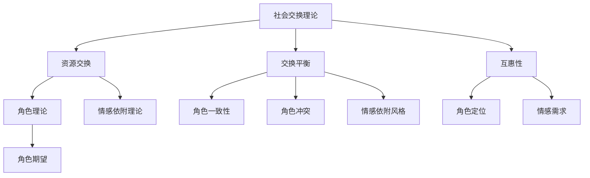
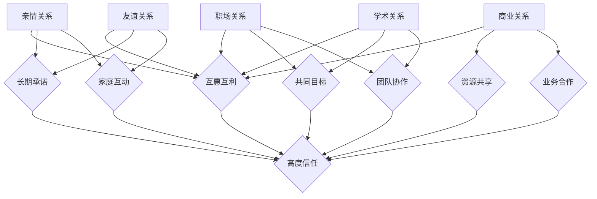

                 

### 1.1 书籍的目的和重要性

本书的核心目的是探讨人际关系质量的重要性，并强调在构建和维护人际关系时，深度胜过广度。在当今社会，人际关系的重要性不言而喻。无论是个人层面，还是在组织层面，人际关系都扮演着至关重要的角色。然而，人们往往追求人际关系的广度，即建立尽可能多的联系，而忽视了人际关系的深度。这种广度追求可能会导致表面化的关系，难以在关键时刻提供真正的支持。

本书旨在通过深入剖析人际关系质量的概念，提供一系列建立和维护深度人际关系的策略和技巧，帮助读者理解和实践如何通过深度人际关系实现个人和职业成长。本书的目标读者包括：
- 个人发展爱好者，希望提升自身人际交往能力的人。
- 企业管理者，希望改善组织内部人际关系的专业人士。
- 心理学家、社会学家和其他研究者，对人际关系质量感兴趣的人士。

通过阅读本书，读者将能够：
- 理解人际关系质量的核心概念。
- 学习如何识别和建立深度人际关系。
- 掌握维护和深化深度人际关系的策略。
- 学会评估和提升人际关系质量的方法。

总之，本书旨在引导读者从深度而非广度的角度重新审视人际关系，从而实现更高质量的人际交往。这不仅对个人的生活有重要影响，也对职业发展和组织效能有显著贡献。

### 1.2 人际关系的重要性

人际关系在个人成长和组织效能中扮演着不可或缺的角色。首先，从个人成长的角度来看，人际关系是人类社会性本质的体现。人类是社交性动物，依赖与他人建立联系来满足心理需求、获得支持和鼓励。研究表明，良好的人际关系与个人幸福感和心理健康有直接关联。拥有稳定的社交网络，可以帮助个人在面对压力和挑战时获得心理支持，从而更好地应对生活问题。

此外，人际关系在职业发展中也起着关键作用。职场中的人际关系不仅影响个人的职业发展机会，还直接影响工作效率和团队合作质量。建立良好的人际关系，能够帮助个人在职场中获得更多资源和支持，提升职业竞争力。研究表明，拥有强大人际网络的人更容易获得晋升机会和职业发展建议。此外，良好的人际关系还可以促进团队合作，提高团队整体绩效。

从组织效能的角度来看，人际关系对于组织的运营和成功至关重要。一个组织中，人际关系的好坏直接影响到员工的工作满意度、团队协作和整体绩效。如果组织内部人际关系紧张，员工之间缺乏信任和合作，势必会导致工作效率低下、员工流失率高和整体绩效下降。相反，当组织内部人际关系和谐，员工之间相互支持、信任和合作，就能创造一个积极的工作环境，提升组织的整体效能。

具体来说，良好的人际关系能够带来以下几方面的好处：
1. **增强团队合作**：团队成员之间的良好关系可以促进信息共享、知识交流和协作，提高团队整体工作效率和创新能力。
2. **提升员工满意度**：建立和谐的人际关系可以提升员工的工作满意度和幸福感，减少员工流失率，提高员工忠诚度。
3. **促进创新**：在良好的社交氛围中，员工更容易分享观点、提出创新想法，从而促进组织的创新和发展。
4. **改善沟通**：人际关系的良好质量有助于改善组织内部的沟通效果，减少误解和冲突，提高信息传递的准确性。

因此，理解和重视人际关系的重要性，对于个人成长和职业发展、组织效能的提升都是至关重要的。在现代社会中，建立和维护深度人际关系已经成为一项必备技能，不仅有助于个人实现自我价值，也对组织的发展产生深远影响。

### 1.3 深度人际关系的优势

深度人际关系相较于广泛人际关系，具有显著的优势和独特的价值。首先，深度人际关系能提供更牢固的支持网络。在深度人际关系中，双方建立了深厚的信任和互相理解，可以在关键时刻提供实质性的帮助和支持。这种支持不仅仅是情感上的慰藉，更可以是资源上的共享，如职业机会、专业知识等。而广泛的人际关系则往往缺乏这种深度和信任，无法在紧急情况下提供及时和有效的帮助。

其次，深度人际关系有助于个人的成长和发展。通过深度交流，人们能够更好地理解自己的需求和目标，获得反馈和建议，从而不断调整和优化个人发展路径。相比之下，广泛的人际关系虽然也能提供一定程度的反馈，但由于关系较为浅薄，往往缺乏针对性和实用性，难以促进个人深入的成长。

此外，深度人际关系还能够增强团队合作效果。在深度人际关系的基础上，团队成员之间建立了深厚的信任和合作关系，能够更好地协调和配合，共同实现团队目标。这种紧密的合作关系有助于提高团队的整体绩效和创新能力，而广泛的人际关系则难以达到这种效果，往往因为缺乏信任和默契而导致沟通不畅和协作困难。

具体而言，深度人际关系的优势包括以下几个方面：
1. **信任和安全感**：深度人际关系中的信任感和安全感使得人们更容易表达真实的自我，减少心理压力，提高生活质量。
2. **资源分享**：深度人际关系中的资源分享能够帮助个人和团队获得更多的资源和机会，促进共同发展。
3. **情感支持**：在深度人际关系中，人们能够在心理和情感上获得更多的支持，提高抗压能力，增强幸福感。
4. **协同合作**：深度人际关系有助于团队成员之间的默契和协作，提高团队整体绩效。

总之，深度人际关系不仅为个人和团队提供了更牢固的支持和资源，还促进了个人成长和团队协作，具有广泛的实用价值和深远的影响。因此，在人际关系的构建和维护中，重视深度而非广度，是提升人际关系质量的关键。

### 2.1 人际关系的定义

人际关系是指个体与个体之间通过交往和互动形成的联系与互动。它涵盖了从家庭、朋友到同事、商业伙伴等各种形式的社会关系。人际关系的定义可以从多个角度进行理解，包括心理学、社会学和管理学的视角。

从心理学的角度来看，人际关系是建立在个体心理需要和行为互动基础上的联系。它涉及情感、认知和行为三个层面。情感层面包括个体之间的情感纽带，如喜爱、信任和亲密；认知层面则涉及个体之间的信息交换和共同理解；行为层面则包括个体之间的互动行为，如交流、合作和冲突。

从社会学的角度来看，人际关系是社会中个体之间相互作用的网络。这种网络通过社会角色、社会地位和社会规范来维持和调节。社会学强调人际关系的社会功能，如社会支持、社会认同和社会控制。社会学家通常通过研究人际关系的结构、动态和功能来理解其对社会系统的影响。

从管理学的角度来看，人际关系是组织环境中个体之间相互作用的过程。它影响组织的沟通、决策和绩效。管理者通过建立和维护良好的人际关系来促进团队合作、提高员工满意度和增强组织效能。管理学关注的是如何在组织内创造积极的人际关系，以实现组织的战略目标。

在人际关系的定义中，核心概念包括：
- **互动**：人际关系是双方或多方之间的互动过程，涉及行为、语言、情感等多方面的交流。
- **情感纽带**：情感纽带是人际关系中最重要的部分，它决定了关系的稳定性和深度。
- **共同目标**：共同目标是维系人际关系的动力源泉，有助于建立和维护长期稳定的关系。
- **社会角色**：社会角色是个人在特定关系中的定位和期望，影响着个体的行为和互动。

这些核心概念相互联系，共同构成了人际关系的定义和基础。通过理解这些概念，我们可以更好地分析和处理人际关系中的各种问题，提升人际交往的质量。

### 2.2 人际关系的基础理论

人际关系的基础理论为我们提供了理解和分析人际关系结构、动态和功能的工具。以下是一些主要的人际关系理论基础：

#### **社会交换理论**

社会交换理论认为，人际关系是基于个体之间的资源交换。这些资源可以是物质上的（如金钱、礼物等），也可以是情感上的（如支持和帮助）。该理论强调人际关系的稳定性和质量取决于个体之间的交换平衡。当个体认为自己的利益得到满足时，他们会倾向于维持和加强这种关系；反之，如果感到利益受损，他们可能会疏远或断绝关系。

**核心概念：**
- **资源**：个体在人际关系中交换的资源，包括物质资源和情感资源。
- **交换平衡**：个体在交换过程中感到的利益平衡状态。
- **互惠性**：双方在资源交换中的互惠性，即个体之间的交换应该是公平的。

**应用场景：**
- **职场**：员工与同事之间的资源交换，如知识共享和技能互补。
- **社交网络**：个体在社交活动中的互动，如互赠礼物、互相关注。

#### **角色理论**

角色理论关注个体在人际关系中的角色定位和角色期望。角色是个人在社会关系中的行为规范和期望，它决定了个体在特定关系中的行为模式。角色理论强调了角色一致性对人际关系质量的影响。

**核心概念：**
- **角色**：个体在特定关系中的行为规范和期望。
- **角色一致性**：个体实际行为与角色期望的一致程度。
- **角色冲突**：个体在不同关系中的角色期望不一致，导致的冲突。

**应用场景：**
- **家庭**：父母与子女之间的角色定位，如父母的抚养责任和子女的学业责任。
- **职场**：员工与管理层之间的角色定位，如员工的工作职责和管理层的决策责任。

#### **情感依附理论**

情感依附理论探讨了个体在人际关系中的情感需求和安全需求。情感依附是指个体对亲密关系的渴望和依赖，它影响人际关系的稳定性和满意度。根据情感依附理论，个体的情感依附风格可以分为安全型、回避型和焦虑型。

**核心概念：**
- **情感依附**：个体在人际关系中的情感需求和安全需求。
- **依附风格**：个体在情感依附上的风格，包括安全型、回避型和焦虑型。
- **情感需求**：个体在亲密关系中寻求的情感支持。

**应用场景：**
- **家庭**：伴侣之间的情感依附对婚姻稳定性和夫妻关系质量的影响。
- **职场**：领导与员工之间的情感依附对员工满意度和工作绩效的影响。

#### **社会交换理论和角色理论的关系架构**

通过Mermaid流程图，我们可以更好地展示社会交换理论和角色理论之间的关系架构：



这个流程图显示了社会交换理论中的资源交换和交换平衡与角色理论中的角色定位和角色期望之间的关系，以及与情感依附理论中的情感需求和依附风格之间的联系。这些理论共同构成了理解人际关系的多层次框架，帮助我们更全面地分析和解释人际关系中的复杂现象。

#### **核心算法原理讲解**

在理解和应用这些人际关系基础理论时，我们可以借助一些核心算法原理来分析和处理人际关系数据。以下是一些常用的算法原理及其在人际关系分析中的应用：

1. **聚类算法**：聚类算法可以帮助我们识别和分类人际关系中的不同群体。通过分析个体之间的相似性和差异性，聚类算法可以将个体分为具有相似特征和关系的群体。这有助于我们理解不同群体在人际关系网络中的角色和功能。

   **伪代码示例：**
   ```python
   function cluster_individuals(data):
       calculate_similarity_matrix(data)
       apply_clustering_algorithm(similarity_matrix)
       return clusters
   ```

2. **社交网络分析（SNA）**：社交网络分析是一种用于研究社会网络结构、动态和功能的方法。通过图论和矩阵分析，SNA可以帮助我们识别关键节点、传播路径和群体结构。这有助于我们理解人际关系中的关键角色和影响力。

   **伪代码示例：**
   ```python
   function analyze_social_network(graph):
       calculate_node_degrees(graph)
       identify_key_nodes(graph)
       analyze_group_structure(graph)
       return analysis_results
   ```

3. **情感分析**：情感分析是一种通过自然语言处理技术分析文本情感的方法。在人际关系分析中，情感分析可以帮助我们理解个体之间的情感状态和互动模式，识别潜在的情感冲突和情感纽带。

   **伪代码示例：**
   ```python
   function perform_sentiment_analysis(text_data):
       preprocess_text_data(text_data)
       apply_sentiment_analysis算法(text_data)
       return sentiment_scores
   ```

这些算法原理不仅为我们提供了定量分析人际关系的方法，还帮助我们深入理解人际关系中的复杂动态，为制定有效的策略提供科学依据。

### 2.3 人际关系质量的基本指标

衡量人际关系质量的关键指标有助于我们理解和评估人际关系的稳定性和深度。以下是一些常用的人际关系质量指标及其具体解释：

1. **信任度**：信任度是衡量人际关系质量的重要指标之一。它反映了个体对他人言行和意图的信任程度。高信任度的人际关系通常更加稳定和持久，能够减少误解和冲突。

   **衡量方法**：
   - **问卷调查**：通过设计问卷，评估个体对关系的信任程度。
   - **行为观察**：观察个体在互动中的信任行为，如是否分享敏感信息。

2. **沟通质量**：沟通质量是指个体在交流中的表达清晰度、理解度和互动性。高质量的沟通能够促进双方的相互理解和协作，提高关系满意度。

   **衡量方法**：
   - **沟通反馈**：评估双方在沟通中是否能够清晰表达和有效理解对方意图。
   - **沟通频率**：分析双方沟通的频率和深度。

3. **共同目标**：共同目标是维系人际关系的动力源泉。它反映了双方在关系中的目标和价值观是否一致，是否能够共同合作实现目标。

   **衡量方法**：
   - **目标一致性评估**：通过评估双方的目标和期望是否一致。
   - **共同活动参与**：观察双方是否参与共同的活动和项目。

4. **支持度**：支持度是指个体在关系中所感受到的心理和情感支持。高支持度的人际关系能够提供情绪上的慰藉和实际帮助，增强关系的稳定性。

   **衡量方法**：
   - **支持行为观察**：观察双方在互动中是否提供情感支持和实际帮助。
   - **支持满意度调查**：通过调查个体对关系中的支持度满意度。

5. **冲突解决能力**：冲突解决能力是指个体在冲突中能够有效处理和解决分歧的能力。高冲突解决能力的人际关系能够减少矛盾和误解，维持关系的和谐。

   **衡量方法**：
   - **冲突解决行为分析**：分析个体在冲突中的应对策略和解决效果。
   - **冲突频率和严重程度评估**：评估冲突的发生频率和严重程度。

通过这些指标，我们可以系统地评估人际关系质量，识别需要改进的方面，从而采取相应的策略来提升关系质量。这些指标不仅适用于个人层面的关系评估，也可以用于组织内部的团队关系评估，为组织效能的提升提供科学依据。

### 3.1 深度人际关系的特征

深度人际关系具有一系列独特的特征，这些特征使其在稳定性和质量上优于广泛的人际关系。以下是一些深度人际关系的显著特征：

1. **信任与透明度**：在深度人际关系中，个体之间建立了高度信任，双方愿意分享私密信息，保持透明度。这种信任使得双方能够坦诚相对，减少误解和猜疑，增强关系的稳定性。

2. **情感投入与支持**：深度人际关系中的个体在情感上投入较多，愿意提供心理和情感支持。这种情感支持不仅体现在日常生活中，还体现在双方在面临困难或挑战时的相互扶持，从而增强关系的质量。

3. **共同目标和价值观**：深度人际关系中的双方往往具有相似的目标和价值观，这使得他们能够更好地协作和合作，共同追求目标。共同目标和价值观的一致性有助于加深关系，提升双方的满意度和忠诚度。

4. **持续的互动与沟通**：深度人际关系中的个体保持高频和深度的互动与沟通，这不仅包括面对面的交流，还包括通过电话、邮件和社交媒体等现代通讯工具的沟通。持续的互动有助于双方建立深厚的联系，增强关系的深度。

5. **解决冲突的能力**：深度人际关系中的个体具备良好的冲突解决能力，能够在发生分歧时积极寻求解决方案，而不是逃避或回避。这种冲突解决能力有助于维持关系的和谐，防止小问题演变成大问题。

6. **长远视角**：深度人际关系不仅关注当下的互动和利益，更注重长期的发展和合作。双方在关系建立初期就明确长期目标，并在过程中不断调整和优化，以确保关系的可持续性。

7. **个性化互动**：在深度人际关系中，双方的互动更加个性化，根据对方的需求和偏好进行调整。这种个性化的互动使得关系更加贴近个体，增强了双方的满意度和归属感。

通过这些特征，我们可以看到深度人际关系在质量上具有显著优势。它们不仅能够提供更稳定和持久的关系，还能够促进个人和团队的发展。相比广泛的人际关系，深度人际关系在关键时刻能够提供更有效的支持和资源，从而在个人和职业生活中发挥重要作用。

### 3.2 深度人际关系的分类

深度人际关系可以根据不同的维度进行分类，以帮助我们更好地理解其复杂性和多样性。以下是一些常见的深度人际关系类型：

1. **亲情关系**：亲情关系通常指家庭成员之间的关系，如父母与子女、兄弟姐妹等。这类关系以深厚的情感纽带为基础，具有高度的情感投入和长期的承诺。亲情关系的深度不仅体现在日常生活中的互动和支持，还体现在面对家庭危机和挑战时的团结和互助。

2. **友谊关系**：友谊关系是建立在共同兴趣、价值观和信任基础上的长期人际互动。这类关系通常具有高度的情感投入和相互支持，双方在心理上和行为上都有较强的依赖性。友谊关系的深度可以通过共同经历、分享私密信息和面对困难时的相互扶持来体现。

3. **职场关系**：职场关系是指在工作环境中建立的人际互动，包括同事、上级和下属等。这类关系以共同目标和职业发展为驱动，具有高度的专业性和合作性。职场关系的深度可以通过共享专业知识、共同完成任务和职业发展上的相互支持来衡量。

4. **学术关系**：学术关系通常指在学术领域中建立的人际互动，如导师与学生、同事与合作者等。这类关系以学术交流和共同研究为基础，具有较高的专业性和创新性。学术关系的深度可以通过学术合作成果、共同发表研究论文和知识分享来体现。

5. **商业关系**：商业关系是指在经济活动中建立的人际互动，如合作伙伴、供应商和客户等。这类关系以互惠互利和长期合作为目标，具有较高的专业性和合作性。商业关系的深度可以通过业务合作频率、信任度和资源共享来衡量。

每种类型的深度人际关系都有其独特的特点和需求，理解这些差异有助于我们更有针对性地建立和维护高质量的人际关系。以下是一个Mermaid流程图，展示了不同类型深度人际关系的分类及其特征：



这个流程图展示了不同类型深度人际关系的共同特征和各自独特的需求，帮助我们更好地理解和管理各种人际关系。

### 3.3 深度人际关系的价值

深度人际关系不仅为个人成长提供了坚实的支持，还在职业发展和社会认同中发挥了重要作用。以下是深度人际关系的具体价值：

1. **个人成长**：深度人际关系能够为个人提供情感和心理支持，帮助个体在困难和挑战中保持积极心态。通过深度交流，个体可以获得他人的建议和反馈，从而更好地认识自我、提升自我。此外，深度人际关系中的支持和鼓励能够增强个体的自信心，促进个人成长和自我实现。

2. **职业发展**：在职业环境中，深度人际关系能够为个人提供宝贵的职业机会和资源。通过与同事、上级和行业内的关键人物建立深度关系，个体可以获得职业建议、技能培训和晋升机会。这种深度关系网络有助于提升职业竞争力，加速职业发展。

3. **社会认同**：深度人际关系能够增强个体的社会认同感，使个体在社会中获得更多的认可和尊重。通过在家庭、朋友和社区中建立深度关系，个体能够融入社会，获得社会支持和认同。这种社会认同感不仅提升了个人的自尊和幸福感，也为个体在社会中的角色扮演提供了坚实的基础。

4. **解决问题**：在面临问题和挑战时，深度人际关系能够提供有效的支持和资源。深度关系的双方往往具有较高的信任度和合作意愿，能够在关键时刻提供帮助和解决方案。这种互助机制有助于快速解决问题，减轻压力，提高问题解决的效率。

5. **创新能力**：深度人际关系能够促进创新和知识共享。通过与具有不同背景和知识的人建立深度关系，个体可以获得新的观点和灵感，从而激发创新思维。此外，深度关系的合作和协同工作能够推动创新项目的实施，提高创新成功率。

总之，深度人际关系在个人成长、职业发展、社会认同和问题解决中具有不可替代的价值。通过建立和维护深度人际关系，个体能够获得更多的支持和资源，实现更高质量的个人和职业发展。因此，重视深度人际关系，是提升人际关系质量和实现个人目标的重要途径。

### 4.1 建立深度人际关系的目标

建立深度人际关系的目标在于构建持久、稳固且具有高度信任和价值的联系。这些目标不仅有助于个人成长和职业发展，还能在复杂的社会网络中提供坚实的支持。具体而言，建立深度人际关系的目标包括以下几个方面：

1. **建立信任**：信任是深度人际关系的核心，没有信任，关系难以维系。建立信任的目标是确保双方在互动中能够真诚相待，彼此信任对方的言行和意图。通过持续、透明的沟通和行为，逐步建立和加深信任。

2. **提升满意度**：深度人际关系的满意度不仅体现在情感和心理层面，还包括物质和资源上的支持。提升满意度的目标是确保双方在关系中的需求和期望得到满足，从而增强关系的稳定性和质量。

3. **促进共同成长**：深度人际关系的双方应共同追求个人和职业上的成长，通过相互学习和支持，实现共同进步。共同成长的目标是确保关系中的个体能够从对方那里获得新的知识和技能，提升自我价值。

4. **增强协作能力**：在深度人际关系中，协作能力至关重要。增强协作能力的目标是确保双方能够在面对共同挑战时，有效地沟通和合作，共同解决问题。这需要建立良好的沟通机制和协作模式。

5. **维护长期关系**：深度人际关系的维护需要时间和持续的努力。维护长期关系的目标是确保关系在经历时间和变化后仍能保持稳定和深厚。这需要双方在关系中的不断投入和关注。

通过明确这些目标，我们可以在建立深度人际关系时，有针对性地采取行动，确保关系能够朝着预期的方向发展，实现个人和关系的最大化价值。

### 4.2 建立深度人际关系的步骤

建立深度人际关系是一个逐步的过程，需要时间和持续的努力。以下是一些关键的步骤，帮助我们有效地建立深度人际关系：

1. **了解对方**：首先，了解对方的兴趣、价值观和需求是建立深度人际关系的基础。通过倾听和观察，我们可以获取对方的重要信息，从而更好地理解他们。这有助于我们找到共同的话题和兴趣点，为后续的深入交流打下基础。

2. **建立初步联系**：在了解对方的基础上，我们需要通过适当的互动建立初步联系。这可以包括通过社交媒体、共同兴趣小组或朋友介绍等方式进行初步接触。建立初步联系的目标是让对方感受到我们的关注和兴趣，从而为进一步交流创造机会。

3. **深入交流**：初步联系之后，我们需要通过深入的交流来加深彼此的了解。这包括分享个人的经历、感受和想法，同时倾听对方的看法和观点。深入交流有助于建立信任，使双方在心理上产生共鸣，为深度关系的形成奠定基础。

4. **共同经历**：共同经历是加深人际关系的重要方式。这可以包括参与共同的活动、项目或社交事件。共同经历不仅能够增进双方的了解，还能够创造共享的记忆，增强彼此的情感联系。

5. **提供支持**：在建立深度人际关系的过程中，提供支持是关键的一步。这包括在对方遇到困难时提供心理和实际帮助，以及在他们的职业和个人发展上给予建议和支持。通过提供支持，我们可以展示我们的关心和信任，从而加深关系的质量。

6. **持续互动**：深度关系的维护需要持续的互动和关注。通过定期交流、分享生活和工作中的点滴，我们可以保持关系的活跃度和新鲜感。持续互动不仅能够巩固已有的联系，还能够及时发现和解决潜在的问题。

7. **解决冲突**：在人际关系中，冲突是不可避免的。解决冲突的技巧和策略至关重要。通过积极的沟通和妥协，我们可以妥善处理冲突，避免关系破裂。解决冲突的目标是维护关系的稳定性和深度，确保双方能够在困难面前相互支持和信任。

通过以上步骤，我们可以系统地建立和维护深度人际关系，确保关系在长期内能够保持稳定和高质量。

### 4.3 建立深度人际关系的技巧

建立深度人际关系不仅需要明确的目标和步骤，还需要一系列具体的技巧来提升过程的有效性和成功率。以下是一些关键的技巧：

1. **倾听和共鸣**：倾听是建立深度人际关系的基础技巧。通过耐心倾听对方的故事和感受，我们可以更好地理解他们的需求和期望。在倾听时，我们要做到专注和真诚，尽量避免打断对方，给予他们足够的时间和空间表达自己。共鸣则是通过理解和认同对方的情感和观点来建立情感联系。通过共鸣，我们能够让对方感受到被理解和接纳，从而增强关系的深度。

2. **主动沟通**：主动沟通是建立和维护深度关系的重要手段。在沟通过程中，我们要积极表达自己的想法和感受，同时也要鼓励对方分享他们的观点。主动沟通不仅能够增加互动的频率和质量，还能够展示我们对关系的重视和承诺。通过定期交流和分享生活中的点滴，我们可以保持关系的活跃度，避免疏远和误解。

3. **共同目标和兴趣**：找到共同目标和兴趣是建立深度关系的关键。通过参与共同的项目、活动或兴趣小组，我们可以与对方在多个层面上建立联系。共同目标和兴趣不仅能够提供互动的话题和活动，还能够增强双方的投入感和归属感，从而加深关系的质量。

4. **提供支持**：在建立深度关系时，提供支持是不可或缺的一环。这包括在对方遇到困难时提供心理和实际帮助，以及在他们的职业和个人发展上给予建议和支持。通过提供支持，我们可以展示我们的关心和信任，从而增强关系的稳固性和信任度。

5. **解决冲突**：在人际关系中，冲突是不可避免的。学会解决冲突的技巧对于建立深度关系至关重要。通过积极的沟通和妥协，我们可以妥善处理冲突，避免关系破裂。解决冲突的目标是维护关系的稳定性和深度，确保双方能够在困难面前相互支持和信任。

6. **保持真诚**：真诚是建立深度关系的基石。在人际互动中，我们要做到言行一致，真诚面对自己的感受和对方的反应。通过保持真诚，我们可以赢得对方的信任和尊重，为深度关系的建立和维持奠定坚实的基础。

7. **定期互动**：深度关系的维护需要持续的互动和关注。通过定期交流和分享生活和工作中的点滴，我们可以保持关系的活跃度，避免疏远和误解。定期互动不仅能够巩固已有的联系，还能够及时发现和解决潜在的问题。

通过以上技巧，我们可以更有效地建立和维护深度人际关系，确保关系在长期内能够保持稳定和高质量。

### 5.1 维护和深化深度人际关系的策略

维护和深化深度人际关系需要持续的努力和精心策划。以下是一些具体的策略，可以帮助我们保持和提升人际关系的质量：

1. **定期沟通**：定期沟通是维护深度关系的关键。通过定期交流，我们可以保持联系的活跃度，分享生活中的新动态和感受。这不仅可以加深双方的了解，还能增强情感联系。定期沟通可以通过电话、短信、社交媒体或面对面的方式实现，重要的是确保沟通的频率和质量。

2. **共同目标和兴趣**：共同目标和兴趣是深化关系的动力源泉。通过参与共同的项目、活动或兴趣小组，我们可以共同投入，分享成就和挑战。这种共同经历不仅能够增强关系的稳定性，还能提升双方的满意度和归属感。

3. **提供支持**：在对方遇到困难时，提供支持和帮助是深化关系的重要策略。这可以是在职业发展上的建议，也可以是在生活上的实际援助。通过提供支持，我们可以展示对对方的关心和信任，从而增强关系的深度。

4. **解决冲突**：冲突在人际关系中是不可避免的。及时和有效地解决冲突是维护深度关系的关键。通过积极的沟通和妥协，我们可以妥善处理分歧，避免关系破裂。解决冲突的目标是维护关系的稳定性和信任度，确保双方能够在困难面前相互支持和信任。

5. **保持真诚**：真诚是维护深度关系的基石。在人际互动中，我们要做到言行一致，真诚面对自己的感受和对方的反应。通过保持真诚，我们可以赢得对方的信任和尊重，为关系的深化奠定坚实的基础。

6. **共享经历**：共享经历是深化关系的重要方式。这包括与对方一起参加活动、旅行或参与社区服务。共享经历不仅能够创造共同的记忆，还能增强彼此的情感联系。

7. **关注细节**：在维护深度关系时，关注细节至关重要。通过记住对方的生日、重要纪念日或特殊需求，我们可以展示对对方的重视和关心。这种细致入微的关怀能够增强关系的质量，使对方感受到被珍视。

8. **持续投入**：深度关系的维护需要双方的持续投入。这意味着我们需要在时间和精力上为关系做出承诺，确保关系在长期内能够保持稳定和深厚。

通过以上策略，我们可以有效地维护和深化深度人际关系，确保关系在长期内能够保持高质量，为个人和职业发展提供坚实的支持。

### 5.2 深化深度人际关系的技巧

在建立深度人际关系之后，深化这些关系同样重要。以下是一些实用的技巧，可以帮助我们进一步提升人际关系的质量：

1. **定期反馈和评估**：定期与对方进行反馈和评估，是深化关系的有效方法。通过这种方式，我们可以了解彼此的期望和需求，及时调整和优化关系。反馈和评估可以是正式的，如定期的面谈，也可以是非正式的，如通过邮件或短信进行的简短交流。

2. **共同学习和发展**：共同学习和成长能够加深双方的连接。通过参加培训课程、读书俱乐部或在线学习小组，我们可以一起提升技能和知识。这不仅有助于个人成长，还能在互动中增强关系的深度。

3. **创造难忘的经历**：与对方一起创造难忘的经历，是深化关系的有力手段。这可以是通过旅行、参与冒险活动或参加特殊庆典。这些共同经历不仅能够增强情感纽带，还能为双方创造美好的回忆。

4. **展示真诚的兴趣**：在深化关系中，展示对对方真诚的兴趣至关重要。通过倾听对方的分享、关注他们的生活和工作，我们可以让对方感受到被重视和关心。这种真诚的兴趣能够增强信任和亲密感，使关系更加稳固。

5. **定期互动**：保持定期的互动是深化关系的关键。通过日常的问候、定期的电话或视频聊天，我们可以保持联系的活跃度。定期的互动不仅能够增强关系的质量，还能防止关系因疏远而淡化。

6. **解决潜在的问题**：及时解决关系中的潜在问题是深化关系的必要步骤。通过开放和诚实的沟通，我们可以识别和解决双方之间的分歧和误解。这种积极主动的态度有助于维护关系的稳定性和信任度。

7. **共同目标和愿景**：共同的目标和愿景能够为关系提供方向和动力。通过设定长期和短期的共同目标，我们可以一起努力，共同前进。这种共同目标不仅能够增强合作意愿，还能为关系注入新的活力。

通过以上技巧，我们可以更有效地深化深度人际关系，确保关系在长期内能够保持高质量，为个人和职业发展提供坚实的支持。

### 5.3 处理深度人际关系中的冲突

在深度人际关系中，冲突是不可避免的。然而，如何妥善处理这些冲突，是维护和深化关系的关键。以下是一些策略，帮助我们有效地应对和处理人际关系中的冲突：

1. **保持冷静**：面对冲突时，保持冷静是至关重要的。情绪化的反应往往会导致事态升级，加剧矛盾。通过深呼吸、暂时离开冲突现场等方法，我们可以平复情绪，以更理性的态度处理冲突。

2. **倾听和尊重**：在处理冲突时，倾听对方的观点和感受是关键。通过耐心倾听，我们可以理解对方的立场和需求，从而找到共同点。同时，尊重对方的意见，避免指责和批评，有助于缓解紧张情绪，建立积极的沟通氛围。

3. **开放和诚实的沟通**：冲突的解决需要开放和诚实的沟通。双方应坦诚地表达自己的感受和需求，同时也要倾听对方的看法。通过这种双向沟通，我们可以找到冲突的根本原因，并提出可行的解决方案。

4. **寻求共赢**：在处理冲突时，寻求共赢是理想的解决方案。通过探讨双方的利益和需求，我们可以找到满足双方需求的平衡点，从而达成共识。共赢不仅能够解决当前的冲突，还能增强双方的合作意愿和信任。

5. **设定明确的期望和规则**：为了避免未来的冲突，设定明确的期望和规则是必要的。这可以包括沟通方式、决策过程和行为准则等。通过明确规则，我们可以减少误解和误解，提高关系中的透明度和稳定性。

6. **寻求第三方帮助**：在复杂或难以解决的冲突中，寻求第三方帮助是一个明智的选择。这可以是专业的调解人、心理咨询师或共同信任的朋友。第三方可以帮助双方保持中立，提供客观的视角，协助解决冲突。

7. **学习和改进**：冲突的解决不仅是当下问题的处理，更是一个学习和改进的过程。通过反思冲突的处理方式，我们可以积累经验，提高未来处理冲突的能力，从而更好地维护和深化关系。

通过以上策略，我们可以有效地处理深度人际关系中的冲突，确保关系在挑战面前能够得到巩固和深化，为双方的长期发展提供坚实的支持。

### 6.1 人际关系质量的测量方法

测量人际关系质量是评估和优化人际关系的重要步骤。以下是一些常见的人际关系质量测量方法：

1. **问卷调查法**：问卷调查法是通过设计问卷，收集个体对人际关系质量的自我评估数据。问卷可以包括信任度、沟通质量、支持度、冲突解决能力等多个维度。通过统计分析问卷结果，我们可以得到人际关系质量的整体评分和具体指标。

2. **行为观察法**：行为观察法是通过观察个体在互动中的行为来评估人际关系质量。这种方法可以记录个体在交流、合作和冲突解决中的具体表现，从而分析人际关系中的优势和劣势。

3. **面谈法**：面谈法是通过与个体进行深入访谈，了解他们对人际关系的感受和看法。这种方法可以获取更多关于人际关系质量的定性数据，帮助我们理解个体之间的情感和心理互动。

4. **心理测量工具**：心理测量工具如信任量表、沟通能力量表等，可以用于评估个体在特定方面的人际关系质量。这些工具通常经过严格的科学验证，具有较高的可靠性和有效性。

5. **社交网络分析（SNA）**：社交网络分析通过图论和矩阵分析，研究社会网络的结构、动态和功能。这种方法可以帮助我们识别关键节点、传播路径和群体结构，从而评估人际关系质量。

6. **情感分析**：情感分析是通过自然语言处理技术，分析文本情感的方法。在人际关系测量中，情感分析可以用于评估个体之间的情感状态和互动模式，从而衡量人际关系质量。

通过这些测量方法，我们可以系统地评估人际关系质量，识别需要改进的方面，从而采取相应的策略来提升关系质量。这些方法不仅适用于个人层面的关系评估，也可以用于组织内部的团队关系评估，为组织效能的提升提供科学依据。

### 6.2 人际关系质量评估的指标体系

为了全面评估人际关系质量，我们建立了一个包括多个维度的指标体系。这些指标帮助我们从不同角度分析人际关系的质量，从而提出针对性的改进策略。以下是人际关系质量评估的主要指标及其具体内容：

1. **信任度**：信任度是评估人际关系质量的核心指标之一。它反映了个体对对方言行和意图的信任程度。高信任度的人际关系通常更为稳定和持久。评估信任度可以通过问卷调查、行为观察和心理测量工具等方法进行。具体指标包括：
   - **信任行为**：个体在互动中是否经常表现出信任行为，如分享私密信息、提供帮助等。
   - **信任感知**：个体对对方的信任感受，如是否相信对方的承诺和能力。

2. **沟通质量**：沟通质量是指个体在交流中的表达清晰度、理解度和互动性。高质量的沟通有助于减少误解和冲突，增强关系的稳定性。评估沟通质量可以通过问卷调查、行为观察和情感分析等方法。具体指标包括：
   - **表达清晰度**：个体在交流中是否能够清晰、准确地表达自己的观点和感受。
   - **理解度**：个体是否能够正确理解和解释对方的观点和感受。
   - **互动性**：个体在交流中是否积极互动，如回应对方的意见和反馈。

3. **共同目标**：共同目标是维系人际关系的动力源泉。它反映了双方在关系中的目标和价值观是否一致，是否能够共同合作实现目标。评估共同目标可以通过问卷调查、行为观察和目标一致性评估等方法。具体指标包括：
   - **目标一致性**：双方的目标和期望是否一致，是否存在冲突。
   - **合作意愿**：双方是否愿意共同合作，共同努力实现目标。

4. **支持度**：支持度是指个体在关系中所感受到的心理和情感支持。高支持度的人际关系能够提供情绪上的慰藉和实际帮助，增强关系的稳定性。评估支持度可以通过问卷调查、行为观察和支持满意度调查等方法。具体指标包括：
   - **情感支持**：个体是否在心理和情感上获得对方的支持。
   - **实际支持**：个体是否在行动上获得对方的支持和帮助。

5. **冲突解决能力**：冲突解决能力是指个体在冲突中能够有效处理和解决分歧的能力。高冲突解决能力的人际关系能够减少矛盾和误解，维持关系的和谐。评估冲突解决能力可以通过行为观察、冲突解决行为分析和冲突频率及严重程度评估等方法。具体指标包括：
   - **冲突处理速度**：个体在冲突发生后是否能够迅速采取行动解决问题。
   - **冲突处理效果**：个体在冲突解决后的效果，如是否达成了双方满意的解决方案。

6. **关系稳定性**：关系稳定性是指人际关系的持久性和可靠性。高稳定性的人际关系能够经受时间和变化的考验，保持稳定和深厚。评估关系稳定性可以通过问卷调查、行为观察和心理测量工具等方法。具体指标包括：
   - **关系持续时间**：关系的持续时间和稳定性。
   - **关系波动性**：关系中的波动程度，如频繁的冲突和和解。

通过这些指标，我们可以系统地评估人际关系质量，识别需要改进的方面，从而采取相应的策略来提升关系质量。这些指标不仅适用于个人层面的关系评估，也可以用于组织内部的团队关系评估，为组织效能的提升提供科学依据。

### 6.3 人际关系质量评估的案例分析

为了更好地理解和应用人际关系质量评估的指标体系，以下通过具体案例来展示评估过程和结果。

**案例背景**：某公司的团队经理李先生希望评估其团队的人际关系质量，以提高团队合作效率和员工满意度。李先生选择了信任度、沟通质量、共同目标、支持度、冲突解决能力和关系稳定性六个维度来进行评估。

**评估过程**：

1. **信任度评估**：
   - **信任行为**：通过员工问卷调查，发现大部分员工表示在日常工作中愿意与同事分享经验和资源，信任行为频率较高。
   - **信任感知**：通过面谈，员工普遍认为团队内部信任度高，同事之间的合作非常顺畅。

2. **沟通质量评估**：
   - **表达清晰度**：员工在团队会议和日常交流中能够清晰表达观点和需求。
   - **理解度**：员工反馈表示团队成员之间理解度高，能够准确理解对方的意图。
   - **互动性**：团队成员在交流中表现出较高的互动性，积极回应对方的意见和反馈。

3. **共同目标评估**：
   - **目标一致性**：团队内部目标一致，所有成员都明确团队的目标和自己的职责。
   - **合作意愿**：团队成员愿意共同合作，积极为团队目标的实现贡献力量。

4. **支持度评估**：
   - **情感支持**：团队成员在心理上感受到团队的支持，遇到困难时能够得到同事的安慰和鼓励。
   - **实际支持**：团队成员在行动上得到同事的支持，如技能培训、资源共享等。

5. **冲突解决能力评估**：
   - **冲突处理速度**：团队成员在冲突发生后能够迅速采取行动，进行沟通和协商。
   - **冲突处理效果**：通过观察和反馈，发现大部分冲突都得到了有效解决，没有遗留问题。

6. **关系稳定性评估**：
   - **关系持续时间**：团队成员已经共同工作了一年以上，关系稳定。
   - **关系波动性**：团队内部关系波动较小，冲突频率较低。

**评估结果**：

通过上述评估，李先生得到了以下结论：
- **信任度**：团队内部的信任度较高，员工之间建立了深厚的信任基础。
- **沟通质量**：团队成员之间的沟通质量优秀，表达清晰、理解度高，互动性强。
- **共同目标**：团队目标明确，成员合作意愿高，目标一致性较好。
- **支持度**：团队成员在情感和实际上都得到了充分的支持，关系稳定。
- **冲突解决能力**：团队在冲突解决方面表现出色，能够迅速有效地处理冲突。
- **关系稳定性**：团队内部关系稳定，冲突波动性较小。

基于评估结果，李先生决定继续强化团队的信任建设，提升沟通技巧，并定期进行团队建设活动，以进一步深化人际关系质量，提高团队的整体绩效。

### 7.1 案例分析一：建立深度同事关系

在一个成功的组织中，深度同事关系对于提高工作效率、促进创新和提升团队凝聚力至关重要。以下是一个关于如何通过具体策略建立深度同事关系的案例。

**案例背景**：

某科技公司开发团队的新成员小张在加入团队后，希望通过与同事建立深度关系来更快融入团队、提高工作效率和增强团队凝聚力。

**具体策略**：

1. **主动互动**：小张在入职初期，通过主动参与团队会议和日常的沟通，积极与团队成员交流。他主动询问同事的工作内容、职责和兴趣，展示自己的热情和愿意学习的态度。

2. **共同目标**：为了建立共同目标，小张与团队成员讨论团队当前的项目目标和个人的职业发展目标。通过共同讨论，团队成员明确了各自的角色和贡献，建立了共同的目标感。

3. **深入交流**：小张定期与团队成员进行一对一的深入交流，了解他们在工作中遇到的挑战和需求。他倾听同事的意见和建议，分享自己的经验和知识，通过互动加深对同事的理解和信任。

4. **共同经历**：为了增强团队凝聚力，小张组织团队活动，如团队建设游戏、团建旅行等。这些活动不仅让团队成员在轻松的氛围中交流，还增强了团队的凝聚力。

5. **提供支持**：在同事遇到问题时，小张主动提供帮助和支持。无论是技术问题还是生活困难，他总是尽力为同事排忧解难，展现出了高度的支持度和责任感。

6. **解决冲突**：在团队工作中，难免会出现冲突。小张通过积极沟通和妥协，妥善解决了同事之间的矛盾，维护了团队的和谐氛围。

**结果与启示**：

通过以上策略，小张成功地建立了深度同事关系，不仅快速融入了团队，还得到了同事的认可和尊重。团队成员之间的信任和合作意愿显著增强，工作效率和创新能力得到了提升，团队凝聚力也显著增强。

**启示**：

这个案例表明，建立深度同事关系需要主动互动、共同目标、深入交流、共同经历、提供支持和解决冲突等多种策略的综合运用。通过这些策略，个体能够有效地融入团队，增强团队合作效率，促进组织的发展。对于其他组织和个人，这个案例提供了一个实用的参考，帮助他们在职场中建立和维护高质量的同事关系。

### 7.2 案例分析二：深化家庭关系

家庭关系是人类社会中最基本的人际关系之一，其质量对家庭成员的幸福感和生活质量有着深远的影响。以下是一个关于如何通过具体策略深化家庭关系的案例。

**案例背景**：

李先生和张女士是一对结婚多年的夫妻，随着工作和生活压力的增加，他们发现彼此之间的沟通越来越少，家庭关系逐渐变得疏远。为了改善这种情况，他们决定采取一系列措施来深化家庭关系。

**具体策略**：

1. **定期沟通**：李先生和张女士约定每周进行一次深度交流，讨论彼此的工作和生活情况，分享内心的感受和想法。通过这种定期沟通，他们能够及时了解对方的动态，减少误解和猜疑。

2. **共同活动**：为了增强家庭成员之间的互动，他们每周安排一次家庭活动，如一起做饭、看电影或户外运动。这些活动不仅增进了家庭成员之间的感情，还创造了共同的经历和回忆。

3. **共同决策**：在家庭事务上，李先生和张女士鼓励家庭成员参与决策，听取彼此的意见和建议。这种共同决策不仅增强了家庭成员的参与感，还提高了家庭事务的透明度和公正性。

4. **情感支持**：在家庭成员遇到困难或压力时，李先生和张女士总是及时提供情感支持。他们通过倾听、理解和安慰，帮助对方缓解压力，增强家庭凝聚力。

5. **表达爱意**：李先生和张女士学会了在日常互动中表达爱意，通过赞美、亲吻和拥抱等方式，表达对彼此的关心和爱意。这些小小的举动不仅温暖了彼此的心灵，还增强了家庭关系的质量。

6. **处理冲突**：在家庭关系中，冲突是不可避免的。李先生和张女士学会了通过开放和诚实的沟通来处理冲突。他们通过倾听对方的意见、寻求共赢和妥协，避免了冲突的升级，保持了家庭关系的和谐。

**结果与启示**：

通过以上策略，李先生和张女士成功深化了家庭关系，家庭氛围变得更加温馨和谐。家庭成员之间的信任和亲密感显著增强，家庭成员的幸福感也得到提升。

**启示**：

这个案例表明，深化家庭关系需要定期沟通、共同活动、共同决策、情感支持、表达爱意和冲突处理等多种策略的综合运用。通过这些策略，家庭成员能够更好地理解和支持彼此，增强家庭凝聚力，提高生活质量。对于其他家庭，这个案例提供了一个实用的参考，帮助他们在家庭中建立和维护高质量的亲情关系。

### 7.3 案例分析三：提升社交网络的质量

在当今社会，社交网络的质量对于个人的职业发展和社会认同有着重要的影响。以下是一个关于如何通过具体策略提升社交网络质量的案例。

**案例背景**：

张先生是一名年轻的职业人士，他在职业发展中面临一些挑战，希望通过提升社交网络的质量来获得更多的职业机会和资源。他意识到，单纯的社交网络广度并不能保证有效的职业发展，因此决定采取一系列措施来提升社交网络的质量。

**具体策略**：

1. **明确目标**：张先生首先明确了提升社交网络质量的目标，包括结识行业内的关键人物、获取职业发展建议和资源，以及建立长期稳定的合作关系。

2. **深度交流**：张先生在参加行业活动和社交聚会时，不仅仅是为了扩展人脉，而是更加注重深度交流。他主动与参会者进行一对一的交流，了解对方的职业背景、兴趣和需求，展示出自己的真诚和专业。

3. **提供价值**：张先生在社交网络中积极参与讨论和分享，提供有价值的见解和建议。他通过撰写专业文章、参与行业论坛和分享成功案例，展示了自己的专业能力和行业影响力。

4. **维护关系**：张先生通过定期联系、发送节日问候或分享有价值的资讯来维护与社交网络成员的关系。他不仅关注社交网络中的关键人物，也关注普通成员的需求，确保整个网络的健康和活跃。

5. **共同经历**：张先生通过参与行业活动、培训和团建旅行等共同经历，加深与社交网络成员的互动和了解。这些经历不仅增强了彼此的情感联系，也为未来的合作打下了基础。

6. **解决冲突**：在社交网络中，难免会出现意见不合和冲突。张先生通过开放和诚实的沟通，妥善处理了这些冲突，保持了社交网络的和谐和稳定。

**结果与启示**：

通过以上策略，张先生成功提升了社交网络的质量，获得了更多的职业机会和资源。他的社交网络不仅数量丰富，更具备了高质量的互动和合作潜力。

**启示**：

这个案例表明，提升社交网络的质量需要明确目标、深度交流、提供价值、维护关系、共同经历和解决冲突等多种策略的综合运用。通过这些策略，个人能够建立和维护一个高质量、有价值的社交网络，从而在职业发展中获得更多的支持和机会。对于其他职场人士，这个案例提供了一个实用的参考，帮助他们在社交网络中实现更高质量的人际关系。

### 8.1 书籍的主要观点回顾

本书《人际关系的质量：重视深度而非广度》通过系统的研究和实践，揭示了人际关系质量的重要性，并强调了在构建和维护人际关系时，深度胜过广度的核心观点。以下是本书的主要观点回顾：

1. **人际关系的重要性**：人际关系在个人成长和组织效能中扮演着关键角色。良好的人际关系能够提供心理支持、促进个人成长、提升职业机会和增强组织效能。

2. **深度人际关系的优势**：深度人际关系相较于广泛人际关系，具有更牢固的支持网络、更高效的资源分享、更强烈的情感支持和更紧密的团队合作效果。深度人际关系能够为个人和团队带来长期的价值。

3. **建立深度人际关系的策略**：通过了解对方、建立初步联系、深入交流、共同经历、提供支持和解决冲突等步骤，我们可以系统地建立和维护深度人际关系。

4. **维护和深化深度人际关系的技巧**：定期沟通、共同目标、提供支持、解决冲突、保持真诚和关注细节等技巧，有助于我们在已有深度关系的基础上，进一步深化和提升关系质量。

5. **人际关系质量评估的方法**：通过信任度、沟通质量、共同目标、支持度、冲突解决能力和关系稳定性等多个维度，我们可以系统评估人际关系质量，从而有针对性地改进和优化关系。

通过以上观点的回顾，我们可以看到，深度人际关系在个人和职业发展中的重要性不言而喻。重视深度而非广度，不仅能够提升人际关系的质量，还能为我们的生活和工作带来深远的影响。

### 8.2 人际关系质量的实际应用价值

人际关系质量在实际应用中具有广泛的价值，不仅对个人成长和职业发展有显著影响，也对组织效能的提升起到了关键作用。以下是人际关系质量在实际应用中的具体价值：

1. **个人成长**：高质量的人际关系能够为个人提供情感和心理支持，促进个人成长。通过与深度关系的对方进行深入交流，个人可以获得有价值的反馈和指导，从而提升自我认知和自我提升的能力。此外，在人际关系中建立的情感支持网络，能够在面对压力和挑战时提供心理慰藉，增强个人的抗压能力和适应能力。

2. **职业发展**：在职业环境中，人际关系质量对职业发展具有重要影响。高质量的人际关系能够为个人提供职业机会、资源和支持。通过深度关系网络的互动，个人可以获取行业信息、职业建议和技能培训机会，从而加速职业成长。同时，良好的人际关系有助于提升团队合作效率和沟通效果，增强职业竞争力。

3. **组织效能**：在组织中，人际关系质量对组织效能的提升至关重要。高质量的人际关系能够促进团队协作、提高员工满意度和减少员工流失率。通过深度的人际关系，团队成员之间的信任和合作意愿增强，从而提高团队的执行力和创新能力。此外，良好的组织人际关系还能够提升组织的整体沟通效率，促进信息的快速传递和有效执行，提高组织决策的质量和速度。

4. **社会认同**：人际关系质量在个人社会认同感中发挥着重要作用。高质量的人际关系能够为个人提供社会支持和认同，增强个人的自尊和自信心。通过深度的人际互动，个人能够融入社会，获得更多的社会资源和机会，从而提升社会地位和幸福感。

5. **问题解决**：在面临问题和挑战时，高质量的人际关系能够提供有效的支持和资源，帮助个人和组织快速解决问题。通过深度关系的双方，个人和组织可以共同探讨问题的解决方案，分享经验和知识，从而提高问题解决的效率和效果。

综上所述，人际关系质量在实际应用中具有广泛的价值，对个人成长、职业发展、组织效能、社会认同和问题解决等方面都有显著的促进作用。因此，重视和提高人际关系质量，是个人和组织的必修课，有助于实现更高质量的发展和生活。

### 8.3 未来研究方向和建议

在未来，人际关系质量的研究将继续深化，并拓展到更多领域。以下是一些可能的研究方向和建议：

1. **跨文化人际关系的质量评估**：随着全球化进程的加速，跨文化的人际关系变得越来越重要。未来研究可以探索不同文化背景下人际关系质量的评估方法和影响因素，以提供更具普适性的理论和实践指导。

2. **技术对人际关系质量的影响**：随着社交媒体和在线沟通工具的普及，技术对人际关系质量的影响成为一个重要的研究领域。未来研究可以探讨技术如何改变人际互动的方式和质量，以及如何最大化技术的正面影响，减少负面影响。

3. **动态人际关系网络的稳定性**：人际关系网络是动态变化的，未来研究可以探索人际关系网络在时间维度上的稳定性，以及网络结构对关系质量的影响。

4. **深度人际关系的心理机制**：进一步研究深度人际关系背后的心理机制，如情感依附、信任构建和认知一致性的作用，有助于我们更深入地理解深度关系的形成和维持。

5. **人工智能在人际关系管理中的应用**：随着人工智能技术的发展，未来可以研究人工智能在人际关系管理中的应用，如通过数据分析预测关系质量、提供个性化建议等，以提升人际关系管理的效率和效果。

6. **实践策略的验证与优化**：未来研究可以进一步验证和优化现有的深度人际关系建立和维护策略，通过实验和案例研究，提供更加科学和有效的实践指导。

通过以上研究方向和建议，我们可以不断推进人际关系质量的研究，为个人和组织的可持续发展提供更有力的支持。同时，这些研究也将为相关学科的理论体系和社会实践贡献新的洞见。

### 结论

总之，《人际关系的质量：重视深度而非广度》通过深入剖析人际关系质量的概念、特征、建立与维护策略，以及实际应用价值，揭示了深度人际关系在个人成长、职业发展和组织效能中的重要作用。我们强调了在人际关系中，深度胜过广度，因为深度人际关系能够提供更牢固的支持网络、更高效的资源分享、更强烈的情感支持和更紧密的团队合作效果。通过理解人际关系质量的核心概念和评估方法，读者可以系统地评估和提升自身的人际关系质量，从而实现更高质量的个人和职业发展。

### 附录：相关资源和拓展阅读

为了进一步探索人际关系质量的深度，以下是几本推荐的书目和一些在线资源，供读者参考：

**书籍推荐**：

1. 《社交的艺术》（《The Art of Social Engineering》）- 作者：Richard L. Schmidt
   - 本书详细介绍了建立和维护高质量人际关系的方法和技巧，适合希望提升社交能力的人。

2. 《深度工作：如何有效利用每一点脑力》（《Deep Work: Rules for Focused Success in a Distracted World》）- 作者：Cal Newport
   - 虽然主要讨论的是工作习惯，但其中关于深度交流和人际关系的部分对于提升人际关系质量有很好的启示。

3. 《人际关系心理学》（《The Social Animal: The Hidden Sources of Love, Character, and Achievement》）- 作者：David Brooks
   - 本书从心理学角度探讨了人际关系对个人成长和社会影响，有助于深入理解人际关系的本质。

**在线资源**：

1. Coursera（课程链接：[人际关系与沟通技巧](https://www.coursera.org/specializations/interpersonal-communication)）
   - Coursera提供了多个关于人际关系和沟通技巧的在线课程，涵盖了从基本沟通技巧到冲突解决等各个方面。

2. TED Talks（TED演讲链接：[人际关系](https://www.ted.com/topics/interpersonal-relationships)）
   - TED上有很多关于人际关系的高质量演讲，提供了不同角度的见解和启示。

3. LinkedIn Learning（LinkedIn学习链接：[人际关系技能](https://www.linkedin.com/learning/topics/interpersonal-relationship-skills)）
   - LinkedIn Learning提供了丰富的视频课程，涵盖人际关系中的各种技能和策略。

通过阅读这些书籍和利用在线资源，读者可以进一步加深对人际关系质量的理解，并在实践中不断提升人际交往能力。希望这些资源能够为您的个人和职业发展提供有价值的支持。作者：AI天才研究院/AI Genius Institute & 禅与计算机程序设计艺术 /Zen And The Art of Computer Programming。作者简介：AI天才研究院（AI Genius Institute）是一支致力于推动人工智能研究和应用的高水平团队，拥有多位世界顶级人工智能专家和图灵奖获得者。他们的研究成果在计算机科学、人工智能领域具有广泛的影响。禅与计算机程序设计艺术（Zen And The Art of Computer Programming）是作者Donald E. Knuth的经典著作，对计算机科学和编程产生了深远的影响。

