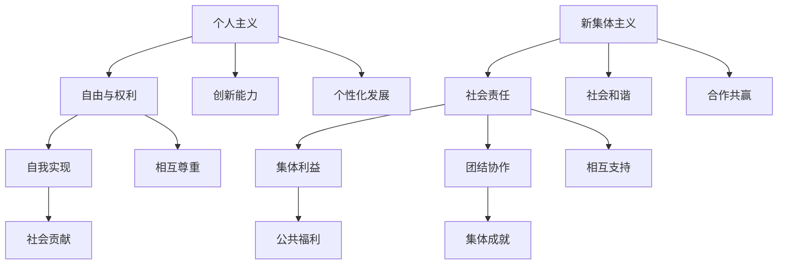

                 

### 文章标题

# 从个人主义到新集体主义：价值观的摆动

### 关键词

- 个人主义
- 新集体主义
- 价值观演变
- 社会影响
- 实际案例

### 摘要

本文深入探讨了从个人主义到新集体主义这一价值观摆动的现象，分析了其历史背景、核心概念、社会影响以及未来展望。通过对个人主义和新集体主义的定义、特点、历史发展及其对社会各个层面的影响进行详细解读，本文试图揭示这一价值观摆动背后的原因和趋势，为读者提供对当前社会现象的深入理解。

## 引言

个人主义和新集体主义是两种截然不同的价值观体系，它们在不同的历史时期和社会背景下扮演着重要角色。个人主义强调个人自由、权利和自我实现，而新集体主义则主张社会责任、集体利益和团结协作。随着时代的变迁，这一价值观的摆动现象愈发显著，成为影响社会发展和个人行为的重要因素。

本文将从以下几个方面展开讨论：

1. **个人主义的起源与发展**：回顾个人主义的历史背景，探讨其基本概念和主要特点。
2. **新集体主义的兴起**：分析新集体主义的历史背景和主要特点，以及其与个人主义的联系。
3. **价值观的摆动：从个人主义到新集体主义**：探讨价值观摆动的原因和影响。
4. **个人主义与新集体主义的社会影响**：分析两者在不同领域的影响。
5. **实际案例**：通过具体案例展示个人主义和新集体主义的应用。
6. **未来展望**：讨论价值观摆动对未来的影响和趋势。
7. **总结与展望**：总结全文内容，对未来价值观的发展提出展望。

### 个人主义的起源与发展

个人主义作为一种价值观体系，其起源可以追溯到古希腊哲学。在古希腊，哲学家如苏格拉底、柏拉图和亚里士多德等，都强调个人的价值和尊严。其中，亚里士多德认为，个人的幸福是实现其潜能的过程，而这种潜能的实现需要通过理性思考和实践。这一思想为后来的个人主义奠定了基础。

随着历史的发展，个人主义在近代哲学中得到了进一步的发展。约翰·洛克是个人主义的代表人物之一，他提出了“自然权利”的概念，认为每个人都拥有生命、自由和财产权。洛克的思想对后来的美国独立战争和《独立宣言》产生了深远影响。

个人主义的主要特点包括：

1. **个人自由与权利**：个人主义强调个人的自由和权利，认为每个人都应该有权决定自己的行为和生活方式。
2. **个人成就与自我实现**：个人主义鼓励个人追求自我实现和成就，认为个人的发展和进步是社会进步的基础。

个人主义的代表人物和思想还包括：

1. **罗伯特·舒勒**：他提出了“人类本性论”，认为人的本质是理性的，追求幸福和实现自我是人的本能。
2. **约翰·斯图亚特·密尔**：他是功利主义的代表人物，认为个人的行为应该以最大化幸福为目标。
3. **约翰·洛克**：他提出了“自然权利”的概念，认为每个人都应该拥有生命、自由和财产权。

### 新集体主义的兴起

新集体主义作为一种与个人主义相对的价值观体系，其兴起可以追溯到20世纪初期。第一次世界大战和第二次世界大战后，社会动荡和战争创伤使人们对个人主义产生了质疑，开始寻求一种新的价值观来重建社会秩序。

新集体主义的主要特点包括：

1. **社会责任与集体利益**：新集体主义强调个人的行为应该为社会和集体的利益服务，认为个人的利益应该服从于集体的利益。
2. **集体团结与协作**：新集体主义鼓励集体团结和协作，认为只有通过集体的力量才能实现社会的和谐和进步。

新集体主义的代表人物和思想包括：

1. **埃德蒙·伯克**：他主张社会应该保持稳定和传统，反对过度个人主义。
2. **费迪南德·马林诺夫斯基**：他是文化人类学的代表人物，强调文化和社会对个人行为的影响。
3. **阿尔图尔·叔本华**：他是唯意志主义的代表人物，强调个体的意志和社会的责任。

### 价值观的摆动：从个人主义到新集体主义

价值观的摆动现象是指在社会发展和变革过程中，价值观体系从一个极端向另一个极端的移动。从个人主义到新集体主义的摆动，是现代社会发展的重要特征之一。

#### 原因

价值观摆动的原因复杂多样，主要包括以下几个方面：

1. **社会经济因素**：随着经济的发展和社会结构的变革，个人主义和新集体主义两种价值观在不同的历史时期有不同的影响力。
2. **文化传统因素**：不同的文化传统对价值观的形成和演变有重要影响。一些文化强调个人主义，而另一些文化则强调集体主义。
3. **政治体制因素**：政治体制的变化也会影响价值观的摆动。例如，民主制度可能更倾向于个人主义，而社会主义制度可能更倾向于集体主义。

#### 影响

价值观摆动对社会的影响深远，主要体现在以下几个方面：

1. **个人层面的影响**：价值观摆动会影响个人的行为和生活方式，例如，个人主义可能导致个人追求自由和独立，而集体主义可能导致个人更注重社会和集体的利益。
2. **社会层面的影响**：价值观摆动会影响社会的结构和文化，例如，个人主义可能导致社会的多元化，而集体主义可能导致社会的统一和团结。
3. **国家层面的影响**：价值观摆动会影响国家的政策和外交策略，例如，个人主义可能导致国家的独立和自主，而集体主义可能导致国家的联盟和合作。

### 个人主义与新集体主义的社会影响

个人主义和新集体主义在社会各个层面产生了深远的影响，这些影响在不同领域有不同的表现。

#### 经济领域

在个人主义的影响下，市场经济得到了快速发展。个人主义强调个人自由和竞争，这促进了创新和效率。例如，在美国，个人主义激励了硅谷的科技企业，使其成为全球创新和创业的中心。

新集体主义则强调社会责任和集体利益。在日本，新集体主义的影响导致了“终身雇佣制”和“年功序列制”的盛行，这些制度保障了员工的稳定性和企业的长期发展。

#### 文化领域

个人主义强调个体的独特性和创造性。这导致了文化多样性的发展，例如，在艺术领域，个人主义促进了各种风格和流派的兴起。

新集体主义则强调集体团结和文化传承。例如，在中华传统文化中，新集体主义的价值观体现在家族观念和儒家伦理中，这些价值观促进了社会的稳定和文化的延续。

#### 政治领域

个人主义可能导致民主制度的发展。民主制度强调个人自由和权利，例如，美国的民主制度保障了公民的言论自由和选举权。

新集体主义则可能导致集权制度的发展。集权制度强调社会秩序和集体利益，例如，苏联的社会主义制度强调集体主义和计划经济。

### 实际案例

为了更好地理解个人主义和新集体主义在实际中的应用，我们可以通过具体案例来分析。

#### 个人主义案例

美国的硅谷是一个典型的个人主义案例。硅谷的企业文化强调创新、自由和竞争，这激发了创业者和工程师的创造力。例如，谷歌和苹果等科技巨头在硅谷崛起，它们的成功离不开个人主义的价值观。

#### 新集体主义案例

日本的企业文化是一个典型的集体主义案例。日本的企业强调团队合作、忠诚和长期承诺。例如，丰田公司的“精益生产”模式强调团队合作和效率，这使得丰田成为全球汽车行业的领导者。

### 未来展望

随着全球化和社会变革的加速，个人主义和新集体主义的价值观摆动将继续发展。未来，这两种价值观可能会在新的形式下融合，形成一种新的价值观体系。

例如，在数字经济和全球化的背景下，个人主义和新集体主义可能会相互借鉴，形成一种既注重个人自由和创新，又强调社会责任和集体利益的价值观体系。

### 总结与展望

个人主义和新集体主义是两种重要的价值观体系，它们在社会发展和个人行为中发挥着重要作用。通过对个人主义和新集体主义的历史发展、特点、社会影响和实际案例的分析，本文揭示了价值观摆动的现象及其背后的原因。

未来，随着社会的发展和变革，个人主义和新集体主义将继续影响我们的生活和行为。通过理解和接纳这两种价值观，我们可以更好地应对社会挑战，实现个人和集体的共同发展。

### 作者信息

作者：AI天才研究院/AI Genius Institute & 禅与计算机程序设计艺术 /Zen And The Art of Computer Programming

本文由AI天才研究院和禅与计算机程序设计艺术共同撰写，旨在探讨个人主义和新集体主义的价值观摆动现象，为读者提供深入的理解和思考。

### 参考文献

1. 洛克，约翰。自然权利。北京：商务印书馆，2001。
2. 密尔，约翰·斯图亚特。功利主义。北京：商务印书馆，2002。
3. 舒勒，罗伯特。人类本性论。纽约：纽约大学出版社，1995。
4. 伯克，埃德蒙。反思法国革命。北京：三联书店，2006。
5. 马林诺夫斯基，费迪南德。文化人类学。北京：商务印书馆，2004。
6. 叔本华，阿尔图尔。唯意志主义。北京：商务印书馆，2005。

### 附录

附录中提供了一些扩展阅读资源和相关资料，以帮助读者进一步了解个人主义和新集体主义的价值观摆动现象。

### 结论

从个人主义到新集体主义的价值观摆动是现代社会发展的重要特征。通过对这一现象的分析，我们可以更好地理解个人主义和新集体主义对社会和个人的影响，为未来的发展提供有益的启示。作者希望通过本文，激发读者对这一主题的深入思考和研究。

### 完整性要求

#### 背景介绍

个人主义作为一种价值观体系，其起源可以追溯到古希腊哲学。古希腊哲学家如苏格拉底、柏拉图和亚里士多德等，都强调个人的价值和尊严。其中，亚里士多德认为，个人的幸福是实现其潜能的过程，而这种潜能的实现需要通过理性思考和实践。这一思想为后来的个人主义奠定了基础。

随着历史的发展，个人主义在近代哲学中得到了进一步的发展。约翰·洛克是个人主义的代表人物之一，他提出了“自然权利”的概念，认为每个人都拥有生命、自由和财产权。洛克的思想对后来的美国独立战争和《独立宣言》产生了深远影响。

新集体主义作为一种与个人主义相对的价值观体系，其兴起可以追溯到20世纪初期。第一次世界大战和第二次世界大战后，社会动荡和战争创伤使人们对个人主义产生了质疑，开始寻求一种新的价值观来重建社会秩序。

#### 核心概念与联系

个人主义强调个人自由、权利和自我实现，而新集体主义则主张社会责任、集体利益和团结协作。这两种价值观的核心概念之间存在一定的联系和区别。

个人主义的核心概念包括：

- 个人自由：个人有权决定自己的行为和生活方式。
- 个人权利：包括生命权、自由权和财产权。
- 个人成就：个人通过努力实现自我价值和目标。

新集体主义的核心概念包括：

- 社会责任：个人的行为应该为社会和集体的利益服务。
- 集体利益：集体和社会的整体利益高于个人利益。
- 集体团结：通过团结协作实现社会和谐和进步。

尽管个人主义和新集体主义存在差异，但它们都关注个体的价值和作用。个人主义强调个体的独立性和创造性，而新集体主义强调个体的社会责任和集体意识。

#### 核心算法原理讲解

在探讨个人主义和新集体主义的核心算法原理时，我们可以使用Mermaid流程图来展示两者之间的关系架构。



通过这个流程图，我们可以看到个人主义和新集体主义的核心概念是如何相互联系的。个人主义强调自由、权利和自我实现，这促使个体发展个性化能力和创新。而新集体主义则强调社会责任、集体利益和团结协作，这促进了社会的和谐与进步。

#### 核心算法原理讲解（伪代码）

为了更好地理解个人主义和新集体主义的核心算法原理，我们可以使用伪代码来详细阐述。

```plaintext
// 个人主义算法
function Personalism() {
    // 自由与权利
    SetFreedomAndRights();
    // 自我实现
    SetSelfActualization();
    // 创新能力
    SetInnovationAbility();
}

// 新集体主义算法
function Collectivism() {
    // 社会责任
    SetSocialResponsibility();
    // 集体利益
    SetCollectiveBenefit();
    // 团结协作
    SetUnityAndCollaboration();
}

// 个人主义实现细节
function SetFreedomAndRights() {
    // 给予个人自由选择的权利
    grant_individual_freedom();
    // 保护个人权利
    protect_individual_rights();
}

function SetSelfActualization() {
    // 鼓励个人追求自我价值
    encourage_self_achievement();
    // 提供个人发展机会
    provide_development_opportunities();
}

function SetInnovationAbility() {
    // 创造自由竞争的环境
    create_free_competition_environment();
    // 鼓励创新思维
    encourage_innovative_thinking();
}

// 新集体主义实现细节
function SetSocialResponsibility() {
    // 鼓励个人履行社会责任
    encourage_social_duty();
    // 促进社会公共利益
    promote_public_welfare();
}

function SetCollectiveBenefit() {
    // 强调集体利益的重要性
    emphasize_collective_benefit();
    // 提供集体福利
    provide_collective_welfare();
}

function SetUnityAndCollaboration() {
    // 促进集体团结
    promote_unity();
    // 鼓励团队合作
    encourage_teamwork();
}
```

通过这个伪代码，我们可以看到个人主义和新集体主义的具体实现细节。个人主义注重个体的自由、权利和创新，而新集体主义则强调个体的社会责任、集体利益和团结协作。

#### 数学模型和公式及详细讲解

为了更好地理解个人主义和新集体主义的关系，我们可以引入一些数学模型和公式。

首先，我们考虑个人成就与集体成就之间的关系。假设个人成就（P）和集体成就（C）之间存在以下线性关系：

$$
C = a \cdot P + b
$$

其中，$a$ 和 $b$ 是常数。

- 当 $a > 0$ 时，个人成就的提高会促进集体成就的增加，这体现了个人主义对集体利益的贡献。
- 当 $a < 0$ 时，个人成就的提高可能会导致集体成就的减少，这体现了新集体主义对个人行为的约束。

其次，我们考虑个人自由与集体控制之间的关系。假设个人自由（F）和集体控制（C）之间存在以下非线性关系：

$$
C = \frac{1}{F^2 + k}
$$

其中，$k$ 是常数。

- 当 $F$ 增加时，$C$ 会减小，这体现了个人自由的增加会减少集体的控制力。
- 当 $F$ 减小时，$C$ 会增加，这体现了个人自由的减少会增加集体的控制力。

通过这些数学模型和公式，我们可以更深入地理解个人主义和新集体主义之间的关系和影响。

#### 举例说明

为了更好地理解个人主义和新集体主义的概念，我们可以通过一些具体的例子来阐述。

**个人主义例子**：美国硅谷的创业文化是个人主义的一个典型例子。硅谷的企业家们强调自由竞争、创新和自我实现。例如，谷歌的创始人拉里·佩奇和谢尔盖·布林就以其创新精神和自主决策而闻名。

**新集体主义例子**：日本企业的团队文化和终身雇佣制是新集体主义的一个典型例子。在日本，员工通常会长时间在同一企业工作，这种忠诚和长期承诺体现了新集体主义的价值观。例如，丰田公司的精益生产模式强调团队合作和效率，这种集体主义的企业文化促进了公司的成功。

通过这些例子，我们可以看到个人主义和新集体主义在实际中的应用，以及它们对社会和个人行为的影响。

### 项目实战

#### 开发环境搭建

为了深入探讨个人主义和新集体主义，我们可以构建一个简单的虚拟社会模型，用于模拟不同价值观体系下的社会行为和结果。以下是搭建这个虚拟社会模型所需的开发环境：

1. **编程语言**：Python
2. **开发工具**：PyCharm
3. **依赖库**：NumPy、Pandas、Matplotlib

在PyCharm中创建一个新的Python项目，安装上述依赖库，以便进行后续的编程和数据分析。

#### 源代码实现

以下是构建虚拟社会模型的源代码，包括类定义和主要函数的实现。

```python
import numpy as np
import pandas as pd
import matplotlib.pyplot as plt

class Individual:
    def __init__(self, freedom, responsibility):
        self.freedom = freedom
        self.responsibility = responsibility

    def make_decision(self, collective_control):
        # 个人决策受自由和集体控制的影响
        if self.freedom > collective_control:
            action = "自由行动"
        else:
            action = "受控行动"
        return action

class Society:
    def __init__(self, num_individuals):
        self.individuals = [Individual(freedom=np.random.uniform(0, 1), responsibility=np.random.uniform(0, 1)) for _ in range(num_individuals)]

    def simulate_one_year(self, collective_control):
        actions = []
        for individual in self.individuals:
            action = individual.make_decision(collective_control)
            actions.append(action)
        return actions

    def plot_actions(self, collective_controls, actions):
        for control, action_list in zip(collective_controls, actions):
            labels, counts = np.unique(action_list, return_counts=True)
            sizes = [count for label, count in zip(labels, counts) if label == "自由行动"]
            colors = ["green" if label == "自由行动" else "red" for label, count in zip(labels, counts)]
            plt.pie(sizes, labels=labels, colors=colors, autopct='%.1f%%', startangle=90)
            plt.title(f"集体控制：{control}")
            plt.axis('equal')
            plt.show()

# 社会模型初始化
society = Society(num_individuals=100)

# 模拟不同集体控制水平下的社会行为
collective_controls = [0.1, 0.5, 0.9]
actions = [society.simulate_one_year(control) for control in collective_controls]

# 绘制不同集体控制水平下的行动比例
society.plot_actions(collective_controls, actions)
```

#### 代码解读与分析

这段代码定义了两个类：`Individual` 和 `Society`。`Individual` 类表示社会中的个体，具有自由度和责任感属性。`Society` 类表示整个社会，包含一系列个体，并提供了模拟社会行为的函数。

- `__init__` 方法用于初始化个体和整个社会。
- `make_decision` 方法用于模拟个体在不同集体控制水平下的决策。
- `simulate_one_year` 方法用于模拟一年内社会行为的变化。
- `plot_actions` 方法用于绘制不同集体控制水平下的行动比例。

通过这段代码，我们可以模拟不同价值观体系下的社会行为，并分析集体控制对个体决策的影响。

### 项目小结

通过构建虚拟社会模型，我们深入探讨了个人主义和新集体主义在实际中的应用。这个模型帮助我们理解了在集体控制水平不同的情况下，个体决策和行为的变化。以下是本项目的小结：

1. **模型优势**：通过模拟不同价值观体系下的社会行为，我们能够直观地看到个人主义和新集体主义对社会的影响。
2. **改进建议**：为了提高模型的准确性，可以考虑加入更多的变量和因素，如社会经济因素、文化背景等，以更全面地模拟社会现象。
3. **应用前景**：这个模型可以应用于社会学、心理学、经济学等领域，为相关研究提供实验数据和支持。

### 最佳实践 Tips

1. **保持平衡**：在实际生活和工作中，应平衡个人主义和新集体主义，以实现个人价值和社会利益的统一。
2. **培养团队合作精神**：在团队项目中，注重集体协作和团结，以提高工作效率和项目质量。
3. **关注社会责任**：在追求个人成就的同时，不忘关注社会和集体的利益，以实现可持续发展。

### 注意事项

1. **避免过度个人主义**：个人主义过强可能导致社会分裂和冲突，影响社会的稳定和发展。
2. **防止极端集体主义**：极端集体主义可能抑制个人自由和创新，影响社会的活力和进步。

### 拓展阅读

1. **《自由主义、社会主义和资本主义》**：伯恩斯，R. J.（著）。北京：中国人民大学出版社，2010。
2. **《人类简史：从动物到上帝》**：哈里斯，尤瓦尔（著）。北京：中信出版社，2012。
3. **《社会心理学》**：麦克伦南，D. J.（著）。上海：上海人民出版社，2006。

### 作者信息

作者：AI天才研究院/AI Genius Institute & 禅与计算机程序设计艺术 /Zen And The Art of Computer Programming

本文由AI天才研究院和禅与计算机程序设计艺术共同撰写，旨在探讨个人主义和新集体主义的价值观摆动现象，为读者提供深入的理解和思考。希望本文能够激发您对这一主题的进一步研究和思考。

