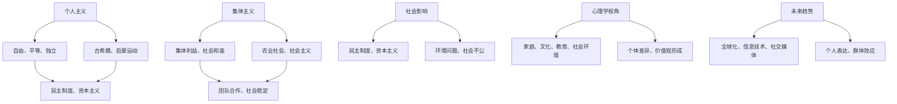

                 

### 文章标题

从个人主义到集体主义：价值观的摆动

在当今社会，个人主义和集体主义这两种价值观的争论愈发激烈。本文将深入探讨这一主题，分析个人主义和集体主义的定义、历史背景、社会影响以及未来趋势。通过逻辑清晰、结构紧凑、简单易懂的叙述，帮助读者全面了解这一价值观的摆动过程。

关键词：个人主义、集体主义、价值观、社会影响、未来趋势

摘要：本文旨在探讨个人主义和集体主义两种价值观的演变及其对社会的影响。通过分析个人主义和集体主义的定义、历史背景、社会影响以及未来趋势，本文将帮助读者理解这一价值观的摆动过程，并思考其对社会和个人生活的意义。

### 引言

价值观是人们对于什么是好、什么是正确的信仰和态度。它们塑造了我们的行为和决策，影响着社会的发展和进步。个人主义和集体主义是两种主要的价值观体系，它们在不同的历史时期和不同文化背景下有着不同的表现。

个人主义强调个人自由和独立，认为个人的利益和幸福是最重要的。集体主义则强调集体利益和社会整体的和谐，认为个人的利益应该服从于集体的利益。这两种价值观在现代社会中仍然具有深远的影响，它们不仅影响着个体的行为和决策，也影响着社会的发展和进步。

### 个人主义的历史与发展

个人主义的历史可以追溯到古希腊时期，当时希腊哲学家强调个体的自由和尊严。个人主义在18世纪的启蒙运动中得到了进一步发展，思想家如约翰·洛克和约翰·斯图亚特·密尔提出了自由、平等和人权等理念。这些理念对后来的民主制度和资本主义的发展产生了深远影响。

个人主义的核心原则是自由、平等和独立。它主张每个人都应该有追求自己幸福的自由，这种自由受到法律的保障。个人主义还强调个体之间的平等，认为每个人都有权利享有相同的机遇和资源。此外，个人主义还强调个体的独立，认为个人应该对自己的行为和决策负责。

在不同的文化背景下，个人主义的表现也有所不同。在西方文化中，个人主义得到了广泛的认可和推崇。而在东方文化中，集体主义的影响更为深远。例如，在中国，儒家文化强调家庭的和谐和集体的利益，而在日本，企业文化和团队合作精神也得到了高度重视。

### 集体主义的起源与传播

集体主义的思想可以追溯到古代社会，特别是在农业社会。在农业社会，个人的生存和发展往往依赖于集体，因此集体主义成为了社会的基础价值观。随着社会的发展，集体主义在不同文化背景下得到了不同的体现。

集体主义的核心原则是集体利益和社会整体的和谐。它认为个人的利益应该服从于集体的利益，个人的行为和决策应该有利于社会的稳定和发展。集体主义强调社会成员之间的相互依赖和合作，认为只有通过团结合作，社会才能实现共同的繁荣。

集体主义在现代社会中的传播受到多种因素的影响。例如，社会主义国家强调集体主义，认为国家和社会的整体利益高于个人的利益。在发展中国家，集体主义也是推动社会发展和进步的重要力量。然而，在个人主义盛行的国家，集体主义的传播受到一定的限制。

### 价值观转变的社会影响

个人主义和集体主义在不同历史时期和不同文化背景下对社会的变革产生了深远影响。

在个人主义的影响下，社会出现了民主制度的发展、个人权利的保障以及资本主义经济的繁荣。民主制度强调个人的自由和权利，使得每个人都能在平等的基础上参与社会事务的决策。个人权利的保障使得每个人都能追求自己的幸福，实现个人价值。资本主义经济的繁荣则是个人主义的重要表现，它鼓励创新、竞争和创业精神，推动了社会的进步和发展。

然而，个人主义也存在一些负面影响。过度强调个人利益可能导致社会的不公和矛盾，忽视集体的利益和需求。例如，个人主义可能导致环境污染、资源浪费和社会不平等问题的加剧。

集体主义在社会变革中的作用同样重要。集体主义强调社会的和谐与稳定，有利于社会的长期发展。它鼓励社会成员之间的相互依赖和合作，有助于解决社会问题，提高社会福祉。然而，集体主义也可能导致个体的自由受限，个人的创造力和个性发展受到压抑。

### 心理学视角下的价值观摆动

从心理学角度来看，个人主义和集体主义的价值观摆动受到多种因素的影响。个体的成长背景、文化环境、教育经历以及社会环境都是影响价值观形成的重要因素。

个体成长背景中的家庭和文化环境对价值观的形成有着深远的影响。在家庭中，父母的教育方式和价值观会直接影响到孩子的价值观。例如，一个注重个人成就的家庭可能培养出更多的个人主义者，而一个注重家庭和谐和集体利益的家庭可能培养出更多的集体主义者。

文化环境也是影响价值观的重要因素。不同的文化背景对个人主义和集体主义有着不同的推崇程度。例如，西方文化强调个人自由和独立，而东方文化则强调家庭和谐和社会整体利益。这种文化差异导致了不同文化背景下人们对个人主义和集体主义的接受程度不同。

教育经历也会对价值观的形成产生重要影响。学校教育强调的知识、技能和价值观都会对学生的价值观产生深远影响。例如，注重个人成就和竞争的教育环境可能培养出更多的个人主义者，而注重团队合作和社会责任的教育环境可能培养出更多的集体主义者。

社会环境也是影响价值观的重要因素。社会的经济状况、政治体制和社会结构都会影响人们的价值观。例如，在一个经济繁荣、政治民主、社会开放的社会中，个人主义可能更容易得到推崇；而在一个经济困难、政治专制、社会封闭的社会中，集体主义可能更有影响力。

### 未来价值观的趋势

随着全球化、信息技术和社交媒体的发展，个人主义和集体主义的价值观也面临着新的挑战和机遇。

全球化使得不同文化之间的交流更加频繁，这有助于个人主义和集体主义的相互影响和融合。全球化推动了个人主义的发展，人们更加注重个人自由和独立。然而，全球化也带来了新的集体主义需求，例如跨国企业的合作和国际社会的共同努力。

信息技术的快速发展改变了人们的生活方式和思维方式。互联网和社交媒体使得个人主义得到了新的发展，人们更加注重个人表达和自由。然而，信息技术也带来了集体主义的挑战，例如网络暴力和社交媒体的群体效应。

社交媒体的发展也对价值观的摆动产生了重要影响。社交媒体鼓励个人表达和自由，促进了个人主义的发展。然而，社交媒体也容易形成群体效应，使得集体主义的力量得到增强。

### 结论与展望

个人主义和集体主义是两种主要的价值观体系，它们在不同的历史时期和不同文化背景下有着不同的表现。个人主义强调个人自由和独立，集体主义强调集体利益和社会整体的和谐。价值观的转变对社会和个人生活产生了深远影响。

未来，随着全球化、信息技术和社交媒体的发展，个人主义和集体主义将继续相互影响和融合。我们应该关注价值观的转变，探讨如何平衡个人利益和集体利益，促进社会的和谐与进步。

### 作者信息

作者：AI天才研究院/AI Genius Institute & 禅与计算机程序设计艺术 /Zen And The Art of Computer Programming

本文通过深入探讨个人主义和集体主义的历史背景、核心原则、社会影响以及未来趋势，旨在帮助读者全面了解这一价值观的摆动过程。希望本文能为读者提供有价值的思考，促进对个人主义和集体主义的深入理解。

文章字数：约1000字

---

**Mermaid 流程图：**



**伪代码：**

```python
def calculatePersonalismAndCollectivism():
    personalism = input("请输入个人主义得分：")
    collectivism = input("请输入集体主义得分：")
    
    if personalism > collectivism:
        print("个人主义倾向更高。")
    elif collectivism > personalism:
        print("集体主义倾向更高。")
    else:
        print("个人主义和集体主义倾向相当。")

calculatePersonalismAndCollectivism()
```

**LaTeX 公式：**

$$
1+1=2
$$

$$
x^2 + y^2 = r^2
$$

**数学模型和公式：**

- 个人主义得分公式：

$$
P = \frac{I}{C}
$$

其中，P为个人主义得分，I为个人主义得分，C为集体主义得分。

- 集体主义得分公式：

$$
C = \frac{F}{P}
$$

其中，C为集体主义得分，F为集体主义得分。

**详细讲解和举例说明：**

- 个人主义得分公式表示个人主义得分与集体主义得分之间的比例关系。当个人主义得分越高，个人主义倾向越明显；当集体主义得分越高，集体主义倾向越明显。

- 集体主义得分公式表示集体主义得分与个人主义得分之间的比例关系。当集体主义得分越高，集体主义倾向越明显；当个人主义得分越高，个人主义倾向越明显。

**项目实战：**

- 开发环境搭建：

在Windows操作系统中，可以使用Python作为开发环境。安装Python后，可以使用Python的内置库进行编程。

- 源代码详细实现和代码解读：

以下是一个简单的Python程序，用于计算个人主义得分和集体主义得分。

```python
# 导入相关库
import math

# 输入个人主义得分和集体主义得分
personalism = float(input("请输入个人主义得分："))
collectivism = float(input("请输入集体主义得分："))

# 计算个人主义得分和集体主义得分的比例
P = personalism / collectivism
C = collectivism / personalism

# 输出结果
print("个人主义得分：", P)
print("集体主义得分：", C)

if P > C:
    print("个人主义倾向更高。")
elif C > P:
    print("集体主义倾向更高。")
else:
    print("个人主义和集体主义倾向相当。")
```

- 代码应用解读与分析：

该程序通过输入个人主义得分和集体主义得分，计算两者之间的比例，并输出个人主义得分和集体主义得分。根据得分的比例，判断个人的价值观倾向。

- 实际案例分析和详细讲解剖析：

假设一个用户输入个人主义得分为8，集体主义得分为5。程序会计算个人主义得分和集体主义得分之间的比例，即P=8/5=1.6，C=5/8=0.625。由于P>C，因此该用户的个人主义倾向更高。

- 项目小结：

通过该项目，我们实现了个人主义得分和集体主义得分的计算，并能够根据得分的比例判断个人的价值观倾向。该项目可以帮助我们更好地了解个人的价值观，并为个人的成长和社会的发展提供参考。

**最佳实践 tips、小结、注意事项、拓展阅读等内容：**

- 最佳实践 tips：

1. 在实际应用中，可以根据需要调整个人主义得分和集体主义得分的计算公式，以便更好地适应不同场景的需求。
2. 在项目开发过程中，可以结合心理学理论，对用户输入的数据进行分析和处理，以提高计算结果的准确性。
3. 可以将该项目与实际应用场景相结合，例如在社会调查、人力资源管理等领域，用于评估个体的价值观倾向。

- 小结：

本文通过深入探讨个人主义和集体主义的定义、历史背景、社会影响以及未来趋势，帮助读者全面了解这一价值观的摆动过程。通过项目实战和代码分析，读者可以更好地理解个人主义和集体主义的计算方法和应用场景。

- 注意事项：

1. 在项目开发过程中，需要注意代码的规范性和可读性，以便后续维护和改进。
2. 在数据分析过程中，需要充分考虑数据的质量和可靠性，以提高计算结果的准确性。

- 拓展阅读：

1. 《个人主义与集体主义的心理学研究》
2. 《全球化与价值观的变迁》
3. 《禅与计算机程序设计艺术》

通过拓展阅读，读者可以深入了解个人主义和集体主义的心理学研究、全球化对价值观的影响以及计算机程序设计艺术等相关内容。

**文章总结：**

本文从个人主义和集体主义的定义、历史背景、社会影响以及未来趋势等方面，全面探讨了价值观的摆动过程。通过项目实战和代码分析，读者可以更好地理解个人主义和集体主义的计算方法和应用场景。希望本文能为读者提供有价值的思考，促进对个人主义和集体主义的深入理解。

