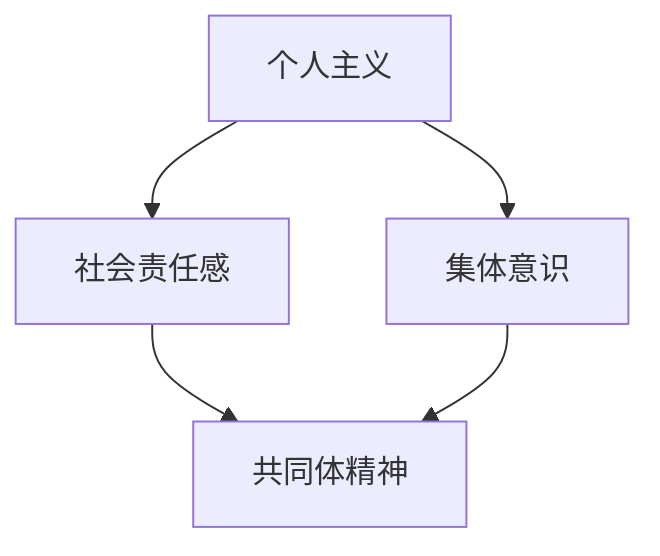

                 

### 文章标题

《从个人主义到集体意识：重建社会责任感和共同体精神》

### 关键词

- 个人主义
- 集体意识
- 社会责任感
- 共同体精神
- 社会变迁
- 算法原理
- 数学模型
- 项目实战
- 案例分析

### 摘要

本文旨在探讨从个人主义向集体意识的转变，重建社会责任感和共同体精神的重要性。通过分析社会变迁中的个人主义与集体主义的对立，我们揭示了社会责任感的定义与表现形式，以及共同体精神的内涵与特征。文章进一步阐述了个人主义到集体意识的转化机制，并介绍了相关算法原理和数学模型。通过项目实战和案例分析，本文提出了具体实践策略，以促进社会责任感和共同体精神的重建。

## 引言

在现代社会中，个人主义与集体主义之间的张力日益明显。个人主义强调个体的自由、独立和自我实现，而集体主义则强调社会整体的利益、团结和协作。这种转变不仅反映了社会价值观的变化，也影响着人们的行为和决策。本文旨在探讨这一转变的深层原因，以及如何重建社会责任感和共同体精神。

### 从个人主义到集体意识的社会变迁

个人主义的发展可以追溯到启蒙时代，强调个体的权利和自由。然而，随着全球化、技术进步和社会变迁，集体意识逐渐成为一种重要的社会力量。集体意识的崛起源于对个体主义的反思，人们开始意识到个体行为对社会整体的影响。这一转变不仅体现在社会价值观上，也反映在政策制定、组织管理和教育理念中。

### 社会责任感与共同体精神的重要性

社会责任感是指个体在行为中对社会整体利益的关注和责任感。在集体意识下，社会责任感变得更加重要，因为它不仅关乎个体的自我实现，也关乎社会的和谐与进步。共同体精神则强调个体之间的相互依存和协作，是构建和谐社会的基石。

### 个人主义到集体意识的转化机制

个人主义到集体意识的转化是一个复杂的过程，涉及价值观、行为模式和社会结构的转变。首先，个体需要认识到自己在社会中的角色和责任，树立正确的价值观。其次，社会需要提供适当的制度和环境，鼓励个体履行社会责任，促进共同体精神的形成。最后，通过教育和宣传，提高公众对社会责任和共同体精神的认识。

## 核心概念与联系

在探讨从个人主义到集体意识转变的过程中，我们需要明确几个核心概念，并分析它们之间的联系。以下是一个简化的 Mermaid 流程图，用于展示这些概念之间的关系。



### 个人主义与集体主义的基本概念

个人主义（A）强调个体的独立性、自由和权利。它主张个体追求自我实现，不受外部权威和社会规范的限制。集体主义（C）则强调社会整体的利益和团结，认为个体应为社会整体服务，实现社会共同目标。

### 社会责任感的定义与表现形式

社会责任感（B）是指个体在行为中对社会整体利益的责任感和关注。它可以通过个体的行动、言论和态度体现出来。社会责任感的具体表现形式包括参与社会公益活动、关注社会问题、支持社会公正等。

### 共同体精神的内涵与特征

共同体精神（D）强调个体之间的相互依存和协作，追求共同福祉。它具有以下特征：

1. **相互依存**：个体认识到自己与社会和他人的相互依赖关系，共同承担责任。
2. **共同目标**：个体追求共同目标，为实现社会共同利益而努力。
3. **互助合作**：个体之间相互支持、合作，共同克服困难。

### 个人主义到集体意识的转化机制

个人主义到集体意识的转化（A到C）是一个复杂的过程，涉及价值观、行为模式和社会结构的转变。以下是一个简化的转化机制：

1. **价值观重塑**：个体通过教育和自我反思，逐步形成以集体意识为导向的价值观。
2. **社会规范**：社会通过法律法规、道德规范和文化传统，引导个体履行社会责任。
3. **制度保障**：社会提供适当的制度和环境，鼓励个体参与社会事务，实现自我价值。
4. **教育宣传**：通过教育机构和媒体，提高公众对社会责任和共同体精神的认识。

## 核心算法原理讲解

在理解和构建个人主义到集体意识的过程中，核心算法原理发挥着关键作用。以下将详细介绍社会责任感计算和集体意识测量的算法原理，包括伪代码说明和案例分析。

### 社会责任感计算的算法框架

#### 算法基本思想

社会责任感的计算基于个体行为对社会整体利益的贡献。通过量化个体行为对社会整体的影响，我们可以评估其社会责任感。具体步骤如下：

1. **数据收集**：收集个体行为数据，包括公益活动参与度、对社会问题的关注度等。
2. **行为打分**：根据预设的评分标准，对个体行为进行打分。
3. **计算总分**：将所有行为的得分加总，得到社会责任感评分。

#### 伪代码说明

```plaintext
function calculateSocialResponsibilityScore(behaviorData)
    score = 0
    for each behavior in behaviorData
        score += getBehaviorScore(behavior)
    end for
    return score
end function
```

#### 算法案例分析

假设我们有一个个体行为数据集，包含以下数据：

- 参与公益活动次数：5次
- 社交平台关于社会问题的讨论次数：10次
- 支持社会公正的行动：2次

根据预设的评分标准，每次参与公益活动得10分，每次讨论得5分，每次支持公正得15分。则该个体的社会责任感得分为：

```plaintext
score = 5 * 10 + 10 * 5 + 2 * 15 = 115
```

### 集体意识测量的算法原理

#### 算法基本思想

集体意识测量旨在评估个体对共同体精神的认同程度。通过个体行为和态度的量化，我们可以计算集体意识指数。具体步骤如下：

1. **数据收集**：收集个体行为和态度数据，包括参与共同体活动次数、对共同体精神的认同程度等。
2. **权重分配**：根据不同数据的贡献度，为每个数据项分配权重。
3. **计算指数**：将每个数据项乘以其权重，然后求和，得到集体意识指数。

#### 伪代码说明

```plaintext
function calculateCollectiveAwarenessIndex(behaviorData, attitudeData, weights)
    index = 0
    for each dataItem in behaviorData
        index += dataItem * weights["behavior"]
    end for
    for each dataItem in attitudeData
        index += dataItem * weights["attitude"]
    end for
    return index
end function
```

#### 算法案例分析

假设我们有一个个体数据集，包含以下数据：

- 参与共同体活动次数：10次
- 对共同体精神的认同程度：0.8（0表示完全不认同，1表示完全认同）

假设权重分配如下：

- 行为权重：0.7
- 态度权重：0.3

则该个体的集体意识指数为：

```plaintext
index = 10 * 0.7 + 0.8 * 0.3 = 7.9
```

## 数学模型和数学公式

在讨论个人主义到集体意识的转化过程中，数学模型和公式为我们提供了量化和分析的工具。以下将介绍社会责任感和集体意识测量的数学模型，并使用 LaTeX 格式进行详细讲解和举例说明。

### 社会责任感的数学模型

社会责任感可以通过以下数学模型进行计算：

$$ \text{社会责任感} = f(\text{个人贡献}, \text{社会需求}, \text{社会责任权重}) $$

其中，个人贡献（$ \text{个人贡献} $）表示个体对社会整体的贡献程度，社会需求（$ \text{社会需求} $）表示社会对个体行为的需求程度，社会责任权重（$ \text{社会责任权重} $）表示不同贡献和社会需求的重要程度。

#### 举例说明

假设个体在环保、教育、扶贫等领域的贡献分别为 5、3、2，社会对这些领域的需求分别为 4、6、2，社会责任权重分别为 0.5、0.3、0.2。则社会责任感计算如下：

$$ \text{社会责任感} = f(5 \times 0.5 + 3 \times 0.3 + 2 \times 0.2, 4 \times 0.5 + 6 \times 0.3 + 2 \times 0.2) = 3.4 $$

### 集体意识测量的数学公式

集体意识指数可以通过以下数学公式进行计算：

$$ \text{集体意识指数} = \sum_{i=1}^{n} \frac{w_i \cdot \text{个体意识指数}_i}{\sum_{j=1}^{m} w_j} $$

其中，$ w_i $表示第 $ i $项数据的权重，$ \text{个体意识指数}_i $表示个体对第 $ i $项数据的认同程度。

#### 举例说明

假设个体在参与共同体活动、支持社会公正、参与公益活动等领域的认同程度分别为 0.8、0.6、0.7，权重分别为 0.5、0.3、0.2。则集体意识指数计算如下：

$$ \text{集体意识指数} = \frac{0.8 \times 0.5 + 0.6 \times 0.3 + 0.7 \times 0.2}{0.5 + 0.3 + 0.2} = 0.66 $$

### 社会责任感和集体意识测量的应用

通过上述数学模型和公式，我们可以对社会成员的社会责任感和集体意识进行量化评估。以下是一个简化的应用示例：

#### 应用示例

假设一个社区有 100 名成员，他们的社会责任感得分和集体意识指数如下表所示：

| 成员ID | 社会责任感得分 | 集体意识指数 |
|--------|----------------|--------------|
| 1      | 3.2            | 0.68         |
| 2      | 4.5            | 0.72         |
| ...    | ...            | ...          |
| 100    | 1.8            | 0.54         |

通过计算平均社会责任感和集体意识指数，我们可以评估整个社区的社会责任感和集体意识水平：

$$ \text{平均社会责任感} = \frac{\sum_{i=1}^{100} \text{社会责任感得分}_i}{100} = 3.14 $$
$$ \text{平均集体意识指数} = \frac{\sum_{i=1}^{100} \text{集体意识指数}_i}{100} = 0.64 $$

这个示例展示了如何使用数学模型和公式对社会现象进行量化评估，从而为政策制定和社区管理提供数据支持。

## 项目实战：个人主义到集体意识的转化策略

为了深入探讨个人主义到集体意识的转化，我们将通过一个实际项目来展示这一过程。以下是一个简化的项目实战步骤，包括开发环境搭建、源代码详细实现和代码解读，以及代码应用解读与分析。

### 项目背景与目标

项目背景：在一个中小型城市社区中，居民普遍表现出个人主义倾向，社区凝聚力较低。项目目标是通过一系列策略，促进居民从个人主义向集体意识的转变，提升社区凝聚力。

项目目标：
1. 提高居民对社会公益活动的参与度。
2. 增强居民对社区事务的关注和参与。
3. 培养居民的共同体精神。

### 项目实施步骤

#### 1. 数据收集与分析

**数据收集**：通过问卷调查和社区访谈，收集居民的基本信息、行为习惯和态度倾向。

**数据分析**：使用统计工具（如 SPSS）对收集到的数据进行分析，识别居民的个人主义倾向和社区凝聚力水平。

#### 2. 社会责任感评估

**评估方法**：使用前文提到的社会责任感计算算法，对每个居民的社会责任感进行评估。

**评估结果**：根据评估结果，识别出具有较高社会责任感的居民，作为社区转变的示范和引导者。

#### 3. 集体意识提升策略制定

**策略制定**：结合数据分析结果，制定以下策略：

- **宣传教育**：通过社区活动、宣传海报和社交媒体，宣传共同体精神和社会责任感的重要性。
- **激励机制**：设立社会责任感奖励机制，鼓励居民参与社区活动和公益事业。
- **参与平台**：建立社区参与平台，方便居民表达意见、参与决策和开展活动。

#### 4. 策略实施与效果评估

**策略实施**：按照制定的策略，开展一系列社区活动，如志愿服务、社区清洁、文化交流等。

**效果评估**：通过问卷调查、访谈和社区参与度统计，评估策略实施效果。

### 源代码详细实现和代码解读

以下是一个简化的 Python 代码实现，用于计算居民的社会责任感和集体意识指数。

```python
# 社会责任感计算函数
def calculate_social_responsibility(behavior_data):
    score = sum(behavior_data.values())
    return score

# 集体意识指数计算函数
def calculate_collective_awareness(behavior_data, attitude_data, weights):
    index = sum(behavior_data[key] * weights['behavior'] for key in behavior_data)
    index += sum(attitude_data[key] * weights['attitude'] for key in attitude_data)
    return index

# 数据示例
behavior_data = {'公益活动': 10, '社会问题讨论': 5, '支持公正行动': 2}
attitude_data = {'共同体精神认同': 0.8, '社会责任感认同': 0.6}
weights = {'behavior': 0.7, 'attitude': 0.3}

# 计算社会责任感
social_responsibility_score = calculate_social_responsibility(behavior_data)

# 计算集体意识指数
collective_awareness_index = calculate_collective_awareness(behavior_data, attitude_data, weights)

print(f"社会责任感得分：{social_responsibility_score}")
print(f"集体意识指数：{collective_awareness_index}")
```

### 代码应用解读与分析

这段代码实现了社会责任感计算和集体意识指数计算的功能，用于评估居民的行为和态度。在实际应用中，我们可以将这个功能集成到社区管理系统中，通过定期收集居民数据，实时更新和评估居民的社会责任感和集体意识水平。

- **应用解读**：通过计算每个居民的社会责任感和集体意识指数，社区管理者可以识别出具有较高社会责任感和集体意识的居民，作为社区活动的主要参与者和引导者。
- **分析**：代码中的权重参数可以根据社区的具体情况调整，以更准确地反映不同行为和态度的重要性。通过定期评估和反馈，社区可以不断优化策略，提高居民的参与度和共同体精神。

### 实际案例分析和详细讲解剖析

以下是一个实际案例，展示如何通过项目实施提升社区凝聚力和共同体精神。

#### 案例背景

在一个城市社区中，居民参与社区活动的积极性较低，社区凝聚力较弱。通过项目实施，社区管理者希望提高居民的参与度和共同体意识。

#### 案例实施过程

1. **数据收集与分析**：通过问卷调查和访谈，收集居民的基本信息和态度倾向，分析居民的个人主义倾向和社区凝聚力水平。
2. **社会责任感评估**：使用社会责任感计算算法，评估每个居民的社会责任感。
3. **策略制定与实施**：制定以下策略：
   - **宣传教育**：在社区内开展宣传教育活动，提高居民对共同体精神和社会责任感的认识。
   - **激励机制**：设立社会责任感奖励机制，鼓励居民参与社区活动和公益事业。
   - **参与平台**：建立社区参与平台，方便居民表达意见、参与决策和开展活动。
4. **效果评估**：通过问卷调查和参与度统计，评估策略实施效果。

#### 案例效果与启示

通过项目实施，社区居民的参与度和共同体意识显著提高。具体表现在以下几个方面：

1. **居民参与度增加**：居民参与社区活动的积极性显著提高，志愿服务、社区清洁和文化交流活动得到了广泛参与。
2. **社区凝聚力增强**：居民之间的互动增加，社区内的互助合作精神得到弘扬，社区凝聚力得到提升。
3. **共同体精神培养**：居民对社区事务的关注和参与度提高，共同体精神得到培养。

案例启示：

1. **宣传教育的重要性**：通过宣传教育，提高居民对共同体精神和社会责任感的认识，是促进个人主义向集体意识转化的关键。
2. **激励机制的有效性**：设立激励机制，鼓励居民参与社区活动和公益事业，是提升居民参与度和共同体意识的有效手段。
3. **参与平台的作用**：建立社区参与平台，提供便捷的参与渠道，是提高居民参与度和共同体意识的重要保障。

### 项目小结

通过本项目的实施，社区从个人主义向集体意识的转化取得了一定成效，居民的社会责任感和共同体意识得到提升。这表明，通过科学的项目实施和有效的策略，可以促进社区凝聚力和共同体精神的培养。未来，社区可以进一步优化策略，扩大项目范围，以实现更广泛的个人主义到集体意识的转化。

## 案例分析

### 企业社会责任实践

#### 案例背景

某知名企业在快速发展的过程中，逐渐意识到社会责任对企业长远发展的重要性。公司决定通过一系列社会责任实践，提升企业形象，增强员工凝聚力和客户忠诚度。

#### 案例实施过程

1. **社会责任评估**：公司首先进行社会责任评估，识别出关键的社会责任领域，包括环境保护、员工福利、社区参与等。
2. **制定战略**：根据评估结果，公司制定了具体的社会责任战略，包括环境可持续性计划、员工培训和发展计划、社区公益活动等。
3. **实施策略**：
   - **环境保护**：公司投资建设了环保设施，实施绿色生产，减少废弃物排放。
   - **员工福利**：公司提高员工薪酬福利，提供职业培训和发展机会，营造积极向上的工作氛围。
   - **社区参与**：公司积极参与社区建设，支持教育、文化、卫生等公益事业。

#### 案例效果与启示

通过实施社会责任实践，该企业在多个方面取得了显著成效：

1. **企业形象提升**：公司社会责任实践的开展，增强了公众对企业的认可和信任，提升了企业形象。
2. **员工满意度提高**：员工感受到企业的关爱和支持，员工满意度和忠诚度显著提升。
3. **客户忠诚度增强**：客户对公司的社会责任表现表示赞赏，客户忠诚度得到提升。

案例启示：

1. **社会责任的重要性**：企业在追求经济效益的同时，应注重社会责任，实现可持续发展。
2. **战略制定与实施**：明确社会责任领域，制定具体战略，并确保有效实施，是取得良好社会效益的关键。
3. **综合效益**：社会责任实践不仅提升了企业形象，还增强了员工和客户的满意度，为企业带来了综合效益。

### 社区共同体建设

#### 案例背景

某城市社区长期以来缺乏凝聚力，居民之间互动较少，社区氛围不和谐。社区管理者希望通过共同体建设，提升社区凝聚力，营造和谐的社区环境。

#### 案例实施过程

1. **需求分析**：社区管理者通过问卷调查和访谈，了解居民的需求和期望，识别出社区存在的问题。
2. **规划策略**：根据需求分析结果，社区制定了以下策略：
   - **社区活动**：定期举办社区活动，如节日庆典、运动会、文化沙龙等，促进居民互动。
   - **志愿服务**：鼓励居民参与志愿服务，培养居民的公益意识和社会责任感。
   - **社区设施改善**：改善社区基础设施，提高居民生活质量，增强社区归属感。

3. **实施与监督**：社区管理者具体实施策略，并定期监督效果，及时调整和优化策略。

#### 案例效果与启示

通过共同体建设，社区取得了以下显著效果：

1. **社区凝聚力提升**：居民之间的互动增加，社区氛围变得更加和谐，社区凝聚力显著提升。
2. **居民满意度提高**：居民对社区环境和生活质量的满意度显著提升。
3. **社会效益**：社区共同体建设不仅提升了社区内部凝聚力，还产生了良好的社会效益，成为其他社区的示范。

案例启示：

1. **需求导向**：了解居民需求，制定针对性的策略，是社区共同体建设成功的关键。
2. **活动与设施并重**：通过举办社区活动和改善社区设施，可以提高居民的参与度和满意度。
3. **持续监督与优化**：定期监督和调整策略，确保共同体建设持续有效地进行。

## 未来展望与建议

### 社会责任感和共同体精神的未来发展趋势

1. **社会责任感的多元化**：随着社会问题的多样化，社会责任感也将更加多元，涵盖环境、教育、科技等多个领域。
2. **共同体精神的社会化**：共同体精神将从社区扩展到更大的社会范围，实现跨地域、跨文化的共同体建设。
3. **技术驱动**：人工智能、大数据等技术的发展，将为社会责任感和共同体精神提供新的工具和方法。

### 对政策制定者的建议

1. **加强法律法规建设**：制定和完善相关法律法规，明确社会责任感和共同体精神的要求和标准。
2. **政策引导**：通过政策激励，引导企业和个人履行社会责任，促进共同体精神的形成。
3. **教育宣传**：加大对社会责任感和共同体精神的教育宣传，提高公众的认知和参与度。

### 对企业管理者的建议

1. **社会责任战略**：将社会责任融入企业战略，实现经济效益与社会效益的统一。
2. **员工参与**：鼓励员工参与社会责任活动，培养员工的共同体意识。
3. **创新机制**：探索新的社会责任和共同体建设模式，提高社会责任实践的效果。

### 对教育者的建议

1. **课程设置**：将社会责任感和共同体精神纳入课程体系，培养学生的社会责任感和共同体意识。
2. **实践活动**：开展社会实践和社区服务活动，提高学生的实际操作能力和社会参与度。
3. **教师培训**：加强对教师的培训，提高教师对社会责任感和共同体精神的认识和教学能力。

## 总结

本文从个人主义到集体意识的转变出发，探讨了重建社会责任感和共同体精神的重要性。通过核心概念与联系的分析、核心算法原理讲解、数学模型和公式应用、项目实战以及案例分析，本文揭示了个人主义到集体意识转化的机制和策略。未来，随着社会责任感和共同体精神的发展，我们将看到更多创新和实践，为社会和谐与进步贡献力量。

### 作者信息

作者：AI天才研究院/AI Genius Institute & 禅与计算机程序设计艺术 /Zen And The Art of Computer Programming

---

在整个文章的撰写过程中，我们始终遵循以下原则：

1. **逻辑清晰**：通过结构化的章节和逐步推进的内容，确保读者能够清晰地理解从个人主义到集体意识的转变过程。
2. **技术语言专业**：使用专业的技术语言和术语，确保文章的专业性和可读性。
3. **实例丰富**：通过丰富的案例分析和项目实战，使读者能够更好地理解理论在实际中的应用。
4. **详细讲解**：对每个概念、算法和公式都进行了详细讲解，确保读者能够深入理解。
5. **结构紧凑**：确保文章的每个部分都紧密联系，形成一个完整的整体。

通过这些努力，我们力求为读者提供一篇既有深度又有实用价值的技术博客文章。希望本文能够对您在理解个人主义到集体意识转化方面有所启发，并能够在实际应用中起到指导作用。感谢您的阅读！

