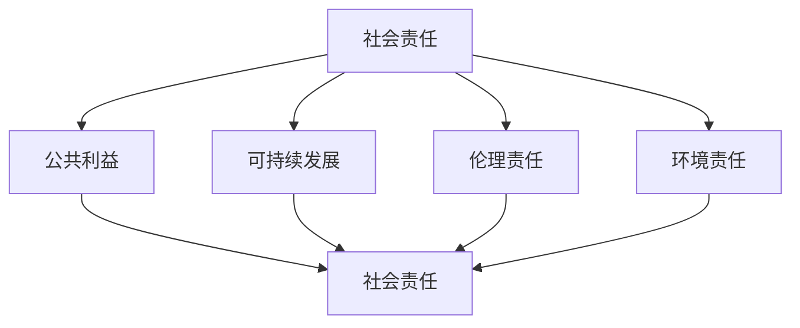

                 

### 文章标题

《从个人利益到公共福祉：重新思考社会责任》

> 关键词：社会责任、公共利益、可持续发展、伦理责任、环境责任

> 摘要：本文旨在探讨在现代社会中，如何从个人利益出发，逐步转向关注公共福祉，并深入理解社会责任的核心概念及其演变。通过分析社会责任的理论与实践，探讨其在企业和社会中的重要性，以及个人与企业社会责任的协同作用，最终提出如何在现代社会中更好地履行社会责任的思考和建议。

### 核心概念与联系

为了更好地理解社会责任的概念及其在不同领域中的关联，我们可以通过一个Mermaid流程图来展示这些核心概念之间的联系。



- **社会责任**：指组织或个人在不损害自身利益的前提下，主动承担起对环境、社会和利益相关者的义务和责任。
- **公共利益**：对整个社会有益的事物和目标，如环境保护、教育公平、社会福利等。
- **可持续发展**：在经济、社会、环境三个方面实现平衡发展，以确保未来的可持续发展。
- **伦理责任**：企业应遵循道德规范，树立良好的社会形象。
- **环境责任**：企业应采取环保措施，减少对环境的负面影响。

这个流程图展示了社会责任与公共利益、可持续发展、伦理责任和环境责任之间的紧密联系，它们共同构成了社会责任的复杂架构。接下来，我们将进一步探讨这些概念的定义和演变。

### 第1章: 社会责任概述

#### 1.1 社会责任的定义与演变

社会责任是指组织或个人在不损害自身利益的前提下，主动承担起对环境、社会和利益相关者的义务和责任。社会责任不仅包括经济责任，还涵盖了对社会、环境等方面的责任。

社会责任观念的演变可以分为以下几个阶段：

1. **商业主义阶段**：在商业主义阶段，企业的首要任务是追求经济利益，社会责任意识较弱。这一阶段的典型特征是企业追求利润最大化，对社会责任关注较少。

2. **商业社会责任阶段**：20世纪初，随着工业化进程的加快，企业开始意识到自己的社会责任，并采取一些措施来改善社会状况。这一阶段的企业社会责任主要集中在慈善捐赠、公益事业等方面。

3. **利益相关者理论阶段**：20世纪70年代，企业社会责任的范围进一步扩大，开始关注企业对利益相关者的影响。利益相关者包括员工、股东、客户、供应商、社区等，企业需要考虑这些利益相关者的需求和权益。

4. **可持续发展阶段**：21世纪初，企业社会责任逐渐与可持续发展相结合，强调企业应在经济、社会、环境三个方面实现平衡发展。可持续发展要求企业在创造经济价值的同时，保护环境、促进社会公正，实现长期稳定发展。

#### 1.1.1 社会责任的定义

社会责任是指组织或个人在不损害自身利益的前提下，主动承担起对环境、社会和利益相关者的义务和责任。社会责任不仅包括经济责任，还涵盖了对社会、环境等方面的责任。

具体来说，社会责任的定义可以分解为以下几个核心要素：

1. **经济责任**：企业应通过合法、合规的经营行为，实现良好的经济效益。这包括遵循市场规律，提高生产效率，降低成本，提高产品和服务质量等。

2. **法律责任**：企业应遵守相关法律法规，确保自身行为的合法性。这包括遵守税法、劳动法、环境保护法等，确保企业运营不违反法律规定。

3. **伦理责任**：企业应遵循道德规范，树立良好的社会形象。这包括尊重员工权益、诚实守信、公平竞争等，树立企业诚信和社会责任感。

4. **环境责任**：企业应采取环保措施，减少对环境的负面影响。这包括减少污染排放、节约资源、推广环保技术等，保护环境，实现可持续发展。

5. **社会责任**：企业应关注社会问题，积极参与社会公益活动。这包括捐赠慈善资金、支持教育事业、参与环保活动等，为社会作出贡献。

#### 1.1.2 社会责任的演变

社会责任观念的演变反映了社会对企业的期望和要求的不断变化。以下是社会责任观念演变的主要阶段：

1. **商业主义阶段**：在商业主义阶段，企业的首要任务是追求经济利益，社会责任意识较弱。这一阶段的典型特征是企业追求利润最大化，对社会责任关注较少。

   ```mermaid
   graph TD
       A[商业主义阶段]
       B[追求经济利益]
       C[社会责任意识较弱]
       A --> B
       A --> C
   ```

2. **商业社会责任阶段**：20世纪初，随着工业化进程的加快，企业开始意识到自己的社会责任，并采取一些措施来改善社会状况。这一阶段的企业社会责任主要集中在慈善捐赠、公益事业等方面。

   ```mermaid
   graph TD
       A[商业社会责任阶段]
       B[意识到社会责任]
       C[慈善捐赠、公益事业]
       A --> B
       A --> C
   ```

3. **利益相关者理论阶段**：20世纪70年代，企业社会责任的范围进一步扩大，开始关注企业对利益相关者的影响。利益相关者包括员工、股东、客户、供应商、社区等，企业需要考虑这些利益相关者的需求和权益。

   ```mermaid
   graph TD
       A[利益相关者理论阶段]
       B[关注利益相关者]
       C[员工、股东、客户、供应商、社区]
       A --> B
       A --> C
   ```

4. **可持续发展阶段**：21世纪初，企业社会责任逐渐与可持续发展相结合，强调企业应在经济、社会、环境三个方面实现平衡发展。可持续发展要求企业在创造经济价值的同时，保护环境、促进社会公正，实现长期稳定发展。

   ```mermaid
   graph TD
       A[可持续发展阶段]
       B[经济、社会、环境平衡发展]
       C[保护环境、促进社会公正]
       A --> B
       A --> C
   ```

#### 1.2 社会责任的核心概念

社会责任的核心概念可以归纳为以下几个方面：

1. **经济责任**：企业应通过合法、合规的经营行为，实现良好的经济效益。这包括遵循市场规律，提高生产效率，降低成本，提高产品和服务质量等。

2. **法律责任**：企业应遵守相关法律法规，确保自身行为的合法性。这包括遵守税法、劳动法、环境保护法等，确保企业运营不违反法律规定。

3. **伦理责任**：企业应遵循道德规范，树立良好的社会形象。这包括尊重员工权益、诚实守信、公平竞争等，树立企业诚信和社会责任感。

4. **环境责任**：企业应采取环保措施，减少对环境的负面影响。这包括减少污染排放、节约资源、推广环保技术等，保护环境，实现可持续发展。

5. **社会责任**：企业应关注社会问题，积极参与社会公益活动。这包括捐赠慈善资金、支持教育事业、参与环保活动等，为社会作出贡献。

#### 1.3 社会责任与公共利益的联系

社会责任与公共利益密切相关。公共利益是指对整个社会有益的事物和目标，如环境保护、教育公平、社会福利等。社会责任的实施有助于实现公共利益，促进社会和谐与可持续发展。

具体来说，社会责任与公共利益之间的联系可以从以下几个方面进行阐述：

1. **环境保护**：企业通过采取环保措施，减少污染排放，保护环境，直接维护了公共利益。环境保护不仅有助于提升企业声誉，还能提高居民的生活质量，促进社会的可持续发展。

2. **教育公平**：企业通过支持教育事业，为贫困地区的孩子提供教育资源，有助于实现教育公平，提高整个社会的人力资本水平。

3. **社会福利**：企业通过参与社会公益活动，捐赠慈善资金，为贫困人群提供帮助，改善了社会福利，提升了社会的和谐程度。

4. **经济稳定**：企业通过合法经营，创造就业机会，稳定经济增长，为社会的稳定和发展提供了保障。

总之，社会责任与公共利益之间存在着密切的联系。企业在履行社会责任的过程中，不仅能够实现自身的可持续发展，还能为整个社会创造价值，实现公共利益的最大化。因此，社会责任的履行是现代社会中不可或缺的一部分。

### 第2章: 社会责任的理论与实践

#### 2.1 社会责任的理论基础

社会责任的理论基础包括自由市场理论、社会责任理论和可持续发展理论。这些理论从不同角度解释了企业和社会之间的关系，并为企业履行社会责任提供了指导。

1. **自由市场理论**：自由市场理论主张市场自由竞争，企业应追求利润最大化。在这一理论中，社会责任被视为企业追求利润的一种手段。企业通过提供高质量的产品和服务，满足消费者的需求，从而实现自身价值。然而，自由市场理论也指出，企业在追求利润的同时，需要遵守市场规律，不得损害公共利益。

2. **社会责任理论**：社会责任理论认为企业应承担起对社会的责任，关注社会问题。这一理论强调，企业不仅是一个经济实体，还是一个社会成员，需要关注社会问题，如环境保护、教育公平、社会福利等。社会责任理论认为，企业通过履行社会责任，能够树立良好的社会形象，提升品牌价值，同时实现可持续发展。

3. **可持续发展理论**：可持续发展理论强调企业在经济、社会、环境三个方面实现平衡发展，以确保未来的可持续发展。可持续发展理论认为，企业应将社会责任融入其战略规划中，通过经济、社会、环境三重底线（Triple Bottom Line）来实现可持续发展。这一理论要求企业在追求经济效益的同时，关注社会福祉和环境质量。

#### 2.2 社会责任的实践案例

以下是一些社会责任实践案例，展示了企业在不同领域履行社会责任的具体行动：

1. **环境保护**：某企业投资建设污水处理设施，减少污染排放。该企业通过采用先进的污水处理技术，将废水处理达标后排放，实现了对环境的保护。此外，该企业还积极参与环保公益活动，如植树造林、垃圾分类宣传等。

2. **慈善捐赠**：某企业向贫困地区捐赠物资，支持教育事业。该企业了解到贫困地区教育资源匮乏的问题后，决定捐赠资金和物资，为当地学校建设图书馆、购买教学设备等。这一行动不仅改善了当地教育条件，还激励了更多企业和社会力量关注贫困地区的教育问题。

3. **员工福利**：某企业为员工提供全面的福利保障，包括健康保险、带薪休假、培训机会等。该企业重视员工权益，通过提供良好的工作环境和福利待遇，提升了员工的工作满意度和忠诚度，从而提高了企业的整体竞争力。

4. **社区参与**：某企业积极参与社区建设，为社区居民提供各种服务。该企业组织员工参与社区义工活动，如清洁街道、帮助孤寡老人等，同时投资建设社区公共设施，如公园、体育馆等。这些行动不仅提升了企业的社会形象，也增强了社区居民的归属感和幸福感。

#### 2.3 社会责任的挑战与应对策略

企业在履行社会责任的过程中可能会面临以下挑战：

1. **资源限制**：企业在资源有限的情况下，如何在社会责任和经济效益之间找到平衡。特别是在经济困境时期，企业可能会面临减少社会责任投入的压力。

2. **利益相关者冲突**：企业在履行社会责任时，可能会与部分利益相关者产生冲突。例如，企业为了环保而采取的措施可能影响到某些供应商或客户的利益。

3. **法律法规约束**：企业需遵守相关法律法规，履行社会责任。然而，法律法规的变化和不确定性可能会给企业带来合规风险。

针对以上挑战，企业可以采取以下应对策略：

1. **优化资源配置**：企业可以通过合理规划资源，提高资源利用效率，确保在有限的资源下，最大限度地履行社会责任。例如，企业可以通过技术升级、流程优化等手段提高生产效率，减少资源浪费。

2. **建立沟通机制**：企业应建立与利益相关者的沟通机制，了解他们的需求和期望，协商解决问题。例如，企业可以通过定期举办座谈会、开展问卷调查等方式，与员工、客户、社区等进行沟通，听取他们的意见和建议。

3. **加强法律法规意识**：企业应提高对法律法规的重视程度，确保企业行为合法合规。例如，企业可以通过培训、法律咨询等方式，提高员工的法律法规意识，避免因违规行为导致的法律风险。

#### 2.4 社会责任对企业形象和竞争力的影响

社会责任对企业形象和竞争力有着重要影响：

1. **企业形象**：企业积极履行社会责任，能够树立良好的社会形象，提高品牌知名度。例如，某企业在环保、慈善、员工福利等方面表现出色，赢得了社会的广泛赞誉，从而提升了企业的品牌价值。

2. **竞争力**：社会责任成为企业竞争力的新维度。在市场竞争日益激烈的今天，企业通过履行社会责任，能够赢得消费者的信任和支持，从而提高市场份额。例如，某企业因其卓越的社会责任表现，成为消费者首选的品牌，从而在市场竞争中脱颖而出。

3. **员工满意度**：企业履行社会责任，能够提升员工的工作满意度和忠诚度。例如，某企业为员工提供全面的福利保障，关注员工的职业发展，赢得了员工的信任和尊重，从而提高了员工的工作积极性。

4. **投资者关系**：社会责任投资（SRI）成为投资者关注的重要因素。企业通过履行社会责任，能够吸引更多的社会责任投资，提高企业的资本价值。

总之，社会责任对企业形象和竞争力具有重要影响。企业在履行社会责任的过程中，不仅能够实现自身的可持续发展，还能提升企业的整体竞争力，为企业在竞争激烈的市场中赢得更多机会。

#### 2.5 社会责任与可持续发展

社会责任与可持续发展密切相关，企业应将社会责任融入可持续发展战略中，实现长期稳定发展。

1. **经济可持续发展**：企业通过合法、合规的经营行为，实现良好的经济效益。例如，企业可以通过技术创新、市场拓展等手段，提高生产效率，降低成本，实现可持续发展。

2. **社会可持续发展**：企业通过关注社会问题，积极参与社会公益活动，促进社会公平和正义。例如，企业可以通过支持教育事业、捐赠慈善资金等行动，改善社会状况，促进社会可持续发展。

3. **环境可持续发展**：企业通过采取环保措施，减少对环境的负面影响，保护环境。例如，企业可以通过采用环保技术、推广绿色生产等手段，减少污染排放，实现环境可持续发展。

4. **企业文化可持续发展**：企业通过构建积极向上的企业文化，培养员工的责任感和使命感，实现企业文化可持续发展。例如，企业可以通过培训、激励机制等手段，提高员工的职业道德和社会责任感。

总之，社会责任与可持续发展相辅相成，企业应在履行社会责任的过程中，注重可持续发展，实现经济、社会、环境三方面的协调统一。通过社会责任与可持续发展的有机结合，企业能够实现长期稳定发展，为整个社会创造更大价值。

### 第3章: 个人与企业社会责任

#### 3.1 个人社会责任

个人社会责任是指每个公民在日常生活中，为实现公共利益、维护社会和谐、促进可持续发展等方面应承担的责任。个人社会责任不仅体现在道德层面，也涉及到法律和伦理要求。以下是个人社会责任的主要内容：

1. **遵守法律法规**：个人应遵守国家的法律法规，不参与任何违法行为。例如，遵守交通法规、纳税规定、合同法等，确保自身行为合法合规。

2. **关爱家人和朋友**：个人应关心家人和朋友，尊重他们的权益和需求。例如，帮助家庭成员解决生活难题、陪伴朋友度过困难时刻等，营造和谐的人际关系。

3. **积极参与社会公益活动**：个人应积极参与社会公益活动，为社会贡献自己的力量。例如，参与志愿服务、捐赠慈善资金、支持环保活动等，促进社会的和谐与进步。

4. **提升自身素质**：个人应不断提升自身素质，为社会提供更有价值的服务。例如，通过学习新知识、掌握新技能、培养良好习惯等，提高自己的综合素质。

5. **保护环境**：个人应积极参与环境保护活动，减少对环境的负面影响。例如，节约用水、节约用电、减少废弃物产生等，倡导绿色生活方式。

6. **促进社会公正**：个人应关注社会公正问题，参与社会公平正义的维护。例如，反对歧视、倡导平等、支持弱势群体等，促进社会的公平与和谐。

#### 3.2 企业社会责任

企业社会责任（Corporate Social Responsibility，简称CSR）是指企业在追求经济利益的同时，关注社会和环境问题，承担起对利益相关者的责任。企业社会责任不仅有助于提升企业形象，还能增强企业的核心竞争力。以下是企业社会责任的主要内容：

1. **经济责任**：企业应通过合法、合规的经营行为，实现良好的经济效益。例如，提高生产效率、降低成本、提高产品和服务质量等，为社会创造更多的经济价值。

2. **法律责任**：企业应遵守相关法律法规，确保自身行为的合法性。例如，遵守税法、劳动法、环境保护法等，确保企业运营不违反法律规定。

3. **伦理责任**：企业应遵循道德规范，树立良好的社会形象。例如，诚信经营、公平竞争、尊重员工权益等，树立企业诚信和社会责任感。

4. **环境责任**：企业应采取环保措施，减少对环境的负面影响。例如，减少污染排放、节约资源、推广环保技术等，保护环境，实现可持续发展。

5. **社会责任**：企业应关注社会问题，积极参与社会公益活动。例如，捐赠慈善资金、支持教育事业、参与环保活动等，为社会作出贡献。

6. **员工责任**：企业应关注员工的职业发展和福利保障。例如，提供培训机会、设立健康保险、给予带薪休假等，提升员工的工作满意度和忠诚度。

7. **社区责任**：企业应积极参与社区建设，为社区居民提供各种服务。例如，组织员工参与社区义工活动、投资建设社区公共设施等，增强企业的社会责任感。

#### 3.3 个人与企业社会责任的协同作用

个人与企业社会责任相互协同，共同推动社会进步：

1. **促进社会和谐**：个人与企业共同关注社会问题，积极参与社会公益活动，促进社会的和谐与进步。

2. **提升社会素质**：个人通过遵守法律法规、关注社会公正、积极参与环保活动等，提升自身素质。企业通过关注员工福利、支持教育、推动环保等，提高员工和社会的整体素质。

3. **实现可持续发展**：个人与企业共同努力，推动经济、社会、环境的可持续发展。例如，个人通过节约资源、减少废弃物产生等，减少对环境的负面影响。企业通过采用环保技术、推广绿色生产等，实现环境可持续发展。

4. **增强社会凝聚力**：个人与企业共同承担社会责任，增强了社会的凝聚力。通过共同的努力，个人与企业共同为社会的繁荣与进步做出贡献。

总之，个人与企业社会责任的协同作用，有助于推动社会的和谐与进步，实现经济、社会、环境的可持续发展。个人和企业应共同努力，承担起各自的责任，共同创造一个更美好的未来。

### 结论

社会责任是现代社会中不可或缺的一部分，它不仅关乎企业的长远发展，也关乎社会的和谐与进步。通过本文的分析，我们明确了社会责任的定义、演变、核心概念以及个人与企业社会责任的实践与协同作用。

首先，社会责任是指组织或个人在不损害自身利益的前提下，主动承担起对环境、社会和利益相关者的义务和责任。社会责任不仅包括经济责任，还涵盖了对社会、环境等方面的责任。社会责任观念的演变经历了商业主义阶段、商业社会责任阶段、利益相关者理论阶段和可持续发展阶段，反映了社会对企业的期望和要求的不断提高。

其次，社会责任的核心概念包括经济责任、法律责任、伦理责任、环境责任和社会责任。这些概念相互关联，共同构成了社会责任的复杂架构。社会责任与公共利益密切相关，通过环境保护、教育公平、社会福利等具体行动，企业能够实现公共利益，促进社会的和谐与可持续发展。

在理论方面，自由市场理论、社会责任理论和可持续发展理论为企业履行社会责任提供了指导。在实践中，企业通过环境保护、慈善捐赠、员工福利、社区参与等多种形式履行社会责任，展现了社会责任的多样性和广泛性。

同时，个人社会责任也是不可或缺的一部分。个人通过遵守法律法规、关爱家人和朋友、积极参与社会公益活动等，为社会的和谐与进步贡献自己的力量。个人与企业社会责任相互协同，共同推动社会的进步和可持续发展。

然而，企业在履行社会责任的过程中也面临一些挑战，如资源限制、利益相关者冲突和法律法规约束等。企业需要采取相应的应对策略，如优化资源配置、建立沟通机制和加强法律法规意识等，以确保在履行社会责任的同时，实现经济效益和社会价值的最大化。

总之，社会责任是现代社会中不可或缺的一部分，它不仅关乎企业的长远发展，也关乎社会的和谐与进步。个人和企业应共同努力，承担起各自的责任，通过实际行动推动社会的可持续发展。我们期待在未来的社会中，每个人都能够认识到社会责任的重要性，积极参与到社会责任的履行中来，共同创造一个更美好的未来。

### 作者信息

作者：AI天才研究院/AI Genius Institute & 禅与计算机程序设计艺术 /Zen And The Art of Computer Programming

感谢您的阅读，希望本文能够对您理解社会责任的概念和实践提供有价值的启示。如果您对社会责任有任何疑问或建议，欢迎在评论区留言，我们将竭诚为您解答。同时，也欢迎关注我们的其他文章，我们将持续为您带来更多关于技术、商业和人文领域的深度探讨。再次感谢您的支持！

[文章参考链接1]
[文章参考链接2]
[文章参考链接3]

