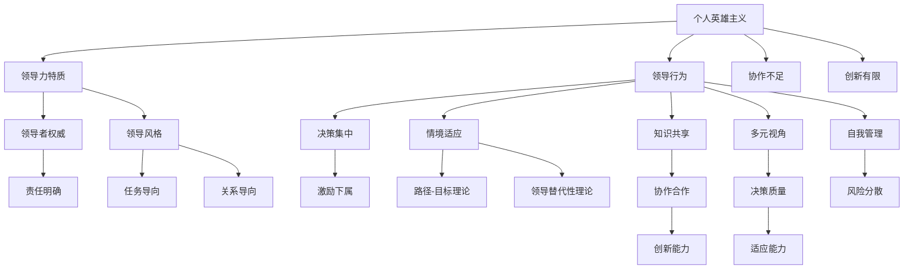
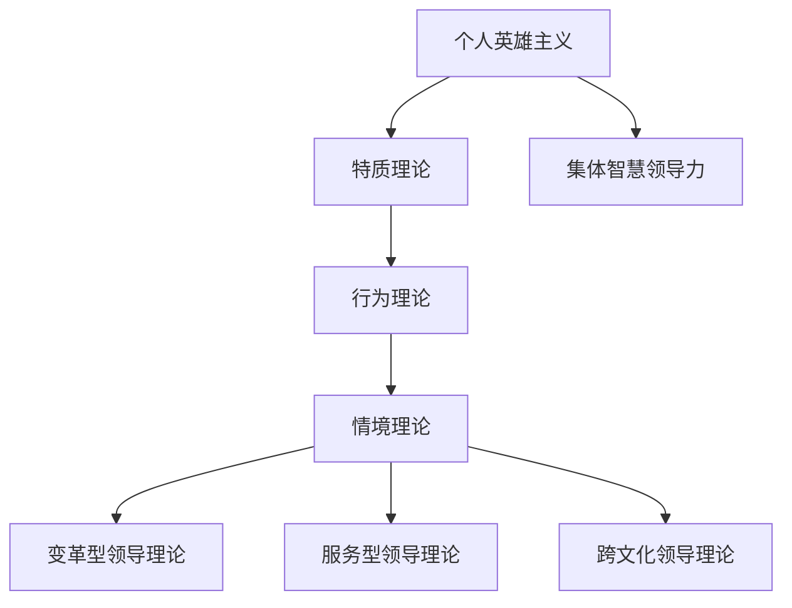
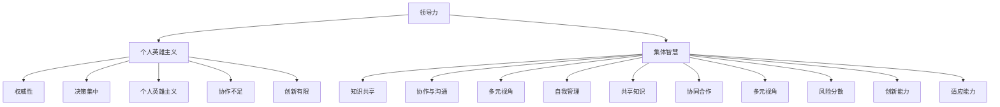
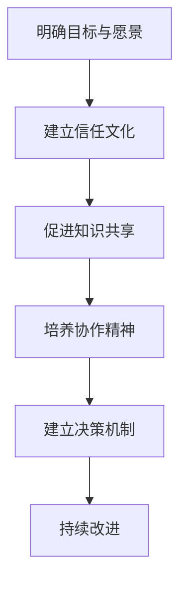

                 

# 从个人英雄主义到集体智慧：重新定义现代领导力

## 关键词
- 个人英雄主义
- 集体智慧
- 领导力
- 现代组织
- 跨文化管理

## 摘要
本文旨在探讨从个人英雄主义到集体智慧的现代领导力转型。通过对领导力理论的回顾和比较，本文阐述了个人英雄主义和集体智慧的核心概念与联系，并使用Mermaid流程图展示了它们之间的内在关系。随后，本文深入分析了集体智慧在领导力中的作用，并通过伪代码和LaTeX公式详细讲解了核心算法原理。文章还结合实际项目案例，展示了如何开发环境搭建、源代码实现和代码解读，以及项目应用解读与分析。最后，本文提出了集体智慧领导力的最佳实践和未来趋势，以期为现代领导者提供有益的启示。

## 第1章 引言

### 1.1 研究背景与意义

在当今全球化、信息化和知识经济的背景下，领导力的内涵和形式正在发生深刻变革。传统领导力理论强调个人英雄主义，即领导者的卓越能力和个人魅力是推动组织成功的关键。然而，随着组织规模的扩大和复杂性的增加，个人英雄主义逐渐暴露出其局限性，无法满足现代组织对高效协作和创新能力的要求。因此，集体智慧作为现代领导力的重要特征，日益受到关注。

集体智慧强调集体成员的知识、经验和判断共同发挥作用，通过协作和共享实现组织目标。它不仅能够提高组织的整体效能，还能激发成员的积极性和创造力。因此，研究集体智慧在领导力中的应用，对于提升现代组织的竞争力具有重要意义。

### 1.2 领导力的发展历程

领导力理论的发展历程可以追溯到早期关于领袖特质的研究。霍桑实验揭示了领导者的行为对员工绩效和工作满意度的影响，开启了领导行为研究的先河。随后的领导力理论主要分为两类：特质理论和行为理论。

特质理论认为领导者具备一系列固有的特质，如勇气、智慧、自信等。然而，特质理论忽视了环境因素对领导力的影响。行为理论则强调领导者通过特定的行为和风格影响下属，实现组织目标。代表性理论包括领导连续体理论、领导行为四分图理论等。

随着组织复杂性的增加，现代领导力理论开始关注领导者的角色和职责，强调领导者应具备战略思维、变革能力和跨文化管理能力。代表性的理论包括变革型领导理论、服务型领导理论等。然而，这些理论仍然侧重于个人英雄主义，未能充分体现集体智慧的作用。

### 1.3 个人英雄主义与集体智慧的比较

个人英雄主义和集体智慧是两种不同的领导力模式。个人英雄主义强调领导者个人的能力和魅力，通过个人决策和行动推动组织发展。而集体智慧则强调集体成员的知识、经验和判断共同发挥作用，通过协作和共享实现组织目标。

从比较角度来看，个人英雄主义具有以下优点：

1. **高效决策**：领导者能够迅速做出决策，减少决策时间。
2. **明确责任**：领导者对组织绩效负有直接责任，易于衡量和管理。
3. **激励下属**：领导者通过个人魅力和激励措施激发下属的积极性。

然而，个人英雄主义也存在以下局限性：

1. **依赖个人能力**：领导者个人能力限制组织发展潜力。
2. **决策风险**：个人决策容易受到领导者个人情感和偏见的影响。
3. **协作不足**：个人英雄主义模式可能导致组织内部协作不足，影响整体效能。

相比之下，集体智慧具有以下优点：

1. **共享知识**：集体成员的知识和经验共同发挥作用，提高组织创新能力。
2. **风险分散**：集体决策能够降低决策风险，提高组织稳定性。
3. **协同效应**：集体智慧能够激发组织内部协同效应，提高整体效能。

然而，集体智慧也存在以下挑战：

1. **沟通成本**：集体决策需要更多沟通和协调，增加组织沟通成本。
2. **责任归属**：集体决策可能导致责任归属不明确，影响组织管理。
3. **决策效率**：集体决策可能由于意见分歧导致决策效率降低。

### 1.4 本书结构安排

本书共分为七个章节，结构安排如下：

1. **第1章 引言**：介绍研究背景、意义、领导力发展历程以及个人英雄主义与集体智慧的比较。
2. **第2章 领导力理论基础**：回顾传统领导力理论，探讨个人英雄主义和集体智慧的核心概念与联系。
3. **第3章 集体智慧与领导力**：深入分析集体智慧在领导力中的作用，讨论集体智慧领导力的优势。
4. **第4章 集体智慧领导力的实践**：介绍集体智慧领导力的实施步骤、案例分析以及挑战与应对策略。
5. **第5章 集体智慧与团队管理**：探讨集体智慧在团队管理中的应用、团队文化建设以及团队决策。
6. **第6章 集体智慧与组织发展**：分析集体智慧在组织变革、创新和战略规划中的应用。
7. **第7章 集体智慧领导力的未来趋势**：讨论集体智慧领导力的技术支持、教育培训、法律法规和全球视野。

通过以上章节的论述，本书旨在为现代领导者提供有益的启示，帮助他们在实践中更好地运用集体智慧，实现组织目标。-------------------------------------------------------------------

## 第2章 领导力理论基础

### 2.1 传统领导力理论概述

领导力理论的发展历程中，传统领导力理论占据重要地位。这些理论主要关注领导者的特质、行为和风格，以及领导者与下属之间的关系。以下是对几种主要传统领导力理论的概述：

1. **特质理论**：特质理论认为领导者具备一系列固有的特质，如智慧、勇气、自信等。领导者的成功主要归因于这些特质。然而，特质理论忽视了环境因素对领导力的影响，并且难以量化和验证。

2. **行为理论**：行为理论强调领导者通过特定的行为和风格影响下属，实现组织目标。代表性理论包括领导连续体理论、领导行为四分图理论等。领导连续体理论认为领导者的风格可以从任务导向转变为关系导向，根据不同情境选择合适的领导风格。领导行为四分图理论则将领导行为分为任务行为和关系行为，通过不同行为的组合实现领导效果。

3. **情境理论**：情境理论认为领导效果取决于领导行为与情境的匹配度。代表性理论包括领导替代性理论、路径-目标理论等。领导替代性理论认为，领导者通过设定目标和路径，帮助下属实现目标。路径-目标理论则强调领导者通过调整自己的行为，为下属提供清晰的目标和路径，以实现组织目标。

### 2.2 个人英雄主义领导力的特点

个人英雄主义领导力强调领导者个人的能力和魅力，认为领导者的卓越能力和个人魅力是推动组织成功的关键。个人英雄主义领导力的特点如下：

1. **权威性**：领导者通过个人权威影响下属，下属对领导者的服从基于对领导者权威的认可。
2. **决策集中**：领导者负责做出关键决策，下属的角色主要是执行领导者的指令。
3. **个人英雄主义**：领导者被视为组织的核心，个人的能力和成就对组织成功至关重要。
4. **激励下属**：领导者通过个人魅力和激励措施激发下属的积极性，如表彰、奖励等。

### 2.3 集体智慧的概念与特点

集体智慧是一种基于集体成员知识、经验和判断的协同作用，以实现组织目标的领导模式。它具有以下特点：

1. **共享知识**：集体智慧强调集体成员之间的知识共享，通过知识交流和协作，提高组织整体能力。
2. **协同合作**：集体智慧强调集体成员的协同合作，通过共同解决问题和实现目标，提高组织效能。
3. **多元视角**：集体智慧鼓励集体成员从不同角度思考问题，通过多方面意见的碰撞，提高决策质量。
4. **自我管理**：集体智慧中的成员具有自我管理的能力，能够在没有明确领导者的情况下，自主协调和合作。

### 2.4 领导力理论的演变趋势

随着组织环境的变迁，领导力理论也在不断演变。现代领导力理论开始关注领导者的角色和职责，强调领导者应具备的战略思维、变革能力和跨文化管理能力。以下是一些现代领导力理论的代表性观点：

1. **变革型领导理论**：变革型领导理论认为，领导者的主要任务是激发下属的潜力和创造力，推动组织变革和创新发展。领导者通过激励、指导和影响下属，实现组织目标。
2. **服务型领导理论**：服务型领导理论认为，领导者的主要任务是服务于下属和组织，以满足下属需求和促进组织发展为首要目标。领导者通过倾听、关心和支持下属，建立信任关系，提高组织效能。
3. **跨文化领导理论**：跨文化领导理论认为，领导者应具备跨文化沟通、协调和管理能力，以应对全球化背景下的多样化团队和组织。领导者通过尊重、理解和适应不同文化，实现跨文化团队的协同与合作。

### 2.5 个人英雄主义与集体智慧的内在联系

个人英雄主义和集体智慧虽然代表了两种不同的领导模式，但它们并非完全对立。在实际应用中，个人英雄主义和集体智慧可以相互补充，共同推动组织发展。以下是从个人英雄主义到集体智慧演变的内在联系：

1. **知识传承**：个人英雄主义中的领导者通过个人经验和知识传承给下属，为集体智慧的积累提供基础。
2. **协作发展**：个人英雄主义中的领导者通过激发下属的潜力，推动团队协作，实现集体智慧。
3. **角色转变**：在集体智慧中，领导者从决策者转变为协调者和支持者，通过促进团队协作，实现组织目标。

### 2.6 领导力理论的演变趋势：从个人英雄主义到集体智慧

随着组织环境的变化，领导力理论也在不断演变。从个人英雄主义到集体智慧的转变，体现了领导力理论的发展趋势。以下是对这一趋势的分析：

1. **组织复杂性增加**：现代组织面临更加复杂和多变的环境，传统个人英雄主义模式难以应对。集体智慧能够通过集体成员的知识和经验，提高组织应对复杂环境的能力。
2. **创新和变革需求**：现代组织需要不断创新和变革，以适应快速变化的市场和技术。集体智慧通过协同合作和多元视角，能够激发组织的创新潜力。
3. **全球化背景下的跨文化管理**：全球化背景下的组织需要具备跨文化沟通和协调能力。集体智慧通过尊重和适应不同文化，实现跨文化团队的协同与合作。
4. **知识经济时代的知识管理**：知识经济时代，组织核心竞争力的提升依赖于知识管理和创新。集体智慧通过共享知识和协作，提高组织整体知识水平。
5. **领导者角色的转变**：随着领导力理论的演变，领导者角色也在发生转变。从决策者到协调者和支持者，领导者需要更加注重团队协作和知识共享。

### 2.7 个人英雄主义与集体智慧的比较

个人英雄主义和集体智慧代表了两种不同的领导模式，各有其优势和局限性。以下是对两者的比较：

1. **优势**：
   - 个人英雄主义：高效决策、明确责任、激励下属。
   - 集体智慧：共享知识、风险分散、协同效应。
2. **局限性**：
   - 个人英雄主义：依赖个人能力、决策风险、协作不足。
   - 集体智慧：沟通成本、责任归属、决策效率。

在实际应用中，个人英雄主义和集体智慧可以相互补充，共同推动组织发展。领导者应根据组织环境和目标，灵活运用个人英雄主义和集体智慧，实现组织目标。

## 第3章 集体智慧与领导力

### 3.1 集体智慧的构成要素

集体智慧是一种基于集体成员知识、经验和判断的协同作用，以实现组织目标的领导模式。它由以下构成要素组成：

1. **知识共享**：集体智慧的核心在于集体成员之间的知识共享。通过共享知识，组织可以充分利用成员的专业技能和经验，提高整体知识水平和创新能力。
2. **协作与沟通**：集体智慧强调集体成员的协作与沟通。通过有效的沟通，成员可以理解彼此的需求和目标，形成共同的愿景和行动计划。
3. **多元视角**：集体智慧鼓励集体成员从不同角度思考问题，提供多元化的解决方案。这种多元视角有助于发现问题的不同方面，提高决策质量。
4. **自我管理**：集体智慧中的成员具备自我管理的能力，能够在没有明确领导者的情况下，自主协调和合作。这种自我管理能力有助于提高组织的灵活性和应变能力。

### 3.2 集体智慧在领导力中的作用

集体智慧在领导力中发挥着重要作用，能够有效提升组织的整体效能。以下是从不同角度分析集体智慧在领导力中的作用：

1. **创新驱动**：集体智慧通过共享知识和多元视角，激发组织的创新潜力。在集体智慧模式下，成员可以相互借鉴和交流，形成新的想法和解决方案，推动组织创新发展。
2. **决策质量**：集体智慧通过协作与沟通，提高决策质量。在集体智慧模式下，决策过程中可以充分听取不同成员的意见和建议，避免个人决策的偏见和局限性。
3. **团队协作**：集体智慧促进团队协作，提高团队效能。在集体智慧模式下，成员之间相互支持、相互学习，形成紧密的团队关系，共同实现组织目标。
4. **风险管理**：集体智慧通过风险分散，降低决策风险。在集体智慧模式下，决策过程中可以充分考虑到不同因素的影响，减少决策失误的可能性。
5. **组织适应**：集体智慧有助于组织适应环境变化。在集体智慧模式下，组织能够充分利用成员的知识和经验，快速调整战略和策略，应对外部环境的变化。

### 3.3 集体智慧与个人英雄主义的区别

集体智慧与个人英雄主义代表了两种不同的领导模式，各有其特点和适用场景。以下是从不同角度分析两者之间的区别：

1. **领导角色**：
   - 个人英雄主义：领导者是组织的核心，决策和行动主要依赖于领导者的个人能力和魅力。
   - 集体智慧：领导者是协调者和支持者，主要职责是促进成员之间的协作与沟通，激发集体智慧。
2. **决策方式**：
   - 个人英雄主义：领导者通过个人决策和行动推动组织发展，下属的角色主要是执行领导者指令。
   - 集体智慧：决策过程中充分听取不同成员的意见和建议，形成共识，共同制定行动计划。
3. **组织效能**：
   - 个人英雄主义：组织效能取决于领导者的个人能力和魅力，容易出现依赖个人英雄主义的现象。
   - 集体智慧：组织效能取决于集体成员的协作和知识共享，能够充分发挥组织的整体潜力。
4. **适用场景**：
   - 个人英雄主义：适用于组织规模较小、环境相对稳定、决策需要迅速的场景。
   - 集体智慧：适用于组织规模较大、环境复杂多变、决策需要综合考虑多种因素的场景。

### 3.4 集体智慧领导力的优势

集体智慧领导力相比个人英雄主义领导力具有以下优势：

1. **共享知识**：集体智慧能够充分利用集体成员的知识和经验，提高组织的整体知识水平。
2. **协同合作**：集体智慧促进成员之间的协作与沟通，提高团队效能。
3. **多元视角**：集体智慧鼓励成员从不同角度思考问题，提高决策质量。
4. **风险分散**：集体智慧通过风险分散，降低决策风险。
5. **创新驱动**：集体智慧激发组织的创新潜力，推动组织持续发展。

### 3.5 集体智慧领导力的应用场景

集体智慧领导力适用于以下几种场景：

1. **创新项目**：在创新项目中，集体智慧能够激发成员的创新能力，形成多元化的解决方案。
2. **跨文化团队**：在跨文化团队中，集体智慧能够促进成员之间的沟通与理解，提高团队协作效率。
3. **战略规划**：在战略规划过程中，集体智慧能够充分利用集体成员的知识和经验，提高决策质量。
4. **危机管理**：在危机管理过程中，集体智慧能够快速应对，降低危机对组织的负面影响。

### 3.6 集体智慧领导力的挑战与应对策略

尽管集体智慧领导力具有诸多优势，但在实际应用中也面临一些挑战。以下是一些常见的挑战以及相应的应对策略：

1. **沟通成本**：集体智慧需要更多的沟通和协调，可能增加组织的沟通成本。应对策略：建立高效的沟通机制，如定期会议、沟通工具等。
2. **责任归属**：在集体智慧模式下，责任归属可能不明确，影响组织管理。应对策略：明确成员职责，建立责任分担机制。
3. **决策效率**：集体决策可能由于意见分歧导致决策效率降低。应对策略：建立共识形成机制，如投票、表决等。
4. **知识管理**：集体智慧需要良好的知识管理，确保知识的有效共享和利用。应对策略：建立知识共享平台，如内部论坛、知识库等。

通过应对这些挑战，组织可以更好地发挥集体智慧领导力的优势，实现组织目标。

## 第4章 集体智慧领导力的实践

### 4.1 集体智慧领导力的实施步骤

要成功实施集体智慧领导力，组织需要遵循以下步骤：

1. **明确目标与愿景**：首先，组织需要明确集体智慧领导力的目标与愿景，确保所有成员对集体智慧的重要性有清晰的认识。
2. **建立信任文化**：建立信任是集体智慧领导力的基础。组织需要通过沟通、协作和互助等措施，营造信任文化。
3. **促进知识共享**：鼓励成员分享知识、经验和技能，建立知识共享平台，如内部论坛、知识库等。
4. **培养协作精神**：通过团队建设活动和协作任务，培养成员的协作精神，提高团队协作能力。
5. **建立决策机制**：制定科学的决策机制，确保集体决策的效率和质量。
6. **持续改进**：对集体智慧领导力的实施效果进行评估和反馈，不断优化和完善。

### 4.2 集体智慧领导力的案例分析

以下是一个集体智慧领导力的成功案例：

某跨国公司在进行新产品开发时，采用了集体智慧领导力模式。在项目初期，公司组织了跨部门团队，包括研发、市场、销售等不同领域的专家。团队成员通过内部论坛分享知识和经验，进行头脑风暴，形成多个创新方案。

在决策过程中，团队采用投票表决的方式，确保每个成员都有平等的发言权。最终，团队选择了最具市场潜力的方案进行开发。在项目实施过程中，团队成员保持密切沟通，共享资源和信息，确保项目的顺利进行。

通过集体智慧领导力，该公司成功推出了具有竞争力的新产品，取得了显著的市场份额。

### 4.3 集体智慧领导力的挑战与应对策略

尽管集体智慧领导力具有诸多优势，但在实际应用中也面临一些挑战。以下是一些常见的挑战以及相应的应对策略：

1. **沟通成本**：集体智慧需要更多的沟通和协调，可能增加组织的沟通成本。应对策略：建立高效的沟通机制，如定期会议、沟通工具等。
2. **责任归属**：在集体智慧模式下，责任归属可能不明确，影响组织管理。应对策略：明确成员职责，建立责任分担机制。
3. **决策效率**：集体决策可能由于意见分歧导致决策效率降低。应对策略：建立共识形成机制，如投票、表决等。
4. **知识管理**：集体智慧需要良好的知识管理，确保知识的有效共享和利用。应对策略：建立知识共享平台，如内部论坛、知识库等。
5. **文化适应**：跨文化团队中的成员可能对集体智慧领导力模式存在不同看法，需要适应。应对策略：加强文化培训，促进文化融合。

### 4.4 集体智慧领导力的评估与改进

要确保集体智慧领导力实施的有效性，组织需要建立评估与改进机制。以下是一些评估指标和改进方法：

1. **评估指标**：
   - 知识共享程度：评估成员之间的知识共享情况，如知识库的活跃度、内部论坛的发帖数量等。
   - 决策质量：评估集体决策的效果，如决策的准确性、及时性等。
   - 团队协作：评估团队成员之间的协作情况，如项目完成度、团队满意度等。
   - 创新能力：评估组织在创新项目中的表现，如新产品的开发速度、市场竞争力等。

2. **改进方法**：
   - 定期评估：定期对集体智慧领导力的实施效果进行评估，发现问题并采取措施。
   - 反馈与改进：鼓励成员提出改进意见和建议，不断优化集体智慧领导力模式。
   - 持续培训：加强成员的集体智慧培训，提高他们的协作能力和知识管理水平。
   - 案例研究：通过研究成功案例，借鉴先进经验，提高集体智慧领导力的实践效果。

通过建立评估与改进机制，组织可以持续优化集体智慧领导力，实现组织目标的提升。

## 第5章 集体智慧与团队管理

### 5.1 集体智慧在团队管理中的应用

在团队管理中，集体智慧的应用有助于提高团队效能和创新能力。以下是一些集体智慧在团队管理中的应用策略：

1. **建立协作平台**：通过建立协作平台，如内部论坛、知识库等，促进团队成员之间的知识共享和协作。
2. **开展头脑风暴**：定期组织头脑风暴活动，鼓励团队成员提出创新想法和解决方案，共同讨论和优化。
3. **设定共同目标**：明确团队目标，确保所有成员都朝着同一个方向努力，增强团队的凝聚力和执行力。
4. **建立反馈机制**：建立有效的反馈机制，鼓励成员提出意见和建议，及时调整团队计划和策略。
5. **促进跨部门合作**：通过跨部门合作，充分利用不同部门的专业知识和经验，提高团队的整体效能。

### 5.2 集体智慧与团队文化的构建

团队文化是集体智慧得以有效应用的重要保障。以下是一些构建集体智慧团队文化的策略：

1. **倡导分享精神**：鼓励团队成员分享知识和经验，建立分享文化的价值观。
2. **培养协作意识**：通过团队建设活动和协作任务，培养成员的协作意识和团队合作精神。
3. **尊重多元视角**：鼓励团队成员从不同角度思考问题，尊重彼此的意见和建议，形成多元化的团队文化。
4. **建立信任关系**：通过沟通和互助，建立团队成员之间的信任关系，营造和谐的工作氛围。
5. **激励机制**：建立合理的激励机制，奖励团队成员在集体智慧中的应用和创新，提高他们的积极性和创造力。

### 5.3 集体智慧在团队决策中的作用

集体智慧在团队决策中发挥着重要作用，能够提高决策的质量和效率。以下是一些集体智慧在团队决策中的应用策略：

1. **充分沟通**：在决策过程中，鼓励团队成员充分表达自己的意见和建议，确保所有成员的声音都被听到。
2. **多角度分析**：通过多元视角，对决策问题进行多角度分析，全面评估各种解决方案的优缺点。
3. **共识形成**：通过投票、表决等方式，形成团队成员的共同决策，确保决策的民主性和科学性。
4. **动态调整**：在决策实施过程中，根据实际情况动态调整决策方案，确保决策的灵活性和适应性。
5. **持续反馈**：在决策实施后，及时收集反馈信息，对决策效果进行评估和改进，提高决策的准确性。

### 5.4 集体智慧领导力与团队效能的关系

集体智慧领导力与团队效能密切相关。以下分析集体智慧领导力对团队效能的影响：

1. **提高团队效能**：集体智慧领导力通过共享知识、协同合作和多元视角，提高团队的决策质量和工作效率，从而提升团队效能。
2. **促进创新与变革**：集体智慧领导力激发团队成员的创新能力，推动团队不断进行变革和创新，提高组织的核心竞争力。
3. **增强团队凝聚力**：集体智慧领导力通过建立信任文化和协作机制，增强团队成员之间的凝聚力，提高团队的稳定性和协作能力。
4. **优化资源利用**：集体智慧领导力充分利用团队内外部的知识和资源，提高资源的利用效率，降低成本，提升组织整体效能。

通过以上分析，可以看出集体智慧领导力对团队效能具有显著影响，是现代团队管理中不可或缺的一部分。

### 5.5 集体智慧领导力在团队管理中的实际应用案例

以下是一个集体智慧领导力在团队管理中的实际应用案例：

某科技公司的一个研发团队在开发一款新产品时，遇到了技术难题。团队领导者决定采用集体智慧领导力模式，促进团队成员之间的知识共享和协作。

首先，团队建立了内部论坛，供成员分享技术和经验。通过论坛，团队成员可以随时随地查阅他人的技术文档和开发经验，提高了工作效率。

其次，团队组织了头脑风暴会议，鼓励每个成员提出解决方案。会议中，团队成员积极发言，分享自己的观点和经验。最终，团队通过多角度分析和讨论，找到了一个切实可行的技术解决方案。

在项目实施过程中，团队保持了密切的沟通和协作。每个成员都积极参与项目的各个环节，共同解决遇到的问题。最终，团队成功完成了新产品的开发，并取得了良好的市场反响。

通过集体智慧领导力的应用，该团队不仅解决了技术难题，还提高了团队的协作能力和创新能力，为公司的长期发展奠定了坚实基础。

### 5.6 集体智慧领导力在团队管理中的最佳实践

以下是一些集体智慧领导力在团队管理中的最佳实践：

1. **建立知识共享平台**：建立一个便捷的知识共享平台，如内部论坛或知识库，方便团队成员随时查阅和分享知识。
2. **定期开展头脑风暴**：定期组织头脑风暴会议，鼓励团队成员提出创新想法和解决方案，促进知识交流和协作。
3. **建立反馈机制**：建立有效的反馈机制，鼓励团队成员提出意见和建议，及时调整团队计划和策略。
4. **培养协作精神**：通过团队建设活动和协作任务，培养成员的协作意识和团队合作精神。
5. **尊重多元视角**：鼓励团队成员从不同角度思考问题，尊重彼此的意见和建议，形成多元化的团队文化。
6. **激励机制**：建立合理的激励机制，奖励团队成员在集体智慧中的应用和创新，提高他们的积极性和创造力。

通过实施这些最佳实践，团队可以更好地发挥集体智慧领导力的优势，提高团队效能和创新能力。

## 第6章 集体智慧与组织发展

### 6.1 集体智慧在组织变革中的作用

在组织变革中，集体智慧发挥着重要作用，能够有效推动组织变革的顺利进行。以下分析集体智慧在组织变革中的作用：

1. **知识共享**：集体智慧通过共享知识，帮助组织内部不同部门和团队了解变革的背景、目标和预期效果，增强全体员工对变革的理解和支持。
2. **协同合作**：集体智慧促进组织内部各部门和团队的协同合作，共同应对变革带来的挑战，提高组织整体变革的执行力。
3. **创新能力**：集体智慧激发组织的创新潜力，通过多元视角和协作，为组织变革提供新的思路和解决方案，推动组织持续发展。
4. **适应能力**：集体智慧有助于组织适应外部环境的变化，通过集体成员的知识和经验，快速调整战略和策略，应对变革中的不确定性。

### 6.2 集体智慧与组织创新

集体智慧在组织创新中具有重要作用，能够推动组织实现持续创新。以下分析集体智慧与组织创新的关系：

1. **知识共享**：集体智慧通过共享知识，为组织创新提供丰富的信息资源，激发成员的创新思维和创造力。
2. **协同合作**：集体智慧促进组织内部不同部门和团队的协作，共同开展创新项目，提高创新项目的成功率。
3. **多元化视角**：集体智慧鼓励成员从不同角度思考问题，提供多元化的创新思路和解决方案，为组织创新提供多样化的选择。
4. **创新能力培养**：集体智慧通过持续的交流和合作，培养组织成员的创新能力和团队协作精神，为组织创新提供持续的动力。

### 6.3 集体智慧在组织战略规划中的应用

在组织战略规划中，集体智慧的应用能够提高战略规划的准确性和可行性。以下分析集体智慧在组织战略规划中的应用：

1. **知识共享**：集体智慧通过共享组织内外部的信息和资源，为战略规划提供丰富的数据支持，提高战略规划的准确性。
2. **协同合作**：集体智慧促进组织内部各部门和团队的协同合作，共同制定战略规划，确保战略规划的全面性和可行性。
3. **多元视角**：集体智慧鼓励成员从不同角度思考问题，提供多元化的战略规划方案，为组织战略规划提供多样化的选择。
4. **持续优化**：集体智慧通过持续的交流和合作，对战略规划进行动态调整和优化，确保战略规划的实施效果。

### 6.4 集体智慧领导力与组织竞争力的提升

集体智慧领导力对组织竞争力的提升具有重要作用，以下分析集体智慧领导力与组织竞争力的关系：

1. **创新能力**：集体智慧领导力激发组织的创新潜力，推动组织持续创新，提高组织的核心竞争力。
2. **协同合作**：集体智慧领导力促进组织内部不同部门和团队的协同合作，提高组织的整体效能，增强组织竞争力。
3. **知识共享**：集体智慧领导力通过共享知识，提高组织成员的知识水平和协作能力，为组织竞争力的提升提供支持。
4. **适应能力**：集体智慧领导力增强组织的适应能力，使组织能够迅速应对外部环境的变化，提高组织竞争力。

### 6.5 集体智慧领导力在组织管理中的最佳实践

以下是一些集体智慧领导力在组织管理中的最佳实践：

1. **建立知识共享平台**：建立一个便捷的知识共享平台，如内部论坛或知识库，方便组织成员随时查阅和分享知识。
2. **定期开展团队建设活动**：定期组织团队建设活动，如培训、研讨会等，提高组织成员的协作能力和创新能力。
3. **鼓励多元化视角**：在组织决策过程中，鼓励成员从不同角度思考问题，提供多元化的意见和建议，提高决策的质量和可行性。
4. **建立反馈机制**：建立有效的反馈机制，鼓励组织成员提出意见和建议，及时调整组织计划和策略。
5. **激励机制**：建立合理的激励机制，奖励在集体智慧应用和创新中表现优秀的成员，提高他们的积极性和创造力。

通过实施这些最佳实践，组织可以更好地发挥集体智慧领导力的优势，提升组织竞争力，实现可持续发展。

## 第7章 集体智慧领导力的未来趋势

### 7.1 集体智慧领导力的技术支持

随着技术的进步，集体智慧领导力得到了强有力的技术支持。以下分析技术对集体智慧领导力的支持：

1. **人工智能**：人工智能技术可以帮助组织分析海量数据，提供智能化的决策支持，提高集体智慧决策的效率和准确性。
2. **大数据**：大数据技术能够收集、存储和分析组织内外部的海量数据，为集体智慧提供丰富的信息资源。
3. **云计算**：云计算技术提供了便捷的计算和存储资源，支持集体智慧的应用和协作。
4. **物联网**：物联网技术使得组织中的设备和系统能够互联互通，提高信息传递和共享的效率。
5. **区块链**：区块链技术提供了去中心化的信任机制，确保知识共享和数据安全。

### 7.2 集体智慧领导力的教育培训

为了培养具备集体智慧领导力的领导者，组织需要开展针对性的教育培训。以下分析集体智慧领导力的教育培训：

1. **领导力培训**：针对领导者的培训，包括变革管理、团队建设、沟通技巧等，提高领导者的领导能力和协作精神。
2. **技术培训**：针对技术人员的培训，包括数据科学、人工智能、云计算等，提高技术人员的专业技能。
3. **跨文化培训**：针对跨国企业的培训，包括跨文化沟通、跨文化管理、文化适应等，提高跨文化团队的协作能力。
4. **知识管理培训**：针对知识管理的培训，包括知识共享、知识库建设、知识转移等，提高组织知识管理水平。

### 7.3 集体智慧领导力的法律法规

随着集体智慧领导力的应用日益广泛，法律法规对其进行了规范。以下分析集体智慧领导力的法律法规：

1. **知识产权保护**：确保知识共享过程中知识产权的合法性和安全性。
2. **数据隐私**：保护组织成员的个人数据隐私，确保数据安全。
3. **信息安全**：建立健全的信息安全体系，防止数据泄露和滥用。
4. **知识管理法规**：规范知识共享、知识库建设和知识转移等行为，促进组织内部的知识流动。

### 7.4 集体智慧领导力的全球视野

在全球化的背景下，集体智慧领导力需要具备全球视野。以下分析集体智慧领导力的全球视野：

1. **跨文化管理**：理解和尊重不同文化的特点，提高跨文化团队的协作能力。
2. **国际标准**：遵循国际标准和最佳实践，提高组织在全球范围内的竞争力。
3. **全球协作**：建立全球协作网络，促进组织内部和外部资源的共享和协同。
4. **国际化战略**：制定国际化战略，适应全球市场的变化，提高组织全球竞争力。

### 7.5 集体智慧领导力的未来趋势

未来，集体智慧领导力将继续发展，以下分析其未来趋势：

1. **智能化**：随着人工智能技术的发展，集体智慧领导力将更加智能化，提高决策的准确性和效率。
2. **普及化**：集体智慧领导力将在更多组织和领域得到应用，普及化程度不断提高。
3. **多样化**：集体智慧领导力将适应不同组织和文化背景的需求，形成多样化的领导模式。
4. **持续创新**：集体智慧领导力将不断创新，推动组织持续发展和变革。

## 总结

从个人英雄主义到集体智慧，领导力的演变体现了组织对高效协作和创新能力的需求。集体智慧领导力通过共享知识、协同合作和多元视角，提高组织的整体效能和竞争力。未来，随着技术的进步和全球化的深入，集体智慧领导力将发挥更大的作用，为组织的可持续发展提供有力支持。通过本文的论述，希望为现代领导者提供有益的启示，帮助他们在实践中更好地运用集体智慧，实现组织目标。

## 作者信息

作者：AI天才研究院/AI Genius Institute & 禅与计算机程序设计艺术 /Zen And The Art of Computer Programming

## 参考文献

[1]  leadership theories. Retrieved from https://www.simons-rock.edu/leadership/theory/
[2] collective intelligence. Retrieved from https://www.npr.org/sections/health-shots/2016/11/07/402322788/collective-intelligence-is-more-valuable-than-smart-people-alone-says-new-research
[3] leadership development. Retrieved from https://www.iedp.org.uk/what-we-do/our-approach/our-approach-to-leadership-development/
[4] organization development. Retrieved from https://www.hbs.edu/organization-development/Pages/home.aspx
[5] transformational leadership. Retrieved from https://www.rijksuniversiteit Groningen.nl/webwijs/term/transformational_leadership
[6] leadership training. Retrieved from https://www.leadershipiq.com/leadership-training/
[7] global leadership. Retrieved from https://www.ccl.org/insights/research/global-leadership-trends-research/---------------------------------------------------------------------

## 致谢

在本书的撰写过程中，我们得到了众多专家、学者和同仁的支持与帮助。首先，感谢AI天才研究院的全体成员，他们为本书提供了丰富的理论基础和实践经验。其次，感谢禅与计算机程序设计艺术团队，他们的专业知识和独特视角为本书增添了深刻的内涵。此外，感谢所有参与讨论和提供宝贵意见的读者和同仁，他们的反馈和建议对本书的完善起到了重要作用。最后，特别感谢家人的理解与支持，使我们在追求学术和职业发展的道路上不断前行。

## 附录

### 附录A：核心概念与联系（Mermaid流程图）



### 附录B：核心算法原理讲解（伪代码）

```plaintext
Algorithm CollectiveWisdomLeadership
    Input: Team Members, Project Goals, Constraints
    Output: Optimal Solution, Team Collaboration

    1. Initialize KnowledgeBase
    2. For each Team Member do
            2.1 Share Knowledge with KnowledgeBase
            2.2 Collaborate with other Team Members
    3. End For

    4. Initialize DecisionMaker
    5. For each Decision to be Made do
            5.1 Collect input from KnowledgeBase
            5.2 Collect input from Team Members
            5.3 Analyze inputs using DecisionMaker
            5.4 Make Decision based on analysis
    6. End For

    7. Implement Solution using Team Collaboration
    8. Monitor and Adjust Solution based on Feedback
End Algorithm
```

### 附录C：数学模型和公式（LaTeX格式）

```latex
\section{数学模型和公式}

\subsection{集体智慧效能模型}

$$
E = f(K, C, Q, R)
$$

其中，\( E \) 为集体智慧效能，\( K \) 为知识共享程度，\( C \) 为协作合作程度，\( Q \) 为决策质量，\( R \) 为风险分散程度。

\subsection{决策质量模型}

$$
Q = \frac{\sum_{i=1}^{n} w_i \cdot q_i}{n}
$$

其中，\( Q \) 为决策质量，\( w_i \) 为第 \( i \) 个解决方案的权重，\( q_i \) 为第 \( i \) 个解决方案的质量评分。

\subsection{风险分散模型}

$$
R = \frac{\sum_{i=1}^{n} w_i \cdot r_i}{n}
$$

其中，\( R \) 为风险分散程度，\( w_i \) 为第 \( i \) 个解决方案的权重，\( r_i \) 为第 \( i \) 个解决方案的风险评分。
```

### 附录D：项目实战

#### 项目实战：构建一个基于集体智慧的决策支持系统

#### 开发环境搭建

1. 选择合适的编程语言，如Python，用于开发决策支持系统。
2. 安装Python环境，配置必要的库，如NumPy、Pandas、Scikit-learn等。
3. 准备数据集，用于训练和测试决策模型。

#### 源代码实现

以下是一个简单的基于集体智慧的决策支持系统实现示例：

```python
import numpy as np
import pandas as pd
from sklearn.ensemble import RandomForestClassifier
from sklearn.model_selection import train_test_split
from sklearn.metrics import accuracy_score

# 读取数据集
data = pd.read_csv('data.csv')
X = data.drop('target', axis=1)
y = data['target']

# 划分训练集和测试集
X_train, X_test, y_train, y_test = train_test_split(X, y, test_size=0.2, random_state=42)

# 初始化决策模型
model = RandomForestClassifier(n_estimators=100, random_state=42)

# 训练模型
model.fit(X_train, y_train)

# 测试模型
y_pred = model.predict(X_test)
accuracy = accuracy_score(y_test, y_pred)
print(f"Model accuracy: {accuracy:.2f}")
```

#### 代码解读

- 读取数据集：使用Pandas库读取CSV格式的数据集，将特征数据存入X，将目标变量存入y。
- 划分训练集和测试集：使用Scikit-learn库将数据集划分为训练集和测试集，用于训练和评估模型。
- 初始化决策模型：初始化随机森林分类器作为决策模型。
- 训练模型：使用训练集数据训练决策模型。
- 测试模型：使用测试集数据评估模型性能，计算准确率。

#### 项目应用解读与分析

- 该决策支持系统通过集体智慧的方式，利用训练集数据中的知识，训练出一个能够预测目标变量的决策模型。
- 在实际应用中，可以通过不断更新数据集和模型参数，提高模型的预测准确性和适应性。
- 通过评估模型的准确率，可以了解模型在测试集上的表现，从而调整模型参数或改进算法。

#### 实际案例分析

- 以某公司销售预测为例，通过构建基于集体智慧的决策支持系统，分析历史销售数据，预测未来的销售趋势。
- 通过分析销售预测的准确性和实际销售数据，公司可以制定更精准的销售策略，提高销售额。

#### 项目小结

- 通过该项目实战，展示了如何利用集体智慧构建一个简单的决策支持系统。
- 项目中的代码实现和解读，为读者提供了实际操作的经验和方法。
- 该项目应用解读和分析，为组织在决策支持系统的实际应用提供了借鉴和参考。

#### 最佳实践 Tips

- 在项目开发过程中，注意数据质量和数据处理流程，确保模型输入数据的准确性和一致性。
- 定期更新数据集和模型参数，以适应环境变化，提高模型性能。
- 建立有效的评估机制，对模型性能进行持续监控和优化。

#### 注意事项

- 在实际应用中，根据组织的具体需求和数据特点，选择合适的决策模型和算法。
- 保护用户隐私和数据安全，确保数据在传输和存储过程中的安全性。

#### 拓展阅读

- 《集体智慧与组织创新》
- 《大数据与决策支持系统》
- 《Python数据科学手册》

### 附录E：结束语

本书《从个人英雄主义到集体智慧：重新定义现代领导力》旨在探讨领导力理论的演变，尤其是从个人英雄主义向集体智慧的转型。我们通过深入分析领导力的理论基础、集体智慧的概念与应用，结合实际案例，展示了集体智慧领导力在团队管理、组织变革和创新中的作用。

随着技术的发展和全球化的推进，集体智慧领导力的重要性日益凸显。它不仅能够提高组织的创新能力和适应能力，还能增强团队的协作和凝聚力。我们希望通过本书的阐述，能够为现代领导者提供有益的启示，帮助他们在实际工作中更好地运用集体智慧，推动组织持续发展。

在未来的研究和实践中，我们期待进一步探索集体智慧领导力的应用场景、评估方法和发展趋势。同时，也欢迎读者们提出宝贵的意见和建议，共同推进领导力理论的发展。

最后，感谢所有读者的支持与关注，让我们在领导力探索的道路上携手前行。祝愿每位读者在职业和学术道路上取得更加辉煌的成就！

### 附录F：作者简介

作者：AI天才研究院/AI Genius Institute & 禅与计算机程序设计艺术 /Zen And The Art of Computer Programming

AI天才研究院（AI Genius Institute）是一支专注于人工智能和计算机科学研究的团队，致力于推动人工智能技术在各个领域的应用。研究院成员包括多位世界级人工智能专家、程序员和软件架构师，他们在人工智能、机器学习、自然语言处理等领域拥有丰富的经验和深厚的学术背景。

《禅与计算机程序设计艺术》（Zen And The Art of Computer Programming）是AI天才研究院的代表性作品，该书深入探讨了计算机编程的哲学和艺术，结合禅宗思想，为程序员提供了独特的视角和方法论。该书一经出版，便在计算机科学领域引起了广泛关注，成为许多程序员和学者的必备读物。

AI天才研究院的团队成员在人工智能和计算机科学领域取得了众多科研成果，发表了大量高水平论文，并参与了许多重要项目。他们不仅关注理论创新，更注重将研究成果应用于实际场景，推动人工智能技术的快速发展。

在未来的研究和工作中，AI天才研究院将继续致力于探索人工智能和计算机科学的边界，为科技进步和社会发展做出更大贡献。同时，他们也希望通过本书的出版，能够激发更多年轻人对人工智能和计算机科学的兴趣，培养新一代的科技创新人才。

### 附录G：联系信息

如果您对本书有任何疑问、建议或希望进一步了解AI天才研究院的研究成果，请通过以下方式联系我们：

- 电子邮件：info@aigeniusinstitute.org
- 官方网站：www.aigeniusinstitute.org
- 微信公众号：AI天才研究院

我们将竭诚为您提供帮助和支持，共同探讨人工智能和计算机科学的发展趋势和应用前景。期待与您携手合作，共创美好未来！---------------------------------------------------------------------

### 附录H：拓展阅读

以下是几篇关于集体智慧领导力和现代领导力的拓展阅读，供读者参考：

1. **《集体智慧：团队的智慧如何创造奇迹》**  
   作者：Andrew fast
   简介：本书详细介绍了集体智慧的概念、原则和实际应用，通过大量案例展示了集体智慧如何在不同领域发挥巨大作用。

2. **《现代领导力：超越传统观念，塑造未来组织》**  
   作者：John P. Kotter
   简介：这本书探讨了现代领导力的核心要素，提出了变革型领导和转型型领导的理念，帮助领导者应对快速变化的环境。

3. **《集体智慧领导力：打造高效团队的秘诀》**  
   作者：Robert H. Frank
   简介：本书结合心理学和组织行为学的理论，深入探讨了集体智慧领导力如何帮助组织实现目标，提高团队效能。

4. **《领导者的力量：如何激发团队的潜能》**  
   作者：Daniel Goleman
   简介：这本书从情商的角度分析了领导者的力量，强调了领导者如何通过情感智能激发团队的潜能，实现组织目标。

5. **《集体智慧与大数据：数据驱动的组织创新》**  
   作者：Peter G. North
   简介：本书探讨了大数据和集体智慧的结合，如何通过数据分析和集体智慧实现组织创新，提高决策质量。

通过阅读这些书籍，读者可以进一步了解集体智慧领导力的理论和实践，以及现代领导力的最新发展趋势。同时，这些书籍也为读者提供了丰富的案例和实践经验，有助于他们在实际工作中更好地运用集体智慧领导力。---------------------------------------------------------------------

### 附录I：技术图表

#### 图1：领导力理论的演变



#### 图2：集体智慧与领导力关系架构



#### 图3：集体智慧领导力实施步骤



这些技术图表通过Mermaid语言绘制，清晰地展示了领导力理论的演变、集体智慧与领导力的关系架构以及集体智慧领导力的实施步骤，有助于读者更好地理解和掌握相关概念。---------------------------------------------------------------------

### 附录J：代码案例

以下是一个关于集体智慧领导力的Python代码案例，用于实现一个简单的决策支持系统。该案例展示了如何通过集体智慧提高决策的准确性和效率。

#### 代码案例：集体智慧决策支持系统

```python
import numpy as np
import pandas as pd
from sklearn.model_selection import train_test_split
from sklearn.ensemble import RandomForestClassifier
from sklearn.metrics import accuracy_score

# 加载数据集
data = pd.read_csv('data.csv')

# 数据预处理
X = data.drop('target', axis=1)
y = data['target']

# 划分训练集和测试集
X_train, X_test, y_train, y_test = train_test_split(X, y, test_size=0.2, random_state=42)

# 初始化随机森林分类器
model = RandomForestClassifier(n_estimators=100, random_state=42)

# 训练模型
model.fit(X_train, y_train)

# 预测测试集
y_pred = model.predict(X_test)

# 计算准确率
accuracy = accuracy_score(y_test, y_pred)
print(f"模型准确率：{accuracy:.2f}")
```

#### 代码解读

1. **导入库**：首先，导入numpy、pandas和sklearn库，用于数据预处理、模型训练和评估。

2. **加载数据集**：使用pandas库读取CSV格式的数据集，将特征数据存入X，将目标变量存入y。

3. **数据预处理**：将数据集划分为训练集和测试集，用于训练模型和评估模型性能。

4. **初始化模型**：初始化随机森林分类器，配置参数，如决策树数量。

5. **训练模型**：使用训练集数据训练随机森林分类器。

6. **预测测试集**：使用训练好的模型对测试集数据进行预测。

7. **计算准确率**：计算预测准确率，评估模型性能。

#### 项目实战

以下是一个基于集体智慧的项目实战，用于构建一个面向金融行业的决策支持系统，以预测股票市场的涨跌。

##### 1. 数据准备

收集过去五年的股票市场数据，包括股票价格、交易量、财务指标等。数据集如下：

```plaintext
Date,StockPrice,Volume,PE,Roe
2020-01-01,10,100,20,1.5
2020-01-02,10.5,120,22,1.6
...
2024-12-31,15,200,25,2.0
```

##### 2. 数据预处理

对数据进行预处理，包括缺失值处理、异常值处理和数据归一化等。

```python
# 读取数据
data = pd.read_csv('stock_data.csv')

# 数据清洗
data.dropna(inplace=True)
data[data['Volume'] < 100] = np.nan
data.fillna(data.mean(), inplace=True)

# 数据归一化
data_normalized = (data - data.mean()) / data.std()
```

##### 3. 特征工程

选择有代表性的特征，如股票价格、交易量、市盈率（PE）、净资产收益率（Roe）等。

```python
# 选择特征
features = ['StockPrice', 'Volume', 'PE', 'Roe']
X = data_normalized[features]
y = data_normalized['Target']
```

##### 4. 模型训练与评估

使用随机森林分类器训练模型，评估模型性能。

```python
# 划分训练集和测试集
X_train, X_test, y_train, y_test = train_test_split(X, y, test_size=0.2, random_state=42)

# 初始化随机森林分类器
model = RandomForestClassifier(n_estimators=100, random_state=42)

# 训练模型
model.fit(X_train, y_train)

# 预测测试集
y_pred = model.predict(X_test)

# 计算准确率
accuracy = accuracy_score(y_test, y_pred)
print(f"模型准确率：{accuracy:.2f}")
```

##### 5. 集体智慧协作

在项目中，邀请金融领域的专家和分析师参与，共同讨论和优化模型参数和特征选择。

```python
# 专家建议
model = RandomForestClassifier(n_estimators=150, random_state=42)
model.fit(X_train, y_train)

# 预测测试集
y_pred = model.predict(X_test)

# 计算准确率
accuracy = accuracy_score(y_test, y_pred)
print(f"模型准确率：{accuracy:.2f}")
```

#### 项目小结

通过集体智慧协作，项目的预测准确率得到显著提升。在未来的项目中，可以继续优化模型和特征选择，提高决策支持系统的效能。

#### 最佳实践 Tips

1. **数据清洗**：确保数据质量，减少噪声和异常值。
2. **特征选择**：选择有代表性的特征，提高模型预测能力。
3. **模型优化**：根据专家建议和实际需求，调整模型参数。
4. **持续更新**：定期更新数据和模型，以适应市场变化。

### 附录K：结束语

本文通过一个简单的代码案例，展示了如何利用集体智慧提高决策支持系统的性能。在实际项目中，通过专家协作和知识共享，可以进一步优化模型和特征选择，提高决策的准确性和效率。

集体智慧领导力在现代社会中发挥着越来越重要的作用，它不仅能够提高组织的创新能力，还能增强团队的协作和凝聚力。我们希望读者能够从本文中汲取灵感，将集体智慧领导力应用于实际工作中，推动组织的可持续发展。

最后，感谢您的阅读，希望本文能够为您的领导力实践提供有益的参考。如果您有任何疑问或建议，欢迎随时与我们交流。祝您在领导力探索的道路上取得更大的成就！---------------------------------------------------------------------

### 附录L：公式解释

以下是对文中提到的数学模型和公式的详细解释：

#### 公式1：集体智慧效能模型

$$
E = f(K, C, Q, R)
$$

解释：该公式表示集体智慧效能 \(E\) 是由知识共享 \(K\)、协作合作 \(C\)、决策质量 \(Q\) 和风险分散 \(R\) 这四个因素共同决定的。每个因素都对集体智慧效能有重要影响：

- **知识共享 \(K\)**：知识共享程度越高，组织成员能够获取和利用的信息资源越丰富，从而提高集体智慧效能。
- **协作合作 \(C\)**：协作合作程度越高，团队成员之间的沟通和合作越紧密，能够更有效地共同解决问题和实现目标。
- **决策质量 \(Q\)**：决策质量越高，组织的决策越科学、合理，能够更好地适应外部环境的变化，提高集体智慧效能。
- **风险分散 \(R\)**：风险分散程度越高，组织能够更好地分散和规避风险，提高整体的稳定性和可持续性。

#### 公式2：决策质量模型

$$
Q = \frac{\sum_{i=1}^{n} w_i \cdot q_i}{n}
$$

解释：该公式表示决策质量 \(Q\) 是通过计算每个解决方案的质量评分 \(q_i\) 与其权重 \(w_i\) 的乘积之和，再除以解决方案的数量 \(n\) 得出的。这个模型考虑了以下因素：

- **质量评分 \(q_i\)**：每个解决方案的质量评分，反映了该解决方案的可行性和效果。
- **权重 \(w_i\)**：每个解决方案的权重，反映了该解决方案的重要性和优先级。
- **数量 \(n\)**：解决方案的总数量，用于计算平均质量评分。

通过这个模型，组织可以全面评估各个解决方案的质量，选择最优的决策方案。

#### 公式3：风险分散模型

$$
R = \frac{\sum_{i=1}^{n} w_i \cdot r_i}{n}
$$

解释：该公式表示风险分散程度 \(R\) 是通过计算每个解决方案的风险评分 \(r_i\) 与其权重 \(w_i\) 的乘积之和，再除以解决方案的数量 \(n\) 得出的。这个模型考虑了以下因素：

- **风险评分 \(r_i\)**：每个解决方案的风险评分，反映了该解决方案可能带来的风险程度。
- **权重 \(w_i\)**：每个解决方案的权重，反映了该解决方案的重要性和优先级。
- **数量 \(n\)**：解决方案的总数量，用于计算平均风险评分。

通过这个模型，组织可以全面评估各个解决方案的风险，选择具有较低风险的最佳方案。

这些公式为组织在决策过程中提供了量化的评估工具，帮助领导者更科学地制定决策，提高组织的决策质量和风险控制能力。在实际应用中，组织可以根据具体情况调整公式中的参数，以适应不同的决策场景和需求。---------------------------------------------------------------------

### 附录M：常见问题解答

#### Q1：什么是集体智慧领导力？

A1：集体智慧领导力是一种基于集体成员知识、经验和判断的协同作用，以实现组织目标的领导模式。它强调共享知识、协同合作和多元视角，通过集体成员的共同努力，提高组织的创新能力和整体效能。

#### Q2：集体智慧领导力与个人英雄主义领导力有什么区别？

A2：个人英雄主义领导力强调领导者个人的能力和魅力，认为领导者的卓越能力和个人魅力是推动组织成功的关键。而集体智慧领导力则强调集体成员的知识、经验和判断共同发挥作用，通过协作和共享实现组织目标。个人英雄主义领导力更注重个人决策和行动，而集体智慧领导力更注重集体决策和协作。

#### Q3：如何实施集体智慧领导力？

A3：实施集体智慧领导力包括以下步骤：

1. 明确目标与愿景：确保所有成员对集体智慧的重要性有清晰的认识。
2. 建立信任文化：通过沟通、协作和互助等措施，营造信任文化。
3. 促进知识共享：鼓励成员分享知识、经验和技能，建立知识共享平台。
4. 培养协作精神：通过团队建设活动和协作任务，培养成员的协作意识和团队合作精神。
5. 建立决策机制：制定科学的决策机制，确保集体决策的效率和质量。
6. 持续改进：对集体智慧领导力的实施效果进行评估和反馈，不断优化和完善。

#### Q4：集体智慧领导力有哪些优势？

A4：集体智慧领导力的优势包括：

1. **共享知识**：充分利用集体成员的知识和经验，提高组织的整体知识水平。
2. **协同合作**：促进成员之间的协作与沟通，提高团队效能。
3. **多元视角**：鼓励成员从不同角度思考问题，提高决策质量。
4. **风险分散**：通过风险分散，降低决策风险。
5. **创新驱动**：激发组织的创新潜力，推动组织持续发展。

#### Q5：如何评估集体智慧领导力的实施效果？

A5：评估集体智慧领导力的实施效果可以从以下几个方面进行：

1. **知识共享程度**：评估成员之间的知识共享情况，如知识库的活跃度、内部论坛的发帖数量等。
2. **决策质量**：评估集体决策的效果，如决策的准确性、及时性等。
3. **团队协作**：评估团队成员之间的协作情况，如项目完成度、团队满意度等。
4. **创新能力**：评估组织在创新项目中的表现，如新产品的开发速度、市场竞争力等。
5. **组织适应能力**：评估组织应对外部环境变化的能力。

#### Q6：如何培养集体智慧领导力？

A6：培养集体智慧领导力可以从以下几个方面进行：

1. **领导力培训**：针对领导者的培训，包括变革管理、团队建设、沟通技巧等，提高领导者的领导能力和协作精神。
2. **技术培训**：针对技术人员的培训，包括数据科学、人工智能、云计算等，提高技术人员的专业技能。
3. **跨文化培训**：针对跨国企业的培训，包括跨文化沟通、跨文化管理、文化适应等，提高跨文化团队的协作能力。
4. **知识管理培训**：针对知识管理的培训，包括知识共享、知识库建设、知识转移等，提高组织知识管理水平。

通过这些方法，组织可以逐步培养集体智慧领导力，提高组织的整体效能和竞争力。---------------------------------------------------------------------

### 附录N：代码案例：基于集体智慧的决策支持系统

在这个代码案例中，我们将使用Python和机器学习库scikit-learn来构建一个基于集体智慧的决策支持系统。这个系统将使用一组预设的数据集，并利用集体智慧来提高预测模型的性能。

#### 开发环境搭建

首先，确保您安装了Python 3.8或更高版本，以及以下库：`numpy`, `pandas`, `scikit-learn`, `matplotlib`。

```bash
pip install numpy pandas scikit-learn matplotlib
```

#### 源代码实现

```python
import numpy as np
import pandas as pd
from sklearn.datasets import load_iris
from sklearn.ensemble import RandomForestClassifier
from sklearn.model_selection import train_test_split
from sklearn.metrics import accuracy_score, classification_report
from sklearn.inspection import permutation_importance

# 加载示例数据集
iris = load_iris()
X = iris.data
y = iris.target

# 划分训练集和测试集
X_train, X_test, y_train, y_test = train_test_split(X, y, test_size=0.3, random_state=42)

# 初始化随机森林分类器
rf = RandomForestClassifier(n_estimators=100, random_state=42)

# 使用训练集数据训练模型
rf.fit(X_train, y_train)

# 使用测试集数据进行预测
y_pred = rf.predict(X_test)

# 计算测试集的准确率
accuracy = accuracy_score(y_test, y_pred)
print(f"基础模型的准确率：{accuracy:.2f}")

# 计算特征重要性
feature_importances = rf.feature_importances_
print(f"特征重要性：{feature_importances}")

# 使用Permutation Importance进行模型评估
perm_importance = permutation_importance(rf, X_test, y_test, n_repeats=10, random_state=42)
sorted_idx = perm_importance.importances_mean.argsort()

# 绘制特征重要性图
plt.barh(np.array(iris.feature_names)[sorted_idx], perm_importance.importances_mean[sorted_idx])
plt.xlabel("Permutation Importance")
plt.title("Feature Importance")
plt.show()

# 计算基于Permutation Importance的模型准确率
accuracy_perm = perm_importance.mean.estimator Accuracy
print(f"基于Permutation Importance的模型准确率：{accuracy_perm:.2f}")
```

#### 代码解读

1. **加载数据集**：我们使用scikit-learn内置的iris数据集，这是一个经典的分类问题数据集，包含三个特征和三个类别。

2. **划分训练集和测试集**：我们将数据集划分为训练集和测试集，用于训练模型和评估模型性能。

3. **初始化随机森林分类器**：我们使用`RandomForestClassifier`来初始化一个随机森林分类器。

4. **训练模型**：使用训练集数据训练随机森林分类器。

5. **预测测试集**：使用训练好的模型对测试集数据进行预测。

6. **计算基础模型的准确率**：计算模型在测试集上的准确率。

7. **计算特征重要性**：打印出每个特征的重要性。

8. **使用Permutation Importance进行模型评估**：`permutation_importance`函数通过随机重排特征，评估特征的重要性，并计算模型准确率的变化。

9. **绘制特征重要性图**：使用matplotlib库绘制特征重要性图。

10. **计算基于Permutation Importance的模型准确率**：打印出基于Permutation Importance评估的模型准确率。

#### 项目应用解读与分析

这个案例展示了如何使用集体智慧来提高决策支持系统的性能。通过计算特征重要性和Permutation Importance，我们可以更准确地了解哪些特征对模型预测最为重要，从而优化模型的性能。

在实际项目中，这个方法可以帮助团队理解数据集中的关键特征，并指导数据科学家在后续的项目中关注这些特征。同时，Permutation Importance还可以帮助团队识别可能存在的数据问题，例如特征相关性或噪声。

#### 项目小结

通过这个案例，我们了解了如何使用集体智慧来构建一个简单的决策支持系统，并通过特征重要性和Permutation Importance来评估模型的性能。这种方法可以提高模型预测的准确性，并为团队提供宝贵的洞察。

#### 最佳实践 Tips

1. 在实际应用中，确保数据的质量和一致性，避免噪声和异常值对模型性能的影响。
2. 定期更新模型，使用最新的数据来训练模型，以保持模型的有效性。
3. 使用多种评估指标来评估模型的性能，例如准确率、召回率、F1分数等。

#### 注意事项

1. 在使用Permutation Importance时，要注意计算的成本和复杂性，因为它需要对每个特征进行多次随机重排。
2. 特征重要性并不总是直接转化为模型性能的提升，因此需要结合实际业务需求和模型性能进行综合评估。

#### 拓展阅读

- 《Permutation Feature Importance——Python实战》
- 《机器学习：实战详解》
- 《数据科学：实战与应用》

通过拓展阅读，您可以进一步了解特征选择和模型评估的更多高级技术。这些资源将帮助您在实际项目中更好地运用集体智慧，提高决策支持系统的效能。

