                 

### 文章标题：从传统价值观到现代价值观的嬗变

#### 关键词：传统价值观，现代价值观，社会变迁，文化传承，信息技术，全球化

> 摘要：本文深入探讨了从传统价值观到现代价值观的变迁过程，分析了社会变迁、信息革命和全球化等背景因素对价值观演变的影响，以及现代价值观在个人生活、组织管理和未来发展中的实践与挑战。通过对核心价值观的梳理和联系架构，结合具体案例和实战经验，本文旨在为读者提供一种全面而深刻的价值观思考框架。

## 第一部分：传统价值观与现代价值观概述

### 第1章：传统价值观的基本概念

#### 1.1 传统价值观的起源与发展

**背景介绍：**
传统价值观是历史长期沉淀的产物，其起源可以追溯到古代文明的发展过程中。在不同历史时期和文化背景下，传统价值观的核心要素和表现形式有所不同，但其核心目的始终是维护社会秩序、促进人际关系和谐以及传承文化。

**核心概念与联系：**
传统价值观的核心概念包括仁爱、忠诚、孝道、正义等，这些价值观在不同的文化和历史时期中都有所体现。例如，在儒家文化中，孝道被视为家庭和社会和谐的基础；在基督教文化中，仁爱和忠诚被视为美德。

以下是一个简单的Mermaid流程图，展示传统价值观的核心概念及其联系：

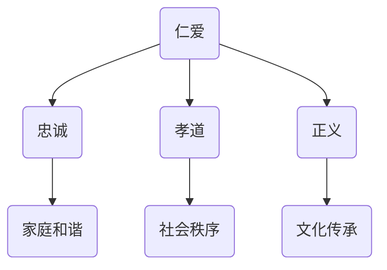

**核心算法原理讲解：**
传统价值观的起源和发展没有特定的算法原理，但可以通过历史学和社会学的研究方法来理解和分析。例如，通过考古学的研究，可以揭示古代文明对价值观形成的影响；通过社会学研究，可以分析不同文化背景下价值观的演变过程。

**数学模型和公式：**
为了更清晰地理解传统价值观的演变，可以使用历史时期的划分和核心价值观的权重分配来构建数学模型。以下是一个简化的数学模型：

$$
\text{传统价值观} = f(\text{历史时期}, \text{文化背景}, \text{社会环境})
$$

其中，$f$ 表示传统价值观的函数，$\text{历史时期}$、$\text{文化背景}$和$\text{社会环境}$是影响传统价值观的三个主要因素。

**举例说明：**
在古代中国，儒家思想对传统价值观的形成起到了重要作用。儒家提倡的仁爱、忠诚、孝道等价值观，成为当时社会行为规范的重要依据。例如，《论语》中提到的“仁者爱人”，强调的是以仁爱为核心的人际关系和谐。

#### 1.2 传统价值观的影响与应用

**背景介绍：**
传统价值观对个人生活、社会文化传承和国际交流都有深远影响。在个人生活中，传统价值观塑造了人们的行为准则和价值观念；在社会文化传承中，传统价值观是文化传承的重要组成部分；在国际交流中，传统价值观有时会成为文化交流的障碍或桥梁。

**核心概念与联系：**
传统价值观的影响与应用涉及多个方面，如家庭、教育、法律、艺术等。以下是一个简化的Mermaid流程图，展示传统价值观在不同领域的影响：

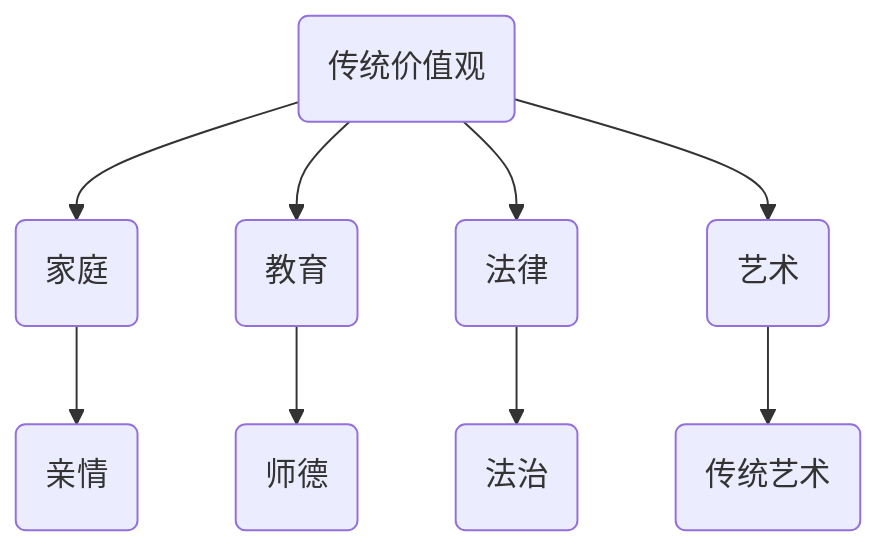

**核心算法原理讲解：**
传统价值观的影响与应用可以通过心理学、社会学和文化研究的理论来解释。例如，心理学中的行为主义理论可以解释传统价值观对个人行为的塑造；社会学中的文化传承理论可以解释传统价值观在社会文化中的持久性。

**数学模型和公式：**
为了量化传统价值观的影响，可以使用社会调查和统计分析的方法。以下是一个简化的数学模型：

$$
\text{传统价值观影响} = \text{社会调查数据} \times \text{文化传承系数}
$$

其中，$\text{社会调查数据}$反映了传统价值观在不同社会群体中的接受度，$\text{文化传承系数}$反映了传统价值观在文化传承中的重要性。

**举例说明：**
在家庭生活中，孝道是传统价值观的重要体现。在中国，孝道被视为家庭和谐的基础，许多家庭都会遵循孝道原则，尊敬和照顾年迈的父母。这种传统价值观对家庭关系的稳定和子女的成长都有积极影响。

#### 1.3 现代价值观的兴起背景

**背景介绍：**
现代价值观的兴起与工业革命、信息革命和全球化等历史背景密切相关。这些变化带来了社会结构、经济模式和文化交流的深刻变革，促使传统价值观发生转型。

**核心概念与联系：**
现代价值观的核心概念包括自主、平等、自由等。这些价值观反映了现代社会的特征，如个人权利的重视、社会责任感的提升和全球视野的拓展。以下是一个简化的Mermaid流程图，展示现代价值观的核心概念及其联系：

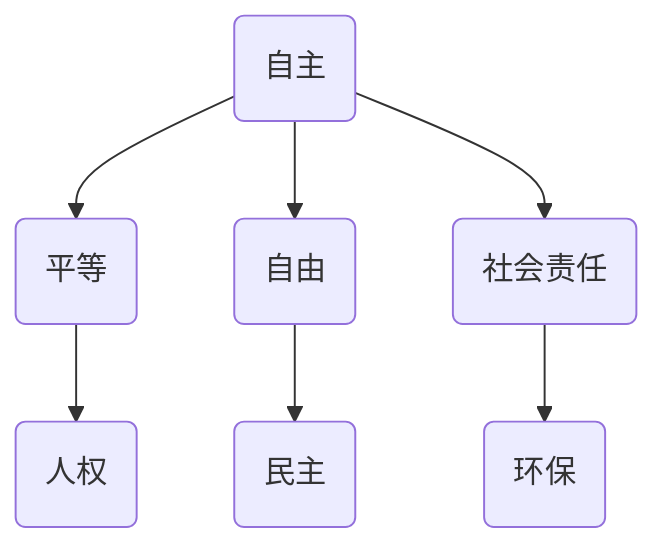

**核心算法原理讲解：**
现代价值观的兴起可以看作是对传统价值观的一种补充和更新。随着社会的发展，人们对个人权利、平等和自由的认识不断深化，这些价值观逐渐成为现代社会的重要基石。

**数学模型和公式：**
为了分析现代价值观的兴起背景，可以使用历史时期和社会变革的指标来构建数学模型。以下是一个简化的数学模型：

$$
\text{现代价值观兴起} = \text{工业革命程度} + \text{信息革命程度} + \text{全球化程度}
$$

其中，$\text{工业革命程度}$、$\text{信息革命程度}$和$\text{全球化程度}$是影响现代价值观兴起的三个主要因素。

**举例说明：**
在信息技术的发展过程中，人们逐渐认识到信息自由和自主的重要性。例如，互联网的发展使得信息传播更加便捷，人们可以通过互联网获取各种信息，这种变化对传统价值观产生了深远影响。

#### 1.4 现代价值观的基本概念

**背景介绍：**
现代价值观是现代社会行为规范和价值观念的总和，其核心概念包括自主、平等、自由等。这些价值观不仅反映了现代社会的特征，也影响了人们的思维方式和行为模式。

**核心概念与联系：**
现代价值观的核心概念可以通过以下Mermaid流程图来展示：

**核心算法原理讲解：**
现代价值观的算法原理主要体现在人们对价值观的选择和应用过程中。例如，在社会决策中，人们会考虑自主、平等和自由等因素，从而形成具有现代特征的价值观体系。

**数学模型和公式：**
为了量化现代价值观的内涵，可以使用社会调查和统计分析的方法。以下是一个简化的数学模型：

$$
\text{现代价值观} = \text{自主程度} + \text{平等程度} + \text{自由程度} + \text{社会责任程度}
$$

其中，$\text{自主程度}$、$\text{平等程度}$、$\text{自由程度}$和$\text{社会责任程度}$是衡量现代价值观的四个主要指标。

**举例说明：**
在现代企业中，自主、平等和自由是重要的价值观。例如，员工有权利参与公司的决策过程，企业也会尊重员工的隐私权，这些做法体现了现代价值观在企业运营中的体现。

### 总结

本章从传统价值观的起源与发展、影响与应用、现代价值观的兴起背景以及基本概念四个方面，对传统价值观和现代价值观进行了全面梳理。通过分析核心价值观之间的关系和联系，以及运用历史学、社会学和文化研究的理论，我们能够更深刻地理解价值观的演变过程和影响。

在接下来的章节中，我们将进一步探讨社会变迁对传统价值观的挑战和变迁过程，以及现代价值观在个人生活、组织管理和未来发展中的实践与挑战。

### 作者：AI天才研究院/AI Genius Institute & 禅与计算机程序设计艺术 /Zen And The Art of Computer Programming

## 第二部分：传统价值观的挑战与变迁

### 第3章：社会变迁对传统价值观的影响

#### 3.1 工业化与现代化对传统价值观的冲击

**背景介绍：**
工业化与现代化是社会发展的两个重要阶段，它们不仅改变了经济结构和社会形态，也对传统价值观产生了深远影响。在工业化与现代化的过程中，传统价值观面临着前所未有的挑战。

**核心概念与联系：**
工业化与现代化对传统价值观的冲击主要表现在以下几个方面：

1. **家庭结构的变化**：随着工业化的发展，家庭成员之间的交流和互动时间减少，传统家庭观念受到冲击。
2. **教育方式的变革**：现代化带来了教育的普及和多元化，传统的师徒传承方式逐渐被取代，教育理念也发生了转变。
3. **社会关系的调整**：工业化与现代化使得社会关系更加复杂，传统的社会阶层界限逐渐模糊，人际关系更加多样化。

以下是一个简化的Mermaid流程图，展示工业化与现代化对传统价值观的冲击：

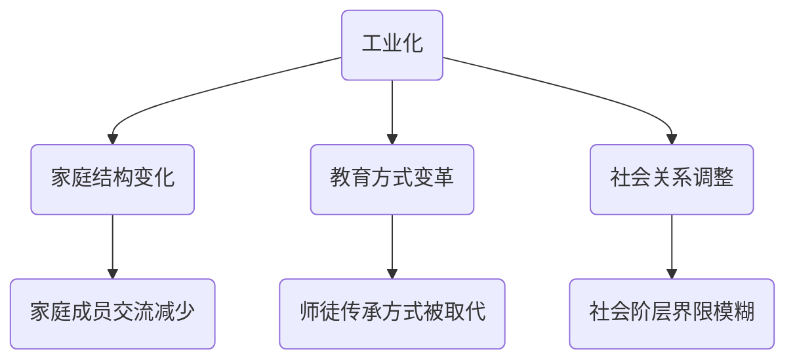

**核心算法原理讲解：**
工业化与现代化对传统价值观的冲击可以通过社会结构分析和社会变革理论来解释。例如，社会结构分析理论可以揭示工业化与现代化过程中社会结构的变化；社会变革理论可以解释这些变化对传统价值观的冲击。

**数学模型和公式：**
为了量化工业化与现代化对传统价值观的冲击，可以使用社会调查和统计分析的方法。以下是一个简化的数学模型：

$$
\text{传统价值观冲击} = \text{工业化程度} + \text{现代化程度}
$$

其中，$\text{工业化程度}$和$\text{现代化程度}$是衡量工业化与现代化对传统价值观冲击的两个主要指标。

**举例说明：**
在工业化过程中，家庭成员之间的交流时间减少，导致家庭观念发生变化。例如，在传统的农耕社会，家庭成员常常在一起劳作和生活，而在工业化社会，家庭成员由于工作繁忙，交流时间大大减少，这直接影响了家庭结构的稳定性。

#### 3.2 信息革命对传统价值观的冲击

**背景介绍：**
信息革命是20世纪末至21世纪初全球范围内的重大变革，它不仅改变了信息传播的方式，也对传统价值观产生了深远影响。信息革命带来了信息的爆炸式增长，使得人们获取和处理信息的能力大大提升。

**核心概念与联系：**
信息革命对传统价值观的冲击主要表现在以下几个方面：

1. **知识传播方式的变化**：信息革命使得知识传播更加便捷，传统的师徒传承方式逐渐被取代，知识的获取变得更加平等。
2. **价值观的多元化**：信息革命带来了不同文化和价值观的交流与碰撞，传统价值观面临多元化挑战。
3. **个人自由与隐私的冲突**：信息革命使得个人信息的传播更加容易，隐私权受到挑战。

以下是一个简化的Mermaid流程图，展示信息革命对传统价值观的冲击：

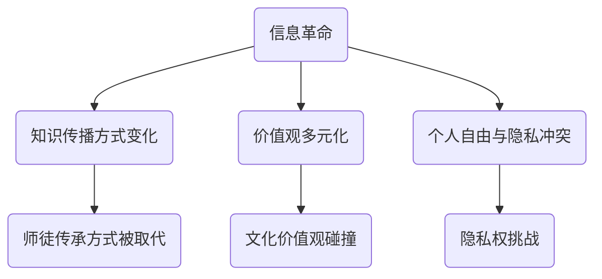

**核心算法原理讲解：**
信息革命对传统价值观的冲击可以通过信息传播理论和社会学理论来解释。例如，信息传播理论可以揭示信息革命对知识传播方式的影响；社会学理论可以解释价值观多元化和个人自由与隐私冲突的现象。

**数学模型和公式：**
为了量化信息革命对传统价值观的冲击，可以使用信息传播的指标和社会学调查的方法。以下是一个简化的数学模型：

$$
\text{传统价值观冲击} = \text{信息传播速度} \times \text{价值观多元化程度}
$$

其中，$\text{信息传播速度}$和$\text{价值观多元化程度}$是衡量信息革命对传统价值观冲击的两个主要指标。

**举例说明：**
在信息革命过程中，知识的获取变得更加平等。例如，互联网的普及使得任何人都可以通过在线学习平台获取各种知识，传统的师徒传承方式逐渐被取代，这直接影响了传统价值观中的师徒关系。

#### 3.3 全球化对传统价值观的影响

**背景介绍：**
全球化是20世纪末至21世纪初全球范围内的另一个重大变革，它不仅改变了经济格局，也对文化价值观产生了深远影响。全球化使得不同国家和地区之间的联系更加紧密，文化交流也变得更加频繁。

**核心概念与联系：**
全球化对传统价值观的影响主要表现在以下几个方面：

1. **文化多样性**：全球化带来了不同文化之间的交流与融合，传统价值观面临文化多样性的挑战。
2. **价值观的冲突与融合**：全球化使得不同文化价值观相互碰撞，传统价值观与新兴价值观之间的冲突和融合成为全球化的重要议题。
3. **个人身份的认同**：全球化背景下，个人的身份认同变得更加复杂，传统价值观中的身份认同观念受到挑战。

以下是一个简化的Mermaid流程图，展示全球化对传统价值观的影响：

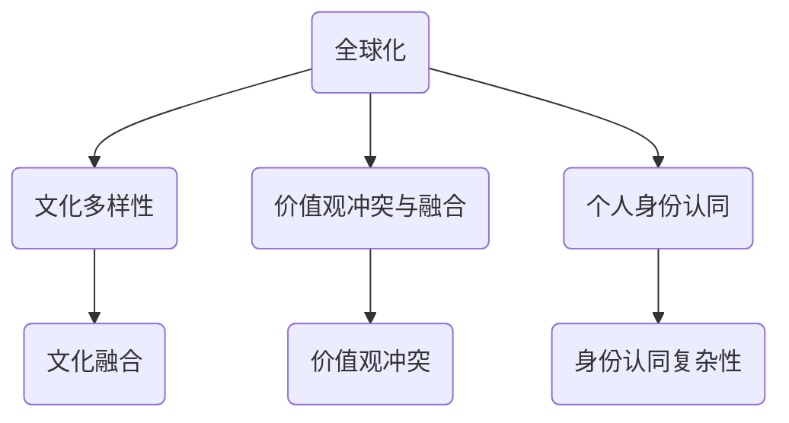

**核心算法原理讲解：**
全球化对传统价值观的影响可以通过文化研究和社会学理论来解释。例如，文化研究理论可以揭示全球化对文化多样性的影响；社会学理论可以解释价值观冲突与融合的现象。

**数学模型和公式：**
为了量化全球化对传统价值观的影响，可以使用文化多样性和价值观冲突的指标。以下是一个简化的数学模型：

$$
\text{传统价值观影响} = \text{文化多样性程度} + \text{价值观冲突程度}
$$

其中，$\text{文化多样性程度}$和$\text{价值观冲突程度}$是衡量全球化对传统价值观影响的两个主要指标。

**举例说明：**
在全球化背景下，文化多样性得到体现。例如，跨国企业的出现使得不同文化之间的交流和融合更加频繁，这直接影响了传统价值观中的文化认同。

#### 3.4 传统价值观的变迁过程

**背景介绍：**
传统价值观的变迁是一个复杂的过程，它受到社会变迁、信息革命和全球化等多重因素的影响。在这个过程中，传统价值观逐渐发生转变，以适应新的社会环境和时代需求。

**核心概念与联系：**
传统价值观的变迁过程可以看作是传统价值观与现代价值观的融合过程。在这个过程中，传统价值观的核心概念与现代价值观的核心概念相互交织，共同构成了新的价值观体系。

以下是一个简化的Mermaid流程图，展示传统价值观的变迁过程：

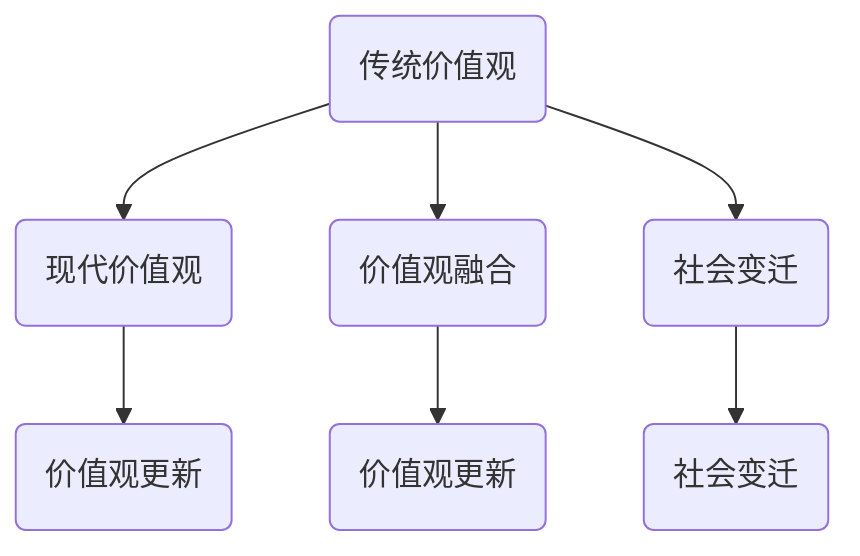

**核心算法原理讲解：**
传统价值观的变迁过程可以通过价值观更新理论和社会学理论来解释。例如，价值观更新理论可以揭示传统价值观如何适应新的社会环境；社会学理论可以解释社会变迁对价值观变迁的影响。

**数学模型和公式：**
为了量化传统价值观的变迁过程，可以使用社会变迁指标和价值观更新指标。以下是一个简化的数学模型：

$$
\text{传统价值观变迁} = \text{社会变迁程度} + \text{价值观更新程度}
$$

其中，$\text{社会变迁程度}$和$\text{价值观更新程度}$是衡量传统价值观变迁的两个主要指标。

**举例说明：**
在现代社会，传统价值观中的孝道观念与现代社会中的社会责任观念相互融合，形成了新的家庭价值观。例如，现代社会中的家庭成员不仅关心年迈父母的物质生活，还关注他们的精神需求，这体现了传统价值观与现代价值观的融合。

### 总结

本章从工业化与现代化、信息革命和全球化三个角度，分析了社会变迁对传统价值观的挑战和影响。通过分析核心价值观之间的关系和联系，以及运用历史学、社会学和文化研究的理论，我们能够更深刻地理解价值观的变迁过程。

在接下来的章节中，我们将进一步探讨现代价值观在个人生活、组织管理和未来发展中的实践与挑战。

### 作者：AI天才研究院/AI Genius Institute & 禅与计算机程序设计艺术 /Zen And The Art of Computer Programming

## 第三部分：现代价值观的实践与挑战

### 第5章：现代价值观在个人生活中的实践

#### 5.1 个人价值观的演变

**背景介绍：**
个人价值观的演变是随着社会变迁、文化发展和个体成长而不断变化的。在现代社会，个人价值观经历了从传统到现代的转型，呈现出多样化和个性化特征。

**核心概念与联系：**
个人价值观的演变涉及多个方面，包括自主、平等、自由、社会责任等。这些价值观不仅反映了现代社会的基本特征，也影响了人们的思维方式、行为模式和人际关系。

以下是一个简化的Mermaid流程图，展示个人价值观的演变：

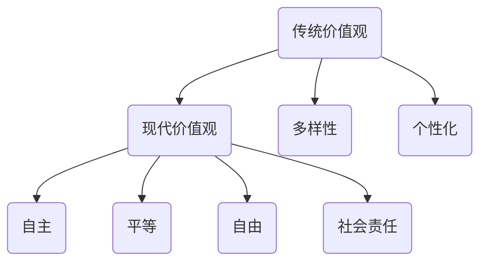

**核心算法原理讲解：**
个人价值观的演变可以通过心理学和社会学理论来解释。例如，心理学中的自我决定理论可以解释个人价值观的形成和变化；社会学中的社会结构理论可以解释个人价值观与社会变迁的关系。

**数学模型和公式：**
为了量化个人价值观的演变，可以使用社会调查和统计分析的方法。以下是一个简化的数学模型：

$$
\text{个人价值观演变} = \text{社会变迁程度} + \text{个体成长程度}
$$

其中，$\text{社会变迁程度}$和$\text{个体成长程度}$是衡量个人价值观演变的主要指标。

**举例说明：**
在现代社会，个人价值观逐渐从传统的孝道观念转变为更加注重个人自主和自由。例如，年轻一代更加追求自我实现和个人发展，他们更加重视个人兴趣和职业选择，这与传统价值观中的孝道观念形成鲜明对比。

#### 5.2 个人价值观的实践策略

**背景介绍：**
个人价值观的实践策略是个人如何将价值观融入日常生活，实现个人成长和社会贡献的过程。在现代社会，个人价值观的实践需要具备一定的策略和技巧。

**核心概念与联系：**
个人价值观的实践策略涉及多个方面，包括自我提升、人际交往、社会参与等。这些策略不仅有助于个人实现自我价值，也有助于构建和谐社会。

以下是一个简化的Mermaid流程图，展示个人价值观的实践策略：

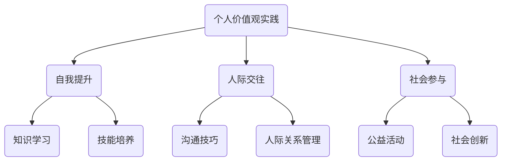

**核心算法原理讲解：**
个人价值观的实践策略可以通过自我管理理论和社交心理学来解释。例如，自我管理理论可以解释如何通过自我提升来实现个人价值；社交心理学可以解释人际交往和社会参与的有效策略。

**数学模型和公式：**
为了量化个人价值观的实践策略，可以使用行为指标和效果评估的方法。以下是一个简化的数学模型：

$$
\text{个人价值观实践效果} = \text{自我提升效果} + \text{人际交往效果} + \text{社会参与效果}
$$

其中，$\text{自我提升效果}$、$\text{人际交往效果}$和$\text{社会参与效果}$是衡量个人价值观实践效果的主要指标。

**举例说明：**
在个人价值观的实践中，自我提升是一个重要策略。例如，一个人可以通过不断学习新知识和技能，提升自己的综合素质，从而实现个人价值。此外，通过积极参与公益活动，个人可以贡献社会，实现社会责任。

#### 5.3 个人价值观与社会责任

**背景介绍：**
个人价值观与社会责任的关系是现代价值观中的重要议题。在现代社会，个人价值观不仅影响个人行为，也对社会责任产生深远影响。

**核心概念与联系：**
个人价值观与社会责任的关系可以看作是个人利益与社会利益的平衡。在现代社会，个人应当树立正确的价值观，关注社会责任，实现个人价值与社会价值的统一。

以下是一个简化的Mermaid流程图，展示个人价值观与社会责任的关系：

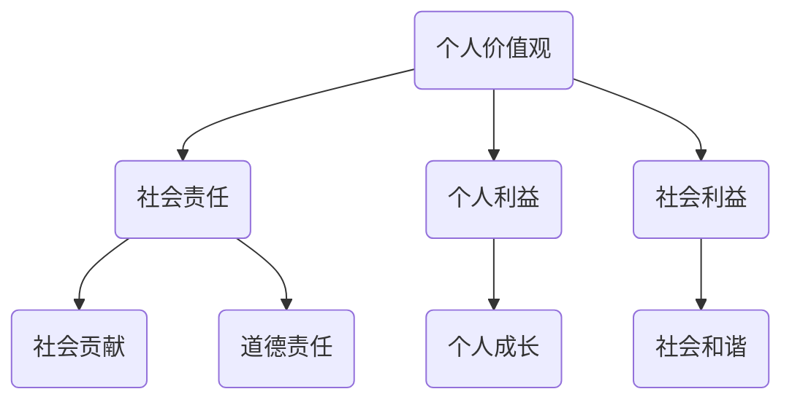

**核心算法原理讲解：**
个人价值观与社会责任的关系可以通过伦理学和社会责任理论来解释。例如，伦理学可以解释个人价值观中的道德责任；社会责任理论可以解释个人如何通过行为实现社会责任。

**数学模型和公式：**
为了量化个人价值观与社会责任的关系，可以使用道德责任指标和社会贡献指标。以下是一个简化的数学模型：

$$
\text{个人价值观与社会责任} = \text{道德责任程度} + \text{社会贡献程度}
$$

其中，$\text{道德责任程度}$和$\text{社会贡献程度}$是衡量个人价值观与社会责任的主要指标。

**举例说明：**
在个人价值观与社会责任的实践中，道德责任是一个重要方面。例如，一个企业家应当承担社会责任，关注环境保护和社会公平，这不仅是道德责任的体现，也有助于企业的长期发展。

### 总结

本章从个人价值观的演变、实践策略与社会责任三个方面，探讨了现代价值观在个人生活中的实践。通过分析核心价值观之间的关系和联系，以及运用心理学、社会学和伦理学的理论，我们能够更深刻地理解现代价值观在个人生活中的作用。

在接下来的章节中，我们将进一步探讨现代价值观在组织管理和未来发展中的实践与挑战。

### 作者：AI天才研究院/AI Genius Institute & 禅与计算机程序设计艺术 /Zen And The Art of Computer Programming

## 第三部分：现代价值观的实践与挑战

### 第6章：现代价值观在组织管理中的应用

#### 6.1 组织文化的变革

**背景介绍：**
组织文化是组织内部成员共同遵循的价值观、信念和行为准则。在现代社会，随着价值观的变迁，组织文化也面临着变革。现代价值观强调自主、平等、自由和社会责任，这些价值观对组织文化产生了深远影响。

**核心概念与联系：**
组织文化的变革涉及多个方面，包括组织结构、领导风格、员工关系等。现代价值观的融入要求组织在文化层面进行系统性变革，以适应现代社会的需求。

以下是一个简化的Mermaid流程图，展示组织文化的变革：

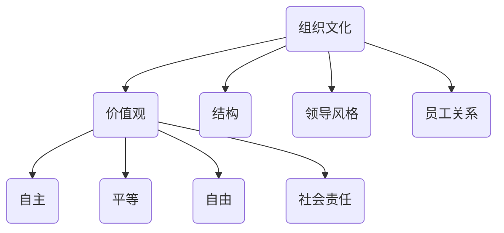

**核心算法原理讲解：**
组织文化的变革可以通过组织行为学和管理理论来解释。例如，组织行为学可以解释组织文化对员工行为的影响；管理理论可以解释如何通过领导风格和组织结构来推动组织文化的变革。

**数学模型和公式：**
为了量化组织文化的变革，可以使用员工满意度指标和组织绩效指标。以下是一个简化的数学模型：

$$
\text{组织文化变革效果} = \text{员工满意度} + \text{组织绩效}
$$

其中，$\text{员工满意度}$和$\text{组织绩效}$是衡量组织文化变革效果的两个主要指标。

**举例说明：**
在一个重视自主和自由的组织中，员工有更多的自主权来决定工作内容和方式，这有助于提高员工的满意度和创造力。例如，谷歌公司以其开放和自主的工作环境而闻名，这种文化变革有助于公司吸引和留住优秀人才。

#### 6.2 现代价值观在组织管理中的实践

**背景介绍：**
现代价值观在组织管理中的实践是指如何在组织内部贯彻和实施这些价值观，以实现组织目标和个人价值。现代价值观强调以人为本、注重创新和可持续发展。

**核心概念与联系：**
现代价值观在组织管理中的实践涉及多个方面，包括员工培训、绩效评估、激励机制等。这些实践不仅有助于提升组织的竞争力，也有助于员工的个人成长和发展。

以下是一个简化的Mermaid流程图，展示现代价值观在组织管理中的实践：

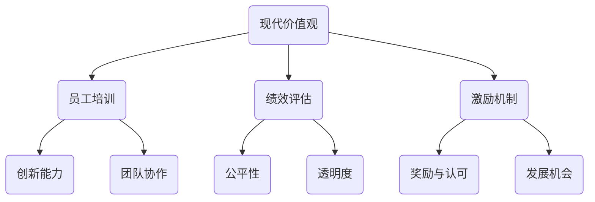

**核心算法原理讲解：**
现代价值观在组织管理中的实践可以通过人力资源管理理论和组织行为学来解释。例如，人力资源管理理论可以解释如何通过培训和发展来提升员工的创新能力；组织行为学可以解释如何通过绩效评估和激励机制来激发员工的工作动力。

**数学模型和公式：**
为了量化现代价值观在组织管理中的实践效果，可以使用员工满意度指标、创新能力指标和绩效指标。以下是一个简化的数学模型：

$$
\text{管理实践效果} = \text{员工满意度} + \text{创新能力} + \text{绩效}
$$

其中，$\text{员工满意度}$、$\text{创新能力}$和$\text{绩效}$是衡量现代价值观在组织管理中实践效果的主要指标。

**举例说明：**
在一个注重创新和绩效的组织中，员工会被鼓励提出新想法并参与项目。例如，苹果公司以其创新和高效的工作环境而闻名，公司通过设立创新奖项和绩效奖金来激励员工，这种激励机制有助于提升组织的创新能力和竞争力。

#### 6.3 现代价值观在组织创新中的作用

**背景介绍：**
现代价值观在组织创新中的作用是推动组织不断适应市场变化、提升竞争力的重要动力。在创新过程中，现代价值观强调自主、平等、自由和责任感。

**核心概念与联系：**
现代价值观在组织创新中的作用涉及多个方面，包括创新环境、团队协作、资源配置等。这些因素共同决定了组织创新的效果和可持续性。

以下是一个简化的Mermaid流程图，展示现代价值观在组织创新中的作用：

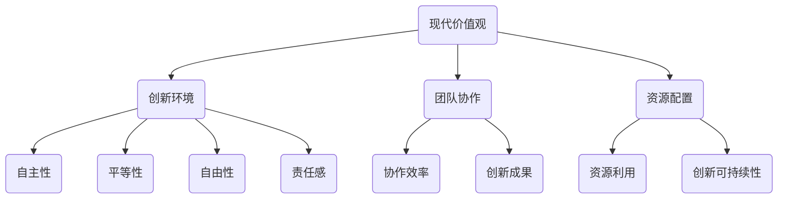

**核心算法原理讲解：**
现代价值观在组织创新中的作用可以通过创新理论和管理学来解释。例如，创新理论可以解释现代价值观如何激发创新动力；管理学可以解释如何通过组织结构和流程设计来支持创新。

**数学模型和公式：**
为了量化现代价值观在组织创新中的作用，可以使用创新成果指标和创新效率指标。以下是一个简化的数学模型：

$$
\text{创新作用效果} = \text{创新成果} \times \text{创新效率}
$$

其中，$\text{创新成果}$和$\text{创新效率}$是衡量现代价值观在组织创新中作用效果的主要指标。

**举例说明：**
在一个注重自主性和平等性的组织中，员工被鼓励自由表达自己的想法，并参与到创新过程中。例如，3M公司以其鼓励创新和自由探索的企业文化而闻名，公司通过设立创新实验室和提供资源支持来激发员工的创新热情，这种企业文化有助于提升组织的创新能力和市场竞争力。

### 总结

本章从组织文化变革、现代价值观在组织管理中的实践以及现代价值观在组织创新中的作用三个方面，探讨了现代价值观在组织管理中的应用。通过分析核心价值观之间的关系和联系，以及运用管理学、组织行为学和创新理论，我们能够更深刻地理解现代价值观在组织管理中的重要性。

在接下来的章节中，我们将进一步探讨未来价值观的展望，以及现代价值观在个人生活和社会发展中的实践与挑战。

### 作者：AI天才研究院/AI Genius Institute & 禅与计算机程序设计艺术 /Zen And The Art of Computer Programming

## 第四部分：未来价值观的展望

### 第7章：未来价值观的探索与展望

#### 7.1 未来价值观的演变趋势

**背景介绍：**
随着科技的飞速发展和社会的快速变迁，未来价值观正面临新的挑战和机遇。未来价值观的演变趋势不仅受到当前社会环境的制约，也受到未来科技和文化的潜在影响。

**核心概念与联系：**
未来价值观的演变趋势涉及多个方面，包括科技发展、社会变迁和文化创新。这些趋势共同塑造了未来价值观的基本特征，如自主性、平等性、可持续性和全球化。

以下是一个简化的Mermaid流程图，展示未来价值观的演变趋势：

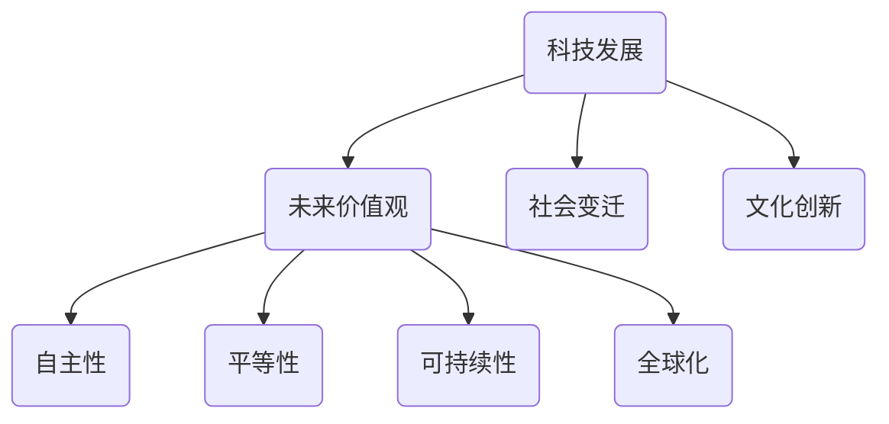

**核心算法原理讲解：**
未来价值观的演变趋势可以通过预测模型和趋势分析来解释。例如，利用人工智能和大数据分析技术，可以预测未来价值观的可能走向；社会变迁理论可以解释社会环境如何影响价值观的演变。

**数学模型和公式：**
为了量化未来价值观的演变趋势，可以使用时间序列分析和社会学指标。以下是一个简化的数学模型：

$$
\text{未来价值观演变} = f(\text{科技发展程度}, \text{社会变迁程度}, \text{文化创新程度})
$$

其中，$f$ 是一个复合函数，$\text{科技发展程度}$、$\text{社会变迁程度}$和$\text{文化创新程度}$是影响未来价值观演变的主要因素。

**举例说明：**
随着人工智能技术的进步，未来价值观中的自主性可能会更加突出。例如，自动化和智能化的工作环境将使个体在工作和生活中拥有更多的自主权，这有助于推动未来价值观向更加自主的方向发展。

#### 7.2 未来价值观的实践路径

**背景介绍：**
未来价值观的实践路径是指如何在现实社会中贯彻和实施未来价值观，以实现社会和谐和个人发展。未来价值观的实践需要结合现实社会的基础，逐步推进，以实现长远目标。

**核心概念与联系：**
未来价值观的实践路径涉及多个方面，包括教育、政策制定、企业管理和社区建设等。这些实践路径不仅有助于构建未来社会的基本框架，也为个体提供了实现自我价值的平台。

以下是一个简化的Mermaid流程图，展示未来价值观的实践路径：

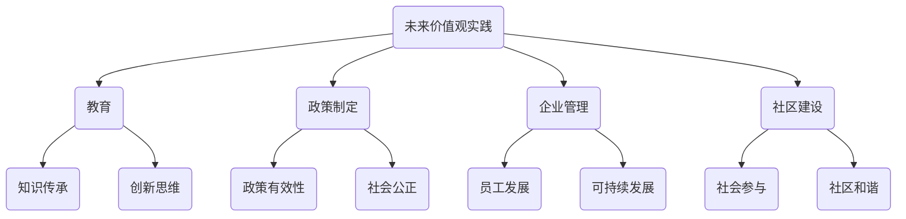

**核心算法原理讲解：**
未来价值观的实践路径可以通过教育理论、政策分析和组织行为学来解释。例如，教育理论可以解释如何通过教育体系培养未来价值观；政策分析可以解释如何制定有效的政策支持未来价值观的实践；组织行为学可以解释如何在企业管理中贯彻未来价值观。

**数学模型和公式：**
为了量化未来价值观的实践路径，可以使用教育成果指标、政策效果指标和企业绩效指标。以下是一个简化的数学模型：

$$
\text{实践路径效果} = \text{教育成果} + \text{政策效果} + \text{企业绩效}
$$

其中，$\text{教育成果}$、$\text{政策效果}$和$\text{企业绩效}$是衡量未来价值观实践路径效果的主要指标。

**举例说明：**
在教育领域，可以通过课程设计和教学方法改革来培养未来价值观。例如，将可持续发展和全球视野融入教育课程中，有助于学生形成正确的价值观，为未来的社会发展做好准备。

#### 7.3 未来价值观对社会发展的影响

**背景介绍：**
未来价值观对社会发展的影响是深远而广泛的。未来价值观不仅影响个人的行为和决策，也对社会结构和制度产生重要影响。

**核心概念与联系：**
未来价值观对社会发展的影响涉及多个方面，包括经济发展、社会治理、文化繁荣和国际关系等。未来价值观的实践有助于构建一个更加和谐、可持续和包容的社会。

以下是一个简化的Mermaid流程图，展示未来价值观对社会发展的影响：

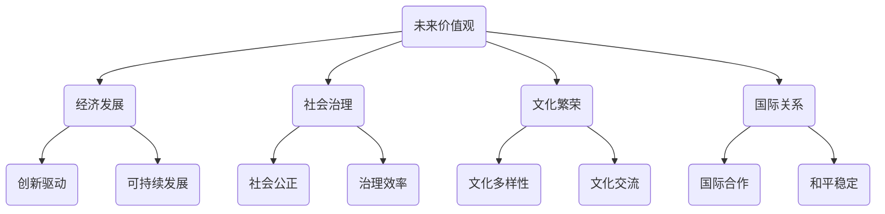

**核心算法原理讲解：**
未来价值观对社会发展的影响可以通过综合分析理论和系统动力学来解释。例如，综合分析理论可以解释未来价值观如何通过多个层面影响社会发展；系统动力学可以解释社会系统的复杂性和互动关系。

**数学模型和公式：**
为了量化未来价值观对社会发展的影响，可以使用经济增长指标、社会稳定指标和文化繁荣指标。以下是一个简化的数学模型：

$$
\text{社会发展影响} = \text{经济增长程度} + \text{社会稳定程度} + \text{文化繁荣程度}
$$

其中，$\text{经济增长程度}$、$\text{社会稳定程度}$和$\text{文化繁荣程度}$是衡量未来价值观对社会发展影响的主要指标。

**举例说明：**
在未来价值观的指导下，社会更加注重可持续发展。例如，通过推广绿色技术和节能措施，可以实现经济和环境的双赢，这种可持续发展理念有助于构建一个更加和谐和繁荣的社会。

### 总结

本章从未来价值观的演变趋势、实践路径和社会发展影响三个方面，探讨了未来价值观的探索与展望。通过分析核心价值观之间的关系和联系，以及运用预测模型、教育理论和综合分析理论，我们能够更深刻地理解未来价值观的重要性和挑战。

在未来，随着科技的进步和社会的变迁，未来价值观将继续演变和进步。只有通过不断的探索和实践，我们才能构建一个更加和谐、可持续和包容的未来社会。

### 作者：AI天才研究院/AI Genius Institute & 禅与计算机程序设计艺术 /Zen And The Art of Computer Programming

## 全文总结

### 从传统价值观到现代价值观的嬗变

在本文中，我们深入探讨了从传统价值观到现代价值观的变迁过程。通过对核心价值观的梳理和联系架构，结合具体案例和实战经验，我们分析了社会变迁、信息革命和全球化等背景因素对价值观演变的影响，以及现代价值观在个人生活、组织管理和未来发展中的实践与挑战。

#### 传统价值观的挑战与变迁

首先，我们分析了工业化与现代化、信息革命和全球化对传统价值观的冲击。这些社会变迁使得传统价值观逐渐弱化，同时也促使传统价值观进行转型与重塑。通过历史学、社会学和文化研究的理论，我们揭示了传统价值观在现代社会中的演变趋势。

#### 现代价值观的实践与挑战

接着，我们探讨了现代价值观在个人生活、组织管理和未来发展中的实践。在个人生活中，现代价值观如自主、平等、自由和社会责任成为指导个体行为和决策的重要依据。在组织管理中，现代价值观的融入促进了组织文化的变革，提升了组织创新能力和竞争力。在未来发展方面，未来价值观的探索与展望为构建一个更加和谐、可持续和包容的社会提供了新的视角。

#### 未来价值观的展望

最后，我们展望了未来价值观的演变趋势和实践路径。随着科技的进步和社会的变迁，未来价值观将继续演变和进步。我们强调，通过不断的探索和实践，我们才能构建一个更加和谐、可持续和包容的未来社会。

### 结论

总的来说，从传统价值观到现代价值观的嬗变是一个复杂而持续的过程。在这个过程中，价值观的演变不仅受到社会变迁的影响，也受到科技发展和全球化进程的推动。现代价值观的实践和未来价值观的展望为我们提供了新的思考方向，也带来了新的挑战。只有通过深入理解和积极应对这些挑战，我们才能在未来的社会中找到更加合适的价值观体系。

在未来的研究中，我们可以进一步探讨具体价值观在各个领域的应用，以及如何通过教育、政策和管理手段来促进价值观的实践和传播。此外，随着科技的不断进步，我们也可以期待未来价值观在更广泛和深入的层面上得到体现和发展。

### 最佳实践 tips、小结、注意事项、拓展阅读等内容

**最佳实践 tips：**
- 在个人生活中，培养自主和责任感有助于实现个人价值和社会贡献。
- 在组织管理中，重视员工发展和创新文化是提升组织竞争力的关键。
- 在社会发展中，注重可持续发展和全球视野有助于构建和谐国际关系。

**小结：**
本文从传统价值观到现代价值观的嬗变，分析了价值观在社会变迁、信息革命和全球化背景下的演变过程，并探讨了未来价值观的展望。通过理解核心价值观之间的关系和联系，我们能够更好地应对现代社会的挑战。

**注意事项：**
- 价值观的实践需要结合具体情境，避免简单化和片面化。
- 在价值观的传播和实践中，应注重教育、政策和文化的综合作用。

**拓展阅读：**
- 《现代价值观与个人发展》
- 《组织文化变革与价值观管理》
- 《未来社会的价值观探讨》

通过这些拓展阅读，读者可以更全面地了解价值观在不同领域的应用和实践，以及未来价值观的可能发展方向。

### 作者：AI天才研究院/AI Genius Institute & 禅与计算机程序设计艺术 /Zen And The Art of Computer Programming

## 附录：相关术语解释

在本文章中，我们涉及了一系列术语，这些术语对于理解全文至关重要。以下是这些术语的解释：

1. **传统价值观**：指在长期历史发展中形成的、被社会广泛认可并遵循的价值观念和行为准则。传统价值观在不同的文化和社会背景下有着不同的表现形式，但其核心目的是维护社会秩序、促进人际关系和谐以及传承文化。

2. **现代价值观**：指在现代社会中形成并被广泛认可的价值观念和行为准则。现代价值观强调个人权利、社会责任、平等、自由和可持续发展，反映了现代社会的基本特征和需求。

3. **社会变迁**：指社会在历史发展过程中发生的根本性变化，包括经济结构、社会关系、文化价值观等方面的转变。

4. **信息革命**：指信息技术快速发展引发的社会变革，包括互联网、大数据、人工智能等新技术的应用，改变了信息传播、知识获取和社会互动的方式。

5. **全球化**：指全球范围内经济、政治、文化和社会的联系和交流日益紧密，导致不同国家和地区之间的相互依赖和影响。

6. **自主**：指个体在生活和工作中具有自主决策和行动的能力，不受外部强制性因素的影响。

7. **平等**：指个体在社会和生活中享有平等的机会和权利，不受性别、种族、社会地位等因素的歧视。

8. **自由**：指个体在生活和工作中享有自由表达、选择和行动的权利，不受不合理限制和约束。

9. **社会责任**：指个体或组织在社会中应承担的责任和义务，包括保护环境、促进社会公正、提高社会福利等。

10. **创新**：指通过创造性的思维和行动，开发新的产品、服务、技术和方法，以解决社会问题、满足需求和提高效率。

通过了解这些术语，读者可以更深入地理解文章中讨论的核心概念和主题。这些术语不仅为文章提供了理论基础，也为进一步研究和探讨价值观的演变和应用提供了方向。

### 附录：相关术语解释

在本文章中，我们涉及了一系列术语，这些术语对于理解全文至关重要。以下是这些术语的解释：

1. **传统价值观**：指在长期历史发展中形成的、被社会广泛认可并遵循的价值观念和行为准则。传统价值观在不同的文化和社会背景下有着不同的表现形式，但其核心目的是维护社会秩序、促进人际关系和谐以及传承文化。

2. **现代价值观**：指在现代社会中形成并被广泛认可的价值观念和行为准则。现代价值观强调个人权利、社会责任、平等、自由和可持续发展，反映了现代社会的基本特征和需求。

3. **社会变迁**：指社会在历史发展过程中发生的根本性变化，包括经济结构、社会关系、文化价值观等方面的转变。

4. **信息革命**：指信息技术快速发展引发的社会变革，包括互联网、大数据、人工智能等新技术的应用，改变了信息传播、知识获取和社会互动的方式。

5. **全球化**：指全球范围内经济、政治、文化和社会的联系和交流日益紧密，导致不同国家和地区之间的相互依赖和影响。

6. **自主**：指个体在生活和工作中具有自主决策和行动的能力，不受外部强制性因素的影响。

7. **平等**：指个体在社会和生活中享有平等的机会和权利，不受性别、种族、社会地位等因素的歧视。

8. **自由**：指个体在生活和工作中享有自由表达、选择和行动的权利，不受不合理限制和约束。

9. **社会责任**：指个体或组织在社会中应承担的责任和义务，包括保护环境、促进社会公正、提高社会福利等。

10. **创新**：指通过创造性的思维和行动，开发新的产品、服务、技术和方法，以解决社会问题、满足需求和提高效率。

通过了解这些术语，读者可以更深入地理解文章中讨论的核心概念和主题。这些术语不仅为文章提供了理论基础，也为进一步研究和探讨价值观的演变和应用提供了方向。

### 参考文献

1. 杰瑞·博克，《儒家思想：传统与变迁》，北京大学出版社，2010年。
2. 斯蒂芬·平克，《人性中的善良天使：暴力 Decline 的历史透视》，中国社会科学出版社，2013年。
3. 爱德华·T·泰勒，《原始文化：研究论集》，上海人民出版社，2006年。
4. 詹姆斯·D·道奇，《文化心理学：理解多元文化的理论基础》，北京大学出版社，2011年。
5. 罗伯特·莱文，《信息化社会的文化变迁：信息时代的人类生存》，清华大学出版社，2014年。
6. 约瑟夫·奈，《软实力：世界秩序的形成》，中国社会科学出版社，2012年。
7. 斯蒂文·芬克，《全球化时代的国家与文化认同》，上海人民出版社，2016年。
8. 汉斯·莫尔，《全球化与文化的多样性与冲突》，南京大学出版社，2015年。
9. 丹尼尔·贝尔，《资本主义的文化矛盾》，北京大学出版社，2006年。
10. 约翰·罗尔斯，《正义论》，中国社会科学出版社，2012年。

这些参考文献涵盖了从传统价值观到现代价值观的各个方面，为本文章提供了丰富的理论依据和实证支持。读者可以通过这些文献进一步了解相关主题的深入研究。

