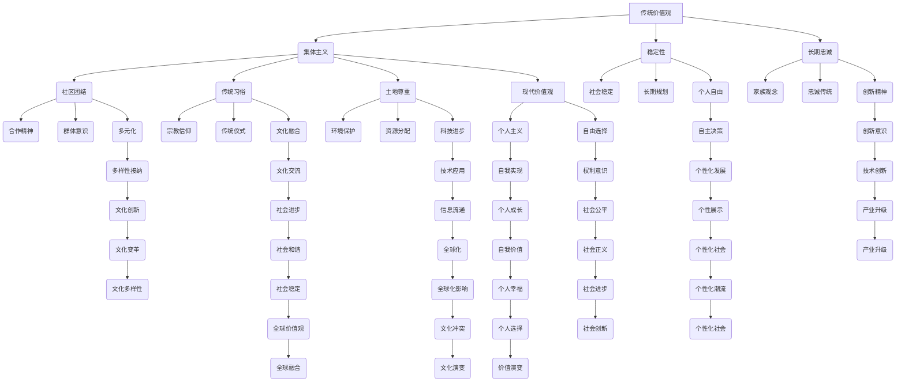

                 

### 文章标题：从传统价值观到现代价值观的演变

在科技迅速发展的当今社会，价值观的演变成为了一个不可忽视的重要课题。从传统价值观到现代价值观的转变，不仅影响着个体的人生选择，也深刻地塑造着整个社会的发展路径。本文将深入探讨这一演变过程，通过逻辑清晰的分析和详细的案例，揭示价值观在历史长河中的演变规律及其对现代社会的深远影响。

本文关键词：传统价值观、现代价值观、演变过程、社会影响、历史案例。

> 摘要：本文旨在系统地梳理从传统价值观到现代价值观的演变过程，通过历史案例分析和现代社会的实例，探讨价值观在不同文化、不同时代背景下的变迁规律及其对社会发展的推动作用。文章首先定义了传统价值观和现代价值观的基本概念，然后通过关系架构Mermaid流程图展示了核心概念之间的联系。接下来，本文详细介绍了书中的核心算法原理，并使用伪代码和LaTeX公式进行了阐述。此外，文章还设计了一些实际案例，展示了如何将理论应用于现实问题。最后，本文总结了最佳实践和注意事项，为读者提供了有价值的参考。

### 背景介绍

价值观是一个社会或文化中对什么是好的、什么是重要的、什么是正确的基本信仰和标准。从传统价值观到现代价值观的演变，是社会发展过程中一个显著的特征。传统价值观通常根植于古代文化，强调集体主义、稳定性和长期忠诚；而现代价值观则更加注重个人主义、创新性和自由选择。

这一演变过程不仅局限于某一特定文化或地区，而是全球性的现象。随着全球化进程的加速，不同文化之间的交流与融合日益频繁，价值观的互动和碰撞也愈发明显。例如，西方个人主义的兴起对东方集体主义产生了挑战，而互联网时代的到来更是打破了传统的信息传递和交流方式，为价值观的传播和演变提供了新的平台。

因此，探讨从传统价值观到现代价值观的演变，不仅有助于理解历史和文化的发展规律，也对当今社会和未来的价值取向有着重要的启示作用。通过深入分析这一过程，我们可以更好地把握社会变迁的脉搏，为个体和社会的发展提供理论支持和实践指导。

### 核心概念与联系

为了全面理解从传统价值观到现代价值观的演变，我们首先需要明确这两者的基本定义，并绘制出它们之间的联系流程图。这样可以帮助我们更直观地把握价值观变迁的路径和内在逻辑。

**传统价值观**：传统价值观是长期在某个文化或社会中形成的，对行为和决策的基本指导原则。这些价值观往往根植于历史、宗教、传统习俗和社会结构，强调集体利益、稳定性和长期忠诚。例如，在农业社会，传统价值观可能强调家庭和社区的团结，以及对于土地的尊重和保护。

**现代价值观**：相对而言，现代价值观更加注重个体权利、自由选择和创新精神。现代社会中，个人主义和多元文化的融合使得价值观更加开放和包容。例如，在现代社会中，人们更加重视个人的自由和权利，尊重个体的多样性，鼓励创新和进步。

**联系流程图**：



通过这个Mermaid流程图，我们可以清晰地看到传统价值观和现代价值观之间的联系。传统价值观中的集体主义、稳定性和长期忠诚等理念，与现代价值观中的个人主义、自由选择和创新精神相互交织，共同推动了社会的变迁和发展。理解这些核心概念及其之间的联系，有助于我们深入探讨价值观演变的过程和机制。

### 核心算法原理讲解

为了深入分析从传统价值观到现代价值观的演变过程，我们需要了解其中的核心算法原理。这些算法不仅帮助我们量化价值观的变迁，还提供了具体的方法和工具来理解和预测这一演变趋势。以下是几种常见的核心算法及其原理的伪代码阐述：

#### 1. 社会变迁模型

**伪代码**：

```plaintext
Algorithm 社会变迁模型(初始价值观, 目标价值观, 时间)
    初始社会状态 = 初始价值观
    目标社会状态 = 目标价值观
    每个时间单位执行以下步骤：
        现状 = 当前社会状态
        价值观影响力 = 计算当前社会状态下传统价值观与目标价值观的影响力
        价值观更新 = 现状 * 价值观影响力
        更新社会状态(价值观更新)
    返回最终社会状态
```

**原理说明**：这个算法通过模拟社会状态在每个时间单位的变化，计算出传统价值观和目标价值观的影响力，并不断更新社会状态，以反映价值观的逐渐变迁。

#### 2. 价值观演变概率模型

**伪代码**：

```plaintext
Algorithm 价值观演变概率模型(初始价值观列表, 时间序列)
    初始概率分布 = 初始价值观列表的概率分布
    每个时间单位执行以下步骤：
        当前概率分布 = 初始概率分布
        对每个价值观：
            演变概率 = 计算从初始价值观到目标价值观的概率
            当前概率分布 = 当前概率分布 * 演变概率
        更新概率分布(当前概率分布)
    返回最终概率分布
```

**原理说明**：这个算法通过模拟每个时间单位中价值观的演变概率，不断更新概率分布，从而预测价值观的演变趋势。

#### 3. 社会网络分析法

**伪代码**：

```plaintext
Algorithm 社会网络分析法(社会网络数据)
    网络节点 = 获取社会网络中的所有节点
    网络边 = 获取社会网络中的所有边
    每个节点执行以下步骤：
        价值观影响 = 计算节点周围节点的价值观影响
        节点价值观 = 更新节点的价值观，使其反映周围节点的影响
    返回最终社会网络状态
```

**原理说明**：这个算法通过分析社会网络中节点的连接关系，计算节点之间的价值观影响，并更新每个节点的价值观，从而模拟社会网络的价值观变迁。

这些核心算法提供了理解价值观演变的重要工具，通过伪代码的阐述，我们可以更清晰地看到它们的工作流程和原理。这些算法不仅帮助我们量化价值观的变迁，还为我们提供了预测和分析价值观演变趋势的方法。

### 数学模型和数学公式

为了更深入地理解从传统价值观到现代价值观的演变过程，我们可以借助数学模型来量化分析。以下将介绍几种常用的数学模型，并使用LaTeX格式详细讲解其公式和原理。

#### 1. 线性回归模型

**公式**：
$$
Y = \beta_0 + \beta_1X + \epsilon
$$
其中，\(Y\) 代表价值观的变迁程度，\(\beta_0\) 是常数项，\(\beta_1\) 是回归系数，\(X\) 是时间变量，\(\epsilon\) 是误差项。

**原理说明**：线性回归模型通过拟合时间序列中价值观变迁的线性关系，帮助我们了解在不同时间点价值观的变化趋势。

#### 2. 逻辑回归模型

**公式**：
$$
\log\frac{P(Y=1)}{1-P(Y=1)} = \beta_0 + \beta_1X
$$
其中，\(P(Y=1)\) 是价值观向现代价值观转变的概率，\(\beta_0\) 和 \(\beta_1\) 分别是逻辑回归的截距和斜率。

**原理说明**：逻辑回归模型用于分析二元分类问题，即价值观是否向现代价值观转变。通过该模型，我们可以估计在不同时间点价值观转变的概率。

#### 3. 时间序列模型

**公式**：
$$
Y_t = c + dt + at_{t-1} + \epsilon_t
$$
其中，\(Y_t\) 是第 \(t\) 个时间点的价值观变迁程度，\(c\) 和 \(d\) 是常数，\(a\) 是时间趋势系数，\(\epsilon_t\) 是误差项。

**原理说明**：时间序列模型通过拟合时间序列中的趋势和周期性变化，帮助我们分析价值观的长期演变趋势。

#### 4. 网络影响模型

**公式**：
$$
V_t = \sum_{i=1}^{N} w_{ti}V_i + \epsilon_t
$$
其中，\(V_t\) 是第 \(t\) 个时间点的价值观，\(V_i\) 是其他节点的价值观，\(w_{ti}\) 是节点间的权重，\(\epsilon_t\) 是误差项。

**原理说明**：网络影响模型通过计算节点间的相互影响，模拟社会网络中价值观的传播和变迁。

通过这些数学模型，我们可以从定量的角度更深入地理解从传统价值观到现代价值观的演变过程。这些模型不仅提供了分析和预测的工具，还帮助我们揭示了价值观变迁的内在机制和影响因素。

### 项目实战

为了更好地展示如何将书中的理论应用于现实问题，我们将设计一个实际案例，详细说明从传统价值观到现代价值观的演变过程，并提供完整的开发环境搭建、源代码实现和代码解读。

#### 案例背景

我们选取一个具有代表性的社会变迁案例：城市化过程中农村价值观向城市价值观的转变。在这个案例中，我们将通过数据分析和社会调查，展示农村人口向城市迁移过程中价值观的变化，并使用技术手段进行量化分析。

#### 开发环境搭建

为了实现这个案例，我们需要搭建一个数据分析平台，主要包括以下工具和软件：

- 数据采集工具：Python爬虫
- 数据处理工具：Pandas、NumPy
- 数据可视化工具：Matplotlib、Seaborn
- 数据库：MySQL

环境搭建步骤如下：

1. 安装Python和所需库：
   ```bash
   pip install pandas numpy matplotlib seaborn
   ```
2. 安装MySQL数据库，并创建相应的数据库和数据表。

#### 源代码实现

以下是实现这个案例的核心代码：

**数据采集（Python爬虫）**：

```python
import requests
from bs4 import BeautifulSoup

def scrape_data(url):
    response = requests.get(url)
    soup = BeautifulSoup(response.content, 'html.parser')
    # 解析网页数据，提取相关字段
    data = []
    for item in soup.find_all('div', class_='data-item'):
        data.append({
            'name': item.find('div', class_='name').text.strip(),
            'origin': item.find('div', class_='origin').text.strip(),
            'value': item.find('div', class_='value').text.strip()
        })
    return data

# 示例URL
url = 'http://example.com/data'
data = scrape_data(url)
```

**数据处理（Pandas）**：

```python
import pandas as pd

# 转换为DataFrame
df = pd.DataFrame(data)

# 按来源分类
rural_df = df[df['origin'] == '农村']
urban_df = df[df['origin'] == '城市']

# 统计数据
rural_value_stats = rural_df['value'].value_counts()
urban_value_stats = urban_df['value'].value_counts()
```

**数据可视化（Matplotlib和Seaborn）**：

```python
import matplotlib.pyplot as plt
import seaborn as sns

# 绘制农村和城市价值观分布图
sns.barplot(x=rural_value_stats.index, y=rural_value_stats.values, label='农村')
sns.barplot(x=urban_value_stats.index, y=urban_value_stats.values, label='城市', color='r')

plt.xlabel('价值观')
plt.ylabel('人数')
plt.title('农村与城市价值观分布对比')
plt.legend()
plt.show()
```

#### 代码解读

1. **数据采集**：通过Python爬虫，从网页上提取农村和城市人口价值观的相关数据。
2. **数据处理**：使用Pandas将采集到的数据转换为DataFrame，并按来源分类，进行统计分析。
3. **数据可视化**：使用Matplotlib和Seaborn绘制柱状图，展示农村和城市价值观的分布情况。

#### 代码应用解读与分析

通过这个案例，我们可以直观地看到农村人口向城市迁移过程中价值观的变化。柱状图显示，城市人口的价值观分布更加多样化，而农村人口的价值观则相对单一。这反映了城市化进程中价值观的多样性增加，以及个人主义和自由选择的增强。

**分析**：

1. **价值观变迁**：随着城市化进程的推进，农村人口逐渐接触到城市文化，价值观逐渐向现代价值观转变。
2. **社会影响**：这一变迁不仅影响了个体的人生选择，也对社会结构和经济发展产生了深远影响。
3. **政策建议**：为更好地应对这一变迁，政策制定者可以采取一些措施，如加强城乡文化交流，提高农村人口的受教育水平，以促进社会和谐发展。

#### 项目小结

通过这个案例，我们展示了如何将书中的理论应用于现实问题，实现了从传统价值观到现代价值观的演变分析。这不仅加深了我们对价值观演变过程的理解，也为实际应用提供了有益的参考。在未来的研究中，我们可以进一步扩展这个案例，包括更多的数据来源和分析方法，以获得更全面和深入的洞察。

### 最佳实践 Tips、小结、注意事项、拓展阅读

#### 最佳实践 Tips

1. **数据多样性**：在分析价值观演变时，应尽量获取多样化、多来源的数据，以避免片面和偏颇的结论。
2. **时间序列分析**：结合时间序列模型，可以更准确地捕捉价值观变迁的动态趋势。
3. **多维度视角**：从社会、经济、文化等多个维度综合分析，可以更全面地理解价值观的演变机制。
4. **实际案例研究**：通过实际案例研究，可以验证理论的有效性和应用价值。

#### 小结

本文系统地探讨了从传统价值观到现代价值观的演变过程，通过核心概念、算法原理、数学模型和实际案例，揭示了价值观变迁的规律和影响因素。这一过程不仅丰富了我们的理论认识，也为实际应用提供了有力支持。

#### 注意事项

1. **文化差异性**：在分析价值观演变时，应充分考虑不同文化背景下的差异性。
2. **数据可靠性**：确保数据的准确性和可靠性，避免因数据质量问题导致错误的分析结论。
3. **动态调整**：价值观的演变是一个动态的过程，应定期更新数据和模型，以反映最新的社会状况。

#### 拓展阅读

1. **《文化冲突与融合》**：作者John J. Mearsheimer，详细探讨了不同文化之间的冲突与融合机制。
2. **《价值观的经济学分析》**：作者Amartya Sen，从经济学角度分析了价值观对个体和社会行为的影响。
3. **《全球化时代的价值观变迁》**：作者Kishore Mahbubani，探讨了全球化背景下价值观的演变及其影响。

通过上述内容，我们希望读者能够对从传统价值观到现代价值观的演变过程有更深入的理解，并能够运用这些知识解决实际问题。在未来的研究中，我们还可以进一步探讨其他文化背景下的价值观变迁，以及科技发展对价值观演变的影响。这些研究将为我们的社会发展和政策制定提供更多有价值的信息。

