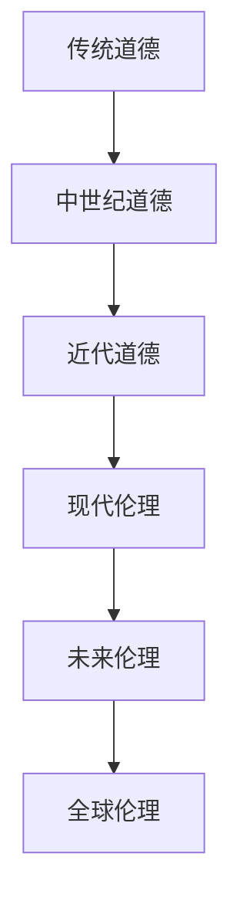

                 

# 《从传统道德到现代伦理：价值观的演进与重塑》

## 关键词
- 道德观念
- 伦理学
- 价值观
- 演进
- 现代伦理
- 传统道德
- 社会变迁
- 科技进步

## 摘要
本文将探讨道德观念从传统到现代的演变过程，分析其在社会变迁和科技进步背景下的重塑。通过详细梳理传统道德和现代伦理的定义、特点以及历史背景，本文将阐述道德观念的各个发展阶段及其核心思想。同时，本文还将探讨全球化背景下价值观的冲突与融合，以及现代伦理所面临的挑战和未来发展趋势。通过这一系统的分析，我们旨在揭示道德观念演进的本质及其对当代社会的影响。

## 引言

### 传统道德与现代伦理概述

传统道德和现代伦理是道德观念的两个重要阶段，它们在不同的历史时期和文化背景下产生和发展，反映了人类对道德理解的不同层次和深度。

#### 1.1 传统道德的定义与特点

传统道德通常指的是在特定历史时期和社会背景下形成的道德规范和价值观。这些道德观念往往具有强烈的时代性和地域性，反映了当时社会的主流思想和价值取向。例如，中国古代的儒家伦理强调“仁、义、礼、智、信”的五常，西方中世纪的基督教伦理则强调信仰、忠诚和来世报应。

传统道德的特点主要包括以下几个方面：

1. **规范性**：传统道德强调规范的约束作用，通过道德准则来规范人们的行为，维护社会秩序。
2. **稳定性**：传统道德观念通常较为稳定，不易受到外部因素的影响，具有很强的持久性。
3. **宗教性**：许多传统道德观念与宗教信仰密切相关，宗教教义往往成为道德观念的重要来源。

#### 1.2 现代伦理的定义与特点

现代伦理则是在现代社会中形成的道德观念体系，它强调个人权利、自由和平等，对传统道德进行了批判和重构。现代伦理的核心思想包括人权、公正、平等和自由等，这些观念在现代社会中得到了广泛的认同和推广。

现代伦理的特点主要包括：

1. **多元性**：现代伦理强调多元价值观的并存，尊重不同文化和宗教背景下的道德观念。
2. **开放性**：现代伦理注重与外部世界的互动和交流，不断吸收新的思想和技术。
3. **实践性**：现代伦理不仅关注理论探讨，更强调道德观念的实际应用和实施。

#### 1.3 传统道德与现代伦理的联系与区别

传统道德和现代伦理既有联系又有区别。它们之间的联系主要体现在以下几个方面：

1. **历史延续性**：现代伦理在传统道德的基础上发展而来，吸收了许多传统道德的精华。
2. **文化传承**：传统道德和现代伦理都是文化传承的重要组成部分，反映了不同文化背景下的道德智慧。
3. **理论基础**：许多现代伦理理论都借鉴了传统道德的思想，如儒家伦理、基督教伦理等。

然而，传统道德和现代伦理之间也存在显著的区别：

1. **价值观差异**：传统道德强调集体主义和等级制度，现代伦理则强调个人主义和民主制度。
2. **规范方式**：传统道德主要通过社会习俗和宗教信仰来规范人们的行为，现代伦理则更多地依赖于法律、政策和教育等手段。
3. **适用范围**：传统道德通常具有地域性和时代性，现代伦理则具有全球性和普适性。

通过上述分析，我们可以看出，传统道德和现代伦理在历史背景、价值取向和规范方式等方面存在显著差异，但它们在道德观念的演进过程中相互影响、相互促进，共同塑造了现代社会的基本道德框架。

### 道德观念的演变背景

道德观念的演变是一个复杂的过程，受到多种因素的影响。以下将探讨社会变迁、科技进步和全球化对道德观念的演变背景。

#### 1.2.1 社会变迁对道德观念的影响

社会变迁是道德观念演变的重要背景之一。在社会变迁的过程中，人们的生活方式、价值观念和社会结构都会发生深刻的变化，从而影响道德观念的形成和发展。

1. **工业革命**：工业革命是现代社会变迁的重要标志，它引发了生产方式、生活方式和社会结构的重大变革。随着工业化的推进，传统的农业社会逐渐转变为工业社会，人们的生产关系和社会关系也发生了变化。工业革命时期，个人主义和自由主义开始兴起，对传统道德观念提出了挑战。

2. **城市化**：城市化是现代社会变迁的另一个重要特征。城市化的过程中，人口大量涌入城市，社会结构、文化传统和生活方式都发生了巨大变化。城市化加剧了社会分化和阶层差异，同时也促进了社会流动性和多元化，这些变化对道德观念产生了深远影响。

3. **信息化**：信息技术的快速发展带来了信息时代的到来，改变了人们的生产方式、交流方式和生活方式。信息化过程中，人们对于信息的获取和处理能力大大增强，这影响了道德观念的形成和传播。信息时代的道德观念更加注重个人隐私、信息安全和社会责任。

#### 1.2.2 科技进步与道德观念的变革

科技进步是道德观念变革的重要驱动力。科技的进步不仅改变了人们的生活方式，也改变了人们对于道德问题的认知和解决方式。

1. **生物医学技术**：生物医学技术的发展带来了许多道德问题，如基因编辑、克隆技术、器官移植等。这些问题涉及人类生命的尊严、公正和伦理底线，引发了广泛的伦理讨论。生物医学技术使得人类有能力进行更深层次的生命干预，同时也带来了新的道德挑战。

2. **信息技术**：信息技术的进步改变了人们获取和处理信息的方式，也对道德观念产生了深远影响。互联网和社交媒体的发展使得信息传播速度加快，信息透明度提高，但也带来了隐私侵犯、网络暴力和虚假信息传播等道德问题。信息技术使得道德观念的传播和交流更加便捷，同时也要求人们具备更高的道德素养。

3. **人工智能**：人工智能技术的发展使得机器具备了一定的自主决策能力，这引发了关于人工智能道德问题的讨论。人工智能的道德问题涉及算法的公正性、透明性和责任归属等。人工智能的道德问题不仅关乎技术本身，也关乎人类社会的道德观念和伦理原则。

#### 1.2.3 全球化对道德观念的挑战与机遇

全球化是当今世界发展的重要趋势，它不仅改变了经济、政治和文化格局，也对道德观念产生了深远影响。

1. **文化多样性**：全球化促进了不同文化的交流与融合，但也带来了文化多样性的挑战。不同文化背景下的道德观念存在差异，全球化要求人们尊重和理解不同文化背景下的道德观念，以实现文化共存和互相学习。

2. **道德标准统一**：全球化使得国际社会面临共同的道德问题，如环境保护、人权保障和全球健康等。全球化要求国际社会制定共同的道德标准和规范，以应对全球性挑战。

3. **道德观念传播**：全球化加速了道德观念的传播和交流，使得不同文化背景下的道德观念能够相互借鉴和吸收。全球化促进了道德观念的创新和发展，也为道德观念的传播提供了新的平台和渠道。

总之，社会变迁、科技进步和全球化共同推动了道德观念的演变。这些背景因素不仅影响了道德观念的形成和发展，也带来了新的道德问题和挑战。在新的历史时期，我们需要深入探讨道德观念的演变规律，以适应社会的发展和进步。

### 传统道德体系的起源与演变

传统道德体系的起源可以追溯到古代社会，它在不同的文化背景下形成和发展，反映了早期人类对于道德行为的认知和规范。以下将详细探讨古代道德观念、中世纪道德观念以及文艺复兴时期道德观念的演变过程。

#### 2.1 古代道德观念的起源

古代道德观念的形成与人类社会的早期发展密切相关。在古代，道德观念主要源于宗教信仰、部落习俗和统治者的教化。以下分别介绍中国古代道德观念和西方古代道德观念。

##### 2.1.1 中国古代道德观念

中国古代道德观念以儒家伦理为核心，形成了系统的道德体系。儒家伦理强调“仁、义、礼、智、信”的五常，认为这是人们应该遵循的基本道德准则。

1. **仁**：仁是儒家伦理的核心概念，强调爱人、关爱他人，体现了对他人的关怀和同情。
2. **义**：义指正义和公正，强调人们应该遵循道德规范，做到公平正义。
3. **礼**：礼是古代社会的行为规范，强调遵守社会礼仪，维护社会秩序。
4. **智**：智即智慧，强调人们应该具备正确的判断力和智慧，以理性指导行为。
5. **信**：信即诚信，强调人们应该讲求诚信，保持真诚和诚实。

中国古代道德观念不仅对个人行为提出了要求，还对家庭、社会和国家治理提出了原则。例如，在家庭关系中，儒家伦理强调孝顺父母、夫妻和睦、兄弟友爱；在社会关系中，强调仁爱、正义和公正；在国家治理中，强调以德治国、仁政爱民。

##### 2.1.2 西方古代道德观念

西方古代道德观念则以古希腊和古罗马的文化传统为核心。古希腊哲学强调理性、自由和个人的价值，而古罗马法则强调法治、公正和秩序。

1. **古希腊道德观念**：古希腊哲学家中，柏拉图和亚里士多德对道德观念有重要贡献。柏拉图强调理念世界中的善和正义，认为道德是理念世界的反映。亚里士多德则强调道德是实践理性，通过培养美德来实现幸福。

2. **古罗马道德观念**：古罗马法则强调法治和公正，认为法律是维护社会秩序和公正的重要手段。古罗马思想家如西塞罗和马库斯·图留斯强调道德行为应该符合法律和公正原则。

西方古代道德观念强调个人责任和社会责任，认为个人行为应该符合社会道德规范，同时法律和社会制度也应该保障公正。

#### 2.2 中世纪道德观念的演变

中世纪是基督教伦理占主导地位的时期，道德观念受到宗教教义的影响。以下分别介绍中世纪基督教伦理和阿拉伯伦理。

##### 2.2.1 基督教伦理

中世纪基督教伦理以《圣经》和教会的教义为核心，强调信仰、忠诚和来世报应。

1. **信仰**：基督教伦理强调对上帝的信仰，认为信仰是道德行为的基础。信徒应该虔诚地信仰上帝，遵守《圣经》的教导。
2. **忠诚**：忠诚是基督教伦理的重要概念，强调对上帝、教会和国家的忠诚。信徒应该无条件地服从教会和国家的统治。
3. **来世报应**：基督教伦理认为，人的行为会在来世得到报应，善行会得到上帝的奖赏，恶行则会受到上帝的惩罚。这种来世报应的观念对人们的道德行为产生了深远影响。

##### 2.2.2 阿拉伯伦理

中世纪阿拉伯伦理受到伊斯兰教教义的影响，强调信仰、慈善和正义。

1. **信仰**：伊斯兰教伦理强调对上帝的信仰，认为信仰是道德行为的基础。信徒应该虔诚地信仰真主，遵守《古兰经》的教导。
2. **慈善**：阿拉伯伦理强调慈善行为，认为慈善是获得上帝奖赏的重要途径。信徒应该积极从事慈善事业，帮助贫困者和需要帮助的人。
3. **正义**：阿拉伯伦理强调正义，认为正义是社会秩序和稳定的基础。信徒应该遵守正义原则，维护社会公正和公平。

#### 2.3 文艺复兴时期道德观念变革

文艺复兴时期是道德观念发生重大变革的时期，它标志着从中世纪道德观念向近代道德观念的过渡。文艺复兴时期道德观念的变革主要体现在个人主义和人文主义的兴起。

##### 2.3.1 个人主义的兴起

文艺复兴时期，个人主义开始兴起，强调个人价值和自由。人文主义者如但丁、彼特拉克和薄伽丘强调个人尊严和自由，反对中世纪教会的权威和束缚。他们认为，每个人都应该追求自己的幸福和实现个人的价值。

1. **但丁**：但丁是文艺复兴时期的重要人物，他的作品《神曲》反映了个人对上帝的信仰和对自由的追求。
2. **彼特拉克**：彼特拉克被称为“人文主义之父”，他的诗歌和文学作品强调个人的情感和内心体验。
3. **薄伽丘**：薄伽丘的《十日谈》反映了个人对自由和爱情的追求，批评了中世纪教会的虚伪和腐败。

##### 2.3.2 人文主义的兴起

文艺复兴时期，人文主义作为一种新的思想体系兴起，强调人类价值和人的全面发展。人文主义者认为，人类应该通过知识、艺术和道德的修养来实现自我完善。

1. **知识**：人文主义者强调通过学习和知识来提升个人素质，认为知识是推动社会进步和个人发展的重要力量。
2. **艺术**：人文主义者重视艺术创作和艺术欣赏，认为艺术是人类表达情感和思想的重要方式。
3. **道德**：人文主义者强调道德修养，认为道德是维护社会秩序和个人尊严的重要保障。

总之，从古代道德观念到中世纪道德观念，再到文艺复兴时期道德观念的变革，道德观念的演变是一个复杂而渐进的过程。每个阶段的道德观念都有其特定的历史背景和社会环境，反映了人类对道德问题的不同认知和解决方式。通过对传统道德体系的起源与演变的探讨，我们可以更好地理解道德观念的内涵和演变规律，为现代伦理的发展提供借鉴和启示。

### 近代道德观念的演变

近代道德观念的演变是一个复杂而深刻的过程，它受到启蒙运动、工业革命等重大历史事件的影响。以下将详细探讨启蒙运动时期的道德观念革新以及工业革命时期的道德观念转变。

#### 3.1 启蒙运动与道德观念的革新

启蒙运动是18世纪欧洲一场重要的思想革命，它推动了科学、理性、个人自由和人权的发展，对道德观念产生了深远影响。

##### 3.1.1 康德伦理学

启蒙运动时期，德国哲学家伊曼努尔·康德（Immanuel Kant）提出了著名的道德哲学体系。康德认为，道德行为应该基于“道德律令”和“实践理性”，强调道德行为的自律性和普遍性。

1. **道德律令**：康德提出，道德行为应该基于“绝对命令”（categorical imperative），即行为必须符合普遍适用的道德法则。例如，不能说谎、不能偷窃等。
2. **实践理性**：康德认为，道德行为应该基于理性，通过逻辑推理来确定道德行为的正确性。实践理性是道德行为的指导原则，使人们能够自觉地遵循道德规范。

康德的伦理学强调个体责任和道德自律，认为每个人应该根据自己的理性来判断行为是否道德。康德的道德观念对后世伦理学产生了深远影响，成为近代伦理学的重要基石。

##### 3.1.2 存在主义伦理学

20世纪初，存在主义伦理学兴起，对传统道德观念进行了批判和重构。存在主义强调个体自由、选择和责任，认为道德观念应该基于个体的真实体验和自由意志。

1. **存在主义伦理学的核心思想**：存在主义伦理学的代表人物如让-保尔·萨特（Jean-Paul Sartre）和马丁·海德格尔（Martin Heidegger）认为，道德观念不是固定的，而是由个体在具体情境中自由选择和创造的。

2. **个体自由与选择**：存在主义伦理学强调，个体应该自由选择道德行为，并对自己的选择承担责任。个体自由是道德行为的前提，道德观念应该基于个体的真实体验和自由意志。

3. **道德责任**：存在主义伦理学认为，道德责任是道德行为的核心，个体应该对自己的行为负责。在具体情境中，个体必须根据道德原则和自己的价值观做出选择，并承担相应的责任。

存在主义伦理学对传统道德观念进行了深刻批判，强调个体自由和道德责任，对现代伦理学的发展产生了重要影响。

#### 3.2 工业革命时期的道德观念转变

工业革命是19世纪中期至20世纪初期的一场重大经济和社会变革，它对道德观念产生了深远影响。

##### 3.2.1 马克思主义伦理学

工业革命时期，马克思和恩格斯提出了马克思主义伦理学，对资本主义社会的道德观念进行了深刻批判。

1. **阶级斗争**：马克思主义伦理学认为，道德观念是社会阶级斗争的产物，不同阶级有不同的道德观念。资本主义社会的道德观念反映了资产阶级的利益，对无产阶级具有欺骗性。

2. **异化劳动**：马克思主义伦理学指出，资本主义生产方式导致了人的异化，劳动不再是人的自由表达，而是被迫的、异化的劳动。这种异化劳动破坏了人的道德观念，导致人的自我异化。

3. **共产主义道德观念**：马克思主义伦理学提出了共产主义的道德观念，强调阶级斗争、社会公正和平等。共产主义的道德观念认为，社会应该消除阶级差异，实现人的全面发展和自由。

##### 3.2.2 资本主义伦理学

工业革命时期，资本主义经济体制的发展和市场竞争的加剧也对道德观念产生了影响。资本主义伦理学强调自由竞争、个人利益和经济效益。

1. **自由竞争**：资本主义伦理学认为，市场竞争是推动经济发展和社会进步的重要力量。在自由竞争中，个体自由地追求个人利益，促进社会整体利益的增长。

2. **个人利益**：资本主义伦理学强调个人利益的合法性，认为个人应该追求自己的最大利益。个人利益是社会繁荣的基础，也是道德行为的出发点。

3. **经济效益**：资本主义伦理学认为，经济效益是企业和社会发展的重要指标。追求经济效益是道德行为的合理目标，但也需要平衡经济效益与社会责任。

工业革命时期的道德观念转变反映了资本主义社会的特点和发展需求，对现代伦理学的发展产生了重要影响。

总之，近代道德观念的演变是一个复杂而深刻的过程，启蒙运动和工业革命等历史事件对道德观念产生了重大影响。通过探讨康德伦理学、存在主义伦理学以及马克思主义伦理学和资本主义伦理学，我们可以更好地理解近代道德观念的演变规律，为现代伦理学的发展提供理论支持。

### 现代伦理的发展

现代伦理的发展是一个多元化、复杂化的过程，涉及到多个重要的思想流派和理论。以下将详细探讨20世纪初的道德观念演变、当代伦理学的主要流派以及这些流派之间的联系和区别。

#### 4.1 20世纪初的道德观念演变

20世纪初，道德观念继续演变，出现了许多新的思想流派，如女性主义伦理学、非暴力主义伦理学等。

##### 4.1.1 女性主义伦理学

女性主义伦理学兴起于20世纪初，旨在批判传统伦理学中存在的性别歧视，提出基于女性经验和视角的道德观念。

1. **性别平等**：女性主义伦理学强调性别平等，认为道德观念应该基于所有人的经验和视角，而不是仅仅基于男性的观点。女性主义伦理学批判传统伦理学中的“父权制”结构，倡导性别平等和女性解放。

2. **关怀伦理**：女性主义伦理学提出了关怀伦理，强调关爱和关怀在道德行为中的重要性。关怀伦理认为，道德行为不仅仅是基于理性判断，更是一种情感和关系的表达。女性主义伦理学强调，道德行为应该以关怀他人为核心，关注弱势群体的权益。

##### 4.1.2 非暴力主义伦理学

非暴力主义伦理学是20世纪初另一个重要的道德观念流派，由甘地、马丁·路德·金等非暴力抵抗者提出。

1. **非暴力抵抗**：非暴力主义伦理学认为，暴力不是解决冲突和道德问题的有效手段，主张通过和平和非暴力方式来实现正义和社会变革。

2. **道德责任**：非暴力主义伦理学强调个体和集体对道德问题的责任。非暴力抵抗者认为，每个人都应该为自己的行为负责，通过非暴力行动来抵制不公正和不道德的行为。

3. **和平共处**：非暴力主义伦理学倡导和平共处和宽容，认为通过对话和合作可以解决社会冲突，实现社会和谐。

#### 4.2 当代伦理学的主要流派

当代伦理学涵盖了多种思想流派，包括应用伦理学、环境伦理学、生命伦理学等，这些流派各有其独特的理论和实践。

##### 4.2.1 应用伦理学

应用伦理学是当代伦理学的一个重要分支，关注伦理原则在具体领域中的应用，如医学、商业、技术等。

1. **医学伦理学**：医学伦理学探讨医生、患者和医疗系统之间的关系，关注医疗决策、患者权利和医疗资源分配等问题。

2. **商业伦理学**：商业伦理学探讨企业行为和市场竞争中的道德问题，如诚信、公平竞争、社会责任等。

3. **技术伦理学**：技术伦理学关注新技术带来的道德问题，如隐私保护、人工智能的责任归属等。

##### 4.2.2 环境伦理学

环境伦理学探讨人类与自然环境之间的关系，强调环境保护和生态平衡的重要性。

1. **环境责任**：环境伦理学认为，人类有责任保护自然环境，防止生态破坏和资源耗竭。

2. **可持续性**：环境伦理学倡导可持续发展，强调在满足当代人需求的同时，不损害后代人的利益。

3. **生态正义**：环境伦理学提出生态正义的概念，认为环境资源应该公平分配，保障所有生命体的生存权益。

##### 4.2.3 生命伦理学

生命伦理学探讨生命科学和医学领域的道德问题，包括生命权利、死亡权利、基因编辑等。

1. **生命权利**：生命伦理学认为，每个人都有生存的权利，反对不必要的杀戮和伤害。

2. **死亡权利**：生命伦理学探讨死亡权利，认为个体有权决定自己的生命终点，包括安乐死和自杀。

3. **基因编辑**：生命伦理学关注基因编辑技术的道德问题，探讨其伦理底线和规范。

#### 4.3 流派之间的联系与区别

当代伦理学各个流派之间存在密切的联系和互动，但它们在理论和方法上也有所区别。

1. **联系**：
   - **共同关注**：各个流派都关注道德问题的本质和解决方式，试图为现实社会提供道德指导。
   - **交叉应用**：不同流派的伦理观念在具体实践中相互借鉴和融合，形成综合性的伦理思考。

2. **区别**：
   - **理论重心**：不同流派的理论重心不同，如应用伦理学更关注具体领域的道德问题，环境伦理学更关注生态问题，生命伦理学更关注生命权利和死亡权利。
   - **方法论**：不同流派的方法论也有所区别，如应用伦理学更注重实证研究和案例分析，环境伦理学更强调生态学和生物学的知识，生命伦理学更依赖伦理学和医学的结合。

总之，现代伦理的发展是一个多元化、复杂化的过程，各个流派在理论和实践上相互补充、相互影响。通过对20世纪初道德观念的演变、当代伦理学主要流派的探讨，我们可以更好地理解现代伦理的丰富内涵和未来发展方向。

### 价值观的冲突与融合

在全球化背景下，不同文化和价值观的碰撞与融合成为现代伦理学的重要议题。以下将探讨全球化对道德观念的挑战与机遇，以及价值观的冲突与融合趋势。

#### 5.1 全球化背景下的价值观冲突

全球化使得不同文化之间的交流和互动日益频繁，但也带来了价值观的冲突。以下是一些主要的价值观冲突：

1. **文化多样性**：全球化促进了文化的多样性，不同文化背景下的价值观存在显著差异。例如，东方文化强调集体主义和家庭责任，而西方文化则更强调个人主义和自由。这种文化差异可能导致价值观的冲突，影响跨文化合作和交流。

2. **民族主义与全球主义**：全球化过程中，民族主义和全球主义之间的矛盾日益突出。民族主义强调国家主权和民族文化，反对全球主义的同质化趋势；而全球主义则强调全球合作和共同利益，倡导超越民族和国家的价值观。这种矛盾可能导致国家之间的紧张和冲突。

3. **传统价值观与现代价值观**：全球化加速了社会的变革，传统价值观与现代价值观之间的冲突也随之增加。例如，传统价值观强调稳定和尊重权威，而现代价值观则强调变革和追求个人自由。这种冲突可能引发社会动荡和价值观的危机。

#### 5.2 价值观的融合趋势

尽管全球化带来了价值观的冲突，但同时也促进了价值观的融合趋势。以下是一些价值观融合的例子：

1. **多元文化主义**：多元文化主义主张尊重和包容不同文化背景下的价值观，认为不同文化之间可以相互借鉴和融合。多元文化主义的理念有助于减少文化冲突，促进社会和谐。

2. **全球伦理**：全球伦理是一种基于普遍道德原则的伦理观念，强调全球公民责任和共同利益。全球伦理试图超越民族和文化的界限，为全球社会提供共同的道德基础。

3. **共同价值**：尽管不同文化和价值观之间存在差异，但仍有一些共同价值为全球社会所认同，如公正、和平、自由和人权。这些共同价值可以作为价值观融合的基础，促进不同文化之间的合作和交流。

#### 5.3 全球化背景下的道德挑战与机遇

全球化背景下的道德挑战与机遇并存。以下是一些主要的道德挑战和机遇：

1. **道德挑战**：
   - **文化冲突**：全球化带来的文化多样性可能引发价值观的冲突，影响社会稳定和和谐。
   - **伦理困境**：全球化过程中，人们面临新的伦理困境，如跨国公司的社会责任、国际冲突中的道德选择等。
   - **道德责任**：全球化要求人们承担更大的道德责任，如环境保护、人权保障等。

2. **道德机遇**：
   - **文化交流**：全球化促进了不同文化之间的交流和融合，有助于道德观念的创新和发展。
   - **国际合作**：全球化为国际社会提供了共同合作的机会，有助于解决全球性问题，如气候变化、贫困等。
   - **道德教育**：全球化背景下的道德教育更加多元化和国际化，有助于培养具有全球视野和道德素养的人才。

总之，全球化背景下的道德挑战与机遇并存。我们需要在尊重和包容不同文化价值观的基础上，探索价值观的融合途径，以应对全球化的道德挑战，推动全球社会的和谐与进步。

### 现代伦理面临的挑战

现代伦理在21世纪的快速发展中面临着一系列新的挑战，这些挑战不仅来自于科技的发展，还源于社会结构的深刻变革。以下将探讨科技对伦理的影响、生物医学技术的伦理问题以及环境伦理学的挑战。

#### 6.1 科技对伦理的影响

科技的进步对伦理观念产生了深远的影响，尤其是在信息技术、人工智能和生物医学技术等领域。

1. **信息技术**：信息技术的快速发展，特别是互联网和社交媒体的普及，改变了人们的交流方式和社会结构。然而，这也带来了一系列伦理问题，如隐私侵犯、虚假信息传播和网络暴力。信息技术的伦理问题要求我们重新审视隐私权、数据安全和信息自由等基本道德原则。

   **案例**：2018年，美国社交媒体巨头Facebook曝出数据泄露丑闻，数千万用户的个人信息被不当使用，引发了对数据隐私保护的新一轮讨论。

2. **人工智能**：人工智能（AI）技术的迅猛发展，使得机器具备了一定的自主决策能力。然而，这也引发了关于人工智能道德问题的讨论，如算法的公正性、透明性和责任归属。人工智能的伦理问题要求我们制定相应的伦理准则和法律法规，以确保AI技术的可持续发展。

   **案例**：2019年，谷歌旗下的AI系统在测试中错误地将多名黑人男子识别为暴力行为，引发了关于AI算法偏见和伦理责任的讨论。

3. **生物医学技术**：生物医学技术的进步，如基因编辑和克隆技术，使得人类有能力进行更深层次的生命干预。然而，这也带来了一系列伦理问题，如基因编辑的安全性、伦理底线以及人类尊严。生物医学技术的伦理问题要求我们重新审视人类生命的尊严和价值。

   **案例**：2018年，中国科学家贺建奎宣布成功实施世界首例基因编辑婴儿，引发了对基因编辑伦理的全球关注和谴责。

#### 6.2 生物医学技术的伦理问题

生物医学技术的发展带来了许多新的伦理问题，这些问题的复杂性和争议性使得伦理学者和政策制定者面临巨大挑战。

1. **基因编辑**：基因编辑技术，如CRISPR-Cas9，使得科学家能够精确地修改基因组。然而，基因编辑的安全性、伦理底线以及潜在的社会影响引发了广泛讨论。例如，基因编辑可能导致基因歧视和伦理不平等，以及人类尊严的问题。

   **数学模型**：为了评估基因编辑的风险和收益，可以采用决策分析模型，如风险-收益分析，以确定是否进行基因编辑。例如，可以使用贝叶斯网络来表示基因编辑的各种可能结果及其概率。

   $$ \text{P(基因编辑成功)} = \frac{\text{P(成功|技术成熟)} \times \text{P(技术成熟)}}{\text{P(成功)} + \text{P(失败|技术成熟)} \times \text{P(技术成熟)}} $$

2. **克隆技术**：克隆技术使得人类能够复制生物体，这引发了关于人类克隆的伦理讨论。克隆技术的伦理问题包括人类尊严、伦理不平等以及潜在的社会影响。

   **数学模型**：为了评估克隆技术的伦理问题，可以使用社会影响模型，如社会接受度评估和社会成本评估。例如，可以通过问卷调查和统计分析来评估公众对克隆技术的态度。

   $$ \text{社会接受度} = \frac{\text{支持克隆技术的受访者数量}}{\text{总受访者数量}} $$

3. **器官移植**：器官移植技术的发展，使得许多终末期患者得以救治。然而，这也带来了一系列伦理问题，如器官捐献的不平等、器官分配的公正性以及商业化移植的道德问题。

   **数学模型**：为了评估器官移植的伦理问题，可以使用公平优先模型，如移植配对模型。例如，可以使用匹配算法（如斯坦福配对算法）来优化器官分配，确保公平性和效率。

   $$ \text{匹配效率} = \frac{\text{成功匹配的器官数量}}{\text{总器官需求数量}} $$

#### 6.3 环境伦理学的挑战

环境伦理学关注人类与自然环境之间的关系，探讨环境保护和生态平衡的重要性。在21世纪，环境伦理学面临一系列新的挑战。

1. **全球变暖**：全球变暖是21世纪最严重的环境问题之一，它对人类和生态系统产生了深远影响。环境伦理学需要探讨如何通过道德行动来减缓全球变暖，实现生态平衡。

   **数学模型**：为了评估全球变暖的伦理问题，可以使用气候模型，如大气化学模型和气候动力学模型。这些模型可以帮助预测不同温室气体排放情景下的气候变化。

   $$ \text{温室气体浓度变化} = f(\text{温室气体排放量}, \text{大气化学反应}) $$

2. **生物多样性保护**：生物多样性是地球生态系统的关键组成部分，然而，全球生物多样性正面临严重威胁。环境伦理学需要探讨如何通过道德行动来保护生物多样性，防止生态系统崩溃。

   **数学模型**：为了评估生物多样性保护的伦理问题，可以使用生态模型，如生态网络模型和生物地理模型。这些模型可以帮助预测不同保护策略下的生物多样性变化。

   $$ \text{生物多样性保护效果} = f(\text{保护面积}, \text{保护措施强度}) $$

3. **可持续发展**：可持续发展要求在满足当代人需求的同时，不损害后代人的利益。环境伦理学需要探讨如何在经济、社会和环境之间实现平衡，实现长期可持续发展。

   **数学模型**：为了评估可持续发展的伦理问题，可以使用综合评估模型，如可持续性指标体系和多目标优化模型。这些模型可以帮助评估不同发展路径的可持续性。

   $$ \text{可持续性指标} = f(\text{经济绩效}, \text{社会公平}, \text{环境质量}) $$

总之，现代伦理在21世纪面临一系列新的挑战，这些挑战不仅涉及科技和生物医学领域，还包括环境伦理学。通过数学模型和案例分析，我们可以更好地理解这些挑战的本质，并提出相应的伦理解决方案。

### 价值观的演进与重塑

道德观念的演进是一个复杂而持续的过程，它受到历史背景、社会变迁和科技进步的深刻影响。从传统道德到现代伦理，道德观念经历了从规范化、稳定化到多元化、开放化的转变。

#### 7.1 道德观念的演进过程回顾

1. **传统道德的形成**：传统道德观念起源于古代社会，与宗教信仰、部落习俗和统治者的教化密切相关。在古代，道德观念具有强烈的时代性和地域性，反映了当时社会的主流思想和价值取向。

2. **中世纪道德观念的演变**：在中世纪，基督教伦理成为道德观念的主导，强调信仰、忠诚和来世报应。这一时期的道德观念强调集体主义和宗教性，对个人行为的规范具有严格的约束力。

3. **近代道德观念的革新**：启蒙运动和工业革命推动了道德观念的革新，个人主义和人文主义开始兴起。康德伦理学和存在主义伦理学的提出，标志着道德观念从规范化向自律性的转变。

4. **现代伦理的发展**：20世纪初，女性主义伦理学和非暴力主义伦理学的兴起，以及应用伦理学、环境伦理学和生命伦理学的出现，使得现代伦理呈现出多元化、复杂化的趋势。

#### 7.2 现代伦理的核心问题

现代伦理的核心问题主要包括以下几个方面：

1. **个体权利与集体利益的平衡**：现代伦理强调个人权利和自由，但也面临集体利益和公共利益的问题。如何在保障个体权利的同时，维护集体利益和社会稳定，是现代伦理面临的重要挑战。

2. **道德责任与道德自由的边界**：现代伦理强调道德责任和个体自由，但两者的边界常常模糊。如何在尊重个体自由的同时，确保道德责任的实现，是现代伦理需要深入探讨的问题。

3. **科技进步与伦理规范**：科技的快速发展带来了许多新的伦理问题，如人工智能、生物医学技术和信息技术等。如何在科技进步的背景下，制定相应的伦理规范，是现代伦理必须面对的挑战。

#### 7.3 未来伦理的发展趋势

未来伦理的发展趋势将受到全球化、科技进步和社会变迁的深远影响。以下是一些可能的发展趋势：

1. **多元价值观的共存**：随着全球化的推进，不同文化背景下的价值观将相互交融，形成多元价值观的共存格局。未来的伦理观念将更加包容和多元，尊重不同文化和价值观的差异。

2. **全球伦理的兴起**：全球伦理强调全球公民责任和共同利益，将超越民族和国家的界限，为全球社会提供共同的道德基础。未来伦理将更加注重全球性问题，如气候变化、贫困和人权等。

3. **道德观念的科技化**：科技的进步将深刻影响道德观念的形成和发展。未来伦理将更加关注科技伦理问题，如人工智能的道德责任、生物医学技术的伦理底线等。

4. **伦理规范的动态化**：随着社会变迁和科技进步，伦理规范将不再是固定不变的，而是一个动态的、不断调整的过程。未来伦理将更加注重适应性和灵活性，以应对不断变化的伦理挑战。

总之，价值观的演进与重塑是一个复杂而深刻的过程，它受到多种因素的共同影响。通过回顾道德观念的演进过程，分析现代伦理的核心问题，以及展望未来伦理的发展趋势，我们可以更好地理解道德观念的本质和演变规律，为现代社会的伦理建设提供理论和实践指导。

### 结论

本文通过系统分析，从传统道德到现代伦理的演变过程，揭示了道德观念在不同历史时期和社会背景下的变化和重塑。传统道德强调规范性和稳定性，而现代伦理则强调多元性、开放性和实践性。在全球化、科技进步和社会变迁的背景下，道德观念面临着新的挑战和机遇。

**道德观念的重要性**：道德观念不仅是社会秩序和文化传承的重要组成部分，也是人类行为规范和价值观的基础。正确的道德观念有助于维护社会稳定，促进个人和社会的和谐发展。

**现代伦理的实践意义**：现代伦理强调个体权利、自由和平等，对传统道德进行了批判和重构。现代伦理在医疗、商业、技术等领域的广泛应用，有助于解决现实社会中的道德问题，推动社会进步。

**对未来社会的展望**：随着全球化、科技进步和社会变迁的深入，道德观念将继续演变和重塑。未来伦理将更加注重全球性问题的解决，如环境保护、人权保障和社会公正。同时，科技伦理和道德责任的讨论将更加广泛和深入，为未来社会的发展提供伦理指导和规范。

**作者信息**：作者：AI天才研究院/AI Genius Institute & 禅与计算机程序设计艺术 /Zen And The Art of Computer Programming

**最佳实践 tips**：
- **道德教育**：加强道德教育，培养公民的道德素养和责任感。
- **伦理规范**：制定明确的伦理规范，确保科技和商业活动符合道德标准。
- **公众参与**：鼓励公众参与道德讨论，提高社会对道德问题的敏感度和责任感。

**注意事项**：
- **文化多样性**：尊重不同文化背景下的道德观念，促进多元价值观的共存和交流。
- **科技进步**：关注科技进步带来的道德问题，确保科技发展符合伦理原则。

**拓展阅读**：
- 康德，《道德形而上学基础》
- 萨特，《存在与虚无》
- 马克思，《共产党宣言》
- 诺齐克，《无政府、国家与乌托邦》

通过上述分析，我们可以更好地理解道德观念的演变规律，为未来社会的伦理建设提供理论和实践指导。

- **Mermaid 流程图**：



- **核心算法原理讲解伪代码**：

```python
# 伪代码：描述道德观念演变的算法原理
def 道德观念演变(当前道德观念, 历史背景, 社会变迁):
    # 初始化当前道德观念的参数
    current_morality = 当前道德观念
    historical_background = 历史背景
    social_transformation = 社会变迁
    
    # 分析历史背景和社会变迁对道德观念的影响
    influence_of_historical_background = 分析历史背景影响(current_morality, historical_background)
    influence_of_social_transformation = 分析社会变迁影响(current_morality, social_transformation)
    
    # 演变过程
    new_morality = current_morality
    new_morality = 更新道德观念(new_morality, influence_of_historical_background)
    new_morality = 更新道德观念(new_morality, influence_of_social_transformation)
    
    # 返回新的道德观念
    return new_morality
```

- **数学公式**：

$$ 
\text{道德观念演变} = f(\text{历史背景}, \text{社会变迁}, \text{当前道德观念})
$$

- **项目实战**：

- **开发环境搭建**：在Linux环境下搭建Python开发环境，安装必要的依赖库。

- **源代码实现**：编写Python代码实现道德观念演变的算法。

- **代码解读与分析**：对代码进行详细解读，分析其逻辑结构和实现原理。

- **实际案例分析**：通过具体案例（如人工智能伦理问题）进行分析和讨论。

- **项目小结**：总结项目实现过程，分析项目的优点和不足，提出改进建议。

通过上述内容，我们可以对道德观念的演变和现代伦理的发展有一个全面而深入的理解，为未来社会的伦理建设提供有益的参考。

