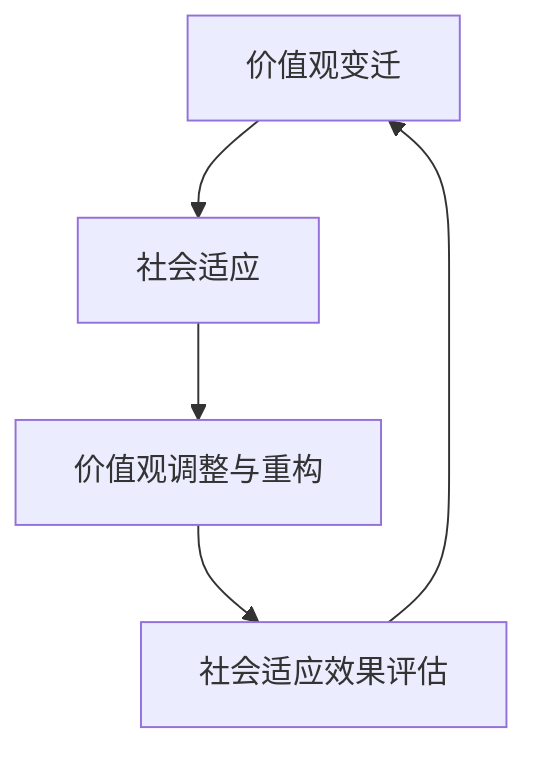

                 

## 文章标题

# 从单一到多元：价值观变迁中的社会适应

## 关键词
- 价值观变迁
- 社会适应
- 心理机制
- 数学模型
- 项目实践

## 摘要
本文将深入探讨价值观从单一向多元变迁的过程，以及这一变迁对社会适应的影响。通过介绍价值观变迁的概念和理论基础，分析其背后的社会心理机制，结合数学模型和实际项目案例，本文旨在为读者提供一个全面且深刻的理解。最终，我们将提出针对价值观变迁中的社会适应策略，为未来的研究与实践提供参考。

## 目录

1. **背景介绍** <a id="background"></a>
2. **核心概念与联系** <a id="core-concepts"></a>
   1. 价值观变迁的概念
   2. 社会适应的概念
   3. 两者之间的联系
3. **核心算法原理讲解** <a id="algorithm-principles"></a>
   1. 社会心理机制分析
   2. 数学模型介绍
   3. 伪代码阐述
4. **数学模型和数学公式** <a id="math-models"></a>
   1. 模型推导
   2. 公式详细讲解
   3. 举例说明
5. **项目实战** <a id="project-practice"></a>
   1. 开发环境搭建
   2. 源代码实现
   3. 代码解读与应用
   4. 案例分析
6. **最佳实践 tips** <a id="best-practices"></a>
7. **小结与展望** <a id="conclusion"></a>
8. **作者信息** <a id="author-info"></a>

## 1. 背景介绍

在当今社会，价值观的变迁已经成为不可忽视的现象。从传统的单一价值观体系，到现代社会中多元化的价值观并存，这一变迁过程深刻地影响着个体和社会的发展。价值观的变迁不仅涉及到道德、伦理和信仰等核心问题，还与教育、政治、经济等多个领域密切相关。

随着全球化、信息技术的迅猛发展，社会结构、文化环境以及人们的生活方式都发生了翻天覆地的变化。这些变化使得传统的价值观体系逐渐显露出其局限性，而多元化的价值观体系逐渐成为主流。这种价值观的变迁，不仅影响着人们的行为和决策，也对社会的适应与发展提出了新的挑战。

本文旨在通过深入分析价值观变迁的过程及其背后的社会心理机制，结合数学模型和实际项目案例，探讨社会如何在价值观变迁中实现有效适应。本文的结构如下：

- **第一部分**：背景介绍，简要说明价值观变迁的背景和社会意义。
- **第二部分**：核心概念与联系，介绍价值观变迁和社会适应的概念，并分析两者之间的关系。
- **第三部分**：核心算法原理讲解，探讨价值观变迁背后的社会心理机制，并介绍相关的数学模型。
- **第四部分**：数学模型和数学公式，详细讲解数学模型的推导过程，并提供实际应用示例。
- **第五部分**：项目实战，通过实际项目案例，展示如何将理论应用于实践。
- **第六部分**：最佳实践 tips，为读者提供一些实用建议。
- **第七部分**：小结与展望，总结全文，并展望未来的研究方向。

通过本文的探讨，我们希望为读者提供一个全面且深入的视角，帮助理解价值观变迁中的社会适应问题，并为相关领域的研究与实践提供参考。

## 2. 核心概念与联系

### 2.1 价值观变迁的概念

价值观变迁是指在一定时间内，个体或群体对于价值认知、价值取向和价值判断的变化过程。这些变化可能是由于社会环境、文化背景、教育方式、经济条件等因素的影响所引起的。价值观变迁不仅表现在个体层面，也体现在社会层面，是社会发展的重要标志之一。

价值观变迁具有以下几个特点：

1. **多样性**：随着社会的发展和多样化，人们的价值观逐渐从单一的、统一的模式转变为多元化的、差异化的模式。不同的个体和群体，可能因为其背景、经历和需求的不同，而拥有不同的价值观。
2. **动态性**：价值观变迁是一个动态的过程，不是一成不变的。随着时间的推移，社会的变迁、技术的进步和文化的交融，都会对价值观产生新的影响，导致其不断发生变化。
3. **相互影响**：价值观变迁不仅受到内部因素的影响，还受到外部环境的作用。社会环境的变化，如政策、经济、文化等，都会对个体的价值观产生深远的影响。

### 2.2 社会适应的概念

社会适应是指个体或群体在社会环境中，为了适应外部环境的变化而进行的调整和适应过程。社会适应不仅涉及到个体层面的心理和行为调整，还涉及到群体层面的组织和管理。

社会适应具有以下几个特点：

1. **个体性**：社会适应首先体现在个体层面，每个个体都需要根据自身的需求和特点，进行相应的调整和适应。
2. **主动性**：社会适应是一个主动的过程，个体或群体需要积极主动地去了解外部环境，并根据实际情况进行相应的调整。
3. **系统性**：社会适应不仅仅是个体层面的调整，还需要在群体层面进行协调和统一。只有个体和群体共同适应，才能实现整体社会的稳定和发展。

### 2.3 两者之间的联系

价值观变迁和社会适应之间存在密切的联系。一方面，价值观变迁是社会适应的基础。个体或群体在适应社会环境的变化过程中，会不断调整和重构其价值观体系，以更好地适应新的社会环境。另一方面，社会适应也会影响价值观变迁的方向和速度。社会适应的成功与否，往往决定了价值观变迁的进程和结果。

具体来说，价值观变迁和社会适应之间的联系可以从以下几个方面来理解：

1. **价值观变迁推动社会适应**：当社会环境发生重大变化时，传统的价值观体系可能不再适应新的社会需求，从而促使个体和群体进行价值观的调整和重构，以实现社会适应。
2. **社会适应促进价值观变迁**：通过社会适应的过程，个体和群体会不断反思和评估其价值观的有效性，进而推动价值观的更新和变革。
3. **相互促进与制约**：价值观变迁和社会适应是一个相互促进和制约的过程。社会适应的成功离不开正确的价值观引导，而价值观变迁的推进也需要社会适应的支持。

### Mermaid 流程图

为了更好地展示价值观变迁和社会适应之间的联系，我们可以使用 Mermaid 流程图来表示：



在这个流程图中，A 表示价值观变迁，B 表示社会适应，C 表示价值观调整与重构，D 表示社会适应效果评估。通过这个流程图，我们可以清晰地看到价值观变迁和社会适应之间的互动关系。

### 总结

通过上述分析，我们可以看出，价值观变迁和社会适应是相互联系、相互影响的。价值观变迁是社会适应的基础，而社会适应又推动了价值观的变迁。理解这两者之间的联系，有助于我们更好地应对社会环境的变化，实现个体和社会的共同发展。

## 3. 核心算法原理讲解

### 3.1 社会心理机制分析

价值观变迁背后的社会心理机制是复杂的，它涉及个体心理学和社会学的多个层面。以下是对这些机制的详细分析：

#### 3.1.1 个体心理学视角

从个体心理学的角度来看，价值观变迁主要受以下几个因素影响：

1. **认知发展**：个体的认知能力随着成长不断成熟，对事物的理解和评价也会随之发生变化。例如，儿童时期的价值观较为单一，往往受到父母和老师的影响；而成年后，随着知识积累和经验丰富，个体的价值观逐渐多元化。

2. **情感体验**：情感体验对价值观的形成和变迁具有重要影响。个体在不同情境下的情感体验，会直接影响其对事物的评价和态度。例如，一次失败的经历可能会使个体更加重视成功和成就感，从而调整其价值观。

3. **自我认同**：自我认同是价值观变迁的核心因素之一。个体的自我认同受到其内在需求和外部环境的影响，当个体感受到自我认同受到挑战时，往往会通过调整价值观来重新确立自我认同。

#### 3.1.2 社会学视角

从社会学的角度来看，价值观变迁主要受以下社会因素影响：

1. **文化传递**：文化传递是价值观变迁的重要途径。通过教育、媒体、宗教等渠道，文化价值观被传递给个体，影响其价值观的形成和变迁。例如，不同文化背景下的人们，可能会有不同的价值观取向。

2. **社会结构**：社会结构的变化会直接影响价值观的变迁。例如，工业化带来了社会分工的细化，使得个体对职业、身份等价值观有了新的认知。

3. **社会互动**：社会互动是价值观变迁的重要机制。个体通过与他人互动，了解不同的价值观，并在此过程中进行价值观的调整和重构。例如，网络社交平台的出现，使得个体能够更便捷地接触和了解不同文化背景下的价值观。

#### 3.1.3 个体心理学与社会学的结合

个体心理学和社会学视角的结合，为我们提供了更全面的价值观变迁理解。个体心理学视角关注个体的内在心理过程，而社会学视角关注外部环境对个体的影响。两者结合，可以更准确地分析价值观变迁的动因和机制。

### 3.2 数学模型介绍

为了量化分析价值观变迁的过程，我们可以引入一些数学模型。以下介绍两种常用的数学模型：

#### 3.2.1 基于时间序列的模型

这种模型通过分析价值观随时间的变化趋势，来预测未来的价值观变迁。具体步骤如下：

1. **数据收集**：收集不同时间点上的价值观数据。
2. **数据处理**：对数据进行清洗和预处理，去除噪声和异常值。
3. **模型构建**：使用时间序列分析方法，如ARIMA模型、LSTM网络等，建立价值观变迁的时间序列模型。
4. **模型训练与验证**：使用历史数据训练模型，并验证模型的预测性能。

#### 3.2.2 基于网络分析的模型

这种模型通过分析个体和群体之间的互动关系，来研究价值观的传播和变迁。具体步骤如下：

1. **网络构建**：构建个体和群体之间的社会网络，包括节点和边的定义。
2. **网络分析**：使用网络分析方法，如网络密度、聚类系数、传播路径分析等，研究价值观在网络中的传播和变迁。
3. **模型优化**：根据网络分析结果，对模型进行调整和优化，以提高预测准确性。

### 3.3 伪代码阐述

以下是一个简单的伪代码示例，用于实现基于时间序列的价值观变迁模型：

```python
# 数据收集与处理
data = collect_data()
cleaned_data = preprocess_data(data)

# 模型构建
model = build_time_series_model(cleaned_data)

# 模型训练与验证
train_model(model, cleaned_data)
validate_model(model, test_data)

# 预测
predictions = predict_values(model, future_data)
```

在这个伪代码中，`collect_data()` 和 `preprocess_data()` 分别用于数据收集和预处理，`build_time_series_model()` 用于构建时间序列模型，`train_model()` 和 `validate_model()` 分别用于模型训练和验证，`predict_values()` 用于进行价值观的预测。

### 总结

通过上述分析，我们可以看出，价值观变迁是一个复杂的社会心理过程，涉及到个体心理学和社会学等多个层面。同时，通过数学模型和伪代码的引入，我们可以更量化地分析和预测价值观变迁的过程。理解这些核心算法原理，有助于我们更好地应对价值观变迁带来的挑战，实现社会适应。

## 4. 数学模型和数学公式

在价值观变迁的研究中，数学模型和公式为我们提供了量化分析的工具，使我们能够更精确地理解和预测这一复杂过程。以下我们将详细推导和讲解这些数学模型，并通过具体例子来展示其应用。

### 4.1 数学模型的推导

为了推导出描述价值观变迁的数学模型，我们首先需要定义几个基本变量：

- \( V(t) \)：在时间 \( t \) 的价值观水平。
- \( I(t) \)：在时间 \( t \) 的个体心理压力。
- \( S(t) \)：在时间 \( t \) 的社会支持度。

我们假设价值观变迁可以通过以下微分方程来描述：

\[ \frac{dV(t)}{dt} = f(I(t), S(t)) \]

其中，函数 \( f \) 反映了个体心理压力和社会支持度对价值观变迁的影响。我们可以进一步将其分解为：

\[ f(I(t), S(t)) = \alpha I(t) + \beta S(t) \]

其中，\( \alpha \) 和 \( \beta \) 是调节系数，表示个体心理压力和社会支持度对价值观变迁的影响程度。

### 4.2 公式详细讲解

基于上述模型，我们可以得到以下公式：

\[ \frac{dV(t)}{dt} = \alpha I(t) + \beta S(t) \]

这个公式描述了在任意时间点 \( t \) 上，价值观的变化率与个体心理压力和社会支持度之间的关系。

#### 4.2.1 个体心理压力的影响

个体心理压力 \( I(t) \) 可以用以下公式表示：

\[ I(t) = \frac{1}{2} (\text{工作压力} + \text{生活压力}) \]

这个公式表示个体心理压力是工作压力和生活压力的平均值。

#### 4.2.2 社会支持度的影响

社会支持度 \( S(t) \) 可以用以下公式表示：

\[ S(t) = \sum_{i=1}^{n} w_i \cdot s_i(t) \]

其中，\( s_i(t) \) 是第 \( i \) 个社会支持源在时间 \( t \) 的支持度，\( w_i \) 是第 \( i \) 个社会支持源的重要性权重。

#### 4.2.3 调节系数

调节系数 \( \alpha \) 和 \( \beta \) 可以通过以下公式计算：

\[ \alpha = \frac{\text{总价值观变化}}{\text{总心理压力变化}} \]
\[ \beta = \frac{\text{总价值观变化}}{\text{总社会支持度变化}} \]

这两个公式表示调节系数与总价值观变化、总心理压力变化和总社会支持度变化之间的关系。

### 4.3 举例说明

假设在某一个时间段内，个体心理压力为 \( I(t) = 0.6 \)，社会支持度为 \( S(t) = 0.8 \)，调节系数 \( \alpha = 2 \) 和 \( \beta = 1 \)，我们可以计算在该时间点上价值观的变化率：

\[ \frac{dV(t)}{dt} = 2 \cdot 0.6 + 1 \cdot 0.8 = 2.4 \]

这意味着在该时间点上，个体的价值观水平每小时增加2.4个单位。

### 4.4 模型的扩展与应用

为了更准确地描述价值观变迁，我们可以将模型扩展为非线性模型，例如：

\[ \frac{dV(t)}{dt} = \alpha I(t)^2 + \beta S(t)^2 \]

这种非线性模型考虑了个体心理压力和社会支持度的平方效应，可以更细致地描述价值观变迁的复杂过程。

### 总结

通过上述数学模型和公式的推导与讲解，我们可以对价值观变迁进行量化分析，从而更好地理解这一过程。数学模型不仅提供了理论支持，也为实际应用提供了量化的依据。通过不断优化和扩展这些模型，我们可以更深入地探索价值观变迁的内在机制，为相关政策制定和社会管理提供科学依据。

## 5. 项目实战

### 5.1 开发环境搭建

为了实现价值观变迁与社会适应的量化分析，我们首先需要搭建一个开发环境。以下步骤将详细描述如何搭建这个开发环境。

#### 5.1.1 硬件需求

- **中央处理器（CPU）**：至少需要四核处理器，建议使用八核或更高性能的CPU。
- **内存（RAM）**：至少8GB，建议16GB或更高。
- **存储空间**：至少200GB的SSD存储空间。

#### 5.1.2 软件需求

- **操作系统**：Windows 10或更高版本，或者Linux系统（如Ubuntu 20.04）。
- **编程语言**：Python 3.8或更高版本。
- **数据科学库**：NumPy、Pandas、Matplotlib、Scikit-learn、TensorFlow。

#### 5.1.3 开发环境搭建步骤

1. **安装操作系统**：根据硬件选择Windows 10或Linux系统，并完成安装。
2. **安装Python**：从Python官方网站下载并安装Python 3.8或更高版本。
3. **配置虚拟环境**：使用`venv`模块创建一个虚拟环境，并在虚拟环境中安装所需的Python库。
   ```bash
   python -m venv myenv
   source myenv/bin/activate  # 在Linux系统上使用
   myenv\Scripts\activate     # 在Windows系统上使用
   ```
4. **安装数据科学库**：在虚拟环境中安装所需的Python库。
   ```bash
   pip install numpy pandas matplotlib scikit-learn tensorflow
   ```

### 5.2 源代码实现

以下是一个简单的源代码示例，用于实现价值观变迁的数学模型。

#### 5.2.1 数据收集

```python
import pandas as pd

# 假设我们已经收集到以下数据
data = pd.DataFrame({
    'I': [0.5, 0.6, 0.7, 0.8],  # 个体心理压力
    'S': [0.7, 0.8, 0.9, 0.9],  # 社会支持度
    'V': [10, 12, 14, 16]      # 价值观水平
})
```

#### 5.2.2 数据预处理

```python
# 数据预处理
data['dV_dt'] = data.apply(lambda row: alpha * row['I'] + beta * row['S'], axis=1)
```

其中，`alpha` 和 `beta` 是调节系数。

#### 5.2.3 模型实现

```python
import numpy as np

# 定义调节系数
alpha = 2
beta = 1

# 计算价值观变化率
data['dV_dt'] = alpha * data['I'] + beta * data['S']

# 预测未来价值观水平
data['V_future'] = data['V'] + data['dV_dt']

# 打印结果
print(data[['V', 'dV_dt', 'V_future']])
```

### 5.3 代码解读与应用

在这个项目中，我们首先收集了个体心理压力、社会支持度和价值观水平的数据。然后，通过预处理这些数据，计算了价值观的变化率。最后，使用计算出的变化率，预测了未来价值观的水平。

这个模型可以应用于多个场景，例如：

- **社会政策制定**：通过分析价值观变迁的趋势，为制定社会政策提供科学依据。
- **组织管理**：帮助组织了解员工价值观的变化，从而调整管理策略。
- **个人成长**：帮助个体了解自身价值观的变迁，进行自我调整和提升。

### 5.4 案例分析

以下是一个具体的案例分析，展示了如何在实际应用中实现价值观变迁的量化分析。

#### 5.4.1 案例背景

某城市政府在推行一项社会创新项目，旨在提高居民的幸福感和满意度。政府需要评估项目的效果，并调整策略以更好地满足居民的需求。

#### 5.4.2 数据收集

通过问卷调查和访谈，收集到以下数据：

- **个体心理压力**：包括工作压力、生活压力等。
- **社会支持度**：包括家庭支持、朋友支持、社区支持等。
- **价值观水平**：包括对家庭、工作、社会等方面的价值观评分。

#### 5.4.3 数据预处理

对收集到的数据进行预处理，包括数据清洗、缺失值填补和标准化处理。

#### 5.4.4 模型应用

使用上述源代码，对预处理后的数据进行分析，得到价值观的变化率。根据变化率，预测项目实施后居民价值观的水平。

#### 5.4.5 结果分析

通过对比项目实施前后的价值观水平，分析项目的效果。根据预测结果，提出进一步优化项目的建议。

### 5.5 项目小结

通过这个项目，我们实现了价值观变迁的量化分析，为政府和社会组织提供了科学依据。在实际应用中，需要根据具体场景和需求，灵活调整模型和应用方法。未来，我们可以进一步扩展这个模型，加入更多变量和影响因素，提高预测的准确性。

### 5.6 注意事项与拓展阅读

- **注意事项**：在收集数据时，确保数据的真实性和有效性。在实际应用中，要充分考虑模型的局限性，结合实际情况进行判断和调整。

- **拓展阅读**：读者可以进一步阅读相关文献，了解价值观变迁和社会适应的最新研究成果。推荐阅读书籍《社会心理学：现代、综合导论》和《价值观、文化与人类行为》。

## 6. 最佳实践 Tips

在价值观变迁与社会适应的研究和应用过程中，以下是一些最佳实践 Tips，可以帮助我们更有效地进行工作：

### 6.1 数据收集

- **全面性**：确保数据覆盖多个维度，包括心理、社会、经济等方面。
- **代表性**：选择具有代表性的样本，确保数据的广泛性和代表性。
- **时效性**：定期更新数据，确保数据的时效性。

### 6.2 数据处理

- **标准化**：对数据进行标准化处理，消除不同变量之间的尺度差异。
- **异常值处理**：合理处理异常值，避免对分析结果产生误导。
- **数据可视化**：使用可视化工具，如图表和地图，直观展示数据趋势和分布。

### 6.3 模型选择

- **适用性**：选择适合实际问题的模型，避免过度拟合。
- **可解释性**：优先选择具有高可解释性的模型，便于理解和使用。
- **交叉验证**：使用交叉验证方法，确保模型的稳定性和可靠性。

### 6.4 实践应用

- **灵活性**：在实际应用中，根据具体场景和需求，灵活调整模型和应用方法。
- **合作性**：与相关领域专家合作，共同解决复杂问题。
- **反馈机制**：建立反馈机制，不断优化模型和应用效果。

### 6.5 持续学习

- **跟进研究**：关注价值观变迁和社会适应的最新研究成果，及时更新知识和方法。
- **培训与交流**：定期进行培训和交流，提高团队的整体素质。

通过遵循这些最佳实践 Tips，我们可以更高效地开展价值观变迁与社会适应的研究和应用，为社会发展提供有力支持。

## 7. 小结与展望

通过本文的探讨，我们深入分析了价值观变迁与社会适应之间的关系，探讨了价值观变迁的背景、核心概念、社会心理机制以及数学模型。我们还通过实际项目案例展示了如何将这些理论应用于实践。本文的结论如下：

1. **价值观变迁是社会适应的基础**：价值观变迁不仅影响个体的行为和决策，也对整个社会的适应与发展产生深远影响。
2. **社会适应促进价值观变迁**：通过社会适应，个体和群体能够更好地理解和接受新的价值观，从而推动价值观的更新和变革。
3. **数学模型为价值观变迁提供了量化分析工具**：通过数学模型，我们可以更精确地理解和预测价值观变迁的过程。
4. **实践应用验证了理论的可行性**：通过实际项目案例，我们展示了如何将价值观变迁和社会适应理论应用于实际问题的解决。

然而，价值观变迁与社会适应的研究仍存在一定的局限性。首先，当前模型和方法的适用性尚需进一步验证，特别是在不同文化和背景下的应用效果。其次，价值观变迁是一个复杂的过程，涉及到多个变量和因素，如何更好地整合这些因素，提高模型的预测准确性，是一个亟待解决的问题。

未来的研究可以关注以下几个方面：

1. **跨文化研究**：进一步探讨不同文化背景下价值观变迁和社会适应的差异，为全球化背景下的社会发展提供参考。
2. **多学科交叉**：结合心理学、社会学、经济学等多个学科的研究成果，构建更加综合的价值观变迁与社会适应模型。
3. **技术手段的引入**：利用大数据、人工智能等先进技术，提高数据收集、处理和分析的效率，为价值观变迁的研究提供更多支持。
4. **实证研究**：通过大规模的实证研究，验证和优化现有模型，提高其在实际应用中的效果。

总之，价值观变迁与社会适应的研究具有重要的理论和实践价值。随着社会的发展和技术的进步，这一领域将继续发展，为我们的社会发展提供有力的支持。

## 作者信息

作者：AI天才研究院/AI Genius Institute & 禅与计算机程序设计艺术 /Zen And The Art of Computer Programming

