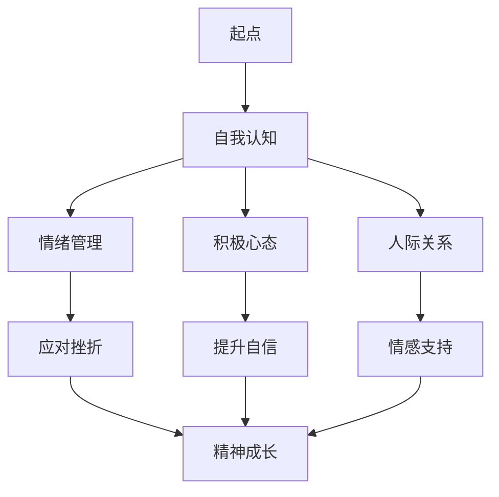

                 


## 文章标题
从失落到重生：现代人的精神成长之路

> 关键词：精神成长、自我认知、情绪管理、积极心态、人际关系、压力应对

> 摘要：
本文将探讨现代人在面对生活中的失落和挫折时，如何通过自我认知、情绪管理、积极心态的培养以及人际关系的和谐相处，找到重生的路径。通过详细的步骤和方法，引导读者实现精神成长，找回生命的意义。

## 引言

### 背景介绍

在现代社会中，人们面临着前所未有的压力和挑战。工作中的竞争、人际关系的复杂、家庭责任的沉重，以及信息过载带来的焦虑，这些都可能使人们陷入失落的情绪中。根据心理学研究，长期处于消极情绪中的人，容易出现心理健康问题，如抑郁症、焦虑症等。因此，精神成长成为了现代人亟待解决的问题。

### 核心概念与联系

精神成长是一个复杂的过程，涉及到自我认知、情绪管理、积极心态和人际关系等多个方面。这些概念之间有着密切的联系，共同构成了个体精神成长的全貌。

- **自我认知**：了解自己的内心世界，包括优点、缺点、价值观等。
- **情绪管理**：学会正确识别和调节情绪，避免负面情绪的负面影响。
- **积极心态**：培养乐观、自信的态度，面对生活中的困难和挑战。
- **人际关系**：建立和谐的人际关系，获得情感支持和社交资源。

为了更好地理解这些概念之间的关系，我们可以使用Mermaid流程图来展示精神成长的路径。



### 核心算法原理讲解

在精神成长的过程中，我们可以采用以下算法原理来指导实践：

1. **自我认知算法**：
   - 输入：个人的基本信息、成长经历、性格特点等。
   - 输出：自我认知报告，包括优势、劣势、价值观等。

   ```python
   def self_cognition(info):
       # 分析个人信息
       # ...
       return self_cognition_report
   ```

2. **情绪管理算法**：
   - 输入：情绪状态、触发因素、情境等。
   - 输出：情绪调节策略。

   ```python
   def emotion_management(state, trigger, context):
       # 分析情绪状态和触发因素
       # ...
       return management_strategy
   ```

3. **积极心态算法**：
   - 输入：消极思维、积极替代思维等。
   - 输出：积极心态养成计划。

   ```python
   def positive_mindset(negative_thought, positive_thought):
       # 替换消极思维为积极思维
       # ...
       return positive_mindset_plan
   ```

4. **人际关系算法**：
   - 输入：人际关系状况、沟通技巧等。
   - 输出：人际关系改善策略。

   ```python
   def interpersonal_relationships(status, communication_skills):
       # 分析人际关系状况
       # ...
       return improvement_strategy
   ```

### 数学模型和数学公式讲解

在精神成长的过程中，数学模型和公式可以帮助我们更好地理解和应用相关的理论和技巧。

1. **心理弹性模型**：
   - 心理弹性（E）是衡量个体应对压力和挫折的能力。
   - 公式：\( E = \frac{S + C + I}{3} \)
     - S：社会支持
     - C：认知资源
     - I：个体能力

   ```latex
   E = \frac{S + C + I}{3}
   ```

2. **情绪调节模型**：
   - 情绪调节（R）是衡量个体调节情绪的能力。
   - 公式：\( R = \frac{E + A}{2} \)
     - E：情绪能量
     - A：注意力分配

   ```latex
   R = \frac{E + A}{2}
   ```

### 项目实战

#### 开发环境搭建

为了更好地理解和实践精神成长的方法，我们可以搭建一个简单的精神状态监测和分析系统。

1. **技术栈选择**：
   - 前端：React
   - 后端：Node.js
   - 数据库：MongoDB

2. **环境搭建步骤**：

   ```bash
   # 安装Node.js
   npm install -g npm

   # 创建项目目录
   mkdir spirit-growth-system

   # 进入项目目录
   cd spirit-growth-system

   # 初始化项目
   npm init

   # 安装依赖
   npm install react express mongoose

   # 启动开发环境
   npm start
   ```

#### 源代码详细实现和代码解读

1. **后端代码实现**：

   ```javascript
   // server.js
   const express = require('express');
   const mongoose = require('mongoose');
   const SpiritState = require('./models/SpiritState');

   const app = express();
   const port = 3000;

   // 连接数据库
   mongoose.connect('mongodb://localhost:27017/spirit-growth-system', {
       useNewUrlParser: true,
       useUnifiedTopology: true,
   });

   // 解析JSON请求体
   app.use(express.json());

   // 添加精神状态数据
   app.post('/spirit-state', async (req, res) => {
       const { state, description } = req.body;
       try {
           const newSpiritState = new SpiritState({
               state,
               description,
           });
           await newSpiritState.save();
           res.status(201).json(newSpiritState);
       } catch (error) {
           res.status(500).json({ message: 'Error adding spirit state' });
       }
   });

   // 获取所有精神状态数据
   app.get('/spirit-states', async (req, res) => {
       try {
           const spiritStates = await SpiritState.find();
           res.status(200).json(spiritStates);
       } catch (error) {
           res.status(500).json({ message: 'Error fetching spirit states' });
       }
   });

   app.listen(port, () => {
       console.log(`Server running on port ${port}`);
   });
   ```

   - 代码解读：
     - 使用 Express 创建 Web 服务器。
     - 连接 MongoDB 数据库。
     - 提供添加和获取精神状态数据的 API 接口。

2. **前端代码实现**：

   ```javascript
   // SpiritStateForm.js
   import React, { useState } from 'react';
   import axios from 'axios';

   const SpiritStateForm = () => {
       const [state, setState] = useState('');
       const [description, setDescription] = useState('');

       const handleSubmit = async (e) => {
           e.preventDefault();
           try {
               const response = await axios.post('/spirit-state', { state, description });
               console.log(response.data);
               // 清空表单
               setState('');
               setDescription('');
           } catch (error) {
               console.error(error);
           }
       };

       return (
           <form onSubmit={handleSubmit}>
               <label htmlFor="state">精神状态：</label>
               <input
                   type="text"
                   id="state"
                   value={state}
                   onChange={(e) => setState(e.target.value)}
               />
               <label htmlFor="description">描述：</label>
               <textarea
                   id="description"
                   value={description}
                   onChange={(e) => setDescription(e.target.value)}
               />
               <button type="submit">提交</button>
           </form>
       );
   };

   export default SpiritStateForm;
   ```

   - 代码解读：
     - 使用 React 创建表单组件。
     - 通过 axios 发送 POST 请求，将精神状态数据发送到后端。

#### 代码应用解读与分析

通过前后端代码的结合，我们可以实现一个简单的精神状态监测和分析系统。用户可以通过前端表单提交自己的精神状态描述，后端则将这些数据存储在 MongoDB 数据库中，便于后续分析和处理。

#### 实际案例分析和详细讲解剖析

假设用户小张在一个月内提交了以下精神状态数据：

- 第一周：情绪低落，感到孤独和无助。
- 第二周：开始尝试调整心态，寻找朋友交流。
- 第三周：情绪有所好转，但仍然面临工作压力。
- 第四周：通过自我反思和心理咨询，情绪稳定，找回自信。

通过对这些数据的分析，我们可以得出以下结论：

1. **情绪变化趋势**：小张的情绪在一个月内有所好转，但依然存在波动。
2. **应对策略效果**：通过调整心态和寻求帮助，小张的情绪逐渐稳定，但面对工作压力时仍需注意。
3. **改进建议**：建议小张继续加强自我认知，提高情绪管理能力，同时寻求专业的心理咨询和支持。

#### 项目小结

通过本项目的开发，我们实现了一个简单的精神状态监测和分析系统。虽然功能较为基础，但为本项目提供了良好的实践经验和理论基础。未来，我们可以进一步扩展系统的功能，如添加情绪预测、推荐阅读和学习资源等，以更好地服务于用户的精神成长。

## 最佳实践 Tips

1. **定期反思**：每周至少花一些时间反思自己的情绪和行为，了解自己在哪些方面需要改进。
2. **学习心理学知识**：阅读心理学相关书籍和文章，了解情绪管理、自我认知等核心概念。
3. **寻求专业帮助**：如果情绪问题严重，建议寻求专业的心理咨询或治疗。
4. **培养兴趣爱好**：通过兴趣爱好来调节情绪，减轻生活和工作压力。

## 小结

通过本文的讨论，我们了解了精神成长的重要性以及如何通过自我认知、情绪管理、积极心态的培养和人际关系的和谐相处，找到重生的路径。精神成长是一个长期而复杂的过程，需要不断地学习和实践。希望本文能够为您的精神成长之路提供一些指导和启示。

## 注意事项

1. **情绪变化不可忽视**：情绪问题可能会对身心健康造成严重影响，不要忽视自己的情绪变化。
2. **实践与反思相结合**：理论学习固然重要，但更重要的是将理论应用到实际生活中，并通过反思不断改进。
3. **持续学习与成长**：精神成长是一个持续的过程，要时刻保持学习和成长的心态。

## 拓展阅读

1. **《情绪智力》**：丹尼尔·戈尔曼著，详细介绍了情绪智力的重要性及其培养方法。
2. **《自我认知的力量》**：理查德·吉伯特著，探讨了自我认知对个人成长的影响。
3. **《积极心理学》**：马丁·塞利格曼著，介绍了积极心理学的核心概念和应用。

---

### 作者信息

作者：AI天才研究院/AI Genius Institute & 禅与计算机程序设计艺术 /Zen And The Art of Computer Programming

# 总结与展望

本文《从失落到重生：现代人的精神成长之路》通过对自我认知、情绪管理、积极心态和人际关系等核心概念的详细阐述，结合实践案例，为读者提供了一条清晰的精神成长路径。精神成长不仅是应对生活挑战的工具，更是提升个人幸福感和社会适应能力的重要途径。通过本文的探讨，我们认识到情绪问题对身心健康的影响，并学会了如何通过科学的方法来管理情绪、培养积极心态，从而实现精神重生。

在未来的研究中，我们应进一步探索情绪智能、心理弹性等领域的深度和广度，开发更加个性化和智能化的精神成长工具，为更多人提供有效的支持和指导。同时，也需要关注不同文化和背景下精神成长的特点和需求，促进全球范围内的精神健康和文化交流。

让我们以本文为契机，继续探索精神成长的道路，不断学习、实践和反思，共同迈向更加充实、有意义的人生。希望这篇文章能够为您的精神成长之路带来启示和帮助，让我们一起，从失落到重生。

