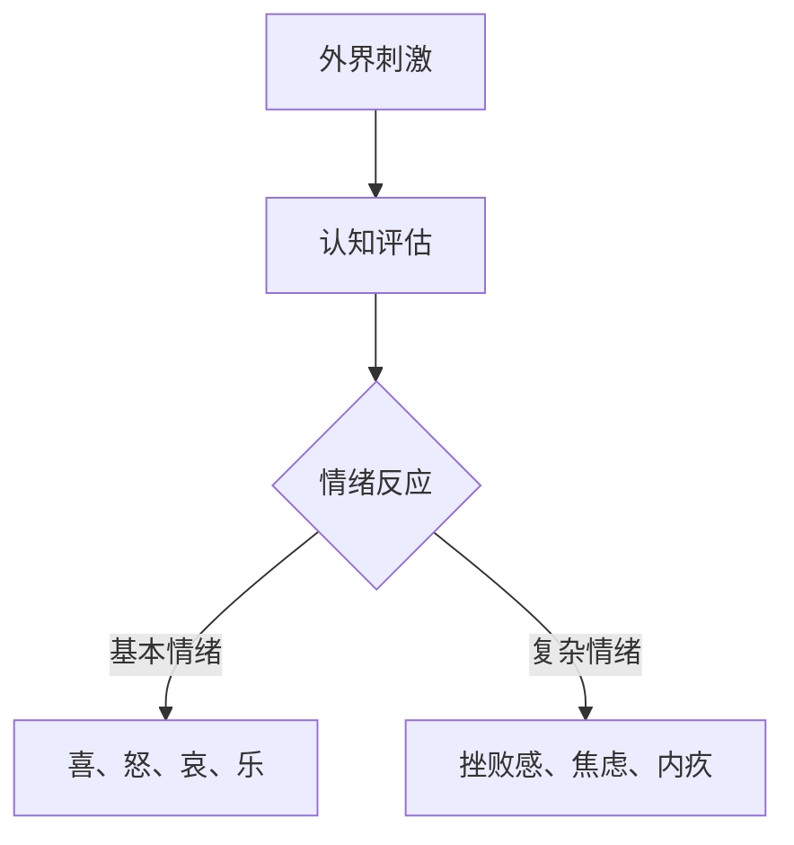

                 

### 从失落到重生：现代人的精神成长历程

#### 关键词：精神成长、自我认知、积极心理学、情绪调节、人际交往

#### 摘要：
在快速变化的社会中，现代人常常面临压力、挫折和孤独感，这些负面情绪会阻碍我们的精神成长。本文将探讨如何从失落到重生，通过自我认知、积极心理学、情绪调节和人际交往的实践，实现现代人的精神成长。我们将逐步分析每一个步骤，提供实用的方法，帮助读者在精神层面上实现自我提升和重生。

---

## 引言

在现代社会中，人们面临着前所未有的压力和挑战。工作压力、人际关系、家庭责任等都可能导致我们感到失落和无助。长期处于负面情绪中，不仅影响我们的心理健康，还会对生活质量和人际关系产生负面影响。因此，如何从失落到重生，实现精神成长，成为一个重要且迫切的话题。

本文将分为以下几个部分：

1. **自我认知**：了解自己的情绪和行为模式，是精神成长的第一步。
2. **积极心理学**：通过研究人类的优点和美德，提升自我认知和幸福感。
3. **情绪调节**：学会调节负面情绪，保持心理健康。
4. **人际交往**：建立积极的人际关系，获得支持和帮助。

在接下来的章节中，我们将逐步深入探讨这些主题，提供实用的方法和建议。

### 第1章：自我认知

#### 1.1 情绪的真相

情绪是人们内心体验的重要组成部分，但很多时候，我们并不了解情绪的真相。情绪的产生源于我们的认知评估，即外界刺激和个体认知的相互作用。理解情绪的真相，有助于我们更好地管理自己的情绪。

**核心概念与联系**

- **情绪认知理论**：心理学家阿诺德提出，情绪的产生是人对情境的评估过程。
- **反应倾向理论**：心理学家施洛伯格提出，情绪反应是人天生具有的倾向，而非仅仅是对情境的反应。

**Mermaid 流程图**

#### 1.2 内心的冲突与和解

内心的冲突是精神成长中的常见现象。理解内心的冲突，并学会和解，是精神成长的重要一步。

**核心算法原理讲解**

心理和解的核心算法包括：

- **情绪调节策略**：通过认知重构、积极情绪培养和情绪释放等策略来调节负面情绪。
- **自我对话**：通过自我对话来识别、理解并改善内心的冲突。

**数学模型**

情绪调节的数学模型可以表示为：

$$
\text{调节效果} = f(\text{认知重构}, \text{积极情绪}, \text{情绪释放})
$$

其中，$f$ 为调节效果函数，依赖于认知重构、积极情绪和情绪释放的相互作用。

**详细讲解与举例**

例如，一位工作压力较大的员工，通过认知重构（重新评估工作压力的负面影响），积极情绪培养（寻找工作乐趣），以及情绪释放（进行放松训练），最终实现了情绪的和解。

### 第2章：积极心理学

#### 2.1 积极心理学的作用

积极心理学研究人类的优点、美德和积极情感，旨在帮助人们实现精神成长和幸福。

**核心概念与联系**

- **幸福心理学**：研究幸福的定义、来源和影响因素。
- **心灵美德**：积极心理学的一个重要领域，研究个体的美德，如善良、感恩和勇气。

**数学模型**

积极心理学的数学模型可以表示为：

$$
\text{幸福感} = f(\text{优点}, \text{美德}, \text{积极情感})
$$

其中，$f$ 为幸福感函数，依赖于优点、美德和积极情感的相互作用。

**详细讲解与举例**

例如，一个个体通过培养自己的优点（如勤奋、正直），实践心灵美德（如善良、感恩），以及体验积极情感（如喜悦、满足），最终实现了幸福感的提升。

#### 2.2 自我认知的旅程

自我认知是精神成长的关键步骤。它要求我们认识到自己的优点和缺点，并学会接受自己。

**核心概念与联系**

- **自我接纳**：由心理学家罗杰斯提出，是指个体能够接受自己的全部，包括优点和缺点。
- **自尊**：与自我接纳密切相关，是指个体对自己的尊重和认可。

**数学模型**

自我接纳的数学模型可以表示为：

$$
\text{自我接纳} = \text{自我肯定} - \text{自我否定}
$$

其中，自我肯定和自我否定分别代表个体对自己的积极和消极评价。

**详细讲解与举例**

例如，一位总是对自己要求过高的人，通过认识到自己的优点（如工作努力）和缺点（如过于焦虑），并学会接受自己的不完美，最终实现了自我接纳。

### 第3章：情绪调节

#### 3.1 情绪调节的技巧

情绪调节是保持心理健康的重要技能。通过情绪调节，我们可以更好地应对压力和挑战。

**核心算法原理讲解**

情绪调节的核心算法包括：

- **认知重构**：通过改变对事件的认知评价来调节情绪。
- **积极情绪培养**：通过培养积极情感来提升情绪状态。
- **情绪释放**：通过情绪释放技巧来减轻负面情绪。

**数学模型**

情绪调节的数学模型可以表示为：

$$
\text{情绪状态} = f(\text{认知重构}, \text{积极情绪}, \text{情绪释放})
$$

其中，$f$ 为情绪状态函数，依赖于认知重构、积极情绪和情绪释放的相互作用。

**详细讲解与举例**

例如，一位感到焦虑的个体，通过认知重构（重新评估焦虑事件的负面影响），积极情绪培养（寻找生活中的乐趣），以及情绪释放（进行深呼吸练习），最终实现了情绪的调节。

### 第4章：人际交往

#### 4.1 人际关系的建立

建立积极的人际关系是精神成长的重要一环。通过良好的人际交往，我们可以获得支持和帮助，同时提升自己的幸福感。

**核心概念与联系**

- **社交心理学**：研究人际关系和社交行为的科学。
- **沟通技巧**：有效沟通是建立良好人际关系的关键。

**数学模型**

人际关系的数学模型可以表示为：

$$
\text{人际关系质量} = f(\text{沟通技巧}, \text{共同兴趣}, \text{信任})
$$

其中，$f$ 为人际关系质量函数，依赖于沟通技巧、共同兴趣和信任的相互作用。

**详细讲解与举例**

例如，一位个体通过提升沟通技巧（如倾听和表达），寻找共同兴趣（如运动或读书），以及建立信任（如诚实和尊重），最终建立了良好的人际关系。

### 第5章：重生的成果

#### 5.1 心灵的成长

通过自我认知、积极心理学、情绪调节和人际交往的实践，我们可以实现心灵成长，获得内心的平静和情感的深度。

**核心概念与联系**

- **心灵成长**：指个体在精神层面的提升，包括情绪管理、自我认知和人际关系。
- **情感深度**：指个体在情感上的成熟和丰富。

**数学模型**

心灵成长的数学模型可以表示为：

$$
\text{心灵成长} = f(\text{自我认知}, \text{积极心理学}, \text{情绪调节}, \text{人际交往})
$$

其中，$f$ 为心灵成长函数，依赖于自我认知、积极心理学、情绪调节和人际交往的相互作用。

**详细讲解与举例**

例如，一位个体通过自我认知（了解自己的优点和缺点），积极心理学（培养乐观态度），情绪调节（学会放松和应对压力），以及人际交往（建立良好的人际关系），实现了心灵成长。

### 第6章：生活质量的提升

#### 6.1 工作与生活的平衡

通过实现工作与生活的平衡，我们可以提升生活质量，获得更多的幸福感和满足感。

**核心概念与联系**

- **工作与生活的平衡**：指在工作和生活之间找到平衡点，确保两者都能得到充分关注。
- **时间管理**：有效管理时间，确保工作和生活都能得到合理安排。

**数学模型**

工作与生活平衡的数学模型可以表示为：

$$
\text{生活质量} = f(\text{工作成效}, \text{生活品质})
$$

其中，$f$ 为生活质量函数，依赖于工作成效和生活品质的相互作用。

**详细讲解与举例**

例如，一位个体通过提高工作效率（如优化工作流程，减少无效任务），提升生活品质（如培养兴趣爱好，定期进行身体锻炼），最终实现了工作与生活的平衡。

### 第7章：社会的贡献

#### 7.1 传递正能量

通过实现个人的精神成长，我们可以传递正能量，影响他人的精神成长，为社会做出贡献。

**核心概念与联系**

- **正能量**：指积极、乐观和向上的态度和能量。
- **社会贡献**：通过个人的行为和影响，为社会带来积极的变化。

**数学模型**

社会贡献的数学模型可以表示为：

$$
\text{社会贡献} = f(\text{个人精神成长}, \text{他人精神成长})
$$

其中，$f$ 为社会贡献函数，依赖于个人精神成长和他人精神成长的相互作用。

**详细讲解与举例**

例如，一位个体通过实现自己的精神成长，成为他人的榜样和启发，最终实现了对社会的贡献。

### 总结

通过本文的探讨，我们可以看到，从失落到重生，实现精神成长是一个系统的过程，需要自我认知、积极心理学、情绪调节和人际交往的实践。每一个步骤都至关重要，它们相互关联，共同推动我们的精神成长。希望本文能为您在精神成长的道路上提供一些指导和启示。

### 附录

#### 附录A：心灵成长资源推荐

**A.1 心灵成长书籍推荐**

- 《生命的智慧》：探讨生命意义和心灵成长。
- 《心理学与生活》：全面介绍心理学的基础知识。

**A.2 心灵成长音频推荐**

- 《樊登读书会》：提供各种心灵成长和自我提升的书籍解读。
- 《喜马拉雅》：提供丰富的心理学音频课程。

**A.3 心灵成长应用推荐**

- “小鹅通”：提供在线心灵成长课程。
- “得到”：提供各种心灵成长的文章和书籍。

### 参考文献

- 罗杰斯，C. R. (1959). 《心理治疗：一种以患者为中心的方法》。
- 阿诺德，M. B. (1960). 《情绪认知理论》。
- 米尔斯，R. (1983). 《情绪的复杂性》。
- 塞利格曼，M. E. P. (1998). 《乐观的力量》。

---

# 作者信息

**作者：AI天才研究院/AI Genius Institute & 禅与计算机程序设计艺术 /Zen And The Art of Computer Programming**

