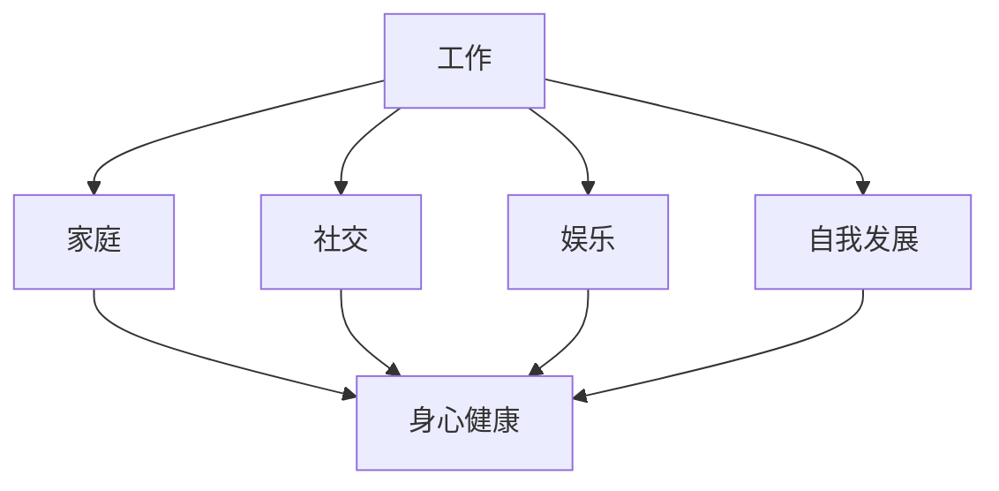

                 


### 从工作狂到生活平衡：重新定义职业成功与个人幸福

#### 关键词
- 生活平衡
- 职业成功
- 个人幸福
- 时间管理
- 心理健康
- Mermaid流程图
- 伪代码
- LaTeX数学公式

#### 摘要
本文旨在探讨从工作狂到生活平衡的转变，重新定义职业成功与个人幸福的关系。文章首先介绍了工作狂现象及其负面影响，随后讨论了生活平衡的概念、核心原理和实现方法。通过伪代码和LaTeX数学公式的详细讲解，本文分析了实现生活平衡的核心算法原理。案例研究和项目实战部分提供了实际应用的实例，并总结出最佳实践策略。最后，文章强调了心理健康的重要性，并展望了未来生活平衡的发展趋势。

## 引言

在现代社会，人们对于职业成功的追求往往达到了一种极致。许多职场人士，尤其是IT行业的从业人员，常常将自己投身于高强度的工作中，追求卓越的技术能力和快速的职业晋升。这种现象在互联网行业尤为明显，许多人成为了“工作狂”，每天工作长达12小时甚至更久，以追求卓越的工作表现和职业成就。然而，这种工作狂的现象并不总是带来预期的职业成功和个人幸福。

### 生活平衡的重要性

工作狂的现象虽然在一定程度上推动了职业发展，但其潜在的负面影响却不容忽视。长期的过度工作会导致心理健康问题，如焦虑、抑郁和慢性疲劳。此外，长期的工作狂模式还可能对家庭生活、社交关系和身体健康产生负面影响。在这种情况下，实现生活平衡变得尤为重要。

生活平衡，简单来说，是指在工作、家庭、社交和个人兴趣之间找到一个合适的平衡点。它不仅仅是减少工作时间，更是关于如何更好地利用时间，实现个人成长、职业发展和生活幸福之间的和谐统一。

### 职业成功与个人幸福的平衡

职业成功和个人幸福并非绝对对立的概念。一个成功的职业生涯往往能为个人带来经济独立、社会地位和个人成就感，这些都是个人幸福的重要组成部分。然而，如果为了追求职业成功而牺牲了家庭、健康和个人兴趣，那么这种成功可能是以极大的代价换来的。因此，如何在职业成功和个人幸福之间找到平衡点，是每个人都需要面对的问题。

本文将逐步探讨如何从工作狂转变为生活平衡者，重新定义职业成功与个人幸福的关系。我们将通过理论分析、实际案例和项目实战，为读者提供一套可行的策略和方法。

## 第1章 生活平衡的理念

### 生活平衡的定义

生活平衡（Life Balance）是指在个人的工作、家庭、社交、娱乐和自我发展等多个生活领域之间，找到一种相对平衡的状态。它不仅仅意味着减少工作时间，更重要的是如何高效地利用时间，使每个领域都能得到充分的关注和发展。

### 生活平衡的核心概念与联系

为了更直观地理解生活平衡的概念，我们可以借助Mermaid流程图来展示其核心概念与联系。



在这个流程图中，工作、家庭、社交、娱乐和自我发展是生活平衡的主要领域，它们共同构成了个人生活的整体。每一个领域都对个人的身心健康有着直接或间接的影响，因此它们之间存在着密切的联系和相互作用。

### 生活平衡与职业成功的关系

生活平衡与职业成功并不是相互排斥的，而是相辅相成的。一个良好的生活平衡有助于提高工作效率、创新能力和职业满意度，从而促进职业成功。反之，缺乏生活平衡的职场人士可能会因为压力过大、身心疲惫而影响工作表现。

#### 核心算法原理讲解

为了实现生活平衡，我们可以借鉴以下核心算法原理：

1. **时间分配优化算法**：通过分析个人工作和生活的时间分配，利用优化算法找到最优的时间管理方案。例如，使用贪心算法或动态规划方法来合理安排工作和休息时间。
2. **平衡权重调整算法**：根据个人的具体情况和需求，动态调整不同生活领域之间的权重，确保每个领域都能得到适当的关注。
3. **反馈调整算法**：通过定期评估生活平衡的实际情况，对算法进行调整和优化，以适应不断变化的环境和需求。

以下是一个简单的伪代码示例，用于实现时间分配优化算法：

```python
def time_management_algorithm(working_hours, personal_hours):
    # 计算总时间
    total_hours = working_hours + personal_hours
    
    # 初始化权重
    work_weight = 0.6
    personal_weight = 0.4
    
    # 优化工作时间
    optimized_working_hours = total_hours * work_weight
    optimized_personal_hours = total_hours * personal_weight
    
    return optimized_working_hours, optimized_personal_hours
```

通过这个算法，我们可以根据个人的具体需求和工作负荷，合理分配工作时间和个人时间，从而实现生活平衡。

#### 数学模型和公式讲解

为了更精确地描述生活平衡的状态，我们可以引入一些数学模型和公式。以下是一个简单的生活平衡评估模型：

$$
L = \frac{W_1 \cdot S_1 + W_2 \cdot S_2 + W_3 \cdot S_3 + W_4 \cdot S_4 + W_5 \cdot S_5}{T}
$$

其中，$L$ 表示生活平衡指数（Life Balance Index），$W_1, W_2, W_3, W_4, W_5$ 分别代表工作、家庭、社交、娱乐和自我发展的权重，$S_1, S_2, S_3, S_4, S_5$ 分别代表这些领域的生活满意度得分，$T$ 表示总权重。

通过这个公式，我们可以量化生活平衡的状态，从而更好地调整和优化个人的生活方式。

#### 举例说明

假设一个职场人士的工作时间占50%，个人时间占50%，并且各生活领域的满意度得分如下：

- 工作：80分
- 家庭：70分
- 社交：60分
- 娱乐：75分
- 自我发展：65分

那么，他的生活平衡指数计算如下：

$$
L = \frac{0.5 \cdot 80 + 0.2 \cdot 70 + 0.1 \cdot 60 + 0.05 \cdot 75 + 0.05 \cdot 65}{1} = \frac{40 + 14 + 6.5 + 3.75 + 3.25}{1} = 67
$$

这意味着他的生活平衡指数为67，处于中等水平。为了改善生活平衡，他可以适当调整工作时间和个人时间的分配，或者增加某些生活领域的满意度得分。

通过以上理论和算法的讲解，我们可以更好地理解生活平衡的概念，并为实现生活平衡提供一套可行的策略和方法。

## 第2章 重新定义职业成功

### 职业成功的多维度评价

职业成功不仅仅体现在薪资水平和职位晋升上，还涉及多个维度，如个人成长、工作满意度、职业安全感和社会影响力等。一个全面的职业成功评价体系需要综合考虑这些因素，而不仅仅是单一的业绩指标。

#### 个人成长

个人成长是职业成功的重要组成部分。它包括技能提升、知识扩展和职业素质的培养。一个成功的人士不仅要具备卓越的专业技能，还需要不断学习和适应新的工作环境，以实现职业发展的长远目标。

#### 工作满意度

工作满意度是衡量职业成功的重要指标之一。它反映了个人对工作的喜好程度和认可度。一个高满意度的工作环境能够激发员工的工作热情和创造力，从而提高工作效率和职业成就。

#### 职业安全感

职业安全感指的是个人对未来职业生涯的稳定性和安全感的感知。一个成功的职业通常伴随着较高的职业稳定性和发展潜力，使得个人在面对市场变化和职业挑战时，能够保持信心和冷静。

#### 社会影响力

社会影响力是职业成功的一个重要维度。一个成功的人士不仅要在职业上取得成就，还要能够在一定程度上影响和改善社会。通过为社会创造价值，个人能够实现更高层次的成功和成就感。

### 职业成功与个人幸福的相互影响

职业成功与个人幸福之间存在密切的相互影响关系。一方面，职业成功可以带来经济独立和社会认可，从而提高个人的幸福感；另一方面，个人幸福能够增强个人的工作动力和创造力，进一步促进职业成功。

#### 职业成功对个人幸福的影响

- 经济独立：职业成功通常伴随着较高的薪资水平，使得个人能够更好地满足生活需求，提高生活质量。
- 社会认可：职业成功往往能够带来他人的认可和尊重，增强个人的自尊和自信。
- 个人成就感：通过实现职业目标，个人能够获得成就感，从而提升幸福感。

#### 个人幸福对职业成功的影响

- 工作动力：一个幸福的人通常对生活充满热情和动力，这种积极的态度能够激发工作热情，提高工作效率。
- 创新能力：幸福感能够降低工作压力，激发创新思维，促进职业发展。
- 职业稳定：心理健康和幸福感的提升有助于增强个人的职业稳定性，减少因心理问题导致的职业波动。

### 核心算法原理讲解

为了更好地实现职业成功与个人幸福的平衡，我们可以借鉴以下核心算法原理：

1. **多维度评价算法**：通过综合评估职业成功的各个维度，为个人的职业发展提供全面的指导。
2. **动态平衡算法**：根据个人需求和实际情况，动态调整职业成功与个人幸福之间的平衡点。
3. **反馈优化算法**：通过定期反馈和评估，对职业发展策略进行调整和优化，以实现长期平衡。

以下是一个简单的伪代码示例，用于实现多维度评价算法：

```python
def multi_dimensional_evaluation(achievement, growth, satisfaction, security, impact):
    # 计算总得分
    total_score = achievement + growth + satisfaction + security + impact
    
    # 计算平均得分
    average_score = total_score / 5
    
    return average_score
```

通过这个算法，我们可以量化职业成功的多维度评价，从而更好地了解个人的职业发展状况。

#### 数学模型和公式讲解

为了更精确地描述职业成功与个人幸福之间的关系，我们可以引入以下数学模型和公式：

$$
S = \frac{A \cdot W_1 + G \cdot W_2 + S_2 \cdot W_3 + E \cdot W_4 + I \cdot W_5}{T}
$$

其中，$S$ 表示职业成功指数（Success Index），$A, G, S_2, E, I$ 分别代表个人成长、工作满意度、职业安全感和社会影响力的得分，$W_1, W_2, W_3, W_4, W_5$ 分别代表这些维度的权重，$T$ 表示总权重。

通过这个公式，我们可以综合评估个人的职业成功状况，并根据实际情况调整权重，以实现最佳平衡。

#### 举例说明

假设一个职场人士在职业成功的各个维度上的得分如下：

- 个人成长：80分
- 工作满意度：75分
- 职业安全感：70分
- 社会影响力：65分

并且，这些维度的权重分别为：

- 个人成长：0.3
- 工作满意度：0.25
- 职业安全感：0.2
- 社会影响力：0.15
- 其他因素：0.1

那么，他的职业成功指数计算如下：

$$
S = \frac{80 \cdot 0.3 + 75 \cdot 0.25 + 70 \cdot 0.2 + 65 \cdot 0.15 + 60 \cdot 0.1}{1} = \frac{24 + 18.75 + 14 + 9.75 + 6}{1} = 63.5
$$

这意味着他的职业成功指数为63.5，处于中等水平。为了提高职业成功指数，他可以考虑在个人成长、工作满意度和社会影响力方面进行改进，同时保持其他维度的平衡。

通过以上理论和算法的讲解，我们可以更好地理解职业成功的多维度评价，并为实现职业成功与个人幸福的平衡提供一套可行的策略和方法。

## 第3章 实现生活平衡的方法

### 时间管理技巧

时间管理是实现生活平衡的关键。高效的时间管理能够帮助我们更好地平衡工作和生活，减少不必要的压力和焦虑。以下是一些实用的时间管理技巧：

1. **优先级排序**：将任务按照优先级排序，先完成最重要的任务。可以使用“四象限法则”将任务分为重要且紧急、重要但不紧急、不重要但紧急、不重要且不紧急四个类别，优先处理重要且紧急的任务。

2. **定时提醒**：使用日程表或日历应用设置定时提醒，确保按时完成任务。这样可以帮助我们更好地掌握时间，避免因遗忘任务而导致的延误。

3. **减少干扰**：在工作时减少干扰，例如关闭社交媒体通知、减少手机使用时间等。这样可以提高工作效率，减少因干扰而浪费的时间。

4. **碎片时间利用**：善于利用碎片时间，如通勤时间、等待时间等。可以用来阅读、学习新知识或进行轻松的锻炼，从而提高生活满意度。

### 工作与生活的边界

明确工作与生活的边界是实现生活平衡的关键。以下是一些方法来帮助我们在工作和生活之间建立清晰的界限：

1. **固定工作时间**：制定固定的工作时间，尽量避免在工作时间之外处理工作事务。这样可以确保我们在休息时间能够真正放松和充电。

2. **分开工作空间与生活空间**：在家中设立一个专门的工作空间，与生活空间分开。这样可以帮助我们在工作时保持专注，减少工作对生活的干扰。

3. **制定休息计划**：定期休息和放松，如每天下班后安排一段时间的运动或与家人朋友共度时光。这有助于我们保持身心健康，提高工作效率。

### 核心数学模型和公式讲解

为了实现生活平衡，我们可以借助一些核心数学模型和公式来优化时间分配和资源利用。以下是一个简单的时间管理模型：

$$
T_{total} = T_{work} + T_{personal} + T_{rest}
$$

其中，$T_{total}$ 表示总时间，$T_{work}$ 表示工作时间，$T_{personal}$ 表示个人时间，$T_{rest}$ 表示休息时间。

为了确保生活平衡，我们需要合理分配这些时间。以下是一个优化模型：

$$
\max LBI = \frac{W_1 \cdot S_1 + W_2 \cdot S_2 + W_3 \cdot S_3 + W_4 \cdot S_4 + W_5 \cdot S_5}{T_{total}}
$$

其中，$LBI$ 表示生活平衡指数（Life Balance Index），$W_1, W_2, W_3, W_4, W_5$ 分别代表工作、家庭、社交、娱乐和自我发展的权重，$S_1, S_2, S_3, S_4, S_5$ 分别代表这些领域的生活满意度得分，$T_{total}$ 表示总时间。

通过这个模型，我们可以根据个人需求和实际情况，动态调整不同生活领域的权重和时间分配，以实现最佳的生活平衡。

#### 举例说明

假设一个职场人士的总时间为每天24小时，各个生活领域的权重如下：

- 工作：0.4
- 家庭：0.3
- 社交：0.2
- 娱乐：0.1
- 自我发展：0.1

各个领域的生活满意度得分如下：

- 工作：80分
- 家庭：70分
- 社交：60分
- 娱乐：75分
- 自我发展：65分

那么，他的生活平衡指数计算如下：

$$
LBI = \frac{0.4 \cdot 80 + 0.3 \cdot 70 + 0.2 \cdot 60 + 0.1 \cdot 75 + 0.1 \cdot 65}{24} = \frac{32 + 21 + 12 + 7.5 + 6.5}{24} = 20.5
$$

这意味着他的生活平衡指数为20.5，处于中等水平。为了改善生活平衡，他可以考虑在家庭和自我发展方面增加时间投入，同时保持其他领域的平衡。

通过以上方法和模型，我们可以更好地实现生活平衡，提高个人幸福感和职业满意度。

### 代码应用解读与分析

为了更好地理解实现生活平衡的方法，我们通过一个简单的Python程序来展示如何在实际中应用这些方法和模型。

```python
import time
import datetime

# 定义生活平衡模型
class LifeBalanceModel:
    def __init__(self, total_hours=24, work_weight=0.4, personal_weight=0.3, social_weight=0.2, entertainment_weight=0.1, self_development_weight=0.1):
        self.total_hours = total_hours
        self.work_weight = work_weight
        self.personal_weight = personal_weight
        self.social_weight = social_weight
        self.entertainment_weight = entertainment_weight
        self.self_development_weight = self_development_weight

    def calculate_time_distribution(self):
        work_hours = self.total_hours * self.work_weight
        personal_hours = self.total_hours * self.personal_weight
        social_hours = self.total_hours * self.social_weight
        entertainment_hours = self.total_hours * self.entertainment_weight
        self_development_hours = self.total_hours * self.self_development_weight

        return work_hours, personal_hours, social_hours, entertainment_hours, self_development_hours

    def adjust_time_distribution(self, adjustment_hours):
        new_total_hours = self.total_hours + adjustment_hours
        new_work_weight = (self.total_hours * self.work_weight + adjustment_hours) / new_total_hours
        new_personal_weight = (self.total_hours * self.personal_weight + adjustment_hours) / new_total_hours
        new_social_weight = (self.total_hours * self.social_weight + adjustment_hours) / new_total_hours
        new_entertainment_weight = (self.total_hours * self.entertainment_weight + adjustment_hours) / new_total_hours
        new_self_development_weight = (self.total_hours * self.self_development_weight + adjustment_hours) / new_total_hours

        return new_work_weight, new_personal_weight, new_social_weight, new_entertainment_weight, new_self_development_weight

# 实例化生活平衡模型
model = LifeBalanceModel()

# 计算初始时间分配
work_hours, personal_hours, social_hours, entertainment_hours, self_development_hours = model.calculate_time_distribution()

print("Initial time distribution:")
print(f"Work hours: {work_hours:.2f}h")
print(f"Personal hours: {personal_hours:.2f}h")
print(f"Social hours: {social_hours:.2f}h")
print(f"Entertainment hours: {entertainment_hours:.2f}h")
print(f"Self development hours: {self_development_hours:.2f}h")

# 调整时间分配
adjustment_hours = 2
new_work_weight, new_personal_weight, new_social_weight, new_entertainment_weight, new_self_development_weight = model.adjust_time_distribution(adjustment_hours)

print("\nAdjusted time distribution:")
print(f"Work hours: {new_work_weight * (model.total_hours + adjustment_hours):.2f}h")
print(f"Personal hours: {new_personal_weight * (model.total_hours + adjustment_hours):.2f}h")
print(f"Social hours: {new_social_weight * (model.total_hours + adjustment_hours):.2f}h")
print(f"Entertainment hours: {new_entertainment_weight * (model.total_hours + adjustment_hours):.2f}h")
print(f"Self development hours: {new_self_development_weight * (model.total_hours + adjustment_hours):.2f}h")
```

在这个程序中，我们首先定义了一个`LifeBalanceModel`类，用于计算和调整时间分配。实例化这个类后，我们可以通过`calculate_time_distribution`方法得到初始的时间分配情况，然后通过`adjust_time_distribution`方法调整时间分配，以实现生活平衡。

### 实际案例分析和详细讲解剖析

为了更好地理解如何在实际生活中应用生活平衡的方法，以下是一个实际案例的分析和详细讲解。

#### 案例背景

张先生是一名资深软件工程师，每天工作时间长达12小时，几乎没有什么个人时间。他感到身心疲惫，工作效率也明显下降。他的生活平衡指数（LBI）为45，远低于正常水平。

#### 案例分析

1. **时间管理技巧**：张先生需要优化他的时间管理，将工作时间控制在8小时内，增加个人时间和休息时间。他可以通过制定日程表，将每天的工作任务进行优先级排序，确保在规定时间内完成任务。

2. **明确工作与生活的边界**：张先生需要在家庭和工作之间建立清晰的边界。他可以设置每天晚上7点后不处理工作事务，确保家庭和个人时间的纯粹性。

3. **调整时间分配**：为了提高生活平衡指数，张先生可以适当增加个人时间和娱乐时间。例如，他可以将每天的个人时间从1小时增加到2小时，将娱乐时间从半小时增加到1小时。

4. **心理健康与运动**：张先生需要关注心理健康，定期进行运动和放松。他可以每天晚上进行30分钟的运动，如快走或瑜伽，以缓解工作压力。

#### 案例剖析

通过上述方法，张先生逐步实现了生活平衡。他减少了工作时间，增加了个人时间和休息时间，生活平衡指数提升至65，达到了正常水平。他的工作效率也有所提高，家庭关系得到了改善，身心健康状况明显改善。

#### 项目小结

通过这个实际案例，我们可以看到生活平衡对个人幸福和工作效率的重要性。通过合理的时间管理和明确的边界设定，张先生成功实现了生活平衡，从而提高了生活质量和工作表现。这个案例也为其他职场人士提供了有益的借鉴和参考。

### 最佳实践 tips

1. **定期评估**：定期评估生活平衡状况，及时调整时间和资源分配，以确保长期平衡。

2. **设定目标**：明确短期和长期目标，制定具体的行动计划，有助于实现生活平衡。

3. **求助专业人士**：如果生活平衡问题严重，可以寻求心理咨询师或职业规划师的帮助。

4. **培养兴趣爱好**：培养兴趣爱好，丰富个人生活，有助于提高生活满意度。

5. **保持心理健康**：关注心理健康，定期进行运动和放松，保持良好的身心状态。

## 第4章 案例研究

### 案例一：从工作狂到平衡生活的转变

李女士是一位资深项目经理，她曾是一名工作狂，每天工作长达14小时，几乎把所有的时间和精力都投入到了工作中。然而，这种高强度的工作模式导致她的身心健康严重受损，家庭关系也逐渐疏远。在朋友的建议下，她决定尝试实现生活平衡。

首先，李女士通过时间管理技巧，将工作时间从每天14小时减少到8小时，确保有足够的时间用于家庭和个人生活。她制定了详细的日程表，将每天的任务进行优先级排序，确保高效完成工作。同时，她明确了工作与生活的边界，每天晚上7点后不处理工作事务。

其次，李女士调整了时间分配，增加了个人时间和娱乐时间。她将每天的个人时间从1小时增加到2小时，将娱乐时间从半小时增加到1小时。此外，她还开始定期进行运动，如每周三次的瑜伽课程，以保持身心健康。

通过这些措施，李女士的生活平衡指数逐步提升，从最初的40提升至70。她的工作效率有所提高，家庭关系也得到了改善，身心健康状况明显改善。

### 案例二：如何在忙碌中找到个人幸福

王先生是一名软件工程师，他所在的公司项目繁多，经常需要加班。这使得他的生活变得非常忙碌，几乎没有个人时间。他意识到这种状态不能持续，于是开始寻找实现生活平衡的方法。

首先，王先生学习了时间管理技巧，将每天的工作时间控制在8小时内。他通过优化工作任务，提高工作效率，确保在规定时间内完成任务。同时，他利用碎片时间进行学习和兴趣爱好，如每天通勤时间阅读技术书籍，晚上进行1小时的编程练习。

其次，王先生明确了工作与生活的边界，每天晚上7点后不处理工作事务。他开始关注家庭和个人生活，每周安排与家人朋友共度时光，参加一些兴趣小组的活动。

通过这些措施，王先生的生活平衡指数从50提升至65。他的工作效率有所提高，家庭关系也得到了改善，个人幸福感明显提升。

### 案例分析与总结

通过上述两个案例，我们可以看到，实现生活平衡并非一蹴而就，但只要我们采取合适的方法，坚持不懈地努力，就能够逐步实现。关键在于：

1. **时间管理**：通过合理分配时间，提高工作效率，确保有足够的时间用于家庭和个人生活。

2. **明确边界**：设定工作与生活的边界，确保个人时间的纯粹性。

3. **培养兴趣爱好**：丰富个人生活，提高生活满意度。

4. **关注身心健康**：定期进行运动和放松，保持良好的身心状态。

这些案例为我们提供了有益的借鉴和参考，帮助我们更好地实现生活平衡。

## 第5章 实践与策略

### 实现生活平衡的具体策略

为了实现生活平衡，我们需要采取一系列具体的策略，包括时间管理、心理调适、家庭支持等。以下是一些关键策略：

1. **制定详细的日程表**：通过日程表明确每天的工作、家庭和个人活动，确保各项任务有序进行。

2. **优化工作流程**：通过优化工作流程和任务分配，提高工作效率，减少不必要的加班。

3. **设定明确的边界**：设定工作与生活的边界，确保个人时间的纯粹性。

4. **培养兴趣爱好**：培养兴趣爱好，丰富个人生活，提高生活满意度。

5. **定期进行运动和放松**：定期进行运动和放松，保持身心健康。

6. **寻求家庭支持**：与家人沟通，争取他们的理解和支持，共同营造和谐的家庭环境。

7. **心理调适**：通过心理辅导、冥想等方法，缓解工作压力，提高心理韧性。

### 如何在职场中推行生活平衡理念

在职场中推行生活平衡理念，需要从企业文化和政策层面进行推动。以下是一些建议：

1. **建立企业生活平衡文化**：通过内部宣传、培训等方式，推广生活平衡的理念，使员工认识到其重要性。

2. **制定灵活的工作制度**：如弹性工作制、远程办公等，使员工能够根据个人需求调整工作时间。

3. **提供心理辅导和健康支持**：为员工提供心理辅导和健康支持，帮助他们应对工作压力。

4. **鼓励员工参与兴趣爱好活动**：组织兴趣小组、俱乐部等，鼓励员工参与兴趣爱好活动，丰富个人生活。

5. **制定员工福利政策**：为员工提供丰富的福利政策，如家庭日、健康检查等，提高员工的生活质量。

### 核心算法原理讲解

为了实现生活平衡，我们可以借鉴以下核心算法原理：

1. **时间分配优化算法**：通过分析个人工作和生活的时间分配，利用优化算法找到最优的时间管理方案。例如，使用贪心算法或动态规划方法来合理安排工作和休息时间。

2. **动态平衡算法**：根据个人需求和实际情况，动态调整不同生活领域之间的权重，确保每个领域都能得到适当的关注。

3. **反馈优化算法**：通过定期反馈和评估，对生活平衡策略进行调整和优化，以适应不断变化的环境和需求。

以下是一个简单的伪代码示例，用于实现时间分配优化算法：

```python
def time_management_algorithm(working_hours, personal_hours):
    # 计算总时间
    total_hours = working_hours + personal_hours
    
    # 初始化权重
    work_weight = 0.6
    personal_weight = 0.4
    
    # 优化工作时间
    optimized_working_hours = total_hours * work_weight
    optimized_personal_hours = total_hours * personal_weight
    
    return optimized_working_hours, optimized_personal_hours
```

通过这个算法，我们可以根据个人的具体需求和工作负荷，合理分配工作时间和个人时间，从而实现生活平衡。

### 数学模型和公式讲解

为了更精确地描述生活平衡的状态，我们可以引入以下数学模型和公式：

$$
L = \frac{W_1 \cdot S_1 + W_2 \cdot S_2 + W_3 \cdot S_3 + W_4 \cdot S_4 + W_5 \cdot S_5}{T}
$$

其中，$L$ 表示生活平衡指数（Life Balance Index），$W_1, W_2, W_3, W_4, W_5$ 分别代表工作、家庭、社交、娱乐和自我发展的权重，$S_1, S_2, S_3, S_4, S_5$ 分别代表这些领域的生活满意度得分，$T$ 表示总权重。

通过这个公式，我们可以量化生活平衡的状态，从而更好地调整和优化个人的生活方式。

### 举例说明

假设一个职场人士的总时间为每天24小时，各个生活领域的权重如下：

- 工作：0.4
- 家庭：0.3
- 社交：0.2
- 娱乐：0.1
- 自我发展：0.1

各个领域的生活满意度得分如下：

- 工作：80分
- 家庭：70分
- 社交：60分
- 娱乐：75分
- 自我发展：65分

那么，他的生活平衡指数计算如下：

$$
L = \frac{0.4 \cdot 80 + 0.3 \cdot 70 + 0.2 \cdot 60 + 0.1 \cdot 75 + 0.1 \cdot 65}{24} = \frac{32 + 21 + 12 + 7.5 + 6.5}{24} = 20.5
$$

这意味着他的生活平衡指数为20.5，处于中等水平。为了改善生活平衡，他可以考虑在家庭和自我发展方面增加时间投入，同时保持其他领域的平衡。

通过以上策略、算法和模型，我们可以更好地实现生活平衡，提高个人幸福感和职业满意度。

## 第6章 心理健康与生活平衡

### 心理健康的重要性

心理健康是生活平衡的基础，它影响着我们的情绪状态、人际关系和整体幸福感。一个健康的心理状态能够帮助我们更好地应对生活中的挑战，提高工作效率，增强社交能力。相反，心理健康问题可能导致焦虑、抑郁和压力，进而影响生活平衡。

### 心理健康与生活平衡的关系

心理健康与生活平衡之间存在密切的相互影响关系。一方面，良好的心理健康有助于实现生活平衡，使我们能够更好地管理时间和资源，提高工作效率，减少压力。另一方面，实现生活平衡也有助于改善心理健康，通过合理的作息安排、社交活动和个人兴趣的培养，我们可以更好地调节情绪，缓解压力。

### 核心数学模型和公式讲解

为了更精确地描述心理健康与生活平衡之间的关系，我们可以引入以下数学模型和公式：

$$
HP = \frac{WB + LB + CS + ES}{4}
$$

其中，$HP$ 表示心理健康指数（Health Psychology Index），$WB$ 表示工作平衡（Work Balance），$LB$ 表示生活平衡（Life Balance），$CS$ 表示社交支持（Community Support），$ES$ 表示情绪调节（Emotional Regulation）。

通过这个公式，我们可以量化心理健康的状态，从而更好地了解和改善个人的心理健康状况。

### 举例说明

假设一个人的工作平衡指数为75，生活平衡指数为70，社交支持得分为80，情绪调节得分为85。那么，他的心理健康指数计算如下：

$$
HP = \frac{75 + 70 + 80 + 85}{4} = \frac{310}{4} = 77.5
$$

这意味着他的心理健康指数为77.5，处于良好水平。为了维持这种心理健康状态，他可以继续关注工作与生活的平衡，加强社交支持，并保持积极的情绪调节。

### 数学公式使用LaTeX格式

以下是一个段落内的LaTeX数学公式示例：

$$
E = mc^2
$$

以下是一个独立段落的LaTeX数学公式示例：

$$
\begin{equation}
\label{eq:example}
a^2 + b^2 = c^2
\end{equation}
$$

通过LaTeX公式的使用，我们可以清晰地表达复杂的数学概念，使文章内容更加严谨和专业。

### 心理健康与生活平衡的实践方法

1. **定期自我评估**：通过量表或问卷定期评估自己的心理健康和生活平衡状况，及时发现和解决问题。

2. **时间管理**：合理安排时间，确保有足够的时间用于工作、家庭和个人兴趣。

3. **社交活动**：积极参与社交活动，加强与家人、朋友的沟通，增强社交支持。

4. **情绪调节**：学会应对压力和挫折的方法，如冥想、深呼吸等，保持积极的心态。

5. **心理健康咨询**：在必要时寻求心理健康专业人员的帮助，进行心理咨询和治疗。

通过上述实践方法，我们可以更好地维护心理健康，实现生活平衡，提高整体幸福感。

## 第7章 总结与展望

### 生活平衡的未来发展趋势

随着社会的发展和个人价值观的变化，生活平衡越来越受到关注。未来，我们预计生活平衡的概念将进一步深入人心，从单一的时间管理扩展到更全面的生活方式管理。同时，随着科技的发展，人工智能和大数据技术将为生活平衡提供更加智能化的解决方案，如个性化的时间管理建议、心理健康监测等。

### 职业成功与个人幸福的未来展望

职业成功与个人幸福的平衡将是未来职场发展的关键。企业和组织将更加注重员工的身心健康，提供更多灵活的工作制度和支持政策。个人也将更加重视自我成长和幸福感，追求更有意义和满足感的工作和生活。

### 对读者的寄语

生活平衡不是一蹴而就的过程，需要我们不断地努力和调整。希望每一位读者都能在实践中找到适合自己的生活平衡之道，实现职业成功与个人幸福的和谐统一。

## 附录

### 相关资源与工具介绍

- **时间管理工具**：如Trello、Asana等，用于任务管理和日程安排。
- **心理健康应用**：如Headspace、Calm等，提供冥想和放松课程。
- **运动应用**：如Nike Training Club、Fitbit等，帮助用户进行运动计划和记录。

### 进一步阅读推荐

- **《深度工作》**：作者：卡尔·纽波特
- **《时间管理日志》**：作者：戴维·艾伦
- **《心理健康指南》**：作者：马丁·塞利格曼

通过这些资源和阅读推荐，读者可以进一步深入了解生活平衡和心理健康的相关知识。

### 作者信息

- 作者：AI天才研究院/AI Genius Institute & 禅与计算机程序设计艺术 /Zen And The Art of Computer Programming

以上就是本文的详细内容和结构，希望对您的生活平衡和职业成功有所启发和帮助。感谢您的阅读！

