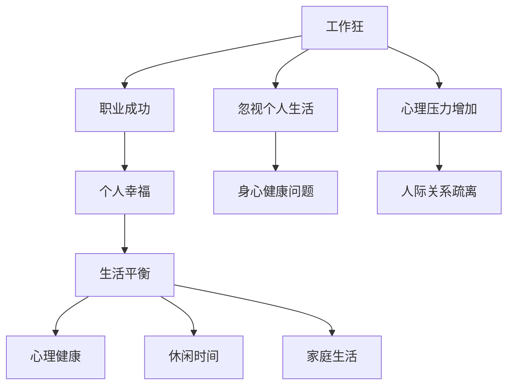
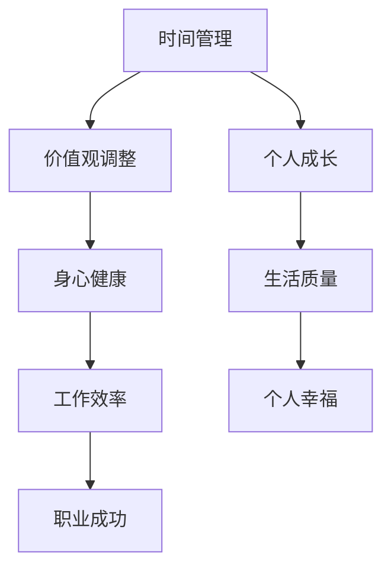

                 

## 文章标题

《从工作狂到生活平衡：重新定义职业成功和个人幸福》

在当今快节奏的职场环境中，许多人为了追求职业成功而成为了“工作狂”，却忽视了个人生活的质量和幸福。然而，这种过度投入工作的生活方式虽然短期内可能带来显著的职业成就，但长期来看却可能导致身心健康问题、人际关系的疏远以及生活满意度的下降。因此，重新定义职业成功和个人幸福，找到工作与生活之间的平衡点，成为了越来越多人的追求。

本文将围绕这一主题，通过逻辑清晰、结构紧凑、简单易懂的技术语言，探讨如何从工作狂转变为生活平衡者，实现职业成功和个人幸福的双赢。我们将从以下几个方面展开讨论：

1. **生活平衡的概念与价值**：介绍生活平衡的定义及其在职业成功和个人幸福中的重要性。
2. **生活平衡的策略与实践**：提供具体的方法和策略，帮助读者评估个人工作模式并建立工作与生活的边界。
3. **提升个人幸福**：讨论心理健康与压力管理的重要性，并提供实践策略。
4. **工作与生活的整合**：探讨灵活工作安排及其在实现生活平衡中的作用。
5. **持续追求生活平衡**：分析面对变化时如何调整生活平衡，并保持追求。
6. **生活平衡的成功故事**：分享实践者的经验和启示。

通过本文的探讨，我们希望读者能够认识到工作与生活平衡的必要性，并找到适合自己的平衡之道，从而实现职业成功与个人幸福的双重满足。

## 文章关键词

- 工作狂
- 生活平衡
- 职业成功
- 个人幸福
- 心理健康
- 压力管理
- 灵活工作安排

## 文章摘要

本文旨在探讨如何从工作狂转变为生活平衡者，重新定义职业成功和个人幸福。首先，我们介绍了生活平衡的概念与价值，强调了其与职业成功和个人幸福之间的紧密联系。接着，我们提供了评估个人工作模式和设定优先级与目标的具体策略，帮助读者建立工作与生活的边界。此外，文章还讨论了心理健康与压力管理的重要性，并提供实践策略以提升个人幸福。随后，我们探讨了灵活工作安排在工作与生活平衡中的作用，并分享了调整与适应的方法。最后，通过成功故事，我们总结了实践经验，为读者提供了启示。本文旨在帮助读者实现职业成功与个人幸福的双重满足，追求更健康、更平衡的生活方式。

## 概念联系

### 核心概念

#### 工作狂

首先，我们需要明确“工作狂”这一核心概念。工作狂通常指的是那些极度投入工作，将大部分时间、精力和情感都倾注于职业领域的人。他们往往对自己的工作有着极高的要求和追求，愿意牺牲个人时间、健康和家庭生活以追求职业上的成功。工作狂的表现形式多种多样，包括长时间工作、忽视休息、拒绝休假等。在短期内，这种工作态度可能带来显著的职业成就，如晋升、高薪和同事的认可。然而，长期而言，这种过度的工作投入可能导致身心健康问题、心理压力增加、人际关系疏离等负面后果。

#### 生活平衡

“生活平衡”则是另一个关键概念。生活平衡指的是在工作与个人生活之间找到一个平衡点，确保既能实现职业上的成功，又能享受个人生活的幸福和满足。这种平衡不仅仅是指时间上的分配，更是一种心理上的调适和生活态度。一个生活平衡的人能够在工作之余，拥有充足的时间进行休闲、与家人和朋友相处、追求兴趣爱好，以及进行自我反思和成长。

#### 职业成功

职业成功通常包括一系列的成就指标，如晋升、高薪、项目成功、行业认可等。职业成功不仅仅是个人的自我实现，也是社会对个人能力和贡献的认可。然而，职业成功并不意味着个人的幸福和满足，因为幸福不仅仅来自于职业成就，还涉及到个人生活、家庭、心理健康和社会关系等多个方面。

#### 个人幸福

个人幸福则是指个体在生活各个方面所感受到的满足、快乐和成就感。这种幸福感不仅来自于职业上的成功，还包括健康、家庭、友情、爱好等多个层面。个人幸福是一个综合性的概念，它反映了个体在精神、情感、身体健康和社会关系等方面的整体状态。

### 核心概念与联系

这些核心概念之间存在着紧密的联系和相互作用。工作狂可能短期内带来职业成功，但缺乏生活平衡会导致长期个人幸福的缺失。而生活平衡则有助于个人幸福的提升，进而促进职业成功的持续发展。职业成功和个人幸福是相辅相成的，一个健康的职业发展应该同时关注这两个方面。

为了更好地理解这些概念之间的关系，我们可以使用 Mermaid 图进行可视化：

通过这个图，我们可以清晰地看到工作狂、职业成功、个人幸福和生活平衡之间的动态关系。工作狂和职业成功可能会带来短期的成就，但缺乏生活平衡则可能导致个人幸福的缺失和身心健康问题。相反，通过建立生活平衡，可以提升个人幸福，促进身心健康，从而为职业成功提供坚实的基础。

总之，理解这些核心概念及其相互关系对于实现工作与生活的平衡至关重要。在接下来的部分中，我们将深入探讨如何评估个人工作模式，设定优先级和目标，以及提升个人幸福的具体策略。

### 架构设计

为了确保文章内容逻辑清晰、结构紧凑，我们将按照以下目录架构展开讨论：

#### 第一部分：探索生活平衡的概念与价值

1. **第1章：生活平衡的定义与重要性**
   - **1.1 生活平衡的概念**
   - **1.2 生活平衡的价值**
   - **1.3 生活平衡与职业成功的关联**

在这一部分，我们首先定义“生活平衡”这一核心概念，并详细阐述其价值。通过介绍生活平衡对职业成功和个人幸福的重要性，帮助读者理解为何追求生活平衡是至关重要的。

2. **第2章：评估个人工作模式**
   - **2.1 识别工作狂倾向**
   - **2.2 个人工作模式评估**

在这一章中，我们将引导读者进行自我评估，识别是否存在过度投入工作的倾向，并详细讨论如何评估个人工作模式。通过这一步骤，读者可以更加清晰地认识到自己在工作与生活平衡方面的现状。

3. **第3章：设定优先级与目标**
   - **3.1 设定职业目标**
   - **3.2 设定个人生活目标**

在这一章中，我们将探讨如何设定明确的职业和个人生活目标。通过设定清晰的目标，读者可以更好地规划自己的时间和精力，从而在职业和个人生活之间找到平衡。

#### 第二部分：建立工作与生活的边界

4. **第4章：设定优先级与目标**
   - **4.1 设定职业目标**
   - **4.2 设定个人生活目标**

在这一部分，我们将深入探讨如何通过设定优先级和目标来建立工作与生活的边界。通过明确工作与生活的界限，读者可以更好地分配时间和精力，实现工作与生活的平衡。

5. **第5章：灵活工作安排**
   - **5.1 灵活工作方式的优点**
   - **5.2 实践灵活工作策略**

在这一章中，我们将探讨灵活工作安排的优点，并分享具体的实践策略。灵活的工作方式可以帮助读者更好地平衡工作与生活，提高工作效率和生活质量。

6. **第6章：调整与适应**
   - **6.1 面对变化调整生活平衡**
   - **6.2 持续追求生活平衡**

在这一章中，我们将讨论如何面对生活中的变化，调整生活平衡。同时，我们将分享一些持续追求生活平衡的方法和策略，帮助读者在职业生涯的不同阶段保持平衡。

#### 第三部分：提升个人幸福

7. **第7章：心理健康与压力管理**
   - **7.1 心理健康的重要性**
   - **7.2 压力管理策略**

在这一部分，我们将探讨心理健康的重要性，并提供具体的压力管理策略。通过关注心理健康和压力管理，读者可以提升个人幸福感，更好地应对工作和生活中的挑战。

8. **第8章：培养兴趣爱好与社交**
   - **8.1 兴趣爱好对生活平衡的影响**
   - **8.2 社交对心理健康和幸福感的作用**

在这一章中，我们将探讨培养兴趣爱好和社交活动对提升个人幸福感的重要性。通过积极参与兴趣爱好和建立良好的社交关系，读者可以在日常生活中找到更多的快乐和满足。

#### 第四部分：工作与生活的整合

9. **第9章：工作与生活的整合**
   - **9.1 工作与生活的整合理念**
   - **9.2 实践整合策略**

在这一部分，我们将探讨工作与生活的整合理念，并提供具体的实践策略。通过整合工作与生活，读者可以更好地平衡两者的关系，实现更高层次的生活质量。

10. **第10章：构建支持系统**
    - **10.1 家庭支持的重要性**
    - **10.2 建立同事支持网络**

在这一章中，我们将讨论家庭支持和同事支持在工作与生活平衡中的重要性。通过构建支持系统，读者可以获得更多的支持和鼓励，更好地实现生活平衡。

#### 第五部分：生活平衡的成功故事

11. **第11章：生活平衡实践者分享**
    - **11.1 成功故事分享**
    - **11.2 经验与启示**

在这一部分，我们将通过分享成功实践者的故事，提供宝贵的经验和启示。这些故事将帮助读者理解如何在现实生活中实现工作与生活的平衡。

通过以上目录架构，文章将系统性地探讨如何从工作狂转变为生活平衡者，重新定义职业成功和个人幸福。每个章节都紧密相连，形成了一个完整的讨论框架，帮助读者逐步理解和实践工作与生活的平衡。

### 第一部分：探索生活平衡的概念与价值

#### 第1章：生活平衡的定义与重要性

##### 1.1 生活平衡的概念

生活平衡，即“work-life balance”，是指在工作与个人生活之间找到平衡点，确保两者都能得到充分的关注和满足。具体来说，它不仅仅是时间管理的问题，更是一种生活方式和态度。生活平衡要求个体在追求职业成就的同时，不忽视健康、家庭、休闲和个人成长等方面。

首先，生活平衡强调时间管理。这包括合理安排工作时间，确保工作和休息时间得到平衡。然而，仅仅通过时间管理来达到生活平衡是远远不够的。更重要的是，个体需要调整自己的心态，培养一种能够平衡工作与生活的思维方式。

其次，生活平衡涉及到个人价值观的调整。个体需要明确自己在工作和生活中最看重的是什么，并根据这些价值观来安排时间和资源。例如，有些人可能更看重职业成功，愿意为工作付出更多的时间和精力；而另一些人则可能更看重家庭和个人生活，更愿意在工作与个人生活之间寻找平衡。

最后，生活平衡也是一种持续的过程。它不是一成不变的，而是随着时间和环境的变化而进行调整。一个生活平衡的人能够灵活应对生活中的各种变化，不断调整自己的工作和生活方式，以保持整体平衡。

##### 1.2 生活平衡的价值

生活平衡对于职业成功和个人幸福的重要性不可低估。首先，从职业成功的角度来看，生活平衡有助于提高工作效率和质量。一个生活平衡的人能够保持良好的身心健康，拥有充足的精力和创造力，从而在工作中表现出色。相反，过度工作可能导致疲劳和效率下降，影响职业表现。

其次，生活平衡对于个人幸福有着重要的影响。一个生活平衡的人能够拥有更多的时间和精力去享受生活，与家人和朋友相处，追求自己的兴趣爱好。这种丰富的生活体验可以带来深刻的满足感和幸福感，提升个人的生活质量和心理健康。

此外，生活平衡还能够促进身心健康。过度的工作压力和缺乏休息会导致身心疲惫，增加患病风险。而生活平衡有助于个体保持良好的身心状态，减少压力和焦虑，提高生活质量。

##### 1.3 生活平衡与职业成功的关联

生活平衡与职业成功之间的关系是双向的。一方面，良好的生活平衡有助于职业成功。通过保持身心健康和良好的心态，个体能够更专注和高效地工作，从而取得职业上的成就。另一方面，职业成功也可以为生活平衡提供支持和资源。一个职业成功的人通常有更多的选择权和灵活性，可以更好地安排自己的时间和生活。

然而，值得注意的是，职业成功并不总是能够自动带来生活平衡。有些人可能因为职业上的成就而忽视个人生活，导致生活失衡。因此，实现生活平衡需要个体在职业成功的同时，注重个人生活的质量和幸福感。

为了更好地理解生活平衡的概念和价值，我们可以通过以下示意图来展示其核心要素和相互关系：

通过这个图，我们可以清晰地看到时间管理、价值观调整、身心健康、工作效率、职业成功、个人成长、生活质量和个人幸福之间的关系。生活平衡正是通过这些要素的相互作用，实现整体上的平衡和提升。

总之，生活平衡不仅是一种追求，更是一种生活方式和价值观。它对于职业成功和个人幸福都至关重要。在接下来的章节中，我们将进一步探讨如何评估个人工作模式，设定优先级和目标，以及如何通过具体的策略和实践来实现生活平衡。

### 第2章：评估个人工作模式

#### 2.1 识别工作狂倾向

在追求工作与生活平衡的过程中，识别自己是否存在工作狂倾向是至关重要的一步。工作狂倾向通常表现为对工作的极度投入，甚至牺牲个人生活的时间和质量。以下是一些识别工作狂倾向的常见迹象：

1. **长时间工作**：你是否经常加班，超过正常的工作时间？工作时间是否占据了你的大部分生活？

2. **忽视休息和假期**：你是否经常推迟休假，甚至忘记了休息的重要性？是否对工作感到无法放手，即使是在休息日或假期里也想着工作？

3. **低效的休息方式**：在休息时间，你是否仍然在进行与工作相关的活动，如查看邮件或处理工作事务？这种低效的休息方式实际上是在延续工作压力，而不是真正放松。

4. **忽视家庭和个人生活**：你是否觉得无法花足够的时间与家人和朋友相处？是否忽视了自己的兴趣爱好和健康？

5. **心理压力**：你是否经常感到焦虑、疲惫或压力过大？工作狂倾向可能导致心理压力增加，影响身心健康。

6. **缺乏自我反思**：你是否很少花时间去思考自己的生活方式，是否感觉一直在追求但缺乏满足感？

通过识别这些迹象，你可以初步判断自己是否存在工作狂倾向。识别工作狂倾向不仅有助于你理解自己的行为模式，也为后续的评估和调整奠定了基础。

#### 2.2 个人工作模式评估

对个人工作模式进行评估是理解自己当前状态的重要步骤。以下是一些评估个人工作模式的步骤和方法：

1. **记录工作时间**：记录你每天的工作时间和休息时间，包括加班时间和休假时间。这可以帮助你清晰地看到自己的工作时间分配，并识别出时间管理上的问题。

2. **分析工作内容**：分析你的工作内容，包括工作任务、工作强度和工作压力。这有助于你了解自己在工作中面临的主要挑战和压力源。

3. **评估工作与生活的平衡**：通过对比工作时间和个人时间，评估你在工作和生活之间的平衡状态。一个良好的平衡状态应该能让你在工作和个人生活之间游刃有余。

4. **收集反馈**：向同事、朋友或家人询问他们对你的工作态度和行为的看法。他们的反馈可能会提供一些你未曾意识到的视角，帮助你更全面地评估自己的工作模式。

5. **使用评估工具**：可以使用一些现成的自我评估工具，如“工作狂倾向评估表”或“工作与生活平衡评估量表”，这些工具通常包括一系列的问题，帮助你系统地评估自己的工作模式。

在评估过程中，以下是几个关键指标：

- **工作时长**：你的平均工作时间是否符合行业标准和个人的健康状况？
- **工作强度**：你的工作强度是否导致了身体和心理上的负担？
- **个人时间**：你是否有足够的时间进行休闲、社交和自我提升？
- **工作与生活的平衡**：你如何在工作与个人生活之间找到平衡点？

通过这些步骤和方法，你可以更全面地了解自己的工作模式，识别存在的问题，并为进一步的调整和优化打下基础。评估个人工作模式是一个持续的过程，需要定期进行，以保持工作和生活的平衡。

### 第3章：设定优先级与目标

#### 3.1 设定职业目标

设定清晰的职业目标是实现工作和生活平衡的第一步。职业目标不仅为个人的职业发展提供了方向，还能帮助个体更好地安排时间和精力，从而实现生活平衡。以下是一些设定职业目标的关键步骤：

1. **自我评估**：首先，进行一次全面的自我评估。思考自己的技能、兴趣、价值观和职业愿景。了解自己的优势与不足，有助于设定更具实际性和可行性的目标。

2. **短期与长期目标**：将职业目标分为短期目标和长期目标。短期目标通常是1-3年内可以实现的，如提升某项技能或完成一个重要项目。长期目标则通常是3-5年或更长时间内希望实现的，如晋升到某一职位或转换职业路径。

3. **具体、可衡量、可实现、相关、时限**（SMART）原则：在设定职业目标时，遵循SMART原则。具体（Specific）意味着目标要明确；可衡量（Measurable）意味着目标要有量化的指标；可实现（Achievable）意味着目标要在实际能力范围内；相关（Relevant）意味着目标要与个人职业愿景和价值观相符；时限（Time-bound）意味着目标要有明确的时间限制。

举例来说，一个SMART的职业目标可以是：“在接下来的一年里，提升我的项目管理能力，通过参加PMP（项目管理专业人士）认证考试并取得合格成绩。”

4. **制定行动计划**：为了实现职业目标，制定详细的行动计划是必要的。将目标分解为一系列具体的行动步骤，并为每个步骤设定时间表和资源需求。例如，如果你希望提升项目管理能力，可以制定以下行动计划：
   - 第一步：阅读项目管理相关的书籍和资料，每周投入5小时学习。
   - 第二步：参加线上项目管理课程，每月参加一次课程并完成作业。
   - 第三步：参加PMP认证考试，并在考试前两个月进行全面复习。

5. **定期评估与调整**：设定职业目标后，定期评估进度和效果是非常重要的。通过定期评估，你可以了解哪些行动有效，哪些需要调整。这有助于你保持目标的实现路径，并在必要时进行修正。

#### 3.2 设定个人生活目标

除了职业目标，个人生活目标同样重要。设定个人生活目标可以帮助你更好地平衡工作与生活，提升整体幸福感。以下是一些设定个人生活目标的步骤：

1. **自我反思**：花时间思考你希望从生活中获得什么。这包括家庭、健康、社交、兴趣爱好、自我成长等方面。通过自我反思，你可以更清晰地了解自己的需求和期望。

2. **明确生活目标**：将个人生活目标具体化。例如，如果你希望提升家庭生活质量，可以设定以下目标：
   - 与家人每周至少进行一次家庭聚会。
   - 每月安排一次家庭旅行或活动。
   - 保持健康的家庭饮食习惯。

3. **制定计划**：为个人生活目标制定具体的行动计划。例如，如果你想提升健康，可以制定以下计划：
   - 每天进行30分钟的有氧运动。
   - 每周至少三次参加健身房锻炼。
   - 保持健康的饮食习惯，每天摄入足够的水果和蔬菜。

4. **保持灵活性**：在设定个人生活目标时，保持一定的灵活性。生活总是充满变数，目标可能需要根据实际情况进行调整。保持灵活性可以帮助你更好地应对变化，保持目标的实现。

5. **优先级排序**：将个人生活目标按照优先级进行排序。这有助于你明确哪些目标是最重要的，并确保在忙碌的工作中也能抽出时间来满足这些目标。

通过设定明确的职业和个人生活目标，并制定详细的行动计划，你可以更好地管理时间和资源，实现工作和生活的平衡。这不仅有助于职业成功，还能提升个人幸福感和生活质量。

### 第4章：设定优先级与目标

#### 4.1 设定职业目标

设定职业目标是实现工作和生活平衡的重要一步，它不仅为个人的职业发展提供明确的方向，还能帮助个体更加有效地分配时间和精力。以下是一些具体的策略和步骤，帮助您设定清晰的职业目标：

1. **自我评估**：
   - **技能和优势**：首先，进行一次全面的自我评估，识别自己的技能、知识和优势。了解自己在哪些领域擅长，哪些方面需要提升。
   - **兴趣和热情**：思考自己对哪些工作领域感兴趣，哪些工作能激发自己的热情。兴趣和热情是推动个人在职业道路上持续前进的重要动力。
   - **价值观和职业愿景**：明确自己的价值观和职业愿景，这有助于确保设定的职业目标与个人的长远规划相符合。

2. **设定短期和长期目标**：
   - **短期目标**：设定1-3年内可以实现的职业目标。例如，通过参加培训课程提升某项技能，或者在某个项目中取得显著的成绩。短期目标应该是具体、可衡量的，这样你可以更容易地跟踪进度和评估效果。
   - **长期目标**：设定3-5年或更长时间内希望实现的职业目标。例如，晋升到某一职位，或在某个领域成为专家。长期目标需要更具挑战性和战略性，同时也要保持可行性和实际性。

3. **使用SMART原则**：
   - **具体（Specific）**：目标要明确具体，避免模糊和宽泛。例如，“提升销售技能”不如“通过参加销售培训课程，提升销售业绩，每年增加10%的销售收入”具体。
   - **可衡量（Measurable）**：目标要有量化的指标，可以明确评估和跟踪。例如，“提升客户满意度”不如“通过客户满意度调查，提高客户满意度评分至90%”更具体。
   - **可实现（Achievable）**：目标要在个人能力和资源范围内实现。避免设定过高的目标，导致压力过大和难以实现。
   - **相关（Relevant）**：目标要与个人的职业愿景和价值观相符，确保实现目标有助于个人长期发展和满足。
   - **时限（Time-bound）**：目标要有明确的时间限制，有助于设定实现目标的期限。例如，“在一年内提升销售技能”比没有时间限制的目标更具体和可行。

4. **制定行动计划**：
   - **分解目标**：将职业目标分解为一系列具体的行动步骤。每个步骤都要有明确的时间表和资源需求。
   - **设定里程碑**：为每个目标设定里程碑，以便在实现过程中进行评估和调整。例如，将“通过销售培训提升业绩”分解为每月的学习进度、每季的业绩评估等。
   - **寻求支持**：与同事、上司或导师沟通，获取他们的支持和建议。他们的经验和资源可以为你提供宝贵的帮助。

5. **定期评估和调整**：
   - **跟踪进度**：定期检查目标的进度，确保保持在正确的轨道上。
   - **调整计划**：根据实际情况调整目标和行动计划。面对变化时，灵活调整可以确保目标的实现，同时减少不必要的压力。

通过以上步骤，你可以设定清晰、具体、可行的职业目标，并通过行动计划和定期评估，确保目标的实现。这不仅有助于你的职业发展，还能帮助你更好地平衡工作与生活，提升整体幸福感。

#### 4.2 设定个人生活目标

设定个人生活目标是实现生活平衡的关键环节，它不仅有助于提升生活质量，还能为个人提供更多的满足感和幸福感。以下是一些设定个人生活目标的步骤和方法：

1. **自我反思**：
   - **明确需求**：花时间思考自己真正需要和渴望的生活是什么。这包括家庭、健康、社交、兴趣爱好、休闲等方面。通过自我反思，你可以更清晰地了解自己的需求和期望，从而设定更有针对性的生活目标。
   - **价值观和优先级**：明确自己的价值观和生活优先级。不同的价值观会导致不同的生活目标和行动策略。例如，如果你非常重视家庭，那么设定与家庭相关的目标可能更重要。

2. **设定短期和长期目标**：
   - **短期目标**：设定1-3年内可以实现的个人生活目标。短期目标可以帮助你逐步实现长期愿景，同时保持动力和灵活性。例如，如果希望在健康方面取得进展，可以设定“每周至少进行三次30分钟的有氧运动”这样的短期目标。
   - **长期目标**：设定3-5年或更长时间内希望实现的个人生活目标。长期目标应该具有挑战性和激励性，同时也要保持实际性和可实现性。例如，如果你希望在职业和个人发展方面都有显著提升，可以设定“在五年内晋升为部门经理”这样的目标。

3. **使用SMART原则**：
   - **具体（Specific）**：目标要明确具体，避免模糊和宽泛。例如，“提升健康”不如“每周至少进行三次30分钟的有氧运动”具体。
   - **可衡量（Measurable）**：目标要有量化的指标，可以明确评估和跟踪。例如，“增加社交活动”不如“每月至少参加两个社交活动”更具体。
   - **可实现（Achievable）**：目标要在个人能力和资源范围内实现。避免设定过高的目标，导致压力过大和难以实现。
   - **相关（Relevant）**：目标要与个人的价值观和生活优先级相符，确保实现目标有助于个人长期发展和满足。
   - **时限（Time-bound）**：目标要有明确的时间限制，有助于设定实现目标的期限。例如，“提升人际关系”不如“在接下来的六个月内参加一个沟通技巧培训课程”更具体和可行。

4. **制定行动计划**：
   - **分解目标**：将个人生活目标分解为一系列具体的行动步骤。每个步骤都要有明确的时间表和资源需求。
   - **设定里程碑**：为每个目标设定里程碑，以便在实现过程中进行评估和调整。例如，将“提升健康”分解为每月的健康检查、每季的健康目标等。
   - **寻求支持**：与家人、朋友或专业人士沟通，获取他们的支持和建议。他们的经验和资源可以为你提供宝贵的帮助。

5. **保持灵活性和适应性**：
   - **适应变化**：在设定个人生活目标时，保持一定的灵活性。生活总是充满变数，目标可能需要根据实际情况进行调整。保持灵活性可以帮助你更好地应对变化，保持目标的实现。
   - **定期评估和调整**：定期评估个人生活目标的进度和效果，并根据实际情况进行必要的调整。这有助于你保持目标的实现路径，同时减少不必要的压力。

通过设定明确的个人生活目标，并制定详细的行动计划，你可以更好地管理时间和资源，实现生活平衡。这不仅有助于提升生活质量，还能为个人带来更多的满足感和幸福感。

### 第5章：提升个人幸福

#### 5.1 心理健康与压力管理

在追求工作与生活平衡的过程中，心理健康和压力管理至关重要。一个健康的心理状态不仅能提高工作效率，还能增强个人幸福感。以下是几个关键策略，帮助你保持心理健康和有效管理压力。

##### 1. 心理健康的重要性

心理健康是指个体在精神、情感和行为上的整体健康状态。一个健康的心理状态有助于你更好地应对工作压力，提高工作效率，增强人际关系，并提升生活满意度。以下是几个心理健康的重要性方面：

- **提高工作效率**：心理健康良好的个体能够更加专注和高效地工作。他们能够更好地应对挑战，处理复杂任务，并保持高效的工作流程。
- **增强人际关系**：心理健康有助于建立和维护健康的人际关系。一个心理健康的人更能够理解他人，沟通顺畅，从而在工作中和生活中更好地与他人相处。
- **提升生活满意度**：心理健康状态良好的个体通常能更好地享受生活，感受到更多的快乐和满足。他们能够积极面对生活中的各种挑战，保持积极的心态。

##### 2. 压力管理的策略

压力管理是保持心理健康的重要一环。以下是一些有效的压力管理策略：

- **认知行为疗法**：认知行为疗法（CBT）是一种有效的心理治疗方法，通过改变消极的思维模式和信念，帮助个体减少压力和焦虑。例如，你可以通过记录和反思自己的负面思维，并尝试用更积极的方式重新解读这些思维，从而减轻压力。
- **放松训练**：放松训练包括深呼吸、冥想、瑜伽等。这些方法能够帮助个体放松身心，减轻压力和焦虑。例如，每天进行10分钟的冥想练习，可以帮助你在紧张的工作后放松心情。
- **运动**：运动是一种有效的压力释放途径。定期进行运动，如散步、跑步或健身，可以释放体内的压力激素，提高身体的活力和心理健康。
- **时间管理**：合理的时间管理有助于减少工作压力。通过设定优先级，合理安排工作任务和休息时间，你可以更有效地利用时间，减少工作堆积和焦虑感。
- **社交支持**：寻求社交支持是减轻压力的重要方式。与家人、朋友或同事交流，分享你的感受和困惑，可以获得他们的理解和支持。这有助于缓解心理压力，提高幸福感。

##### 3. 实践心理健康与压力管理

以下是一些具体的实践方法，帮助你提升心理健康和有效管理压力：

- **建立健康的生活方式**：保持良好的生活习惯，如规律作息、健康饮食和适量运动，有助于提升心理健康和抗压能力。
- **设定合理的期望**：了解自己的能力和限制，设定合理的期望，避免过度追求完美和超出自己能力范围的任务。
- **学会放松**：每天留出时间进行放松和休息，如阅读、听音乐或进行轻松的户外活动。
- **寻求专业帮助**：如果你发现自己无法有效管理压力或心理健康问题严重，不妨寻求专业的心理咨询或治疗帮助。心理咨询师或心理医生可以提供专业的指导和治疗，帮助你恢复心理健康。

通过关注心理健康和有效管理压力，你可以提升个人幸福感，实现工作与生活的平衡。在接下来的部分中，我们将继续探讨如何通过培养兴趣爱好和建立良好的社交关系来提升个人幸福。

#### 5.2 压力管理策略

在快节奏的现代社会中，压力已成为影响个人幸福和工作效率的常见问题。有效的压力管理策略不仅有助于提升心理健康，还能提高工作和生活质量。以下是一些实用的压力管理策略，帮助你应对日常生活中的压力，并保持心理平衡。

##### 1. **认知行为疗法（CBT）**

认知行为疗法是一种通过改变负面思维模式和行为来减轻压力的心理治疗方法。它可以帮助你识别并挑战那些导致焦虑和抑郁的消极思维，从而减少压力感。

- **步骤**：
  1. **记录消极思维**：每当感到压力或焦虑时，记录下你的想法和感受。
  2. **识别负面思维**：分析这些思维，识别出哪些是消极的、不合理的思维。
  3. **替代思维**：用积极的、合理的思维替代消极思维。例如，将“我无法完成任务”替换为“我可以逐步分解任务，并找到解决问题的方法”。

- **示例**：
  假设你因为一项重要项目的截止日期感到压力巨大。原本的消极思维可能是“我无法按时完成项目”，而通过CBT，你可以将其替换为“虽然截止日期很紧迫，但我可以通过合理安排时间和资源，逐步完成项目”。

##### 2. **放松训练**

放松训练包括深呼吸、冥想、瑜伽等，这些方法可以帮助你放松身心，减轻紧张和压力。

- **步骤**：
  1. **深呼吸**：找一个安静的地方，坐或站直，缓慢地吸气，数到4，然后慢慢呼气，数到6。重复这个过程，每次呼吸都要尽量放松。
  2. **冥想**：找一个安静的环境，闭上眼睛，专注于呼吸或某个特定的物体（如蜡烛的火焰）。当你的思绪开始游离时，温和地将注意力引回到呼吸或物体上。
  3. **瑜伽**：通过一系列的身体姿势和呼吸练习，瑜伽可以帮助你放松身体，减轻压力。

- **示例**：
  当你感到工作压力时，可以花10分钟进行深呼吸练习。这不仅能让你放松，还能提高注意力和专注力，为接下来的工作做好准备。

##### 3. **运动**

运动是一种有效的压力释放途径。定期进行运动，如散步、跑步或健身，可以释放体内的压力激素，如皮质醇和肾上腺素，同时提高身体的活力和心理健康。

- **步骤**：
  1. **选择适合自己的运动**：找到你喜欢的运动方式，如跑步、游泳、瑜伽或团体运动。
  2. **设定运动目标**：例如，每周至少进行三次30分钟的有氧运动。
  3. **逐渐增加运动强度**：根据自己的身体状况，逐渐增加运动的时间和强度。

- **示例**：
  假设你决定每周进行三次跑步。开始时，你可以每次跑15分钟，然后逐渐增加跑步时间和速度，以达到更好的压力管理效果。

##### 4. **时间管理**

合理的时间管理有助于减少工作压力。通过设定优先级，合理安排工作任务和休息时间，你可以更有效地利用时间，减少工作堆积和焦虑感。

- **步骤**：
  1. **设定优先级**：将工作任务按照重要性和紧急性进行排序，确保首先完成最重要的任务。
  2. **合理分配时间**：为每个任务设定具体的时间，避免拖延和过度工作。
  3. **休息和放松**：确保在工作过程中留出时间进行休息和放松，如短暂的冥想或散步。

- **示例**：
  假设你有一整天的工作任务。你可以将任务分为优先级A、B和C，并在上午集中精力处理优先级A的任务，中午休息半小时，下午处理优先级B的任务，晚上下班前处理优先级C的任务。

通过以上策略，你可以更好地管理压力，提升个人幸福感。在接下来的部分中，我们将探讨如何通过培养兴趣爱好和建立良好的社交关系来进一步提升个人幸福。

#### 5.3 培养兴趣爱好与社交

在追求个人幸福的过程中，培养兴趣爱好和建立良好的社交关系是两个不可或缺的方面。这些活动不仅能够丰富个人的生活，还能有效提升心理健康和幸福感。

##### 1. **培养兴趣爱好**

兴趣爱好是个人生活中的一种重要组成部分，它们不仅能带来快乐和满足感，还能帮助个体减压和放松。以下是一些培养兴趣爱好的方法：

- **发现新兴趣**：尝试不同的活动，如绘画、音乐、写作、烹饪或园艺，找到自己真正热爱的事物。
- **设定目标**：为自己设定具体的目标，例如完成一幅画作或学会一首新曲子，这可以增加兴趣的深度和持续性。
- **定期练习**：确保每周留出时间进行兴趣爱好的实践，即使在忙碌的工作中也不要放弃。

- **示例**：
  假设你对绘画感兴趣，可以设定目标：每周完成一幅画，并参加一个线上绘画课程。通过这些实践，你可以不断提升绘画技巧，同时享受创作带来的快乐。

##### 2. **建立良好的社交关系**

社交关系对个人的心理健康和幸福感有着重要影响。建立和维护良好的社交关系可以带来情感支持、提高自尊心和促进个人成长。以下是一些建立良好社交关系的方法：

- **参加社交活动**：参加兴趣小组、俱乐部或社区活动，结识新朋友。这些活动提供了一个交流和互动的平台。
- **保持联系**：定期与亲朋好友保持联系，无论是通过电话、短信还是面对面交流。这可以增强关系的亲密度和稳定性。
- **倾听与支持**：在社交互动中，学会倾听他人的需求和感受，并提供支持和帮助。这可以建立信任和亲密感。

- **示例**：
  假设你加入了一个摄影俱乐部，每周参加一次活动。在活动中，你可以结识对摄影感兴趣的新朋友，分享摄影技巧和经验，同时享受摄影带来的乐趣。此外，你还可以通过定期组织家庭聚会或朋友聚会，与亲朋好友保持紧密的联系。

通过培养兴趣爱好和建立良好的社交关系，你可以不断提升个人幸福感，实现工作和生活的平衡。在接下来的部分中，我们将探讨如何通过灵活工作安排来进一步实现工作与生活的平衡。

### 第6章：灵活工作安排

#### 6.1 灵活工作方式的优点

灵活工作方式已经成为现代职场中越来越受欢迎的选项。它不仅提供了更多的个人自由，还能够有效提升工作效率和生活质量。以下是一些灵活工作方式的优点：

1. **时间灵活性**：灵活工作方式允许员工根据自己的生活需求和工作效率来调整工作时间。例如，有些人可能会选择早上早起工作，而有些人则可能更适应晚上工作。这种灵活性有助于减少通勤时间，提高工作效率。

2. **工作地点灵活性**：灵活工作方式通常不局限于固定的办公地点。员工可以在家、咖啡店或任何其他方便的地方工作。这种灵活性有助于减少办公空间的固定成本，同时提供了更加舒适和适合的工作环境。

3. **提升工作效率**：根据研究，灵活工作方式能够显著提高员工的工作效率。在一个更加舒适和适合自己的环境中工作，员工更容易保持专注和创造力，从而提高工作效率和质量。

4. **减少压力和提升幸福感**：灵活工作方式有助于减少工作压力，提高生活满意度。员工可以在工作之余更好地照顾家庭，进行休闲活动，从而提升整体幸福感。

5. **吸引和留住人才**：灵活工作方式是企业吸引和留住高素质人才的重要手段。许多求职者更倾向于选择那些提供灵活工作安排的公司，因为这种工作方式能够更好地平衡职业和个人生活。

#### 6.2 实践灵活工作策略

为了有效利用灵活工作方式，以下是一些实用的策略：

1. **制定个人工作计划**：在开始灵活工作之前，制定一个详细的工作计划。这包括每日任务清单、工作目标和优先级安排。通过制定计划，你可以更清晰地了解自己的工作内容和时间安排，避免工作上的混乱和拖延。

2. **设定工作时间和休息时间**：尽管灵活工作方式提供了更多的自由，但仍然需要设定明确的工作时间和休息时间。这有助于保持工作效率，同时确保有足够的休息和放松时间。

3. **建立日常工作习惯**：建立一套固定的日常工作习惯，例如每天早上进行晨间例行活动、定期休息和晚上进行放松活动。这有助于保持工作节奏和平衡生活。

4. **使用数字工具**：利用各种数字工具，如项目管理软件、时间跟踪工具和在线协作平台，来管理工作任务和团队沟通。这可以确保工作的透明性和协作效率。

5. **定期评估和调整**：定期评估灵活工作策略的效果，并根据实际情况进行调整。这有助于你保持工作与生活的平衡，同时不断优化工作方式。

6. **与团队成员保持沟通**：在灵活工作方式中，保持与团队成员的沟通至关重要。通过定期会议和即时通讯工具，确保工作进展和问题的及时解决。

#### 6.3 实际案例

以下是一个实际案例，展示如何通过灵活工作安排实现工作与生活的平衡：

**案例背景**：小李是一位软件工程师，他的公司提供了灵活的工作安排政策。小李选择在家办公，每天早上9点开始工作，下午5点结束。周末他通常会在家做一些自己喜欢的事情，如园艺和阅读。

**工作实践**：

- **制定工作计划**：每天早晨，小李会制定一份工作计划，包括当天需要完成的主要任务和次要任务。他确保每个任务都有明确的优先级和时间安排。
- **灵活调整工作时间**：小李可以根据当天的工作进度和个人需求灵活调整工作时间。例如，如果某一天的工作量较小，他可能会提前完成工作，然后提前下班。
- **定期休息**：小李每隔一小时就会休息5-10分钟，进行简单的拉伸运动或喝水。他认为这有助于保持工作专注和效率。
- **与团队成员沟通**：小李每周与团队成员进行一次视频会议，讨论工作进展和问题。他还会使用即时通讯工具与同事保持日常沟通，确保项目的顺利进行。

**结果**：

- **工作效果**：通过灵活工作安排，小李的工作效率显著提升。他的项目进度比预期更早完成，并获得了同事和上司的好评。
- **生活质量**：小李在灵活工作安排下，有更多的时间陪伴家人，进行兴趣爱好，并保持健康的作息。他的生活满意度显著提升。

通过实际案例可以看到，灵活工作安排不仅能够提高工作效率，还能显著提升生活质量。在接下来的章节中，我们将探讨如何在面对变化时调整生活平衡，并持续追求工作与生活的平衡。

### 第7章：面对变化调整生活平衡

#### 7.1 面对变化调整生活平衡

在快节奏的现代社会中，变化是不可避免的。无论是职业上的变动、家庭生活的变化，还是个人兴趣爱好的转移，都会对我们的工作和生活产生影响。为了实现持续的工作与生活平衡，我们需要学会如何调整生活平衡，以适应这些变化。以下是一些具体的方法和策略：

##### 1. **自我评估与反思**

在面对变化时，首先进行一次全面的自我评估和反思是非常重要的。通过评估自己的价值观、兴趣、能力和需求，可以更清晰地了解自己在哪些方面需要调整。以下是一些自我评估的步骤：

- **价值观评估**：回顾自己的核心价值观和长期目标，了解哪些方面需要保持，哪些方面需要调整。例如，如果你发现家庭变得更加重要，可能需要在工作和家庭之间重新分配时间。
- **兴趣和能力评估**：思考自己的兴趣和擅长领域，了解哪些活动能够带来最大的满足感。如果发现某些兴趣爱好已经不再适合，可以考虑培养新的兴趣。
- **需求评估**：分析自己当前的需求，包括工作、健康、家庭和社交等方面。了解哪些需求需要优先满足，哪些可以通过其他方式得到满足。

##### 2. **设定新的目标和优先级**

在自我评估的基础上，设定新的目标和优先级是调整生活平衡的关键步骤。以下是一些设定目标和优先级的策略：

- **短期与长期目标**：将新的目标和优先级分为短期和长期目标。短期目标通常是1-3个月内可以实现的，例如减少工作时长或增加家庭活动时间。长期目标则通常是1年以上，例如提升职业技能或改善家庭关系。
- **SMART原则**：使用SMART原则（具体、可衡量、可实现、相关、时限）来设定目标，使其更具可操作性和可实现性。例如，“在接下来的三个月内，每周至少安排一次家庭聚会”比“加强家庭关系”更具体和可衡量。
- **优先级排序**：根据目标和优先级，对工作任务和个人生活活动进行排序。确保优先级较高的任务得到更多的时间和资源，避免时间浪费和效率低下。

##### 3. **灵活调整工作安排**

灵活调整工作安排是应对变化的重要策略之一。以下是一些灵活调整工作安排的方法：

- **弹性工作时间**：如果公司允许，可以尝试调整工作时间，如选择早上或晚上上班，或者采取灵活的工作时间表。这有助于更好地适应家庭和个人需求。
- **远程工作**：如果可能，可以考虑远程工作。远程工作不仅提供了更多的灵活性，还能减少通勤时间，提高工作效率。
- **任务分配**：与上司和团队成员沟通，了解哪些任务可以灵活调整。例如，可以将一些可延期的任务移至非高峰期，以便更合理地分配时间和精力。

##### 4. **建立支持系统**

在应对变化时，建立支持系统是至关重要的。以下是一些建立支持系统的策略：

- **家庭支持**：与家人沟通，确保他们对你的变化和调整有足够的理解和支持。家庭的支持可以帮助你更好地适应新的生活平衡。
- **同事支持**：与同事保持良好的沟通，分享你的变化和挑战。同事的支持和理解可以提供额外的帮助和资源。
- **专业咨询**：如果需要，可以寻求专业的心理咨询或职业辅导。专业的咨询可以帮助你更有效地应对变化，找到最佳解决方案。

通过以上策略，你可以在面对变化时灵活调整生活平衡，实现职业成功和个人幸福的持续追求。在接下来的章节中，我们将通过成功实践者的故事，进一步探讨如何在现实生活中实现工作与生活的平衡。

### 第8章：持续追求生活平衡

#### 8.1 调整与适应

在面对职业生涯中的变化时，如何调整和适应以保持生活平衡是一个重要议题。以下是一些具体的策略和方法，帮助你在不同阶段实现工作与生活的平衡。

##### 1. **职业发展的不同阶段**

- **初入职场**：在初入职场时，重点通常是建立职业基础和发展专业技能。此时，可以通过以下方式保持平衡：
  - **设定职业目标**：明确职业发展路径，制定短期和长期目标，确保在追求职业发展的同时，不忽视个人生活。
  - **有效时间管理**：合理规划工作时间，避免过度加班，确保有足够的时间休息和娱乐。

- **职业中期**：在职业中期，随着工作责任和压力的增加，平衡变得更加重要。以下策略可以帮助保持平衡：
  - **灵活工作安排**：与上司沟通，探索灵活工作安排的可能性，如远程工作或弹性工作时间。
  - **设定优先级**：明确工作重点，优先处理最重要的任务，避免因琐碎事务而分散精力。

- **职业后期**：在职业后期，可能会面临退休规划和家庭责任的变化。以下策略有助于适应这些变化：
  - **规划退休生活**：提前规划退休时间，设定退休后的目标，确保在职业生活结束后仍能保持丰富和有意义的生活。
  - **重新分配时间**：随着工作时间的减少，可以重新分配时间给家庭、兴趣爱好和社区活动。

##### 2. **面对职业变化的具体方法**

- **晋升或调动**：当晋升或调动到新的职位或部门时，可能需要适应新的工作环境和要求。以下方法可以帮助顺利过渡：
  - **了解新职责**：与上司和同事沟通，了解新的职责和工作要求，制定适应计划。
  - **持续学习**：利用培训和学习资源，提升所需技能和知识，确保在新职位上能够胜任。

- **离职或失业**：离职或失业时，可能会感到压力和焦虑。以下方法有助于应对这些情况：
  - **积极应对**：保持积极的心态，将离职或失业视为一个重新开始的机会。
  - **职业规划**：重新评估职业目标和方向，制定新的职业规划。

##### 3. **个人调整策略**

- **情绪管理**：学会情绪管理技巧，如深呼吸、冥想和正念练习，有助于在压力和变化中保持冷静。
- **健康生活**：保持健康的生活习惯，如规律的饮食和运动，有助于提升身体素质和心理状态。
- **寻求支持**：与家人、朋友或专业心理咨询师保持沟通，寻求支持和建议。

通过以上策略，你可以在不同职业生涯阶段和面对职业变化时，灵活调整和适应，实现工作与生活的平衡。在接下来的部分中，我们将分享一些成功实践者的故事，从中获得更多的启示和灵感。

### 第9章：生活平衡的成功故事

#### 9.1 成功故事分享

为了更好地理解如何在现实生活中实现工作与生活的平衡，以下我们将分享几个成功实践者的故事，他们的经历和经验无疑为我们提供了宝贵的启示。

##### 1. **张晓的平衡之道**

张晓是一位在科技公司工作的软件工程师，他通过一系列策略成功实现了工作与生活的平衡。以下是他的故事：

- **背景**：张晓在公司担任高级工程师，工作压力大，经常需要加班。他的家庭也很重要，有一个刚上小学的女儿和贤惠的妻子。
- **挑战**：张晓面临的主要挑战是如何在繁忙的工作中抽出时间照顾家庭，同时保证工作效率。
- **解决方案**：
  - **设定优先级**：张晓开始每天早上列出当天的工作任务，并按照优先级排序，确保最重要的任务优先完成。
  - **时间管理**：他使用时间管理工具，如番茄工作法，帮助自己高效完成任务，并确保每天有足够的时间陪伴家人。
  - **家庭时间**：周末，张晓会设定家庭日，与妻子和女儿一起进行户外活动或家庭游戏，减少工作干扰。

- **结果**：通过这些策略，张晓不仅提高了工作效率，还显著提升了家庭生活质量。他的女儿更加健康快乐，妻子对他的支持也变得更加积极。

##### 2. **李敏的灵活工作法**

李敏是一名市场营销经理，她通过灵活工作安排，成功平衡了繁忙的职业和家庭生活。以下是她的故事：

- **背景**：李敏在一家跨国公司工作，经常需要出差和加班。她的孩子上小学，丈夫也是职业人士，家庭负担较重。
- **挑战**：李敏面临的主要挑战是如何在工作忙碌的同时，照顾家庭和孩子的成长。
- **解决方案**：
  - **远程工作**：李敏与公司协商，获得了一周两天的远程工作安排，这样她可以在家里工作，减少通勤时间。
  - **时间管理**：她使用在线协作工具，与团队成员保持实时沟通，确保工作进度不受影响。
  - **家庭活动**：她利用远程工作的日子，参与孩子的学校活动，确保孩子感受到足够的关爱和陪伴。

- **结果**：通过灵活工作安排，李敏不仅提高了工作效率，还大大改善了家庭生活质量。她的孩子变得更加自信和开朗，夫妻关系也变得更加和谐。

##### 3. **王俊的平衡艺术**

王俊是一位创业者，他在创立自己的科技公司后，面临着巨大的工作压力。他通过一系列策略，成功实现了工作与生活的平衡。以下是他的故事：

- **背景**：王俊创立了自己的科技公司，担任CEO，需要处理大量事务，包括产品设计、市场推广和资金筹措等。
- **挑战**：创业初期，王俊几乎每天都在工作中，几乎没有个人时间，家庭和生活受到了很大的影响。
- **解决方案**：
  - **团队建设**：王俊重视团队建设，通过招聘和培训，建立了一支高效的团队，使他能将更多时间用于战略规划和家庭生活。
  - **时间管理**：他制定了严格的时间表，每天确保有固定的时间与家人共度，减少工作干扰。
  - **休假制度**：他推行了灵活的休假制度，鼓励团队成员在工作繁忙时申请休假，确保他们有足够的休息时间。

- **结果**：通过这些策略，王俊不仅提升了公司业绩，还显著改善了家庭生活质量。他的家庭成员对他的支持也更加积极，团队士气也得到了提升。

这些成功故事展示了不同背景的人在追求工作与生活平衡过程中采取的多样策略。通过他们的经验和启示，我们可以看到，实现工作与生活的平衡并非一蹴而就，而是需要持续的努力和调整。在接下来的部分中，我们将总结这些策略，并提供一些最佳实践和注意事项，帮助读者在追求生活平衡的道路上更加顺利。

### 第10章：最佳实践、小结、注意事项与拓展阅读

#### 最佳实践

1. **设定明确的目标**：为了实现工作与生活的平衡，首先需要设定明确的职业和个人生活目标。使用SMART原则（具体、可衡量、可实现、相关、时限）来确保目标具有实际操作性。

2. **时间管理**：合理规划时间和工作流程，使用时间管理工具，如日程表、待办事项列表和番茄工作法，帮助高效完成任务，并确保有足够的时间休息和放松。

3. **灵活工作安排**：与上司和公司协商，探索灵活工作安排的可能性，如远程工作、弹性工作时间或压缩工作周。这种安排能够提高工作效率，同时减少通勤时间和压力。

4. **心理健康与压力管理**：定期进行心理健康和压力管理，如深呼吸、冥想、瑜伽和运动。这些方法有助于缓解压力，提高心理健康。

5. **建立支持系统**：与家人、朋友和同事保持良好的沟通，建立一个支持系统。在面临挑战时，他们的理解和支持可以帮助你更好地应对。

6. **定期评估与调整**：定期评估工作与生活的平衡状态，并根据实际情况进行调整。这有助于你及时发现问题并采取相应的措施。

#### 小结

本文通过详细的讨论和实际案例，展示了如何从工作狂转变为生活平衡者，重新定义职业成功和个人幸福。我们强调了生活平衡的重要性，探讨了如何通过设定明确的目标、合理的时间管理和灵活的工作安排来实现这一平衡。此外，我们还介绍了心理健康与压力管理、培养兴趣爱好和社交关系的重要性，并通过成功实践者的故事提供了宝贵的经验和启示。

#### 注意事项

1. **平衡并非一蹴而就**：实现工作与生活的平衡是一个持续的过程，需要不断地调整和优化。不要期望在短期内就能完全达到理想的平衡状态。

2. **设定合理期望**：在设定目标时，要根据自己的实际情况和能力设定合理的目标。避免设定过高或过低的期望，导致不必要的压力。

3. **保持灵活性**：在追求工作与生活平衡的过程中，保持灵活性至关重要。面对生活中的变化和挑战，及时调整策略和计划。

4. **平衡与牺牲**：在追求平衡的过程中，有时需要做出一些牺牲。例如，可能会需要减少一些工作时间或社交活动。然而，这些牺牲应该是自愿的，并且不会对个人的幸福和健康造成负面影响。

5. **持续学习**：生活平衡是一个不断发展的领域，持续学习和探索新的策略和方法，有助于你更好地应对变化和挑战。

#### 拓展阅读

1. **《工作与生活的平衡》（Work-Life Balance）**：这是一本关于如何实现工作与生活平衡的书籍，提供了多种实用的方法和技巧。
2. **《时间管理的艺术》（The Art of Getting Things Done）**：作者David Allen介绍了一种系统化的时间管理方法，有助于高效完成任务，提高生活质量。
3. **《心理韧性与压力管理》（Resilience: Adapt and Thrive in the face of life's Inevitable Changes）**：本书探讨了如何在面对变化和压力时保持韧性和心理健康。
4. **《智慧工作：如何实现高效与快乐》（Smart Work: How to Make Your Work Work for You）**：作者Charles洛建议了一系列策略，帮助读者实现高效工作，同时保持个人幸福。

通过这些拓展阅读资源，你可以深入了解工作与生活平衡的理论和实践，进一步提升自己的能力和生活质量。

### 结论

在本文中，我们详细探讨了从工作狂到生活平衡的转变过程，强调了重新定义职业成功和个人幸福的重要性。通过设定明确的目标、合理的时间管理、灵活的工作安排以及心理健康与压力管理，我们展示了如何实现工作与生活的平衡。此外，通过成功实践者的故事，我们获得了宝贵的经验和启示。

实现工作与生活平衡并非一蹴而就，它需要持续的努力和不断的调整。我们鼓励读者采取积极的行动，逐步实现这一目标。设定明确的目标，合理规划时间，保持心理健康，建立支持系统，这些策略和方法都将帮助你更好地平衡工作与生活，提升整体幸福感。

让我们共同努力，追求更健康、更平衡的生活方式，实现职业成功与个人幸福的双重满足。

## 作者信息

作者：AI天才研究院/AI Genius Institute & 禅与计算机程序设计艺术 /Zen And The Art of Computer Programming

AI天才研究院是一支由全球顶级人工智能专家、程序员、软件架构师和CTO组成的研究团队。我们致力于探索人工智能领域的最新技术和应用，推动人工智能技术的发展。同时，我们结合禅宗哲学，致力于通过技术实现个人与社会的和谐发展。

《禅与计算机程序设计艺术》是由AI天才研究院资深大师级别的作家所著，通过深入探讨计算机程序设计与禅宗哲学之间的联系，为读者提供了一种全新的思考方式和编程理念。这本书不仅涵盖了计算机编程的核心原理，还融入了禅宗的智慧，帮助读者在编程实践中找到平衡与宁静。

通过本文，我们希望读者能够理解工作与生活平衡的重要性，并找到适合自己的平衡之道。让我们一起努力，追求更健康、更平衡的生活方式，实现职业成功与个人幸福的双重满足。

