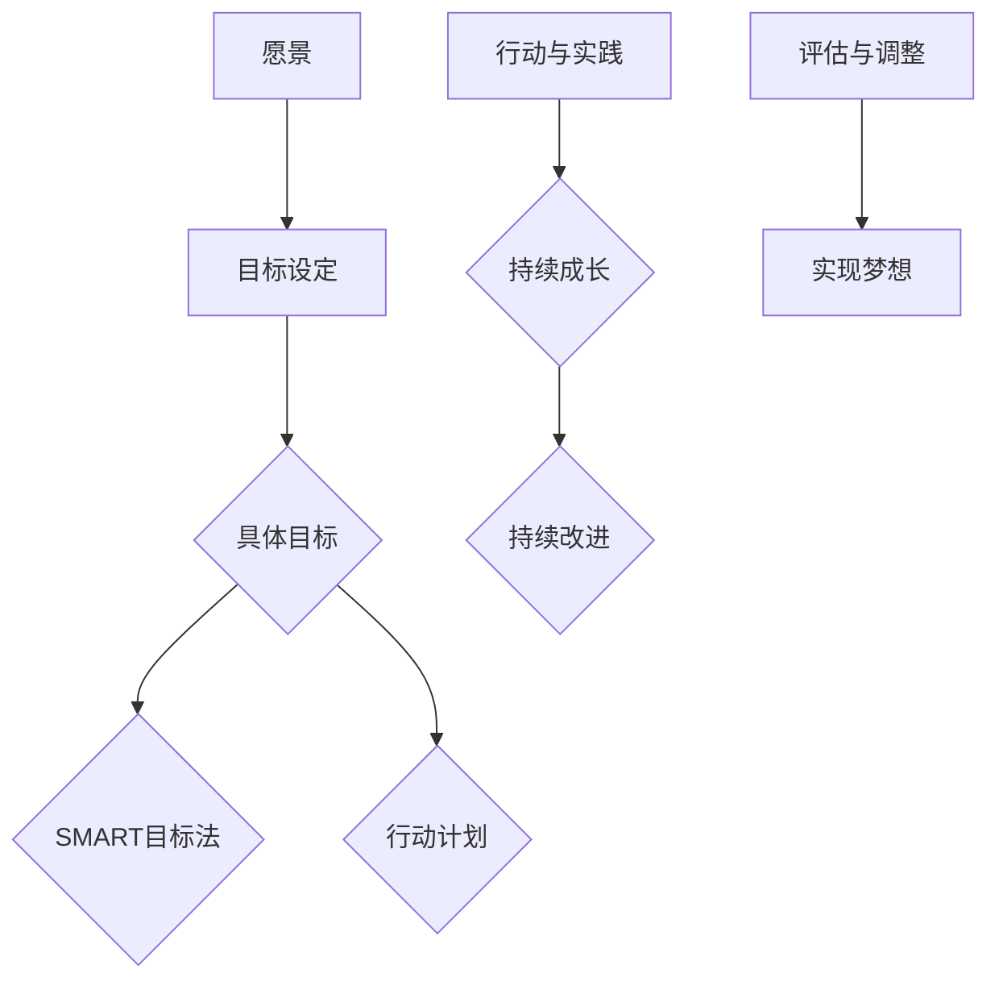
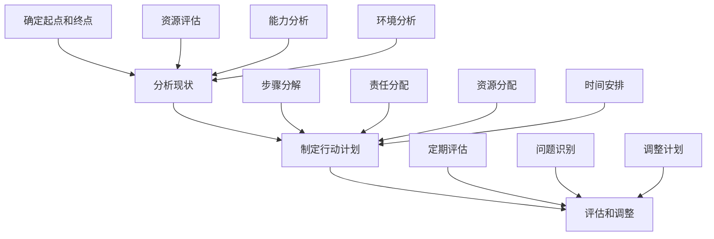

                 

### 文章标题

# 《从愿景到行动：实现梦想的路径规划》

### 关键词

- 愿景
- 目标设定
- 路径规划
- 行动与实践
- 持续成长
- 成功实现

### 摘要

本文旨在探讨如何从愿景出发，通过科学的目标设定和详细的路径规划，最终实现个人的职业和人生梦想。文章首先介绍了愿景和目标的重要性，随后详细阐述了目标设定的原则和方法，并逐步解析了路径规划的步骤。在此基础上，文章讨论了如何在实践中持续行动并保持动力，强调了反馈机制在改进过程中的作用。最后，文章总结了如何通过持续学习和改进，最终实现梦想。本文旨在为读者提供一套系统、实用的路径规划方法论，帮助他们更加清晰地规划未来，坚定地迈向成功。

## 第一部分：引言

### 1.1 书籍主题介绍

《从愿景到行动：实现梦想的路径规划》是一本专注于帮助读者实现个人目标和梦想的指导性书籍。它不仅仅是一套理论阐述，更是结合了作者丰富的实践经验和对成功人士案例的深入研究。书中提出了一种系统化的路径规划方法论，通过从愿景到目标设定，再到路径规划和实践，最终实现梦想的完整过程，帮助读者在职业和个人生活中找到明确的方向和动力。

### 1.2 梦想与目标的重要性

梦想是人类前进的动力源泉，它赋予人们追求卓越、超越自我的勇气和决心。而目标则是实现梦想的具体体现，它将梦想转化为可操作、可衡量的步骤和计划。没有明确的目标，梦想就仅仅是一个遥不可及的幻想。相反，有了清晰的目标，人们才能有的放矢，通过一步步的行动和努力，逐渐接近甚至实现梦想。

### 1.3 为什么需要路径规划

路径规划是连接愿景和目标的桥梁，它为人们提供了实现梦想的具体步骤和策略。没有路径规划，人们可能会在追求梦想的过程中迷失方向，甚至可能因为遇到困难而放弃。路径规划帮助人们明确每一步的行动计划，合理分配时间和资源，从而更加高效地实现目标。同时，它也是一种自我管理工具，能够帮助人们保持专注和动力，克服拖延和挫折，最终实现梦想。

### 1.4 本书结构概述

本书共分为七个部分，第一部分是引言，介绍了书籍的主题、梦想与目标的重要性以及路径规划的作用。接下来的部分将分别从愿景与目标设定、路径规划、行动与实践、持续成长等方面展开，逐步帮助读者构建实现梦想的完整框架。通过这些部分的学习和实践，读者将能够更加明确自己的方向，坚定地迈向成功。

## 第二部分：愿景与目标设定

### 2.1 什么是愿景

愿景是人们内心深处的一种渴望和向往，它描绘了一个人希望达到的最终状态或境界。愿景可以是一个宏伟的蓝图，也可以是一个简单的愿望，但无论大小，它都是激发人们行动和努力的重要动力。在职业和个人生活中，愿景为我们提供了方向和目标，让我们知道为什么而奋斗，从而在实现过程中保持动力和激情。

### 2.1.1 愿景的重要性

愿景的重要性在于它为我们的行动提供了明确的方向。当人们有了清晰的愿景，他们会更有动力去追求自己的目标，而不是盲目地随波逐流。同时，愿景也赋予了人们一种内在的力量，让他们在面对困难和挫折时能够坚持不懈，最终实现自己的梦想。

### 2.1.2 愿景的描述方法

要描述一个愿景，我们需要将其具体化、形象化。以下是一些有效的描述方法：

- **使用生动的语言**：通过使用具有感染力的词汇和描述，使愿景更加生动和具体。
- **设定时间范围**：明确愿景的实现时间，使其具有可行性和紧迫性。
- **用图像和故事形式**：通过图像和故事的形式，使愿景更加直观和易于理解。
- **与他人分享**：与他人分享愿景，可以获取更多的反馈和建议，从而进一步完善和明确自己的愿景。

### 2.1.3 如何发现和定义你的愿景

发现和定义自己的愿景是一个需要深入思考和自我探索的过程。以下是一些步骤和方法：

- **自我反思**：花时间思考自己的兴趣、价值观和长期目标。通过自我反思，可以发现内心深处的真实愿望。
- **倾听内心的声音**：当内心产生某种强烈的渴望或激情时，不要轻易忽视。这往往是内心对你愿景的暗示。
- **设定具体目标**：将愿景分解成具体的、可操作的目标，使其更加明确和具体。
- **咨询他人**：与家人、朋友或专业人士交流，获取他们的意见和建议，从而帮助你更好地发现和定义自己的愿景。

### 2.2 设定具体目标

目标是对愿景的具体化，是将愿景转化为可执行和可测量的步骤。一个明确、合理的目标能够为我们的行动提供清晰的指引，同时也能够帮助我们评估和调整自己的行动计划。

#### 2.2.1 目标设定的原则

设定目标时，应遵循以下原则：

- **明确性**：目标必须清晰明确，避免模糊和含糊其辞。
- **可衡量性**：目标应该能够量化，从而可以方便地评估其实现情况。
- **可实现性**：目标应该是现实可行的，避免设定过于高远的目标，从而失去动力。
- **时限性**：目标应该有时间限制，使其具有紧迫感和实现压力。

#### 2.2.2 SMART目标法

SMART目标是设定目标的一种有效方法，它将目标设定分为五个方面：具体（Specific）、可衡量（Measurable）、可实现（Achievable）、相关（Relevant）和时限性（Time-bound）。以下是一个SMART目标示例：

**具体（Specific）**：我想在明年的6月前完成我的硕士学位。

**可衡量（Measurable）**：我将通过完成所有课程作业和论文来证明自己的学习成果。

**可实现（Achievable）**：我有足够的时间和资源来完成学业，并且我已经制定了详细的学习计划。

**相关（Relevant）**：完成硕士学位是实现我职业目标的重要一步。

**时限性（Time-bound）**：目标设定在明年的6月，以确保我有足够的时间完成任务。

#### 2.2.3 如何制定个人和团队的目标

制定个人和团队的目标时，可以遵循以下步骤：

1. **明确愿景和使命**：首先，明确个人或团队的整体愿景和使命，这将作为设定目标的基准。
2. **分解目标**：将总体目标分解为具体的、可执行的小目标，每个小目标都应该符合SMART原则。
3. **设定优先级**：根据重要性和紧急性，为每个目标设定优先级，确保资源优先分配给最重要的目标。
4. **制定行动计划**：为每个目标制定详细的行动计划，明确每一步的行动步骤、责任人、资源和时间表。
5. **定期评估和调整**：定期评估目标的实现情况，根据实际情况进行调整，确保目标的持续性和适应性。

### 2.3 核心概念与联系

为了更好地理解愿景与目标设定之间的关系，我们可以使用Mermaid流程图来展示它们的核心概念和联系：



这个流程图清晰地展示了从愿景到目标设定，再到行动与实践和持续成长，最终实现梦想的完整路径。愿景为我们的行动提供了方向，目标设定则将愿景转化为可操作和可测量的步骤，而行动与实践和持续成长则是实现梦想的关键。

### 2.4 核心算法原理讲解

在设定目标时，我们可以使用一些核心算法来帮助我们进行更科学的规划和决策。以下是一个目标设定算法的伪代码示例：

```python
# 目标设定算法伪代码

function 设定目标（愿景，时间限制，资源约束）:
    # 输入：愿景 - 一个描述性的字符串；时间限制 - 目标实现的时间；资源约束 - 可用的资源
    # 输出：目标列表 - 一个包含SMART目标的列表

    目标列表 = []

    # 1. 拆分愿景为具体任务
    具体任务列表 = 拆分愿景（愿景）

    # 2. 对每个具体任务应用SMART原则
    for 任务 in 具体任务列表:
        目标 = {
            "具体性": 具体化任务描述（任务）,
            "可衡量性": 设定量化指标（任务）,
            "可实现性": 评估资源需求（任务，资源约束）,
            "相关性": 确定任务与愿景的相关性（任务，愿景）,
            "时限性": 设定目标完成时间（任务，时间限制）
        }
        如果 目标满足SMART原则:
            目标列表.append（目标）

    # 3. 返回目标列表
    return 目标列表
```

这个算法的核心思想是将愿景分解为具体的任务，并使用SMART原则对这些任务进行评估和调整，最终形成一组具体、可执行的目标。

### 2.5 数学模型和公式详解

在目标设定过程中，我们可以使用一些数学模型和公式来帮助我们进行量化分析和评估。以下是一个简单的目标设定数学模型示例：

**目标完成概率模型**：

$$
P（目标完成） = \frac{R（资源投入）}{C（资源需求）} \times \frac{S（技能匹配度）}{M（市场需求）}
$$

其中：
- \(P（目标完成概率）\) 是目标完成的概率；
- \(R（资源投入）\) 是为实现目标而投入的资源总量；
- \(C（资源需求）\) 是实现目标所需的资源总量；
- \(S（技能匹配度）\) 是团队成员实现目标所需的技能水平与实际技能水平的匹配度；
- \(M（市场需求）\) 是目标实现后市场对该目标的接受程度。

**目标评估指标**：

$$
E（目标评估指标） = \frac{P（目标完成概率）}{T（目标实现时间）}
$$

其中：
- \(E（目标评估指标）\) 是对目标实现情况的评估；
- \(T（目标实现时间）\) 是目标设定的实现时间。

通过这些数学模型和公式，我们可以更加科学和系统地评估目标的可行性，从而制定更加合理的行动计划。

### 2.6 项目实战

为了更好地理解愿景与目标设定的实际应用，我们来看一个项目实战案例。

**项目背景**：一家初创公司计划开发一款智能健康监测App，目标是帮助用户实时监测身体健康状况，并提供个性化的健康建议。

**愿景**：成为全球领先的智能健康监测解决方案提供商，改善人们的健康生活方式。

**目标设定**：

1. **具体目标**：在首个版本中，实现以下功能：
    - 用户健康数据实时监测；
    - 基于用户数据提供个性化健康建议；
    - 用户健康报告生成。

2. **SMART目标示例**：
    - **具体性**：开发一款用户健康数据实时监测App。
    - **可衡量性**：实现1000名用户的数据实时监测，并在30天内完成App的基本功能。
    - **可实现性**：团队已有相关技术储备，且拥有足够的资源完成开发任务。
    - **相关性**：该目标与公司的愿景高度一致，是公司发展的重要一步。
    - **时限性**：目标设定为6个月内完成。

**行动计划**：
- **技术选型**：选择适合开发智能健康监测App的技术框架和工具。
- **需求分析**：与用户和医生沟通，明确App的功能需求和用户体验。
- **设计UI/UX**：根据需求分析结果，设计用户界面和用户体验。
- **开发与测试**：按阶段完成App的功能开发，并进行系统测试。
- **上线与推广**：在App Store和Google Play等平台上发布App，并制定推广计划。

**评估与调整**：
- **定期评估**：每月对目标实现情况进行评估，根据评估结果调整开发计划。
- **反馈机制**：收集用户反馈，不断优化App的功能和用户体验。

通过这个项目实战案例，我们可以看到愿景与目标设定在实际应用中的重要性。明确的目标和详细的行动计划为项目的顺利推进提供了保障，同时也为团队提供了清晰的行动指南。

### 2.7 最佳实践 tips

- **定期回顾与调整**：定期回顾目标实现情况，根据实际情况进行调整，确保目标始终与愿景保持一致。
- **制定长期和短期目标**：短期目标可以帮助我们快速取得成果，而长期目标则为我们提供了持续的驱动力。
- **设定具体可测量的里程碑**：通过设定具体的里程碑，可以更好地监控目标实现的进度，并及时调整策略。
- **与他人分享目标**：与他人分享目标，不仅可以获得更多的支持和鼓励，还可以通过反馈和建议优化目标设定。

### 2.8 小结

愿景与目标设定是路径规划中的关键环节，它为我们提供了明确的方向和目标。通过科学的目标设定方法和有效的实施策略，我们可以将愿景转化为可操作的步骤，从而更加高效地实现个人和团队的目标。在设定目标时，应遵循SMART原则，并制定详细的行动计划。同时，定期回顾和调整目标，以及与他人分享目标，都是确保目标实现的重要策略。通过这些方法，我们可以在实现梦想的道路上迈出坚实的步伐。

## 第三部分：路径规划

### 3.1 路径规划的重要性

路径规划是连接愿景与行动的桥梁，它将我们的目标转化为一系列具体的行动步骤，为我们的努力提供了清晰的指引和策略。一个好的路径规划可以帮助我们避免在追求目标的过程中迷失方向，提高工作效率，减少资源的浪费。在复杂多变的环境中，路径规划能够为团队或个人提供一套系统的应对方案，确保在面对各种挑战时，能够迅速作出调整并继续前进。

### 3.2 路径规划的步骤

路径规划是一个系统化的过程，它需要我们在多个阶段进行深入的分析和规划。以下是路径规划的详细步骤：

#### 3.2.1 确定起点和终点

在规划路径之前，首先要明确起点和终点。起点是我们当前所处的状态，包括我们的资源、能力、环境等。终点则是我们希望达到的目标状态，它应该与我们的愿景和目标紧密相关。明确起点和终点，有助于我们更好地理解整个路径规划的目标和方向。

- **起点分析**：评估当前的资源、能力和环境条件，了解我们的优势和劣势，确定起点状态。
- **终点设定**：根据愿景和目标，明确我们希望达到的最终状态，设定具体的终点。

#### 3.2.2 分析现状

在确定起点和终点之后，我们需要对当前现状进行深入分析。这包括评估我们的资源、能力、市场环境、竞争对手等。通过分析现状，我们可以了解当前所处的位置，以及需要采取哪些措施才能达到目标。

- **资源评估**：评估当前拥有的资源，包括人力、资金、技术、时间等。
- **能力分析**：评估当前的能力水平，包括技术能力、管理能力、市场能力等。
- **环境分析**：分析市场环境、行业趋势、政策法规等，了解外部环境对我们的影响。

#### 3.2.3 制定行动计划

在分析现状的基础上，我们可以开始制定具体的行动计划。行动计划应该包括实现目标所需的具体步骤、责任人、资源分配、时间表等。一个详细的行动计划可以帮助我们更好地组织资源，明确责任分工，提高工作效率。

- **步骤分解**：将目标分解为具体的任务和活动，确保每个任务都清晰明确。
- **责任分配**：明确每个任务的责任人，确保任务的执行有人负责。
- **资源分配**：根据任务的需求，合理分配资源，确保资源得到最大化利用。
- **时间安排**：设定每个任务的时间表，确保任务按照预定的时间完成。

#### 3.2.4 评估和调整

路径规划不是一成不变的，它需要我们在实施过程中进行持续的评估和调整。通过定期评估，我们可以了解目标的实现情况，发现潜在的问题和风险，并及时进行调整。评估和调整是路径规划中至关重要的一环，它能够帮助我们确保目标的实现，并在面对变化时迅速作出反应。

- **定期评估**：定期对目标的实现情况进行评估，确保目标的持续性和适应性。
- **问题识别**：在评估过程中，识别存在的问题和风险，分析其成因。
- **调整计划**：根据评估结果，对路径规划进行必要的调整，确保目标的实现。

### 3.3 核心概念与联系

为了更好地理解路径规划的核心概念和联系，我们可以使用Mermaid流程图来展示路径规划的关键步骤和要素：



这个流程图清晰地展示了从确定起点和终点，到分析现状，再到制定行动计划和评估调整的完整路径规划过程。每个步骤和要素都相互关联，共同构成了一个系统化的路径规划框架。

### 3.4 时间管理

时间管理是路径规划中至关重要的一环，它决定了我们能否高效地完成各项任务并实现目标。以下是几个关键的时间管理方法和技巧：

#### 3.4.1 时间管理的重要性

时间管理的重要性在于它能够帮助我们更好地安排和利用时间，提高工作效率，减少压力。通过有效的时间管理，我们可以确保每一项任务都能在预定的时间内完成，从而实现整体目标的顺利推进。

#### 3.4.2 时间管理的方法

1. **优先级排序**：将任务按照重要性和紧急性进行排序，确保先完成最重要的任务。
2. **时间块划分**：将一天的时间划分为不同的时间段，并为每个时间段分配特定的任务。
3. **设定时间限制**：为每个任务设定具体的时间限制，确保在规定的时间内完成任务。
4. **避免拖延**：识别拖延的原因，并采取相应的措施，如设定明确的目标、分解任务等。

#### 3.4.3 如何避免拖延

1. **设定明确的目标**：明确任务的目标和期望结果，确保自己知道要做什么。
2. **分解任务**：将大任务分解为小任务，逐步完成，避免因任务复杂而感到无从下手。
3. **制定行动计划**：为每个任务制定详细的行动计划，明确每一步的操作步骤。
4. **自我激励**：为自己设定奖励机制，完成任务后给予奖励，以增加完成任务的积极性。

### 3.5 实战案例

为了更好地理解路径规划在实际项目中的应用，我们来看一个实际项目案例。

**项目背景**：一家互联网公司计划开发一款在线教育平台，目标是提供高质量的在线课程和学习资源，满足用户的学习需求。

**路径规划过程**：

1. **确定起点和终点**：
   - **起点**：公司已有一定的技术团队和资金，但在线教育平台的开发经验不足。
   - **终点**：开发一款功能完善、用户体验良好的在线教育平台，吸引大量用户注册和使用。

2. **分析现状**：
   - **资源评估**：公司拥有20名技术人员和一定的资金支持。
   - **能力分析**：技术人员有丰富的Web开发和服务器运维经验，但缺乏在线教育平台的开发经验。
   - **环境分析**：在线教育市场增长迅速，竞争激烈，需要快速上线并抢占市场份额。

3. **制定行动计划**：
   - **步骤分解**：将项目分解为需求分析、系统设计、开发与测试、上线与推广四个阶段。
   - **责任分配**：明确每个阶段的负责人和团队成员，确保每个任务都有人负责。
   - **资源分配**：根据任务需求，合理分配技术资源、资金和设备等。
   - **时间安排**：设定每个阶段的时间表，确保项目按时完成。

4. **评估和调整**：
   - **定期评估**：每月对项目的进度和成果进行评估，确保项目按计划推进。
   - **问题识别**：在评估过程中，识别存在的问题和风险，如技术难题、市场需求变化等。
   - **调整计划**：根据评估结果，对项目计划进行调整，确保目标的实现。

通过这个实际项目案例，我们可以看到路径规划在项目中的重要性。明确的起点和终点、详细的分析现状、合理的行动计划和持续的评估调整，都是项目成功的关键因素。

### 3.6 小结

路径规划是实现梦想的关键步骤之一，它为我们的行动提供了具体的指引和策略。通过明确起点和终点，分析现状，制定行动计划，以及持续评估和调整，我们可以确保目标实现的路径清晰、高效。同时，时间管理作为路径规划的重要组成部分，能够帮助我们更好地安排和利用时间，提高工作效率。通过这些方法，我们可以在追求梦想的道路上不断前行，最终实现目标。

## 第四部分：行动与实践

### 4.1 行动计划实施

行动计划实施是路径规划中的关键环节，它将书面计划转化为实际行动。成功的行动计划实施不仅需要明确的步骤和责任分配，还需要高效的执行和持续监控。以下是行动计划实施的具体步骤：

#### 4.1.1 如何开始行动

1. **明确目标和责任**：在实施行动计划之前，首先要明确每个任务的目标和责任人。确保每个任务都有明确的执行者，避免出现责任不清、推诿扯皮的现象。

2. **分解任务**：将大任务分解为小任务，确保每个任务都是具体、可操作的。通过分解任务，可以更清晰地了解每个任务的执行步骤和所需资源。

3. **制定时间表**：为每个任务设定具体的时间表，确保任务按照预定的时间完成。时间表应该详细到每个步骤和任务，以便于执行和监控。

4. **资源配置**：根据任务的需求，合理分配资源，包括人力、资金、设备等。确保每个任务都有足够的资源支持，避免因资源不足而导致任务延误。

#### 4.1.2 遇到挑战怎么办

在行动计划实施过程中，难免会遇到各种挑战和问题。以下是一些应对策略：

1. **问题识别**：及时发现和识别问题，避免问题扩大化。可以通过定期会议、报告、问卷调查等方式收集反馈，了解项目进展中的问题。

2. **原因分析**：对识别出的问题进行深入分析，找出问题的根本原因。通过原因分析，可以制定更有效的解决方案。

3. **解决方案制定**：根据问题原因，制定相应的解决方案。解决方案应具体、可操作，确保能够有效解决问题。

4. **资源调配**：在遇到资源不足时，可以通过调配现有资源、寻求外部支持等方式，确保任务的继续进行。

#### 4.1.3 如何保持动力

保持动力是实现目标的关键。以下是一些保持动力的方法：

1. **明确目标的意义**：经常回顾自己的目标，理解目标的重要性和意义，这可以激发内心的动力。

2. **设定短期目标**：将长期目标分解为短期目标，逐步实现。短期目标的实现可以带来成就感，激发继续前进的动力。

3. **设定奖励机制**：为自己设定奖励机制，完成任务后给予奖励，如休息一天、购买喜欢的物品等。奖励可以增加完成任务的积极性。

4. **与他人分享**：与他人分享目标，获得支持和鼓励。通过分享，可以获取更多的建议和帮助，同时也能增强责任感。

### 4.2 实践与反馈

实践与反馈是路径规划中的重要环节，它帮助我们在行动中不断学习和改进。通过实践，我们可以验证计划的有效性，发现潜在的问题，并通过反馈机制进行及时的调整。

#### 4.2.1 实践中的反思

在实践过程中，反思是一个重要的步骤。通过反思，我们可以总结经验教训，找出成功和失败的原因，为后续的工作提供参考。以下是一些反思的方法：

1. **定期反思**：在项目或任务的每个阶段结束后，进行定期反思。通过反思，可以了解哪些策略有效，哪些需要改进。

2. **记录经验**：将实践中的经验教训记录下来，形成文档。这不仅可以作为个人的学习资料，也可以为团队提供宝贵的经验。

3. **案例分享**：与团队成员分享实践中的成功和失败案例，通过案例分享，可以互相学习，共同进步。

#### 4.2.2 反馈机制的重要性

反馈机制是确保目标实现的重要工具。通过反馈，我们可以及时了解目标的实现情况，发现潜在的问题，并采取相应的措施进行改进。以下是一些反馈机制的重要性：

1. **及时性**：反馈应具有及时性，以便及时发现和解决问题。通过定期反馈，可以确保目标的持续改进。

2. **全面性**：反馈应全面覆盖目标的各个方面，包括进度、质量、资源利用等。全面的反馈有助于更全面地了解目标的实现情况。

3. **真实性**：反馈应真实反映实际情况，避免夸大或缩小问题。真实的反馈是改进的基础。

4. **建设性**：反馈应具有建设性，提供具体的改进建议和措施。建设性的反馈有助于问题的解决和目标的实现。

#### 4.2.3 如何有效收集和利用反馈

1. **建立反馈渠道**：建立有效的反馈渠道，如定期会议、问卷调查、在线反馈等。确保反馈的渠道畅通，方便团队成员提出问题和建议。

2. **数据分析**：对收集到的反馈进行分析，识别出普遍存在的问题和潜在的问题。通过数据分析，可以更科学地制定改进措施。

3. **改进措施**：根据反馈结果，制定具体的改进措施。改进措施应具有可操作性和针对性，确保能够有效解决问题。

4. **跟踪反馈**：对反馈的处理情况进行跟踪，确保改进措施的执行和效果。通过跟踪反馈，可以不断优化反馈机制，提高反馈的质量和效率。

### 4.3 实际案例解析

为了更好地理解实践与反馈在路径规划中的应用，我们来看一个实际案例。

**案例背景**：一家公司计划开发一款移动应用，目标是提高用户参与度和留存率。

**实践与反思**：

1. **实践中的反思**：
   - **初期反思**：在开发初期，通过用户调研和内部讨论，发现用户对应用界面和功能有较高的期待。通过反思，决定在后续开发中更加注重用户体验设计。
   - **中期反思**：在开发中期，通过用户测试和数据分析，发现用户对应用的部分功能不熟悉，导致使用频率下降。通过反思，决定增加用户引导和培训功能。

2. **反馈机制的应用**：
   - **用户反馈**：通过用户反馈，收集用户对应用界面、功能和性能的反馈。反馈显示，用户对界面设计满意度较低，导致用户流失。通过分析用户反馈，决定对界面进行优化。
   - **数据分析**：通过数据分析，发现用户使用频率较低的功能，决定对这些功能进行改进或删除。

**改进措施**：
- **界面优化**：根据用户反馈，对应用界面进行优化，增加用户友好的提示和信息。
- **功能改进**：对用户使用频率较低的功能进行改进，提升用户体验。
- **用户引导**：增加用户引导功能，帮助用户更快地熟悉应用。

**效果评估**：
- **用户满意度**：通过用户满意度调查，发现用户满意度显著提高。
- **留存率**：应用留存率有所提升，表明用户对应用的认可度增加。

通过这个案例，我们可以看到实践与反馈在路径规划中的重要性。通过实践，我们发现问题并进行反思，通过反馈，我们收集用户意见和建议，制定改进措施。这些步骤共同构成了一个闭环，确保了路径规划的有效实施和持续改进。

### 4.4 小结

行动计划实施和实践与反馈是路径规划中至关重要的一环。通过明确的行动计划，我们可以将目标转化为具体的行动步骤，并通过高效的执行和持续的监控，确保目标的实现。实践中的反思和反馈机制则帮助我们不断学习和改进，确保路径规划的持续优化。通过这些方法，我们可以在实现梦想的道路上不断前行，最终取得成功。

## 第五部分：持续成长

### 5.1 学习与成长

持续成长是实现梦想的关键，而学习是成长的基石。在这个快速变化的世界中，知识更新的速度远超以往，因此，终身学习成为每个人必须面对的现实。学习不仅是为了获取新的知识，更是为了提升我们的思维方式和解决问题的能力。

#### 5.1.1 成长的意义

成长不仅仅是指技能和知识的积累，更重要的是心智模式的成长。一个持续成长的人，能够更好地适应环境变化，面对挑战时更加从容。成长意味着自我超越，不断突破自己的舒适区，追求更高的目标。

#### 5.1.2 如何持续学习

1. **主动学习**：主动寻找学习机会，无论是通过在线课程、书籍、研讨会还是实际项目。主动学习比被动接受知识更能激发我们的学习动力和思考能力。

2. **定期复习**：学习新知识后，定期复习和巩固，确保知识的长久记忆。通过复习，我们可以加深对知识的理解，并能够在实际中灵活应用。

3. **实践应用**：将所学知识应用到实际工作中，通过实践来检验和巩固学习成果。实践是学习的最好方式，它能够帮助我们发现问题并不断提升。

4. **交流互动**：与他人交流互动，分享知识和经验。通过交流，我们可以获得不同的观点和见解，从而开阔视野，提升自己的思维能力。

### 5.2 持续改进

持续改进是实现梦想的重要手段，它强调在过程中不断优化和提升。持续改进不仅是对现有方法和流程的优化，更是对个人能力和团队协作的持续提升。

#### 5.2.1 持续改进的原则

1. **以用户为中心**：持续改进应以用户的需求和体验为中心，确保所有改进措施都能够提高用户满意度。

2. **系统化**：持续改进应是一个系统化的过程，包括目标设定、计划实施、效果评估和反馈优化。通过系统化，可以确保改进措施的持续性和有效性。

3. **数据驱动**：持续改进应基于数据分析和事实依据，通过数据来评估改进措施的效果，并根据数据反馈进行调整。

4. **全员参与**：持续改进需要全员参与，鼓励员工提出改进建议，并共同参与到改进过程中。全员参与可以提高员工的积极性和责任感。

#### 5.2.2 如何实施持续改进

1. **设立改进目标**：根据用户需求和业务目标，设立具体的改进目标。目标应具体、可衡量，并具有可实现性。

2. **分析现状**：对现有流程、方法和技术进行详细分析，找出存在的问题和瓶颈。通过现状分析，可以明确改进的方向。

3. **制定改进计划**：根据现状分析结果，制定具体的改进计划。计划应包括改进措施、责任人和时间表。

4. **实施改进措施**：按照改进计划，实施具体的改进措施。在实施过程中，应确保所有相关人员的参与和协作。

5. **评估效果**：在改进措施实施后，对效果进行评估。通过评估，可以确定改进措施的有效性，并识别需要进一步优化的方面。

6. **反馈优化**：根据评估结果，对改进措施进行反馈优化。通过不断反馈和优化，可以持续提升改进措施的效果。

### 5.3 成长陷阱与应对策略

在持续成长的过程中，人们可能会遇到一些陷阱，阻碍自己的进步。以下是几个常见的成长陷阱及应对策略：

#### 5.3.1 自满

**现象**：在取得一定成绩后，容易产生自满情绪，认为已经足够优秀，不需要再进一步学习。

**应对策略**：保持谦虚和开放的心态，不断寻找新的学习机会，与他人交流，了解行业前沿动态。

#### 5.3.2 焦虑

**现象**：面对快速变化的环境和不断涌现的新知识，可能会感到焦虑和无从下手。

**应对策略**：制定合理的学习计划，分解大任务为小任务，逐步完成。通过学习，提升自己的能力，缓解焦虑。

#### 5.3.3 拖延

**现象**：面对复杂或困难的任务，容易产生拖延行为，导致任务无法按时完成。

**应对策略**：设定明确的目标和时间表，分解任务，设定奖励机制。通过建立良好的时间管理习惯，克服拖延。

### 5.4 成长案例

为了更好地理解持续成长在实践中的应用，我们来看一个实际案例。

**案例背景**：一位程序员小李，在进入公司后，发现自己在技术能力和项目经验上与其他同事有一定差距。

**成长过程**：

1. **自我反思**：小李通过反思，认识到自己的不足，并决定通过学习和实践提升自己的技术能力。

2. **制定学习计划**：小李制定了详细的学习计划，包括学习新技术、参加线上课程、阅读专业书籍等。

3. **实践应用**：小李在项目中积极实践所学知识，通过解决实际问题和参与项目开发，不断提升自己的技能。

4. **反馈与调整**：小李定期与同事和领导交流，获取反馈，并根据反馈调整自己的学习方向和方法。

5. **持续改进**：小李在项目过程中，不断反思和改进，优化自己的工作流程和技术方案。

**结果**：经过一段时间的努力，小李的技术能力显著提升，项目成果也得到了领导和同事的认可。通过持续学习和实践，小李成功地实现了自我超越。

### 5.5 小结

持续成长是实现梦想的重要保障，它需要我们保持学习的心态，不断积累知识和经验。通过持续学习和实践，我们可以不断提升自己的能力和竞争力，克服成长中的陷阱和挑战。同时，持续改进是我们不断提升自我和优化过程的重要手段。通过这些方法，我们可以在实现梦想的道路上不断前行，最终取得成功。

## 第六部分：实现梦想

### 6.1 评估与调整

实现梦想是一个动态的过程，需要我们不断地评估和调整。通过定期评估，我们可以了解目标的实现情况，发现潜在的问题和不足，从而及时进行调整，确保目标的顺利实现。

#### 6.1.1 评估目标实现情况

评估目标实现情况的方法有多种，包括：

1. **定期检查**：设定固定的时间点，对目标的实现情况进行检查。例如，每月或每季度进行一次评估。
2. **数据分析**：通过数据分析，了解目标的实现进度和效果。例如，通过销售数据、用户反馈等指标，评估市场推广活动的效果。
3. **自我评估**：定期进行自我评估，反思自己的行动和表现，了解自己在实现目标过程中的优势和不足。

#### 6.1.2 调整路径规划

在评估过程中，如果发现目标实现情况与预期有较大差距，需要及时调整路径规划。以下是一些调整策略：

1. **重新设定目标**：根据实际情况，重新设定目标。如果目标设定过高，可以适当降低目标，使其更具可实现性。
2. **调整行动计划**：对现有的行动计划进行调整，增加或减少某些步骤，优化资源分配和时间安排。
3. **寻求外部支持**：在需要时，寻求外部支持，如咨询专家、寻找合作伙伴等。外部支持可以帮助我们更好地应对挑战。

#### 6.1.3 如何应对失败

在追求梦想的过程中，失败是不可避免的。如何应对失败，决定了我们能否继续前行。以下是一些应对失败的策略：

1. **接受失败**：首先，需要接受失败是成长过程中的一部分，不要因为失败而沮丧或自责。
2. **分析原因**：深入分析失败的原因，找出问题所在。通过原因分析，可以了解失败的本质，为下一次尝试提供借鉴。
3. **调整策略**：根据失败的原因，调整策略和行动计划。通过调整，可以更好地应对类似的情况，减少失败的可能性。
4. **持续尝试**：失败并不意味着终结，而是一个新的开始。通过持续尝试，我们可以积累经验，不断进步。

### 6.2 实现梦想的步骤

实现梦想是一个复杂而长期的过程，需要我们明确目标、制定计划、持续行动和不断调整。以下是实现梦想的详细步骤：

#### 6.2.1 明确目标

明确目标是实现梦想的第一步。我们需要清晰地知道自己想要什么，并设定具体、可衡量的目标。例如，如果你想成为一名顶尖的程序员，你的目标可以设定为在五年内成为公司技术团队的核心成员。

#### 6.2.2 制定计划

在明确目标后，我们需要制定详细的行动计划。行动计划应包括：

1. **具体步骤**：将目标分解为具体的步骤，确保每一步都是具体、可操作的。
2. **时间表**：为每个步骤设定具体的时间表，确保每一步都在规定的时间内完成。
3. **资源分配**：明确每个步骤所需的资源和责任分配，确保资源得到最大化利用。

#### 6.2.3 持续行动

制定计划后，我们需要持续行动，逐步实现目标。以下是一些行动策略：

1. **分阶段实施**：将计划分解为多个阶段，每个阶段实现一部分目标。通过分阶段实施，可以减少压力，确保每一步的顺利进行。
2. **定期检查**：定期检查计划的执行情况，确保每一步都在按计划进行。如果发现偏差，及时进行调整。
3. **保持动力**：通过设定奖励机制、与他人分享目标等方式，保持行动的动力和积极性。

#### 6.2.4 不断调整

在实现梦想的过程中，我们需要不断评估和调整路径规划。以下是一些调整策略：

1. **定期评估**：定期评估目标的实现情况，了解自己在实现过程中的优势和不足。
2. **调整计划**：根据评估结果，对路径规划进行调整。如果目标设定过高，可以适当降低目标，使其更具可实现性；如果计划执行不力，可以重新制定计划。
3. **持续学习**：通过持续学习和实践，不断提升自己的能力和竞争力，确保目标的实现。

### 6.3 实现梦想与价值

实现梦想不仅是对个人能力的提升，更是对社会价值的贡献。以下是一些实现梦想的价值：

1. **个人成长**：实现梦想意味着个人能力的提升和成长，通过不断学习和实践，我们可以成为行业的专家和领导者。
2. **社会贡献**：实现梦想的过程，不仅是个人价值的实现，更是对社会和行业的贡献。通过解决实际问题、推动行业进步，我们可以为社会带来更多的价值和福祉。
3. **激励他人**：实现梦想的过程，可以激励他人追求自己的梦想。通过分享经验和故事，我们可以激励更多人勇敢追求自己的目标，实现自我价值。

### 6.4 成功案例分享

为了更好地理解实现梦想的过程，我们来看一些成功案例。

**案例一**：马云创办阿里巴巴

马云是阿里巴巴的创始人，他凭借对电子商务的远见和坚定的信念，成功地将阿里巴巴发展成为全球最大的电商平台之一。马云的成功故事告诉我们，实现梦想需要坚定的信念和不懈的努力。

**案例二**：乔布斯创立苹果公司

乔布斯是苹果公司的创始人，他通过设计出色的产品，将苹果公司从一个小公司发展成为全球科技巨头。乔布斯的成功故事告诉我们，实现梦想需要创新思维和卓越的产品设计。

**案例三**：马斯克创立特斯拉

埃隆·马斯克是特斯拉的创始人，他通过推动电动汽车和太空探索技术的发展，改变了人们的生活方式。马斯克的成功故事告诉我们，实现梦想需要远大的理想和敢于冒险的精神。

这些成功案例展示了实现梦想的多样性和可能性。无论目标多么宏伟，只要我们坚定信念、持续努力，就一定能够实现梦想。

### 6.5 小结

实现梦想是一个充满挑战和机遇的过程，需要我们明确目标、制定计划、持续行动和不断调整。通过评估与调整，我们可以确保目标的实现，并通过不断的实践和学习，不断提升自己的能力和竞争力。同时，实现梦想不仅是对个人价值的实现，更是对社会和行业的贡献。通过分享经验和故事，我们可以激励更多人勇敢追求自己的梦想，共同创造更美好的未来。

## 第七部分：附录

### 7.1 常见问题解答

以下是一些关于路径规划、目标设定和实践中的常见问题及解答：

**Q1：如何设定可行的目标？**
A1：设定可行的目标时，应确保目标具有明确性、可衡量性、可实现性、相关性和时限性。使用SMART目标法，将目标具体化、量化，并设定明确的时间表。

**Q2：遇到拖延怎么办？**
A2：遇到拖延，可以设定明确的截止日期和奖励机制，分解任务，逐步完成。同时，反思拖延的原因，并采取相应的策略，如调整时间管理习惯、设定优先级等。

**Q3：如何保持学习的动力？**
A3：保持学习动力可以通过设定明确的学习目标、制定学习计划、与他人分享学习成果等方式。同时，定期评估学习效果，根据反馈调整学习策略。

### 7.2 愿景与目标设定工具

以下是一些常用的愿景与目标设定工具：

1. **SMART目标法**：用于设定具体、可衡量、可实现、相关和时限性的目标。
2. **目标树图**：通过树状结构展示愿景和目标，明确各目标之间的关系和实现路径。
3. **愿景板**：使用图片、文字和图表等视觉元素，展示愿景和目标，帮助团队成员共同理解和认同。
4. **Gantt图**：用于制定项目时间表和任务分配，清晰展示项目的进度和关键节点。

### 7.3 路径规划工具与资源

以下是一些路径规划工具与资源：

1. **Mermaid流程图**：用于绘制路径规划流程，展示各步骤和要素之间的关系。
2. **项目管理软件**：如Trello、Asana、JIRA等，用于任务分配、进度跟踪和团队协作。
3. **时间管理工具**：如Toggl、 RescueTime等，用于监控和管理个人或团队的工作时间。
4. **在线学习资源**：如Coursera、edX、Udemy等，提供丰富的在线课程和教程，帮助提升知识和技能。
5. **专业书籍**：推荐阅读《精益创业》、《深度学习》、《敏捷开发实践指南》等，获取行业前沿知识和实践经验。

通过使用这些工具和资源，我们可以更加高效地实现愿景和目标，迈向成功。

### 7.4 拓展阅读

为了进一步深入了解愿景与目标设定、路径规划和实践应用，以下推荐一些高质量的技术博客、书籍和课程：

1. **技术博客**：
   - 《高效能人士的七个习惯》
   - 《如何赢得朋友与影响他人》
   - 《执行力：如何把战略变成现实》

2. **书籍推荐**：
   - 《目标：人生的智慧》
   - 《实现你的梦想：成功的八个步骤》
   - 《路径规划：从愿景到成功的旅程》

3. **在线课程**：
   - Coursera的《时间管理和目标设定》
   - edX的《领导力与组织发展》
   - Udemy的《职业发展规划：从零到专家》

通过阅读这些资源，读者可以获取更多关于愿景、目标和路径规划的专业知识和实践经验，进一步提升自己的能力。

### 7.5 小结

附录部分提供了一些常见问题解答、愿景与目标设定工具、路径规划工具与资源，以及拓展阅读推荐。这些资源旨在帮助读者更好地理解本书的核心内容，并在实际应用中取得更好的效果。通过使用这些工具和资源，读者可以更加系统地规划自己的职业和人生道路，实现梦想。

### 作者信息

作者：AI天才研究院/AI Genius Institute & 禅与计算机程序设计艺术 /Zen And The Art of Computer Programming

AI天才研究院致力于推动人工智能技术的发展和应用，培养新一代的人工智能专家。而《禅与计算机程序设计艺术》则是一本经典的计算机编程指南，以其深刻的哲学思考和卓越的技术理念，影响了无数程序员。两位作者凭借其深厚的专业知识和丰富的实践经验，共同撰写了本书，旨在帮助读者实现梦想，迈向成功。

