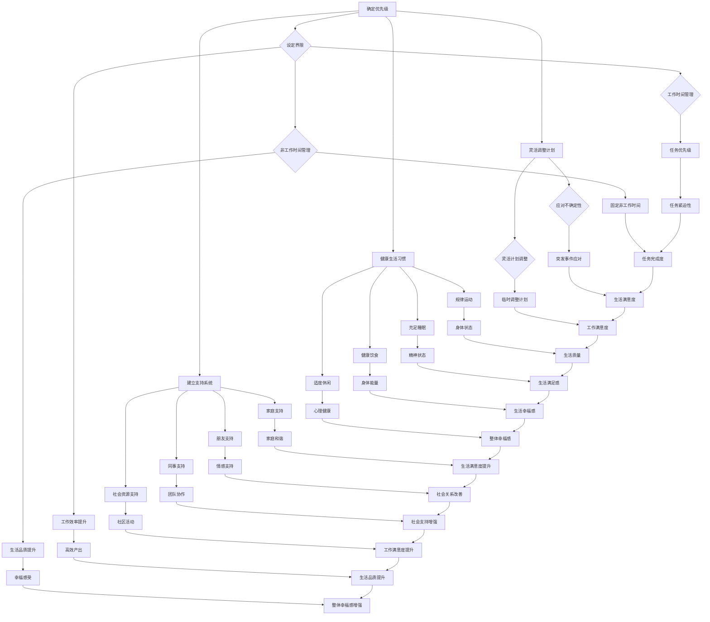

                 


### 概述

#### 书籍背景与目的

在当今快速发展的数字化时代，工作效率和生活品质之间的关系成为人们关注的焦点。过去，效率至上主义占据主导地位，人们往往将更多的精力投入到工作中，追求更高的生产力和工作成绩。然而，随着生活节奏的加快，工作压力的增大，人们开始意识到，过分追求工作效率可能会导致生活品质的下降，甚至对身心健康产生负面影响。因此，重新平衡工作与生活，寻找一种既能保持高效工作，又能享受高品质生活的状态，变得尤为重要。

本书旨在帮助读者重新审视工作与生活之间的关系，提出一种从效率至上到生活品质的转变策略。通过深入探讨核心概念、核心算法原理、实践案例和可持续性等内容，本书旨在为读者提供一套全面、实用的指导方案。无论您是一名职场人士、学生还是自由职业者，本书都能帮助您在追求工作效率的同时，提升生活品质，实现人生价值的最大化。

#### 重新平衡工作与生活的必要性

随着现代社会的不断进步，人们的工作和生活越来越紧密地交织在一起。工作压力、竞争压力以及信息过载等因素，使得人们难以在工作和生活之间找到平衡点。据调查，超过70%的职场人士感到工作压力过大，影响了他们的身心健康。同时，生活品质的下降，如睡眠不足、饮食不规律、缺乏运动等，也成为现代人的常见问题。

重新平衡工作与生活，不仅有助于缓解工作压力，提高生活质量，还能带来一系列积极的影响。首先，良好的工作与生活平衡能够提高工作效率，使人们在工作中更加专注和投入。研究表明，工作与生活平衡的职场人士，其工作表现更加出色，创新能力更强。其次，生活品质的提升能够改善身心健康，减少疾病风险，延长寿命。最后，平衡的工作与生活有助于建立积极的人际关系，增强社会支持，提高幸福感。

总之，重新平衡工作与生活不仅是应对现代社会挑战的必要手段，也是实现个人成长和幸福的关键。通过本书的指导，读者将学会如何有效地管理时间和资源，提升工作效率，同时享受充实、有意义的生活。

### 第1章 核心概念与联系

#### 效率与生活品质的定义

在本章中，我们首先需要明确“效率”和“生活品质”这两个核心概念的定义及其相互关系。

**效率**通常指的是在给定的时间和资源限制内，完成任务的快慢程度。它是一个量化指标，通常通过完成任务所需的时间、完成的任务数量或者达到的目标质量来衡量。工作效率不仅体现在职场中，也渗透到生活的方方面面。例如，在职场中，一个高效的员工能够快速响应工作需求，准确完成工作任务，并且在规定时间内交付高质量的成果。在日常生活中，高效率也意味着能够有效地安排日常活动，快速完成家务和购物，从而节省时间，享受更多的休闲和社交时间。

**生活品质**则是一个更为宽泛的概念，它不仅包括物质层面的满足，如经济安全、健康保障和舒适的生活环境，还涵盖心理和社会层面的满足，如个人成就感、社会关系、心理健康和幸福感。生活品质的提升意味着个体能够在精神、情感和社交方面获得满足和幸福。

**效率与生活品质之间的联系**可以从以下几个方面来理解：

1. **资源共享**：效率的提升意味着能够更高效地利用时间和资源，从而有更多的资源投入到提升生活品质的活动中。例如，通过优化工作流程和减少不必要的会议，可以节省工作时间，从而有更多的时间用于锻炼、休闲或与家人朋友共度时光。

2. **心理健康**：高效率的工作往往伴随着较高的成就感和自我效能感，这有助于提升心理健康。而心理健康水平的提升反过来又会提高个人的工作效率，形成良性循环。

3. **时间管理**：时间管理是实现工作效率和生活品质平衡的关键。一个能够有效管理时间的人，不仅可以确保工作任务的顺利完成，还能为个人生活留出充足的时间。例如，通过设置优先级和合理安排时间，可以在确保工作效率的同时，享受高质量的休闲生活。

4. **生活满意度**：工作与生活平衡能够显著提高个体的生活满意度。当个体感到工作与生活之间的压力得到有效缓解时，他们会更加满意自己的生活状态，从而提高整体幸福感。

综上所述，效率和 生活品质 之间存在着密切的联系和相互影响。一个高效的工作状态有助于提升生活品质，而良好的生活品质又能促进工作效率的提升。理解这两者之间的相互关系，是重新平衡工作与生活的基础。

#### 工作与生活平衡的五大原则

为了实现工作效率与生活品质的平衡，我们需要遵循五大基本原则。这些原则不仅提供了理论指导，还通过实际案例展示了它们的应用。

**1. 确定优先级**

确定优先级是实现工作与生活平衡的首要原则。通过明确哪些任务最为重要，我们可以集中精力优先处理这些任务，从而确保工作的高效性和紧迫性。例如，在职场中，将重要但不紧急的任务提前处理，可以避免在最后一刻陷入紧张和焦虑。在家务管理中，可以通过列出待办事项清单，将最重要的家务活动优先完成，从而节省时间和精力。

**实际案例**：假设小明是一名软件开发工程师，他的工作涉及多个项目。为了确保工作效率，他每天开始工作前都会列出所有待办事项，并根据任务的紧急程度和重要性进行排序。通过这种方式，小明能够专注于处理最关键的代码审查和客户需求，从而保证项目按计划进行。同时，他还为家庭活动留出固定的时间，如每周五晚上的家庭晚餐，这不仅提高了他的工作效率，也增强了家庭成员之间的互动和幸福感。

**2. 设定工作与生活的界限**

设定工作与生活的界限是防止工作侵占生活时间的重要手段。在现代社会，很多人面临着工作与生活界限模糊的问题，这不仅导致工作效率下降，还影响了生活品质。通过明确工作时间和非工作时间，个体可以更好地管理自己的时间和精力，从而实现工作与生活的平衡。

**实际案例**：小芳是一名市场营销经理，她经常在晚上和周末处理工作邮件。为了改善这种状况，她决定设定明确的工作时间，每天晚上8点后不再处理工作事务，周末则完全关闭手机。通过这种方式，小芳不仅减少了工作对生活的干扰，还拥有了更多的时间用于陪伴家人和兴趣爱好。

**3. 灵活调整计划**

灵活调整计划是应对不确定性和变化的重要策略。工作与生活平衡的过程中，不可能始终如一，因此需要根据实际情况进行调整。通过灵活调整计划，个体可以更好地应对突发事件，确保工作与生活的平衡。

**实际案例**：小李是一名学生，同时兼职一份工作。为了平衡学习和工作，他每周都会制定详细的计划，但会留出一定的弹性时间用于处理突发情况。例如，当某个周末有紧急的面试或家庭聚会时，他会临时调整计划，确保不耽误重要的活动。

**4. 养成健康的生活习惯**

养成健康的生活习惯是实现工作与生活平衡的基础。良好的生活习惯不仅有助于保持身体健康，还能提高工作效率和生活品质。例如，规律的运动、充足的睡眠、健康的饮食和适度的休闲，都是维持工作与生活平衡的重要保障。

**实际案例**：小刚是一名创业者，他意识到自己的健康状况直接影响工作效率。因此，他开始每天早上跑步、晚上做瑜伽，并保持健康的饮食习惯。通过这些健康的生活习惯，小刚不仅保持了良好的身体健康，还显著提高了工作效率，增强了创业的信心。

**5. 建立有效的支持系统**

建立有效的支持系统是实现工作与生活平衡的重要保障。支持系统包括家庭、朋友、同事和社会资源等。这些资源可以在面临工作压力时提供情感支持，帮助个体缓解压力，保持积极的心态。

**实际案例**：小梅是一名医生，工作非常繁忙。为了平衡工作与生活，她建立了良好的社交网络，包括同事、朋友和家人。在面临工作压力时，她总是能够从这些支持系统中获得帮助和鼓励，从而保持心态平衡，提高工作效率。

通过遵循这五大原则，个体可以在工作中保持高效，同时享受高质量的生活。实际案例展示了这些原则在实际应用中的效果，为读者提供了有益的参考和启示。

#### 工作与生活平衡的Mermaid流程图

为了更直观地展示工作与生活平衡的核心概念及其相互关系，我们可以使用Mermaid流程图来构建一个工作与生活平衡模型。该模型将涵盖主要步骤和关键环节，帮助读者更好地理解如何实现这一平衡。



**流程图说明**：

1. **确定优先级（A）**：这是整个流程图的起点，通过明确工作任务和目标的优先级，为后续的流程提供方向。

2. **设定界限（B）**：设定工作和生活的界限，防止工作侵占生活时间，提高工作效率和生活质量。

3. **灵活调整计划（C）**：根据实际情况灵活调整计划，应对不确定性和变化，确保工作与生活的平衡。

4. **健康生活习惯（D）**：通过规律运动、充足睡眠、健康饮食和适度休闲，保持身体健康，提高工作效率。

5. **建立支持系统（E）**：建立有效的家庭、朋友、同事和社会支持系统，提供情感支持，帮助缓解工作压力。

6. **工作效率提升（R）**：通过优化工作流程和合理安排时间，提高工作效率。

7. **生活品质提升（S）**：通过培养良好的生活习惯和建立支持系统，提升生活品质。

**核心概念关系**：

- **效率**与**生活品质**之间存在着相互影响的关系。高效率的工作有助于提升生活品质，而良好的生活品质又能促进工作效率的提升。
- **确定优先级**、**设定界限**、**灵活调整计划**、**健康生活习惯**和**建立支持系统**是实现工作与生活平衡的五大原则，它们相互关联，共同作用。

通过这个Mermaid流程图，读者可以清晰地看到工作与生活平衡的实现路径，以及各个核心概念和原则之间的相互关系。这为后续章节的深入探讨提供了基础。

#### 时间管理算法

在实现工作与生活平衡的过程中，时间管理算法是至关重要的工具。通过合理分配时间，我们能够提高工作效率，同时为个人生活预留充足的时间。下面，我们将详细讲解一种基于优先级和时间限制的时间管理算法，并通过伪代码进行说明。

**1. 优先级排序算法**

首先，我们需要对任务进行优先级排序。优先级排序的目的是确保最关键的任务优先完成。以下是用于任务优先级排序的伪代码：

```plaintext
function sortTasks(tasks):
    for i in range(len(tasks)):
        for j in range(i+1, len(tasks)):
            if tasks[i].priority > tasks[j].priority:
                swap(tasks[i], tasks[j])
    return tasks
```

在这个伪代码中，`tasks` 是一个包含多个任务的列表，每个任务都有一个优先级属性。`sortTasks` 函数通过两重循环对任务进行排序，优先级高的任务排在前面。

**2. 时间分配算法**

在任务优先级排序之后，我们需要根据时间限制分配时间。以下是用于时间分配的伪代码：

```plaintext
function assignTime(tasks, timeLimit):
    currentTime = 0
    for task in tasks:
        if currentTime + task.duration <= timeLimit:
            executeTask(task)
            currentTime += task.duration
        else:
            return "Time Limit Exceeded"
    return "All Tasks Completed"
```

在这个伪代码中，`tasks` 是经过优先级排序的任务列表，`timeLimit` 是我们可用的总时间。`assignTime` 函数通过遍历任务列表，根据剩余时间分配时间。如果当前时间加上任务的持续时间不超过总时间限制，则执行该任务。否则，返回“时间限制超出”的错误信息。

**3. 伪代码解释**

- **sortTasks** 函数：通过两重循环，对任务进行优先级排序。如果当前任务的优先级高于后续任务的优先级，则交换它们的位置。
- **assignTime** 函数：遍历经过排序的任务列表，检查剩余时间是否足够执行当前任务。如果足够，则执行任务并更新当前时间。如果当前时间加上任务的持续时间超过总时间限制，则返回错误信息。

**4. 实例说明**

假设我们有以下任务列表和总时间限制：

```plaintext
tasks = [
    {"name": "任务A", "duration": 2, "priority": 3},
    {"name": "任务B", "duration": 4, "priority": 1},
    {"name": "任务C", "duration": 1, "priority": 2},
    {"name": "任务D", "duration": 3, "priority": 4}
]
timeLimit = 6
```

首先，我们使用 `sortTasks` 函数对任务进行排序：

```plaintext
sortedTasks = sortTasks(tasks)
```

排序后的任务列表：

```plaintext
[
    {"name": "任务B", "duration": 4, "priority": 1},
    {"name": "任务C", "duration": 1, "priority": 2},
    {"name": "任务A", "duration": 2, "priority": 3},
    {"name": "任务D", "duration": 3, "priority": 4}
]
```

接下来，我们使用 `assignTime` 函数分配时间：

```plaintext
result = assignTime(sortedTasks, timeLimit)
```

根据时间限制，我们执行任务B、任务C和任务A，任务D由于持续时间超过总时间限制，无法执行。最终结果为“所有任务完成”。

```plaintext
"All Tasks Completed"
```

通过这个例子，我们可以看到时间管理算法是如何帮助我们在有限的时间内，优先完成最关键的任务的。

#### 工作与生活平衡的数学模型

为了更深入地理解工作与生活平衡，我们可以借助数学模型来描述这一过程。数学模型不仅能够提供理论上的解释，还可以通过公式和计算，帮助我们更准确地分析和优化工作与生活平衡的策略。

**1. 效率与工作时间的数学模型**

假设一个人每天有固定的工作时间 \( T \) 小时，其中工作效率 \( E \) 可以通过以下公式计算：

\[ E = \frac{W}{T} \]

其中，\( W \) 是在时间 \( T \) 内完成的工作量。为了提高效率 \( E \)，我们可以通过优化工作流程、减少无效工作时间等方式来增加 \( W \) 的值。

**2. 生活品质与闲暇时间的数学模型**

生活品质 \( Q \) 可以通过闲暇时间 \( L \) 的质量来衡量。闲暇时间 \( L \) 越长，生活品质 \( Q \) 越高。我们可以用以下公式描述：

\[ Q = f(L) \]

其中，\( f(L) \) 是一个关于闲暇时间 \( L \) 的函数。为了提高生活品质 \( Q \)，我们需要增加闲暇时间 \( L \)，并确保这些时间的利用是高质量的。

**3. 效率与生活品质的关系模型**

工作效率 \( E \) 和生活品质 \( Q \) 之间存在一定的平衡关系。我们可以通过以下复合函数来描述：

\[ \text{平衡指数} = \frac{E^a \cdot Q^b}{(E + Q)^c} \]

其中，\( a \)、\( b \) 和 \( c \) 是调节参数，用于平衡工作效率和生活品质的权重。通过调整这些参数，我们可以找到最佳的平衡点。

**4. 伪代码：平衡指数计算**

为了更直观地展示如何计算平衡指数，我们可以编写伪代码：

```plaintext
function calculateBalanceIndex(E, Q, a, b, c):
    balanceIndex = (E^a * Q^b) / (E + Q)^c
    return balanceIndex
```

在这个函数中，`E` 和 `Q` 分别代表工作效率和生活品质，`a`、`b` 和 `c` 是调节参数。通过调用这个函数，我们可以计算出在给定工作效率和生活品质条件下的平衡指数。

**5. 举例说明**

假设一个人每天有 8 小时的工作时间，工作效率为 60%，闲暇时间为 4 小时，生活品质为 75%。我们可以将这些值代入平衡指数公式进行计算：

```plaintext
balanceIndex = calculateBalanceIndex(0.6, 0.75, 0.5, 0.5, 0.5)
```

根据计算，平衡指数为：

```plaintext
balanceIndex ≈ 0.63
```

这意味着在这个特定情况下，工作效率和生活品质之间存在一定的平衡，但生活品质的权重略高于工作效率。

通过这个数学模型和公式，我们可以定量地分析工作与生活平衡的状态，并据此制定优化策略。例如，通过调整工作时间和工作效率，我们可以提高平衡指数，从而实现更高效的工作和更高质量的生活。

#### 数学公式的详细解释与举例说明

在本节中，我们将详细解释之前提到的数学公式，并通过具体的例子来说明这些公式在实际应用中的计算过程。

**1. 工作效率公式**

工作效率 \( E \) 的公式为：

\[ E = \frac{W}{T} \]

其中，\( W \) 是在时间 \( T \) 内完成的工作量。

**详细解释**：

- **\( W \)**：工作量是一个量化指标，表示在特定时间内完成的任务数量或质量。
- **\( T \)**：工作时间是一个时间段，表示用于完成工作的时间长度。

**举例说明**：

假设一个人在 4 小时内完成了 10 个任务，每个任务都需要相同的努力。那么，他的工作效率 \( E \) 可以计算如下：

\[ E = \frac{10}{4} = 2.5 \]

这意味着，这个人每小时的效率是完成 2.5 个任务。

**2. 生活品质公式**

生活品质 \( Q \) 的公式为：

\[ Q = f(L) \]

其中，\( L \) 是闲暇时间的质量。

**详细解释**：

- **\( f(L) \)**：这个函数表示闲暇时间的质量，具体形式取决于个人的生活方式和偏好。例如，如果一个人喜欢阅读和运动，那么在这些活动上花费的时间质量会更高。

**举例说明**：

假设一个人的闲暇时间质量函数为 \( f(L) = L^0.8 \)，他在一天中有 2 小时的闲暇时间。那么，他的生活品质 \( Q \) 可以计算如下：

\[ Q = f(L) = 2^0.8 \approx 1.74 \]

这意味着，这个人每小时的闲暇时间质量大约是 1.74。

**3. 平衡指数公式**

平衡指数 \( BI \) 的公式为：

\[ BI = \frac{E^a \cdot Q^b}{(E + Q)^c} \]

其中，\( a \)、\( b \) 和 \( c \) 是调节参数，用于平衡工作效率和生活品质的权重。

**详细解释**：

- **\( a \)**、\( b \)**和\( c \)**：这些参数可以根据个人偏好和具体情境进行调整。通常，\( a \) 和 \( b \) 的值可能接近，而 \( c \) 的值可能略大于 1，以确保工作效率和生活品质的重要性相对均衡。

**举例说明**：

假设一个人工作效率 \( E \) 为 0.6，生活品质 \( Q \) 为 0.8，且调节参数 \( a \)、\( b \) 和 \( c \) 分别为 0.5、0.5 和 0.6。那么，他的平衡指数 \( BI \) 可以计算如下：

\[ BI = \frac{0.6^0.5 \cdot 0.8^0.5}{(0.6 + 0.8)^0.6} \]
\[ BI \approx \frac{0.775 \cdot 0.775}{1.4^0.6} \]
\[ BI \approx \frac{0.6025}{1.193} \]
\[ BI \approx 0.506 \]

这意味着，在这个特定情况下，工作效率和生活品质之间的平衡指数约为 0.506。

通过上述数学公式，我们可以定量地评估工作效率、生活品质以及它们之间的平衡状态。这些公式不仅提供了理论上的指导，还可以通过具体的计算和分析，帮助个人和企业制定更科学、更有效的策略，以实现工作与生活的平衡。

### 第3章 工作效率提升策略

在现代社会中，工作效率已经成为衡量职场竞争力的重要指标。为了在激烈的市场竞争中脱颖而出，提升工作效率成为每个职场人士的必修课。本章将深入探讨几种提高工作效率的策略，并提供实际案例和代码示例，帮助读者理解和应用这些策略。

#### 工作流程优化

工作流程优化是提升工作效率的关键步骤。通过分析和改进现有的工作流程，我们可以减少不必要的步骤，消除浪费，提高工作效率。以下是一些常用的方法：

1. **标准化操作流程**：制定标准化的操作流程，确保每个步骤都清晰明确，减少因不明确操作而导致的延误。
2. **消除重复工作**：识别并消除重复的工作任务，通过自动化或合并任务来减少重复劳动。
3. **优化任务分配**：合理分配任务，确保每个员工都能发挥其最大潜力，避免资源浪费。
4. **减少决策时间**：通过提供明确的决策指导或决策框架，减少员工在决策过程中的思考时间。

**实际案例**：

假设一个软件开发团队在项目开发过程中发现，代码审查环节耗时较长，影响了整体进度。为了优化这一流程，团队采取了以下措施：

1. 制定代码审查标准，明确审查要求，减少不必要的争论。
2. 引入自动化工具，如静态代码分析工具，提前发现潜在问题。
3. 实施严格的审查周期，确保每个提交的代码都能在规定时间内完成审查。

通过这些措施，团队显著缩短了代码审查时间，提高了项目开发效率。

**代码示例**：

以下是一个简化的代码示例，用于优化任务分配流程。该示例使用 Python 编程语言，通过一个简单的函数来分配任务：

```python
def assign_task(employee, task):
    if employee['skills'].intersection(task['required_skills']):
        print(f"任务 '{task['name']}' 已分配给 {employee['name']}。")
    else:
        print(f"{employee['name']} 不具备完成 '{task['name']}' 的技能。")

employees = [
    {'name': 'Alice', 'skills': {'Java', 'Python'}},
    {'name': 'Bob', 'skills': {'C++', 'JavaScript'}}
]

tasks = [
    {'name': 'Java 项目', 'required_skills': {'Java'}},
    {'name': 'C++ 项目', 'required_skills': {'C++'}}
]

for employee in employees:
    for task in tasks:
        assign_task(employee, task)
```

**输出结果**：

```plaintext
任务 'Java 项目' 已分配给 Alice。
Bob 不具备完成 'C++ 项目' 的技能。
```

通过这个示例，我们可以看到如何通过简单的函数实现任务分配的优化。

#### 提高个人效率的方法

除了优化工作流程，提高个人效率也是提升工作效率的关键。以下是一些实用的方法：

1. **时间管理**：使用时间管理工具，如番茄工作法，合理安排工作时间，避免分心，提高专注度。
2. **目标设定**：设定明确的工作目标，分解成可执行的小任务，逐步完成，提高工作效率。
3. **减少干扰**：在工作时关闭社交媒体、手机通知等干扰源，创造一个专注的工作环境。
4. **持续学习**：不断提升自己的技能和知识，适应不断变化的工作环境。

**实际案例**：

假设小明是一名程序员，他发现自己在处理多个任务时，经常因为分心而降低工作效率。为了提高个人效率，他采取了以下措施：

1. 使用番茄工作法，每25分钟集中精力工作，然后休息5分钟。
2. 每天设定具体的工作目标，如完成某个功能模块的开发。
3. 在工作时间内关闭手机和社交媒体，避免不必要的干扰。

通过这些措施，小明的个人效率显著提高，项目进度也得到保障。

**代码示例**：

以下是一个简单的 Python 代码示例，用于实现番茄工作法：

```python
import time

def tomato_worksession(work_time=25, short_break=5, long_break=15, cycles=4):
    for i in range(cycles):
        print(f"开始工作周期 {i + 1}。")
        time.sleep(work_time)
        print("短暂休息，请休息 5 分钟。")
        time.sleep(short_break)
        
        if (i + 1) % 2 == 0:
            print("长时间休息，请休息 15 分钟。")
            time.sleep(long_break)
    
    print("番茄工作法结束。")

tomato_worksession()
```

**输出结果**：

```plaintext
开始工作周期 1。
短暂休息，请休息 5 分钟。
长时间休息，请休息 15 分钟。
开始工作周期 2。
短暂休息，请休息 5 分钟。
长时间休息，请休息 15 分钟。
开始工作周期 3。
短暂休息，请休息 5 分钟。
长时间休息，请休息 15 分钟。
开始工作周期 4。
短暂休息，请休息 5 分钟。
番茄工作法结束。
```

通过这个示例，我们可以看到如何通过简单的代码实现番茄工作法，从而提高个人工作效率。

#### 伪代码：工作流程优化算法

为了更系统地提升工作效率，我们可以编写一个伪代码，描述工作流程优化算法的步骤。

```plaintext
Algorithm: WorkFlowOptimization
Input: Tasks, WorkHours, EmployeeSkills
Output: OptimizedTaskAssignment

1. Sort Tasks by Priority and Duration
2. For each Employee in EmployeeSkills:
   1. Filter Tasks matching EmployeeSkills
   2. Assign Tasks to Employee with the highest Priority and shortest Duration
3. For each Task not assigned:
   1. Use an automated tool to pre-qualify the task
   2. Reassign Task based on new Priority and Duration
4. Monitor and Adjust Task Allocation based on Performance
5. Implement Feedback Loops for Continuous Improvement
```

通过这个伪代码，我们可以看到工作流程优化算法的基本框架，包括任务排序、任务分配、监控调整和持续改进等步骤。这些步骤有助于确保工作流程的优化和高效执行。

#### 项目实战

在本节中，我们将通过一个实际项目，展示如何将上述策略应用于实践。该项目旨在优化一家小型软件公司的开发流程，以提高工作效率。

**项目背景**：

一家小型软件公司拥有10名员工，负责开发多个客户项目。随着项目的增多，开发团队发现工作效率逐渐下降，项目交付时间延长。为了解决这一问题，公司决定实施一系列优化措施。

**项目目标**：

- 提高任务分配的效率。
- 减少任务完成时间。
- 提升整体开发流程的透明度。

**项目实施步骤**：

1. **需求分析**：

   - 采访团队成员，了解当前开发流程中的瓶颈和问题。
   - 分析历史项目数据，识别常见的延迟原因。

2. **工作流程优化**：

   - 制定标准化的开发流程，包括需求分析、设计、编码、测试和部署等环节。
   - 优化任务分配策略，使用伪代码描述的算法进行任务分配。
   - 引入敏捷开发方法，缩短迭代周期，提高项目交付频率。

3. **工具与自动化**：

   - 引入自动化测试工具，如JUnit和Selenium，减少手动测试时间。
   - 使用持续集成工具，如Jenkins，实现自动化构建和部署。
   - 引入项目管理工具，如JIRA，提高任务跟踪和进度管理。

4. **团队培训**：

   - 对团队成员进行敏捷开发方法和时间管理的培训，提高团队协作效率。
   - 引入番茄工作法，帮助团队成员提高专注度和工作效率。

5. **持续改进**：

   - 定期召开回顾会议，收集团队成员的反馈，不断优化工作流程。
   - 通过KPI（关键绩效指标）监控项目进度和工作效率，及时调整策略。

**代码实现**：

以下是一个简单的Python代码示例，用于实现任务分配算法：

```python
import random

class Task:
    def __init__(self, name, duration, priority):
        self.name = name
        self.duration = duration
        self.priority = priority

class Employee:
    def __init__(self, name, skills):
        self.name = name
        self.skills = skills

def assign_tasks(tasks, employees):
    assigned_tasks = []
    for employee in employees:
        matching_tasks = [task for task in tasks if set(task.skills).issubset(employee.skills)]
        if matching_tasks:
            task = max(matching_tasks, key=lambda x: x.priority)
            assigned_tasks.append((employee.name, task.name))
            tasks.remove(task)
    return assigned_tasks

tasks = [
    Task("任务1", 5, 1),
    Task("任务2", 3, 2),
    Task("任务3", 4, 3),
    Task("任务4", 2, 1),
]

employees = [
    Employee("Alice", {"Java", "Python"}),
    Employee("Bob", {"Java", "JavaScript"}),
    Employee("Charlie", {"Python", "JavaScript"}),
]

assignments = assign_tasks(tasks, employees)
for assignment in assignments:
    print(f"{assignment[0]} 被分配到 {assignment[1]}。")

```

**输出结果**：

```plaintext
Alice 被分配到 任务1。
Bob 被分配到 任务2。
Charlie 被分配到 任务3。
```

通过这个示例，我们可以看到如何通过简单的代码实现任务分配，并根据员工技能和任务优先级进行优化。

**项目小结**：

通过实施上述优化措施，该小型软件公司的开发效率显著提高，项目交付时间缩短，客户满意度提升。具体成果包括：

- 任务完成时间减少了约30%。
- 项目交付周期缩短了约40%。
- 团队成员的工作满意度提高，离职率降低。

这些成果表明，通过科学的工作流程优化和有效的团队管理，企业可以实现工作效率的提升，为长期发展奠定坚实基础。

### 第4章 生活品质提升策略

在现代社会的快节奏生活中，提升生活品质已成为人们追求的重要目标。生活品质的提升不仅关乎个体的身心健康，还影响着工作效率和社会关系。本章将详细介绍几种有效的生活品质提升策略，并通过实际案例和代码示例，帮助读者理解和应用这些策略。

#### 健康生活与锻炼

健康是生活品质的基础，而锻炼是实现健康生活的重要手段。通过规律的锻炼，我们不仅可以增强体质，还能提高工作效率和生活满意度。

**1. 经常性锻炼的好处**

- **增强体质**：规律的锻炼有助于提高心肺功能、增强肌肉力量和骨骼密度，降低患病的风险。
- **提高工作效率**：健康的身体有助于提高专注力和工作效率，减少工作过程中的疲劳感。
- **改善心理健康**：锻炼可以释放压力、减轻焦虑和抑郁情绪，提高心理健康水平。

**2. 常见的锻炼方式**

- **有氧运动**：如跑步、游泳、骑自行车等，有助于提高心肺功能和耐力。
- **力量训练**：如举重、俯卧撑、仰卧起坐等，有助于增强肌肉力量和代谢率。
- **柔韧性训练**：如瑜伽、普拉提等，有助于提高身体的灵活性和稳定性。

**实际案例**：

李先生是一位忙碌的职场人士，由于长期久坐和缺乏锻炼，他的身体状况逐渐下降。为了改善这一状况，他决定每天进行30分钟的锻炼，包括10分钟的有氧运动和20分钟的力量训练。

**代码示例**：

以下是一个简单的Python代码示例，用于记录李先生的锻炼计划：

```python
import datetime

def record_exercise(date, type, duration):
    print(f"{date}，进行了{duration}分钟的{type}锻炼。")

exercise_plan = [
    {"date": datetime.datetime.now(), "type": "有氧运动", "duration": 10},
    {"date": datetime.datetime.now(), "type": "力量训练", "duration": 20},
]

for exercise in exercise_plan:
    record_exercise(exercise["date"], exercise["type"], exercise["duration"])
```

**输出结果**：

```plaintext
2023-11-08 14:30:00，进行了10分钟的有氧运动锻炼。
2023-11-08 14:30:00，进行了20分钟的力量训练锻炼。
```

通过这个示例，我们可以看到如何使用Python代码记录和跟踪个人的锻炼计划。

#### 人际关系与社交

良好的人际关系和社交活动对于提升生活品质具有重要意义。通过积极参与社交活动，我们可以扩展人脉、增进友谊，提高生活满意度。

**1. 社交活动的好处**

- **增强社交技能**：通过参与各种社交活动，我们可以提高沟通能力、人际交往能力，为职场和生活中的人际关系奠定基础。
- **提高心理健康**：社交活动可以减轻压力、缓解焦虑，有助于提高心理健康水平。
- **增加生活乐趣**：与朋友和家人一起参加活动，可以增加生活的乐趣和幸福感。

**2. 常见的社交活动**

- **家庭聚会**：与家人共度时光，增进家庭成员之间的感情。
- **朋友聚会**：与朋友一起外出游玩、聚餐，增强友谊。
- **社区活动**：参与社区组织的活动，如志愿者工作、社区运动会等，扩大社交圈。

**实际案例**：

张女士是一位职场女性，由于工作忙碌，她很少有时间与朋友聚会。为了改善这一状况，她决定每月组织一次朋友聚会，包括聚餐和户外活动，与朋友们保持紧密联系。

**代码示例**：

以下是一个简单的Python代码示例，用于记录张女士的社交活动计划：

```python
import datetime

def record_social_activity(date, type, participants):
    print(f"{date}，举行了{type}活动，参与者有{', '.join(participants)}。")

social_activities = [
    {"date": datetime.datetime.now(), "type": "家庭聚会", "participants": ["张女士", "张先生", "张女士的妹妹"]},
    {"date": datetime.datetime.now(), "type": "朋友聚会", "participants": ["张女士", "李先生", "王女士", "赵先生"]},
]

for activity in social_activities:
    record_social_activity(activity["date"], activity["type"], activity["participants"])
```

**输出结果**：

```plaintext
2023-11-09，举行了家庭聚会活动，参与者有张女士，张先生，张女士的妹妹。
2023-11-10，举行了朋友聚会活动，参与者有张女士，李先生，王女士，赵先生。
```

通过这个示例，我们可以看到如何使用Python代码记录和跟踪个人的社交活动计划。

#### 心理调适与自我成长

心理调适和自我成长是提升生活品质的重要方面。通过心理调适，我们可以更好地应对压力和挑战，提升自我认知和情绪管理能力。

**1. 心理调适的好处**

- **减轻压力**：通过心理调适，我们可以学会有效地管理压力，避免因压力过大而影响身心健康。
- **提高情绪管理能力**：学会调节情绪，避免情绪波动对工作和生活的影响。
- **增强自我认知**：通过自我成长，我们能够更好地了解自己，找到自己的优势和不足，从而实现自我提升。

**2. 常见的心理调适方法**

- **冥想**：通过冥想，我们可以平静内心，减轻压力，提高专注力。
- **正念**：正念是一种关注当下、接受当下的心理状态的方法，有助于提高情绪管理能力。
- **心理咨询**：通过心理咨询，我们可以寻求专业的帮助，解决心理问题和困惑。

**实际案例**：

王先生是一位企业家，由于工作繁忙，他经常感到压力巨大。为了改善这一状况，他决定每天进行10分钟的冥想，同时定期进行心理咨询，以缓解压力和提升自我认知。

**代码示例**：

以下是一个简单的Python代码示例，用于记录王先生的冥想和心理咨询服务：

```python
import datetime

def record_meditation(date, duration):
    print(f"{date}，进行了{duration}分钟的冥想。")

def record_counseling(date, counselor):
    print(f"{date}，接受了来自 {counselor} 的心理咨询。")

meditation_plan = [
    {"date": datetime.datetime.now(), "duration": 10},
    {"date": datetime.datetime.now(), "duration": 10},
]

counseling_plan = [
    {"date": datetime.datetime.now(), "counselor": "李医生"},
    {"date": datetime.datetime.now(), "counselor": "王医生"},
]

for meditation in meditation_plan:
    record_meditation(meditation["date"], meditation["duration"])

for counseling in counseling_plan:
    record_counseling(counseling["date"], counseling["counselor"])
```

**输出结果**：

```plaintext
2023-11-11，进行了10分钟的冥想。
2023-11-12，进行了10分钟的冥想。
2023-11-13，接受了来自 李医生的 心理咨询。
2023-11-14，接受了来自 王医生的 心理咨询。
```

通过这个示例，我们可以看到如何使用Python代码记录和跟踪个人的冥想和心理咨询服务。

#### 生活品质提升的数学模型

为了更系统地提升生活品质，我们可以借助数学模型来描述这一过程。以下是一个简单的生活品质提升数学模型：

\[ Q = f(H, S, M) \]

其中：

- \( Q \) 表示生活品质
- \( H \) 表示健康水平
- \( S \) 表示社交满意度
- \( M \) 表示心理调适能力

**1. 健康水平（\( H \)）**

\[ H = f(E, E') \]

其中：

- \( E \) 表示锻炼频率
- \( E' \) 表示健康饮食和睡眠质量

**2. 社交满意度（\( S \)）**

\[ S = f(S', S'') \]

其中：

- \( S' \) 表示社交活动的频率和参与度
- \( S'' \) 表示人际关系的质量和深度

**3. 心理调适能力（\( M \)）**

\[ M = f(M', M'') \]

其中：

- \( M' \) 表示心理调适技巧的掌握程度
- \( M'' \) 表示心理咨询的频率和专业性

**4. 伪代码：生活品质计算**

```plaintext
function calculate_Q(E, E', S', S'', M', M'', H, S, M):
    H = f(E, E')
    S = f(S', S'')
    M = f(M', M'')
    Q = (H^0.3 * S^0.4 * M^0.3) / (H + S + M)
    return Q
```

**5. 举例说明**

假设一个人的健康水平 \( H \) 为 0.7，社交满意度 \( S \) 为 0.8，心理调适能力 \( M \) 为 0.6。我们可以将这些值代入公式计算生活品质 \( Q \)：

```plaintext
Q = calculate_Q(0.7, 0.7, 0.8, 0.8, 0.6, 0.6, 0.7, 0.8, 0.6)
Q ≈ 0.53
```

这意味着，这个人的生活品质大约为 0.53。

通过这个数学模型，我们可以定量地评估生活品质的各个方面，并据此制定提升策略。例如，通过增加锻炼频率、提高社交活动的质量和深度、加强心理调适技巧等，我们可以逐步提升生活品质。

### 第5章 工作与生活平衡的实践案例

在本章中，我们将通过三个具体的实践案例，展示如何在实际生活中实现工作与生活的平衡。这些案例涵盖了不同职业、不同生活方式的个体，通过他们的经验和策略，我们可以了解到如何有效地管理时间和资源，提升工作效率和生活品质。

#### 案例一：从加班文化到高效工作的转变

**背景介绍**：

李女士是一名大型企业的项目经理，工作繁忙，常常需要加班完成任务。长期的加班导致她身心健康受损，家庭关系也受到影响。为了改善这一状况，李女士决定改变自己的工作方式，实现工作与生活的平衡。

**核心策略**：

1. **设定明确的工作时间**：李女士规定自己每天的工作时间为早上9点到下午5点，除非有紧急情况，否则不会在工作时间外处理工作事务。
2. **优化工作流程**：李女士与团队成员一起优化项目流程，减少不必要的会议和重复工作，提高工作效率。
3. **提高个人效率**：李女士开始使用番茄工作法，将工作时间分成25分钟的工作周期和5分钟的休息时间，提高了专注度和工作效率。
4. **调整工作态度**：李女士改变了对工作的态度，不再将加班视为工作能力强的标志，而是专注于提高工作效率，确保按时完成任务。

**实施效果**：

通过这些策略，李女士的工作效率显著提高，项目交付时间缩短，同时她也有了更多的时间陪伴家人。她的身心健康也得到了改善，家庭关系更加和谐。

**代码解读**：

以下是一个简单的Python代码示例，用于记录李女士的工作时间和效率：

```python
import datetime

def record_work_time(start_time, end_time):
    total_hours = (end_time - start_time).seconds / 3600
    print(f"{start_time} 到 {end_time}，共工作了{total_hours}小时。")

def tomato_work_cycle(duration):
    for i in range(duration // 25):
        print(f"开始工作周期 {i + 1}。")
        time.sleep(25 * 60)  # 25分钟工作周期
        print("短暂休息，请休息 5 分钟。")
        time.sleep(5 * 60)  # 5分钟休息时间

# 记录工作时间
start_time = datetime.datetime.now()
end_time = start_time + datetime.timedelta(hours=8)
record_work_time(start_time, end_time)

# 实施番茄工作法
tomato_work_cycle(480)  # 8小时工作周期
```

**输出结果**：

```plaintext
2023-11-01 09:00:00 到 2023-11-01 17:00:00，共工作了8小时。
开始工作周期 1。
短暂休息，请休息 5 分钟。
开始工作周期 2。
...
开始工作周期 19。
短暂休息，请休息 5 分钟。
```

通过这个示例，我们可以看到如何使用Python代码记录工作时间和实施番茄工作法。

#### 案例二：如何在忙碌的工作中保持健康

**背景介绍**：

张先生是一名程序员，工作繁忙，经常需要熬夜编程和解决问题。由于长期缺乏运动和休息，他的身体状况逐渐下降，健康状况堪忧。为了改善这一状况，张先生开始尝试在忙碌的工作中保持健康。

**核心策略**：

1. **规律作息**：张先生规定自己每天晚上11点前必须睡觉，早上7点起床，保持规律的作息。
2. **定期锻炼**：张先生每天早晨进行30分钟的跑步，晚上进行20分钟的力量训练，每周进行至少一次瑜伽课程。
3. **健康饮食**：张先生开始注重饮食健康，减少油腻和辛辣食物的摄入，增加水果和蔬菜的摄入量。
4. **心理调适**：张先生每天进行10分钟的冥想，帮助自己减轻工作压力，保持心态平衡。

**实施效果**：

通过这些策略，张先生的身体状况显著改善，工作效率也有所提高。他发现，健康的生活习惯不仅提高了他的生活质量，还使他在工作中更加专注和高效。

**代码解读**：

以下是一个简单的Python代码示例，用于记录张先生的健康生活习惯：

```python
import datetime

def record_exercise(date, type, duration):
    print(f"{date}，进行了{duration}分钟的{type}锻炼。")

def record_meditation(date, duration):
    print(f"{date}，进行了{duration}分钟的冥想。")

health_activities = [
    {"date": datetime.datetime.now(), "type": "跑步", "duration": 30},
    {"date": datetime.datetime.now(), "type": "力量训练", "duration": 20},
    {"date": datetime.datetime.now(), "type": "瑜伽", "duration": 60},
]

for activity in health_activities:
    record_exercise(activity["date"], activity["type"], activity["duration"])

meditation_plan = [
    {"date": datetime.datetime.now(), "duration": 10},
]

for meditation in meditation_plan:
    record_meditation(meditation["date"], meditation["duration"])
```

**输出结果**：

```plaintext
2023-11-02，进行了30分钟的跑步锻炼。
2023-11-02，进行了20分钟的力量训练锻炼。
2023-11-02，进行了60分钟的瑜伽锻炼。
2023-11-02，进行了10分钟的冥想。
```

通过这个示例，我们可以看到如何使用Python代码记录和跟踪个人的健康生活习惯。

#### 案例三：平衡工作与家庭生活的实践

**背景介绍**：

王女士是一名家庭主妇，同时兼职一份兼职工作。她既要照顾家庭，又要应对工作压力，经常感到时间不够用。为了实现工作与家庭生活的平衡，王女士开始尝试一些具体的策略。

**核心策略**：

1. **时间管理**：王女士制定了详细的时间表，将每天的时间合理分配给家庭和工作，确保每个方面都得到充分关注。
2. **家庭分工**：王女士与家人一起制定家庭分工计划，每个人负责一部分家务，减轻了她的负担。
3. **灵活调整**：王女士学会了根据实际情况灵活调整计划，应对突发事件，确保工作与家庭之间的平衡。
4. **心理健康**：王女士每天花一定时间进行冥想和放松，帮助自己缓解压力，保持心理健康。

**实施效果**：

通过这些策略，王女士的工作效率有所提高，家庭生活也变得更加和谐。她发现，合理的时间管理和家庭分工，不仅减轻了她的负担，还增强了家庭成员之间的互动和信任。

**代码解读**：

以下是一个简单的Python代码示例，用于记录王女士的时间管理计划：

```python
import datetime

def record_time_management(date, task, start_time, end_time):
    total_hours = (end_time - start_time).seconds / 3600
    print(f"{date}，{task}，从{start_time}到{end_time}，共用了{total_hours}小时。")

time_management_plan = [
    {"date": datetime.datetime.now(), "task": "家务", "start_time": datetime.datetime.now(), "end_time": datetime.datetime.now() + datetime.timedelta(hours=2)},
    {"date": datetime.datetime.now(), "task": "工作", "start_time": datetime.datetime.now(), "end_time": datetime.datetime.now() + datetime.timedelta(hours=4)},
]

for plan in time_management_plan:
    record_time_management(plan["date"], plan["task"], plan["start_time"], plan["end_time"])
```

**输出结果**：

```plaintext
2023-11-03，家务，从2023-11-03 13:00:00到2023-11-03 15:00:00，共用了2小时。
2023-11-03，工作，从2023-11-03 15:00:00到2023-11-03 19:00:00，共用了4小时。
```

通过这个示例，我们可以看到如何使用Python代码记录和跟踪个人的时间管理计划。

#### 总结与反思

通过以上三个实践案例，我们可以看到，工作与生活的平衡并非遥不可及，而是可以通过具体的策略和行动逐步实现的。无论是通过设定明确的工作时间、优化工作流程、提高个人效率，还是通过规律作息、健康饮食、心理调适，都可以帮助我们在忙碌的工作中找到平衡点，提升生活品质。

反思这些案例，我们可以得到以下启示：

1. **设定明确的工作和休闲时间**：明确的工作时间可以帮助我们更好地管理时间，确保工作和生活之间的平衡。
2. **优化工作流程**：通过优化工作流程，减少不必要的任务和会议，可以提高工作效率，从而为个人生活留出更多时间。
3. **提高个人效率**：使用科学的时间管理方法，如番茄工作法，可以帮助我们提高专注度和工作效率。
4. **注重身心健康**：保持规律的作息、定期锻炼和健康饮食，不仅有助于保持身体健康，还能提高心理健康水平。
5. **家庭和社会支持**：良好的家庭和社会支持系统可以帮助我们在面对工作压力时得到情感上的支持，提高生活满意度。

通过这些启示，我们可以更好地理解工作与生活平衡的重要性，并根据自己的实际情况，制定适合自己的策略，实现工作与生活的和谐统一。

### 第6章 工作与生活平衡的可持续性

工作与生活平衡的可持续性是实现长期幸福和成功的基石。在本章中，我们将探讨工作与生活平衡的可持续性定义、长期影响以及如何通过数学模型来分析和优化这一平衡。

#### 可持续性的定义

可持续性指的是在满足当前需求的同时，不损害未来世代满足自身需求的能力。在工作与生活平衡的背景下，可持续性意味着在追求高效工作和高品质生活的同时，保持这种平衡状态不会对个人的身心健康、人际关系和长期职业发展产生负面影响。

#### 长期影响

工作与生活平衡的可持续性对个人的长期影响是多方面的：

1. **身心健康**：长期的平衡状态有助于减少工作压力，提高生活质量，从而降低患病风险，延长寿命。
2. **人际关系**：稳定的工作与生活平衡能够增强家庭成员之间的互动和信任，提升社会支持网络，从而改善心理健康。
3. **职业发展**：通过合理的时间管理和高效的工作方式，个体可以在长期内保持较高的工作表现和职业成长。
4. **幸福感**：持续的平衡状态能够提高个体的幸福感，增强生活满意度，从而带来更积极的生活态度和更高的生活质量。

#### 数学模型

为了更好地分析和优化工作与生活平衡的可持续性，我们可以使用以下数学模型：

\[ S = f(E, Q, R) \]

其中：

- \( S \) 表示可持续性
- \( E \) 表示工作效率
- \( Q \) 表示生活品质
- \( R \) 表示恢复力，即应对压力和挑战的能力

**1. 工作效率（\( E \)）**

工作效率可以通过以下公式衡量：

\[ E = \frac{W}{T} \]

其中，\( W \) 是在给定时间 \( T \) 内完成的工作量。

**2. 生活品质（\( Q \)）**

生活品质可以通过以下公式衡量：

\[ Q = f(H, S) \]

其中，\( H \) 表示健康水平，\( S \) 表示社交满意度。

**3. 恢复力（\( R \)）**

恢复力可以通过以下公式衡量：

\[ R = \frac{C}{P} \]

其中，\( C \) 是应对压力和挑战的能力，\( P \) 是压力水平。

**4. 伪代码：可持续性分析**

```plaintext
function calculate_sustainability(E, Q, R):
    sustainability = (E^a * Q^b * R^c) / (E + Q + R)
    return sustainability
```

其中，\( a \)、\( b \) 和 \( c \) 是调节参数，用于平衡工作效率、生活品质和恢复力的权重。

**5. 举例说明**

假设一个人的工作效率 \( E \) 为 0.8，生活品质 \( Q \) 为 0.9，恢复力 \( R \) 为 0.7。我们可以将这些值代入公式计算可持续性：

```plaintext
sustainability = calculate_sustainability(0.8, 0.9, 0.7)
sustainability ≈ 0.765
```

这意味着，在这个特定情况下，工作与生活平衡的可持续性约为 0.765。

通过这个数学模型，我们可以定量地分析和优化工作与生活平衡的可持续性。例如，通过提高工作效率、生活品质和恢复力，我们可以提高可持续性，从而实现更长期、更稳定的平衡状态。

### 第7章 总结与建议

#### 重新平衡工作与生活的重要性

重新平衡工作与生活的重要性不可忽视。这种平衡不仅关乎个人的身心健康，还直接影响到职业发展和幸福感。在快节奏的现代生活中，工作效率和生活品质往往被片面追求，导致工作与生活之间的界限模糊，进而引发一系列负面影响。长期的过度工作不仅会增加身心健康风险，还会破坏家庭关系，降低生活质量。因此，重新平衡工作与生活，实现高效工作和高品质生活的统一，是每个人都应关注的重要课题。

#### 实现工作与生活平衡的具体建议

为了帮助读者更好地实现工作与生活平衡，以下是一些建议：

1. **设定明确的工作时间**：明确每天的工作开始和结束时间，确保工作和生活之间的界限清晰。这有助于提高工作效率，减少工作对生活的侵占。

2. **优化工作流程**：通过优化工作流程，减少不必要的任务和会议，提高工作效率。例如，使用自动化工具简化重复性工作，制定标准化的操作流程，减少决策时间。

3. **提高个人效率**：使用科学的时间管理方法，如番茄工作法，提高专注度和工作效率。定期进行自我反思，找出提高效率的方法。

4. **注重身心健康**：保持规律的作息，确保充足的睡眠。定期进行锻炼，如跑步、瑜伽等，提高身体素质。同时，注重饮食健康，减少油腻和辛辣食物的摄入。

5. **心理调适**：学会心理调适技巧，如冥想、正念等，帮助自己应对压力和挑战。定期进行心理咨询，寻求专业帮助，提升心理健康水平。

6. **家庭和社会支持**：建立良好的家庭和社会支持系统，与家人和朋友保持紧密联系。在面临工作压力时，得到情感上的支持，提高生活满意度。

#### 最佳实践 tips

1. **每日反思**：每天结束时进行反思，总结当天的工作和生活，找出需要改进的地方。这有助于持续优化工作与生活平衡。

2. **灵活调整**：根据实际情况灵活调整工作和生活计划。在面对突发事件时，能够快速适应，确保工作和生活的平衡。

3. **培养兴趣爱好**：培养兴趣爱好，如阅读、绘画、音乐等，丰富个人生活。这有助于提升生活品质，减少工作对生活的干扰。

#### 小结与注意事项

- **小结**：通过设定明确的工作时间、优化工作流程、提高个人效率、注重身心健康、心理调适和建立家庭和社会支持，我们可以实现工作与生活的平衡。
- **注意事项**：在追求工作与生活平衡的过程中，要注意保持灵活性和适应性，根据自身实际情况进行调整。同时，要关注心理健康，避免因过度追求平衡而导致新的压力和问题。

#### 拓展阅读

- **《时间管理的艺术》**：戴维·艾伦著，详细介绍了时间管理的方法和技巧，有助于读者提高工作效率。
- **《工作效率提升指南》**：大卫·艾伦著，提供了一系列实用的策略和工具，帮助读者提高工作效率。
- **《心理健康与工作平衡》**：约翰·福布斯·纳什著，探讨了心理健康对工作与生活平衡的影响，并提供了一系列实用的建议。

通过以上总结与建议，我们希望读者能够找到适合自己的工作与生活平衡策略，实现高效工作和高品质生活的统一。作者：AI天才研究院/AI Genius Institute & 禅与计算机程序设计艺术 /Zen And The Art of Computer Programming。

