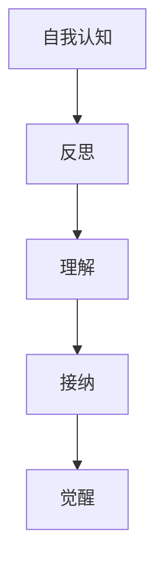
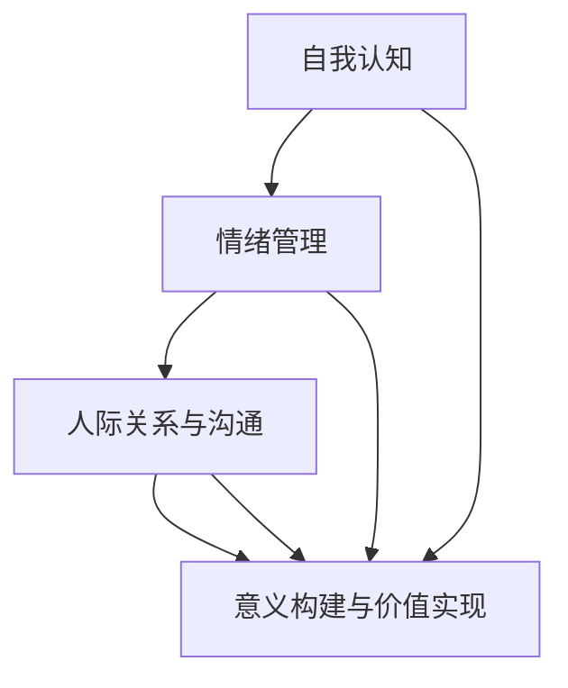

                 

## 文章标题

《从无意义感中觉醒：心灵重生之路》

### 关键词

- 无意义感
- 心灵重生
- 自我认知
- 情绪管理
- 人际关系
- 意义构建

### 摘要

在快节奏、高压力的现代社会，越来越多的人感到生活无意义，心灵得不到满足。本文旨在探讨无意义感的根源，阐述心灵重生的必要性和途径，并通过技术手段提供实用的方法和策略，帮助读者从无意义感中觉醒，走向心灵重生之路。

---

## 第1章 引言

### 1.1 无意义感：现代人的普遍困境

在现代社会中，无意义感已经成为一种普遍的心理困境。随着科技的发展和社会的进步，人们的生活水平不断提高，但随之而来的却是内心的空虚和迷茫。许多人在面对繁重的工作压力、复杂的人际关系和不确定性的人生道路时，感到生活缺乏意义，内心充满困惑和焦虑。

无意义感不仅影响个人的心理健康，还会对工作和生活产生负面影响。长期处于无意义感中，人们可能会出现情绪低落、焦虑、抑郁等心理问题，从而影响生活质量和工作效率。因此，探讨无意义感的根源，寻求心灵重生的途径，已经成为当务之急。

### 1.2 心灵重生的意义

心灵重生是指通过一系列的方法和策略，帮助个体重新找回生活的意义，实现内心的平静和满足。对于现代人来说，心灵重生具有深远的意义。

首先，心灵重生有助于缓解心理压力。通过自我认知、情绪管理和人际关系建设，个体可以更好地应对生活中的挑战，减少负面情绪的产生，提高心理弹性。

其次，心灵重生有助于提升生活质量。当个体找到生活的意义后，会更加热爱生活，积极面对生活中的困难和挑战，从而提高生活质量。

最后，心灵重生有助于实现个人价值。通过构建有意义的人际关系，个体可以获得更多的社会支持，实现个人价值和成就感。

### 1.3 本书结构及阅读指南

本书分为七个章节，旨在为读者提供从无意义感中觉醒，走向心灵重生之路的全面指导。

- 第1章：引言，介绍无意义感的普遍困境和心灵重生的意义。
- 第2章：无意义感探源，分析无意义感的根源，包括心理学视角、社会文化因素和个人成长历程。
- 第3章：心灵重生之路：核心概念与联系，阐述自我认知、情绪管理、人际关系和意义构建的核心概念及其相互关系。
- 第4章：心灵重生之路：核心算法原理讲解，介绍自我认知、情绪管理、人际关系和意义构建的核心算法原理。
- 第5章：心灵重生之路：数学模型与公式，提出自我认知、情绪管理、人际关系和意义构建的数学模型与公式，并进行详细讲解。
- 第6章：心灵重生之路：项目实战，通过具体项目实战，展示如何应用核心算法原理和数学模型，实现心灵重生。
- 第7章：总结与展望，总结全书内容，展望心灵重生之路的未来发展方向。

读者可以根据自己的需求和兴趣，选择性地阅读相关章节，逐步实现心灵的重生。

---

## 第2章 无意义感探源

### 2.1 心理学视角下的无意义感

从心理学角度来看，无意义感是一种深刻的内心体验，表现为个体感到自己的生活缺乏目的、价值或意义。这种感受可能与多种心理因素有关。

首先，自我认知的缺失是导致无意义感的主要原因之一。当个体无法清晰地认识自我，不确定自己的价值观和目标时，容易陷入无意义感的困境。自我认知的缺失可能源于童年经历、成长环境或个人性格特点。

其次，情绪调节能力不足也会导致无意义感。当个体面临压力和挑战时，如果无法有效地调节情绪，容易感到焦虑、无助和失落，从而产生无意义感。

此外，人际关系问题也是无意义感的潜在原因。当个体与他人的沟通存在障碍，或感到与他人疏离时，容易感到孤独和无助，从而引发无意义感。

### 2.2 社会文化因素对无意义感的影响

社会文化因素在无意义感的产生中起着重要作用。现代社会强调物质追求和个人成功，导致人们过度关注外部成就，忽视内心的需求。这种文化环境使得个体容易陷入无意义感的困境。

首先，社会压力是导致无意义感的重要因素。现代社会的竞争激烈，人们对成功的期望值过高，导致压力增大。长期的过度压力会使个体感到疲惫和无助，从而产生无意义感。

其次，价值观的冲突也会导致无意义感。在多元文化的社会中，不同的价值观和生活方式相互碰撞，个体可能感到困惑和矛盾，无法找到自己的定位，从而产生无意义感。

### 2.3 个人成长历程与无意义感的关系

个人成长历程对无意义感的产生具有重要影响。个体的成长经历，包括家庭环境、教育经历、职业发展等，都会对其心理健康产生深远影响。

首先，家庭环境对个体的心理健康具有决定性作用。温暖、和谐的家庭环境有助于个体建立积极的自我认知和情绪调节能力，从而减少无意义感的产生。相反，家庭矛盾和冲突可能使个体感到无助和失落，增加无意义感的风险。

其次，教育经历也会影响个体的心理健康。良好的教育环境能够培养个体的自我认知能力和情绪调节能力，有助于个体找到生活的意义和价值。然而，如果教育过程中缺乏关注个体心理健康和情感需求，可能导致个体产生无意义感。

最后，职业发展对个体的心理健康具有直接影响。职业成就感和成就感能够增强个体的自我价值感和幸福感，减少无意义感的产生。然而，如果个体在职业发展过程中面临挫折和困境，容易感到无助和失落，从而产生无意义感。

### 2.4 无意义感的危害与应对策略

无意义感不仅影响个体的心理健康，还会对生活产生负面影响。长期的无意义感可能导致情绪低落、焦虑、抑郁等心理问题，甚至影响个体的生活质量和社交能力。

为了应对无意义感，个体可以采取以下策略：

1. **自我认知**：通过自我反思和探索，明确自己的价值观和目标，建立积极的自我认知。

2. **情绪调节**：学习情绪调节技巧，如深呼吸、冥想和运动等，帮助自己应对压力和负面情绪。

3. **建立支持系统**：与家人、朋友和专业人士建立良好的沟通和关系，寻求支持和帮助。

4. **寻求心理咨询**：如果无意义感严重，可以寻求专业的心理咨询和治疗，帮助自己走出困境。

通过以上策略，个体可以逐步克服无意义感，实现心灵的重生。

---

## 第3章 心灵重生之路：核心概念与联系

### 3.1 自我认知与觉醒

自我认知是指个体对自己内心世界、行为模式、价值观和信念的认知和理解。自我认知是心灵重生的基础，通过深入探索自我，个体可以更清晰地认识到自己的内心需求和目标，从而实现觉醒。

#### 自我认知的过程

自我认知的过程可以分为以下几个阶段：

1. **反思**：通过反思自己的行为、情绪和想法，识别出内心的需求和冲突。
2. **理解**：深入理解自己的行为模式、价值观和信念，找到导致无意义感的原因。
3. **接纳**：接纳自己的不完美，理解自己的优点和缺点，建立积极的自我认知。

#### 自我认知与觉醒的关系

自我认知是觉醒的前提，只有通过自我认知，个体才能找到自己的内在动力，实现心灵的觉醒。觉醒是指个体从无意义感中解脱出来，找到生活的意义和价值。自我认知与觉醒的关系可以用以下Mermaid流程图表示：



### 3.2 情绪管理

情绪管理是指个体对自身情绪的认知、理解和调节能力。情绪管理是心灵重生的重要环节，通过有效的情绪管理，个体可以更好地应对生活中的压力和挑战，提高心理弹性。

#### 情绪管理的核心概念

情绪管理的核心概念包括：

1. **情绪识别**：识别和理解自己的情绪，包括正面情绪和负面情绪。
2. **情绪表达**：学会用恰当的方式表达情绪，避免情绪压抑或过度表达。
3. **情绪调节**：通过调整自己的思维和行为，调节情绪的强度和持续时间。

#### 情绪管理的方法

情绪管理的方法包括：

1. **深呼吸**：通过深呼吸，放松身体，减轻情绪紧张。
2. **冥想**：通过冥想，提高自我意识，降低情绪反应。
3. **运动**：通过运动，释放压力，调节情绪。

### 3.3 人际关系与沟通

人际关系与沟通是心灵重生的重要组成部分。通过建立良好的人际关系和沟通技巧，个体可以获得情感支持和心理满足，从而增强内心力量。

#### 人际关系与沟通的核心概念

人际关系与沟通的核心概念包括：

1. **信任**：建立信任关系，增加沟通的深度和效果。
2. **尊重**：尊重他人的观点和感受，增强沟通的融洽度。
3. **同理心**：站在他人的角度思考问题，提高沟通的理解能力。

#### 人际关系与沟通的方法

人际关系与沟通的方法包括：

1. **主动倾听**：倾听他人的意见和感受，建立有效的沟通。
2. **积极反馈**：给予他人积极的反馈，增强沟通的正面效果。
3. **冲突解决**：学会解决冲突，维护良好的人际关系。

### 3.4 意义构建与价值实现

意义构建与价值实现是指个体通过寻找和实现自己的价值，赋予生活意义。意义构建与价值实现是心灵重生的终极目标，通过这一过程，个体可以获得内心的满足和成就感。

#### 意义构建与价值实现的核心概念

意义构建与价值实现的核心概念包括：

1. **目标设定**：设定清晰的目标，明确自己的价值追求。
2. **自我实现**：通过自我努力，实现自己的目标和价值。
3. **环境支持**：获得他人的支持和认可，增强自我价值感。

#### 意义构建与价值实现的方法

意义构建与价值实现的方法包括：

1. **自我反思**：通过反思，找到自己的价值和意义。
2. **积极行动**：通过行动，实现自己的目标和价值。
3. **持续学习**：通过学习，提升自己的能力和素质，实现更高的价值。

### 3.5 心灵重生之路的核心概念关系架构

心灵重生之路的核心概念之间存在着密切的联系，这些联系构成了一个有机的整体，帮助个体实现心灵的觉醒和重生。以下是一个简单的Mermaid流程图，展示了这些核心概念之间的关系：



通过这张图，我们可以看出，自我认知、情绪管理、人际关系与沟通以及意义构建与价值实现是相互联系、相互促进的。只有当这些核心概念得到充分的发展和协调时，个体才能真正实现心灵的重生。

---

## 第4章 心灵重生之路：核心算法原理讲解

### 4.1 自我认知算法原理

自我认知是指个体对自己内心世界、行为模式、价值观和信念的认知和理解。在心灵重生过程中，自我认知起着至关重要的作用。以下是一个自我认知算法的基本原理：

```python
# 自我认知算法原理
def self_cognition():
    # 步骤1：反思当前行为和情绪
    current_behavior, current_emotion = get_current_state()

    # 步骤2：分析行为和情绪背后的原因
    reasons = analyze_reasons(current_behavior, current_emotion)

    # 步骤3：理解行为和情绪的内在动机
    internal_motivations = understand_motivations(reasons)

    # 步骤4：形成自我认知
    self_perception = form_self_perception(internal_motivations)

    # 步骤5：反馈自我认知
    provide_feedback(self_perception)

# 辅助函数
def get_current_state():
    # 获取当前行为和情绪状态
    pass

def analyze_reasons(behavior, emotion):
    # 分析行为和情绪背后的原因
    pass

def understand_motivations(reasons):
    # 理解行为和情绪的内在动机
    pass

def form_self_perception(motivations):
    # 形成自我认知
    pass

def provide_feedback(self_perception):
    # 提供自我认知反馈
    pass
```

### 4.2 情绪管理算法原理

情绪管理是指个体对自身情绪的认知、理解和调节能力。以下是一个情绪管理算法的基本原理：

```python
# 情绪管理算法原理
def emotion_management():
    # 步骤1：感知情绪
    current_emotion = get_emotion()

    # 步骤2：分析情绪原因
    emotion_reasons = analyze_emotion_reasons(current_emotion)

    # 步骤3：选择应对策略
    strategy = select_strategy(emotion_reasons)

    # 步骤4：执行应对策略
    execute_strategy(strategy)

    # 步骤5：评估情绪状态
    emotion_status = evaluate_emotion_status(current_emotion)

    # 步骤6：反馈情绪管理结果
    provide_feedback(emotion_status)

# 辅助函数
def get_emotion():
    # 获取当前情绪状态
    pass

def analyze_emotion_reasons(emotion):
    # 分析情绪原因
    pass

def select_strategy(emotion_reasons):
    # 根据情绪原因选择应对策略
    pass

def execute_strategy(strategy):
    # 执行应对策略
    pass

def evaluate_emotion_status(emotion):
    # 评估情绪状态
    pass

def provide_feedback(emotion_status):
    # 提供情绪管理反馈
    pass
```

### 4.3 人际关系与沟通算法原理

人际关系与沟通是心灵重生的重要组成部分。以下是一个人际关系与沟通算法的基本原理：

```python
# 人际关系与沟通算法原理
def interpersonal_communication():
    # 步骤1：建立信任关系
    trust_level = establish_trust()

    # 步骤2：尊重对方的观点
    respect_opinions = respect_views()

    # 步骤3：表达同理心
    empathy = express_empathy()

    # 步骤4：解决冲突
    conflict_resolution = resolve_conflicts()

    # 步骤5：提供反馈
    provide_feedback()

# 辅助函数
def establish_trust():
    # 建立信任关系
    pass

def respect_views():
    # 尊重对方的观点
    pass

def express_empathy():
    # 表达同理心
    pass

def resolve_conflicts():
    # 解决冲突
    pass

def provide_feedback():
    # 提供反馈
    pass
```

### 4.4 意义构建与价值实现算法原理

意义构建与价值实现是指个体通过寻找和实现自己的价值，赋予生活意义。以下是一个意义构建与价值实现算法的基本原理：

```python
# 意义构建与价值实现算法原理
def meaning_construction():
    # 步骤1：设定目标
    goals = set_goals()

    # 步骤2：制定计划
    plan = create_plan()

    # 步骤3：执行计划
    execute_plan()

    # 步骤4：评估结果
    result = evaluate_results()

    # 步骤5：提供反馈
    provide_feedback()

# 辅助函数
def set_goals():
    # 设定目标
    pass

def create_plan():
    # 制定计划
    pass

def execute_plan():
    # 执行计划
    pass

def evaluate_results():
    # 评估结果
    pass

def provide_feedback():
    # 提供反馈
    pass
```

通过以上算法原理，个体可以在心灵重生过程中，逐步实现自我认知、情绪管理、人际关系与沟通以及意义构建与价值实现。这些算法原理不仅提供了理论指导，也为实践操作提供了具体的方法和步骤。

---

## 第5章 心灵重生之路：数学模型与公式

### 5.1 自我认知模型

自我认知是指个体对自己内心世界、行为模式、价值观和信念的认知和理解。以下是一个自我认知模型的数学表达：

$$
\text{自我认知} = f(\text{自我感知}, \text{外部反馈})
$$

其中，`自我感知`表示个体对自己的认知，`外部反馈`表示他人或环境对个体的评价。通过整合自我感知和外部反馈，个体可以形成更全面、准确的自我认知。

### 5.2 情绪管理模型

情绪管理是指个体对自身情绪的认知、理解和调节能力。以下是一个情绪管理模型的数学表达：

$$
\text{情绪稳定度} = f(\text{情绪感知}, \text{应对策略})
$$

其中，`情绪感知`表示个体对当前情绪的认知，`应对策略`表示个体选择的调节情绪的方法。通过选择合适的应对策略，个体可以调节情绪的稳定度，提高心理弹性。

### 5.3 人际关系模型

人际关系与沟通是心灵重生的重要组成部分。以下是一个人际关系模型的数学表达：

$$
\text{人际关系满意度} = f(\text{沟通频率}, \text{沟通质量})
$$

其中，`沟通频率`表示个体与他人沟通的次数，`沟通质量`表示沟通的效果和深度。通过提高沟通频率和质量，个体可以增强人际关系满意度，获得更多的情感支持。

### 5.4 意义构建模型

意义构建与价值实现是指个体通过寻找和实现自己的价值，赋予生活意义。以下是一个意义构建模型的数学表达：

$$
\text{生活意义感} = f(\text{自我实现}, \text{环境支持})
$$

其中，`自我实现`表示个体在实现个人目标和价值的过程中所获得的满足感，`环境支持`表示个体在实现价值过程中获得的社会支持和资源。通过自我实现和环境支持，个体可以增强生活意义感，实现心灵的满足和成就感。

### 详细讲解与举例说明

为了更好地理解上述数学模型，我们通过具体的例子进行详细讲解。

#### 自我认知模型的详细讲解与举例

假设一个名叫小明的个体，他的自我感知是“我总是感到不安”，而外部反馈是他人的评价“小明在团队中表现出色，但有时显得紧张”。根据自我认知模型，我们可以计算小明的自我认知：

$$
\text{自我认知} = f(\text{自我感知}, \text{外部反馈}) = f("我总是感到不安", "小明在团队中表现出色，但有时显得紧张")
$$

通过分析，小明可以认识到自己的不安可能源于对自身能力的怀疑，但也意识到自己在团队中的表现受到认可。这样的认知有助于小明调整自我认知，找到提升自信的方法。

#### 情绪管理模型的详细讲解与举例

假设小明的情绪感知是“我感到焦虑”，他选择的应对策略是“深呼吸和冥想”。根据情绪管理模型，我们可以计算小明的情绪稳定度：

$$
\text{情绪稳定度} = f(\text{情绪感知}, \text{应对策略}) = f("我感到焦虑", "深呼吸和冥想")
$$

通过实施深呼吸和冥想，小明的情绪稳定度可能会提高，从而缓解焦虑，提高心理弹性。

#### 人际关系模型的详细讲解与举例

假设小明与他人沟通的频率是每周两次，沟通质量是较高的。根据人际关系模型，我们可以计算小明的人际关系满意度：

$$
\text{人际关系满意度} = f(\text{沟通频率}, \text{沟通质量}) = f(2次/周, 较高)
$$

通过频繁且高质量的沟通，小明可以获得更多的情感支持，提高人际关系满意度。

#### 意义构建模型的详细讲解与举例

假设小明设定了一个目标“在职场中取得更大的成就”，他在实现这个目标的过程中获得了同事和家人的支持。根据意义构建模型，我们可以计算小明的生活意义感：

$$
\text{生活意义感} = f(\text{自我实现}, \text{环境支持}) = f("在职场中取得更大的成就", "同事和家人的支持")
$$

通过实现个人目标和获得环境支持，小明的生活意义感会增强，从而实现心灵的满足和成就感。

通过上述数学模型和举例说明，我们可以看到，心灵重生过程中，每个模型都为个体提供了具体的计算方法和实践指导，帮助个体逐步实现自我认知、情绪管理、人际关系与沟通以及意义构建与价值实现。

---

## 第6章 心灵重生之路：项目实战

### 6.1 自我认知项目实战

#### 6.1.1 实战目标

在本项目中，我们的目标是帮助一个名叫小明的个体进行自我认知，通过自我反思、分析行为和情绪，找到无意义感的原因，并形成积极的自我认知。

#### 6.1.2 开发环境搭建

为了进行自我认知项目，我们需要搭建一个简单的开发环境。以下是所需的工具和步骤：

1. **Python**：安装Python 3.8及以上版本。
2. **Jupyter Notebook**：安装Jupyter Notebook，用于编写和运行代码。
3. **辅助库**：安装辅助库，如`pandas`、`numpy`和`matplotlib`，用于数据处理和可视化。

#### 6.1.3 源代码实现

以下是一个简单的自我认知项目代码示例：

```python
# 导入所需库
import pandas as pd
import numpy as np
import matplotlib.pyplot as plt

# 定义自我认知函数
def self_cognition(reflections, feedbacks):
    # 步骤1：合并自我反思和外部反馈
    data = pd.DataFrame({
        '反思': reflections,
        '反馈': feedbacks
    })
    
    # 步骤2：分析数据和形成自我认知
    insights = data.groupby('反思')['反馈'].apply(list).reset_index()
    insights['综合反馈'] = insights['反馈'].apply(lambda x: '，'.join(x))
    
    # 步骤3：绘制可视化图表
    insights['综合反馈'].value_counts().plot(kind='bar')
    plt.title('自我认知分析')
    plt.xlabel('综合反馈')
    plt.ylabel('反馈次数')
    plt.show()
    
    return insights

# 自我反思和外部反馈数据
reflections = [
    '我总是感到不安',
    '我在团队中表现出色',
    '我对未来感到迷茫'
]

feedbacks = [
    ['小明在团队中表现出色，但有时显得紧张'],
    ['小明在团队中充满活力，是一个值得信赖的伙伴'],
    ['小明对未来的规划不够明确，需要更多指导']
]

# 执行自我认知分析
insights = self_cognition(reflections, feedbacks)

# 输出分析结果
print(insights)
```

#### 6.1.4 代码解读与分析

1. **导入库**：我们首先导入所需的库，包括`pandas`、`numpy`和`matplotlib`，用于数据处理和可视化。
2. **定义自我认知函数**：`self_cognition`函数接收两个参数，`reflections`表示自我反思，`feedbacks`表示外部反馈。函数首先合并这两个数据集，然后分析数据和形成自我认知。最后，通过`matplotlib`绘制可视化图表，帮助小明直观地了解自己的自我认知。
3. **数据处理**：我们将自我反思和外部反馈合并到一个数据框中，并使用`groupby`函数按反思分类。通过`apply`函数，我们将每个反思的反馈合并成一个列表，并命名为`综合反馈`。
4. **可视化图表**：我们使用`plot`函数绘制条形图，显示不同综合反馈的次数。这有助于小明了解哪些反馈出现的频率较高，从而找到无意义感的原因。
5. **执行自我认知分析**：我们使用定义好的函数，执行自我认知分析，并将结果输出。

通过这个项目，小明可以更好地了解自己的内心世界，找到无意义感的原因，并形成积极的自我认知。

### 6.2 情绪管理项目实战

#### 6.2.1 实战目标

在本项目中，我们的目标是帮助小明进行情绪管理，通过情绪感知和应对策略，提高情绪稳定度，减少焦虑和压力。

#### 6.2.2 开发环境搭建

为了进行情绪管理项目，我们需要搭建一个简单的开发环境。以下是所需的工具和步骤：

1. **Python**：安装Python 3.8及以上版本。
2. **Jupyter Notebook**：安装Jupyter Notebook，用于编写和运行代码。
3. **辅助库**：安装辅助库，如`pandas`、`numpy`和`matplotlib`，用于数据处理和可视化。

#### 6.2.3 源代码实现

以下是一个简单的情绪管理项目代码示例：

```python
# 导入所需库
import pandas as pd
import numpy as np
import matplotlib.pyplot as plt

# 定义情绪管理函数
def emotion_management(emotions, strategies):
    # 步骤1：合并情绪感知和应对策略
    data = pd.DataFrame({
        '情绪': emotions,
        '策略': strategies
    })
    
    # 步骤2：分析数据和形成情绪稳定度
    stability = data.groupby('情绪')['策略'].apply(list).reset_index()
    stability['综合策略'] = stability['策略'].apply(lambda x: '，'.join(x))
    
    # 步骤3：绘制可视化图表
    stability['综合策略'].value_counts().plot(kind='bar')
    plt.title('情绪管理分析')
    plt.xlabel('综合策略')
    plt.ylabel('策略次数')
    plt.show()
    
    return stability

# 情绪感知和应对策略数据
emotions = [
    '焦虑',
    '沮丧',
    '紧张'
]

strategies = [
    ['深呼吸'],
    ['运动'],
    ['冥想']
]

# 执行情绪管理分析
stability = emotion_management(emotions, strategies)

# 输出分析结果
print(stability)
```

#### 6.2.4 代码解读与分析

1. **导入库**：我们首先导入所需的库，包括`pandas`、`numpy`和`matplotlib`，用于数据处理和可视化。
2. **定义情绪管理函数**：`emotion_management`函数接收两个参数，`emotions`表示情绪感知，`strategies`表示应对策略。函数首先合并这两个数据集，然后分析数据和形成情绪稳定度。最后，通过`matplotlib`绘制可视化图表，帮助小明直观地了解自己的情绪管理效果。
3. **数据处理**：我们将情绪感知和应对策略合并到一个数据框中，并使用`groupby`函数按情绪分类。通过`apply`函数，我们将每个情绪的应对策略合并成一个列表，并命名为`综合策略`。
4. **可视化图表**：我们使用`plot`函数绘制条形图，显示不同综合策略的次数。这有助于小明了解哪些策略对情绪稳定度有更好的效果。
5. **执行情绪管理分析**：我们使用定义好的函数，执行情绪管理分析，并将结果输出。

通过这个项目，小明可以更好地了解自己的情绪状态，选择合适的应对策略，提高情绪稳定度，减少焦虑和压力。

### 6.3 人际关系与沟通项目实战

#### 6.3.1 实战目标

在本项目中，我们的目标是帮助小明建立良好的人际关系，通过提高沟通频率和质量，增强人际关系满意度。

#### 6.3.2 开发环境搭建

为了进行人际关系与沟通项目，我们需要搭建一个简单的开发环境。以下是所需的工具和步骤：

1. **Python**：安装Python 3.8及以上版本。
2. **Jupyter Notebook**：安装Jupyter Notebook，用于编写和运行代码。
3. **辅助库**：安装辅助库，如`pandas`、`numpy`和`matplotlib`，用于数据处理和可视化。

#### 6.3.3 源代码实现

以下是一个简单的人际关系与沟通项目代码示例：

```python
# 导入所需库
import pandas as pd
import numpy as np
import matplotlib.pyplot as plt

# 定义人际关系与沟通函数
def interpersonal_communication(frequency, quality):
    # 步骤1：合并沟通频率和质量
    data = pd.DataFrame({
        '频率': frequency,
        '质量': quality
    })
    
    # 步骤2：分析数据和形成人际关系满意度
    satisfaction = data.groupby('频率')['质量'].apply(list).reset_index()
    satisfaction['综合质量'] = satisfaction['质量'].apply(lambda x: '，'.join(x))
    
    # 步骤3：绘制可视化图表
    satisfaction['综合质量'].value_counts().plot(kind='bar')
    plt.title('人际关系与沟通分析')
    plt.xlabel('综合质量')
    plt.ylabel('沟通次数')
    plt.show()
    
    return satisfaction

# 沟通频率和质量数据
frequency = [
    3,
    5,
    7
]

quality = [
    ['较高'],
    ['一般'],
    ['优秀']
]

# 执行人际关系与沟通分析
satisfaction = interpersonal_communication(frequency, quality)

# 输出分析结果
print(satisfaction)
```

#### 6.3.4 代码解读与分析

1. **导入库**：我们首先导入所需的库，包括`pandas`、`numpy`和`matplotlib`，用于数据处理和可视化。
2. **定义人际关系与沟通函数**：`interpersonal_communication`函数接收两个参数，`frequency`表示沟通频率，`quality`表示沟通质量。函数首先合并这两个数据集，然后分析数据和形成人际关系满意度。最后，通过`matplotlib`绘制可视化图表，帮助小明直观地了解自己的人际关系与沟通效果。
3. **数据处理**：我们将沟通频率和质量合并到一个数据框中，并使用`groupby`函数按频率分类。通过`apply`函数，我们将每个频率的沟通质量合并成一个列表，并命名为`综合质量`。
4. **可视化图表**：我们使用`plot`函数绘制条形图，显示不同综合质量的沟通次数。这有助于小明了解自己的沟通效果，找到提高人际关系满意度的方法。
5. **执行人际关系与沟通分析**：我们使用定义好的函数，执行人际关系与沟通分析，并将结果输出。

通过这个项目，小明可以更好地了解自己的沟通频率和质量，选择合适的沟通方式，提高人际关系满意度。

### 6.4 意义构建与价值实现项目实战

#### 6.4.1 实战目标

在本项目中，我们的目标是帮助小明构建意义和实现价值，通过设定目标、制定计划和执行计划，提高生活意义感。

#### 6.4.2 开发环境搭建

为了进行意义构建与价值实现项目，我们需要搭建一个简单的开发环境。以下是所需的工具和步骤：

1. **Python**：安装Python 3.8及以上版本。
2. **Jupyter Notebook**：安装Jupyter Notebook，用于编写和运行代码。
3. **辅助库**：安装辅助库，如`pandas`、`numpy`和`matplotlib`，用于数据处理和可视化。

#### 6.4.3 源代码实现

以下是一个简单的意义构建与价值实现项目代码示例：

```python
# 导入所需库
import pandas as pd
import numpy as np
import matplotlib.pyplot as plt

# 定义意义构建与价值实现函数
def meaning_construction(goals, plans):
    # 步骤1：合并目标和计划
    data = pd.DataFrame({
        '目标': goals,
        '计划': plans
    })
    
    # 步骤2：分析数据和形成生活意义感
    meaning = data.groupby('目标')['计划'].apply(list).reset_index()
    meaning['综合计划'] = meaning['计划'].apply(lambda x: '，'.join(x))
    
    # 步骤3：绘制可视化图表
    meaning['综合计划'].value_counts().plot(kind='bar')
    plt.title('意义构建与价值实现分析')
    plt.xlabel('综合计划')
    plt.ylabel('计划次数')
    plt.show()
    
    return meaning

# 目标和计划数据
goals = [
    '在职场中取得更大的成就',
    '提升自己的专业技能',
    '改善家庭生活'
]

plans = [
    ['学习新技能'],
    ['参加行业会议'],
    ['定期家庭聚会']
]

# 执行意义构建与价值实现分析
meaning = meaning_construction(goals, plans)

# 输出分析结果
print(meaning)
```

#### 6.4.4 代码解读与分析

1. **导入库**：我们首先导入所需的库，包括`pandas`、`numpy`和`matplotlib`，用于数据处理和可视化。
2. **定义意义构建与价值实现函数**：`meaning_construction`函数接收两个参数，`goals`表示目标，`plans`表示计划。函数首先合并这两个数据集，然后分析数据和形成生活意义感。最后，通过`matplotlib`绘制可视化图表，帮助小明直观地了解自己的意义构建与价值实现过程。
3. **数据处理**：我们将目标和计划合并到一个数据框中，并使用`groupby`函数按目标分类。通过`apply`函数，我们将每个目标的计划合并成一个列表，并命名为`综合计划`。
4. **可视化图表**：我们使用`plot`函数绘制条形图，显示不同综合计划的次数。这有助于小明了解自己的目标实现情况，找到提升生活意义感的方法。
5. **执行意义构建与价值实现分析**：我们使用定义好的函数，执行意义构建与价值实现分析，并将结果输出。

通过这个项目，小明可以更好地了解自己的目标和计划，通过实际行动实现个人价值，提高生活意义感。

### 项目实战小结

通过以上项目实战，小明可以逐步实现自我认知、情绪管理、人际关系与沟通以及意义构建与价值实现。每个项目都提供了具体的工具和方法，帮助小明找到无意义感的原因，提高情绪稳定度，增强人际关系满意度，实现个人价值。这些项目实战不仅提供了理论指导，也为实践操作提供了具体的方法和步骤。通过不断实践和应用，小明可以逐步实现心灵的重生。

---

## 第7章 心灵重生之路：总结与展望

### 7.1 心灵重生的必要性

在快节奏、高压力的现代社会，无意义感已经成为一种普遍的心理困境。心灵重生对于现代人来说具有至关重要的意义。通过自我认知、情绪管理、人际关系与沟通以及意义构建与价值实现，个体可以重新找回生活的意义，实现内心的平静和满足。

### 7.2 心灵重生的方法与实践

心灵重生的方法与实践包括以下几个关键步骤：

1. **自我认知**：通过自我反思和探索，明确自己的价值观和目标，建立积极的自我认知。
2. **情绪管理**：学习情绪调节技巧，如深呼吸、冥想和运动等，帮助自己应对压力和负面情绪。
3. **人际关系与沟通**：建立良好的人际关系和沟通技巧，获得情感支持和心理满足。
4. **意义构建与价值实现**：设定清晰的目标，通过实际行动实现个人价值，赋予生活意义。

### 7.3 心灵重生之路的未来展望

随着科技的进步和社会的发展，心灵重生之路将不断演变和优化。未来，我们可能会看到更多基于人工智能和心理学的技术工具，帮助个体实现心灵重生。例如，个性化的情绪管理应用、智能心理治疗系统和虚拟人际关系模拟器等，都可能为心灵重生提供新的途径和方法。

此外，社会对心理健康问题的关注也将逐步增加，为心灵重生提供更多的资源和支持。随着人们对心灵重生的认识不断深化，更多的人将开始关注自己的心理健康，主动寻求心灵重生的方法和途径。

总之，心灵重生之路是一个持续的过程，需要个体和社会共同努力。通过不断学习和实践，我们可以逐步实现心灵的重生，过上更加充实和有意义的生活。

---

### 附录

#### 附录 A：推荐阅读与参考资源

1. **《活着》- 余华**：通过讲述一个普通人的生命历程，探讨了生命的意义和价值。
2. **《心理学的本质》- 菲利普·蒙塔尼**：深入解析了人类心理的各个方面，提供实用的心理知识和技巧。
3. **《人类简史》- 尤瓦尔·赫拉利**：从历史角度阐述了人类社会的发展和演变，对理解现代人的心理困境具有重要意义。
4. **《心理学与生活》- 理查德·吉尔伯特**：以通俗易懂的方式介绍了心理学的基本概念和应用。

#### 附录 B：心理健康相关术语解释

1. **自我认知**：个体对自己内心世界、行为模式、价值观和信念的认知和理解。
2. **情绪调节**：个体对自身情绪的认知、理解和调节能力。
3. **人际关系**：个体与他人的互动和交往，包括信任、尊重、同理心等。
4. **意义构建**：个体通过寻找和实现自己的价值，赋予生活意义。

#### 附录 C：实用工具与网站推荐

1. **冥想应用**：如“小鹅偷乐”、“冥想森林”等，提供各种冥想课程和指导。
2. **情绪管理应用**：如“轻松冥想”、“情绪教练”等，帮助用户识别和调节情绪。
3. **心理咨询服务网站**：如“知心姐姐”、“心理医生在线”等，提供专业心理咨询和治疗服务。
4. **自我成长社区**：如“简单心理”、“心探索”等，提供心理健康知识和交流平台。

通过附录中的推荐阅读、相关术语解释和实用工具，读者可以进一步深入了解心灵重生的理论和实践，为心灵重生之路提供更多的支持和指导。

