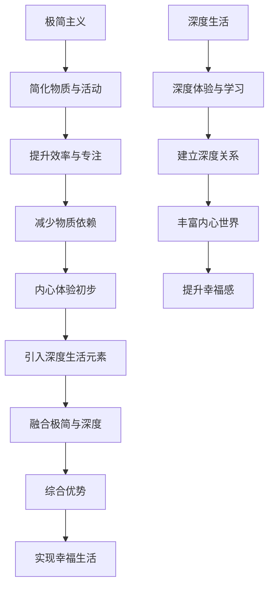

                 

### 文章标题

# 从极简主义到深度生活：追求真正的生活品质

### 关键词

- 极简主义
- 深度生活
- 生活品质
- 心理健康
- 社会文化
- 工作与生活平衡

### 摘要

本文探讨了从极简主义向深度生活的转变，以及这种转变如何帮助我们追求真正的生活品质。极简主义通过去除非必要的物品和活动来追求简单和自由，而深度生活则更注重内心体验和深度关系的建立。本文将通过心理学、社会学和实际应用的视角，深入分析这种转变的必要性和可行性，并提供具体的实践方法和建议，帮助读者实现更深层次的生活满足和幸福感。

## 引言：深度生活的旅程

### 1. 背景介绍

随着社会的快速发展，人们的生活节奏变得越来越快，物质条件得到了极大的改善，但与此同时，心理健康问题和社会关系问题却日益突出。极简主义作为一种应对现代生活压力的哲学和生活方式，近年来在全球范围内受到了广泛的关注。然而，随着时间的推移，人们逐渐意识到，极简主义虽然能够帮助我们简化生活，减少物质负担，但在追求内心满足和深度关系方面仍存在一定的局限性。

### 2. 深度生活的定义

深度生活（Deep Living）是一种更加全面和深入的哲学和生活态度，它不仅关注物质层面的简化，更注重精神层面的丰富和内心体验的深度。深度生活主张通过建立深度关系、培养内心智慧和提升生活品质，来追求真正的幸福和满足。

### 3. 从极简主义到深度生活的转变

极简主义和深度生活虽然都强调简化和内在价值的追求，但它们的侧重点和实现方式有所不同。极简主义更多关注物质层面的削减，通过减少不必要的物品和活动，减少生活压力；而深度生活则更注重精神层面的提升，通过深度体验和关系建立，实现内心的丰富和满足。

### 4. 转变的必要性和可行性

随着社会的发展，人们对生活品质的要求越来越高，不仅追求物质上的富足，更渴望精神上的满足。因此，从极简主义到深度生活的转变，不仅是一种生活哲学的演进，更是一种应对现代社会挑战的必然选择。同时，随着科技的进步和人们对内心需求的认知加深，深度生活也具备了可行性。

### 结论

本文旨在通过深入探讨极简主义和深度生活的本质和关系，帮助读者理解从极简主义到深度生活的转变，并提供具体的实践方法和建议，以实现更深层次的生活满足和幸福感。

## 1. 极简主义的崛起

### 1.1 极简主义的核心原则

极简主义（Minimalism）起源于20世纪80年代的美国，由大卫·巴赫和杰里米·吉伦等人倡导。其核心原则是通过去除非必要的物品和活动，简化生活，从而获得更多的自由和专注。极简主义强调以下几点：

- **去除冗余**：通过减少物品和活动，去除生活中的冗余，提高生活质量。
- **专注重要事务**：将精力集中在重要的事情上，提高效率和成就感。
- **减少物质依赖**：通过简化物质生活，减少对物质的依赖，从而获得更多的精神自由。
- **追求内心平静**：通过减少外界干扰，追求内心的平静和满足。

### 1.2 极简主义的吸引力与挑战

极简主义在全球范围内得到了广泛的关注和认可，其吸引力主要体现在以下几个方面：

- **提升生活质量**：通过去除冗余，减少不必要的物品和活动，使生活更加简洁和有序。
- **增强专注力**：减少外界干扰，将精力集中在重要的事情上，提高专注力和工作效率。
- **减少物质负担**：减少对物质的依赖，减轻经济负担，使生活更加轻松。
- **追求内心满足**：通过减少物质追求，追求内心的平静和满足，提高幸福感。

然而，极简主义也存在一些挑战和局限性：

- **适应性问题**：对于习惯了物质丰富和生活忙碌的人来说，适应极简主义生活方式可能需要一段时间。
- **过度追求简化**：在某些情况下，过分追求简化可能导致生活质量的下降，甚至影响心理健康。
- **心理适应问题**：对于长期依赖物质生活的人来说，放弃某些物品和活动可能会带来一定的心理困扰。

### 1.3 极简主义的实践意义

极简主义作为一种生活哲学，具有重要的实践意义：

- **提高工作效率**：通过去除冗余，减少不必要的物品和活动，提高工作和学习效率。
- **促进心理健康**：减少物质依赖，减轻心理压力，提高心理健康水平。
- **优化生活品质**：通过简化生活，使生活更加有序和高效，从而提升生活品质。
- **实现内心满足**：通过追求内心的平静和满足，提高生活幸福感。

总之，极简主义为我们提供了一种应对现代社会挑战的生活哲学和方式，其核心原则和实践方法对于提升生活质量、促进心理健康和实现内心满足具有重要的指导意义。然而，我们也需要认识到其局限性，并结合自身实际情况，灵活运用极简主义的理念和方法。

## 2. 深度生活的进化

### 2.1 深度生活的定义

深度生活（Deep Living）是一种更加全面和深入的哲学和生活态度，它不仅关注物质层面的简化，更注重精神层面的丰富和内心体验的深度。与极简主义相比，深度生活更强调内心体验和深度关系的建立。

深度生活可以理解为一种“活在当下”的生活方式，它主张通过深度体验、深度学习和深度关系，来实现内心的丰富和满足。深度生活认为，真正的幸福和满足不仅仅来自于物质的丰富，更来自于内心的平静、智慧的积累和人际关系的深度。

### 2.2 核心价值观

深度生活的核心价值观包括以下几个方面：

- **内心体验**：重视内心的体验和感受，追求真实的自我和内心的满足。
- **深度学习**：通过持续学习和探索，不断提升自己的知识和智慧。
- **深度关系**：建立和维护深度的人际关系，实现心灵的交流和共鸣。
- **生活品质**：注重生活品质的提升，追求健康、和谐、有意义的生活方式。

### 2.3 对个人和职业生活的影响

深度生活在个人和职业生活中都有着深远的影响：

- **个人层面**：通过深度生活，人们可以更好地理解自己，找到内心的平衡，实现自我成长。在个人生活中，深度生活有助于建立深度的人际关系，增强情感的深度和丰富性，提高生活满意度。
- **职业层面**：在职业生活中，深度生活鼓励人们专注于重要的工作任务，提升工作效率和专业能力。同时，深度生活也促使人们反思工作的意义和价值，实现职业满足和个人价值的统一。

### 2.4 深度生活的优势

深度生活具有以下几个方面的优势：

- **心理健康**：通过深度体验和深度关系，深度生活有助于减轻心理压力，提高心理健康水平。
- **生活满意度**：深度生活使人们更加关注内心的感受和体验，从而提高生活满意度。
- **工作效率**：深度生活鼓励人们专注于重要任务，提高工作效率和成就感。
- **人际交往**：深度生活有助于建立深度的人际关系，增强情感的深度和丰富性。

### 2.5 深度生活的挑战

尽管深度生活具有许多优势，但在实际生活中，人们也面临一些挑战：

- **适应期**：从极简主义转向深度生活需要一定的适应期，尤其是对于习惯了物质丰富的人来说。
- **时间管理**：深度生活要求人们投入更多时间在内心体验和深度关系上，这对时间管理提出了更高的要求。
- **社会压力**：在以物质追求为主导的社会环境中，深度生活可能会受到一定的社会压力和质疑。

### 2.6 深度生活的实践意义

深度生活的实践意义在于帮助人们实现更高层次的生活品质和幸福感。通过深度体验、深度学习和深度关系，人们可以在物质和精神层面都获得满足，实现内心的平静和智慧的成长。在个人层面，深度生活有助于提升心理健康和生活满意度；在职业层面，深度生活有助于提高工作效率和专业能力。总之，深度生活为我们提供了一种更加全面和深入的生活方式，有助于我们追求真正的幸福和满足。

## 2. 核心概念和原则：极简主义与深度生活

### 2.1 极简主义与深度生活的对比

极简主义和深度生活虽然在追求简化和内在价值方面有共同点，但它们的核心理念和实践方法有所不同。以下是二者的对比：

- **极简主义**：
  - **核心原则**：通过去除非必要的物品和活动，追求物质和时间的自由。
  - **实践方法**：减少物质依赖，简化生活，专注于重要事务。
  - **优势**：提高工作效率，减少物质负担，追求内心平静。
  - **挑战**：可能过于追求简化，影响生活质量，产生心理困扰。

- **深度生活**：
  - **核心原则**：通过深度体验、深度学习和深度关系，追求内心的丰富和满足。
  - **实践方法**：活在当下，专注于内心体验，建立深度的人际关系。
  - **优势**：提升心理健康，增强生活满意度，实现职业满足。
  - **挑战**：适应期较长，时间管理要求高，面临社会压力。

### 2.2 跨越极简主义的陷阱

虽然极简主义在简化生活和提高效率方面有其优势，但过度追求简化可能导致以下问题：

- **心理困扰**：过分追求简化可能导致内心不安和空虚。
- **生活质量下降**：简化生活可能使生活变得过于单调，缺乏乐趣。
- **忽视深度体验**：过于关注物质层面的简化，可能导致忽视内心体验和深度关系。

### 2.3 实现深度生活的路径

要实现从极简主义到深度生活的转变，可以遵循以下路径：

1. **反思极简主义的实践**：
   - 回顾自己在实践极简主义过程中的体会和感受。
   - 分析哪些做法是有效的，哪些需要改进。

2. **深入探索内心体验**：
   - 投入时间进行冥想、瑜伽或其他内心探索活动。
   - 关注自己的情绪变化，培养正念。

3. **建立深度人际关系**：
   - 花时间与家人、朋友进行深入的交流和互动。
   - 尝试与他人建立长期、稳定的合作关系。

4. **追求持续学习**：
   - 保持好奇心，不断学习和探索新知识。
   - 参与社区活动，扩展人际网络。

5. **实践深度生活的原则**：
   - 将深度生活的核心价值观融入日常生活。
   - 关注内心体验，减少物质依赖，提高生活质量。

### 2.4 融合极简主义与深度生活的优势

通过融合极简主义和深度生活的优势，我们可以实现更高的生活品质和幸福感：

- **简化生活**：去除非必要的物品和活动，使生活更加简洁和高效。
- **丰富内心**：通过深度体验和深度关系，使内心更加丰富和满足。
- **提升幸福感**：在物质和精神层面都获得满足，实现内心的平静和智慧的成长。

总之，极简主义和深度生活各有其独特的价值和优势。通过合理地结合二者，我们可以实现更全面和深入的生活体验，追求真正的幸福和满足。

## 2.5 极简主义与深度生活的流程图

为了更好地理解极简主义与深度生活的关系和实现路径，我们可以借助Mermaid流程图来直观地展示它们的核心概念和相互关系。

### 流程图：

### 流程图解读：

1. **极简主义**：
   - **简化物质与活动**：通过去除非必要的物品和活动，实现物质和时间的自由。
   - **提升效率与专注**：简化后的生活使人们能够更加专注于重要事务，提高工作效率。
   - **减少物质依赖**：减少对物质的追求，使人们能够更加关注内心体验。

2. **深度生活**：
   - **深度体验与学习**：通过深度体验和持续学习，不断丰富内心的世界。
   - **建立深度关系**：与他人建立长期、稳定的深度关系，实现心灵的交流和共鸣。
   - **丰富内心世界**：通过深度体验和深度关系，使内心世界更加丰富和满足。

3. **融合极简与深度**：
   - **内心体验初步**：在极简主义的基础上，引入深度生活的元素，开始关注内心体验。
   - **综合优势**：通过融合极简主义和深度生活的优势，实现更全面和深入的生活体验。

4. **实现幸福生活**：
   - **融合极简与深度**：将极简主义和深度生活的优势结合，使生活更加高效、内心更加丰富。
   - **提升幸福感**：在物质和精神层面都获得满足，实现内心的平静和智慧的成长。

通过这个Mermaid流程图，我们可以清晰地看到极简主义和深度生活之间的关系和实现路径。这个过程不仅是简单的简化，更是内心体验和深度关系的深入探索，旨在实现更高层次的生活品质和幸福感。

## 3. 深度生活的实践

### 3.1 简化你的环境

#### 3.1.1 评估你的 belongings

要开始实践深度生活，首先需要对自己的环境进行评估。这一步至关重要，因为它将帮助你明确哪些物品是真正必要的，哪些是可以去除的。以下是一些建议：

1. **分类整理**：
   - 将你的物品分为“必需品”、“可舍弃品”和“犹豫品”三个类别。
   - 对于每个类别，分别列出具体的物品清单。

2. **反思物品的功能和价值**：
   - 对于“必需品”，思考这些物品是否真正对你有实际用途。
   - 对于“可舍弃品”，考虑是否真的有必要保留这些物品。

3. **情绪评估**：
   - 每个物品都带有一定的情感价值。思考这些情感是否足够重要，以至于需要保留这些物品。

4. **设立标准**：
   - 设立一些简单的标准来决定哪些物品应该保留。例如，如果某个物品在过去一年中没有被使用过，那么它很可能可以舍弃。

#### 3.1.2 创建空间，让真正重要的事物出现

简化环境不仅仅是去除不需要的物品，更重要的是创造一个有利于深度生活的空间。以下是一些建议：

1. **减少视觉干扰**：
   - 清除多余的装饰和杂物，使环境更加简洁、清晰。
   - 保持空间的整齐和有序，减少视觉上的混乱。

2. **优化功能布局**：
   - 根据实际需求重新布局家具和设备，使空间更加实用。
   - 确保每个区域都有明确的功能，避免功能交叉导致的混乱。

3. **创造专注空间**：
   - 为工作和学习设立专门的区域，减少在工作时间和休息时间之间的干扰。
   - 在家中设置一个安静的冥想空间，用于放松和反思。

4. **使用多功能家具**：
   - 选择一些多功能家具，如可折叠桌椅，以节省空间，提高空间利用率。

通过以上步骤，你可以有效地简化你的环境，为深度生活创造一个基础。在这个过程中，重要的是持续反思和调整，以确保环境与你的生活需求保持一致。

### 3.2 培养内心智慧：冥想与正念

#### 3.2.1 内心智慧的重要性

在追求深度生活的过程中，内心智慧的培养至关重要。内心智慧不仅有助于我们更好地理解自己，还能提升我们的心理弹性、减少压力，并增强整体幸福感。以下是一些方法来培养内心智慧：

1. **冥想**：
   - **定义**：冥想是一种集中注意力、放松身心、提升内心意识的方法。
   - **好处**：冥想能够帮助减少焦虑、提高注意力、增强记忆力，并促进内心的平静。
   - **实践**：选择一个安静的环境，每天花15-30分钟进行冥想。可以尝试坐姿或躺姿，专注于呼吸，将注意力集中在当下。

2. **正念**：
   - **定义**：正念是一种活在当下的练习，意味着全然地感受和体验当前的经历，而不是沉浸在过去的回忆或未来的担忧中。
   - **好处**：正念有助于提升情绪调节能力、增强心理韧性，并改善身心健康。
   - **实践**：在日常活动中练习正念，如吃饭时专注于品尝食物的滋味，散步时专注于脚下的触感。还可以在繁忙的工作间隙进行短暂的正念练习，以缓解压力。

3. **反思与自省**：
   - **定义**：反思是对自己的行为、思维和情感进行深入的思考和分析。
   - **好处**：反思有助于我们认识到自己的行为模式、提升自我认知，从而做出更明智的决策。
   - **实践**：每天花一些时间进行反思，回顾一天的经历，思考哪些行为和决策是有效的，哪些需要改进。

通过冥想、正念和反思，我们可以培养内心智慧，更好地应对生活中的挑战，实现更深层次的生活满足和幸福感。

### 3.3 建立深度关系：提升人际沟通技巧

#### 3.3.1 深度关系的重要性

在追求深度生活的过程中，建立深度关系是不可或缺的一部分。深度关系不仅能够提供情感支持，还能帮助我们实现自我成长和提升生活质量。以下是一些提升人际沟通技巧的方法：

1. **倾听**：
   - **定义**：倾听不仅仅是听到对方说话，而是要理解对方的情感和需求。
   - **好处**：倾听能够增强人际信任、减少误解，并建立更深层次的连接。
   - **实践**：在与他人交流时，专注于对方的表达，避免打断，用心倾听对方的感受和需求。

2. **表达**：
   - **定义**：表达是指清晰、准确地传达自己的思想和情感。
   - **好处**：有效的表达能够增强沟通效果、减少误解，并建立相互理解和信任。
   - **实践**：在表达自己的观点时，尽量使用简单明了的语言，避免使用模糊不清的表述。

3. **同理心**：
   - **定义**：同理心是指从他人的角度理解他们的感受和经历。
   - **好处**：同理心能够增强人际关系的亲密度、减少冲突，并促进共同成长。
   - **实践**：在与他人交流时，尝试站在对方的角度思考问题，关注对方的情感需求。

4. **反馈**：
   - **定义**：反馈是指给予对方关于他们行为和沟通的具体意见和评价。
   - **好处**：适当的反馈能够帮助对方改进沟通技巧、增强合作关系。
   - **实践**：在提供反馈时，尽量使用积极的语言，指出具体的行为和效果，避免指责。

通过提升人际沟通技巧，我们可以建立更深度的人际关系，实现更高质量的生活。这些技巧不仅适用于个人生活，也能在职业和社交场合中发挥重要作用。

### 3.4 实践深度生活：个人经验分享

#### 3.4.1 个人实践深度生活的经历

作为一名长期关注生活方式和内心成长的个体，我在实践深度生活方面积累了一些经验。以下是我的一些具体经历：

1. **简化物品**：
   - 在我早期实践极简主义时，我首先从自己的物品开始。我清除了家中的许多杂物，只保留了真正必需和有意义的物品。这个过程虽然艰难，但也让我感受到了一种前所未有的轻松和自由。

2. **专注内心体验**：
   - 我开始每天花时间进行冥想和瑜伽练习，这使我能够更好地关注自己的内心体验。通过冥想，我学会了如何放松身心，减少焦虑和压力。

3. **建立深度关系**：
   - 我努力与家人和朋友保持深度沟通，通过倾听和表达，我们之间的关系变得更加紧密。我也开始尝试与他人建立长期的合作关系，这让我在职业和个人生活中都感受到了更多的满足感。

4. **持续学习**：
   - 我保持对知识的渴望，不断学习新技能和知识。这不仅丰富了我的内心世界，也提高了我在工作和生活中的适应能力。

#### 3.4.2 实践深度生活的挑战和解决方法

尽管深度生活有许多好处，但在实践过程中我也遇到了一些挑战：

1. **适应期**：
   - 刚开始实践深度生活时，我感到很难适应这种新的生活方式。特别是在简化物品和减少社交媒体使用方面，我经历了一段时间的适应期。我通过逐步减少使用时间和设定明确的目标，逐渐适应了这种变化。

2. **时间管理**：
   - 实践深度生活需要投入更多时间在内心体验和人际关系上，这对我的时间管理提出了更高的要求。我通过制定详细的日程表和优先级列表，确保有足够的时间进行冥想、学习和与家人朋友互动。

3. **社会压力**：
   - 在以物质追求为主导的社会环境中，实践深度生活可能会面临一定的社会压力。我通过坚持自己的价值观和与志同道合的人交流，增强了内心的力量，克服了这些压力。

通过这些实践，我深刻体会到了深度生活带来的变化。我的生活质量显著提高，心理健康得到了改善，人际关系变得更加深厚。这些经历不仅丰富了我的内心世界，也让我更加明确地认识到，深度生活是一种值得追求的生活方式。

## 4. 深度生活的科学基础

### 4.1 心理学视角

深度生活的实践与多个心理学理论密切相关，其中最为重要的是积极心理学、自我决定理论和情感智慧。

#### 积极心理学

积极心理学研究人类的幸福、满足和积极情感。深度生活的理念与积极心理学中的许多观点相契合，如**幸福六要素**（PERMA）：

- **积极情感**：深度生活强调活在当下，通过冥想、正念等方法，培养内心的平静和满足，从而增加积极情感。
- **投入**：通过专注于重要事务和深度体验，深度生活帮助人们进入心流状态，提高投入度。
- **人际关系**：深度生活鼓励建立和维护深度的人际关系，增强情感连接和归属感。
- **意义**：深度生活关注生活的意义和目的，通过追求有意义的活动和目标，提升生命的意义感。
- **成就**：通过专注于有意义的事务，深度生活帮助人们实现个人成就，增强自信心。

#### 自我决定理论

自我决定理论（Self-Determination Theory）由心理学家瑞恩和德西提出，认为人类有三种基本心理需求：自主性、能力和关联性。深度生活通过以下方式满足这些需求：

- **自主性**：深度生活强调个人选择和自我管理，帮助人们实现自主性。
- **能力**：通过不断学习和实践，深度生活帮助人们提升技能和能力，增强自信。
- **关联性**：深度生活通过建立深度的人际关系，满足人们的社交需求，增强归属感。

#### 情感智慧

情感智慧（Emotional Intelligence）是指识别、理解和管理自己情绪的能力。深度生活通过以下方法提升情感智慧：

- **自我认知**：通过反思和自我觉察，深度生活帮助人们更好地理解自己的情绪和需求。
- **自我调节**：深度生活鼓励通过冥想、瑜伽等方法，调节情绪，保持内心的平静。
- **社交技能**：深度生活通过培养倾听、表达和同理心等社交技能，提升人际沟通效果。

### 4.2 社会学视角

从社会学的角度来看，深度生活对个体和社会都产生了深远的影响：

#### 个体层面的影响

- **心理健康**：深度生活通过减少物质追求和社会压力，提高个体的心理健康水平。
- **生活质量**：深度生活使个体能够更加专注于内心体验和人际关系，提升生活质量。
- **幸福感**：通过满足自主性、能力和关联性需求，深度生活增强个体的幸福感。

#### 社会层面的影响

- **文化转变**：深度生活倡导的生活方式有助于推动社会文化向更加注重内在价值和心理健康的方向发展。
- **社会结构**：深度生活可能促使社会结构变革，减少物质主义和消费主义的影响，增强社会和谐。
- **可持续发展**：深度生活鼓励人们减少物质消耗，实现资源的高效利用，促进可持续发展。

总之，从心理学和社会学视角看，深度生活不仅有助于个体的心理健康和生活质量，还对整个社会的发展产生了积极的影响。它为我们提供了一种更加全面和深刻的生活方式，值得我们深入探索和实践。

### 4.3 深度生活的心理和社会学公式

为了深入理解深度生活的心理和社会学影响，我们可以借助一些心理学和社会学中的公式和模型来描述其核心概念和关系。

#### 1. 积极心理学公式

- **幸福感（W）** = **积极情感（PA）** × **投入（Engagement）** × **人际关系（Relationships）** × **意义（Meaning）** × **成就（Achievement）**

这个公式说明了幸福感是由多个因素共同作用的结果。深度生活通过培养积极情感、提高投入度、建立深度人际关系、寻找生活的意义和实现个人成就，从而提升幸福感。

#### 2. 自我决定理论公式

- **内在动机（IM）** = **自主性（Autonomy）** × **能力（Competence）** × **关联性（Relatedness）**

这个公式表明内在动机是由自主性、能力和关联性的相互作用产生的。深度生活通过提供自我管理的空间、挑战和社交支持，增强了内在动机，从而促进个人成长和幸福感。

#### 3. 情感智慧模型

- **情感智慧（EI）** = **自我认知（Self-Awareness）** + **自我调节（Self-Regulation）** + **社交技能（Social Skills）** + **同理心（Empathy）**

情感智慧模型展示了情感智慧包括自我认知、自我调节、社交技能和同理心四个方面。深度生活通过冥想、反思和人际交流，帮助个体提升这些能力，从而增强情感智慧。

#### 4. 社会资本公式

- **社会资本（SC）** = **信任（Trust）** × **网络密度（Network Density）** × **互惠性（Reciprocity）**

社会资本公式表明社会资本是由信任、网络密度和互惠性的相互作用形成的。深度生活通过建立深度的人际关系，增强信任和互惠性，从而提升社会资本。

#### 5. 社会文化转变模型

- **文化转变（CT）** = **物质主义（Materialism）** - **内在价值（Intrinsic Value）**

社会文化转变模型说明了文化转变是通过减少物质主义的追求和增加内在价值的重视实现的。深度生活倡导追求内心体验和内在价值，从而推动社会文化的转变。

通过这些公式和模型，我们可以更清晰地理解深度生活的核心概念和其对社会和个人产生的影响。这些工具不仅帮助我们分析和评估深度生活的效果，还为我们提供了指导实践的具体方法。

### 4.4 深度生活与消费者文化的对比

深度生活与传统的消费者文化形成了鲜明的对比。消费者文化强调物质财富和外在成就，追求即时满足和短期快乐。而深度生活则更注重内在价值和长期幸福感，强调内心的平静和深度关系的建立。

以下是二者的主要区别：

- **价值观**：
  - **消费者文化**：以物质拥有和外在成就为衡量标准，追求更多的财富和权力。
  - **深度生活**：以内在体验、心理满足和人际关系为衡量标准，追求深层次的幸福和自我实现。

- **目标**：
  - **消费者文化**：追求短期目标和即时满足，往往忽略了内心的需求和长期发展。
  - **深度生活**：追求长期目标，关注内心的成长和整体幸福，重视生活的质量和意义。

- **生活方式**：
  - **消费者文化**：通过购买物品和消费活动来提升生活质量，可能导致物质依赖和浪费。
  - **深度生活**：通过简化生活、培养内心智慧和建立深度关系来提升生活质量，注重资源的高效利用和内在满足。

- **心理影响**：
  - **消费者文化**：可能导致焦虑、抑郁和满足感的短暂性。
  - **深度生活**：有助于减少心理压力，提高心理韧性和整体幸福感。

尽管消费者文化在某些方面提供了便利和享受，但深度生活更能满足人们深层次的内在需求，有助于实现长期的幸福和满足。因此，在现代社会中，深度生活逐渐成为一种更为合理和可持续的生活方式选择。

### 4.5 深度生活中的心理弹性与适应能力

在深度生活的实践中，心理弹性和适应能力是两个关键因素。心理弹性是指个体在面对逆境和挑战时，能够迅速恢复并适应变化的能力。适应能力则是个体能够灵活调整自身行为和思维方式，以适应环境变化的能力。

#### 心理弹性的培养

1. **自我认知**：通过自我反思，了解自己的情绪和行为模式，增强对自我情绪的控制力。
2. **积极应对**：面对困难时，采取积极的态度和应对策略，如寻求支持、自我激励和问题解决。
3. **情绪调节**：通过冥想、瑜伽和运动等放松技巧，调节情绪，提高心理韧性。
4. **心理灵活性**：培养灵活的思维方式和应对方式，能够快速调整自身状态，适应变化。

#### 适应能力的提升

1. **灵活应对**：学会在不同的情境中灵活调整自己的行为和思维方式，以适应环境变化。
2. **持续学习**：保持对知识和技能的持续学习，提高自身的适应能力和创新能力。
3. **多样化经验**：通过参与不同的活动和经历，拓宽视野，增强适应多样化的环境。
4. **社交支持**：建立和维护广泛的社交网络，获取外部支持和资源，提高适应能力。

在深度生活的实践中，培养心理弹性和适应能力不仅有助于应对生活中的挑战，还能提高整体的生活质量和幸福感。通过这些方法，我们可以更好地适应不断变化的社会环境，实现更深层次的生活满足。

## 5. 深度生活在职场中的应用

### 5.1 重新定义工作与生活的平衡

在追求深度生活的背景下，重新定义工作与生活的平衡显得尤为重要。传统的“工作与生活平衡”更多关注于减少工作时间，增加休闲时间。而深度生活则强调在工作与生活之间建立一种更深层次、更高质量的平衡。

#### 5.1.1 将深度生活原则融入工作

1. **简化工作流程**：通过消除非必要的任务和流程，简化工作内容，提高工作效率。
2. **专注重要任务**：将精力集中在最重要的任务上，避免分散注意力，提高专注度和成果。
3. **灵活工作安排**：灵活调整工作时间，为员工提供更多的自由度，以适应个人生活和工作的需求。
4. **培养团队协作**：通过深度沟通和协作，建立高效的团队，共同实现工作目标。

#### 5.1.2 制定深度生活策略

1. **设立明确目标**：制定短期和长期目标，确保工作与个人生活目标的一致性。
2. **合理分配时间**：合理安排工作与休息时间，确保工作与个人生活都有足够的时间和精力。
3. **培养自我管理能力**：通过自我管理和时间规划，提高工作效率，减少工作对生活的干扰。
4. **关注员工心理健康**：提供心理支持和健康促进措施，帮助员工保持良好的心理健康状态。

### 5.2 创造深度生活的职场文化

要实现深度生活在职场中的广泛应用，企业需要打造一种深度生活的职场文化。这种文化不仅关注员工的物质需求，更重视员工的内心体验和幸福感。

#### 5.2.1 设计有利于深度生活的环境

1. **工作空间**：为员工提供舒适、安静的工作空间，减少外部干扰，提高工作专注度。
2. **休息区**：设置舒适的休息区，为员工提供放松和冥想的空间，促进身心恢复。
3. **自然环境**：引入自然元素，如植物和自然光线，提高员工的舒适感和幸福感。

#### 5.2.2 实施深度生活实践

1. **定期培训**：组织深度生活相关的培训，帮助员工了解和实践深度生活的理念和方法。
2. **鼓励自我反思**：鼓励员工定期进行自我反思，了解自己的内心需求和职业目标。
3. **建立互助小组**：成立互助小组，员工之间互相支持，共同探讨和实践深度生活。
4. **提供灵活工作安排**：为员工提供灵活的工作安排，如远程办公、弹性工作时间，以适应员工的个人需求。

通过上述措施，企业可以创造一个深度生活的职场文化，帮助员工实现工作与生活的平衡，提高整体幸福感和工作绩效。

### 5.3 深度生活与企业文化

企业文化是塑造职场氛围和员工行为的关键因素。在追求深度生活的背景下，企业需要打造一种以内心体验和深度关系为核心价值观的文化。

#### 5.3.1 价值观的引导

1. **重视员工成长**：将员工个人成长和职业发展纳入企业文化，鼓励员工追求内心的满足和成就感。
2. **强调团队合作**：通过深度沟通和协作，建立紧密的团队关系，增强团队的凝聚力和合作精神。
3. **倡导心理健康**：关注员工的身心健康，提供心理支持和健康促进措施，打造一个关爱员工的企业文化。

#### 5.3.2 实践与支持

1. **组织活动**：定期举办与深度生活相关的活动，如冥想工作坊、心理健康讲座等，帮助员工实践深度生活的理念。
2. **提供资源**：为员工提供必要的资源和工具，如在线课程、书籍和应用程序，支持员工的自我提升和心理健康。
3. **领导示范**：企业领导应以身作则，通过实际行动展示深度生活的价值，激励员工跟随和实践。

通过以上措施，企业可以建立一种以深度生活为核心价值观的文化，帮助员工实现更高的生活质量和幸福感，从而提升整体工作绩效和企业竞争力。

## 5.2 深度生活的职场应用

### 5.2.1 设计深度生活的职场环境

为了在职场中实践深度生活，企业需要从办公环境、工作流程和员工关系等多个方面进行设计和优化。以下是一些具体的建议：

#### 办公环境的优化

1. **宁静的办公空间**：提供安静的办公区域，减少噪音干扰，帮助员工集中注意力。
2. **自然光和绿化**：增加自然光线的照射，引入植物和绿色元素，改善空气质量，提升办公环境的美感和舒适度。
3. **灵活的工作布局**：采用开放式的办公布局，同时提供私人办公室或专注区，满足不同员工的工作需求。

#### 工作流程的简化

1. **减少冗余流程**：梳理并简化工作流程，去除不必要的步骤和任务，提高工作效率。
2. **任务优先级**：明确任务优先级，确保员工将精力集中在最重要的任务上，避免分散注意力。
3. **数字化工具**：引入高效的数字化工具和软件，减少手工操作和重复性工作，提高工作效率。

#### 员工关系的深度化

1. **建立团队文化**：通过定期的团队活动和建设活动，增强团队凝聚力和合作精神。
2. **深度沟通**：鼓励团队成员进行深入的沟通和交流，分享彼此的想法和感受，建立深度的人际关系。
3. **心理健康支持**：提供心理咨询服务，关注员工的心理健康，帮助员工应对工作压力和挑战。

#### 实践深度生活的案例

- **谷歌**：谷歌在其办公环境中提供了各种便利设施，如健身房、冥想室和餐厅，帮助员工在工作之余放松身心。此外，谷歌还鼓励员工进行弹性工作，以满足个人生活的需求。
- **微软**：微软在其工作流程中采用了敏捷开发方法，通过快速迭代和持续改进，提高了工作效率和产品质量。同时，微软还注重员工的心理健康，提供了一系列心理健康支持和培训。

通过这些实践，企业可以在职场中创造出一种深度生活的环境，帮助员工实现工作与生活的平衡，提升整体幸福感和工作效率。

### 5.3 深度生活与企业文化

企业文化是塑造职场氛围和员工行为的核心力量。深度生活的理念需要在企业文化中根深蒂固，以指导员工的行为和决策。以下是企业在创建深度生活企业文化时可以采取的措施：

#### 5.3.1 明确价值观

企业需要明确深度生活的核心价值观，并将其纳入企业文化中。例如，企业可以倡导以下价值观：

- **内心体验**：鼓励员工在工作中追求内心的体验，培养专注力和创造力。
- **深度学习**：鼓励员工不断学习和提升自己，追求知识深度和技能提升。
- **深度关系**：强调团队合作和人际关系的深度，建立信任和共同成长。
- **生活品质**：关注员工的整体生活质量，提供必要的支持和资源。

#### 5.3.2 领导示范

企业领导应以身作则，通过实际行动展示深度生活的价值观。领导可以通过以下方式来示范：

- **公开分享**：定期分享自己的内心体验和学习心得，激励员工追求深度生活。
- **灵活管理**：为员工提供灵活的工作安排和资源，以适应个人生活的需求。
- **支持员工**：关注员工的心理健康和工作压力，提供必要的支持和帮助。

#### 5.3.3 培训与支持

企业可以通过以下措施，为员工提供深度生活的培训和支持：

- **内部培训**：组织深度生活相关的内部培训课程，帮助员工了解和实践深度生活的理念。
- **外部资源**：推荐外部书籍、课程和讲座，提供丰富的学习资源。
- **员工互助**：鼓励员工互相支持和帮助，分享深度生活的实践经验和心得。

#### 5.3.4 融入日常工作

企业需要将深度生活的理念融入日常工作中，使其成为企业文化的一部分。例如：

- **项目协作**：在项目协作中，鼓励团队成员进行深度沟通和合作，共同实现目标。
- **工作反思**：定期组织员工进行工作反思，帮助员工了解自己的内心体验和成长。
- **激励机制**：建立激励机制，奖励那些在深度生活方面表现出色的员工。

通过这些措施，企业可以创建一种以深度生活为核心价值观的文化，帮助员工实现工作与生活的平衡，提升整体幸福感和工作效率。

### 5.4 深度生活的职场实践

在职场中实践深度生活，需要从员工个体到企业整体，进行系统的规划和执行。以下是深度生活职场实践的具体步骤：

#### 5.4.1 员工个体的实践

1. **自我反思**：员工需要定期进行自我反思，了解自己的内心需求和职业目标。
2. **专注工作**：将精力集中在重要任务上，提高工作效率和专注度。
3. **培养深度关系**：通过与同事和上级建立深度沟通和合作，增强团队凝聚力和信任。
4. **身心健康**：关注自身的心理健康和身体健康，进行适当的运动和休息。

#### 5.4.2 企业整体的支持

1. **建立深度文化**：企业需要明确深度生活的价值观，并将其融入企业文化中。
2. **提供培训**：为员工提供深度生活相关的培训课程，帮助员工了解和实践深度生活的理念。
3. **灵活安排**：为员工提供灵活的工作安排，如远程办公、弹性工作时间，以满足个人生活的需求。
4. **心理健康支持**：提供心理咨询服务和健康促进措施，关注员工的心理健康。

#### 5.4.3 实践案例

- **案例一：谷歌**：谷歌通过提供丰富的内部培训课程和灵活的工作安排，帮助员工实践深度生活。谷歌还鼓励员工参与社区活动和志愿者工作，增强社会责任感和幸福感。
- **案例二：微软**：微软通过引入敏捷开发方法，提高工作效率和产品质量。同时，微软还提供了一系列心理健康支持措施，如员工援助计划和定期心理健康检查。

通过这些实践，企业可以营造一个深度生活的职场环境，帮助员工实现工作与生活的平衡，提升整体幸福感和工作效率。

### 5.5 深度生活的最佳实践

在深度生活的职场实践中，一些最佳实践措施可以帮助企业和员工更好地实现工作与生活的平衡，提升整体幸福感和工作效率。以下是几个值得借鉴的实践方法：

#### 5.5.1 设立深度学习时间

企业可以为员工设立专门的深度学习时间，鼓励员工在这个时间段内专注于个人学习和技能提升。这不仅有助于员工的专业成长，还能提升团队的整体能力。

#### 5.5.2 营造放松氛围

企业可以在办公区域设置放松区，如冥想室、休息室等，提供舒适的休息环境。员工可以在这些区域进行冥想、阅读或其他放松活动，以缓解工作压力。

#### 5.5.3 定期团建活动

定期组织团队建设活动，如户外拓展、团建旅行等，增强团队凝聚力和信任。这些活动可以帮助员工建立更深层次的人际关系，提升团队整体效率。

#### 5.5.4 心理健康支持

提供专业的心理健康支持，如员工援助计划（EAP）、定期心理健康检查等。通过这些措施，企业可以帮助员工应对工作压力和心理健康问题，提升整体幸福感和工作效率。

#### 5.5.5 鼓励远程办公

在条件允许的情况下，企业可以鼓励员工采取远程办公的方式。这不仅有助于员工更好地平衡工作与生活，还能提高员工的灵活性和工作效率。

通过实施这些最佳实践，企业可以营造一个有利于深度生活的职场环境，帮助员工实现工作与生活的平衡，提升整体幸福感和工作效率。

### 5.6 小结

深度生活不仅在个人层面，也在职场中具有重要意义。通过重新定义工作与生活的平衡，创造深度生活的职场环境，企业可以帮助员工实现工作与生活的平衡，提升整体幸福感和工作效率。深度生活的实践不仅有助于个体的心理健康和职业发展，还能促进企业的创新能力和竞争力。未来，深度生活将成为一种更受欢迎和更有效的生活方式，为个人和企业的可持续发展提供重要支持。

## 5.7 注意事项与拓展阅读

在实践深度生活的过程中，需要注意以下几点：

- **适应期**：从传统的消费主义和忙碌生活中转变到深度生活，需要一定的时间适应。不要期望立即看到显著的变化，而是要逐步调整和适应。
- **个体差异**：每个人的生活背景和需求不同，因此在实践深度生活时，需要根据自身情况制定个性化的计划。
- **持续反思**：定期进行自我反思，评估深度生活的实践效果，及时调整和优化策略。

拓展阅读：

- 《极简主义：少即是多》（The Life-Changing Magic of Tidying Up）- 岩崎兼子
- 《深度工作：如何有效利用每一点脑力》（Deep Work: Rules for Focused Success in a Distracted World）- 卡尔·纽波特
- 《幸福的方法》（The How of Happiness: A Scientific Approach to Getting the Life You Want）- 谢尔登·科恩

通过这些书籍和资源，你可以进一步了解和深入实践深度生活的理念和方法。

## 结语

### 从极简主义到深度生活：探索真正的幸福

本文从极简主义和深度生活的概念出发，探讨了从极简主义向深度生活的转变，以及这种转变如何帮助我们追求真正的生活品质。我们详细分析了极简主义的核心原则和实践方法，阐述了深度生活的定义、核心价值观和实现路径。通过心理学、社会学和实际应用的视角，我们深入探讨了深度生活的优势、实践方法及其对个体和社会的深远影响。

### 深度生活的价值

深度生活的价值在于它不仅关注物质层面的简化，更注重精神层面的丰富和内心体验的深度。通过简化物质追求、培养内心智慧和建立深度关系，深度生活能够帮助我们在忙碌和物质丰富的现代社会中找到真正的幸福和满足。它不仅提升了个体的心理健康和生活满意度，还对社会的和谐与可持续发展产生了积极影响。

### 未来的展望

在未来，深度生活将成为一种更受欢迎和更有效的生活方式。随着人们对内心需求的认知不断加深，以及对心理健康和社会关系的重视，深度生活将在个人和职业生活中发挥越来越重要的作用。企业和组织也将逐渐认识到深度生活对于提升员工幸福感和工作效率的重要性，从而创造更多的支持环境。

### 结语

希望本文能够为读者提供一种新的视角，引导你们探索深度生活的美好。通过实践深度生活的理念，我们不仅能够实现更高层次的生活品质，还能为个人和社会的可持续发展贡献力量。让我们共同追求真正的幸福和满足，开启深度生活的旅程。作者：AI天才研究院/AI Genius Institute & 禅与计算机程序设计艺术 /Zen And The Art of Computer Programming。

