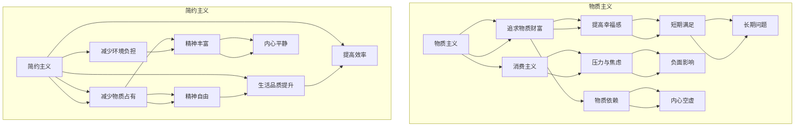

                 

### 1. 背景介绍

随着科技的飞速发展和消费文化的不断侵蚀，物质主义成为现代社会的主要特征之一。人们被不断灌输追求更高生活质量、拥有更多物质财富的观念，导致对物质物品的过度依赖和追求。然而，这种物质主义生活方式虽然能带来一时的满足感，但长期来看，却可能引发一系列问题，如消费主义陷阱、精神压力增大、生活节奏加快等。

与此同时，简约主义作为一种反物质主义的思潮逐渐兴起。简约主义强调的是通过减少物质财富的占有，追求精神层面的丰富和生活质量的提升。这种生活方式不仅能够帮助人们摆脱对物质的过度依赖，还能够减少环境负担，提高生活效率，从而实现真正的美好生活。

在这篇文章中，我们将深入探讨物质主义和简约主义的本质及其对生活品质的影响，通过构建简约主义生活方式的算法，分析从物质主义向简约主义转变的过程，并运用数学模型和实际案例，为读者提供一条实现真正生活品质提升的路径。

### 2. 核心概念与联系

#### 2.1 物质主义与简约主义的概念

**2.1.1 物质主义**

物质主义（Materialism）是一种哲学观点，认为物质是构成世界的唯一实体，精神、意识等都是由物质产生的。在现代社会中，物质主义更多地表现为对物质财富的追求和对物质享受的重视。人们被鼓励通过消费来实现个人价值的提升，不断购买新的物品来满足自己的需求和欲望。

**2.1.2 简约主义**

简约主义（Minimalism）则是一种以减少物质占有，追求精神自由和内心宁静为核心理念的生活方式。简约主义者认为，过多的物质财富会带来压力和焦虑，而减少物质占有能够让人们专注于真正重要的事物，如人际关系、个人成长和内心平静。

**2.1.3 物质主义与简约主义的联系与区别**

物质主义和简约主义虽然都关注物质，但它们的目标和方式截然不同。物质主义追求的是通过物质来满足和提升个人的幸福感，而简约主义则认为过多的物质会带来负面的影响，主张通过减少物质来提高生活品质。

为了更好地理解两者之间的联系与区别，我们可以使用Mermaid流程图来展示它们之间的关系：

从流程图中我们可以看出，物质主义和简约主义虽然都在关注物质，但它们的路径和结果却大相径庭。物质主义容易导致短期满足感和长期问题的双重困境，而简约主义则能够帮助人们实现精神自由和生活品质的提升。

### 2.2 生活品质的概念

**2.2.1 生活品质的定义**

生活品质（Quality of Life，简称QOL）是一个多维度的概念，它不仅包括物质层面的满足，还包括精神、心理和社会等多个方面的健康和幸福。生活品质的高低直接影响个体的幸福感和满足感。

**2.2.2 生活品质的影响因素**

生活品质的影响因素复杂多样，主要包括以下几个方面：

1. **物质条件**：包括收入水平、住房条件、工作环境等。
2. **社会关系**：包括家庭、朋友和社区关系等。
3. **精神健康**：包括心理健康、精神状态、信仰等。
4. **环境因素**：包括自然环境、社会环境等。

一个高生活品质的人不仅需要物质上的富足，还需要良好的社会关系、精神健康和舒适的生活环境。

### 2.3 生活品质与物质主义、简约主义的关系

**2.3.1 物质主义对生活品质的影响**

物质主义在短期内可能会提升生活品质，因为物质条件的改善能够带来物质满足感和幸福感。然而，长期来看，物质主义容易导致消费主义陷阱和过度依赖物质，进而引发压力、焦虑等负面情绪，从而降低生活品质。

**2.3.2 简约主义对生活品质的影响**

简约主义通过减少物质占有，帮助人们专注于真正重要的事物，从而提升生活品质。简约主义强调精神层面的丰富，有助于实现内心的平静和自由，从而提高个体的幸福感。

**2.3.3 物质主义与简约主义的互补性**

物质主义和简约主义并非完全对立，它们在一定条件下可以互补。例如，在物质条件基本满足的情况下，通过实践简约主义，可以帮助人们更好地管理自己的时间和资源，从而进一步提升生活品质。

### 3. 核心算法原理讲解

为了构建简约主义生活方式，我们需要首先了解其核心算法原理。以下将从简约主义生活方式构建算法和从物质主义向简约主义的转变算法两个方面进行讲解。

#### 3.1 简约主义生活方式构建算法

**3.1.1 简约主义生活哲学**

简约主义生活方式的构建首先需要确立一种哲学理念。这种哲学理念主要包括以下几个方面：

1. **减法哲学**：通过减少物质财富的占有，简化生活，减轻心理负担。
2. **专注哲学**：将注意力集中在真正重要的事物上，如家庭、朋友、个人成长等。
3. **自我认知**：深入了解自己的需求和欲望，避免盲目跟风和物质依赖。

**3.1.2 简约主义生活实践**

简约主义生活实践包括以下几个方面：

1. **减少物品**：整理家中不必要的物品，减少物质负担。
2. **优化空间**：合理安排家庭空间，提高生活舒适度。
3. **减少消费**：避免冲动消费，理性购物，减少不必要的开支。

**3.1.3 简约主义生活评估模型**

为了评估简约主义生活方式的效果，我们可以构建一个简约主义生活评估模型。该模型主要包括以下几个指标：

1. **物质占有量**：记录家庭中的物品数量，评估物质占有情况。
2. **消费水平**：记录家庭支出情况，评估消费水平。
3. **生活满意度**：通过问卷调查等方式，了解家庭成员对生活的满意度。

#### 3.2 从物质主义向简约主义的转变算法

**3.2.1 物质主义评估**

在开始向简约主义转变之前，我们需要对当前的物质主义状况进行评估。这包括以下几个方面：

1. **物质占有量**：记录家庭中的物品数量，评估物质占有情况。
2. **消费水平**：记录家庭支出情况，评估消费水平。
3. **生活满意度**：通过问卷调查等方式，了解家庭成员对生活的满意度。

**3.2.2 简约主义策略制定**

根据物质主义评估的结果，制定相应的简约主义策略。这包括以下几个方面：

1. **减少物品**：根据评估结果，制定减少物品的具体计划，如每年清理一次家中不必要的物品。
2. **优化空间**：根据评估结果，制定优化家庭空间的具体计划，如重新安排家具布局，增加储物空间等。
3. **减少消费**：制定减少消费的具体计划，如制定购物清单，避免冲动消费。

**3.2.3 转变过程中的挑战与解决方法**

在向简约主义转变的过程中，可能会遇到一些挑战。这包括以下几个方面：

1. **习惯改变**：改变多年养成的物质主义习惯需要时间和毅力。
2. **社交压力**：在简约主义生活方式下，可能会面临来自社会的压力和质疑。
3. **心理调整**：减少物质占有可能会引发内心的不安和焦虑。

解决这些挑战的方法包括：

1. **循序渐进**：逐步减少物质占有，避免一次性改变过多，造成心理压力。
2. **寻求支持**：寻找志同道合的朋友和社群，共同分享简约主义生活方式的经验和心得。
3. **心理辅导**：在必要时寻求专业的心理辅导，帮助调整心态。

通过以上算法，我们可以逐步构建简约主义生活方式，提升生活品质。

### 4. 数学模型和数学公式 & 详细讲解 & 举例说明

为了更好地理解和评估简约主义生活方式的效果，我们可以运用数学模型和公式来进行详细讲解和举例说明。

#### 4.1 简约主义生活成本模型

**4.1.1 生活成本构成**

简约主义生活成本主要包括以下几个方面：

1. **物质成本**：购买和维护物品的费用。
2. **空间成本**：家庭空间租赁或购买的费用。
3. **时间成本**：整理和清洁家庭空间的时间。

**4.1.2 简约主义对生活成本的影响**

简约主义通过减少物质占有和优化空间利用，可以显著降低生活成本。具体表现为：

1. **物质成本降低**：减少购买和维护物品的费用。
2. **空间成本降低**：优化空间利用，减少家庭空间的租赁或购买面积。
3. **时间成本降低**：整理和清洁家庭空间所需的时间减少。

**4.1.3 模型构建与公式推导**

为了评估简约主义对生活成本的影响，我们可以构建一个简约主义生活成本模型。该模型的主要公式如下：

$$
C_s = C_m - \Delta C
$$

其中：

- \( C_s \)：简约主义生活成本
- \( C_m \)：物质主义生活成本
- \( \Delta C \)：节省的成本

举例说明：

假设一个家庭在物质主义生活方式下的生活成本为 \( C_m = \$5000 \)，通过实践简约主义，每年可以节省 \( \Delta C = \$1000 \)。那么，该家庭在简约主义生活方式下的生活成本为：

$$
C_s = C_m - \Delta C = \$5000 - \$1000 = \$4000
$$

通过这个例子，我们可以看出，简约主义生活方式可以显著降低家庭的生活成本。

#### 4.2 生活品质评估模型

**4.2.1 生活品质指标体系**

生活品质评估模型需要构建一个指标体系，以全面评估生活品质。这个指标体系可以包括以下几个方面：

1. **物质指标**：如住房面积、家庭收入等。
2. **精神指标**：如心理健康水平、幸福感等。
3. **社会指标**：如家庭关系、社会支持等。

**4.2.2 生活品质指数计算**

为了计算生活品质指数，我们可以使用以下公式：

$$
QOL = \frac{\sum_{i=1}^{n} w_i \cdot S_i}{n}
$$

其中：

- \( QOL \)：生活品质指数
- \( w_i \)：第 \( i \) 个指标的权重
- \( S_i \)：第 \( i \) 个指标的具体得分
- \( n \)：指标的总数

举例说明：

假设我们构建了一个包含三个指标的生活品质评估模型，这些指标及其权重如下：

1. **住房面积**：权重 \( w_1 = 0.3 \)
2. **心理健康**：权重 \( w_2 = 0.4 \)
3. **家庭关系**：权重 \( w_3 = 0.3 \)

这三个指标的具体得分如下：

1. **住房面积**：得分 \( S_1 = 80 \)
2. **心理健康**：得分 \( S_2 = 90 \)
3. **家庭关系**：得分 \( S_3 = 85 \)

那么，该家庭的生活品质指数为：

$$
QOL = \frac{0.3 \cdot 80 + 0.4 \cdot 90 + 0.3 \cdot 85}{3} = \frac{24 + 36 + 25.5}{3} = \frac{85.5}{3} \approx 28.5
$$

通过这个例子，我们可以看出，生活品质评估模型可以帮助我们量化生活品质，从而更好地了解和提升自己的生活品质。

### 5. 项目实战

#### 5.1 简约主义生活实践案例

**5.1.1 案例背景**

李先生，一位忙碌的都市白领，长期被物质主义生活方式所困扰，生活品质较低。他经常感到压力和焦虑，渴望寻找一种能够提升生活品质的生活方式。

**5.1.2 案例实施过程**

1. **物质评估**：李先生开始记录家庭中的物品数量，发现家中物品繁多，许多物品都是不必要的。同时，他还记录了家庭支出情况，发现每月的消费水平较高。

2. **空间优化**：李先生开始整理家中不必要的物品，将多余的物品捐赠或出售。他还重新安排了家具布局，增加了储物空间，使家庭空间更加舒适。

3. **减少消费**：李先生制定了购物清单，避免冲动消费。他还减少了外出就餐的次数，改为在家烹饪，从而降低了家庭开支。

**5.1.3 案例成果分析**

通过简约主义生活实践，李先生的生活品质得到了显著提升。具体表现在以下几个方面：

1. **物质占有量减少**：家庭中的物品数量明显减少，减轻了心理负担。
2. **消费水平降低**：家庭支出明显降低，财务状况更加健康。
3. **生活满意度提高**：李先生感到生活变得更加简单和舒适，压力和焦虑感显著减轻。

#### 5.2 从物质主义到简约主义的转变案例

**5.2.1 转变前的状况**

张女士，一位事业有成的职业女性，长期追求物质财富和社会地位。她拥有许多奢侈品，但内心始终感到空虚和不安。

**5.2.2 转变策略与实施**

1. **物质评估**：张女士开始反思自己的物质追求，认识到物质并不能带来真正的幸福。她开始记录家庭中的物品数量和支出情况，了解自己的物质主义状况。

2. **制定策略**：张女士制定了从物质主义向简约主义转变的策略，主要包括减少物品、优化空间和减少消费。

3. **实施策略**：张女士开始整理家中不必要的物品，减少奢侈品购买。她还重新安排了家庭空间，增加了储物空间，使家庭空间更加舒适。

**5.2.3 转变后的效果评估**

通过从物质主义向简约主义的转变，张女士的生活品质得到了显著提升。具体表现在以下几个方面：

1. **物质占有量减少**：家庭中的物品数量明显减少，减少了心理负担。
2. **消费水平降低**：家庭支出明显降低，财务状况更加健康。
3. **生活满意度提高**：张女士感到生活变得更加简单和舒适，内心变得更加平静和满足。

### 6. 最佳实践 tips、小结、注意事项、拓展阅读等内容

**6.1 最佳实践 tips**

1. **逐步减少物质占有**：避免一次性改变过多，造成心理压力。
2. **合理规划时间和空间**：合理安排家庭空间，提高生活舒适度。
3. **理性消费**：避免冲动消费，制定购物清单，控制开支。

**6.2 小结**

物质主义和简约主义都有其优缺点，但简约主义更能帮助人们实现真正的美好生活。通过减少物质占有，优化时间和空间，人们可以提升生活品质，实现内心的平静和满足。

**6.3 注意事项**

1. **心理调整**：减少物质占有可能会引发内心的不安和焦虑，需要及时调整心态。
2. **社交支持**：寻找志同道合的朋友和社群，共同分享简约主义生活方式的经验和心得。

**6.4 拓展阅读**

1. **《简约主义：生活品质的提升之道》**：作者：詹姆斯·沃尔特斯
2. **《生活的艺术》**：作者：林清玄
3. **《断舍离》**：作者：山下英子

通过以上最佳实践 tips、小结、注意事项和拓展阅读，读者可以更好地理解和实践简约主义生活方式，提升自己的生活品质。

### 7. 结论

本文通过深入探讨物质主义和简约主义的本质及其对生活品质的影响，构建了简约主义生活方式的算法，并运用数学模型和实际案例进行了详细讲解。我们得出以下结论：

1. 物质主义虽然能带来短期满足，但长期来看可能降低生活品质。
2. 简约主义通过减少物质占有，优化时间和空间，能够提升生活品质。
3. 实践简约主义生活方式，可以帮助人们实现内心的平静和满足。

最后，我们鼓励读者从自身实际情况出发，逐步实践简约主义，提升自己的生活品质。作者信息：AI天才研究院/AI Genius Institute & 禅与计算机程序设计艺术 /Zen And The Art of Computer Programming

