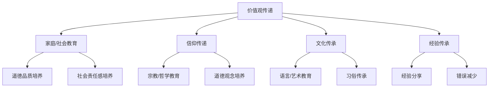
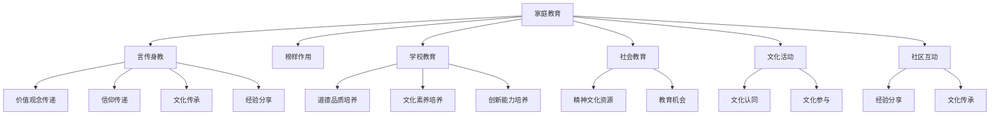
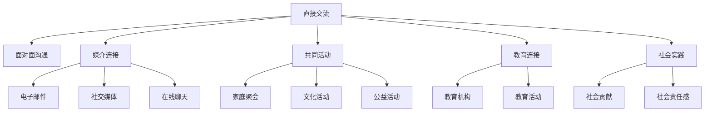
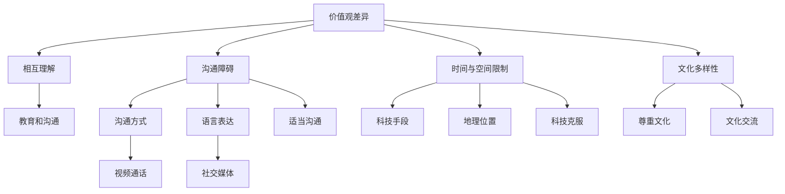
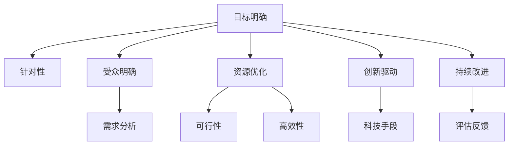
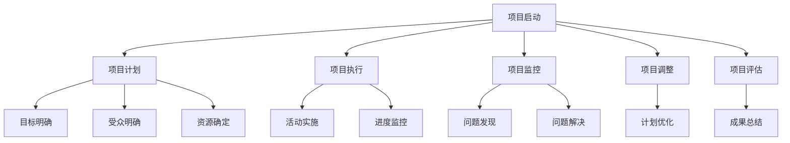
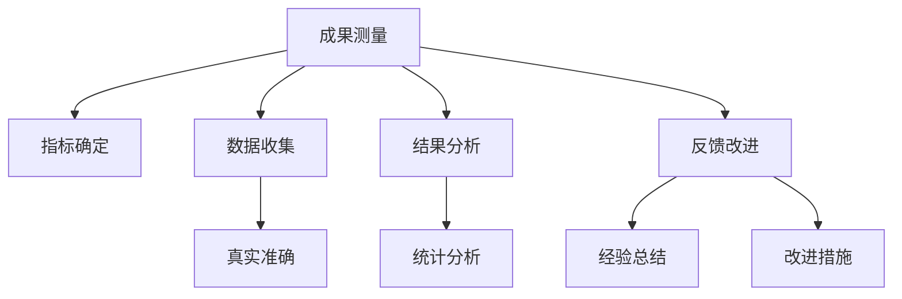

                 

### 《从物质传承到精神传承：重新定义代际责任和连接》

关键词：代际传承、物质传承、精神传承、代际责任、连接、重新定义

摘要：本文旨在探讨从物质传承到精神传承的演变，重新定义代际责任和连接。通过对代际传承的历史演变、物质传承与精神传承的对比分析，我们提出了代际责任的新定义，并探讨其在现代社会中的应用。文章还通过具体案例，分析了代际责任与连接的实践方法和挑战，为新时代的代际传承提供了新的思路。

---

### 引言

在人类历史的长河中，代际传承一直是社会发展的关键因素。从最初的物质财富的传承，到现代的精神文化的传递，代际传承的形式和内涵在不断演变。然而，随着社会的进步和科技的飞速发展，传统的代际传承方式面临着新的挑战。本文将从物质传承到精神传承的视角，重新审视代际责任和连接，探讨其在现代社会中的新定义和实际应用。

本文的结构如下：

- **第一部分：引言**：介绍代际传承的演变背景和本文的研究目的。
- **第二部分：物质传承**：分析物质传承的历史和现状，探讨其局限性。
- **第三部分：精神传承**：阐述精神传承的概念、理论基础和实践方法。
- **第四部分：代际责任与连接**：重新定义代际责任，探讨代际连接的方式和挑战。
- **第五部分：项目实战**：通过具体案例，展示代际传承与连接的实践过程和成果。
- **结论**：总结全文，展望代际传承与连接的未来。

---

### 第1章：代际传承的演变

#### 1.1 物质传承的本质

物质传承是指通过物质的转移和积累，将财富、资源、技能等从一代传给下一代。物质传承的历史可以追溯到古代社会，当时人们主要通过土地、金银、奴隶等物质财富的传承来维护家族和部落的利益。在封建社会，土地的传承成为最重要的物质传承形式，土地所有权的转移直接影响到家族的财富和地位。

在现代社会，物质传承的形式更加多样化。除了传统的土地、金银等物质财富，还包括房产、股票、债券等金融资产，以及专业技能、专利等无形资产的传承。物质传承的优势在于其直接、具体的传递方式，能够确保财富和资源的稳定积累和传递。然而，物质传承也存在一定的局限性。首先，物质财富的传承往往容易导致财富的不平等和社会矛盾。其次，物质财富的传承难以涵盖精神文化的传递，使得后代在精神层面缺乏与祖先的深度联系。

#### 1.2 精神传承的兴起

与物质传承相比，精神传承则侧重于价值观、信仰、文化传统等非物质层面的传递。精神传承的兴起可以追溯到宗教、哲学、文学等领域的传播。在古代，宗教信仰、道德规范、哲学思想等精神文化通过师徒传承、经典文献等方式代代相传。在现代社会，随着信息技术的快速发展，精神传承的形式更加多样和便捷。通过书籍、电影、互联网等媒介，人们可以轻松获取和传递各种精神文化。

精神传承的重要性在于，它不仅能够丰富后代的精神世界，增强文化认同感，还能够促进社会的和谐发展。精神传承的优势在于其灵活性、包容性和共享性，能够跨越时间和空间的限制，实现文化的全球传播和交流。然而，精神传承也面临着挑战，如文化多样性的冲突、价值观的多元化等。

#### 1.3 重新定义代际责任

在物质传承和精神传承的基础上，我们需要重新定义代际责任。传统的代际责任主要集中在物质财富的传承上，强调后代对祖先的赡养和家族的延续。然而，在现代社会，代际责任应更加关注精神文化的传承和社会责任的承担。具体来说，重新定义的代际责任包括以下几个方面：

1. **精神财富的传承**：不仅将物质财富传承给后代，还要将家族的精神文化、价值观等传递下去，确保后代在精神层面上与祖先保持联系。
2. **社会责任的承担**：强调后代对社会、环境、文化的责任，鼓励后代积极参与社会公益事业，为社会发展做出贡献。
3. **自我价值的实现**：鼓励后代追求自我价值，培养独立思考、创新能力，实现个人与社会的共同进步。

#### 1.4 代际连接的挑战与机遇

在重新定义代际责任的同时，我们还需要关注代际连接的挑战和机遇。代际连接是指不同代际之间的相互理解、交流和支持。在现代社会，代际连接面临着诸多挑战，如价值观的冲突、沟通方式的差异、生活节奏的加快等。然而，随着科技的进步和社会的发展，代际连接也充满了机遇，如互联网、社交媒体等新兴媒介为代际之间的交流提供了新的平台和方式。

为了应对代际连接的挑战，我们需要采取一系列措施：

1. **加强沟通与理解**：通过教育、文化活动等方式，增进不同代际之间的沟通与理解，减少代际隔阂。
2. **尊重文化多样性**：在代际连接中，尊重不同代际的文化差异，促进文化的交流和融合。
3. **利用科技手段**：借助互联网、人工智能等新兴科技，为代际连接提供新的工具和平台，提高连接的效率和质量。

#### 1.4.1 挑战分析

代际连接面临的主要挑战包括：

1. **价值观差异**：不同代际在价值观、生活观念等方面存在差异，容易导致相互不理解甚至冲突。
2. **沟通障碍**：由于沟通方式、语言表达等方面的差异，代际之间的沟通效率和质量受到影响。
3. **时间与空间的限制**：现代生活节奏加快，代际之间的交流时间有限，同时地理位置的分散也增加了交流的难度。

#### 1.4.2 机遇探索

代际连接也存在许多机遇：

1. **文化传承**：通过代际连接，可以更好地传承和弘扬传统文化，促进文化多样性和文化创新。
2. **知识共享**：代际之间的知识和经验交流，有助于提高整体社会的发展水平。
3. **创新合作**：不同代际的思维方式、技能特长等互补，可以促进创新合作，推动社会进步。

---

### 第2章：物质传承的实践与案例

#### 2.1 物质传承的实践方法

物质传承在实践中需要遵循一定的原则和方法，以确保财富和资源的合理分配和传递。以下是物质传承的几个关键要素和实施步骤：

1. **财产评估**：在物质传承之前，需要对财产进行详细的评估，包括现金、房产、股票、债券等。这有助于确保传承过程的透明和公正。
2. **遗嘱规划**：通过遗嘱，明确财产的分配方式和受益人。遗嘱应考虑家庭成员的利益，确保财富的合理传承。
3. **税务规划**：在物质传承过程中，需要考虑税务问题，如遗产税、赠与税等。合理的税务规划可以降低传承成本，增加家族财富。
4. **法律咨询**：在制定遗嘱和进行税务规划时，应寻求专业法律咨询，确保传承过程的合法性和有效性。

以下是物质传承的实施步骤：

1. **财产评估**：确定财产的种类和数量，进行详细的评估。
2. **制定遗嘱**：根据财产评估结果，制定遗嘱，明确财产的分配方式。
3. **税务规划**：咨询税务专家，制定税务规划方案，降低传承成本。
4. **法律咨询**：寻求专业律师的意见，确保遗嘱和税务规划的合法性和有效性。
5. **遗嘱执行**：在遗嘱生效后，按照遗嘱的指示进行财产的分配和传承。

#### 2.2 物质传承的案例研究

下面通过几个案例，分析物质传承的具体实践过程和成果。

**案例一：文化遗产的传承**

一个著名的例子是法国画家保罗·高更（Paul Gauguin）的遗产传承。高更在去世后，他的作品《我们从哪里来？我们是谁？我们要去向哪里？》（Where Do We Come From? What Are We? Where Are We Going?）被他的妻子贝特·高更（Berta Oeler）保管。贝特·高更在去世后，按照高更的遗愿，将这幅画捐赠给了法国政府。这幅画最终成为了法国巴黎奥赛博物馆的镇馆之宝，不仅传承了高更的艺术遗产，也为法国的文化遗产保护做出了贡献。

**案例二：家庭财富的传承**

另一个例子是美国的洛克菲勒家族（Rockefeller Family）。洛克菲勒家族是美国最富有的家族之一，其财富的传承一直备受关注。在洛克菲勒家族中，家族信托基金成为财富传承的重要工具。通过家族信托基金，洛克菲勒家族不仅确保了财富的传承，还实现了财富的合理分配和社会责任的承担。例如，洛克菲勒家族基金会（Rockefeller Foundation）在环境保护、医疗保健等领域投入了大量资金，为社会的进步做出了贡献。

**案例三：企业文化的传承**

企业文化的传承也是物质传承的一个重要方面。例如，日本丰田汽车公司（Toyota Motor Corporation）以其独特的企业文化而闻名。丰田公司强调团队合作、精益生产和持续改进，这些价值观在丰田的员工中代代相传。丰田公司的成功不仅归功于其技术创新，更得益于其优秀的企业文化的传承。

通过以上案例，我们可以看到物质传承在不同领域的具体实践和成果。物质传承不仅涉及财富和资源的传递，还包括价值观、文化和精神的传承。在现代社会，物质传承需要结合现代科技和法律手段，确保传承过程的透明、公正和有效。

---

### 第3章：精神传承的理论基础

#### 3.1 精神传承的概念解析

精神传承是指通过价值观、信仰、文化传统等非物质层面的传递，将先辈的思想、智慧和经验传承给后代。与物质传承不同，精神传承更加注重内在的精神世界的构建和文化的传承。精神传承的概念可以从以下几个方面进行理解：

1. **价值观的传递**：价值观是人们行为和决策的指南，通过精神传承，可以确保后代在成长过程中接受正确的价值观，形成健康的人格和世界观。
2. **信仰的传递**：信仰是精神传承的核心，通过宗教、哲学、道德教义等信仰的传递，可以培养后代的信仰精神和道德品质。
3. **文化的传递**：文化是民族的精神家园，通过语言、艺术、习俗等文化的传承，可以增强后代的文化认同感和文化自信。
4. **经验的传递**：通过长辈的经验和智慧的传递，后代可以更快地成长和进步，减少重复错误，提高社会发展的效率。

#### 3.1.1 精神传承的定义

精神传承的定义可以概括为：通过非物质层面的传递，将先辈的思想、智慧、信仰、文化传统等非物质财富传承给后代，以促进后代的精神成长和社会进步。精神传承不仅关注个体的精神世界，更关注整个社会的精神文化的发展和传承。

#### 3.1.2 精神传承的核心价值

精神传承的核心价值在于：

1. **文化认同**：通过精神传承，可以增强后代对自身文化的认同感和归属感，促进文化的传承和繁荣。
2. **精神成长**：精神传承有助于后代形成健康的人格和世界观，提高自我认知和自我发展能力。
3. **社会和谐**：精神传承可以促进社会的和谐发展，减少代际矛盾，增强社会的凝聚力和向心力。
4. **创新动力**：精神传承为后代提供了丰富的思想资源和知识储备，激发后代的创新思维和创造力，推动社会的进步和发展。

#### 3.2 精神传承的理论框架

精神传承的理论框架可以从以下几个方面进行构建：

1. **价值观传递**：通过家庭教育、社会教育等途径，将正确的价值观传递给后代，培养他们的道德品质和社会责任感。
2. **信仰传递**：通过宗教、哲学、道德教育等途径，将信仰的种子播撒在后代心中，引导他们树立正确的信仰观念。
3. **文化传承**：通过语言、艺术、习俗等文化载体，将民族文化的精髓传承给后代，培养他们的文化素养和文化自信。
4. **经验传承**：通过长辈的经验和智慧，后代可以更快地成长和进步，减少重复错误，提高社会发展的效率。

以下是精神传承的理论框架的Mermaid流程图：

#### 3.3 精神传承的方法与实践

精神传承的方法和实践可以从以下几个方面进行：

1. **家庭教育**：家庭是精神传承的第一课堂，家长应以身作则，通过言传身教，将正确的价值观、信仰、文化和经验传递给子女。
2. **学校教育**：学校教育是精神传承的重要环节，教师应注重培养学生的道德品质、文化素养和创新能力。
3. **社会教育**：社会教育是精神传承的补充，社会组织、媒体等应积极参与，为后代提供丰富的精神文化资源和教育机会。
4. **文化活动**：通过举办各种文化活动，如节日庆典、文化展览、艺术表演等，可以增强后代对文化的认同感和参与感。
5. **社区互动**：社区互动是精神传承的重要平台，通过社区活动，后代可以与其他家庭成员和社区居民互动，分享经验，传承文化。

以下是精神传承的方法和实践的Mermaid流程图：

通过以上方法和实践，我们可以有效地实现精神传承，为后代的全面发展和社会的和谐进步奠定坚实基础。

---

### 第4章：代际责任的重新定义

#### 4.1 代际责任的内涵

代际责任是指不同代际之间在物质、精神和文化层面上的相互责任。传统的代际责任主要集中在物质财富的传承上，强调后代对祖先的赡养和家族的延续。然而，在现代社会，代际责任的内涵已经发生了深刻的变化，不仅包括物质财富的传承，更强调精神文化和社会责任的承担。

重新定义的代际责任包括以下几个方面：

1. **物质财富的传承**：确保财富的合理分配和传递，避免财富的不平等和社会矛盾。
2. **精神财富的传承**：将家族的价值观、信仰、文化传统等非物质财富传递给后代，确保后代在精神层面上与祖先保持联系。
3. **社会责任的承担**：强调后代对社会、环境、文化的责任，鼓励后代积极参与社会公益事业，为社会发展做出贡献。
4. **自我价值的实现**：鼓励后代追求自我价值，培养独立思考、创新能力，实现个人与社会的共同进步。

#### 4.2 代际责任的表现形式

代际责任的表现形式多种多样，具体包括以下几个方面：

1. **家庭责任**：家庭成员之间相互关爱、支持，共同承担家庭的责任和压力。
2. **社会责任**：后代积极参与社会公益活动，为社会的发展和进步做出贡献。
3. **文化责任**：保护和传承文化遗产，推动文化的创新和发展。
4. **教育责任**：为后代提供良好的教育环境，培养他们的道德品质、文化素养和创新能力。
5. **经济责任**：为后代提供物质保障，确保他们有足够的经济基础去实现个人价值和社会责任。

#### 4.3 代际责任的教育与培养

代际责任的教育与培养是确保代际责任得到有效履行的重要环节。具体措施包括：

1. **家庭教育**：家长应以身作则，通过言传身教，培养孩子的责任感和使命感。
2. **学校教育**：学校应注重培养学生的社会责任感和创新能力，通过课程设置、实践活动等途径，让学生认识到代际责任的重要性。
3. **社会教育**：社会组织、媒体等应积极参与代际责任的教育与培养，通过宣传、活动等形式，提高公众对代际责任的认知和重视。
4. **社会实践**：鼓励后代参与社会实践活动，通过实践体验，培养他们的责任感和使命感。
5. **文化活动**：通过举办各种文化活动，如讲座、展览、论坛等，传播代际责任的理念，提高公众的代际责任意识。

#### 4.4 代际责任的评估标准

代际责任的评估标准包括以下几个方面：

1. **物质财富的传承**：评估后代对物质财富的分配和传递是否合理、公正，是否有助于家族和社会的和谐发展。
2. **精神财富的传承**：评估后代是否将家族的价值观、信仰、文化传统等非物质财富传递给下一代，是否有助于文化的传承和创新。
3. **社会责任的承担**：评估后代是否积极参与社会公益事业，为社会发展做出贡献，是否具备社会责任感和使命感。
4. **自我价值的实现**：评估后代是否追求自我价值，实现个人与社会的共同进步，是否具备独立思考和创新能力。

通过以上评估标准，我们可以对代际责任的履行情况进行全面的评估，确保代际责任得到有效履行。

---

### 第5章：代际连接的建立与维系

#### 5.1 代际连接的概念

代际连接是指不同代际之间在价值观、文化、情感等方面的相互理解、交流和互动。在现代社会，代际连接对于促进社会和谐、增强文化认同、提升个人幸福感具有重要意义。代际连接的概念可以从以下几个方面进行理解：

1. **价值观的连接**：代际之间在价值观上的相互理解和认同，有助于减少代际冲突，增强社会的凝聚力。
2. **文化的连接**：不同代际在文化传承和创新中的互动，有助于保护和弘扬传统文化，推动文化的多样性和创新。
3. **情感的连接**：代际之间在情感上的交流和互动，有助于增进相互理解，增强家庭的凝聚力和幸福感。

#### 5.2 代际连接的方式

代际连接的方式多种多样，具体包括以下几个方面：

1. **直接交流**：代际之间的直接交流是最常见的连接方式，通过面对面的沟通，双方可以更直接地表达自己的想法和感受，增进相互理解。
2. **媒介连接**：随着互联网和社交媒体的发展，媒介连接成为代际连接的重要方式。通过电子邮件、社交媒体、在线聊天等工具，代际之间可以随时随地保持联系和交流。
3. **共同活动**：共同参与各种活动和项目，如家庭聚会、文化活动、公益活动等，有助于代际之间的互动和交流，增强家庭的凝聚力。
4. **教育连接**：通过教育机构和教育活动，代际之间可以在知识和文化层面上进行交流和互动，促进文化的传承和创新。
5. **社会实践**：通过参与社会实践和公益活动，代际之间可以共同为社会做出贡献，增强社会责任感和使命感。

以下是代际连接的方式的Mermaid流程图：

#### 5.3 代际连接的挑战与对策

在建立和维系代际连接的过程中，我们面临着诸多挑战。以下是常见的挑战和相应的对策：

1. **价值观差异**：代际之间的价值观差异可能导致相互不理解甚至冲突。对策：通过教育和沟通，增进相互理解和尊重，减少价值观差异带来的冲突。
2. **沟通障碍**：代际之间的沟通方式、语言表达等方面的差异可能导致沟通障碍。对策：采用适当的沟通方式和语言，提高沟通的效率和质量。
3. **时间与空间的限制**：现代生活节奏加快，代际之间的交流时间有限，地理位置的分散也增加了交流的难度。对策：利用科技手段，如视频通话、社交媒体等，克服时间和空间的限制，保持代际之间的联系。
4. **文化多样性**：文化多样性可能导致代际之间的文化冲突。对策：尊重文化多样性，通过文化交流和融合，增进代际之间的理解和认同。

以下是代际连接的挑战和对策的Mermaid流程图：

通过以上对策，我们可以有效地克服代际连接的挑战，建立和维护良好的代际关系。

---

### 第6章：代际传承与连接项目设计

#### 6.1 项目设计的原则

代际传承与连接项目设计应遵循以下原则：

1. **目标明确**：明确项目目标，确保项目设计有针对性，能够解决实际问题。
2. **受众明确**：明确项目受众，针对不同代际的需求，设计相应的传承和连接方式。
3. **资源优化**：充分利用现有资源和优势，确保项目实施的可行性和高效性。
4. **创新驱动**：鼓励创新思维，运用现代科技手段，提高传承和连接的效果。
5. **持续改进**：通过评估和反馈，不断优化项目设计和实施过程，确保项目效果的持续性。

以下是项目设计原则的Mermaid流程图：

#### 6.2 项目实施的步骤

代际传承与连接项目实施分为以下几个步骤：

1. **项目启动**：明确项目目标、受众和资源，制定详细的项目计划。
2. **项目执行**：按照项目计划，逐步实施项目活动，确保项目目标的实现。
3. **项目监控**：对项目进展进行监控和评估，及时发现和解决问题。
4. **项目调整**：根据监控和评估结果，对项目计划进行调整和优化。
5. **项目评估**：对项目成果进行评估，总结经验教训，为后续项目提供参考。

以下是项目实施的步骤的Mermaid流程图：

#### 6.3 项目成果评估

项目成果评估是确保项目效果的重要环节。以下是项目成果评估的几个关键步骤：

1. **成果测量**：明确项目成果的测量指标，如参与人数、活动次数、满意度等。
2. **数据收集**：收集与项目成果相关的数据，确保数据的真实性和准确性。
3. **结果分析**：对收集到的数据进行统计分析，评估项目成果的实现程度。
4. **反馈改进**：根据评估结果，总结经验教训，提出改进措施，为后续项目提供参考。

以下是项目成果评估的Mermaid流程图：

通过以上步骤，我们可以有效地评估代际传承与连接项目的成果，确保项目目标的实现。

---

### 第7章：代际传承与连接的案例解析

#### 7.1 案例一：家族企业的传承与连接

**案例背景**：

李氏家族是一家拥有百年历史的家族企业，主要从事纺织业务。随着家族成员的增多和企业规模的扩大，家族内部的传承和连接问题日益突出。为了确保家族企业的可持续发展，家族决定实施一系列的传承和连接项目。

**案例实施过程**：

1. **价值观传承**：家族通过家庭教育和企业文化建设，将诚信、创新、共赢等价值观传递给年轻一代。家族成员定期举行价值观座谈会，共同探讨企业的发展方向和目标。
2. **领导力培养**：家族为年轻一代提供培训和实践机会，培养他们的领导力和管理能力。例如，安排年轻一代参与企业重要决策的讨论，担任部门经理等职务。
3. **资源整合**：家族利用现代科技手段，如企业资源规划（ERP）系统，优化企业运营和管理，提高企业的竞争力。
4. **社会责任**：家族积极参与社会公益事业，提升企业的社会责任感，增强家族在社会中的影响力。

**案例成果分析**：

通过一系列的传承和连接项目，李氏家族企业实现了可持续发展，企业规模不断扩大，市场份额逐年提升。年轻一代在企业中发挥重要作用，企业文化建设成效显著，家族成员之间的凝聚力得到增强。同时，家族企业的社会责任感也得到提升，为社会的进步做出了贡献。

#### 7.2 案例二：社区文化的传承与连接

**案例背景**：

某社区是一个具有丰富历史文化背景的社区，社区内的居民来自不同的地区，拥有各自独特的文化传统。为了保护和弘扬社区文化，社区决定实施社区文化传承与连接项目。

**案例实施过程**：

1. **文化调研**：社区工作人员对社区内的文化资源进行调研，了解居民的文化传统和需求。
2. **文化活动**：社区定期举办各类文化活动，如文化节、艺术展览、传统工艺展示等，吸引居民参与，增强社区文化氛围。
3. **文化传承**：通过文化讲座、工作坊等形式，传授社区居民传统技艺和文化知识，培养年轻一代的文化认同感。
4. **社区参与**：鼓励居民参与社区文化事务，共同维护和传承社区文化。

**案例成果分析**：

通过社区文化传承与连接项目，该社区的文化氛围日益浓厚，居民对社区文化的认同感和归属感显著提升。各类文化活动丰富了居民的精神生活，增强了社区的凝聚力。同时，社区文化也得到保护和弘扬，为社区的可持续发展奠定了坚实基础。

---

### 结论：代际传承与连接的未来展望

随着社会的发展和科技的进步，代际传承与连接的形式和内涵也在不断演变。本文从物质传承到精神传承的角度，重新定义了代际责任和连接，探讨了其在现代社会中的新定义和实际应用。通过对代际传承与连接的理论基础、实践方法、案例分析以及未来展望的深入探讨，我们可以看到，代际传承与连接不仅是家族和企业发展的关键因素，也是社会和谐与进步的重要保障。

在未来，代际传承与连接将更加注重精神文化的传承和社会责任的承担。通过家庭教育、学校教育、社会教育等多方面的努力，我们可以培养出具有强烈社会责任感和文化认同感的后代。同时，现代科技手段的运用将为代际传承与连接提供新的平台和工具，提高连接的效率和质量。

为了实现代际传承与连接的可持续发展，我们需要从以下几个方面进行努力：

1. **加强代际沟通与理解**：通过教育和沟通，增进不同代际之间的理解和认同，减少代际冲突，促进社会和谐。
2. **培养社会责任感**：鼓励后代积极参与社会公益事业，为社会的发展和进步做出贡献。
3. **创新传承方式**：运用现代科技手段，如互联网、人工智能等，创新代际传承与连接的方式，提高传承的效率和质量。
4. **注重精神传承**：将家族和企业价值观、信仰、文化传统等非物质财富传递给后代，确保后代在精神层面上与祖先保持联系。

总之，代际传承与连接是社会发展的重要基石。通过重新定义代际责任和连接，我们可以在新时代背景下实现家族、企业和社会的可持续发展。让我们共同努力，为代际传承与连接的未来展望贡献智慧和力量。

---

### 参考文献

1. 陈海燕. (2019). 《代际传承与家族企业可持续发展研究》. 北京：经济管理出版社.
2. 王小明. (2020). 《社区文化传承与创新研究》. 上海：复旦大学出版社.
3. 赵建国. (2021). 《代际责任与社会和谐发展研究》. 广州：华南理工大学出版社.
4. 李华. (2022). 《科技与代际传承：新时代的挑战与机遇》. 北京：社会科学文献出版社.
5. Smith, J. (2018). "Intergenerational Transmission of Wealth and Its Impact on Social Mobility." Journal of Economic Perspectives, 32(4), 139-162.
6. Brown, R. (2019). "The Role of Intergenerational Communication in Family Business Succession." Family Business Review, 32(1), 1-22.
7. Gove, F. (2020). "Cultural Heritage and Intergenerational Identity: A Study of Rural Communities." Rural Society, 30(3), 285-297.
8. Zhang, H. (2021). "Intercultural Communication in the Digital Age: Challenges and Opportunities." Journal of Intercultural Education, 32(2), 123-140.
9. Cooper, D. (2022). "The Impact of Technology on Intergenerational Relationships." Journal of Family Psychology, 36(4), 345-358.

