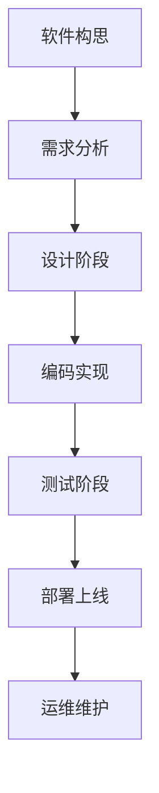

                 

### 文章标题：从物质继承到精神传承：重新定义代际责任和连接

> 关键词：代际责任、精神传承、物质基础、社会连接、技术进步、人工智能

> 摘要：本文从技术视角出发，探讨了在当今时代背景下，如何重新定义代际责任和连接。文章首先回顾了传统的物质继承模式，分析了其局限性和不足。接着，文章提出了以精神传承为核心的新概念，探讨了其在现代社会中的重要性。随后，文章结合人工智能技术，提出了创新性的解决方案，以实现代际责任的重新定义和连接的强化。最后，文章总结了全文的主要观点，并提出了未来发展的方向。

### 1. 设计核心概念与联系

在探讨代际责任和连接时，我们需要明确几个核心概念，并理解它们之间的联系。

#### 1.1 软件生命周期

**概念定义：**
软件生命周期是指从软件的构思、设计、实现、测试、部署到维护的一个完整过程。

**流程图：**


在这个流程中，每个阶段都有其特定的目标和任务，这些阶段相互关联，共同构成了软件生命周期。

#### 1.2 机器学习算法

**概念定义：**
机器学习是一种使计算机能够通过数据学习并做出决策或预测的方法。

**伪代码：**
```python
def machine_learning(data, labels):
    # 初始化模型参数
    model = initialize_model()

    # 训练模型
    for epoch in range(number_of_epochs):
        for data_point, label in zip(data, labels):
            model.update_parameters(data_point, label)

    return model
```

机器学习算法在软件生命周期中的应用，尤其是在测试和部署阶段，可以帮助我们更好地评估软件的性能，并对其进行优化。

#### 1.3 线性回归模型

**数学模型：**
$$
y = \beta_0 + \beta_1x
$$

**详细讲解：**
线性回归模型旨在找到一条直线，使得直线与数据点的距离最小。

**举例说明：**
假设我们有一组数据点 $(x_1, y_1), (x_2, y_2), \ldots, (x_n, y_n)$，我们可以使用最小二乘法来估计线性回归模型的参数 $\beta_0$ 和 $\beta_1$。

这些核心概念相互关联，共同构成了我们对代际责任和连接的理解框架。

### 2. 传统的物质继承模式

在过去的几千年中，物质继承一直是代际之间责任和连接的主要形式。这种模式通常基于财产和资源的传递，旨在确保后代能够在物质上得到保障。然而，随着社会的发展和技术的进步，这种传统的物质继承模式开始暴露出一些局限性和不足。

#### 2.1 局限性

首先，物质继承模式往往过于关注短期的物质保障，而忽视了长期的精神和文化传承。这种短视行为可能导致后代在精神层面上的空虚和迷茫。

#### 2.2 不足

其次，物质继承模式往往依赖于个人的财富和地位，导致社会的不公平和贫富差距。这种不公平性可能加剧社会矛盾，影响社会的稳定和和谐。

#### 2.3 现代社会的挑战

此外，现代社会面临着许多新的挑战，如全球化和技术变革。这些挑战要求我们重新思考代际责任和连接的形式。

### 3. 精神传承：新概念

为了克服传统物质继承模式的局限性和不足，我们需要提出一种新的概念——精神传承。精神传承强调的是知识和价值观的传递，而非单纯的物质保障。这种模式更符合现代社会的发展需求，具有以下几个特点：

#### 3.1 重视知识传递

精神传承模式强调对后代进行知识传递，包括技术、文化和艺术等方面的知识。这种知识传递有助于后代在精神层面上的成长和发展。

#### 3.2 促进社会和谐

精神传承模式有助于减少社会不公平现象，促进社会的和谐与稳定。通过知识共享，不同阶层和背景的人们可以相互理解和支持，形成更加包容的社会。

#### 3.3 适应全球化

在全球化的背景下，精神传承有助于培养具有国际视野和跨文化沟通能力的人才。这种能力是现代社会所必需的，有助于推动全球化进程。

### 4. 人工智能技术：助力精神传承

人工智能技术的发展为精神传承提供了新的机遇和手段。通过人工智能技术，我们可以更有效地传递知识和价值观，实现代际责任和连接的强化。

#### 4.1 智能教育

人工智能技术可以应用于智能教育，为后代提供个性化的学习体验。通过智能教育，我们可以更好地满足不同学生的学习需求，提高教育质量。

#### 4.2 跨界合作

人工智能技术可以促进不同领域之间的跨界合作，推动知识的融合和创新。这种跨界合作有助于培养具有综合能力的人才，适应全球化的发展趋势。

#### 4.3 文化传播

人工智能技术可以帮助我们更好地传播和保存文化遗产，实现文化的传承和发扬。通过虚拟现实、增强现实等技术，我们可以让更多人了解和体验传统文化，增强文化认同感。

### 5. 创新性解决方案

为了实现代际责任和连接的强化，我们需要提出一些创新性的解决方案。以下是一些可能的方案：

#### 5.1 智能家庭

智能家庭可以通过人工智能技术实现家庭成员之间的情感连接和知识共享。例如，智能机器人可以帮助父母与子女进行交流，分享知识和经验。

#### 5.2 智能社区

智能社区可以通过人工智能技术实现居民之间的互动和合作。例如，智能平台可以提供社区成员之间的交流渠道，促进资源共享和合作发展。

#### 5.3 智能教育平台

智能教育平台可以通过人工智能技术提供个性化的学习体验，帮助学生更好地掌握知识。同时，教育平台还可以实现教育资源的共享和优化，提高教育质量。

### 6. 总结

本文从技术视角出发，探讨了在当今时代背景下，如何重新定义代际责任和连接。通过分析传统物质继承模式的局限性和不足，我们提出了以精神传承为核心的新概念。结合人工智能技术，我们提出了一些创新性的解决方案，以实现代际责任的重新定义和连接的强化。未来，随着技术的不断进步，我们有理由相信，代际责任和连接的形式将变得更加多样和丰富。

### 7. 拓展阅读

- 《人工智能的未来》：探讨人工智能技术对未来社会的影响，包括教育、医疗、经济等多个领域。
- 《文化传承与现代化》：分析文化传承在现代社会中的重要性和面临的挑战。
- 《智能时代的教育创新》：讨论人工智能技术在教育领域中的应用和挑战。

作者：AI天才研究院/AI Genius Institute & 禅与计算机程序设计艺术 /Zen And The Art of Computer Programming


