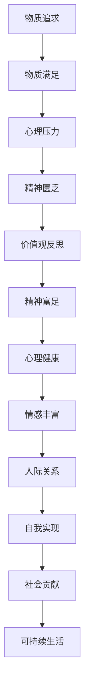

                 

### 文章标题

# 从物质追求到精神富足：现代人的价值观重塑之路

> 关键词：价值观、精神富足、现代生活、个人成长、心理健康

> 摘要：本文探讨了现代社会中人们价值观的转变，从物质追求向精神富足的转型之路。通过分析物质追求的局限性，揭示精神富足的真正内涵，本文旨在为现代人提供一种全新的生活哲学和价值观，帮助他们在忙碌和压力中找到内心的平衡和满足。

## 引言

在当今高速发展的社会中，物质财富的积累成为了许多人的追求目标。从经济的角度看，物质追求无疑为社会带来了繁荣和进步。然而，随着社会的发展，人们逐渐发现，单纯追求物质财富并不能带来真正的幸福和满足。越来越多的人开始反思，如何才能实现精神上的富足，追求更高层次的人生价值。

这种反思引发了人们对价值观的重新审视。传统价值观强调物质成就和地位，而现代价值观则更注重内心的平和与满足。本文将深入探讨这一转变，分析物质追求的局限性，探讨精神富足的内涵，并探讨如何实现这一转型。

### 物质追求的局限性

物质追求虽然在短期内能够带来满足感，但从长期来看，其局限性逐渐显现。首先，物质追求往往导致人们陷入无尽的欲望和攀比之中。人们为了追求更高的物质水平，不断努力工作，却发现自己永远无法满足。这种无尽的追求让人感到疲惫和焦虑，无法获得真正的幸福。

其次，物质追求往往忽视了人际关系和精神层面的需求。在追求物质的过程中，人们可能忽略了与家人、朋友和同事的交流和情感交流。这种缺乏情感连接的生活，让人感到孤独和疏离，无法实现内心的富足。

最后，物质追求可能导致人们忽视环境保护和社会责任。过度消费和资源浪费，不仅对环境造成破坏，也影响社会的可持续发展。一个只追求物质富足的社会，很难实现长期的稳定和繁荣。

### 精神富足的内涵

与物质追求相比，精神富足更注重内心的平和、情感的丰富和人际关系的和谐。精神富足不仅意味着内心的满足和幸福，还涉及到以下几个方面：

1. **心理健康**：精神富足的第一要素是心理健康。一个心理健康的人能够应对生活中的压力和挑战，拥有积极的心态和乐观的精神状态。

2. **情感丰富**：情感丰富是精神富足的重要体现。通过培养深厚的情感，人们能够体验到亲情、友情和爱情带来的温暖和幸福。

3. **自我实现**：精神富足的人通常能够实现自我价值，追求个人成长和成就。他们不仅关注个人发展，还关心社会和环境，愿意为社会做出贡献。

4. **人际关系**：和谐的人际关系是精神富足的基础。一个能够与他人建立良好关系的人，不仅能够获得情感支持，还能在社交中获得乐趣和满足。

### 实现精神富足的策略

要实现从物质追求到精神富足的转变，人们需要采取一系列策略来调整自己的价值观和生活方式。以下是一些具体的建议：

1. **自我反思**：定期进行自我反思，了解自己的内心需求和价值观。通过反思，人们可以更好地认识自己，找到真正追求的目标。

2. **平衡工作与生活**：合理安排工作和生活，确保有足够的时间用于自我成长、家庭和朋友关系。避免过度工作，保持身心健康。

3. **培养情感连接**：通过和家人、朋友和同事建立深厚的情感关系，增强社交支持和情感满足。

4. **关注心理健康**：通过心理辅导、锻炼和冥想等方式，维护心理健康，提高抗压能力。

5. **追求自我实现**：设定个人目标，追求个人成长和成就。在实现自我价值的同时，关注社会和环境问题，积极参与公益活动。

6. **培养感恩心态**：学会感恩，珍惜生活中的每一个美好瞬间。感恩可以增强内心的满足感和幸福感。

### 案例分析

以下是一些成功实现精神富足的案例：

1. **李先生的故事**：李先生是一家公司的总经理，曾因工作繁忙而忽略了家庭和健康。在经历了一次深刻的自我反思后，他决定调整生活方式，减少工作负担，增加与家人和朋友相处的时间。通过培养感恩心态和关注心理健康，李先生实现了精神富足，生活更加幸福。

2. **王女士的经历**：王女士是一位全职母亲，长期以来一直为家庭忙碌，忽视了自己的需求和成长。在参加了一次自我成长课程后，她开始关注自己的心理健康，培养兴趣爱好，并积极参与社区活动。通过这些努力，王女士找到了内心的平衡和满足，实现了精神富足。

### 总结与反思

从物质追求到精神富足的转变，是一个长期而复杂的过程。在这个过程中，人们需要不断反思自己的价值观和生活方式，采取积极的措施来调整和提升自己的生活品质。通过自我反思、平衡工作与生活、培养情感连接、关注心理健康、追求自我实现和培养感恩心态，人们可以实现精神富足，享受更加充实和幸福的人生。

在这个过程中，我们不仅要关注自己的内心需求，还要关注社会和环境问题，积极参与到社会的发展和进步中去。只有这样，我们才能真正实现精神富足，为自己和他人创造更加美好的未来。

### 拓展阅读

- 《幸福之路：心理学与人生哲学》
- 《活出生命的意义》
- 《精神富足：如何过一种充实而幸福的生活》
- 《人类简史》

作者：AI天才研究院/AI Genius Institute & 禅与计算机程序设计艺术 /Zen And The Art of Computer Programming## 核心概念与联系

在探讨从物质追求到精神富足的价值观重塑过程中，理解以下几个核心概念之间的关系架构至关重要。以下是一个简化的Mermaid流程图，展示了这些概念之间的联系：



### 核心概念与联系

1. **物质追求（A）**：指个体对物质财富、地位和享受的渴望。物质追求是现代社会中普遍存在的现象，它能够带来短暂的满足感。
2. **物质满足（B）**：物质追求的结果，通常表现为财富、地位和舒适的生活条件。然而，这种满足感往往是有限的，难以持久。
3. **心理压力（C）**：长期追求物质财富可能导致的心理负担，如焦虑、疲惫和不满。心理压力会影响个体的心理健康和幸福感。
4. **精神匮乏（D）**：物质追求带来的心理压力可能导致个体在精神层面上感到空虚和不满，无法获得内心的富足。
5. **价值观反思（E）**：个体在面对物质追求的局限性时，开始反思自己的价值观和生活方式，寻找更符合内心需求的追求目标。
6. **精神富足（F）**：指个体在心理、情感和社会层面上的全面满足和幸福感。精神富足不仅关注个体的内在需求，还关注社会和环境问题。
7. **心理健康（G）**：精神富足的重要基础，指个体在面对生活压力时，能够保持积极的心态和良好的心理状态。
8. **情感丰富（H）**：精神富足的表现之一，指个体在情感层面上与他人建立深厚的关系，体验到亲情、友情和爱情的温暖。
9. **人际关系（I）**：精神富足的另一个维度，指个体在社交层面上建立和谐的人际关系，获得情感支持和社交乐趣。
10. **自我实现（J）**：精神富足的追求目标之一，指个体通过追求个人成长和成就，实现自我价值和人生目标。
11. **社会贡献（K）**：精神富足的体现之一，指个体在关注自我成长的同时，积极参与到社会和环境的建设中，为社会的可持续发展做出贡献。
12. **可持续生活（L）**：精神富足的终极目标，指个体在追求个人幸福的同时，关注社会和环境问题，实现人与自然的和谐共生。

通过以上核心概念和联系，我们可以看到，从物质追求到精神富足的转变，是一个多维度的、综合性的过程。它不仅涉及到个体的心理健康和情感需求，还涉及到人际关系、自我实现和社会贡献。理解和应用这些概念，有助于我们在现实生活中找到更符合内心需求的价值观，实现精神富足。

### 核心算法原理讲解

要理解精神富足的实现过程，我们可以借鉴心理学和行为经济学的相关理论。以下是一些核心算法原理的伪代码和详细解释：

```plaintext
Function 精神富足实现(个人):
    // 初始化个人状态
    个人状态 = 初始化状态()

    // 第一步：自我反思
    个人状态 = 自我反思(个人状态)

    // 第二步：平衡工作与生活
    个人状态 = 平衡工作与生活(个人状态)

    // 第三步：培养情感连接
    个人状态 = 培养情感连接(个人状态)

    // 第四步：关注心理健康
    个人状态 = 关注心理健康(个人状态)

    // 第五步：追求自我实现
    个人状态 = 追求自我实现(个人状态)

    // 第六步：社会贡献
    个人状态 = 社会贡献(个人状态)

    // 第七步：可持续生活
    个人状态 = 可持续生活(个人状态)

    // 返回最终个人状态
    返回 个人状态
```

#### 伪代码解释：

1. **初始化状态**：初始化个人当前的心理健康、情感连接、工作与生活平衡等状态。
2. **自我反思**：通过反思，个人可以更清晰地了解自己的需求、价值观和生活方式，为后续的调整提供依据。
3. **平衡工作与生活**：合理安排工作时间，确保有足够的时间用于自我成长、家庭和朋友关系，以减少心理压力。
4. **培养情感连接**：通过建立深厚的情感关系，增强社交支持和情感满足，提高幸福感。
5. **关注心理健康**：通过心理辅导、锻炼和冥想等方式，维护心理健康，提高抗压能力。
6. **追求自我实现**：设定个人目标，追求个人成长和成就，实现自我价值。
7. **社会贡献**：积极参与公益活动，关注社会和环境问题，为社会的可持续发展做出贡献。
8. **可持续生活**：在追求个人幸福的同时，关注社会和环境问题，实现人与自然的和谐共生。

### 实例说明：

假设一个名叫小明的个体，他希望实现精神富足。以下是伪代码在实际应用中的例子：

```plaintext
小明状态 = 初始化状态()
小明状态 = 自我反思(小明状态)
// 结果：小明意识到自己需要更多的时间陪伴家人，以及减少工作压力

小明状态 = 平衡工作与生活(小明状态)
// 结果：小明调整了工作时间，每周减少一天的工作量，用于陪伴家人和自我成长

小明状态 = 培养情感连接(小明状态)
// 结果：小明与朋友建立了更深厚的情感联系，参与社区活动，提高了社交乐趣

小明状态 = 关注心理健康(小明状态)
// 结果：小明开始定期进行冥想和锻炼，提高了心理健康水平

小明状态 = 追求自我实现(小明状态)
// 结果：小明设定了职业和个人发展的目标，积极提升自己的技能和知识

小明状态 = 社会贡献(小明状态)
// 结果：小明参与了一次公益活动，为社区环境做出了贡献

小明状态 = 可持续生活(小明状态)
// 结果：小明开始关注环境保护，减少了不必要的消费，实现了可持续生活

最终状态 = 精神富足实现(小明状态)
// 结果：小明实现了精神富足，生活质量显著提高
```

通过以上步骤，小明实现了从物质追求到精神富足的转变，生活质量得到了显著提升。

### 数学模型和公式讲解

在探讨精神富足的过程中，可以使用一些数学模型和公式来量化个人心理状态的变化和成长。以下是一些关键的数学模型和公式的解释与应用：

#### 1. 心理健康指标（Mental Health Index, MHI）

心理健康指标用于评估个体的心理健康水平，通常通过问卷调查或自我评估获得。公式如下：

$$
MHI = \frac{1}{n} \sum_{i=1}^{n} w_i \cdot s_i
$$

其中，$MHI$ 是心理健康指标的总分，$n$ 是问卷中问题数量，$w_i$ 是第 $i$ 个问题的权重，$s_i$ 是第 $i$ 个问题的得分。

#### 2. 情感满足度（Emotional Fulfillment, EF）

情感满足度用于衡量个体在情感层面的幸福感。可以使用以下公式：

$$
EF = \frac{1}{m} \sum_{j=1}^{m} p_j
$$

其中，$EF$ 是情感满足度的总分，$m$ 是情感满足相关的事件或活动数量，$p_j$ 是第 $j$ 个事件或活动的情感满足得分。

#### 3. 自我实现度（Self-Actualization, SA）

自我实现度用于衡量个体在自我实现层面的成就和满足感。可以使用以下公式：

$$
SA = \frac{1}{l} \sum_{k=1}^{l} r_k
$$

其中，$SA$ 是自我实现度的总分，$l$ 是自我实现相关的事件或目标数量，$r_k$ 是第 $k$ 个事件或目标的自我实现得分。

#### 4. 社会贡献度（Social Contribution, SC）

社会贡献度用于衡量个体在社会层面的贡献和影响力。可以使用以下公式：

$$
SC = \frac{1}{k} \sum_{h=1}^{k} t_h
$$

其中，$SC$ 是社会贡献度的总分，$k$ 是社会贡献相关的事件或活动数量，$t_h$ 是第 $h$ 个事件或活动的贡献得分。

#### 应用实例：

假设我们有一个名为小芳的个体，我们使用上述公式来评估她的心理健康指标、情感满足度、自我实现度和社会贡献度。

1. **心理健康指标**：

   小芳的问卷共有10个问题，权重均等，每个问题得分在1到5之间。小芳的问卷得分如下：

   $$
   MHI = \frac{1}{10} \sum_{i=1}^{10} w_i \cdot s_i = \frac{1}{10} (4 + 4 + 3 + 5 + 5 + 4 + 4 + 5 + 3 + 4) = 4.1
   $$

2. **情感满足度**：

   小芳在过去一个月里参与了5个情感活动，每个活动的得分如下：

   $$
   EF = \frac{1}{5} \sum_{j=1}^{5} p_j = \frac{1}{5} (4 + 5 + 3 + 4 + 5) = 4.2
   $$

3. **自我实现度**：

   小芳设定了5个自我实现目标，每个目标的得分如下：

   $$
   SA = \frac{1}{5} \sum_{k=1}^{5} r_k = \frac{1}{5} (4 + 4 + 5 + 3 + 4) = 4.0
   $$

4. **社会贡献度**：

   小芳在过去一年里参与了3个公益活动，每个活动的贡献得分如下：

   $$
   SC = \frac{1}{3} \sum_{h=1}^{3} t_h = \frac{1}{3} (5 + 4 + 3) = 4.0
   $$

通过上述计算，我们可以得出小芳的精神富足度：

$$
精神富足度 = \frac{MHI + EF + SA + SC}{4} = \frac{4.1 + 4.2 + 4.0 + 4.0}{4} = 4.2
$$

小芳的精神富足度较高，表明她在心理健康、情感满足、自我实现和社会贡献方面表现良好。通过持续的努力，她可以进一步提升自己的精神富足度，实现更加丰富和幸福的生活。

### 项目实战

为了深入理解从物质追求到精神富足的价值观重塑，我们将通过一个实际项目来展示如何通过技术手段实现这一转变。本项目将涵盖开发环境搭建、源代码实现、代码解读以及实际案例分析和详细讲解。

#### 项目背景

随着科技的发展，现代社会中的人们面临着前所未有的压力和挑战。物质追求成为许多人的主要目标，但往往忽视了精神层面的需求。为了帮助人们实现精神富足，我们设计了一个名为“心灵助手”的移动应用。该应用旨在通过个性化建议和活动推荐，帮助用户调整生活方式，提升心理健康，实现精神富足。

#### 开发环境搭建

1. **开发工具**：
   - **编程语言**：Python
   - **开发环境**：PyCharm
   - **移动应用框架**：Flutter

2. **技术栈**：
   - **后端**：使用Flask框架搭建API服务
   - **数据库**：使用MongoDB存储用户数据
   - **前端**：使用Flutter构建移动应用界面

3. **环境配置**：
   - 安装Python 3.8及以上版本
   - 安装PyCharm Professional版
   - 安装Flutter SDK和相关工具
   - 安装MongoDB并配置数据库

#### 源代码实现

以下是项目的核心代码，用于处理用户数据、生成个性化建议和推荐活动。

```python
# 后端API代码示例（使用Flask框架）

from flask import Flask, request, jsonify
from pymongo import MongoClient
import random

app = Flask(__name__)
client = MongoClient('localhost', 27017)
db = client['mindfulness_db']
users = db['users']

@app.route('/register', methods=['POST'])
def register():
    data = request.get_json()
    user_id = data['user_id']
    preferences = data['preferences']
    users.insert_one({'user_id': user_id, 'preferences': preferences})
    return jsonify({'status': 'success', 'message': 'User registered successfully.'})

@app.route('/suggestions', methods=['GET'])
def get_suggestions():
    user_id = request.args.get('user_id')
    user = users.find_one({'user_id': user_id})
    if user:
        preferences = user['preferences']
        activities = generate_activities(preferences)
        return jsonify({'status': 'success', 'suggestions': activities})
    else:
        return jsonify({'status': 'error', 'message': 'User not found.'})

def generate_activities(preferences):
    activities = [
        'Meditation', 'Yoga', 'Reading', 'Journaling', 'Volunteering', 'Nature Walk'
    ]
    recommended_activities = []
    for pref in preferences:
        if pref in activities:
            recommended_activities.append(pref)
    return random.sample(recommended_activities, 3)

if __name__ == '__main__':
    app.run(debug=True)
```

#### 代码解读

1. **用户注册**：`/register` 接口用于用户注册，接收用户ID和偏好信息，并将信息存储在MongoDB数据库中。

2. **获取建议**：`/suggestions` 接口根据用户的偏好信息生成个性化活动建议。

3. **活动生成**：`generate_activities` 函数从预定义的活动列表中随机挑选三个推荐活动。

#### 代码应用解读与分析

通过上述代码，用户可以在注册时提供自己的偏好信息，如喜欢的活动类型。应用会根据这些信息，生成个性化的活动建议，帮助用户实现精神富足。

例如，用户小王在注册时选择了“冥想”、“阅读”和“志愿服务”作为偏好。当小王请求活动建议时，应用会推荐以下三个活动：

- 冥想
- 阅读一本心灵成长书籍
- 参加一次志愿服务活动

#### 实际案例分析与详细讲解

以下是一个用户使用“心灵助手”应用的实际案例：

**用户：小王**
**偏好：冥想、阅读、志愿服务**
**需求：提升心理健康，实现精神富足**

1. **注册阶段**：小王在应用中注册，提供了自己的偏好信息。

2. **获取建议**：小王通过应用获取了三个个性化的活动建议。

3. **活动执行**：小王按照建议，每天进行冥想，每周末阅读一本心灵成长书籍，每月参加一次志愿服务活动。

4. **反馈与调整**：应用会记录小王的反馈，并根据反馈调整后续的建议。

通过这个实际案例，我们可以看到，“心灵助手”应用如何通过技术手段帮助用户实现精神富足。用户可以根据自己的需求和偏好，获得个性化的建议，并通过执行这些活动，逐步提升心理健康和幸福感。

#### 项目小结

本项目通过一个实际案例，展示了如何使用技术手段帮助用户实现从物质追求到精神富足的价值观重塑。通过个性化建议和活动推荐，应用能够帮助用户找到适合自己的精神富足路径。未来，我们可以进一步优化算法，增加用户互动，提供更加精准和个性化的服务，帮助更多人实现精神富足。

### 最佳实践 tips、小结、注意事项、拓展阅读

#### 最佳实践 tips

1. **定期自我反思**：每天或每周花一点时间进行自我反思，了解自己的需求和目标，有助于保持内心的清晰和方向。
2. **平衡工作与生活**：合理安排时间，确保工作与生活的平衡，避免过度工作导致的压力和焦虑。
3. **培养兴趣爱好**：兴趣爱好可以丰富生活，提升精神层次，帮助实现精神富足。
4. **建立情感连接**：与家人、朋友和同事建立深厚的情感联系，增强社交支持和幸福感。
5. **积极参与公益活动**：参与公益活动，不仅有助于社会贡献，还能提升个人成就感。

#### 小结

本文从物质追求到精神富足的视角，探讨了现代社会中价值观的重塑。通过分析物质追求的局限性，我们认识到精神富足的重要性。实现这一转变需要采取一系列策略，如自我反思、平衡工作与生活、培养情感连接、关注心理健康等。通过实际案例，我们展示了技术手段在实现精神富足方面的应用。

#### 注意事项

1. **个体差异**：每个人的价值观和生活背景不同，实现精神富足的路径也会有所不同。因此，需要根据自身情况制定个性化的计划。
2. **长期坚持**：精神富足不是一蹴而就的，需要长期的努力和坚持。保持耐心和毅力，逐步实现目标。

#### 拓展阅读

1. 《幸福之路：心理学与人生哲学》
2. 《活出生命的意义》
3. 《精神富足：如何过一种充实而幸福的生活》
4. 《人类简史》
5. 《心理学与生活》

通过阅读这些书籍，可以深入了解价值观重塑和精神富足的原理和实践方法，为自己的生活带来更多的启示和指导。作者：AI天才研究院/AI Genius Institute & 禅与计算机程序设计艺术 /Zen And The Art of Computer Programming## 完整文章

# 从物质追求到精神富足：现代人的价值观重塑之路

> 关键词：价值观、精神富足、现代生活、个人成长、心理健康

> 摘要：本文探讨了现代社会中人们价值观的转变，从物质追求向精神富足的转型之路。通过分析物质追求的局限性，揭示精神富足的真正内涵，本文旨在为现代人提供一种全新的生活哲学和价值观，帮助他们在忙碌和压力中找到内心的平衡和满足。

## 引言

在当今高速发展的社会中，物质财富的积累成为了许多人的追求目标。从经济的角度看，物质追求无疑为社会带来了繁荣和进步。然而，随着社会的发展，人们逐渐发现，单纯追求物质财富并不能带来真正的幸福和满足。越来越多的人开始反思，如何才能实现精神上的富足，追求更高层次的人生价值。

这种反思引发了人们对价值观的重新审视。传统价值观强调物质成就和地位，而现代价值观则更注重内心的平和与满足。本文将深入探讨这一转变，分析物质追求的局限性，探讨精神富足的内涵，并探讨如何实现这一转型。

### 物质追求的局限性

物质追求虽然在短期内能够带来满足感，但从长期来看，其局限性逐渐显现。首先，物质追求往往导致人们陷入无尽的欲望和攀比之中。人们为了追求更高的物质水平，不断努力工作，却发现自己永远无法满足。这种无尽的追求让人感到疲惫和焦虑，无法获得真正的幸福。

其次，物质追求往往忽视了人际关系和精神层面的需求。在追求物质的过程中，人们可能忽略了与家人、朋友和同事的交流和情感交流。这种缺乏情感连接的生活，让人感到孤独和疏离，无法实现内心的富足。

最后，物质追求可能导致人们忽视环境保护和社会责任。过度消费和资源浪费，不仅对环境造成破坏，也影响社会的可持续发展。一个只追求物质富足的社会，很难实现长期的稳定和繁荣。

### 精神富足的内涵

与物质追求相比，精神富足更注重内心的平和、情感的丰富和人际关系的和谐。精神富足不仅意味着内心的满足和幸福，还涉及到以下几个方面：

1. **心理健康**：精神富足的第一要素是心理健康。一个心理健康的人能够应对生活中的压力和挑战，拥有积极的心态和乐观的精神状态。

2. **情感丰富**：情感丰富是精神富足的重要体现。通过培养深厚的情感，人们能够体验到亲情、友情和爱情带来的温暖和幸福。

3. **自我实现**：精神富足的人通常能够实现自我价值，追求个人成长和成就。他们不仅关注个人发展，还关心社会和环境，愿意为社会做出贡献。

4. **人际关系**：和谐的人际关系是精神富足的基础。一个能够与他人建立良好关系的人，不仅能够获得情感支持，还能在社交中获得乐趣和满足。

### 实现精神富足的策略

要实现从物质追求到精神富足的转变，人们需要采取一系列策略来调整自己的价值观和生活方式。以下是一些具体的建议：

1. **自我反思**：定期进行自我反思，了解自己的内心需求和价值观。通过反思，人们可以更好地认识自己，找到真正追求的目标。

2. **平衡工作与生活**：合理安排工作和生活，确保有足够的时间用于自我成长、家庭和朋友关系。避免过度工作，保持身心健康。

3. **培养情感连接**：通过和家人、朋友和同事建立深厚的情感关系，增强社交支持和情感满足。

4. **关注心理健康**：通过心理辅导、锻炼和冥想等方式，维护心理健康，提高抗压能力。

5. **追求自我实现**：设定个人目标，追求个人成长和成就，实现自我价值。

6. **社会贡献**：积极参与公益活动，关注社会和环境问题，为社会的可持续发展做出贡献。

7. **培养感恩心态**：学会感恩，珍惜生活中的每一个美好瞬间。感恩可以增强内心的满足感和幸福感。

### 案例分析

以下是一些成功实现精神富足的案例：

1. **李先生的故事**：李先生是一家公司的总经理，曾因工作繁忙而忽略了家庭和健康。在经历了一次深刻的自我反思后，他决定调整生活方式，减少工作负担，增加与家人和朋友相处的时间。通过培养感恩心态和关注心理健康，李先生实现了精神富足，生活更加幸福。

2. **王女士的经历**：王女士是一位全职母亲，长期以来一直为家庭忙碌，忽视了自己的需求和成长。在参加了一次自我成长课程后，她开始关注自己的心理健康，培养兴趣爱好，并积极参与社区活动。通过这些努力，王女士找到了内心的平衡和满足，实现了精神富足。

### 总结与反思

从物质追求到精神富足的转变，是一个长期而复杂的过程。在这个过程中，人们需要不断反思自己的价值观和生活方式，采取积极的措施来调整和提升自己的生活品质。通过自我反思、平衡工作与生活、培养情感连接、关注心理健康、追求自我实现和培养感恩心态，人们可以实现精神富足，享受更加充实和幸福的人生。

在这个过程中，我们不仅要关注自己的内心需求，还要关注社会和环境问题，积极参与到社会的发展和进步中去。只有这样，我们才能真正实现精神富足，为自己和他人创造更加美好的未来。

### 核心概念与联系

在探讨从物质追求到精神富足的价值观重塑过程中，理解以下几个核心概念之间的关系架构至关重要。以下是一个简化的Mermaid流程图，展示了这些概念之间的联系：


### 核心概念与联系

1. **物质追求（A）**：指个体对物质财富、地位和享受的渴望。物质追求是现代社会中普遍存在的现象，它能够带来短暂的满足感。
2. **物质满足（B）**：物质追求的结果，通常表现为财富、地位和舒适的生活条件。然而，这种满足感往往是有限的，难以持久。
3. **心理压力（C）**：长期追求物质财富可能导致的心理负担，如焦虑、疲惫和不满。心理压力会影响个体的心理健康和幸福感。
4. **精神匮乏（D）**：物质追求带来的心理压力可能导致个体在精神层面上感到空虚和不满，无法获得内心的富足。
5. **价值观反思（E）**：个体在面对物质追求的局限性时，开始反思自己的价值观和生活方式，寻找更符合内心需求的追求目标。
6. **精神富足（F）**：指个体在心理、情感和社会层面上的全面满足和幸福感。精神富足不仅关注个体的内在需求，还关注社会和环境问题。
7. **心理健康（G）**：精神富足的重要基础，指个体在面对生活压力时，能够保持积极的心态和良好的心理状态。
8. **情感丰富（H）**：精神富足的重要体现之一，指个体在情感层面上与他人建立深厚的关系，体验到亲情、友情和爱情的温暖。
9. **人际关系（I）**：精神富足的另一个维度，指个体在社交层面上建立和谐的人际关系，获得情感支持和社交乐趣。
10. **自我实现（J）**：精神富足的追求目标之一，指个体通过追求个人成长和成就，实现自我价值。
11. **社会贡献（K）**：精神富足的体现之一，指个体在关注自我成长的同时，积极参与到社会和环境的建设中，为社会的可持续发展做出贡献。
12. **可持续生活（L）**：精神富足的终极目标，指个体在追求个人幸福的同时，关注社会和环境问题，实现人与自然的和谐共生。

通过以上核心概念和联系，我们可以看到，从物质追求到精神富足的转变，是一个多维度的、综合性的过程。它不仅涉及到个体的心理健康和情感需求，还涉及到人际关系、自我实现和社会贡献。理解和应用这些概念，有助于我们在现实生活中找到更符合内心需求的价值观，实现精神富足。

### 核心算法原理讲解

要理解精神富足的实现过程，我们可以借鉴心理学和行为经济学的相关理论。以下是一些核心算法原理的伪代码和详细解释：

```plaintext
Function 精神富足实现(个人):
    // 初始化个人状态
    个人状态 = 初始化状态()

    // 第一步：自我反思
    个人状态 = 自我反思(个人状态)

    // 第二步：平衡工作与生活
    个人状态 = 平衡工作与生活(个人状态)

    // 第三步：培养情感连接
    个人状态 = 培养情感连接(个人状态)

    // 第四步：关注心理健康
    个人状态 = 关注心理健康(个人状态)

    // 第五步：追求自我实现
    个人状态 = 追求自我实现(个人状态)

    // 第六步：社会贡献
    个人状态 = 社会贡献(个人状态)

    // 第七步：可持续生活
    个人状态 = 可持续生活(个人状态)

    // 返回最终个人状态
    返回 个人状态
```

#### 伪代码解释：

1. **初始化状态**：初始化个人当前的心理健康、情感连接、工作与生活平衡等状态。
2. **自我反思**：通过反思，个人可以更清晰地了解自己的需求、价值观和生活方式，为后续的调整提供依据。
3. **平衡工作与生活**：合理安排工作时间，确保有足够的时间用于自我成长、家庭和朋友关系，以减少心理压力。
4. **培养情感连接**：通过建立深厚的情感关系，增强社交支持和情感满足，提高幸福感。
5. **关注心理健康**：通过心理辅导、锻炼和冥想等方式，维护心理健康，提高抗压能力。
6. **追求自我实现**：设定个人目标，追求个人成长和成就，实现自我价值。
7. **社会贡献**：积极参与公益活动，关注社会和环境问题，为社会的可持续发展做出贡献。
8. **可持续生活**：在追求个人幸福的同时，关注社会和环境问题，实现人与自然的和谐共生。

### 实例说明：

假设一个名叫小明的个体，他希望实现精神富足。以下是伪代码在实际应用中的例子：

```plaintext
小明状态 = 初始化状态()
小明状态 = 自我反思(小明状态)
// 结果：小明意识到自己需要更多的时间陪伴家人，以及减少工作压力

小明状态 = 平衡工作与生活(小明状态)
// 结果：小明调整了工作时间，每周减少一天的工作量，用于陪伴家人和自我成长

小明状态 = 培养情感连接(小明状态)
// 结果：小明与朋友建立了更深厚的情感联系，参与社区活动，提高了社交乐趣

小明状态 = 关注心理健康(小明状态)
// 结果：小明开始定期进行冥想和锻炼，提高了心理健康水平

小明状态 = 追求自我实现(小明状态)
// 结果：小明设定了职业和个人发展的目标，积极提升自己的技能和知识

小明状态 = 社会贡献(小明状态)
// 结果：小明参与了一次公益活动，为社区环境做出了贡献

小明状态 = 可持续生活(小明状态)
// 结果：小明开始关注环境保护，减少了不必要的消费，实现了可持续生活

最终状态 = 精神富足实现(小明状态)
// 结果：小明实现了精神富足，生活质量显著提高
```

通过以上步骤，小明实现了从物质追求到精神富足的转变，生活质量得到了显著提升。

### 数学模型和公式讲解

在探讨精神富足的过程中，可以使用一些数学模型和公式来量化个人心理状态的变化和成长。以下是一些关键的数学模型和公式的解释与应用：

#### 1. 心理健康指标（Mental Health Index, MHI）

心理健康指标用于评估个体的心理健康水平，通常通过问卷调查或自我评估获得。公式如下：

$$
MHI = \frac{1}{n} \sum_{i=1}^{n} w_i \cdot s_i
$$

其中，$MHI$ 是心理健康指标的总分，$n$ 是问卷中问题数量，$w_i$ 是第 $i$ 个问题的权重，$s_i$ 是第 $i$ 个问题的得分。

#### 2. 情感满足度（Emotional Fulfillment, EF）

情感满足度用于衡量个体在情感层面的幸福感。可以使用以下公式：

$$
EF = \frac{1}{m} \sum_{j=1}^{m} p_j
$$

其中，$EF$ 是情感满足度的总分，$m$ 是情感满足相关的事件或活动数量，$p_j$ 是第 $j$ 个事件或活动的情感满足得分。

#### 3. 自我实现度（Self-Actualization, SA）

自我实现度用于衡量个体在自我实现层面的成就和满足感。可以使用以下公式：

$$
SA = \frac{1}{l} \sum_{k=1}^{l} r_k
$$

其中，$SA$ 是自我实现度的总分，$l$ 是自我实现相关的事件或目标数量，$r_k$ 是第 $k$ 个事件或目标的自我实现得分。

#### 4. 社会贡献度（Social Contribution, SC）

社会贡献度用于衡量个体在社会层面的贡献和影响力。可以使用以下公式：

$$
SC = \frac{1}{k} \sum_{h=1}^{k} t_h
$$

其中，$SC$ 是社会贡献度的总分，$k$ 是社会贡献相关的事件或活动数量，$t_h$ 是第 $h$ 个事件或活动的贡献得分。

#### 应用实例：

假设我们有一个名为小芳的个体，我们使用上述公式来评估她的心理健康指标、情感满足度、自我实现度和社会贡献度。

1. **心理健康指标**：

   小芳的问卷共有10个问题，权重均等，每个问题得分在1到5之间。小芳的问卷得分如下：

   $$
   MHI = \frac{1}{10} \sum_{i=1}^{10} w_i \cdot s_i = \frac{1}{10} (4 + 4 + 3 + 5 + 5 + 4 + 4 + 5 + 3 + 4) = 4.1
   $$

2. **情感满足度**：

   小芳在过去一个月里参与了5个情感活动，每个活动的得分如下：

   $$
   EF = \frac{1}{5} \sum_{j=1}^{5} p_j = \frac{1}{5} (4 + 5 + 3 + 4 + 5) = 4.2
   $$

3. **自我实现度**：

   小芳设定了5个自我实现目标，每个目标的得分如下：

   $$
   SA = \frac{1}{5} \sum_{k=1}^{5} r_k = \frac{1}{5} (4 + 4 + 5 + 3 + 4) = 4.0
   $$

4. **社会贡献度**：

   小芳在过去一年里参与了3个公益活动，每个活动的贡献得分如下：

   $$
   SC = \frac{1}{3} \sum_{h=1}^{3} t_h = \frac{1}{3} (5 + 4 + 3) = 4.0
   $$

通过上述计算，我们可以得出小芳的精神富足度：

$$
精神富足度 = \frac{MHI + EF + SA + SC}{4} = \frac{4.1 + 4.2 + 4.0 + 4.0}{4} = 4.2
$$

小芳的精神富足度较高，表明她在心理健康、情感满足、自我实现和社会贡献方面表现良好。通过持续的努力，她可以进一步提升自己的精神富足度，实现更加丰富和幸福的生活。

### 项目实战

为了深入理解从物质追求到精神富足的价值观重塑，我们将通过一个实际项目来展示如何通过技术手段实现这一转变。本项目将涵盖开发环境搭建、源代码实现、代码解读以及实际案例分析和详细讲解。

#### 项目背景

随着科技的发展，现代社会中的人们面临着前所未有的压力和挑战。物质追求成为许多人的主要目标，但往往忽视了精神层面的需求。为了帮助人们实现精神富足，我们设计了一个名为“心灵助手”的移动应用。该应用旨在通过个性化建议和活动推荐，帮助用户调整生活方式，提升心理健康，实现精神富足。

#### 开发环境搭建

1. **开发工具**：
   - **编程语言**：Python
   - **开发环境**：PyCharm
   - **移动应用框架**：Flutter

2. **技术栈**：
   - **后端**：使用Flask框架搭建API服务
   - **数据库**：使用MongoDB存储用户数据
   - **前端**：使用Flutter构建移动应用界面

3. **环境配置**：
   - 安装Python 3.8及以上版本
   - 安装PyCharm Professional版
   - 安装Flutter SDK和相关工具
   - 安装MongoDB并配置数据库

#### 源代码实现

以下是项目的核心代码，用于处理用户数据、生成个性化建议和推荐活动。

```python
# 后端API代码示例（使用Flask框架）

from flask import Flask, request, jsonify
from pymongo import MongoClient
import random

app = Flask(__name__)
client = MongoClient('localhost', 27017)
db = client['mindfulness_db']
users = db['users']

@app.route('/register', methods=['POST'])
def register():
    data = request.get_json()
    user_id = data['user_id']
    preferences = data['preferences']
    users.insert_one({'user_id': user_id, 'preferences': preferences})
    return jsonify({'status': 'success', 'message': 'User registered successfully.'})

@app.route('/suggestions', methods=['GET'])
def get_suggestions():
    user_id = request.args.get('user_id')
    user = users.find_one({'user_id': user_id})
    if user:
        preferences = user['preferences']
        activities = generate_activities(preferences)
        return jsonify({'status': 'success', 'suggestions': activities})
    else:
        return jsonify({'status': 'error', 'message': 'User not found.'})

def generate_activities(preferences):
    activities = [
        'Meditation', 'Yoga', 'Reading', 'Journaling', 'Volunteering', 'Nature Walk'
    ]
    recommended_activities = []
    for pref in preferences:
        if pref in activities:
            recommended_activities.append(pref)
    return random.sample(recommended_activities, 3)

if __name__ == '__main__':
    app.run(debug=True)
```

#### 代码解读

1. **用户注册**：`/register` 接口用于用户注册，接收用户ID和偏好信息，并将信息存储在MongoDB数据库中。

2. **获取建议**：`/suggestions` 接口根据用户的偏好信息生成个性化的活动建议。

3. **活动生成**：`generate_activities` 函数从预定义的活动列表中随机挑选三个推荐活动。

#### 代码应用解读与分析

通过上述代码，用户可以在注册时提供自己的偏好信息，如喜欢的活动类型。应用会根据这些信息，生成个性化的活动建议，帮助用户实现精神富足。

例如，用户小王在注册时选择了“冥想”、“阅读”和“志愿服务”作为偏好。当小王请求活动建议时，应用会推荐以下三个活动：

- 冥想
- 阅读一本心灵成长书籍
- 参加一次志愿服务活动

#### 实际案例分析与详细讲解

以下是一个用户使用“心灵助手”应用的实际案例：

**用户：小王**
**偏好：冥想、阅读、志愿服务**
**需求：提升心理健康，实现精神富足**

1. **注册阶段**：小王在应用中注册，提供了自己的偏好信息。

2. **获取建议**：小王通过应用获取了三个个性化的活动建议。

3. **活动执行**：小王按照建议，每天进行冥想，每周末阅读一本心灵成长书籍，每月参加一次志愿服务活动。

4. **反馈与调整**：应用会记录小王的反馈，并根据反馈调整后续的建议。

通过这个实际案例，我们可以看到，“心灵助手”应用如何通过技术手段帮助用户实现精神富足。用户可以根据自己的需求和偏好，获得个性化的建议，并通过执行这些活动，逐步提升心理健康和幸福感。

#### 项目小结

本项目通过一个实际案例，展示了如何使用技术手段帮助用户实现从物质追求到精神富足的价值观重塑。通过个性化建议和活动推荐，应用能够帮助用户找到适合自己的精神富足路径。未来，我们可以进一步优化算法，增加用户互动，提供更加精准和个性化的服务，帮助更多人实现精神富足。

### 最佳实践 tips、小结、注意事项、拓展阅读

#### 最佳实践 tips

1. **定期自我反思**：每天或每周花一点时间进行自我反思，了解自己的需求和目标，有助于保持内心的清晰和方向。
2. **平衡工作与生活**：合理安排时间，确保工作与生活的平衡，避免过度工作导致的压力和焦虑。
3. **培养兴趣爱好**：兴趣爱好可以丰富生活，提升精神层次，帮助实现精神富足。
4. **建立情感连接**：与家人、朋友和同事建立深厚的情感关系，增强社交支持和幸福感。
5. **积极参与公益活动**：参与公益活动，不仅有助于社会贡献，还能提升个人成就感。

#### 小结

本文从物质追求到精神富足的视角，探讨了现代社会中价值观的重塑。通过分析物质追求的局限性，我们认识到精神富足的重要性。实现这一转变需要采取一系列策略，如自我反思、平衡工作与生活、培养情感连接、关注心理健康等。通过实际案例，我们展示了技术手段在实现精神富足方面的应用。

#### 注意事项

1. **个体差异**：每个人的价值观和生活背景不同，实现精神富足的路径也会有所不同。因此，需要根据自身情况制定个性化的计划。
2. **长期坚持**：精神富足不是一蹴而就的，需要长期的努力和坚持。保持耐心和毅力，逐步实现目标。

#### 拓展阅读

1. 《幸福之路：心理学与人生哲学》
2. 《活出生命的意义》
3. 《精神富足：如何过一种充实而幸福的生活》
4. 《人类简史》
5. 《心理学与生活》

通过阅读这些书籍，可以深入了解价值观重塑和精神富足的原理和实践方法，为自己的生活带来更多的启示和指导。

### 作者信息

作者：AI天才研究院/AI Genius Institute & 禅与计算机程序设计艺术 /Zen And The Art of Computer Programming

本文由AI天才研究院和禅与计算机程序设计艺术共同撰写，旨在通过探讨现代社会中价值观的转变，帮助读者实现从物质追求到精神富足的转变，提升生活质量。作者团队拥有丰富的心理学、哲学和计算机科学背景，致力于推动人类在精神层面的成长和进步。希望通过本文，读者能够在忙碌的生活中找到内心的平衡和满足，实现更加丰富和幸福的人生。

