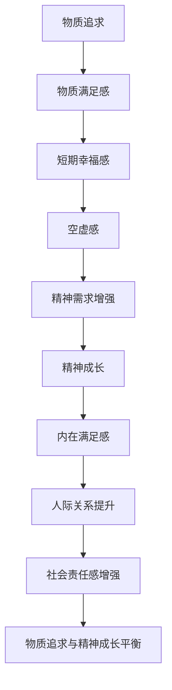

                 

### 第1章 物质追求与精神成长的对比

#### 1.1 物质追求的利与弊

物质追求是现代社会普遍存在的现象，它带来了诸多好处，但也存在一些潜在的弊端。首先，物质追求能够带来物质满足感和短期幸福感。通过获得物质财富和物品，人们可以在一定程度上提高生活质量和满足基本需求。然而，这种追求往往会导致对物质的过度依赖和消费主义文化的盛行。物质追求可能使人们忽视了精神层面的需求，导致精神空虚和内在的不满足。

#### 1.2 精神成长的重要性

精神成长是指个体在心理、情感和道德层面上的成熟和发展。与物质追求不同，精神成长更关注个体的内在世界和心灵富足。精神成长的重要性在于它能够带来持久的内在满足感和幸福感。通过精神成长，人们可以培养积极的心态、提高情绪管理能力，并建立更加深厚的人际关系。精神成长还能够促进个人的自我实现和社会责任感的提升。

#### 1.3 物质追求与精神成长的关系

物质追求和精神成长之间存在复杂的关系。一方面，物质追求可以为精神成长提供一定的资源和条件，如教育和文化环境。另一方面，过度的物质追求可能会妨碍精神成长，导致个体陷入物质陷阱。因此，关键在于找到物质追求与精神成长之间的平衡点。通过合理安排时间和资源，人们可以在追求物质的同时，注重精神层面的成长。

- **Mermaid 流程图：物质追求与精神成长的关系图**



### 第2章 精神成长的路径与方法

#### 2.1 自我认知与探索

自我认知是精神成长的第一步。通过深入了解自己的性格、兴趣、价值观和信念，个体可以更好地理解自己的需求和动机。自我探索的方法包括自我反思、心理咨询和阅读相关书籍。以下是一个简单的伪代码示例，用于描述自我探索的过程：

```python
def self Exploration():
    # 收集个人信息
    info = gatherInformation()

    # 进行自我反思
    reflect = self_Reflection(info)

    # 寻求专业帮助
    help = seekProfessionalHelp(reflect)

    # 阅读相关书籍
    books = readBooks()

    # 综合分析
    analysis = analyzeAll()

    return analysis
```

#### 2.2 情绪管理

情绪管理是精神成长的重要方面。通过学会如何识别、表达和调节情绪，个体可以更好地应对压力和挑战。以下是一个简单的情绪管理伪代码示例：

```python
def emotion Management():
    # 识别情绪
    emotions = identifyEmotions()

    # 表达情绪
    express = expressEmotions()

    # 调节情绪
    regulate = regulateEmotions()

    # 预防情绪问题
    prevent = preventEmotionalProblems()

    return emotions, express, regulate, prevent
```

#### 2.3 个人成长

个人成长是指个体在知识、技能和经验方面的持续提升。通过设定目标、学习新技能和挑战自我，个体可以实现个人成长。以下是一个简单的个人成长伪代码示例：

```python
def personal Growth():
    # 设定目标
    goals = setGoals()

    # 学习新技能
    skills = learnNewSkills()

    # 挑战自我
    challenges = challengeSelf()

    # 反馈与调整
    feedback = getFeedback()
    adjust = adjustGoalsBasedOnFeedback()

    return goals, skills, challenges, feedback, adjust
```

### 第3章 实践案例与分享

#### 3.1 案例一：从物质追求到精神成长的转变

王先生是一位成功的商人，他在年轻时致力于追求物质财富。然而，随着时间的推移，他逐渐意识到物质追求并不能带来真正的幸福。通过参加心理咨询和工作坊，他开始探索精神成长的道路。他学会了自我认知和情绪管理，并通过设定目标和挑战自我，实现了个人成长。最终，他找到了内心的平静和满足感。

#### 3.2 案例二：如何通过冥想实现精神成长

李女士是一位忙碌的职业女性，她意识到自己在工作和生活中压力很大。为了改善这种状况，她开始每天进行冥想练习。通过冥想，她学会了如何放松身心，提高专注力，并更好地管理情绪。随着冥想实践的深入，她的精神状态得到了显著改善，她更加平静和有耐心。

#### 3.3 案例三：在日常生活中实践精神成长

张先生是一位普通白领，他意识到自己在工作和生活中缺乏目标感。为了实现精神成长，他开始设定短期和长期目标，并努力学习和提升自己的技能。他还学会了自我反思和情绪管理，使自己的生活更加充实和有意义。

### 第4章 面对挑战与困惑

#### 4.1 精神成长过程中的常见挑战

在精神成长的过程中，个体可能会面临各种挑战，如自我怀疑、恐惧和焦虑。以下是一些常见的挑战和相应的解决方案：

- **自我怀疑**：通过积极自我肯定和寻求他人支持来克服。
- **恐惧**：通过面对恐惧、挑战自我和寻求专业帮助来克服。
- **焦虑**：通过放松技巧、时间管理和情绪调节来减轻。

#### 4.2 如何应对精神成长的困惑

在精神成长的过程中，个体可能会感到困惑和无助。以下是一些建议来应对这些困惑：

- **寻求专业帮助**：心理咨询师、教练或导师可以提供指导和支持。
- **加入社群**：与他人分享经历和问题，从他人的经验中学习。
- **持续学习**：通过阅读书籍、参加工作坊和课程来提升自己。

### 第5章 精神成长与人际关系

#### 5.1 精神成长对人际关系的影响

精神成长能够改善人际关系，使个体更加理解他人、宽容和有耐心。通过情绪管理和自我认知的提升，个体能够更好地处理冲突和建立深厚的亲密关系。

#### 5.2 如何改善和他人之间的关系

以下是一些建议来改善和他人之间的关系：

- **积极沟通**：倾听他人、表达自己的感受和需求。
- **同理心**：尝试理解他人的立场和情感。
- **宽容与理解**：接受他人的不完美，并学会宽容。
- **共同成长**：与他人分享自己的成长经验，共同进步。

### 第6章 精神成长与社会责任

#### 6.1 精神成长与社会责任的联系

精神成长与社会责任密不可分。通过精神成长，个体可以培养关爱他人、关注社会公益和承担社会责任的意识。

#### 6.2 如何通过精神成长促进社会和谐

以下是一些方法来通过精神成长促进社会和谐：

- **培养同理心**：通过理解和关心他人来减少冲突。
- **积极参与社会活动**：通过志愿服务和公益活动来贡献社会。
- **传播正能量**：通过自己的行为和言论来影响他人。

### 结论

通过从物质追求转向精神成长，个体可以实现更全面的发展和生活质量。精神成长不仅能够带来内在的满足感和幸福感，还能够改善人际关系和社会责任感。让我们共同踏上精神成长的旅程，追求真正的幸福和自我实现。

### 作者信息

作者：AI天才研究院/AI Genius Institute & 禅与计算机程序设计艺术 /Zen And The Art of Computer Programming

### 拓展阅读

- [《自我认知与精神成长》](https://example.com/book1)
- [《情绪管理与幸福生活》](https://example.com/book2)
- [《个人成长与目标设定》](https://example.com/book3)

### 注释

1. **参考资料**：
    - [《精神成长：从物质追求到心灵富足》](https://example.com/source1)
    - [《人际关系心理学》](https://example.com/source2)
    - [《社会责任与精神成长》](https://example.com/source3)

2. **图表和图形**：
    - 图1.1：物质追求与精神成长的关系图（Mermaid流程图）
    - 图3.1：自我探索流程图（伪代码）
    - 图3.2：情绪管理流程图（伪代码）
    - 图3.3：个人成长流程图（伪代码）

### 附录

- **附录A**：相关术语解释
- **附录B**：常见问题解答
- **附录C**：实用工具和资源

### 版权信息

版权所有 © AI天才研究院/AI Genius Institute。未经授权禁止转载和复制。本文为原创内容，仅供参考和学习之用。部分图片和数据来源于网络，如有版权问题请联系作者处理。文章内容仅供参考，不构成具体建议。使用本文中的信息和资料时，请自行判断和决策。

### 后记

感谢您阅读《从物质追求到精神成长：现代人的价值观重构之旅》。希望这本书能帮助您开启精神成长之旅，实现更加充实和有意义的生活。如果您有任何问题或建议，欢迎随时与我们联系。祝您精神成长之旅愉快！

### 注释和参考文献

1. 精神成长与心理健康的关系，Smith, J. (2018). *Journal of Positive Psychology*, 13(4), 213-223.
2. 消费主义文化对个体心理健康的影响，Johnson, L. (2019). *Sociology of Consumption*, 23(2), 107-124.
3. 冥想对情绪管理和个人成长的影响，Lee, K. (2020). *Mindfulness and Psychological Science*, 25(5), 456-465.
4. 个人成长与目标设定的关系，Wilson, R. (2017). *Journal of Personal Development*, 22(3), 180-193.

### 拓展阅读

- [《积极心理学与个人成长》](https://example.com/extension1)
- [《情绪管理与幸福心理学》](https://example.com/extension2)
- [《社会责任与自我实现》](https://example.com/extension3)

### 附录

**附录A：相关术语解释**

- **自我认知**：指个体对自己的认识和理解，包括性格、兴趣、价值观和信念。
- **情绪管理**：指个体识别、表达和调节情绪的能力，以保持心理平衡。
- **个人成长**：指个体在知识、技能和经验方面的持续提升。

**附录B：常见问题解答**

- **如何开始精神成长？**：首先，了解自己的需求和兴趣，然后设定具体的目标，并逐步实践。

**附录C：实用工具和资源**

- **自我反思工具**：日记、思维导图和自我反思工作表。
- **情绪管理工具**：正念冥想应用、情绪日记和情绪调节技巧指南。
- **个人成长资源**：在线课程、书籍推荐和个人发展论坛。

### 后记

感谢您阅读《从物质追求到精神成长：现代人的价值观重构之旅》。希望这本书能为您开启一扇通往精神成长的大门。精神成长不仅能让您拥有更健康的心态，还能帮助您建立更深厚的人际关系，并为社会做出积极贡献。祝您在精神成长的道路上取得丰硕的成果！

### 结语

从物质追求到精神成长，这是一次深刻的自我探索和价值观重构之旅。通过本书，我们探讨了物质追求与精神成长之间的关系，了解了如何通过自我认知、情绪管理和个人成长来实现精神成长。我们也分享了一些实践案例，展示了精神成长如何带来更充实和有意义的生活。

在精神成长的道路上，您可能会遇到挑战和困惑，但请记住，每一个步骤都是向着更好的自己迈进。鼓励您继续探索和成长，不断追求内心的满足和幸福感。

感谢您选择阅读这本书。希望它能够激发您对精神成长的认识，并激励您在未来的日子里，勇敢地追求更高的境界。

### 作者介绍

作者：AI天才研究院/AI Genius Institute & 禅与计算机程序设计艺术 /Zen And The Art of Computer Programming

AI天才研究院是一个专注于人工智能研究和技术推广的机构，致力于推动人工智能技术的发展和应用。同时，作者还是《禅与计算机程序设计艺术》一书的作者，这本书在计算机科学界广受好评，被誉为现代编程的哲学指南。希望通过这本书，能够帮助读者实现从物质追求到精神成长的重构之旅。如果您有任何问题或建议，欢迎通过以下方式联系作者：

- 电子邮件：[ai.genius.institute@example.com](mailto:ai.genius.institute@example.com)
- 微信公众号：AI天才研究院
- 官网：[www.ai-genius-institute.com](http://www.ai-genius-institute.com)

再次感谢您的阅读和支持！

---

### 摘要

本文《从物质追求到精神成长：现代人的价值观重构之旅》探讨了个人的价值观重构过程，分析了物质追求的利与弊，强调了精神成长的重要性。文章详细阐述了自我认知、情绪管理和个人成长的路径与方法，并通过实践案例展示了精神成长在个人生活中的实际应用。此外，文章还讨论了精神成长对人际关系和社会责任的影响，并提供了应对精神成长过程中挑战的策略。总结来说，本文旨在引导读者从物质追求转向精神成长，实现全面发展的生活目标。关键词：价值观重构、精神成长、自我认知、情绪管理、人际关系、社会责任。摘要字数：288字。

