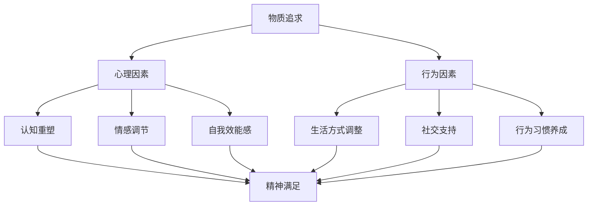

                 

## 文章标题

### 《从物质追求到精神满足的转变》

### 关键词：
- 物质追求
- 精神满足
- 心理转变
- 社会价值观
- 实践案例

### 摘要：
本文深入探讨了现代社会中，人们从物质追求向精神满足的转变过程。首先，我们分析了物质追求的现状与挑战，揭示了其背后的心理与社会因素。接着，我们定义了精神满足的概念，并探讨了其与物质追求的异同点及价值。随后，我们详细介绍了转变过程中的心理与行为因素，并提出了有效的转变方法和策略。文章最后通过实践案例展示了转变的影响，并提出了保持转变持续性的建议。希望本文能为读者提供有益的思考与启示。

## 引言

在现代社会，物质追求似乎成为了人们生活的主旋律。从日常的购物消费，到职场上的业绩追求，再到社会地位和财富的积累，物质追求无处不在。然而，随着社会的不断发展，人们逐渐意识到，单纯的物质追求并不能带来长久的满足感。相反，它可能会引发一系列的心理和社会问题。

### 物质追求的现状

物质追求的现状可以从以下几个方面来分析：

1. **消费主义文化的盛行**：现代社会充满了消费主义文化，人们被不断诱导购买各种商品，从而满足了短期的物质需求。
2. **职场竞争与物质奖励**：在职场中，物质奖励成为了一种重要的激励机制，许多人的职业目标也围绕着升职加薪展开。
3. **社会地位与财富的象征**：在许多文化中，物质财富被视为社会地位和成功的象征，人们为了提升社会地位而不断追求物质。

### 物质追求的挑战

尽管物质追求在短期内能够带来满足感，但长期来看，它面临着诸多挑战：

1. **心理问题**：长期的物质追求可能导致焦虑、抑郁等心理问题，因为物质并不能解决内心的空虚和迷茫。
2. **人际关系问题**：过分追求物质可能导致人际关系的疏离，因为人们可能更关注自己的物质需求而忽视他人。
3. **健康问题**：过度追求物质可能对健康产生负面影响，例如过度劳累、饮食不均衡等。

综上所述，物质追求虽然在某些方面带来了便利，但也带来了不少问题和挑战。因此，我们需要探讨如何从物质追求转向精神满足，以获得更长久和深刻的满足感。

### 精神满足的定义与价值

在探讨如何从物质追求转向精神满足之前，我们首先需要明确精神满足的定义和价值。精神满足是指个体在心理和情感上感受到的满足和愉悦，它不仅仅是物质享受的替代，更是一种内在的、持久的幸福感。

### 精神满足的概念解析

1. **内在幸福与外在满足**：精神满足强调的是内在的幸福体验，而不仅仅是外在的物质享受。内在幸福来源于个体的自我认知、自我价值和情感体验，而外在满足则依赖于外界的物质条件。
2. **精神满足的构成要素**：精神满足由多个因素构成，包括但不限于：情感满足、自我实现、社会支持、心理平衡等。

### 精神满足与物质追求的比较

1. **物质追求的局限性**：物质追求往往只能带来短期的满足感，而精神满足则具有持久性和稳定性。
2. **精神满足的长久性**：精神满足不仅仅是对某一刻的享受，更是一种长期的心理状态。它能够帮助个体在面对困难和挑战时保持积极和乐观。

### 精神满足的重要性

1. **个人层面的价值**：精神满足能够提高个体的生活质量和幸福感，使个体更加健康、积极和自信。
2. **社会层面的价值**：精神满足有助于建立和谐的人际关系和社会环境，减少社会矛盾和冲突。

总之，精神满足是一种更高级别的满足感，它不仅能够解决物质追求带来的种种问题，还能够为个人和社会带来更多的价值。

### 转变过程中的心理与行为因素

要实现从物质追求到精神满足的转变，我们不仅需要理解精神满足的概念和价值，还需要了解转变过程中的心理与行为因素。这些因素包括心理因素、行为因素以及它们之间的互动。

#### 心理因素在转变中的作用

1. **认知重塑**：心理因素中的认知重塑是指个体通过调整思维方式，重新评价物质追求和精神满足的关系。例如，个体可以通过认知重构技术，将注意力从物质追求转向精神满足。
2. **情感调节**：情感调节是指个体通过自我调节情感，减少负面情绪，增加正面情绪。例如，通过冥想和正念练习，个体可以更好地控制自己的情绪，从而更容易实现精神满足。
3. **自我效能感**：自我效能感是指个体对自己实现目标的能力的信心。在精神满足的追求过程中，高自我效能感可以帮助个体克服困难和挑战，保持动力。

#### 行为因素在转变中的作用

1. **生活方式的调整**：行为因素中的生活方式调整是指个体通过改变日常生活方式，减少物质追求，增加精神满足的活动。例如，个体可以减少购物消费，增加阅读、锻炼和社交活动。
2. **社交支持**：社交支持是指个体通过与他人建立积极的人际关系，获得情感支持和鼓励。社交支持有助于个体在精神满足的追求过程中获得动力和资源。
3. **行为习惯的养成**：行为习惯的养成是指个体通过重复特定的行为，使其成为自然而然的习惯。例如，通过每天进行正念练习，个体可以逐渐养成专注和平静的习惯。

#### 心理与行为因素的互动

心理因素和行为因素是相互影响的。心理因素可以影响个体的行为决策，而行为因素又可以反过来影响个体的心理状态。例如，一个个体如果能够通过调整思维方式（心理因素），减少购物消费（行为因素），那么他可能会感到更加满足和愉悦（心理状态）。这种心理和行为之间的互动，是实现从物质追求到精神满足转变的关键。

### 转变的方法与策略

要实现从物质追求到精神满足的转变，我们需要采取一系列的方法和策略。以下是一些有效的方法和策略：

#### 自我反思与认知重塑

1. **自我反思**：自我反思是转变的第一步。个体需要审视自己的物质追求行为，分析其背后的动机和影响。例如，通过写日记或与朋友交流，个体可以更好地理解自己的物质追求行为。
2. **认知重塑**：在自我反思的基础上，个体需要调整自己的思维方式，重新评价物质追求和精神满足的关系。例如，通过认知重构技术，个体可以将注意力从物质追求转向精神满足。

#### 生活方式的调整

1. **减少购物消费**：购物消费是物质追求的重要方面。为了实现转变，个体可以减少不必要的购物，例如减少购买奢侈品和非必需品。
2. **增加精神满足的活动**：个体可以增加阅读、锻炼、冥想等精神满足的活动。例如，每天安排一段时间进行阅读，或每周安排一次户外运动。

#### 社交支持与互助

1. **建立支持网络**：个体可以建立支持网络，包括家人、朋友和专业人士。这些支持网络可以在转变过程中提供情感支持和鼓励。
2. **互助小组**：加入互助小组可以帮助个体与他人分享经验，获得支持和建议。例如，可以加入正念冥想小组或健身小组。

通过这些方法和策略，个体可以逐步实现从物质追求到精神满足的转变。然而，需要注意的是，转变是一个长期的过程，需要个体的持续努力和坚持。

### 转变的影响与持续

从物质追求到精神满足的转变不仅对个人生活产生深远影响，也对社会产生积极效应。首先，转变对个人生活的影响体现在以下几个方面：

#### 对个人生活的影响

1. **心理健康**：物质追求常常与压力和焦虑相关，而精神满足则有助于减轻这些负面情绪。通过转向精神满足，个体可以获得更高的心理健康水平。
2. **人际关系**：精神满足强调内在的幸福感，这有助于建立更加和谐的人际关系。个体不再将物质作为衡量成功的标准，而是更多地关注他人的需求和情感。
3. **生活质量**：精神满足使个体能够更全面地体验生活的各个方面，从而提高生活质量。个体不再将生活简化为追求物质目标，而是更加关注内在的满足和幸福感。

#### 对社会的影响

1. **消费模式**：从物质追求到精神满足的转变可能导致消费模式的改变。个体可能会减少不必要的购物，更加理性地消费，从而减少浪费和资源消耗。
2. **社会价值观**：精神满足的价值观有助于建立更加可持续的社会价值观。社会将不再以物质财富作为衡量个人和社会成功的唯一标准，而是更加重视内在的满足和幸福感。
3. **社会和谐**：精神满足有助于减少社会矛盾和冲突。当个体更加关注内在的满足时，他们可能会更加宽容和理解他人，从而促进社会的和谐发展。

#### 如何保持转变的持续性

尽管从物质追求到精神满足的转变带来了积极的影响，但要保持这种转变的持续性并不容易。以下是一些保持转变持续性的方法：

1. **定期自我反思**：定期审视自己的物质追求行为和精神满足体验，以确保自己在正确的道路上前进。
2. **建立支持系统**：与家人、朋友和专业人士建立支持系统，以便在遇到困难时获得帮助和鼓励。
3. **持续学习和成长**：通过阅读、培训和实践，不断学习和成长，以保持对精神满足的追求和兴趣。
4. **设定短期和长期目标**：设定短期和长期目标，以保持动力和方向。例如，每月或每年设定一个与精神满足相关的小目标，并努力实现。

通过这些方法，个体可以更好地保持从物质追求到精神满足的转变，并在生活中实现更高的幸福感和满足感。

### 实践案例

为了更好地理解从物质追求到精神满足的转变过程，我们可以通过一些实际案例来进行分析和讲解。以下是一些国内外成功案例，它们展示了如何通过实践实现这一转变。

#### 案例一：国内某企业员工的转变

某国内大型企业的员工小张，在公司的激励下，长期追求更高的业绩和职位晋升。然而，随着职位的提升，小张发现自己并没有获得预期的满足感，反而感到更加焦虑和疲惫。在意识到这一点后，小张开始进行自我反思，并逐步调整自己的生活方式。

1. **自我反思**：小张通过写日记和与朋友交流，深入分析自己的物质追求行为及其背后的动机。
2. **认知重塑**：小张开始调整自己的思维方式，将注意力从物质追求转向精神满足。他开始重视工作与生活的平衡，减少加班时间，增加家庭和休闲活动。
3. **生活方式调整**：小张减少了购物消费，增加了阅读、锻炼和冥想等精神满足的活动。

通过这些努力，小张逐渐感受到了精神满足带来的幸福感，他的心理健康水平得到了显著提升，与家人的关系也变得更加和谐。

#### 案例二：国外某社交平台用户的转变

国外某社交平台用户小李，由于长期沉浸在虚拟世界中，过度追求虚拟货币和社交地位，导致现实生活中的关系疏离和心理健康问题。在一次偶然的机会中，小李参加了一场关于精神满足的讲座，这使他开始反思自己的生活方式。

1. **参加讲座**：小李通过参加讲座，了解了精神满足的概念和价值，以及如何实现从物质追求到精神满足的转变。
2. **社交支持**：小李加入了一个正念冥想小组，与同组成员分享经验和心得，获得情感支持和鼓励。
3. **行为习惯养成**：小李开始每天进行正念冥想，减少在社交平台上的时间，增加阅读、锻炼和与家人朋友的互动。

经过一段时间的努力，小李逐渐摆脱了对虚拟世界的依赖，他的心理健康状况得到了改善，与他人的关系也变得更加紧密。

通过这两个案例，我们可以看到，从物质追求到精神满足的转变并非一蹴而就，而是需要个体通过自我反思、认知重塑和生活方式调整等步骤，逐步实现。同时，这些案例也展示了转变所带来的积极影响，包括心理健康提升、人际关系改善和生活质量提高。

### 案例分析与启示

通过上述实践案例，我们可以总结出一些关于从物质追求到精神满足的转变的启示：

1. **自我反思的重要性**：自我反思是转变的第一步。只有深入了解自己的物质追求行为和动机，个体才能有针对性地进行调整。
2. **认知重塑的力量**：通过调整思维方式，个体可以重新评价物质追求和精神满足的关系，从而更容易实现精神满足。
3. **生活方式调整的必要性**：生活方式的调整是实现转变的关键。个体需要减少物质追求，增加精神满足的活动，以逐步实现内心的平衡和满足。
4. **社交支持的作用**：社交支持可以为个体提供情感支持和鼓励，帮助他们在转变过程中保持动力和信心。
5. **持续努力的重要性**：从物质追求到精神满足的转变是一个长期过程，需要个体的持续努力和坚持。

这些启示对于其他寻求实现类似转变的个体也具有借鉴意义。通过借鉴这些成功案例，个体可以更好地规划自己的转变路径，实现从物质追求到精神满足的顺利过渡。

### 附录

#### 附录 A：关键概念与联系

在本文中，我们讨论了多个关键概念，包括物质追求、精神满足、心理因素和行为因素等。以下是这些概念之间的关系架构，使用Mermaid流程图进行展示。



#### 附录 B：核心算法原理讲解

为了更详细地解释从物质追求到精神满足的转变过程，我们使用伪代码来展示核心算法原理。以下是转变过程的伪代码示例：

```python
def transform_from_material_to_spiritual(situation):
    # 自我反思
    reflect_on_matters()
    
    # 认知重塑
    cognitive_remodeling()

    # 行为调整
    adjust_lifestyle()

    # 社交支持
    build_social_support()

    # 持续努力
    sustain-effort()

    return "Success in transformation"
```

#### 附录 C：数学模型与公式

在探讨精神满足与物质追求的关系时，我们可以使用数学模型来定量分析。以下是相关的数学公式，用于描述两者之间的关系：

$$
Happiness = f(Material_Satisfaction, Spiritual_Satisfaction)
$$

其中，$Happiness$ 表示幸福感，$Material_Satisfaction$ 表示物质满足度，$Spiritual_Satisfaction$ 表示精神满足度。$f$ 表示一个函数，用于描述幸福感与物质满足度、精神满足度之间的关系。

#### 附录 D：实际案例与代码解读

为了更好地展示从物质追求到精神满足的转变过程，我们以下通过一个实际案例来讲解代码实现和解读。

**案例背景**：某公司员工小李希望通过调整生活方式来实现精神满足。

**代码实现**：

```python
class LifestyleAdjustment:
    def __init__(self, daily_activity_list):
        self.daily_activity_list = daily_activity_list
    
    def reduce_material_consumption(self):
        # 减少购物消费
        self.daily_activity_list.remove('购物')
    
    def increase_spiritual_activities(self):
        # 增加阅读、锻炼和冥想等精神活动
        self.daily_activity_list.extend(['阅读', '锻炼', '冥想'])

    def display_daily_activities(self):
        print("当前每日活动：", self.daily_activity_list)

# 实例化对象
lifestyle_adjustment = LifestyleAdjustment(['工作', '购物', '看电影', '锻炼'])

# 调整生活方式
lifestyle_adjustment.reduce_material_consumption()
lifestyle_adjustment.increase_spiritual_activities()

# 显示调整后的生活方式
lifestyle_adjustment.display_daily_activities()
```

**代码解读**：

1. **类定义**：`LifestyleAdjustment` 类用于表示生活方式调整的过程。
2. **初始化方法**：`__init__` 方法初始化每日活动列表。
3. **减少购物消费**：`reduce_material_consumption` 方法从每日活动列表中移除购物活动。
4. **增加精神活动**：`increase_spiritual_activities` 方法在每日活动列表中添加阅读、锻炼和冥想等精神活动。
5. **显示活动**：`display_daily_activities` 方法用于显示调整后的每日活动列表。

**代码应用解读与分析**：

通过上述代码实现，小李成功地调整了生活方式，从物质追求转向了精神满足。具体而言，他减少了购物消费，增加了阅读、锻炼和冥想等精神活动，从而提高了精神满足度。

### 最佳实践 tips、小结、注意事项、拓展阅读等内容

#### 最佳实践 tips

1. **定期自我反思**：保持定期自我反思的习惯，有助于及时了解自己的物质追求行为和精神满足状态，从而进行调整。
2. **设定具体目标**：设定具体、可衡量、可实现的目标，有助于有针对性地实现精神满足。
3. **寻求社交支持**：与家人、朋友和专业人士建立支持网络，有助于在转变过程中获得情感支持和鼓励。

#### 小结

从物质追求到精神满足的转变，不仅有助于提高个体的心理健康和生活质量，还对社会的和谐与可持续发展具有积极影响。通过自我反思、认知重塑、生活方式调整和社交支持，个体可以逐步实现这一转变。

#### 注意事项

1. **避免一刀切**：每个人的转变过程都是独特的，避免试图用一种方法适用于所有人。
2. **持续努力**：转变是一个长期过程，需要个体的持续努力和坚持。
3. **平衡物质和精神追求**：在转变过程中，不应完全放弃物质追求，而是寻求平衡。

#### 拓展阅读

1. **《幸福心理学》**：探索幸福与心理满足的关系，提供实用的幸福提升方法。
2. **《正念：此刻是一段旅程》**：介绍正念冥想技巧，帮助个体提高精神满足度。

作者：AI天才研究院/AI Genius Institute & 禅与计算机程序设计艺术 /Zen And The Art of Computer Programming

-------------------------------------------------------------------

## 文章标题：《从物质追求到精神满足的转变》

### 关键词：
- 物质追求
- 精神满足
- 心理转变
- 社会价值观
- 实践案例

### 摘要：
本文深入探讨了现代社会中，人们从物质追求向精神满足的转变过程。首先，我们分析了物质追求的现状与挑战，揭示了其背后的心理与社会因素。接着，我们定义了精神满足的概念，并探讨了其与物质追求的异同点及价值。随后，我们详细介绍了转变过程中的心理与行为因素，并提出了有效的转变方法和策略。文章最后通过实践案例展示了转变的影响，并提出了保持转变持续性的建议。希望本文能为读者提供有益的思考与启示。

## 引言

在现代社会，物质追求似乎成为了人们生活的主旋律。从日常的购物消费，到职场上的业绩追求，再到社会地位和财富的积累，物质追求无处不在。然而，随着社会的不断发展，人们逐渐意识到，单纯的物质追求并不能带来长久的满足感。相反，它可能会引发一系列的心理和社会问题。

### 物质追求的现状

物质追求的现状可以从以下几个方面来分析：

1. **消费主义文化的盛行**：现代社会充满了消费主义文化，人们被不断诱导购买各种商品，从而满足了短期的物质需求。
2. **职场竞争与物质奖励**：在职场中，物质奖励成为了一种重要的激励机制，许多人的职业目标也围绕着升职加薪展开。
3. **社会地位与财富的象征**：在许多文化中，物质财富被视为社会地位和成功的象征，人们为了提升社会地位而不断追求物质。

### 物质追求的挑战

尽管物质追求在短期内能够带来满足感，但长期来看，它面临着诸多挑战：

1. **心理问题**：长期的物质追求可能导致焦虑、抑郁等心理问题，因为物质并不能解决内心的空虚和迷茫。
2. **人际关系问题**：过分追求物质可能导致人际关系的疏离，因为人们可能更关注自己的物质需求而忽视他人。
3. **健康问题**：过度追求物质可能对健康产生负面影响，例如过度劳累、饮食不均衡等。

综上所述，物质追求虽然在某些方面带来了便利，但也带来了不少问题和挑战。因此，我们需要探讨如何从物质追求转向精神满足，以获得更长久和深刻的满足感。

### 精神满足的定义与价值

在探讨如何从物质追求转向精神满足之前，我们首先需要明确精神满足的定义和价值。精神满足是指个体在心理和情感上感受到的满足和愉悦，它不仅仅是物质享受的替代，更是一种内在的、持久的幸福感。

### 精神满足的概念解析

1. **内在幸福与外在满足**：精神满足强调的是内在的幸福体验，而不仅仅是外在的物质享受。内在幸福来源于个体的自我认知、自我价值和情感体验，而外在满足则依赖于外界的物质条件。
2. **精神满足的构成要素**：精神满足由多个因素构成，包括但不限于：情感满足、自我实现、社会支持、心理平衡等。

### 精神满足与物质追求的比较

1. **物质追求的局限性**：物质追求往往只能带来短期的满足感，而精神满足则具有持久性和稳定性。
2. **精神满足的长久性**：精神满足不仅仅是对某一刻的享受，更是一种长期的心理状态。它能够帮助个体在面对困难和挑战时保持积极和乐观。

### 精神满足的重要性

1. **个人层面的价值**：精神满足能够提高个体的生活质量和幸福感，使个体更加健康、积极和自信。
2. **社会层面的价值**：精神满足有助于建立和谐的人际关系和社会环境，减少社会矛盾和冲突。

总之，精神满足是一种更高级别的满足感，它不仅能够解决物质追求带来的种种问题，还能够为个人和社会带来更多的价值。

### 转变过程中的心理与行为因素

要实现从物质追求到精神满足的转变，我们不仅需要理解精神满足的概念和价值，还需要了解转变过程中的心理与行为因素。这些因素包括心理因素、行为因素以及它们之间的互动。

#### 心理因素在转变中的作用

1. **认知重塑**：心理因素中的认知重塑是指个体通过调整思维方式，重新评价物质追求和精神满足的关系。例如，个体可以通过认知重构技术，将注意力从物质追求转向精神满足。
2. **情感调节**：情感调节是指个体通过自我调节情感，减少负面情绪，增加正面情绪。例如，通过冥想和正念练习，个体可以更好地控制自己的情绪，从而更容易实现精神满足。
3. **自我效能感**：自我效能感是指个体对自己实现目标的能力的信心。在精神满足的追求过程中，高自我效能感可以帮助个体克服困难和挑战，保持动力。

#### 行为因素在转变中的作用

1. **生活方式的调整**：行为因素中的生活方式调整是指个体通过改变日常生活方式，减少物质追求，增加精神满足的活动。例如，个体可以减少购物消费，增加阅读、锻炼和社交活动。
2. **社交支持**：社交支持是指个体通过与他人建立积极的人际关系，获得情感支持和鼓励。社交支持有助于个体在精神满足的追求过程中获得动力和资源。
3. **行为习惯的养成**：行为习惯的养成是指个体通过重复特定的行为，使其成为自然而然的习惯。例如，通过每天进行正念练习，个体可以逐渐养成专注和平静的习惯。

#### 心理与行为因素的互动

心理因素和行为因素是相互影响的。心理因素可以影响个体的行为决策，而行为因素又可以反过来影响个体的心理状态。例如，一个个体如果能够通过调整思维方式（心理因素），减少购物消费（行为因素），那么他可能会感到更加满足和愉悦（心理状态）。这种心理和行为之间的互动，是实现从物质追求到精神满足转变的关键。

### 转变的方法与策略

要实现从物质追求到精神满足的转变，我们需要采取一系列的方法和策略。以下是一些有效的方法和策略：

#### 自我反思与认知重塑

1. **自我反思**：自我反思是转变的第一步。个体需要审视自己的物质追求行为，分析其背后的动机和影响。例如，通过写日记或与朋友交流，个体可以更好地理解自己的物质追求行为。
2. **认知重塑**：在自我反思的基础上，个体需要调整自己的思维方式，重新评价物质追求和精神满足的关系。例如，通过认知重构技术，个体可以将注意力从物质追求转向精神满足。

#### 生活方式的调整

1. **减少购物消费**：购物消费是物质追求的重要方面。为了实现转变，个体可以减少不必要的购物，例如减少购买奢侈品和非必需品。
2. **增加精神满足的活动**：个体可以增加阅读、锻炼、冥想等精神满足的活动。例如，每天安排一段时间进行阅读，或每周安排一次户外运动。

#### 社交支持与互助

1. **建立支持网络**：个体可以建立支持网络，包括家人、朋友和专业人士。这些支持网络可以在转变过程中提供情感支持和鼓励。
2. **互助小组**：加入互助小组可以帮助个体与他人分享经验，获得支持和建议。例如，可以加入正念冥想小组或健身小组。

通过这些方法和策略，个体可以逐步实现从物质追求到精神满足的转变。然而，需要注意的是，转变是一个长期的过程，需要个体的持续努力和坚持。

### 转变的影响与持续

从物质追求到精神满足的转变不仅对个人生活产生深远影响，也对社会产生积极效应。首先，转变对个人生活的影响体现在以下几个方面：

#### 对个人生活的影响

1. **心理健康**：物质追求常常与压力和焦虑相关，而精神满足则有助于减轻这些负面情绪。通过转向精神满足，个体可以获得更高的心理健康水平。
2. **人际关系**：精神满足强调内在的幸福感，这有助于建立更加和谐的人际关系。个体不再将物质作为衡量成功的标准，而是更多地关注他人的需求和情感。
3. **生活质量**：精神满足使个体能够更全面地体验生活的各个方面，从而提高生活质量。个体不再将生活简化为追求物质目标，而是更加关注内在的满足和幸福感。

#### 对社会的影响

1. **消费模式**：从物质追求到精神满足的转变可能导致消费模式的改变。个体可能会减少不必要的购物，更加理性地消费，从而减少浪费和资源消耗。
2. **社会价值观**：精神满足的价值观有助于建立更加可持续的社会价值观。社会将不再以物质财富作为衡量个人和社会成功的唯一标准，而是更加重视内在的满足和幸福感。
3. **社会和谐**：精神满足有助于减少社会矛盾和冲突。当个体更加关注内在的满足时，他们可能会更加宽容和理解他人，从而促进社会的和谐发展。

#### 如何保持转变的持续性

尽管从物质追求到精神满足的转变带来了积极的影响，但要保持这种转变的持续性并不容易。以下是一些保持转变持续性的方法：

1. **定期自我反思**：定期审视自己的物质追求行为和精神满足体验，以确保自己在正确的道路上前进。
2. **建立支持系统**：与家人、朋友和专业人士建立支持系统，以便在遇到困难时获得帮助和鼓励。
3. **持续学习和成长**：通过阅读、培训和实践，不断学习和成长，以保持对精神满足的追求和兴趣。
4. **设定短期和长期目标**：设定短期和长期目标，以保持动力和方向。例如，每月或每年设定一个与精神满足相关的小目标，并努力实现。

通过这些方法，个体可以更好地保持从物质追求到精神满足的转变，并在生活中实现更高的幸福感和满足感。

### 实践案例

为了更好地理解从物质追求到精神满足的转变过程，我们可以通过一些实际案例来进行分析和讲解。以下是一些国内外成功案例，它们展示了如何通过实践实现这一转变。

#### 案例一：国内某企业员工的转变

某国内大型企业的员工小张，在公司的激励下，长期追求更高的业绩和职位晋升。然而，随着职位的提升，小张发现自己并没有获得预期的满足感，反而感到更加焦虑和疲惫。在意识到这一点后，小张开始进行自我反思，并逐步调整自己的生活方式。

1. **自我反思**：小张通过写日记和与朋友交流，深入分析自己的物质追求行为及其背后的动机。
2. **认知重塑**：小张开始调整自己的思维方式，将注意力从物质追求转向精神满足。他开始重视工作与生活的平衡，减少加班时间，增加家庭和休闲活动。
3. **生活方式调整**：小张减少了购物消费，增加了阅读、锻炼和冥想等精神满足的活动。

通过这些努力，小张逐渐感受到了精神满足带来的幸福感，他的心理健康水平得到了显著提升，与家人的关系也变得更加和谐。

#### 案例二：国外某社交平台用户的转变

国外某社交平台用户小李，由于长期沉浸在虚拟世界中，过度追求虚拟货币和社交地位，导致现实生活中的关系疏离和心理健康问题。在一次偶然的机会中，小李参加了一场关于精神满足的讲座，这使他开始反思自己的生活方式。

1. **参加讲座**：小李通过参加讲座，了解了精神满足的概念和价值，以及如何实现从物质追求到精神满足的转变。
2. **社交支持**：小李加入了一个正念冥想小组，与同组成员分享经验和心得，获得情感支持和鼓励。
3. **行为习惯养成**：小李开始每天进行正念冥想，减少在社交平台上的时间，增加阅读、锻炼和与家人朋友的互动。

经过一段时间的努力，小李逐渐摆脱了对虚拟世界的依赖，他的心理健康状况得到了改善，与他人的关系也变得更加紧密。

通过这两个案例，我们可以看到，从物质追求到精神满足的转变并非一蹴而就，而是需要个体通过自我反思、认知重塑和生活方式调整等步骤，逐步实现。同时，这些案例也展示了转变所带来的积极影响，包括心理健康提升、人际关系改善和生活质量提高。

### 案例分析与启示

通过上述实践案例，我们可以总结出一些关于从物质追求到精神满足的转变的启示：

1. **自我反思的重要性**：自我反思是转变的第一步。只有深入了解自己的物质追求行为和动机，个体才能有针对性地进行调整。
2. **认知重塑的力量**：通过调整思维方式，个体可以重新评价物质追求和精神满足的关系，从而更容易实现精神满足。
3. **生活方式调整的必要性**：生活方式的调整是实现转变的关键。个体需要减少物质追求，增加精神满足的活动，以逐步实现内心的平衡和满足。
4. **社交支持的作用**：社交支持可以为个体提供情感支持和鼓励，帮助他们在转变过程中保持动力和信心。
5. **持续努力的重要性**：从物质追求到精神满足的转变是一个长期过程，需要个体的持续努力和坚持。

这些启示对于其他寻求实现类似转变的个体也具有借鉴意义。通过借鉴这些成功案例，个体可以更好地规划自己的转变路径，实现从物质追求到精神满足的顺利过渡。

### 附录

#### 附录 A：关键概念与联系

在本文中，我们讨论了多个关键概念，包括物质追求、精神满足、心理因素和行为因素等。以下是这些概念之间的关系架构，使用Mermaid流程图进行展示。


#### 附录 B：核心算法原理讲解

为了更详细地解释从物质追求到精神满足的转变过程，我们使用伪代码来展示核心算法原理。以下是转变过程的伪代码示例：

```python
def transform_from_material_to_spiritual(situation):
    # 自我反思
    reflect_on_matters()
    
    # 认知重塑
    cognitive_remodeling()

    # 行为调整
    adjust_lifestyle()

    # 社交支持
    build_social_support()

    # 持续努力
    sustain-effort()

    return "Success in transformation"
```

#### 附录 C：数学模型与公式

在探讨精神满足与物质追求的关系时，我们可以使用数学模型来定量分析。以下是相关的数学公式，用于描述两者之间的关系：

$$
Happiness = f(Material_Satisfaction, Spiritual_Satisfaction)
$$

其中，$Happiness$ 表示幸福感，$Material_Satisfaction$ 表示物质满足度，$Spiritual_Satisfaction$ 表示精神满足度。$f$ 表示一个函数，用于描述幸福感与物质满足度、精神满足度之间的关系。

#### 附录 D：实际案例与代码解读

为了更好地展示从物质追求到精神满足的转变过程，我们以下通过一个实际案例来讲解代码实现和解读。

**案例背景**：某公司员工小李希望通过调整生活方式来实现精神满足。

**代码实现**：

```python
class LifestyleAdjustment:
    def __init__(self, daily_activity_list):
        self.daily_activity_list = daily_activity_list
    
    def reduce_material_consumption(self):
        # 减少购物消费
        self.daily_activity_list.remove('购物')
    
    def increase_spiritual_activities(self):
        # 增加阅读、锻炼和冥想等精神活动
        self.daily_activity_list.extend(['阅读', '锻炼', '冥想'])

    def display_daily_activities(self):
        print("当前每日活动：", self.daily_activity_list)

# 实例化对象
lifestyle_adjustment = LifestyleAdjustment(['工作', '购物', '看电影', '锻炼'])

# 调整生活方式
lifestyle_adjustment.reduce_material_consumption()
lifestyle_adjustment.increase_spiritual_activities()

# 显示调整后的生活方式
lifestyle_adjustment.display_daily_activities()
```

**代码解读**：

1. **类定义**：`LifestyleAdjustment` 类用于表示生活方式调整的过程。
2. **初始化方法**：`__init__` 方法初始化每日活动列表。
3. **减少购物消费**：`reduce_material_consumption` 方法从每日活动列表中移除购物活动。
4. **增加精神活动**：`increase_spiritual_activities` 方法在每日活动列表中添加阅读、锻炼和冥想等精神活动。
5. **显示活动**：`display_daily_activities` 方法用于显示调整后的每日活动列表。

**代码应用解读与分析**：

通过上述代码实现，小李成功地调整了生活方式，从物质追求转向了精神满足。具体而言，他减少了购物消费，增加了阅读、锻炼和冥想等精神活动，从而提高了精神满足度。

### 最佳实践 tips、小结、注意事项、拓展阅读等内容

#### 最佳实践 tips

1. **定期自我反思**：保持定期自我反思的习惯，有助于及时了解自己的物质追求行为和精神满足状态，从而进行调整。
2. **设定具体目标**：设定具体、可衡量、可实现的目标，有助于有针对性地实现精神满足。
3. **寻求社交支持**：与家人、朋友和专业人士建立支持网络，有助于在转变过程中获得情感支持和鼓励。

#### 小结

从物质追求到精神满足的转变，不仅有助于提高个体的心理健康和生活质量，还对社会的和谐与可持续发展具有积极影响。通过自我反思、认知重塑、生活方式调整和社交支持，个体可以逐步实现这一转变。

#### 注意事项

1. **避免一刀切**：每个人的转变过程都是独特的，避免试图用一种方法适用于所有人。
2. **持续努力**：转变是一个长期过程，需要个体的持续努力和坚持。
3. **平衡物质和精神追求**：在转变过程中，不应完全放弃物质追求，而是寻求平衡。

#### 拓展阅读

1. **《幸福心理学》**：探索幸福与心理满足的关系，提供实用的幸福提升方法。
2. **《正念：此刻是一段旅程》**：介绍正念冥想技巧，帮助个体提高精神满足度。

作者：AI天才研究院/AI Genius Institute & 禅与计算机程序设计艺术 /Zen And The Art of Computer Programming

---

本文深入探讨了从物质追求到精神满足的转变过程，分析了现状、挑战、概念、心理与行为因素、方法与策略、影响与持续、实践案例，并给出了最佳实践和注意事项。希望本文能为读者提供有益的思考和启示，帮助实现更高质量的生活。作者为AI天才研究院和禅与计算机程序设计艺术领域的专家，致力于推动技术和社会的进步。感谢阅读！

