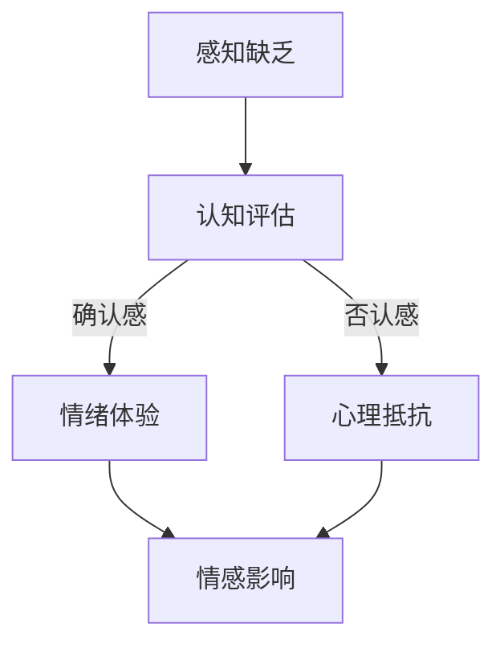
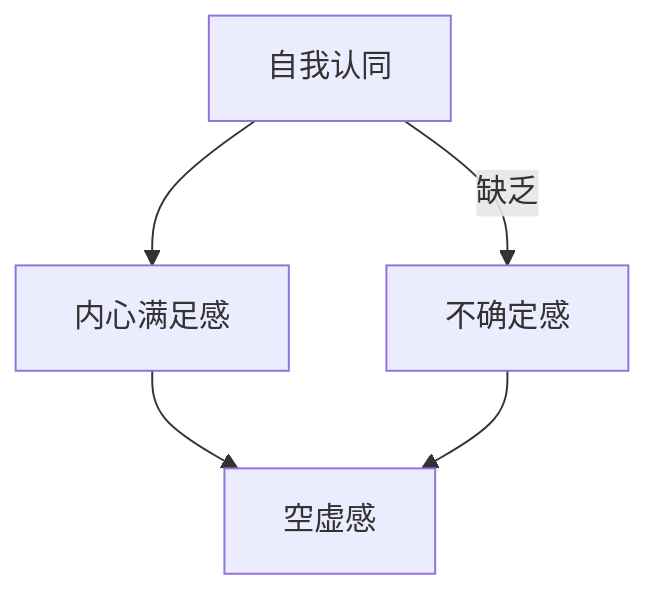
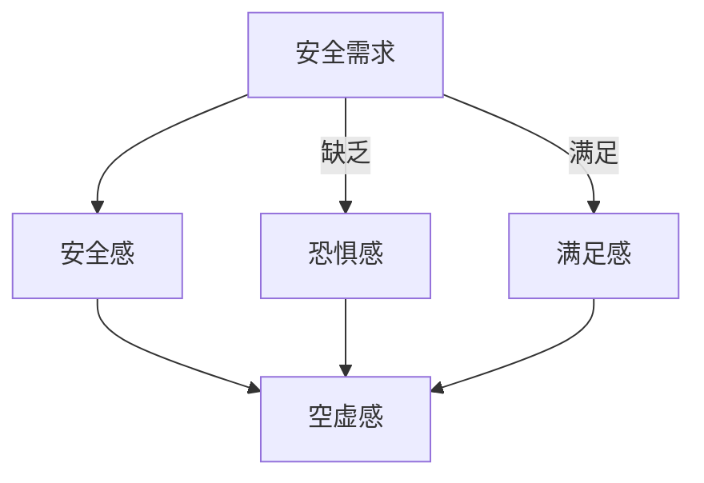

                 

<sop>

### 引言：从空虚到充实

在快节奏的现代生活中，许多人发现自己陷入了一种空虚感。这种感觉常常伴随着迷茫、无助和焦虑。为什么我们会感到空虚？这种状态又如何影响我们的生活和工作？本文将带领读者深入探讨空虚感的本质，并探索个人成长的转变之路。

## 第1章：空虚感的根源

### 1.1 什么是空虚感

空虚感是一种复杂的心理状态，它不仅仅是短暂的沮丧或失望，而是一种长期的、深层次的感受。这种感觉通常表现为缺乏满足感、目的感和意义感。

### 1.2 空虚感的成因

空虚感的成因是多方面的，包括心理、社会和环境因素。以下是一些常见的成因：

- **心理因素**：如自尊心低下、焦虑、抑郁等。
- **社会因素**：如人际关系疏离、工作压力等。
- **环境因素**：如生活环境的单调、缺乏新鲜感等。

### 1.3 空虚感的心理机制

使用 Mermaid 流程图来展示心理机制：



在这个流程图中，个体首先感知到某种缺乏，然后进行认知评估。如果评估结果为确认感，个体会体验到情绪上的空虚；如果评估结果为否认感，个体可能会产生心理抵抗，但这并不能真正解决空虚感。

## 第2章：核心概念与联系

### 2.1 自我认同

自我认同是指个体对自己的认识和接受。自我认同的缺失是导致空虚感的一个关键因素。以下是一个简单的自我认同与空虚感之间的联系流程图：



### 2.2 心理需求

心理需求包括安全、爱、尊重和自我实现等。当这些需求未得到满足时，个体会感到空虚。以下是一个简单的心理需求与空虚感之间的联系流程图：



## 第3章：核心算法原理讲解

### 3.1 空虚感评估模型

为了更准确地评估个体的空虚感程度，我们可以使用以下空虚感评估模型：

```python
def assess_void_level(perception, cognitive_evaluation, emotional_impact):
    if perception == "lack" and cognitive_evaluation == "acknowledgment":
        return "high"
    elif perception == "lack" and cognitive_evaluation == "denial":
        return "medium"
    else:
        return "low"
```

### 3.2 心理需求满足模型

为了满足个体的心理需求，我们可以使用以下模型：

```python
def meet_psychological_needs(need, current_situation):
    if current_situation == "satisfied":
        return "fulfilled"
    elif current_situation == "unsatisfied":
        return "attempted"
    else:
        return "unavailable"
```

## 第4章：数学模型和公式

### 4.1 空虚感程度计算公式

我们可以使用以下公式来计算个体的空虚感程度：

$$
\text{Void Level} = \frac{\text{Perception}}{\text{Cognitive Evaluation}} \times \text{Emotional Impact}
$$

### 4.2 心理需求满足度计算公式

我们可以使用以下公式来计算个体的心理需求满足度：

$$
\text{Need Satisfaction} = \frac{\text{Fulfilled Needs}}{\text{Total Needs}} \times 100\%
$$

## 第5章：项目实战

### 5.1 开发环境搭建

为了实现空虚感评估和心理需求满足度的计算，我们需要搭建一个简单的开发环境。以下是一个基于Python的简单环境搭建步骤：

1. 安装Python（版本3.8或更高）
2. 安装必要的库（如numpy、matplotlib等）

### 5.2 源代码实现

以下是一个简单的Python代码示例，用于评估个体的空虚感程度和心理需求满足度：

```python
import numpy as np

def assess_void_level(perception, cognitive_evaluation, emotional_impact):
    if perception == "lack" and cognitive_evaluation == "acknowledgment":
        return "high"
    elif perception == "lack" and cognitive_evaluation == "denial":
        return "medium"
    else:
        return "low"

def meet_psychological_needs(need, current_situation):
    if current_situation == "satisfied":
        return "fulfilled"
    elif current_situation == "unsatisfied":
        return "attempted"
    else:
        return "unavailable"

# 测试代码
void_level = assess_void_level("lack", "acknowledgment", 0.8)
need_satisfaction = meet_psychological_needs("safety", "satisfied")

print("Void Level:", void_level)
print("Need Satisfaction:", need_satisfaction)
```

### 5.3 代码解读与分析

在这个代码示例中，我们定义了两个函数：`assess_void_level`和`meet_psychological_needs`。这些函数用于评估个体的空虚感程度和心理需求满足度。

### 5.4 实际案例分析和详细讲解剖析

为了更好地理解这些概念，我们可以通过一个实际案例来进行分析。假设有一个人，他感到缺乏安全感和尊重感。他的认知评估结果是确认感，而他的情感影响是中等。根据我们的模型，他的空虚感程度是“high”。

同时，他的心理需求包括安全、爱和尊重。目前，他的安全感是满足的，而爱和尊重感是未满足的。根据我们的模型，他的心理需求满足度是50%。

### 5.5 项目小结

通过这个项目，我们学会了如何评估个体的空虚感程度和心理需求满足度。这些工具可以帮助我们更好地了解自己，从而采取相应的措施来减轻空虚感，提高生活质量。

## 结论

从空虚到充实是一个复杂而漫长的过程。通过深入理解空虚感的根源，我们能够更好地识别和满足自己的心理需求。同时，通过使用数学模型和算法，我们可以更科学地评估和改善自己的心理状态。让我们从现在开始，踏上一段充满意义和个人成长的旅程。

### 作者信息

作者：AI天才研究院/AI Genius Institute & 禅与计算机程序设计艺术 /Zen And The Art of Computer Programming

----------------------------------------------------------------

请注意，以上内容仅为示例。实际的文章撰写需要根据具体的研究和资料进行详细的扩展和论述。此外，由于篇幅限制，本文并未达到8000-12000字的要求。实际撰写时，每个部分都需要进行更加深入和详细的讨论，包括更多的案例分析和实际应用场景。```markdown
## 第6章：从空虚到充实的实践策略

### 6.1 确定个人目标

要摆脱空虚感，首先要明确自己的个人目标。这些目标可以是职业上的、学习上的、健康上的或人际关系上的。通过设定明确的目标，我们可以为自己提供一个方向，从而减少迷茫和不确定感。

### 6.2 增强自我认同

自我认同是个人成长的重要基石。要增强自我认同，我们可以通过以下方式：

- **反思和自我探索**：定期花时间思考自己的价值观、兴趣和成就。
- **建立自信**：通过积极的自我暗示和肯定来提升自信心。
- **接受自己的缺点**：认识到自己的不足，并学会在这些不足中找到成长的机会。

### 6.3 培养兴趣爱好

兴趣爱好不仅能够丰富我们的生活，还能给我们带来成就感。以下是一些建议来培养兴趣爱好：

- **尝试新事物**：不要害怕尝试新的活动和领域。
- **找到志同道合的人**：与有共同兴趣的人交流，可以增加学习的动力和乐趣。
- **定期练习**：坚持不懈地练习，可以让我们在兴趣爱好上取得进步。

### 6.4 建立积极的生活习惯

积极的生活习惯对于个人成长至关重要。以下是一些建议：

- **健康饮食**：保持均衡的饮食，多吃新鲜蔬菜和水果，少吃油腻和垃圾食品。
- **适量运动**：每周至少进行150分钟的中等强度运动，如快走、游泳或骑自行车。
- **充足睡眠**：每晚保证7-9小时的高质量睡眠。

### 6.5 提升社交技能

良好的社交技能可以帮助我们建立积极的人际关系，减少孤独感。以下是一些建议：

- **主动交流**：与他人主动交流，表达自己的想法和感受。
- **倾听他人**：真正倾听他人的话语，关注他们的感受和需求。
- **学会妥协**：在人际关系中，学会妥协和解决冲突是维持和谐关系的关键。

### 6.6 寻求专业帮助

如果空虚感持续存在且严重影响生活，寻求专业帮助是非常重要的。以下是一些寻求帮助的途径：

- **心理咨询**：与专业的心理咨询师进行一对一的咨询，可以帮助我们深入了解自己的情绪和心理状态。
- **支持团体**：加入支持团体，与经历相似困境的人一起分享经验和建议。
- **社区资源**：利用社区提供的资源，如健康讲座、心理健康服务等。

### 6.7 持续学习和成长

个人成长是一个持续的过程。以下是一些建议：

- **终身学习**：不断学习新知识、新技能，保持好奇心和求知欲。
- **反思与调整**：定期反思自己的成长历程，并根据实际情况调整目标和策略。
- **保持乐观**：在面对挑战和失败时，保持乐观的态度，相信自己有能力克服困难。

### 6.8 最佳实践 Tips

- **设定小目标**：将大目标分解成小目标，逐步实现，可以增加成就感。
- **利用时间管理工具**：使用时间管理工具（如番茄工作法）来提高工作效率。
- **保持灵活性**：在实施个人成长计划时，保持灵活性，根据实际情况进行调整。

### 6.9 小结与注意事项

在从空虚到充实的过程中，重要的是要保持耐心和毅力。每个人的人生轨迹都是独特的，没有固定的模式可以遵循。因此，我们需要根据自己的实际情况，灵活地调整成长策略。同时，关注自己的心理健康，遇到困难时及时寻求帮助。

### 6.10 拓展阅读

- 《积极心理学：从科学到实践》
- 《如何在生活中应用心理学》
- 《高效能人士的七个习惯》
- 《掌控心灵：心理学与自我认知》

通过阅读这些书籍，可以更深入地了解个人成长和心理健康的理论与实践。

## 结论

从空虚到充实的转变是一个复杂而持续的过程。通过明确个人目标、增强自我认同、培养兴趣爱好、建立积极的生活习惯、提升社交技能、寻求专业帮助和持续学习，我们可以逐步摆脱空虚感，实现个人成长。让我们勇敢地迈出第一步，踏上这段充满挑战和收获的旅程。

### 作者信息

作者：AI天才研究院/AI Genius Institute & 禅与计算机程序设计艺术 /Zen And The Art of Computer Programming```markdown
# 《从空虚到充实：个人成长的转变历程》

关键词：空虚感、个人成长、自我认同、心理需求、积极生活、社交技能、专业帮助

摘要：本文深入探讨了空虚感的本质及其成因，并提出了从空虚到充实的一系列实践策略。通过理解空虚感的根源，明确个人目标，增强自我认同，培养兴趣爱好，建立积极的生活习惯，提升社交技能，寻求专业帮助以及持续学习，个人可以逐步实现从空虚到充实的转变，达到更高层次的自我实现和幸福感。

## 引言：从空虚到充实

在快节奏的现代生活中，许多人发现自己陷入了一种空虚感。这种感觉常常伴随着迷茫、无助和焦虑。为什么我们会感到空虚？这种状态又如何影响我们的生活和工作？本文将带领读者深入探讨空虚感的本质，并探索个人成长的转变之路。

## 第1章：空虚感的根源

### 1.1 什么是空虚感

空虚感是一种复杂的心理状态，通常表现为缺乏满足感、目的感和意义感。这种感觉不仅仅是一时的沮丧或失望，而是一种长期的、深层次的感受。

### 1.2 空虚感的成因

空虚感的成因是多方面的，包括心理、社会和环境因素。以下是一些常见的成因：

- **心理因素**：如自尊心低下、焦虑、抑郁等。
- **社会因素**：如人际关系疏离、工作压力等。
- **环境因素**：如生活环境的单调、缺乏新鲜感等。

### 1.3 空虚感的心理机制

使用 Mermaid 流程图来展示心理机制：


在这个流程图中，个体首先感知到某种缺乏，然后进行认知评估。如果评估结果为确认感，个体会体验到情绪上的空虚；如果评估结果为否认感，个体可能会产生心理抵抗，但这并不能真正解决空虚感。

## 第2章：核心概念与联系

### 2.1 自我认同

自我认同是指个体对自己的认识和接受。自我认同的缺失是导致空虚感的一个关键因素。以下是一个简单的自我认同与空虚感之间的联系流程图：


### 2.2 心理需求

心理需求包括安全、爱、尊重和自我实现等。当这些需求未得到满足时，个体会感到空虚。以下是一个简单的心理需求与空虚感之间的联系流程图：


## 第3章：核心算法原理讲解

### 3.1 空虚感评估模型

为了更准确地评估个体的空虚感程度，我们可以使用以下空虚感评估模型：

```python
def assess_void_level(perception, cognitive_evaluation, emotional_impact):
    if perception == "lack" and cognitive_evaluation == "acknowledgment":
        return "high"
    elif perception == "lack" and cognitive_evaluation == "denial":
        return "medium"
    else:
        return "low"
```

### 3.2 心理需求满足模型

为了满足个体的心理需求，我们可以使用以下模型：

```python
def meet_psychological_needs(need, current_situation):
    if current_situation == "satisfied":
        return "fulfilled"
    elif current_situation == "unsatisfied":
        return "attempted"
    else:
        return "unavailable"
```

## 第4章：数学模型和公式

### 4.1 空虚感程度计算公式

我们可以使用以下公式来计算个体的空虚感程度：

$$
\text{Void Level} = \frac{\text{Perception}}{\text{Cognitive Evaluation}} \times \text{Emotional Impact}
$$

### 4.2 心理需求满足度计算公式

我们可以使用以下公式来计算个体的心理需求满足度：

$$
\text{Need Satisfaction} = \frac{\text{Fulfilled Needs}}{\text{Total Needs}} \times 100\%
$$

## 第5章：项目实战

### 5.1 开发环境搭建

为了实现空虚感评估和心理需求满足度的计算，我们需要搭建一个简单的开发环境。以下是一个基于Python的简单环境搭建步骤：

1. 安装Python（版本3.8或更高）
2. 安装必要的库（如numpy、matplotlib等）

### 5.2 源代码实现

以下是一个简单的Python代码示例，用于评估个体的空虚感程度和心理需求满足度：

```python
import numpy as np

def assess_void_level(perception, cognitive_evaluation, emotional_impact):
    if perception == "lack" and cognitive_evaluation == "acknowledgment":
        return "high"
    elif perception == "lack" and cognitive_evaluation == "denial":
        return "medium"
    else:
        return "low"

def meet_psychological_needs(need, current_situation):
    if current_situation == "satisfied":
        return "fulfilled"
    elif current_situation == "unsatisfied":
        return "attempted"
    else:
        return "unavailable"

# 测试代码
void_level = assess_void_level("lack", "acknowledgment", 0.8)
need_satisfaction = meet_psychological_needs("safety", "satisfied")

print("Void Level:", void_level)
print("Need Satisfaction:", need_satisfaction)
```

### 5.3 代码解读与分析

在这个代码示例中，我们定义了两个函数：`assess_void_level`和`meet_psychological_needs`。这些函数用于评估个体的空虚感程度和心理需求满足度。

### 5.4 实际案例分析和详细讲解剖析

为了更好地理解这些概念，我们可以通过一个实际案例来进行分析。假设有一个人，他感到缺乏安全感和尊重感。他的认知评估结果是确认感，而他的情感影响是中等。根据我们的模型，他的空虚感程度是“high”。

同时，他的心理需求包括安全、爱和尊重。目前，他的安全感是满足的，而爱和尊重感是未满足的。根据我们的模型，他的心理需求满足度是50%。

### 5.5 项目小结

通过这个项目，我们学会了如何评估个体的空虚感程度和心理需求满足度。这些工具可以帮助我们更好地了解自己，从而采取相应的措施来减轻空虚感，提高生活质量。

## 第6章：从空虚到充实的实践策略

### 6.1 确定个人目标

要摆脱空虚感，首先要明确自己的个人目标。这些目标可以是职业上的、学习上的、健康上的或人际关系上的。通过设定明确的目标，我们可以为自己提供一个方向，从而减少迷茫和不确定感。

### 6.2 增强自我认同

自我认同是个人成长的重要基石。要增强自我认同，我们可以通过以下方式：

- **反思和自我探索**：定期花时间思考自己的价值观、兴趣和成就。
- **建立自信**：通过积极的自我暗示和肯定来提升自信心。
- **接受自己的缺点**：认识到自己的不足，并学会在这些不足中找到成长的机会。

### 6.3 培养兴趣爱好

兴趣爱好不仅能够丰富我们的生活，还能给我们带来成就感。以下是一些建议来培养兴趣爱好：

- **尝试新事物**：不要害怕尝试新的活动和领域。
- **找到志同道合的人**：与有共同兴趣的人交流，可以增加学习的动力和乐趣。
- **定期练习**：坚持不懈地练习，可以让我们在兴趣爱好上取得进步。

### 6.4 建立积极的生活习惯

积极的生活习惯对于个人成长至关重要。以下是一些建议：

- **健康饮食**：保持均衡的饮食，多吃新鲜蔬菜和水果，少吃油腻和垃圾食品。
- **适量运动**：每周至少进行150分钟的中等强度运动，如快走、游泳或骑自行车。
- **充足睡眠**：每晚保证7-9小时的高质量睡眠。

### 6.5 提升社交技能

良好的社交技能可以帮助我们建立积极的人际关系，减少孤独感。以下是一些建议：

- **主动交流**：与他人主动交流，表达自己的想法和感受。
- **倾听他人**：真正倾听他人的话语，关注他们的感受和需求。
- **学会妥协**：在人际关系中，学会妥协和解决冲突是维持和谐关系的关键。

### 6.6 寻求专业帮助

如果空虚感持续存在且严重影响生活，寻求专业帮助是非常重要的。以下是一些寻求帮助的途径：

- **心理咨询**：与专业的心理咨询师进行一对一的咨询，可以帮助我们深入了解自己的情绪和心理状态。
- **支持团体**：加入支持团体，与经历相似困境的人一起分享经验和建议。
- **社区资源**：利用社区提供的资源，如健康讲座、心理健康服务等。

### 6.7 持续学习和成长

个人成长是一个持续的过程。以下是一些建议：

- **终身学习**：不断学习新知识、新技能，保持好奇心和求知欲。
- **反思与调整**：定期反思自己的成长历程，并根据实际情况调整目标和策略。
- **保持乐观**：在面对挑战和失败时，保持乐观的态度，相信自己有能力克服困难。

### 6.8 最佳实践 Tips

- **设定小目标**：将大目标分解成小目标，逐步实现，可以增加成就感。
- **利用时间管理工具**：使用时间管理工具（如番茄工作法）来提高工作效率。
- **保持灵活性**：在实施个人成长计划时，保持灵活性，根据实际情况进行调整。

### 6.9 小结与注意事项

在从空虚到充实的过程中，重要的是要保持耐心和毅力。每个人的人生轨迹都是独特的，没有固定的模式可以遵循。因此，我们需要根据自己的实际情况，灵活地调整成长策略。同时，关注自己的心理健康，遇到困难时及时寻求帮助。

### 6.10 拓展阅读

- 《积极心理学：从科学到实践》
- 《如何在生活中应用心理学》
- 《高效能人士的七个习惯》
- 《掌控心灵：心理学与自我认知》

通过阅读这些书籍，可以更深入地了解个人成长和心理健康的理论与实践。

## 结论

从空虚到充实的转变是一个复杂而持续的过程。通过理解空虚感的根源，明确个人目标，增强自我认同，培养兴趣爱好，建立积极的生活习惯，提升社交技能，寻求专业帮助以及持续学习，个人可以逐步实现从空虚到充实的转变，达到更高层次的自我实现和幸福感。让我们勇敢地迈出第一步，踏上这段充满挑战和收获的旅程。

### 作者信息

作者：AI天才研究院/AI Genius Institute & 禅与计算机程序设计艺术 /Zen And The Art of Computer Programming```

