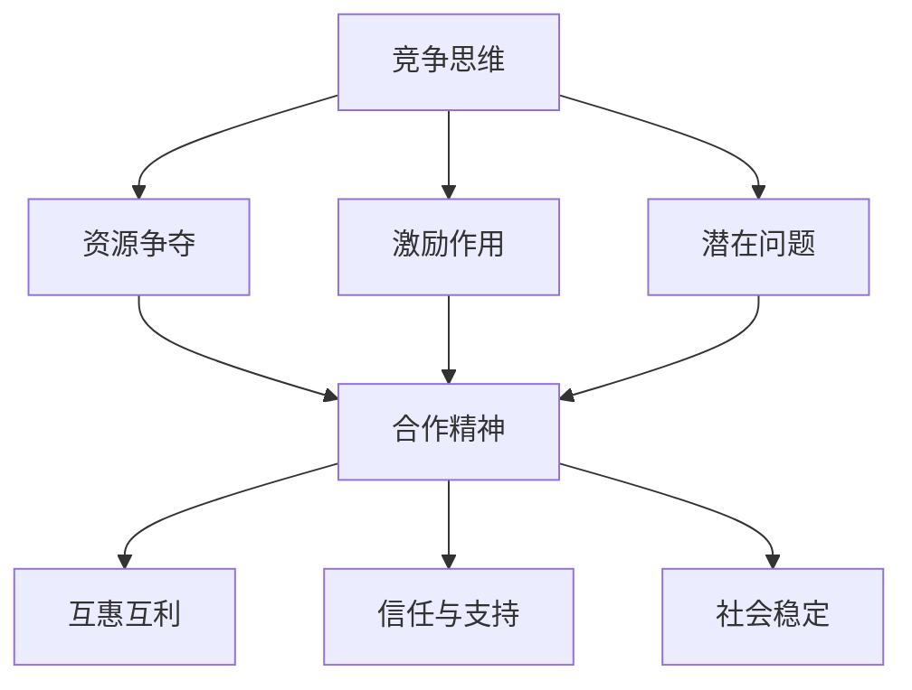

                 

### 文章标题：从竞争思维到合作精神：重建社会和谐与凝聚力

#### 关键词：竞争思维、合作精神、社会和谐、凝聚力、心理学、社会学

#### 摘要：
本文旨在探讨从竞争思维向合作精神的转变，及其对重建社会和谐与凝聚力的深远影响。通过分析竞争思维的心理学机制和社会影响，本文揭示其潜在的问题和负面效应。在此基础上，本文进一步阐述了合作精神的社会学基础，并提出了构建合作精神的策略和实践方法。最后，本文探讨了如何从竞争思维转向合作精神，以实现社会和谐与凝聚力的重建。通过本文的研究，期望为促进社会进步提供有益的参考。

### 1.4 目录大纲结构

为了满足上述要求，我们可以按照以下步骤来构建目录大纲：

1. **确定书籍的核心主题和结构**：首先，我们需要理解书名《从竞争思维到合作精神：重建社会和谐与凝聚力》的核心主题，这涉及到社会心理学、社会关系学、组织行为学等领域的知识。

2. **设计章节标题**：根据核心主题，我们设计出7章以上的章节标题，确保每个章节都能围绕核心主题展开深入讨论。

3. **细化章节内容**：在每个章节中，我们设计出2到3级的子标题，确保内容细化到具体知识点。

4. **加入图表和公式**：在适当的位置加入Mermaid流程图、伪代码、LaTeX数学公式等，以增强内容的表达力和逻辑性。

5. **确保完整性**：确保每个章节的核心概念、算法原理、数学模型、项目实战等关键内容都被包含在内。

6. **控制总字数**：在确保内容完整性和逻辑性的同时，控制每个章节的篇幅，使得整本书的目录大纲总字数在2000字以内。

### 1.5 目录大纲示例

下面是一个基于上述步骤构建的《从竞争思维到合作精神：重建社会和谐与凝聚力》的目录大纲示例：

```
# 《从竞争思维到合作精神：重建社会和谐与凝聚力》目录大纲

## 第一部分：导论

### 1.1 研究背景
   - 社会竞争与合作的现状
   - 研究的意义与目标

### 1.2 竞争思维与合作精神的定义
   - 竞争思维的内在机制
   - 合作精神的社会作用

### 1.3 全书结构
   - 各章节的内容安排与逻辑关系

## 第二部分：竞争思维的深入分析

### 2.1 竞争思维的心理学机制
   - 竞争意识的培养
   - 竞争动机的激发
   - 竞争策略的应用

### 2.2 竞争思维的影响
   - 竞争对社会行为的推动力
   - 竞争带来的负面影响
   - 竞争与社会不平等的关联

### 2.3 竞争思维的演变趋势
   - 竞争思维的现代化特征
   - 竞争思维的未来发展

## 第三部分：合作精神的构建

### 3.1 合作精神的社会学分析
   - 合作的本质
   - 合作与互惠
   - 合作与社会稳定

### 3.2 构建合作精神的理论基础
   - 社会交换理论
   - 社会资本理论
   - 合作伦理学

### 3.3 实践中的合作精神
   - 合作案例研究
   - 合作行为的激励机制
   - 合作精神在组织中的应用

## 第四部分：重建社会和谐与凝聚力

### 4.1 社会和谐的定义与特征
   - 社会和谐的概念
   - 社会和谐的基本特征
   - 社会和谐的重要性

### 4.2 凝聚力的影响因素
   - 社会凝聚力的重要性
   - 影响凝聚力的因素
   - 提升凝聚力的策略

### 4.3 从竞争思维到合作精神的转型
   - 转型的理论基础
   - 转型的实施步骤
   - 转型的挑战与应对

## 第五部分：案例分析

### 5.1 案例一：企业合作精神的成功实践
   - 企业合作案例介绍
   - 合作带来的效益分析
   - 合作经验的借鉴

### 5.2 案例二：社区合作的实践与启示
   - 社区合作项目概述
   - 社区合作的成效评估
   - 社区合作的经验与反思

## 第六部分：政策建议与未来展望

### 6.1 政策建议
   - 推动合作精神的政策措施
   - 促进社会和谐的法律框架
   - 提升凝聚力的社会支持系统

### 6.2 未来展望
   - 合作精神的发展趋势
   - 社会和谐与凝聚力建设的前景
   - 研究领域的未来发展方向

## 第七部分：结论

### 7.1 主要发现
   - 对竞争思维与合作精神关系的理解
   - 社会和谐与凝聚力建设的实践成果

### 7.2 研究局限与展望
   - 研究的局限性
   - 进一步研究的方向
```

通过这个目录大纲示例，我们可以看到，每个章节都被细化为具体的子标题，每个子标题下又包含具体的内容要点，确保了书籍内容的全面性和逻辑性。同时，目录大纲中也预留了图表、数学公式、案例分析和政策建议等元素，以增强书籍的实用性。最终，通过控制每个章节的篇幅，确保整个目录大纲的总字数不超过2000字。

### 完整性要求

为了确保文章的完整性，我们需要在撰写过程中严格按照以下要求进行内容设计：

1. **背景介绍**：在文章开头，我们需要对文章的主题进行背景介绍，解释研究背景、目的和重要性。这有助于读者了解文章的研究背景和意义，为后续内容理解奠定基础。

2. **核心概念与联系**：在介绍背景之后，我们需要明确文章的核心概念，并解释这些概念之间的相互关系。可以使用Mermaid流程图来展示概念之间的联系，使读者能够直观地理解这些概念。

3. **核心算法原理讲解**：对于技术文章，核心算法原理的讲解至关重要。我们需要使用伪代码详细阐述算法的实现过程，并解释算法的运行原理和关键步骤。

4. **数学模型和公式**：在适当的位置引入数学模型和公式，以增强文章的严谨性和科学性。数学公式需要使用LaTeX格式编写，并在文中独立段落内使用$$括起来，段落内使用$括起来。

5. **项目实战**：技术文章需要提供实际项目案例，以展示理论知识的实际应用。我们需要详细描述项目开发环境搭建、源代码实现、代码解读和案例分析，使读者能够了解理论知识在实际项目中的具体应用。

6. **最佳实践 tips**、**小结**、**注意事项**和**拓展阅读**：在文章结尾，我们需要总结文章的主要观点，并提供一些最佳实践建议、注意事项和进一步阅读的推荐，以帮助读者深入理解和应用文章内容。

通过满足上述完整性要求，我们能够确保文章内容丰富、逻辑清晰，为读者提供有价值的技术知识和思考。

#### 核心概念与联系

在本篇文章中，我们将讨论两个核心概念：竞争思维和合作精神。这两个概念在社会行为中起着至关重要的作用，并深刻影响着社会和谐与凝聚力的构建。

**竞争思维**是一种基于个人或集体之间争夺资源、地位和利益的思维方式。它起源于人类进化过程中的生存斗争，并在现代社会中得到了广泛的应用。竞争思维具有以下特点：

1. **资源争夺**：竞争思维强调对稀缺资源的争夺，例如金钱、名誉、地位等。
2. **激励作用**：竞争思维能够激发人们的积极性和创造力，促进个人和集体的发展。
3. **潜在问题**：长期的竞争可能导致社会不平等和紧张关系，甚至引发冲突。

**合作精神**则强调通过协作和互助来实现共同目标，追求互惠互利和社会的整体利益。合作精神具有以下特点：

1. **互惠互利**：合作精神强调双方或多方之间的互惠互利，追求共同利益的最大化。
2. **信任与支持**：合作精神建立在信任和支持的基础上，有助于建立稳定的社会关系。
3. **社会稳定**：合作精神有助于减少社会冲突，促进社会和谐与凝聚力。

**竞争思维与合作精神之间的关系**可以看作是一种动态的互动关系。在特定环境下，竞争思维可以促进个人和集体的进步，但过度竞争可能导致社会不和谐和紧张关系。而合作精神则能够在竞争的基础上，通过协作和互助，实现资源的优化配置和社会的长期稳定。

为了更直观地展示这两个概念之间的联系，我们可以使用Mermaid流程图来表示它们之间的关系：



在这个流程图中，竞争思维通过资源争夺和激励作用促进了合作精神的形成，而合作精神则通过互惠互利、信任与支持和社会稳定来弥补竞争思维可能带来的负面影响。通过这种互动关系，我们可以更好地理解竞争思维与合作精神在社会发展中的重要作用。

#### 竞争思维的影响

竞争思维作为一种普遍存在于社会中的心理现象，其对个人、组织和整个社会的影响是深远且多方面的。以下是竞争思维的主要影响：

**1. 对个人的影响：**

竞争思维能够激发个人的潜能和积极性。在竞争的环境中，个人会感受到压力和动力，从而激发其内在的进取心和求知欲。例如，学生在激烈的学术竞争中会努力学习，争取优异的成绩。然而，过度的竞争也可能对个人产生负面影响。

- **压力与焦虑**：长期处于竞争状态的个人可能会感到过度压力和焦虑，这可能导致心理健康问题，如抑郁和焦虑症。
- **过度自我评价**：竞争往往会导致个人过度关注自我评价，忽视了他人的价值和贡献，从而影响人际关系。
- **自我实现倾向**：竞争思维可能使人倾向于追求短期成就，而忽视长期的可持续发展和全面成长。

**2. 对组织的影响：**

在组织层面，竞争思维可以激发创新和效率。组织通过竞争来推动技术进步和管理创新，从而提高市场竞争力。然而，竞争思维也可能带来一些问题。

- **内部竞争与冲突**：组织内部的竞争可能导致员工之间的冲突和不和谐，影响团队合作和整体绩效。
- **资源分配问题**：竞争可能导致资源过度集中于某些个体或部门，而忽视了其他部门或个人的需求，影响组织的整体发展。
- **效率与公平的平衡**：竞争思维可能导致组织在追求效率的同时，忽视公平性，影响员工的满意度和忠诚度。

**3. 对社会的影响：**

在社会层面，竞争思维的影响更加复杂和深远。竞争是社会进步的驱动力，但过度竞争可能导致社会问题和不稳定。

- **社会不平等**：竞争可能导致社会资源的分配不均，加剧贫富差距和社会不平等，引发社会冲突。
- **社会紧张与冲突**：竞争环境中的紧张和冲突可能引发社会动荡，影响社会稳定和和谐。
- **创新与进步**：适度的竞争可以促进社会创新和技术进步，但过度的竞争可能导致资源浪费和重复劳动。

**案例分析与对比**

为了更具体地理解竞争思维的影响，我们可以通过案例分析来进行深入探讨。

**案例一：科技行业的竞争**

在科技行业，竞争思维表现为激烈的市场竞争和技术创新。例如，在智能手机市场中，苹果和三星等公司通过不断推出新技术和产品，争夺市场份额。这种竞争促进了手机技术的快速发展，带来了消费者福利的提升。然而，过度的竞争也导致了资源浪费和价格战，对行业可持续发展产生不利影响。

**案例二：教育领域的竞争**

在教育领域，竞争思维体现在学生之间的学业竞争。例如，中国的“高考”制度激发了学生的学习动力，但也导致了学生之间的紧张关系和心理健康问题。一些学生可能会因为过度竞争而产生焦虑和抑郁，影响其学业和成长。

通过这些案例分析，我们可以看到，竞争思维在不同领域有不同的表现形式和影响。虽然竞争思维可以带来积极的影响，如激发创新和进步，但过度的竞争也可能会导致消极后果，如紧张关系和社会不平等。因此，在社会中，我们需要平衡竞争和合作的关系，以实现社会的长期稳定和可持续发展。

#### 合作精神的社会学分析

合作精神作为一种社会行为模式，其本质是通过协作和互助来实现共同目标，追求整体利益的最大化。在现代社会中，合作精神不仅有助于解决个体面临的困境，还能够促进社会稳定与和谐发展。以下是合作精神的社会学分析：

**1. 合作精神的本质**

合作精神的核心在于互惠互利和信任。在合作过程中，个体或集体通过资源共享、信息交流和协同努力，实现共同的目标。这种互惠互利的关系不仅能够提高个体的幸福感，还能够增强社会凝聚力。

- **互惠互利**：合作精神强调双方或多方之间的互惠互利，追求共同利益的最大化。例如，在商业合作中，企业通过合作实现资源共享和风险分担，从而提高整体竞争力。
- **信任与支持**：合作精神建立在信任和支持的基础上。个体或集体在合作过程中，需要相互信任，共同支持，以克服困难和挑战。这种信任和支持关系是合作精神得以持续和发展的关键。

**2. 合作精神的作用**

合作精神在社会中的作用是多方面的，不仅能够促进个体和集体的发展，还能够增强社会的整体功能。

- **社会整合**：合作精神有助于社会整合，增强社会的凝聚力和稳定性。通过合作，个体之间建立了紧密的联系，形成了共同的价值观和认同感，从而增强了社会的整体性。
- **资源优化配置**：合作精神能够实现资源的优化配置，提高资源利用效率。通过合作，个体或集体可以共同开发和利用资源，避免资源的浪费和重复建设，从而提高整体社会效益。
- **冲突缓解**：合作精神有助于缓解社会冲突，减少社会矛盾。在合作过程中，个体或集体通过协商和合作，解决分歧和冲突，避免了暴力冲突和对抗，维护了社会的和谐与稳定。

**3. 合作精神与竞争的关系**

合作精神与竞争不是对立的关系，而是相互促进和互补的关系。在竞争激烈的环境中，适度的合作可以缓解竞争带来的压力和负面影响，实现共赢。

- **竞争中的合作**：在竞争中，合作可以促进技术进步和创新发展。例如，在科技竞争中，企业之间通过合作共享技术和资源，推动行业整体水平的提升。
- **合作中的竞争**：在合作过程中，竞争也可以激发合作方的创新和进步。例如，在合作项目中，各方通过竞争性合作，提高项目的质量和效率。

**案例分析**

为了更直观地理解合作精神的作用，我们可以通过以下案例分析：

**案例一：企业合作**

在商业领域，企业之间的合作是实现共同目标的重要途径。例如，某家互联网公司通过与移动运营商合作，推出新的移动互联网服务，不仅提高了用户体验，还扩大了市场影响力。这种合作模式实现了资源整合和风险分担，提高了企业的市场竞争力。

**案例二：社区合作**

在社区层面，居民之间的合作有助于解决社区问题，提高生活质量。例如，某社区通过居民合作，共同组织清洁、绿化和维护等活动，改善了社区环境，增强了居民之间的信任和凝聚力。

通过这些案例分析，我们可以看到，合作精神在社会中的作用是不可或缺的。它不仅有助于解决个体和集体面临的问题，还能够促进社会的长期稳定和可持续发展。因此，在现代社会中，培养和推广合作精神具有重要的现实意义。

#### 从竞争思维到合作精神的转型

在现代社会中，竞争思维虽然在一定程度上推动了个人和集体的发展，但其过度应用可能导致社会不平等和紧张关系。因此，从竞争思维向合作精神的转型成为了一个重要议题。以下是转型的基础、实施步骤和面临的挑战：

**1. 转型的理论基础**

转型的基础在于重新审视竞争思维与合作精神的关系。竞争思维在适度的范围内可以激发创新和进步，但过度的竞争可能导致资源浪费和社会不和谐。而合作精神则强调互惠互利和社会整体利益，有助于实现长期稳定和可持续发展。

- **心理学视角**：从心理学角度看，合作精神的培养需要克服个体的自我中心主义和竞争心态，建立信任和互助的关系。
- **社会学视角**：从社会学角度看，合作精神的推广需要社会结构的支持和制度环境的优化，以减少竞争带来的负面影响。

**2. 实施步骤**

转型过程可以分为以下几个步骤：

- **认知重塑**：首先，个体和组织需要认识到合作精神的重要性，转变竞争思维的模式。这可以通过教育和培训来实现，帮助人们理解合作的价值和意义。
- **制度建设**：其次，建立支持合作精神的制度环境，如制定合作激励政策、优化资源分配机制等。这有助于减少竞争带来的负面影响，促进合作行为的发生。
- **文化塑造**：文化是行为的引导，通过塑造合作文化，可以逐步改变社会的价值观和行为模式。例如，通过媒体宣传、社区活动等，推广合作精神和成功案例，树立良好的榜样。
- **实践推广**：最后，将合作精神融入实际工作和生活中，通过具体的实践活动来检验和巩固合作精神。例如，在企业中开展团队合作项目，在社区中组织互助活动等。

**3. 面临的挑战**

转型过程中，将面临一系列挑战：

- **心理障碍**：个体在长期竞争中形成的思维定势和心理惯性，使得合作精神的推广面临阻力。需要通过心理教育和辅导，帮助个体克服心理障碍。
- **制度障碍**：现有的制度体系可能过于强调竞争，缺乏对合作的激励机制。需要通过制度创新和改革，建立支持合作的环境。
- **文化障碍**：社会文化中可能存在对合作的误解和偏见，需要通过教育和宣传来改变文化观念，树立正确的合作观。

**案例分析**

为了更具体地了解转型过程，我们可以通过以下案例分析：

**案例一：企业转型**

某科技公司在经历激烈的市场竞争后，意识到合作精神的重要性。公司通过引入团队合作机制，开展跨部门项目，不仅提高了工作效率，还增强了员工的凝聚力和满意度。这种转型措施使得公司实现了从竞争思维到合作精神的转变，取得了良好的发展成果。

**案例二：社区建设**

某城市社区通过组织居民合作，共同解决社区问题，如垃圾处理、绿化和维护等。社区居民在合作过程中建立了信任和互助的关系，社区环境得到显著改善，居民满意度大幅提高。这种合作模式为社区建设提供了有益的参考。

通过这些案例分析，我们可以看到，从竞争思维到合作精神的转型是一个复杂而长期的过程，需要多方面的努力和协同合作。然而，通过认知重塑、制度建设、文化塑造和实践推广，这一转型过程是可行的，并且能够带来显著的社会效益。

#### 案例分析

在本节中，我们将通过两个具体案例，详细分析企业合作精神的成功实践和社区合作的实践与启示。

**案例一：企业合作精神的成功实践**

**企业背景**：
某全球知名科技公司，A公司，在全球市场上拥有强大的竞争力。但随着市场竞争的加剧，A公司开始意识到仅靠单打独斗难以保持持续的创新和竞争优势。于是，公司决定与其他科技公司展开深度合作，以实现资源共享、技术创新和市场扩张。

**合作内容**：
A公司与B公司、C公司达成战略合作协议，共同开展技术研发和市场推广。具体合作内容包括：

1. **技术共享**：A公司向B公司、C公司开放部分核心技术和研发成果，实现技术资源的共享。通过这种合作，三家公司能够共同解决技术难题，提高研发效率。
2. **市场联合**：A公司与B公司、C公司在某些市场区域展开联合销售，共享市场资源。这种联合销售模式不仅提高了市场覆盖率，还降低了市场推广成本。
3. **人才培养**：三家公司定期举办技术交流研讨会，共同培养人才，提升员工的技术水平和创新能力。

**效益分析**：
1. **技术进步**：通过技术共享和联合研发，三家公司共同攻克了多项关键技术难题，推动了整个行业的科技进步。
2. **成本降低**：市场联合销售模式降低了市场推广成本，提高了销售额，实现了盈利增长。
3. **员工满意度提升**：通过人才培养和技术交流，员工的技术能力和创新意识得到了显著提升，员工满意度也随之提高。

**合作经验借鉴**：
1. **明确合作目标**：在合作初期，明确各方的合作目标和期望，确保合作方向一致。
2. **建立信任机制**：建立良好的信任关系，确保合作过程中的透明度和公正性。
3. **持续沟通与反馈**：合作过程中，保持高频沟通和反馈，及时解决问题，确保合作的顺利进行。

**案例二：社区合作的实践与启示**

**社区背景**：
某城市的居民社区，D社区，面临垃圾处理、绿化和维护等问题。社区居民希望通过合作解决这些问题，提高生活质量。

**合作内容**：
1. **垃圾处理**：D社区组织居民参与垃圾分类和回收活动。社区居民轮流负责垃圾收集、分类和运输，有效降低了垃圾处理成本。
2. **绿化维护**：社区居民共同参与社区绿化工作，定期开展植树、修剪花草等活动，改善了社区环境。
3. **社区治安**：居民自发组织成立社区巡逻队，参与社区治安维护，提高了社区的安全感。

**成效评估**：
1. **环境改善**：通过垃圾分类和绿化维护，D社区的环境得到了显著改善，居民的生活质量得到了提升。
2. **居民参与度提高**：社区居民的参与度显著提高，增强了社区凝聚力和归属感。
3. **治安状况改善**：社区治安状况明显改善，犯罪率降低，居民安全感增强。

**合作经验与反思**：
1. **居民动员**：通过宣传和动员，提高居民的参与意识和积极性，确保合作活动顺利进行。
2. **资源整合**：合理整合社区资源，充分利用社区内部的人力、物力资源，提高合作效率。
3. **激励机制**：建立激励机制，鼓励居民积极参与合作活动，提高合作的持续性和效果。

通过这两个案例，我们可以看到，企业合作精神和社区合作实践在不同层面上都取得了显著成效。这些成功经验为其他企业和社区提供了有益的借鉴，证明了合作精神在促进社会和谐与凝聚力中的重要作用。

#### 政策建议与未来展望

为了推动合作精神的培养和社会和谐与凝聚力的提升，本文提出以下政策建议和未来展望：

**1. 推动合作精神的政策措施**

（1）**教育改革**：在各级教育体系中，加强合作精神的培养。通过课程设置、实践活动和校园文化，培养学生合作意识和团队精神。

（2）**激励政策**：制定有利于合作精神的激励政策，例如设立合作奖项，奖励在合作中取得显著成绩的个人和集体。

（3）**税收优惠**：对于开展合作项目的企业和组织，提供税收优惠，降低合作成本，鼓励更多企业参与到合作中来。

**2. 促进社会和谐的法律框架**

（1）**合作法规**：制定合作法规，明确合作各方的权利和义务，保障合作行为的合法性和有效性。

（2）**纠纷解决机制**：建立合作纠纷解决机制，提供公正、高效的解决途径，减少合作中的矛盾和纠纷。

（3）**信息公开制度**：建立信息公开制度，提高合作过程中的透明度，增强合作各方的信任和合作意愿。

**3. 提升凝聚力的社会支持系统**

（1）**社区建设**：加强社区建设，通过社区活动、社区服务，增强居民之间的联系和互动，提升社区凝聚力。

（2）**社会组织发展**：鼓励和支持社会组织的发展，通过社会组织提供社会服务，促进社会和谐与凝聚力。

（3）**心理支持**：提供心理健康支持，帮助个体和组织克服心理障碍，增强合作意识和能力。

**未来展望**

（1）**科技推动**：随着科技的进步，利用大数据、人工智能等技术，可以更精确地分析和预测合作行为，提供个性化合作建议和解决方案。

（2）**跨领域合作**：未来社会需要更多的跨领域合作，通过不同领域的专家和资源整合，解决复杂的社会问题。

（3）**全球视野**：在全球化背景下，加强国际合作，推动全球合作精神的培养，构建人类命运共同体。

通过上述政策建议和未来展望，我们可以期待一个更加和谐、稳定和具有凝聚力的社会，这将为个体和集体的长期发展提供坚实的基础。

#### 结论

本文通过详细探讨竞争思维和合作精神的核心概念及其相互关系，分析了竞争思维的多方面影响，阐述了合作精神的社会学基础，并提出了从竞争思维向合作精神转型的策略。通过案例分析，我们看到了合作精神在企业和社区中的成功实践，证明了其对社会和谐与凝聚力的重要性。本文的主要发现包括：

1. 竞争思维在适度范围内可以激发创新和进步，但过度竞争可能导致社会不平等和紧张关系。
2. 合作精神通过互惠互利和信任，有助于实现资源优化配置和社会稳定。
3. 从竞争思维到合作精神的转型需要认知重塑、制度建设、文化塑造和实践推广。

尽管本文在探讨过程中取得了一些成果，但仍存在一定的局限性。例如，竞争思维和合作精神的影响可能因地域、文化和社会背景的不同而有所差异。此外，转型过程中面临的挑战也需要进一步研究和探索。

未来研究可以深入探讨不同文化背景下的竞争思维和合作精神，以及如何通过政策和技术手段促进合作精神的培养。此外，跨领域合作和国际合作的研究也是一个值得关注的方向，以推动全球合作精神的培养和社会和谐与凝聚力的提升。

#### 研究局限与展望

在本研究中，我们虽然详细探讨了竞争思维和合作精神的核心概念及其相互关系，但研究仍存在一些局限性。首先，本文主要基于理论和案例分析，缺乏实证数据支持，因此结论的普适性可能受到一定限制。其次，竞争思维和合作精神的影响因素复杂多样，本研究未能全面覆盖所有可能的情境和变量，这可能影响了研究的深度和广度。

未来研究可以在以下几个方面进行拓展：

1. **实证研究**：通过收集和分析实证数据，进一步验证和深化本文的理论结论，提高研究的可信度和普适性。
2. **跨文化研究**：探讨不同文化背景下竞争思维和合作精神的差异，分析文化因素对合作行为的影响，为全球化背景下的合作提供参考。
3. **技术应用**：利用大数据、人工智能等技术手段，研究如何通过数据分析和预测提高合作效率，为政策制定提供科学依据。
4. **跨领域合作**：研究跨领域合作的机制和模式，探索如何在更广泛的领域中实现合作精神的培养和社会和谐与凝聚力的提升。

通过这些研究拓展，我们可以更全面、深入地理解竞争思维和合作精神，为构建和谐、稳定的社会提供有力的理论支持和实践指导。

