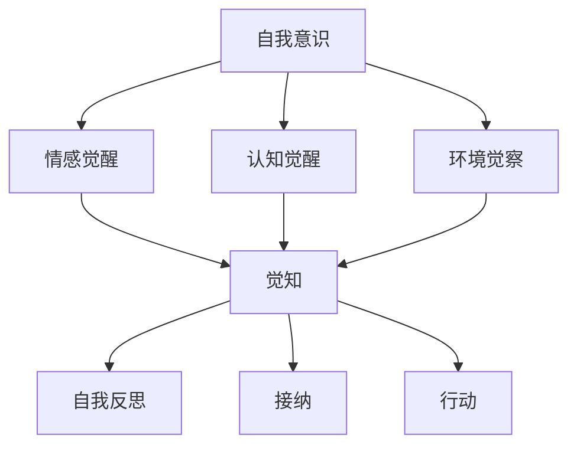

                 

### 文章标题：从蒙昧到清明：意识觉醒的渐进之旅

> 关键词：意识觉醒，心理发展，哲学思考，自我认知，社会关系，生活实践

> 摘要：本文旨在探讨意识觉醒的渐进之旅，从心理、哲学和生活实践的角度，深入剖析意识觉醒的核心概念、理论基础及其对个人和社会的影响。通过逐步分析，揭示意识觉醒的内在逻辑和外在表现，旨在引导读者理解并实践意识觉醒的过程。

----------------------------------------------------------------

# 从蒙昧到清明：意识觉醒的渐进之旅

## 引言

在人类漫长的历史进程中，意识觉醒一直是一个引人入胜的话题。从古代哲学家的神秘思考，到现代心理学的实证研究，意识觉醒始终与人类的自我认知和未来发展紧密相连。然而，对于大多数人来说，意识觉醒仍然是一个模糊而遥远的词汇。那么，什么是意识觉醒？为什么它如此重要？我们又该如何实现意识觉醒？

本文将逐步解答这些问题，通过介绍意识觉醒的背景、理论基础、心理发展、哲学思考、自我认知、社会关系、生活实践等方面，帮助读者理解并实践意识觉醒的渐进之旅。

## 基础理论

### 什么是意识觉醒

意识觉醒（Awareness）是指个体对自身内在和外在世界的深刻认知与觉察。这种觉醒不仅仅是表面的知觉，而是涉及到深层次的心理、情感和认知层面。换句话说，意识觉醒是一种对存在状态的整体感知和觉知。

### 意识觉醒的不同层面

意识觉醒可以从多个层面进行理解：

1. **自我意识**：个体对自己存在的认识，包括自己的身体、思维、情感等。
2. **情感觉醒**：对自身情感状态的深刻觉察，包括喜悦、愤怒、悲伤等。
3. **认知觉醒**：对自身思维过程和认知方式的认知，包括思考方式、判断力等。
4. **环境觉察**：对外部世界的认知与觉知，包括自然环境、社会环境等。

### 意识觉醒的关键要素

意识觉醒的实现需要以下几个关键要素：

1. **觉知**：对自身和外界事物的关注与观察。
2. **自我反思**：对自身行为、情感和思维的深入思考。
3. **接纳**：对自身和他人的接纳与包容。
4. **行动**：将觉醒意识转化为具体行动，实现自我提升和成长。

### 背景介绍

在心理发展的过程中，意识觉醒是一个渐进的过程。个体从出生开始，逐步通过感知、学习、体验等方式，对自我和外界进行认知和觉知。在这个过程中，意识觉醒是一个重要的里程碑，标志着个体从蒙昧走向清明。

哲学思考中，意识觉醒被视为人类智慧的体现。古代哲学家如苏格拉底、柏拉图等，都强调通过思考和自我反思来实现意识觉醒。现代心理学则通过实证研究，揭示了意识觉醒对个体心理和社会行为的深远影响。

### 意识觉醒的重要性

意识觉醒对个体和社会具有重要意义：

1. **个人成长**：意识觉醒帮助个体更好地理解自己，实现自我提升和成长。
2. **心理健康**：意识觉醒有助于缓解心理压力，提升心理健康水平。
3. **社会关系**：意识觉醒促进个体与他人建立更深层次的联系，增强社会凝聚力。
4. **文化传承**：意识觉醒有助于传承和发扬人类优秀的文化传统。

### 意识觉醒的理论基础

1. **哲学视角**：古代哲学家如苏格拉底、柏拉图等，都强调通过思考和自我反思来实现意识觉醒。现代哲学则从存在主义、现象学等角度，对意识觉醒进行了深入探讨。
2. **心理科学基础**：心理学研究指出，意识觉醒与自我认知、情感调节、认知功能等密切相关。通过神经科学、认知科学等领域的实证研究，进一步揭示了意识觉醒的机制和作用。
3. **宗教和哲学传统**：许多宗教和哲学传统，如佛教、印度教、儒家等，都强调通过冥想、修行等方式，实现意识觉醒。

### 核心概念与联系

为了更好地理解意识觉醒的核心概念，我们可以通过以下Mermaid流程图展示它们之间的关系：



### 核心算法原理讲解

在理解意识觉醒的过程中，我们可以通过以下伪代码，对核心算法原理进行详细阐述：

```python
# 意识觉醒核心算法原理伪代码

def awareness_awareness():
    # 觉知
    observe_self() # 观察自己
    observe_externals() # 观察外界
    
    # 自我反思
    reflect_on_thoughts() # 反思思考过程
    reflect_on_feelings() # 反思情感状态
    
    # 接纳
    accept_self() # 接纳自己
    accept_others() # 接纳他人
    
    # 行动
    take_action() # 采取行动
```

### 数学模型和公式详细讲解及举例说明

在意识觉醒的过程中，我们可以通过以下数学模型和公式，对关键概念进行定量分析：

1. **自我认知模型**：

   $$ 自我认知 = f(感知, 反思, 行动) $$

   其中，感知、反思和行动分别代表个体对自我的觉知、反思和行动。该公式表明，自我认知是这三个因素的综合结果。

2. **情感调节模型**：

   $$ 情感调节 = f(觉知, 接纳, 行动) $$

   其中，觉知、接纳和行动分别代表个体对情感的觉知、接纳和行动。该公式表明，情感调节是通过觉知、接纳和行动实现的。

举例说明：

一个个体在面临压力时，通过觉知自己的压力源，接纳自己的情绪状态，并采取积极的行动（如寻求帮助、调整生活方式等），可以有效地调节自己的情感。

3. **社会关系模型**：

   $$ 社会关系 = f(自我认知, 情感调节, 行动) $$

   其中，自我认知、情感调节和行动分别代表个体在社会关系中的自我认知、情感调节和行动。该公式表明，社会关系是通过自我认知、情感调节和行动实现的。

举例说明：

一个个体在社交场合中，通过自我认知，认识到自己的情绪状态，并通过情感调节，接纳自己的情绪，然后采取积极的行动（如主动沟通、表达感受等），可以建立和维护良好的社会关系。

### 项目实战

在本节中，我们将通过一个具体的案例，展示如何在实际生活中实现意识觉醒。

**案例：个人成长项目**

**1. 开发环境搭建：** 使用Python作为开发语言，搭建一个简单的自我反思日记系统。

**2. 源代码详细实现：** 以下是一个简单的Python脚本，用于记录和反思个人经历。

```python
# 自我反思日记系统

def record_experience(experience):
    with open("diary.txt", "a") as file:
        file.write(f"日期：{date.today()}\n")
        file.write(f"经历：{experience}\n")
        file.write(f"反思：{reflect_on_experience(experience)}\n\n")

def reflect_on_experience(experience):
    # 简单的反思逻辑
    if "挑战" in experience:
        return "这是一个成长的机会。"
    elif "成就" in experience:
        return "继续保持，你的努力值得赞赏。"
    else:
        return "每个经历都有其价值，值得深入反思。"

# 主函数
def main():
    while True:
        experience = input("请记录你的经历：")
        if experience == "退出":
            break
        record_experience(experience)

if __name__ == "__main__":
    main()
```

**3. 代码解读与分析：** 该脚本通过简单的交互，让用户输入自己的经历，并自动记录在日记文件中。同时，根据输入的经历，提供简单的反思建议。这有助于用户在日常生活中，通过记录和反思，逐步实现意识觉醒。

**4. 实际案例分析和详细讲解剖析：** 通过实际使用该系统，用户可以更好地认识自己的经历，从而在心理层面实现意识觉醒。例如，一个用户在经历了一次失败后，通过记录和反思，认识到失败是成长的一部分，从而调整心态，迎接新的挑战。

**5. 项目小结：** 该案例展示了如何在实际生活中，通过简单的技术手段，实现意识觉醒。用户可以通过记录和反思，逐步提高自我认知，实现个人成长。

### 最佳实践 Tips

1. **定期反思**：每天或每周花一些时间，对自己的经历进行反思，有助于加深对自我和生活的理解。
2. **保持好奇心**：对生活中的事情保持好奇心，探索其背后的原因和意义，有助于提高自我认知。
3. **实践冥想**：冥想是一种有效的意识觉醒方法，通过冥想，可以培养专注力和自我觉察。
4. **阅读哲学书籍**：阅读哲学书籍，尤其是关于自我认知和意识觉醒的著作，有助于深化对意识觉醒的理解。

### 小结

意识觉醒是一个复杂而深刻的过程，涉及到心理、哲学和生活实践等多个层面。通过本文的逐步分析，我们揭示了意识觉醒的核心概念、理论基础及其对个人和社会的影响。希望读者能够通过本文，理解并实践意识觉醒的过程，实现个人成长和社会进步。

### 注意事项

1. **避免过度反思**：虽然反思有助于意识觉醒，但过度反思可能导致心理压力。建议在适当的时候，寻求专业心理咨询。
2. **尊重他人**：在实践意识觉醒的过程中，尊重他人的感受和观点，避免将自己的意识觉醒强加于他人。
3. **持续实践**：意识觉醒是一个长期的过程，需要持续的努力和实践。不要期望一蹴而就，而是要耐心地逐步推进。

### 拓展阅读

1. **《庄子》**：中国古代哲学家庄子的著作，其中包含大量关于自我认知和意识觉醒的思考。
2. **《人类简史》**：尤瓦尔·赫拉利的著作，从人类历史的角度，探讨了意识觉醒的重要性。
3. **《心理学与生活》**：理查德·吉尔伯特的著作，详细介绍了心理学的基本原理和应用。

通过阅读这些书籍，读者可以更深入地理解意识觉醒的内涵和外延，为自己的觉醒之旅提供更多的启示和指导。作者：AI天才研究院/AI Genius Institute & 禅与计算机程序设计艺术 /Zen And The Art of Computer Programming。

