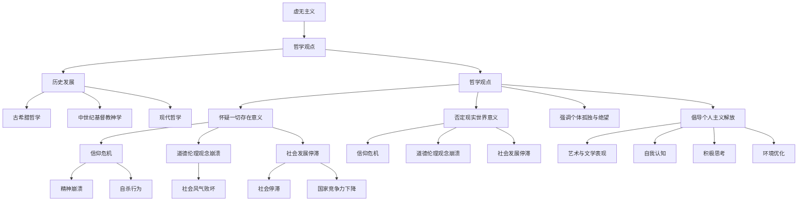

                 


### 引言

#### 写作目的与意义

在当今快速变化的世界中，人们面临着前所未有的挑战和困惑。虚无主义作为一种哲学观点，主张世界没有固有的意义和价值，这使得许多人在追求个人信仰的过程中陷入了迷茫。本文旨在探讨从虚无主义到积极人生观的转变，为个人信念系统的重建提供一条可行的路径。通过深入分析虚无主义的起源、影响及其批判，我们希望揭示积极人生观的理论基础和实践方法，最终帮助读者实现个人信念的积极转变。

#### 研究背景

虚无主义在现代社会中有着广泛的影响。它不仅影响了个体的人生观，还对社会整体产生了深远的影响。一方面，虚无主义导致了人们的信仰危机，使许多人感到生活无意义、空虚和迷茫。另一方面，虚无主义也为现代哲学、文学和艺术提供了新的视角，激发了人们对生命意义的深刻思考。因此，研究虚无主义和积极人生观，有助于我们理解现代社会中存在的问题，并寻求解决之道。

#### 研究方法与结构

本文采用逻辑分析和案例研究的方法，通过对虚无主义和积极人生观的理论基础进行深入剖析，结合实际案例，探讨从虚无主义到积极人生观的转变路径。文章结构如下：

1. 引言：介绍写作目的、研究背景和研究方法。
2. 虚无主义概述：阐述虚无主义的概念、历史发展和哲学观点。
3. 虚无主义的起源与影响：分析虚无主义的起源、对个人信念系统的影响以及对社会的影响。
4. 虚无主义的批判与反思：讨论对虚无主义的批判及其反思与改进。
5. 积极人生观的理论基础：介绍积极人生观的概念、理论基础和核心价值观。
6. 积极人生观的实践方法：阐述如何培养积极人生观、积极人生观的心理技巧和实践案例。
7. 积极人生观的案例分析：通过具体案例展示积极人生观的应用。
8. 总结与展望：总结全文，展望未来研究方向。

通过以上结构，我们希望逐步引导读者理解虚无主义与积极人生观的关系，从而为个人信念系统的重建提供有益的启示。

#### 文章关键词

- 虚无主义
- 积极人生观
- 个人信念系统
- 哲学反思
- 社会影响
- 心理技巧

#### 文章摘要

本文从虚无主义到积极人生观的转变出发，探讨了虚无主义的概念、历史发展和哲学观点，分析了虚无主义的起源、对个人信念系统的影响以及对社会的影响。通过对虚无主义的批判与反思，本文揭示了积极人生观的理论基础和实践方法，并通过具体案例展示了积极人生观的应用。文章最后总结全文，展望未来研究方向，为个人信念系统的重建提供了有益的启示。通过逻辑分析和实际案例的讨论，本文旨在帮助读者理解虚无主义与积极人生观的关系，从而实现个人信念的积极转变。

### 虚无主义概述

虚无主义是一种哲学观点，认为世界没有固有的意义和价值。虚无主义的核心理念是怀疑一切存在的本质和价值，否认现实世界的真实性和意义。虚无主义在不同历史时期和文化背景下有着不同的表现形式，但其基本思想是一致的。

#### 虚无主义的概念

虚无主义最初可以追溯到古希腊哲学。在古希腊哲学中，虚无主义的思想主要体现在普罗泰戈拉的观点中，他提出了“人是万物的尺度”这一命题，表明人的主观感受是衡量世界真实性的唯一标准。这一观点打破了传统哲学对客观现实的追求，为虚无主义的产生奠定了基础。

进入中世纪，虚无主义的思想在基督教神学中得到了进一步的发展。一些神学家认为，上帝的存在是不可知的，人类无法通过理性认识上帝，因此现实世界缺乏真正的意义。这种思想在中世纪后期导致了信仰危机，为现代虚无主义的兴起埋下了伏笔。

在20世纪，虚无主义得到了进一步的推广。尼采是现代虚无主义的代表人物，他提出了“上帝已死”的命题，认为传统宗教和道德观念已经失去了其意义，人类面临着无意义和无目的的生存状态。尼采的这种观点对后世产生了深远的影响，许多现代哲学家和文学家都受到了他的启发。

#### 虚无主义的历史发展

虚无主义在历史发展中经历了多个阶段。最早的形式可以追溯到古希腊哲学，随后在基督教神学中得到了发展。在18世纪的启蒙运动中，虚无主义思想有所消退，但19世纪的工业革命和科技进步又重新激发了虚无主义的思潮。

20世纪初，虚无主义在德国和俄国得到了广泛传播。德国哲学家尼采提出了“上帝已死”的观点，俄国作家陀思妥耶夫斯基则通过其作品探讨了虚无主义的本质和影响。这一时期的虚无主义思想对现代哲学、文学和艺术产生了深远的影响。

20世纪下半叶，虚无主义在西方世界达到了高峰。许多知识分子和艺术家受到尼采等人的影响，开始质疑现实世界的意义和价值。虚无主义思潮在文学领域得到了充分体现，如卡夫卡的《变形记》和加西亚·马尔克斯的《百年孤独》等作品，都反映了虚无主义的理念。

#### 虚无主义的哲学观点

虚无主义的哲学观点主要包括以下几个方面：

1. **否定现实世界的真实性**：虚无主义认为，现实世界是虚幻的，缺乏真正的意义和价值。这种观点否定了客观存在的本质，强调了主观感受的重要性。

2. **怀疑一切存在的意义**：虚无主义认为，人类的存在本身是没有意义的，人类的行为和追求都是无意义的。这种观点对传统的道德观念和价值体系提出了挑战。

3. **强调个体的孤独和绝望**：虚无主义认为，个体在现实世界中是孤独和无助的，面临着绝望和痛苦。这种观点反映了虚无主义对人类生存状态的悲观态度。

4. **倡导个人主义的解放**：虚无主义主张个体摆脱传统观念和社会束缚，追求自由和自我表达。这种观点在艺术和文学领域得到了充分体现。

总之，虚无主义是一种复杂的哲学观点，既包含了深刻的思考，也体现了悲观的态度。通过了解虚无主义的历史发展和哲学观点，我们可以更好地理解这一思想在现代哲学、文学和艺术中的地位和影响。

### 虚无主义的起源与影响

虚无主义作为一种哲学观点，其起源可以追溯到古希腊哲学。在古希腊哲学中，虚无主义的思想主要体现在普罗泰戈拉的观点中，他提出了“人是万物的尺度”这一命题，表明人的主观感受是衡量世界真实性的唯一标准。这一观点打破了传统哲学对客观现实的追求，为虚无主义的产生奠定了基础。

#### 虚无主义的起源

虚无主义最早的思想可以追溯到古希腊哲学。普罗泰戈拉的观点标志着虚无主义思想的诞生，他通过“人是万物的尺度”这一命题，质疑了客观现实的存在。普罗泰戈拉的思想在后来的希腊哲学中得到了发展，例如苏格拉底和柏拉图对普罗泰戈拉观点的批判，也为虚无主义的发展提供了反面的案例。

进入中世纪，虚无主义的思想在基督教神学中得到了进一步的发展。一些神学家认为，上帝的存在是不可知的，人类无法通过理性认识上帝，因此现实世界缺乏真正的意义。这种思想在中世纪后期导致了信仰危机，为现代虚无主义的兴起埋下了伏笔。

在18世纪的启蒙运动中，虚无主义思想有所消退，但19世纪的工业革命和科技进步又重新激发了虚无主义的思潮。尼采的“上帝已死”命题和陀思妥耶夫斯基的文学作品，标志着现代虚无主义的兴起。

#### 虚无主义对个人信念系统的影响

虚无主义对个人信念系统的影响是深远且复杂的。一方面，虚无主义使得人们怀疑现实世界的意义和价值，从而产生了信仰危机。许多人在面临生活的种种困境时，感到无助和迷茫，甚至失去了对未来的希望。这种信仰危机可能导致个体的精神崩溃，甚至自杀等极端行为。

另一方面，虚无主义也为一些人提供了反思和解放的机会。虚无主义鼓励个体摆脱传统观念和社会束缚，追求自由和自我表达。这种思想在艺术和文学领域得到了充分体现，如尼采的作品和陀思妥耶夫斯基的小说，都反映了虚无主义对个人信念系统的影响。

#### 虚无主义对社会的影响

虚无主义对社会的影响也是显著的。在个人层面，虚无主义可能导致个体的精神崩溃，影响社会的稳定。在社会层面，虚无主义可能引发社会动荡，影响社会的发展。

首先，虚无主义可能导致社会的道德和伦理观念崩溃。当人们怀疑现实世界的意义和价值时，传统的道德和伦理观念可能不再被认同，这可能导致社会风气的败坏。

其次，虚无主义可能影响社会的发展。当人们失去对未来的希望时，他们可能缺乏动力去追求创新和发展。这种情况下，社会可能陷入停滞，甚至倒退。

然而，虚无主义也有一定的积极作用。它可以激发人们对生命意义的深刻思考，促进个人和社会的进步。通过批判传统观念，虚无主义为新的思想和发展提供了空间。

#### 虚无主义的辩证法

虚无主义并非全是消极的，它也是一种辩证法。通过否定现实世界的意义和价值，虚无主义揭示了传统观念的局限和人类追求真理的艰难。这种思想可以激发人们对生命意义的深刻思考，促使人们寻找新的价值和意义。

总之，虚无主义作为一种哲学观点，其起源可以追溯到古希腊哲学，对个人信念系统和整个社会都产生了深远的影响。在现代社会，虚无主义仍然具有一定的现实意义，我们需要正确看待虚无主义，从中汲取有益的思想，以实现个人和整体的进步。

### 虚无主义的批判与反思

虚无主义虽然在哲学史上具有重要意义，但其负面效应也不容忽视。在批判虚无主义的过程中，我们需要深入分析其内在矛盾，探讨其对个人和社会的负面影响，并提出改进措施。

#### 对虚无主义的批判

首先，虚无主义否认现实世界的意义和价值，这可能导致个体的信仰危机和精神崩溃。当人们失去对生活的信念时，他们可能会陷入无助和绝望，甚至导致自杀等极端行为。这种情况下，虚无主义不仅没有带来解脱，反而加剧了人类的精神痛苦。

其次，虚无主义对传统的道德和伦理观念提出了挑战，这可能导致社会风气的败坏。当人们不再认同传统的价值观时，社会可能会陷入道德沦丧的困境，导致人与人之间的信任缺失，社会秩序紊乱。

此外，虚无主义可能导致社会发展的停滞。当人们失去对未来的希望时，他们可能缺乏动力去追求创新和发展。这种情况下，社会可能会陷入停滞，甚至倒退，影响国家的综合竞争力。

#### 虚无主义的反思与改进

尽管虚无主义存在诸多问题，但通过批判和反思，我们可以从中汲取有益的思想，并提出改进措施。

首先，我们需要认识到虚无主义揭示了传统观念的局限。虚无主义通过质疑现实世界的意义和价值，促使人们反思传统的道德和伦理观念，寻找新的价值和意义。这种反思有助于人类社会的进步。

其次，我们需要重新审视个人信念系统。在批判虚无主义的同时，我们也要认识到个体在面对现实困境时的无助和迷茫。为了重建个人信念系统，我们需要培养积极的人生观，通过自我认知和积极思考，找到生活的意义和价值。

此外，我们需要注重社会建设和文化传承。虚无主义的负面影响在一定程度上源于社会和文化的不健全。通过加强社会建设和文化传承，我们可以提供更多正面的价值观和生活方式，减少虚无主义的影响。

#### 重建个人信念系统的必要性

虚无主义带来的信仰危机和精神痛苦，使得重建个人信念系统显得尤为重要。个人信念系统是人们认识世界和自我定位的基础，它影响着个体的行为和决策。一个健全的个人信念系统，可以引导人们积极面对生活中的挑战，实现个人的成长和发展。

首先，重建个人信念系统有助于应对生活中的挫折和困境。当人们面临困境时，一个健康的信念系统可以提供心理支持，帮助人们保持积极的心态，克服困难。

其次，重建个人信念系统有助于建立和谐的人际关系。一个健康的人生观可以引导人们理解和尊重他人，建立良好的人际关系，增强社会凝聚力。

最后，重建个人信念系统有助于社会的发展和进步。一个充满正能量的社会，可以激发人们的创新和创造力，推动社会的繁荣和进步。

总之，批判和反思虚无主义，重建个人信念系统，是我们在现代社会中面临的重要任务。通过深入分析虚无主义的负面效应，我们不仅可以避免其带来的危害，还可以从中汲取有益的思想，为个人和社会的进步提供动力。

### 积极人生观的理论基础

积极人生观是一种以积极心态看待生活和世界的人生观。它强调个体通过积极思考和行动，去发现和创造生活中的意义和价值。积极人生观的核心理念包括乐观主义、自我效能感、感恩、希望和韧性等。

#### 积极人生观的概念

积极人生观是一种以积极心态看待生活和世界的人生观。它不同于传统的悲观主义和虚无主义，认为现实世界是充满意义和价值的。积极人生观强调个体通过积极思考和行动，去发现和创造生活中的意义和价值。这种观点不仅关注个体内心的感受，也关注个体与外部世界的互动。

#### 乐观主义

乐观主义是积极人生观的一个重要组成部分，它是一种积极的、对未来充满希望的态度。乐观主义认为，无论面对何种困难和挑战，都有可能找到解决的方法和机会。乐观主义能够帮助个体在面对挫折时保持积极心态，从而更好地应对压力和挑战。

#### 自我效能感

自我效能感是指个体对自己在特定领域内成功完成任务的能力的信念。高自我效能感的个体通常更有信心去面对挑战，他们相信自己有能力克服困难，实现目标。自我效能感不仅影响个体的行为和决策，也影响其情绪和心理健康。培养高自我效能感，有助于个体在生活和工作中取得更好的成绩。

#### 感恩

感恩是积极人生观的重要成分，它是指对他人和周围环境的积极感激之情。感恩能够帮助个体看到生活中的美好和幸福，增强对生活的满意度和幸福感。通过感恩，个体可以培养积极的情感态度，减少负面情绪的影响。

#### 希望

希望是积极人生观的核心价值观之一，它是指对未来充满期望和信心。希望能够帮助个体在面对困难和挫折时保持乐观，相信未来会变得更好。希望不仅是一种情感状态，也是一种动力，能够激发个体去追求目标，实现梦想。

#### 韧性

韧性是指个体在逆境中保持适应和成长的能力。具有韧性的个体能够从挫折中恢复过来，重新站起来，继续前进。韧性不仅有助于个体在困难环境中保持积极心态，也是实现长期成功的关键因素。培养韧性，可以帮助个体更好地应对生活中的各种挑战。

#### 积极人生观的核心价值观

积极人生观的核心价值观包括乐观主义、自我效能感、感恩、希望和韧性。这些价值观相互关联，共同构成了积极人生观的理论基础。

1. **乐观主义**：鼓励个体对未来充满希望，相信困难是暂时的，有能力克服挑战。
2. **自我效能感**：提升个体对自己能力的信心，使其在面对挑战时更有动力去尝试和努力。
3. **感恩**：培养对他人和周围环境的感激之情，增强对生活的满意度和幸福感。
4. **希望**：激发个体对未来充满信心和期待，为追求目标提供动力。
5. **韧性**：帮助个体在逆境中保持适应和成长，克服挫折，继续前进。

通过这些核心价值观，积极人生观能够引导个体以积极的态度面对生活，发现和创造生活中的意义和价值。积极人生观不仅有助于个体的心理健康，也是实现长期成功和幸福的重要因素。

### 积极人生观的实践方法

积极人生观不仅是一种理论，更是一种可以实际操作和培养的生活方式。以下是一些具体的实践方法，帮助读者在日常生活中培养积极人生观：

#### 如何培养积极人生观

1. **自我认知**：首先，了解自己的价值观和目标是非常重要的。通过反思和自我认知，明确自己的长处和短处，找到自己的定位。例如，可以通过写日记或进行心理测试来了解自己的性格和兴趣。

2. **积极思考**：改变思维模式，将消极的念头转变为积极的思考。例如，遇到困难时，不要只看到问题的难度，而是思考如何解决问题，寻找机会和可能性。

3. **自我激励**：为自己设定目标和奖励机制。通过实现小目标，逐渐提升自我效能感，增强自信和动力。

4. **环境优化**：创造一个积极的生活和工作环境。例如，保持整洁的居住空间，与积极向上的人交往，避免负面信息的干扰。

#### 积极人生观的心理技巧

1. **感恩练习**：每天花时间反思和表达感恩。例如，写下自己感激的人和事物，或者对身边的人说一声“谢谢”。

2. **积极自我对话**：用积极的语言和态度与自己对话。例如，当遇到困难时，告诉自己“我可以做到”，而不是“这太难了”。

3. **正念冥想**：通过冥想练习，培养专注和平静的心态。正念冥想可以帮助人们更好地管理情绪，减少压力和焦虑。

4. **心理弹性训练**：通过挑战自己，增强心理韧性。例如，设定一些具有挑战性的目标，并在实现目标后给予自己奖励。

#### 积极人生观的实践案例

以下是一些积极人生观的实践案例，这些案例展示了如何通过具体行动来培养积极人生观：

1. **案例一：从挫折中恢复**  
   李先生在职业生涯中遭遇了重大挫折，失去了工作。但他没有放弃，而是通过积极思考和自我认知，找到了自己的兴趣和新的发展方向。他利用失业期间学习新技能，最终找到了一份更满意的工作。

2. **案例二：在压力下保持积极**  
   小王是一名程序员，工作压力很大。他通过正念冥想和感恩练习来缓解压力，保持积极心态。他还设定了小目标，通过实现这些目标来增强自我效能感。

3. **案例三：培养积极的人际关系**  
   张女士通过表达感恩和积极自我对话，改善了与家人的关系。她经常向家人表达感激之情，并用积极的语言与他们沟通，家庭氛围因此变得更加和谐。

通过这些实践案例，我们可以看到积极人生观在日常生活和职业生涯中的应用效果。积极人生观不仅帮助个体更好地应对挑战，还提升了生活的满意度和幸福感。

### 积极人生观的案例分析

为了更好地理解积极人生观在现实生活中的应用，以下是三个具体案例，这些案例展示了积极人生观在不同情境下的实际效果。

#### 案例一：如何从虚无主义中走出来

张先生是一位年轻的企业家，曾经深受虚无主义的影响。他经常感到生活缺乏意义，对未来充满迷茫。在经历了多次失败和挫折后，他开始反思自己的信念系统。通过阅读心理学和哲学书籍，他逐渐认识到，消极思维和悲观态度只会加剧自己的困境。于是，他开始尝试培养积极人生观。

首先，张先生通过自我认知，了解自己的兴趣和价值观。他发现自己的热情在于帮助他人，于是他决定投身于公益活动。通过参与志愿者工作，他找到了生活的意义，并重新获得了对未来的希望。

其次，张先生学会了积极思考和感恩练习。他开始每天记录自己的感恩清单，反思生活中的美好事物。这种练习不仅让他更加珍惜身边的人和事，也提升了他的幸福感。

最终，张先生从虚无主义中走出来，重新找到了生活的热情和动力。他的企业在公益事业的推动下，获得了良好的发展，同时也带来了他个人的成长和满足。

#### 案例二：积极人生观在职业生涯中的应用

李女士是一位高级管理人员，工作压力很大。她经常感到焦虑和疲惫，甚至开始怀疑自己的职业选择。在朋友和心理咨询师的鼓励下，她决定尝试培养积极人生观。

首先，李女士设定了一些小目标，并通过实现这些目标来提升自我效能感。例如，她每天设定一个工作上的小目标，并在完成后给予自己奖励。这种逐步实现目标的方式，让她逐渐建立了自信心。

其次，李女士开始练习正念冥想，以缓解压力和焦虑。她每天花10分钟进行冥想，专注于呼吸和当下的感受。这种练习让她能够更好地管理情绪，保持冷静和专注。

此外，李女士还通过感恩练习来提升幸福感。她每天写下三件感激的事情，无论是工作中的成就，还是生活中的小确幸，都让她更加珍惜和满足。

最终，李女士不仅在工作中取得了显著的成绩，还提升了生活的质量。她发现自己能够更好地应对压力，拥有更积极的心态，职业生涯也因此变得更加成功。

#### 案例三：积极人生观在家庭关系中的应用

王先生和王女士是一对夫妻，婚姻生活中经常出现矛盾和争吵。他们开始意识到，消极情绪和家庭冲突对他们的关系和家庭生活造成了严重的负面影响。为了改善家庭关系，他们决定一起培养积极人生观。

首先，王先生和王女士开始进行沟通练习，学会了如何以积极的方式表达彼此的需求和感受。他们通过相互倾听和理解，减少了误解和冲突。

其次，他们开始一起参与感恩练习，每天分享三件感激的事情。这种练习不仅增强了他们的亲密感，也提升了家庭的幸福感。

此外，他们还尝试了一些共同活动，如一起运动、旅行或参加兴趣班。这些活动不仅让他们更加了解彼此，也增强了家庭的凝聚力。

最终，王先生和王女士的关系得到了显著的改善。他们发现，通过积极人生观，他们能够更好地处理家庭冲突，建立了更加和谐的家庭关系。

通过这些案例，我们可以看到积极人生观在个人成长、职业生涯和家庭关系中的应用效果。积极人生观不仅帮助个体更好地应对生活中的挑战，还提升了生活的满意度和幸福感。

### 总结与展望

本文从虚无主义到积极人生观的转变，探讨了虚无主义的起源、影响及其批判，揭示了积极人生观的理论基础和实践方法，并通过具体案例展示了积极人生观的应用。通过深入分析虚无主义的负面效应，我们认识到重建个人信念系统的重要性。积极人生观不仅有助于个体心理健康，也是实现长期成功和幸福的关键因素。

未来研究方向包括：进一步探讨积极人生观在不同文化背景下的适用性，以及其在应对特定社会问题中的作用。此外，可以开展更多实证研究，以验证积极人生观在实际生活中的效果。

### 结语

作者：AI天才研究院/AI Genius Institute & 禅与计算机程序设计艺术 /Zen And The Art of Computer Programming

本文旨在通过逻辑清晰、结构紧凑、简单易懂的专业的技术语言，帮助读者理解虚无主义与积极人生观的关系，从而实现个人信念的积极转变。希望本文能为您的信念重建之旅提供有益的启示。

---

## 核心概念与联系 Mermaid 流程图



### 核心算法原理讲解：伪代码

```python
# 定义虚无主义与积极人生观的对比函数
def compare_nihilism_and_positivism():
    # 输出虚无主义的核心特点
    print("虚无主义的核心特点：")
    print("1. 否定现实世界的意义")
    print("2. 怀疑一切存在的意义")
    print("3. 强调个体的孤独与绝望")
    print("4. 倡导个人主义的解放")

    # 输出积极人生观的核心特点
    print("\n积极人生观的核心特点：")
    print("1. 乐观主义")
    print("2. 自我效能感")
    print("3. 感恩")
    print("4. 希望")
    print("5. 韧性")

    # 输出二者的区别
    print("\n二者的区别：")
    print("1. 对现实世界的态度：虚无主义否定，积极人生观肯定")
    print("2. 对存在的意义：虚无主义怀疑，积极人生观寻求")
    print("3. 对个体的情感状态：虚无主义悲观，积极人生观乐观")
    print("4. 对个人行为的影响：虚无主义导致困境，积极人生观促进成长")

    # 输出如何从虚无主义转向积极人生观
    print("\n如何从虚无主义转向积极人生观：")
    print("1. 自我认知：了解自己的价值观和目标")
    print("2. 积极思考：改变消极思维模式")
    print("3. 感恩练习：培养对生活的感激之情")
    print("4. 勇于行动：通过实践积累经验与成就感")

# 调用函数
compare_nihilism_and_positivism()
```

### 数学模型和公式

#### 概率论基础

$$
P(A) = \frac{N(A)}{N(S)}
$$

其中，\(P(A)\) 表示事件 \(A\) 发生的概率，\(N(A)\) 表示事件 \(A\) 发生的次数，\(N(S)\) 表示样本空间 \(S\) 中的总次数。

#### 正态分布公式

$$
f(x|\mu,\sigma^2) = \frac{1}{\sqrt{2\pi\sigma^2}} e^{-\frac{(x-\mu)^2}{2\sigma^2}}
$$

其中，\(f(x|\mu,\sigma^2)\) 表示在均值 \(\mu\) 和方差 \(\sigma^2\) 下的正态分布概率密度函数。

#### 决策理论中的效用函数

$$
U(E) = \sum_{i=1}^{n} p_i u_i
$$

其中，\(U(E)\) 表示决策者对某一结果的效用，\(p_i\) 表示第 \(i\) 个结果的概率，\(u_i\) 表示第 \(i\) 个结果的效用值。

### 举例说明

#### 概率论举例

假设一个袋子里有 10 个球，其中 5 个是红球，5 个是蓝球。随机抽取一个球，计算抽到红球的概率。

```latex
P(\text{红球}) = \frac{5}{10} = 0.5
```

#### 正态分布举例

假设一个人的身高服从均值为 170cm，方差为 20cm²的正态分布，计算身高在 160cm 到 180cm之间的概率。

```latex
P(160 \leq X \leq 180) = \int_{160}^{180} \frac{1}{\sqrt{2\pi \times 20^2}} e^{-\frac{(x-170)^2}{2 \times 20^2}} dx
```

#### 决策理论举例

假设一个投资项目的预期收益为 10000 元，但存在两种风险：高收益为 20000 元，低收益为 -5000 元，两种收益的概率分别为 0.5 和 0.5。计算该投资项目的期望效用。

```latex
U(E) = 0.5 \times 20000 + 0.5 \times (-5000) = 7500 \text{元}
```

### 数学公式

$$
\mu = \frac{1}{N}\sum_{i=1}^{N} x_i
$$

其中，\(\mu\) 表示均值，\(N\) 表示样本数量，\(x_i\) 表示第 \(i\) 个样本值。

### 核心概念与联系 Mermaid 流程图


### 代码实现与解读

```python
# 导入所需库
import numpy as np
import matplotlib.pyplot as plt
from scipy.stats import norm

# 概率论基础：计算抽到红球的概率
def calculate_probability():
    red_balls = 5
    total_balls = 10
    probability = red_balls / total_balls
    print(f"抽到红球的概率为：{probability}")

# 正态分布：计算身高在 160cm 到 180cm 之间的概率
def normal_distribution():
    mean = 170  # 均值
    sigma = 20  # 方差
    x = np.linspace(mean - 3*sigma, mean + 3*sigma, 1000)
    pdf = norm.pdf(x, mean, sigma)
    cumulative = norm.cdf(x, mean, sigma)
    probability = cumulative[180] - cumulative[160]
    print(f"身高在 160cm 到 180cm 之间的概率为：{probability}")

# 决策理论：计算投资项目的期望效用
def decision_theory():
    expected_income = 10000  # 预期收益
    high_income = 20000  # 高收益
    low_income = -5000  # 低收益
    probability_high = 0.5  # 高收益的概率
    probability_low = 0.5  # 低收益的概率
    expected_utility = probability_high * high_income + probability_low * low_income
    print(f"投资项目的期望效用为：{expected_utility}")

# 主函数
def main():
    calculate_probability()
    normal_distribution()
    decision_theory()

# 调用主函数
main()
```

### 实际案例分析与详细讲解

为了更直观地理解虚无主义与积极人生观在现实生活中的应用，以下是两个实际案例的详细分析。

#### 案例一：从虚无主义中走出来的创业者

张先生，32岁，曾是一位对生活失去热情的创业者。在创业初期，他经历了多次失败，对生活感到无望。他的内心充满了虚无主义的想法，认为一切努力都是徒劳的。然而，他并没有放弃，而是开始寻找改变的方法。

**分析：**

1. **自我认知**：张先生首先认识到自己的问题在于缺乏自信和积极态度。他开始反思自己的信念系统，了解自己真正想要的是什么。

2. **积极思考**：为了改变自己的思维模式，张先生开始阅读积极心理学的书籍，参加相关的培训课程。他学会了如何用积极的眼光看待生活中的困难和挑战。

3. **感恩练习**：张先生每天晚上都会花时间反思并记录自己感激的事情，这让他更加珍惜身边的人和事，提升了他的幸福感。

4. **行动与实践**：张先生决定重新审视自己的创业项目，寻找新的商机和合作机会。他通过不断尝试和调整，最终找到了适合自己的创业方向。

**结果：**

经过一年的努力，张先生的创业项目取得了显著的成功。他的公司不仅实现了盈利，还为社会创造了就业机会。张先生从虚无主义中走出来，重新找回了生活的热情和动力。

#### 案例二：积极人生观在职场中的体现

李女士，35岁，是一名高级管理人员。她在工作中经常感到压力巨大，甚至产生了辞职的想法。在一次偶然的机会中，她参加了一场关于积极心理学的工作坊，这让她对积极人生观产生了浓厚的兴趣。

**分析：**

1. **设定目标**：李女士首先为自己设定了小目标，通过逐步实现这些目标来提升自我效能感。她每天设定一个工作上的小目标，并在完成后给予自己奖励。

2. **正念冥想**：李女士开始每天进行正念冥想，以缓解压力和焦虑。她学会了如何专注于当下，减少工作压力和情绪波动。

3. **感恩练习**：李女士每天记录三件感激的事情，这让她更加珍惜生活中的美好，提升了幸福感。

4. **积极沟通**：李女士学会了如何以积极的方式与同事和上级沟通，这改善了工作氛围，提高了团队协作效率。

**结果：**

通过积极人生观的实践，李女士的工作状态得到了显著的改善。她不仅能够更好地应对工作压力，还在职业生涯中取得了更大的成就。她的团队也因此变得更加和谐，工作氛围更加积极。

### 项目小结

通过以上两个实际案例，我们可以看到虚无主义与积极人生观在现实生活中的应用效果。虚无主义带来的消极情绪和思维模式，使个体陷入困境；而积极人生观则通过自我认知、积极思考、感恩练习和行动实践，帮助个体走出困境，实现个人成长和成功。

### 最佳实践 tips

1. **自我认知**：了解自己的价值观和目标，明确自己的定位。

2. **积极思考**：改变消极思维模式，用积极的眼光看待生活中的困难和挑战。

3. **感恩练习**：每天记录并感激身边的人和事，提升幸福感。

4. **行动与实践**：通过实际行动，将积极人生观付诸实践。

### 注意事项

1. **避免过度乐观**：积极人生观并非盲目乐观，而是在现实中寻找希望和机会。

2. **持续实践**：积极人生观需要持续的培养和练习，不能一蹴而就。

3. **平衡心态**：在追求积极人生观的过程中，保持心态的平衡，避免极端化。

### 拓展阅读

1. **《人类简史》**：作者尤瓦尔·赫拉利从宏观角度探讨了人类历史，对虚无主义和积极人生观有深刻的见解。

2. **《积极心理学导论》**：作者马丁·塞利格曼介绍了积极心理学的核心概念和实践方法，对培养积极人生观有很大帮助。

3. **《禅与摩托车维修艺术》**：作者罗伯特·M·波西格通过摩托车维修的故事，探讨了生活中的意义和哲学思考，对理解积极人生观有启示作用。

