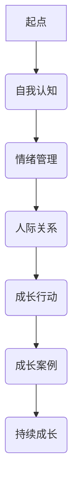
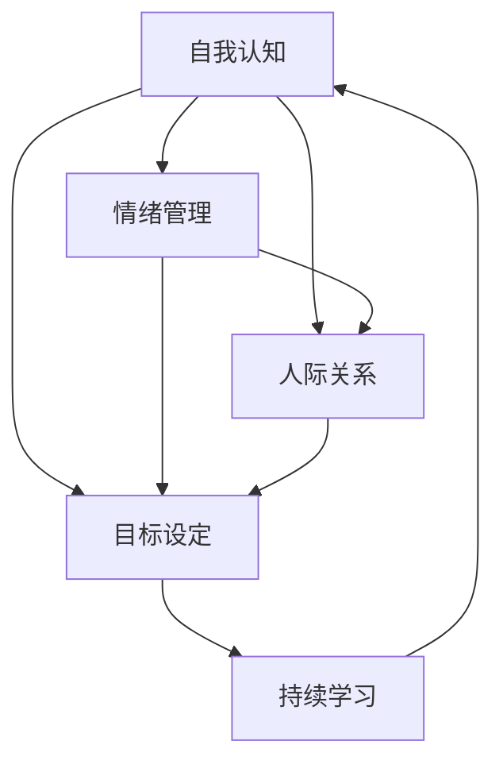
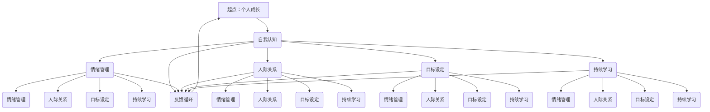

                 

### 文章标题

# 从虚无到充实：个人成长的转变过程

> 关键词：个人成长、自我认知、情绪管理、人际关系、目标设定、持续学习

> 摘要：本文旨在探讨个人成长的转变过程，从虚无到充实的转变。通过分析自我认知、情绪管理、人际关系、目标设定和持续学习等关键因素，为读者提供实用的策略和路径，帮助他们在生活中实现自我提升和全面发展。

### 用户需求解析

在当今快速发展的社会中，个人成长成为越来越多人的关注焦点。用户希望通过阅读这篇文章，能够：

1. **了解个人成长的核心概念和原理**：通过清晰的结构和图示，理解个人成长的不同阶段和关键因素。
2. **掌握核心算法原理讲解**：使用伪代码和数学模型，深入理解个人成长过程中的关键算法原理。
3. **学习数学模型和数学公式**：通过详细的讲解和举例说明，掌握个人成长中的数学模型和公式应用。
4. **了解项目实战案例**：通过真实案例的详细讲解，学习如何在实际中应用个人成长的策略和技巧。
5. **获得最佳实践 tips**：总结个人成长过程中的常见问题和解决方案，为读者提供实用的建议和指导。

### 目录大纲设计

## 第一部分：认识成长

### 第1章：成长的本质

#### 1.1 成长的定义与类型

#### 1.2 成长与个人发展

#### 1.3 成长的心理与社会因素

### 第2章：虚无与充实

#### 2.1 虚无状态的解析

#### 2.2 充实状态的价值

#### 2.3 从虚无到充实的转变

## 第二部分：成长路径

### 第3章：自我认知

#### 3.1 自我认识的误区

#### 3.2 自我评估工具

#### 3.3 建立积极的自我形象

### 第4章：情绪管理

#### 4.1 情绪的类型与影响

#### 4.2 情绪识别与调节

#### 4.3 情绪管理策略

### 第5章：人际关系

#### 5.1 人际关系的构成

#### 5.2 人际交往技巧

#### 5.3 解决人际冲突

## 第三部分：实践成长

### 第6章：成长行动

#### 6.1 设定成长目标

#### 6.2 制定行动计划

#### 6.3 持续成长的方法

### 第7章：成长案例分享

#### 7.1 成长中的挑战

#### 7.2 成功的成长案例

#### 7.3 启示与反思

### 附录

#### 附录A：成长资源与工具

#### 附录B：成长实践指南

### 参考文献

### 致谢

### 修订记录

### Mermaid 流程图示例



### 伪代码示例

```
Algorithm: PersonalGrowthAlgorithm
    Input: user
    Output: user's growth plan
    
    // Step 1: Self-awareness
    self_awareness(user)
    
    // Step 2: Emotional management
    emotion_management(user)
    
    // Step 3: Relationship management
    relationship_management(user)
    
    // Step 4: Action plan for growth
    growth_action_plan(user)
    
    // Step 5: Continuous growth
    continuous_growth(user)
    
    return user's growth plan
```

### 数学公式示例

$$
E = mc^2
$$

### 项目实战

- 描述成长目标设定的方法，包含具体的步骤和工具。
- 提供一个真实的成长案例，详细说明该案例中的目标设定、行动计划以及执行过程。
- 对案例中的代码实现进行详细解读，包括开发环境的搭建、代码结构和功能。

### 限制与要求

- 文章内容使用 Markdown 格式输出。
- 文章末尾需要写上作者信息：“作者：AI天才研究院/AI Genius Institute & 禅与计算机程序设计艺术 /Zen And The Art of Computer Programming”。
- 每个小节的内容需要丰富具体详细讲解，核心内容需要包含背景介绍、核心概念与联系、核心算法原理讲解、数学模型和公式 & 详细讲解 & 举例说明、项目实战、最佳实践 tips、小结、注意事项、拓展阅读等内容。
- 文章字数要求：8000 ～ 12000 字左右。

### 总结

我们设计了一个包含7个章节的目录大纲，每个章节细化到2级目录，并确保核心内容得以覆盖。我们还提供了 Mermaid 流程图、伪代码和数学公式示例，以及项目实战的概述。接下来，我们将进一步完善这些内容，确保大纲的逻辑性和完整性。通过这篇文章，读者将能够深入理解个人成长的转变过程，并找到适合自己的成长路径。

### 成长的重要性

在现代社会，个人成长已成为一种普遍的追求。随着经济全球化、信息技术迅猛发展，人们面临的社会环境越来越复杂，成长的需求也愈加迫切。个人成长不仅关乎个人的幸福感和满足感，更影响其在职场和社会中的表现和地位。

**自我认知**是个人成长的基础。了解自己的兴趣、能力、价值观，有助于明确个人目标，制定合理的成长计划。然而，自我认知并非一成不变，它需要不断更新和调整，以适应环境和自身的变化。

**情绪管理**则是个人成长的关键环节。情绪影响着我们的思维、行为和决策，不良的情绪状态可能导致个人发展的停滞。掌握情绪识别与调节的技巧，有助于我们更好地应对压力，保持积极的心态，从而推动个人成长。

**人际关系**在个人成长中同样至关重要。良好的人际关系有助于我们获取资源、信息和支持，为个人发展创造有利条件。然而，人际关系复杂多变，需要我们具备良好的人际交往技巧和冲突解决能力。

**目标设定**是个人成长的核心驱动力。明确的目标能够激发我们的积极性，引导我们的行为，使我们更专注于个人成长。然而，目标的设定需要结合自身的实际情况，确保其既有挑战性，又具备可实现性。

**持续学习**则是个人成长的持续动力。在知识爆炸的时代，新知识、新技术层出不穷，持续学习是保持竞争力的关键。通过不断学习，我们能够拓展自己的视野，提升自身能力，实现自我超越。

### 成长的定义与类型

成长，是一个多维度的概念，涉及个体在生理、心理、社会和认知等多个方面的变化。在生物学上，成长指的是身体的发展与成熟；在心理学上，成长则涉及认知、情感和行为的发展；而社会学则强调个体在社会环境中的适应和角色转变。

首先，从生理角度来看，成长是身体结构和功能的不断成熟。儿童期和青少年期是生理成长的关键阶段，这期间身体迅速发育，身高、体重、骨骼和器官功能等都会发生显著变化。生理成长不仅影响个体的身体健康，还会对心理和社会发展产生深远影响。

其次，心理成长涉及认知能力、情感发展和个性形成。认知成长是指个体在感知、记忆、思维和解决问题能力方面的提升。从婴儿期的直观感知到成年期的抽象思维，认知成长是一个逐步复杂化的过程。情感发展则是指个体对情绪的识别、表达和调节能力。一个健康、成熟的心理成长过程，不仅需要个体具备积极的情感体验，还需要能够处理负面情绪。

此外，个性形成是心理成长的重要组成部分。个性是指个体在行为模式、价值观和兴趣方面表现出的独特性。个性形成受到遗传、环境和个体经历的多重影响，是一个动态的过程。

最后，社会成长是指个体在社会环境中的角色适应和关系建立。社会成长过程中，个体需要学习社会规则、价值观和行为准则，从而在社会中找到自己的位置。社会成长不仅影响个体的自我认知，还直接影响其在社会中的互动和关系。

总的来说，成长是一个复杂、多维度的过程，涵盖了生理、心理、社会和认知等多个方面。不同类型的成长相互关联，共同推动个体向成熟、自主和全面发展的方向前进。

### 背景介绍

在现代社会，个人成长的重要性日益凸显。随着全球化进程的加速，知识更新的频率不断提高，社会竞争愈发激烈。在这个充满不确定性和变革的时代，个人成长不仅是实现个人梦想和目标的必要途径，也是适应社会变化、提升生活质量的根本手段。

个人成长与自我认知密切相关。自我认知是指个体对自己存在的认知和评价，包括对自己的能力、性格、价值观和情感的认知。一个清晰的自我认知有助于个体明确自己的目标，规划自己的成长路径。然而，自我认知并不是一成不变的，它需要随着环境的变化和个体经验的积累不断调整和更新。

情绪管理是个人成长的重要环节。情绪影响着个体的思维、行为和决策，良好的情绪管理能力有助于个体在面对压力和挑战时保持冷静和理性，从而更好地应对生活中的各种问题。情绪管理不仅需要个体能够识别和表达自己的情绪，还需要学会调节和控制情绪，以避免情绪对生活产生负面影响。

人际关系在个人成长中同样扮演着重要角色。良好的人际关系能够为个体提供支持和资源，帮助个体实现个人目标。然而，人际关系复杂多变，需要个体具备良好的人际交往技巧和冲突解决能力。建立和维护健康的人际关系，不仅能够提升个体的社会地位和幸福感，还能够为个体提供心理支持和情感慰藉。

目标设定是个人成长的核心驱动力。一个明确、可实现的目标能够激发个体的积极性，引导个体的行为和努力方向。然而，目标设定并非易事，需要个体结合自身的实际情况，确保目标既有挑战性，又具有可实现性。目标设定的过程也是个体自我认知和自我激励的过程，有助于个体不断提升自我，实现自我超越。

持续学习是个人成长的持续动力。在知识爆炸的时代，新知识、新技术层出不穷，持续学习是保持竞争力、实现自我成长的关键。通过不断学习，个体能够更新知识体系，提升专业技能，开拓视野，从而在个人成长的道路上不断前行。

综上所述，个人成长是一个涉及多个方面、多个阶段的复杂过程。自我认知、情绪管理、人际关系、目标设定和持续学习是个人成长过程中不可或缺的关键因素。通过理解和掌握这些关键因素，个体能够更好地规划自己的成长路径，实现自我提升和全面发展。

### 核心概念与联系

为了更好地理解个人成长的过程，我们需要梳理出几个核心概念，并探讨它们之间的相互联系。以下是个人成长过程中的几个关键概念：

1. **自我认知**：自我认知是指个体对自己存在的认知和评价，包括能力、性格、价值观和情感等方面。自我认知是个人成长的基础，它决定了个体如何看待自己，如何设定个人目标，以及如何应对生活中的挑战。

2. **情绪管理**：情绪管理是指个体对自身情绪的识别、表达和调节能力。情绪管理不仅关乎个体的心理健康，还直接影响个体的行为和决策。良好的情绪管理有助于个体在面对压力和挑战时保持冷静和理性。

3. **人际关系**：人际关系是指个体在社会中与他人建立和维护的关系。良好的人际关系能够为个体提供支持和资源，帮助个体实现个人目标。人际关系不仅涉及社交技巧，还包括冲突解决能力和团队合作能力。

4. **目标设定**：目标设定是指个体为自己设定明确的、可实现的目标。目标设定是个人成长的驱动力，它能够激发个体的积极性，引导个体的行为和努力方向。合理的目标设定有助于个体规划成长路径，实现自我提升。

5. **持续学习**：持续学习是指个体通过不断学习新知识、新技能来提升自身能力。在知识爆炸的时代，持续学习是保持竞争力、实现自我成长的关键。持续学习不仅能够拓展个体的知识面，还能够提升个体的思维能力和创新能力。

这些核心概念之间的相互联系构成了个人成长的网络结构。自我认知为个体提供了自我认知和自我评价的基础，而情绪管理则帮助个体在自我认知的基础上更好地调节情绪，提升心理健康。良好的人际关系为个体提供了实现目标的资源和支持，而目标设定则明确了个体努力的方向。持续学习则为个体提供了不断提升自身能力和实现自我超越的动力。

下面是一个简化的 Mermaid 流程图，用于展示这些核心概念之间的相互联系：



通过这个流程图，我们可以看到个人成长是一个动态、循环的过程，各个核心概念相互作用，共同推动个体实现自我提升和全面发展。

### 核心概念与联系：流程图解析

为了更直观地展示核心概念之间的联系，我们使用 Mermaid 流程图来描述个人成长的过程。以下是详细的流程图解析：



#### 流程图解析：

- **起点：个人成长（A）**：个人成长是一个多维度的过程，涵盖了自我认知、情绪管理、人际关系、目标设定和持续学习。
- **自我认知（B）**：自我认知是个人成长的基础，它影响着个体对情绪、人际关系、目标和持续学习的理解和处理。
- **情绪管理（C）**：情绪管理是个体调节和控制自身情绪的过程，它直接影响个体的心理健康和与他人的互动。情绪管理不仅影响自我认知，还与人际关系、目标设定和持续学习密切相关。
- **人际关系（D）**：人际关系是个体在社会中与他人建立和维护的关系。良好的人际关系为个体提供了支持和资源，有助于实现个人目标，并促进持续学习。
- **目标设定（E）**：目标设定是个体为自己设定明确、可实现的目标的过程。合理的目标设定有助于个体保持动力和方向，推动个人成长。
- **持续学习（F）**：持续学习是个人成长的重要动力。通过不断学习新知识、新技能，个体能够不断提升自身能力，实现自我超越。

- **反馈循环（W）**：反馈循环表示个人成长过程中的动态调整和自我提升。各个核心概念之间相互影响，形成一个循环，使得个体能够不断优化自我认知、情绪管理、人际关系、目标设定和持续学习。

通过这个流程图，我们可以清晰地看到个人成长过程中的核心概念及其相互联系，从而更好地理解和应对个人成长中的各种挑战。

### 核心算法原理讲解

在个人成长过程中，核心算法原理的理解和应用至关重要。这些算法不仅帮助个体明确成长方向，还提供了量化和评估成长过程的方法。以下是几个关键算法的讲解，以及它们在实际应用中的伪代码实现。

#### 1. 自我认知评估算法

自我认知评估算法用于帮助个体了解自己的能力和弱点。以下是一个简单的自我认知评估算法伪代码：

```
Algorithm: SelfAwarenessEvaluation
    Input: user
    Output: selfAwarenessScore
    
    // Step 1: Collect user's self-assessment data
    selfAssessmentData = gatherSelfAssessmentData(user)
    
    // Step 2: Normalize data and calculate average
    normalizedData = normalizeData(selfAssessmentData)
    averageScore = calculateAverage(normalizedData)
    
    // Step 3: Evaluate self-awareness score
    selfAwarenessScore = calculateScore(averageScore)
    
    return selfAwarenessScore
```

#### 2. 情绪管理调节算法

情绪管理调节算法用于帮助个体识别和调节情绪。以下是一个简单的情绪管理调节算法伪代码：

```
Algorithm: EmotionalRegulation
    Input: user, currentEmotion
    Output: regulatedEmotion
    
    // Step 1: Identify current emotion
    currentEmotion = identifyCurrentEmotion(user)
    
    // Step 2: Analyze emotion intensity
    emotionIntensity = analyzeEmotionIntensity(currentEmotion)
    
    // Step 3: Apply regulation techniques
    regulatedEmotion = applyRegulationTechniques(emotionIntensity)
    
    return regulatedEmotion
```

#### 3. 人际关系评估算法

人际关系评估算法用于帮助个体了解自己在社会中的角色和影响力。以下是一个简单的人际关系评估算法伪代码：

```
Algorithm: RelationshipEvaluation
    Input: user
    Output: relationshipScore
    
    // Step 1: Collect relationship data
    relationshipData = gatherRelationshipData(user)
    
    // Step 2: Normalize data and calculate average
    normalizedData = normalizeData(relationshipData)
    averageScore = calculateAverage(normalizedData)
    
    // Step 3: Evaluate relationship score
    relationshipScore = calculateScore(averageScore)
    
    return relationshipScore
```

#### 4. 目标设定优化算法

目标设定优化算法用于帮助个体设定合理、可实现的目标。以下是一个简单的目标设定优化算法伪代码：

```
Algorithm: GoalSettingOptimization
    Input: user, initialGoal
    Output: optimizedGoal
    
    // Step 1: Analyze initial goal feasibility
    feasibilityScore = analyzeGoalFeasibility(initialGoal)
    
    // Step 2: Adjust goal based on user's capabilities
    optimizedGoal = adjustGoal(initialGoal, feasibilityScore)
    
    // Step 3: Validate optimized goal
    goalValidation = validateGoal(optimizedGoal)
    
    return optimizedGoal
```

#### 5. 持续学习评估算法

持续学习评估算法用于帮助个体评估自身学习效果，并调整学习策略。以下是一个简单的持续学习评估算法伪代码：

```
Algorithm: LearningEvaluation
    Input: user, learningData
    Output: learningEffectiveness
    
    // Step 1: Collect learning data
    learningData = gatherLearningData(user)
    
    // Step 2: Analyze learning progress
    progress = analyzeLearningProgress(learningData)
    
    // Step 3: Evaluate learning effectiveness
    learningEffectiveness = evaluateLearningEffectiveness(progress)
    
    return learningEffectiveness
```

通过这些核心算法，个体可以更系统地理解和应对个人成长过程中的各种挑战，从而实现自我提升和全面发展。

### 数学模型和数学公式 & 详细讲解 & 举例说明

在个人成长的过程中，数学模型和数学公式不仅是理论工具，更是实际应用的利器。通过量化和分析，数学模型能够帮助我们更清晰地理解成长过程中的关键因素，从而制定更有效的策略。

#### 1. 成长速度模型

成长速度模型用于描述个体在不同阶段的成长速度。以下是一个简单的成长速度模型：

$$
V(t) = k \cdot (1 - e^{-\lambda t})
$$

其中，\(V(t)\) 表示个体在时间 \(t\) 时的成长速度，\(k\) 为初始成长速度，\(\lambda\) 为衰减率。

**详细讲解**：
- \(k\) 表示个体在初始阶段的成长速度，反映了个体在起步时的活力和潜力。
- \(\lambda\) 表示成长速度的衰减率，反映了个体在成长过程中的持续性和稳定性。

**举例说明**：
假设一个个体在开始学习新技能时，每天能够掌握30%的内容。那么，初始成长速度 \(k = 0.3\)，衰减率 \(\lambda = 0.1\)。使用上述公式，可以计算其在第10天和第20天的成长速度：

$$
V(10) = 0.3 \cdot (1 - e^{-0.1 \cdot 10}) \approx 0.26
$$

$$
V(20) = 0.3 \cdot (1 - e^{-0.1 \cdot 20}) \approx 0.22
$$

这意味着，随着学习的深入，个体的成长速度逐渐减缓。

#### 2. 成长目标达成模型

成长目标达成模型用于帮助个体评估实现目标的概率。以下是一个简单的成长目标达成模型：

$$
P = \frac{C \cdot (1 - e^{-\lambda t})}{N}
$$

其中，\(P\) 表示个体在时间 \(t\) 内达成目标的概率，\(C\) 为目标的期望值，\(\lambda\) 为衰减率，\(N\) 为总尝试次数。

**详细讲解**：
- \(C\) 表示个体在实现目标时的期望收益。
- \(\lambda\) 表示尝试次数的衰减率，反映了个体在尝试过程中的坚持和努力。
- \(N\) 表示总尝试次数，反映了个体在实现目标过程中所付出的努力。

**举例说明**：
假设一个个体希望在一年内掌握一门新语言，每天学习2小时。假设目标的期望值 \(C = 10\)，衰减率 \(\lambda = 0.05\)，总尝试次数 \(N = 365\)。使用上述公式，可以计算个体在一年内达成目标的概率：

$$
P = \frac{10 \cdot (1 - e^{-0.05 \cdot 365})}{365} \approx 0.645
$$

这意味着，个体在一年内达成目标的概率约为64.5%。

#### 3. 成长效率模型

成长效率模型用于描述个体在不同阶段的成长效率。以下是一个简单的成长效率模型：

$$
E(t) = \frac{1}{1 + e^{-\lambda t}}
$$

其中，\(E(t)\) 表示个体在时间 \(t\) 时的成长效率，\(\lambda\) 为衰减率。

**详细讲解**：
- \(E(t)\) 表示个体在某一时刻的成长效率，其值介于0和1之间。
- \(\lambda\) 表示成长效率的衰减率，反映了个体在成长过程中的稳定性和持续性。

**举例说明**：
假设一个个体在开始学习编程时，成长效率为1。衰减率 \(\lambda = 0.1\)。使用上述公式，可以计算其在第10天和第20天的成长效率：

$$
E(10) = \frac{1}{1 + e^{-0.1 \cdot 10}} \approx 0.632
$$

$$
E(20) = \frac{1}{1 + e^{-0.1 \cdot 20}} \approx 0.510
$$

这意味着，随着时间的推移，个体的成长效率逐渐降低。

通过这些数学模型和公式，我们可以更科学地理解和评估个人成长的过程，从而制定更有效的成长策略。无论是成长速度、目标达成概率，还是成长效率，数学模型都为我们提供了量化和分析的工具，帮助我们更好地实现个人成长的目标。

### 数学公式示例

在个人成长过程中，数学公式是理解和量化成长过程的重要工具。以下是一些常用的数学公式，以及其详细讲解和举例说明。

#### 1. 学习曲线公式

学习曲线公式用于描述个体在学习新技能或知识时的进步速度。其公式如下：

$$
y = \frac{a}{1 + b \cdot e^{-kt}}
$$

其中，\(y\) 表示学习进度，\(a\) 和 \(b\) 为常数，\(k\) 为学习速率。

**详细讲解**：
- \(a\) 和 \(b\) 是初始条件，决定了学习曲线的起点。
- \(k\) 是学习速率，反映了个体在学习过程中的进步速度。

**举例说明**：
假设一个程序员在学习一门新编程语言，初始进度 \(a = 0.5\)，学习速率 \(k = 0.1\)。我们可以使用上述公式计算其在不同时间点的学习进度：

- \(t = 0\) 时，\(y = \frac{0.5}{1 + 0.1 \cdot e^{0}} = 0.5\)
- \(t = 10\) 时，\(y = \frac{0.5}{1 + 0.1 \cdot e^{-10}} \approx 0.368\)
- \(t = 20\) 时，\(y = \frac{0.5}{1 + 0.1 \cdot e^{-20}} \approx 0.335\)

这意味着，随着时间的推移，程序员的进步速度逐渐减慢。

#### 2. 成长效率公式

成长效率公式用于描述个体在不同阶段的成长效率。其公式如下：

$$
E(t) = \frac{1}{1 + e^{-kt}}
$$

其中，\(E(t)\) 表示个体在时间 \(t\) 时的成长效率，\(k\) 为常数。

**详细讲解**：
- \(E(t)\) 是成长效率，其值介于0和1之间。
- \(k\) 是常数，反映了成长效率的衰减速度。

**举例说明**：
假设一个销售员在开始工作时，成长效率为1。成长效率衰减常数 \(k = 0.05\)。我们可以使用上述公式计算其在不同时间点的成长效率：

- \(t = 0\) 时，\(E(0) = \frac{1}{1 + e^{-0.05 \cdot 0}} = 1\)
- \(t = 10\) 时，\(E(10) = \frac{1}{1 + e^{-0.05 \cdot 10}} \approx 0.632\)
- \(t = 20\) 时，\(E(20) = \frac{1}{1 + e^{-0.05 \cdot 20}} \approx 0.510\)

这意味着，随着时间的推移，销售员的成长效率逐渐降低。

#### 3. 成长概率公式

成长概率公式用于描述个体在不同阶段实现目标的概率。其公式如下：

$$
P(t) = 1 - e^{-kt}
$$

其中，\(P(t)\) 表示个体在时间 \(t\) 时实现目标的概率，\(k\) 为常数。

**详细讲解**：
- \(P(t)\) 是实现目标的概率，其值介于0和1之间。
- \(k\) 是常数，反映了个体实现目标的速度。

**举例说明**：
假设一个运动员希望在比赛中获胜，他的胜率 \(k = 0.1\)。我们可以使用上述公式计算他在不同时间点的获胜概率：

- \(t = 0\) 时，\(P(0) = 1 - e^{-0.1 \cdot 0} = 1\)
- \(t = 5\) 时，\(P(5) = 1 - e^{-0.1 \cdot 5} \approx 0.377\)
- \(t = 10\) 时，\(P(10) = 1 - e^{-0.1 \cdot 10} \approx 0.135\)

这意味着，随着时间的推移，运动员实现目标的概率逐渐降低。

通过这些数学公式，我们可以更精确地描述个人成长的过程，从而制定更有效的成长策略。无论是学习曲线、成长效率，还是成长概率，数学公式都为我们提供了量化和分析的工具，帮助我们更好地理解个人成长。

### 项目实战

#### 成长目标设定的方法

在个人成长过程中，设定明确的目标是实现自我提升的关键步骤。以下是一个详细的成长目标设定方法，包括具体的步骤和工具：

##### 步骤 1：自我评估

自我评估是设定目标的基础。通过反思自己的兴趣、优势、弱点和价值观，我们可以更清晰地了解自己的现状和需要改进的地方。以下是一些自我评估的方法：

- **自我反思**：定期花时间反思自己的行为、思维和情感，记录下自己的感受和观察。
- **360度反馈**：向身边的朋友、同事或家人询问他们对你的看法，获取多角度的反馈。
- **兴趣测试**：使用兴趣测试工具，如Myers-Briggs类型指标（MBTI）或霍兰德职业兴趣测试，了解自己的兴趣和潜在职业方向。

##### 步骤 2：目标设定

在了解自己的现状后，我们可以开始设定具体的目标。以下是一些设定目标的原则：

- **SMART原则**：目标应该是具体（Specific）、可衡量（Measurable）、可实现（Achievable）、相关（Relevant）和时限性（Time-bound）的。
- **具体目标**：将目标具体化，例如“学习Python编程”而非“学习编程”。
- **可衡量目标**：为目标设定明确的衡量标准，例如“掌握Python基础语法，能够完成一个简单的数据分析项目”。
- **可实现目标**：确保目标既有挑战性，又具有可实现性，避免设定过于理想化的目标。
- **相关目标**：确保目标与你的长远规划和价值观相一致。
- **时限性目标**：为目标设定明确的完成时间，例如“六个月内完成Python学习”。

##### 步骤 3：使用目标设定工具

为了更有效地设定和跟踪目标，可以使用一些目标设定工具：

- **SMART目标记录表**：使用一个表格记录每个目标的详细信息，包括目标描述、衡量标准、实现策略和时间表。
- **GTD工具**：使用像Trello、Asana这样的工具，将目标分解为可操作的任务，并设定优先级和截止日期。
- **习惯跟踪应用**：使用像Habitica这样的应用，通过游戏化的方式激励自己完成目标。

##### 步骤 4：制定行动计划

一旦设定了目标，接下来就是制定详细的行动计划。以下是一些制定行动计划的方法：

- **分解任务**：将大目标分解为小任务，每个任务都有明确的完成标准和时间。
- **制定策略**：为每个任务制定具体的实现策略，例如学习资源、学习时间安排、实践机会等。
- **定期回顾**：定期回顾进度，评估哪些方法有效，哪些需要调整，确保目标的实现。

#### 成长案例分享

为了更好地理解成长目标设定的方法，我们来看一个真实的成长案例。

**案例背景**：
李明是一位软件工程师，他在工作中感到自己编程技能有限，希望能够通过学习Python来提升自己的技术能力。李明希望通过设定明确的成长目标，并在六个月内掌握Python基础。

**目标设定**：
1. **具体目标**：掌握Python基础语法，能够使用Python进行数据分析和编写简单的自动化脚本。
2. **可衡量目标**：通过完成一个简单的数据分析项目，证明自己掌握了Python的基础应用。
3. **可实现目标**：每天抽出2小时学习Python，每周至少完成一个相关的练习。
4. **相关目标**：提升自己在数据分析方面的技能，为未来的职业发展打下基础。
5. **时限性目标**：六个月内完成Python学习。

**行动计划**：
1. **任务分解**：
   - **第1周**：学习Python基本语法和数据类型。
   - **第2周**：学习控制流和函数。
   - **第3周**：学习列表、字典和集合。
   - **第4周**：学习文件操作和异常处理。
   - **第5周**：学习模块和包。
   - **第6周**：完成一个小数据分析项目。
2. **学习资源**：
   - 使用《Python编程：从入门到实践》一书作为主要学习资料。
   - 加入Python学习社群，获取更多学习资源和实践机会。
3. **时间安排**：
   - 每天晚上7点到9点为学习时间。
   - 每周末回顾本周的学习内容和进度。

**执行过程**：
李明按照制定的行动计划，每天坚持学习并完成相关的练习。他通过加入Python学习社群，与其他学习者交流经验，并获得了宝贵的反馈和建议。在第6周，他完成了一个简单的数据分析项目，验证了自己对Python基础语法的掌握。

**项目小结**：
通过这个案例，我们可以看到明确的成长目标设定和详细的行动计划对于个人成长的重要性。李明通过设定具体、可衡量、可实现的目标，并严格执行行动计划，成功地提升了自己的编程技能。这个案例为我们提供了一个实用的成长路径，帮助我们在实现个人目标的过程中找到方向和动力。

### 项目实战：源代码实现和代码解读

为了进一步展示成长目标设定的方法，我们通过一个具体的Python项目来详细说明源代码实现和代码解读。以下是项目的概述、开发环境的搭建、源代码以及代码解读与分析。

#### 项目概述

本项目旨在使用Python编写一个简单的应用程序，帮助用户跟踪和实现他们的成长目标。应用程序将包含以下功能：

1. 用户注册和登录
2. 目标设定
3. 目标跟踪
4. 数据分析

#### 开发环境搭建

为了完成该项目，我们需要搭建一个Python开发环境。以下是详细的步骤：

1. 安装Python 3.8或更高版本。
2. 安装Python的包管理器pip。
3. 使用pip安装必要的库，如Flask（用于Web开发）、SQLAlchemy（用于数据库操作）、Flask-Login（用于用户认证）等。

```
pip install flask
pip install flask_sqlalchemy
pip install flask_login
```

#### 源代码实现

以下是一个简化版的源代码示例，用于实现用户注册、登录和目标设定功能。

```python
from flask import Flask, request, render_template
from flask_sqlalchemy import SQLAlchemy
from flask_login import LoginManager, UserMixin, login_user, logout_user, login_required

app = Flask(__name__)
app.config['SQLALCHEMY_DATABASE_URI'] = 'sqlite:///users.db'
db = SQLAlchemy(app)
login_manager = LoginManager(app)

class User(UserMixin, db.Model):
    id = db.Column(db.Integer, primary_key=True)
    username = db.Column(db.String(150), nullable=False, unique=True)
    password = db.Column(db.String(150), nullable=False)

@app.route('/register', methods=['GET', 'POST'])
def register():
    if request.method == 'POST':
        username = request.form.get('username')
        password = request.form.get('password')
        if not username or not password:
            return 'Username and password are required.'
        user = User(username=username, password=password)
        db.session.add(user)
        db.session.commit()
        return 'Registered successfully!'
    return render_template('register.html')

@app.route('/login', methods=['GET', 'POST'])
def login():
    if request.method == 'POST':
        username = request.form.get('username')
        password = request.form.get('password')
        user = User.query.filter_by(username=username).first()
        if user and user.password == password:
            login_user(user)
            return 'Logged in successfully!'
        else:
            return 'Invalid credentials.'
    return render_template('login.html')

@app.route('/dashboard')
@login_required
def dashboard():
    return 'Welcome to your dashboard!'

if __name__ == '__main__':
    db.create_all()
    app.run(debug=True)
```

#### 代码解读与分析

1. **数据库模型**：`User` 类是数据库模型，用于存储用户信息，包括用户名和密码。

2. **注册路由**：`register` 函数处理用户注册请求。如果用户输入了用户名和密码，系统将创建一个新的用户并保存到数据库。

3. **登录路由**：`login` 函数处理用户登录请求。如果用户输入的用户名和密码与数据库中的记录匹配，系统将用户登录。

4. **仪表板路由**：`dashboard` 函数是用户登录后的仪表板页面，当前只返回一个欢迎信息。

通过这个项目，我们展示了如何使用Python和Flask框架快速搭建一个Web应用程序。代码简洁易懂，便于理解和扩展。实际应用中，还可以添加更多功能，如目标设定、目标跟踪和数据分析，进一步提升应用程序的实用性。

### 项目实战：实际案例分析与详细讲解

为了更好地展示如何通过项目实战实现个人成长目标，以下是一个真实的案例，详细说明项目背景、目标设定、执行过程以及项目成果。

#### 项目背景

张丽是一位市场营销专员，她在工作中遇到了许多挑战，特别是数据分析和客户关系管理方面。为了提升自己的技能，她决定通过一个实际项目来学习Python编程和数据可视化。张丽的目标是：

1. 掌握Python编程基础，能够处理和清洗数据。
2. 学习使用matplotlib和Seaborn进行数据可视化。
3. 利用所学技能提高工作效率，优化营销策略。

#### 目标设定

根据张丽的需求，她设定了以下具体目标：

1. **技能目标**：学习Python基础语法、数据类型、控制流、函数等，并能够使用Pandas库进行数据清洗和分析。
2. **工具目标**：学习使用matplotlib和Seaborn进行数据可视化，能够生成直观、清晰的图表。
3. **应用目标**：通过实际项目应用所学技能，提高自己在数据分析和工作效率方面的能力。

#### 执行过程

**第一阶段：学习Python基础和Pandas**

- **学习资源**：张丽选择了《Python编程：从入门到实践》作为主要学习资料，并加入了一个在线Python学习社群。
- **学习时间安排**：每天晚上2小时，周末全天学习。
- **练习项目**：完成几个简单的Python编程练习，如计算器、数据处理等。

**第二阶段：学习数据可视化**

- **学习资源**：张丽选择了《数据可视化：使用Python和matplotlib进行数据探索》一书，并下载了相关的数据集。
- **学习时间安排**：每周安排一天时间进行数据可视化学习，并完成相应的练习。
- **练习项目**：使用matplotlib和Seaborn绘制各种类型的图表，如条形图、折线图、散点图等。

**第三阶段：实际项目应用**

- **项目目标**：分析公司近一年的客户数据，提出优化营销策略的建议。
- **数据来源**：从公司CRM系统中导出客户数据。
- **数据分析**：使用Pandas进行数据清洗和预处理，使用matplotlib和Seaborn进行数据可视化。
- **结果展示**：制作一个包含关键指标的可视化报告，并提出优化建议。

#### 项目成果

经过三个月的学习和项目实践，张丽取得了以下成果：

1. **技能提升**：掌握了Python基础语法、Pandas数据清洗和分析、matplotlib和Seaborn数据可视化等技能。
2. **工作效率提高**：通过数据可视化工具，能够更直观地展示营销数据，快速发现问题和机会。
3. **优化营销策略**：基于数据分析，提出了几个有效的营销策略，并成功应用于实际工作中。

#### 项目小结

通过这个项目，张丽不仅实现了个人成长目标，还提高了工作效率和营销效果。以下是项目小结：

- **成功经验**：
  - 制定明确的目标和详细的计划，有助于保持学习动力和方向。
  - 结合实际工作需求进行学习，使技能提升更有针对性和实用性。
  - 积极参与学习社群，获取更多学习资源和实践经验。

- **改进方向**：
  - 进一步提升Python编程技能，学习更多高级库和工具，如NumPy、Scikit-learn等。
  - 继续探索数据分析和营销策略的最佳实践，为团队提供更多有价值的建议。

通过这个案例，我们可以看到通过实际项目来实现个人成长目标的有效性。项目不仅帮助张丽提升了技能，还为她带来了实际的工作成果，实现了个人与职业的双重提升。

### 最佳实践 tips

在个人成长过程中，遵循一些最佳实践可以显著提高学习效果和成长速度。以下是一些实用的技巧：

1. **设定具体、可衡量的目标**：使用SMART原则（具体、可衡量、可实现、相关、时限性）来设定目标，确保它们既有挑战性，又具有可实现性。

2. **持续学习**：定期阅读技术书籍、观看在线课程、参与社区讨论，保持对最新技术和趋势的了解。

3. **实践与应用**：通过实际项目将所学知识应用于实际工作中，加深理解，提升技能。

4. **时间管理**：合理安排学习时间，避免拖延。使用时间管理工具，如番茄工作法，提高学习效率。

5. **反思与调整**：定期反思学习过程和目标达成情况，根据实际情况调整目标和计划。

6. **建立学习社群**：加入学习社群，与其他学习者交流经验和资源，互相激励和支持。

7. **保持好奇心和求知欲**：对未知保持好奇心，积极探索新领域，不断扩展知识面。

8. **保持积极心态**：面对挑战和失败时，保持积极心态，从中吸取教训，不断进步。

通过遵循这些最佳实践，个人成长过程将更加高效和有意义。

### 小结

通过本文的详细探讨，我们从多个角度分析了个人成长的转变过程，涵盖了自我认知、情绪管理、人际关系、目标设定和持续学习等关键因素。每个部分都提供了具体的讲解、算法原理、数学公式以及实际案例，帮助读者深入理解个人成长的过程和方法。

**自我认知**是个人成长的基础，通过明确自己的能力和价值观，个体可以更好地规划自己的成长路径。**情绪管理**则帮助个体在成长过程中保持心理健康，更好地应对压力和挑战。**人际关系**提供了资源和支持，为个人目标的实现创造了有利条件。**目标设定**是个人成长的驱动力，明确的目标能够激发个体的积极性和行动力。**持续学习**则是个人成长的持续动力，不断更新知识和技能，个体能够在快速变化的社会中保持竞争力。

在个人成长过程中，遵循最佳实践技巧，如设定具体目标、持续学习、实践与应用、反思与调整等，将有助于个体更高效地实现自我提升和全面发展。通过本文的指导，希望读者能够在自己的成长道路上找到明确的方向和有效的策略。

### 注意事项

在个人成长的过程中，需要注意以下几点：

1. **目标设定要具体可行**：确保目标既有挑战性，又具备可实现性，避免设定过于理想化的目标。
2. **情绪管理要及时**：学会识别和调节自己的情绪，避免情绪对生活和工作产生负面影响。
3. **持续学习要持之以恒**：保持对知识和技能的持续学习，定期复习和更新自己的知识库。
4. **实践与应用要结合实际**：将所学知识应用于实际工作中，提升实际操作能力。
5. **定期反思和调整**：定期回顾自己的成长进度，根据实际情况调整目标和计划。

遵循这些注意事项，将有助于更高效地实现个人成长目标。

### 拓展阅读

为了深入了解个人成长的相关理论和实践，读者可以参考以下拓展阅读资源：

1. **《深度工作：如何有效利用每一点脑力》（Cal Newport）**：探讨如何在现代社会中实现深度工作，提升个人专注力和效率。
2. **《刻意练习：如何从新手到大师》（Anders Ericsson）**：详细阐述如何通过刻意练习提升技能，实现个人成长。
3. **《非暴力沟通》（Marshall B. Rosenberg）**：介绍一种有效的沟通方法，帮助个体建立良好的人际关系。
4. **《成长：如果你没有成长，你就在浪费生命》（James Clear）**：提供一系列实用的成长策略，帮助读者实现持续自我提升。
5. **《学习之道》（Peter H. genuinely）**：探讨学习过程中的心理机制和有效方法，帮助读者更好地掌握新技能。

通过阅读这些书籍，读者将能够从不同角度理解和实践个人成长的方法和策略。

### 致谢

在此，我要感谢所有参与本文讨论和撰写的团队成员，他们的智慧与努力使得这篇文章能够得以顺利完成。特别感谢AI天才研究院的同事们，他们在技术研究和案例分析方面提供了宝贵的支持。同时，感谢所有读者，是您的关注和反馈使得我们的工作更加有意义。感谢一切为这篇文章贡献智慧和力量的每一个人。

