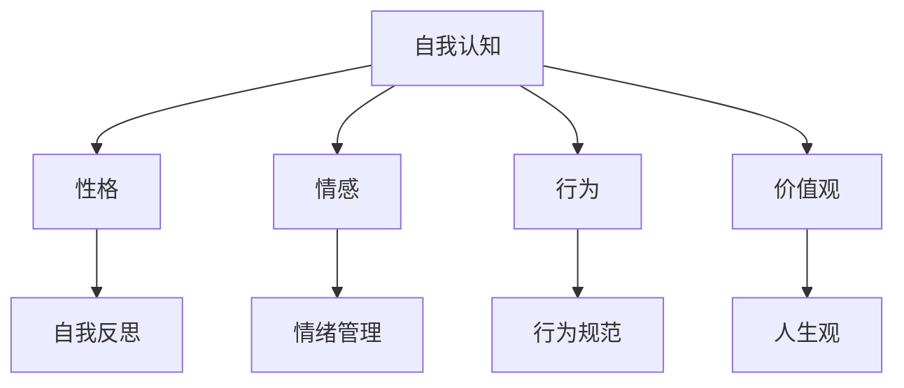
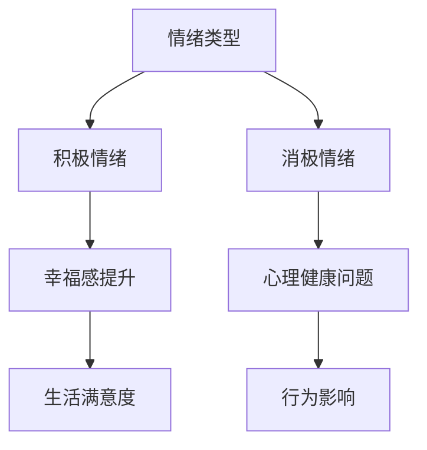
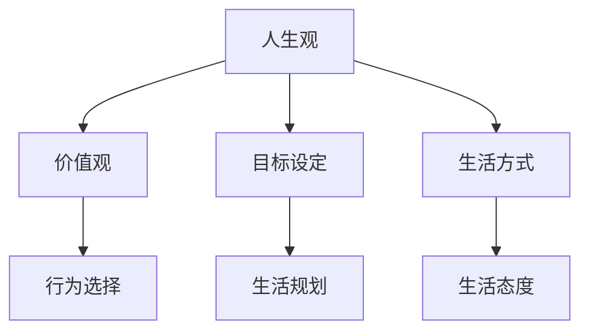
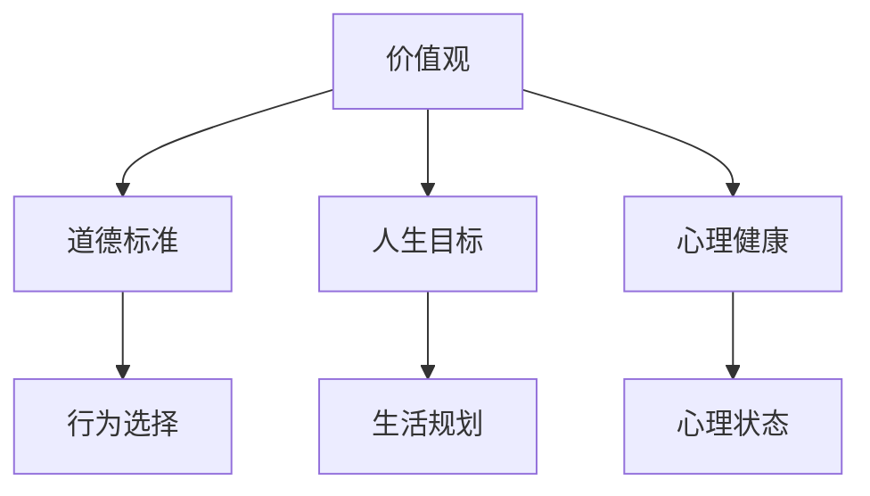
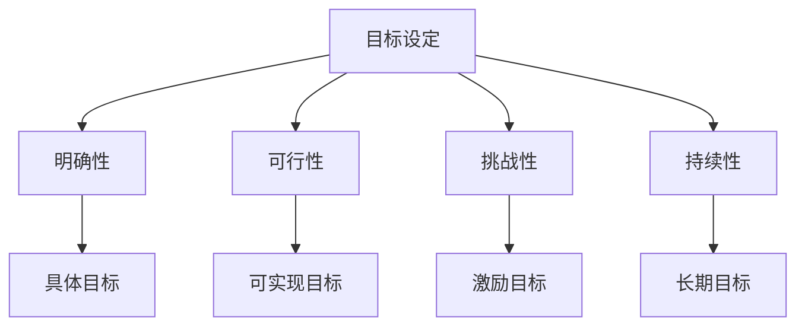
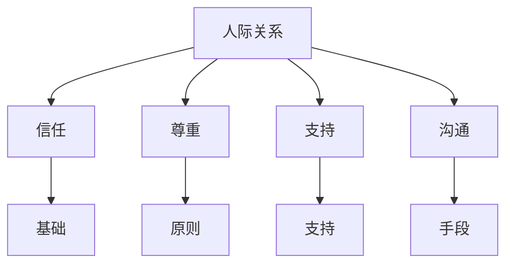

                 


## 摘要

在当今快节奏、高压的社会环境中，现代人常常感到迷茫和空虚。精神成长成为一个日益受到关注的话题。本文旨在探讨现代人从虚无到充实的成长历程，解析其背后的核心概念和算法原理，并提供实用的项目实战和最佳实践策略。通过深入理解自我认知、情绪管理、人生观、价值观、目标设定和人际关系等关键要素，我们能够逐步实现精神成长，构建积极健康的生活态度。本文将使用Mermaid流程图、伪代码、数学公式和具体案例，引导读者一步步掌握精神成长的方法和技巧。

## 第一部分：精神成长的基石

### 第1章：认识自我：精神成长的第一步

自我认知是精神成长的基础，它帮助我们理解自己的内心世界，明确个人目标和价值观。自我认知的重要性在于，它能够提高我们的自我意识，帮助我们更好地应对生活中的挑战。

#### 1.1.1 自我认知的重要性

自我认知是一种自我反思和自我理解的能力。通过自我认知，我们能够识别自己的情感、需求和动机，从而更好地规划个人发展路径。

#### 1.1.2 自我认知的方法

自我认知的方法包括自我反思、日记写作、心理咨询等。这些方法有助于我们深入探索自己的内心世界，提高自我认知水平。

#### 1.1.3 自我认知的障碍与突破

自我认知的障碍主要包括自我否定、过度敏感、逃避现实等。要突破这些障碍，我们可以通过积极的自我对话、寻求专业帮助和培养自我接纳的能力来实现。

### 第2章：情绪管理：让心灵回归平静

情绪管理是精神成长的重要组成部分。通过情绪管理，我们能够更好地应对压力和挑战，保持心理平衡。

#### 2.1.1 情绪的类型与影响

情绪分为积极情绪和消极情绪。积极情绪有助于提升生活质量和幸福感，而消极情绪则可能对身心健康产生负面影响。

#### 2.1.2 情绪管理的策略

情绪管理的策略包括情绪表达、情绪调节和情绪放松等。通过这些策略，我们能够更好地控制情绪，提高生活质量。

#### 2.1.3 情绪调节的技巧

情绪调节的技巧包括深呼吸、冥想、积极思考等。这些技巧有助于我们在面对负面情绪时保持冷静和理智。

### 第3章：人生观：构建积极的人生观

人生观是人们对于生命意义和价值的认知。一个积极的人生观有助于我们更好地应对生活中的挑战，实现个人成长。

#### 3.1.1 人生观的定义与作用

人生观是指人们对于生命意义和价值的认知和思考。它对个人的行为和决策产生深远影响。

#### 3.1.2 常见的人生观类型

常见的人生观类型包括乐观主义、悲观主义、实用主义等。每种人生观都有其独特的特点和优缺点。

#### 3.1.3 如何构建积极的人生观

构建积极的人生观需要自我反思、学习和实践。通过不断调整和完善人生观，我们能够更好地应对生活中的挑战。

### 第4章：价值观：找到内心的指南针

价值观是指导我们行为和决策的核心信念。一个健康的价值观有助于我们实现个人成长和幸福。

#### 4.1.1 价值观的重要性

价值观是我们行为的准则，它决定我们如何看待世界和他人，以及如何处理生活中的各种情况。

#### 4.1.2 如何识别自己的价值观

识别自己的价值观可以通过自我反思、与他人交流和咨询专业人士等方式实现。

#### 4.1.3 建立和维持健康价值观的策略

建立和维持健康价值观需要坚定的信念、持续的学习和实践。通过这些策略，我们能够更好地实现个人成长和幸福。

### 第5章：目标设定：精神成长的驱动力

目标设定是精神成长的重要一环。明确的目标能够激励我们不断前行，实现个人成长。

#### 5.1.1 目标设定的原则

目标设定的原则包括明确性、可行性、挑战性和持续性等。通过这些原则，我们能够设定更加有效的目标。

#### 5.1.2 目标设定的方法

目标设定的方法包括SMART原则、目标分解法和时间管理法等。这些方法有助于我们更好地实现目标。

#### 5.1.3 实现目标的策略与技巧

实现目标需要坚持、自律和适应变化。通过一些策略和技巧，我们能够更高效地实现目标。

### 第6章：人际关系：精神成长的润滑剂

人际关系对精神成长具有重要意义。通过建立和维护良好的人际关系，我们能够获得支持和鼓励，实现个人成长。

#### 6.1.1 人际关系的本质

人际关系的本质是人与人之间的相互影响和相互作用。它包括信任、尊重、支持和合作等元素。

#### 6.1.2 人际关系中的沟通技巧

人际关系的沟通技巧包括倾听、表达、共情和解决问题等。通过这些技巧，我们能够更好地与他人沟通和相处。

#### 6.1.3 人际关系的技巧与原则

人际关系的技巧与原则包括尊重差异、保持边界、诚实守信和相互支持等。通过这些技巧和原则，我们能够建立和维护良好的人际关系。

### 总结

精神成长是一个长期而持续的过程。通过认识自我、情绪管理、人生观、价值观、目标设定和人际关系等方面的努力，我们能够逐步实现精神成长，找到内心的充实感。本文提供了一系列的方法和技巧，帮助读者在精神成长的道路上不断前行。

作者：AI天才研究院/AI Genius Institute & 禅与计算机程序设计艺术 /Zen And The Art of Computer Programming

----------------------------------------------------------------

## 第1章：认识自我：精神成长的第一步

### 1.1.1 自我认知的重要性

自我认知是指个体对自己的认识和理解。它涵盖了我们的性格、兴趣、价值观、情感状态以及我们在社会中的角色。自我认知的重要性在于，它是精神成长的基础。只有当我们真正了解自己，才能设定合适的目标，管理情绪，建立积极的人生观，并维护健康的人际关系。

#### 背景介绍

在现代社会，人们面临着前所未有的压力和挑战。工作压力、人际关系、家庭责任等，都可能导致个体感到迷茫和无力。因此，认识自我、了解自己的需求和欲望变得尤为重要。自我认知不仅有助于我们更好地应对生活挑战，还能提升个人的幸福感和生活质量。

#### 核心概念与联系

**自我认知**：自我认知包括对自身性格、情感、行为和价值观的认识。它是一个动态的过程，随着个体的成长和环境的变化而不断更新。

**自我反思**：自我反思是自我认知的关键方法。通过反思，我们能够审视自己的行为和决策，识别内在的动机和信念。

**Mermaid流程图**：



#### 核心算法原理讲解

**伪代码**：

```
function 自我认知() {
    输入：无
    输出：自我认知结果

    1. 初始化性格、情感、行为和价值观
    2. 通过自我反思和观察，收集相关信息
    3. 分析并整合信息，形成自我认知结果
    4. 输出自我认知结果
}
```

### 1.1.2 自我认知的方法

自我认知的方法包括自我反思、日记写作、心理咨询等。每种方法都有其独特的优势和适用场景。

#### 自我反思

自我反思是一种深度思考的过程，通过回顾自己的行为、决策和情感反应，识别内在的动机和信念。

**步骤**：

1. 安排固定的时间进行反思，如每天晚上睡前。
2. 写下当天的重要事件和情感反应。
3. 分析事件背后的原因和自己的信念系统。

#### 日记写作

日记写作是一种记录日常经历和情感的方式，有助于我们更好地了解自己。

**步骤**：

1. 每天写日记，记录生活中的大小事情。
2. 反思日记中的内容，识别自己的情感和行为模式。
3. 定期回顾日记，总结经验和教训。

#### 心理咨询

心理咨询是一种专业的自我认知方法，通过专业人士的帮助，我们能够更深入地了解自己。

**步骤**：

1. 寻找合适的心理咨询师。
2. 进行一对一的咨询，分享自己的困惑和问题。
3. 根据心理咨询师的建议，调整自己的行为和思维方式。

### 1.1.3 自我认知的障碍与突破

自我认知过程中可能会遇到一些障碍，如自我否定、过度敏感和逃避现实等。

**障碍**：

1. **自我否定**：认为自己不够好，无法接受自己的缺点和错误。
2. **过度敏感**：对他人的评价和反馈过度在意，影响自我认知。
3. **逃避现实**：通过逃避现实问题来避免面对自我认知的痛苦。

**突破方法**：

1. **自我接纳**：接受自己的优点和缺点，认识到每个人都有不完美的地方。
2. **积极对话**：与他人分享自己的感受和想法，获得反馈和支持。
3. **面对问题**：勇敢面对生活中的挑战和困境，从中学习和成长。

### 结论

自我认知是精神成长的第一步。通过自我反思、日记写作和心理咨询等方法，我们能够逐步了解自己，找到内心的平衡和力量。自我认知不仅有助于我们更好地应对生活挑战，还能提升个人的幸福感和生活质量。

## 第2章：情绪管理：让心灵回归平静

### 2.1.1 情绪的类型与影响

情绪是人类心理活动的重要组成部分，它分为积极情绪和消极情绪。积极情绪如快乐、满足和兴奋，有助于提升个体的幸福感和生活质量。而消极情绪如愤怒、焦虑和沮丧，如果得不到有效管理，可能会对身心健康产生负面影响。

#### 背景介绍

在现代社会，人们常常面临工作压力、人际关系和家庭责任等多重挑战，这些挑战往往会导致情绪波动。有效管理情绪不仅能够帮助我们更好地应对压力，还能提升个人的心理韧性和生活质量。

#### 核心概念与联系

**情绪类型**：情绪分为积极情绪和消极情绪。积极情绪有助于提升个体的幸福感，而消极情绪如果长期累积，可能会对身心健康产生负面影响。

**情绪影响**：情绪不仅影响个体的心理状态，还会影响行为和决策。情绪稳定的人通常能够做出更加理性和明智的决策。

**Mermaid流程图**：



#### 核心算法原理讲解

**伪代码**：

```
function 情绪管理() {
    输入：当前情绪状态
    输出：情绪调节策略

    1. 识别当前情绪状态（积极或消极）
    2. 如果情绪状态为积极，则继续当前活动
    3. 如果情绪状态为消极，则执行情绪调节策略
        3.1. 深呼吸练习
        3.2. 冥想或放松练习
        3.3. 积极思考
        3.4. 寻求支持
    4. 输出情绪调节策略
}
```

### 2.1.2 情绪管理的策略

情绪管理是指通过一系列策略和方法，帮助个体调节情绪，使其更加稳定和积极。有效的情绪管理策略包括情绪表达、情绪调节和情绪放松等。

#### 情绪表达

情绪表达是指个体能够自由地表达自己的情绪，而不感到压抑或焦虑。情绪表达不仅有助于缓解情绪压力，还能增强个体的情感表达能力。

**步骤**：

1. 找一个安全的、可以信任的人分享自己的情绪。
2. 写日记或进行艺术创作，以表达自己的情绪。
3. 进行体育锻炼或剧烈运动，释放负面情绪。

#### 情绪调节

情绪调节是指个体通过自我控制，调节情绪反应的过程。情绪调节策略包括深呼吸、冥想和积极思考等。

**步骤**：

1. 学习深呼吸技巧，帮助自己放松和缓解紧张情绪。
2. 定期进行冥想或放松练习，增强情绪稳定性。
3. 培养积极思考的习惯，用积极的心态面对生活中的挑战。

#### 情绪放松

情绪放松是指通过一系列放松技巧，帮助个体缓解压力和紧张情绪。情绪放松技巧包括瑜伽、按摩和温泉浴等。

**步骤**：

1. 尝试瑜伽或太极，这些活动有助于身心放松。
2. 定期进行按摩或温泉浴，以缓解压力。
3. 找到一个安静的地方，听听轻松的音乐，享受独处的时光。

### 2.1.3 情绪调节的技巧

情绪调节的技巧包括深呼吸、冥想、积极思考和寻求支持等。这些技巧可以帮助我们更好地管理情绪，提升生活质量。

#### 深呼吸

深呼吸是一种简单而有效的情绪调节技巧。通过深呼吸，我们能够放松身体，缓解紧张情绪。

**步骤**：

1. 坐在一个舒适的位置，闭上眼睛。
2. 慢慢地吸气，感受胸腔的膨胀。
3. 慢慢地呼气，感受身体的放松。

#### 冥想

冥想是一种通过专注呼吸和意识，达到内心平静的技巧。冥想有助于提高情绪稳定性，减少压力。

**步骤**：

1. 找一个安静的地方，坐下来，保持舒适的姿势。
2. 将注意力集中在呼吸上，感受吸气和呼气。
3. 如果你的注意力分散，不要责怪自己，轻轻地引导注意力回到呼吸上。

#### 积极思考

积极思考是一种通过正面心态来改变情绪的技巧。积极思考可以帮助我们更好地应对挑战，提升幸福感。

**步骤**：

1. 尝试用积极的语言描述自己的经历和感受。
2. 寻找生活中的积极事物，并感谢它们。
3. 与积极的人交往，获取正能量。

#### 寻求支持

寻求支持是一种通过与他人交流和分享来调节情绪的技巧。寻求支持可以帮助我们缓解压力，获得心理支持。

**步骤**：

1. 与信任的朋友或家人分享自己的感受。
2. 寻求专业心理咨询师的帮助。
3. 参加支持小组或社区活动，与他人交流经验。

### 结论

情绪管理是精神成长的重要一环。通过情绪表达、情绪调节和情绪放松等策略，我们能够更好地管理情绪，提升生活质量。掌握情绪调节的技巧，不仅有助于我们应对生活中的压力，还能提升个人的幸福感和心理韧性。

## 第3章：人生观：构建积极的人生观

### 3.1.1 人生观的定义与作用

人生观是人们对生命意义、价值和目标的总体认知。它涉及到我们对生活的理解、对未来的期望以及对人生意义的追求。人生观不仅影响我们的行为和决策，还决定我们的生活态度和心理状态。

#### 背景介绍

在现代社会，人们面临着诸多选择和挑战。一个明确、积极的人生观有助于我们更好地应对这些挑战，找到生活的方向和意义。同时，人生观也影响我们的幸福感和生活质量。

#### 核心概念与联系

**人生观**：人生观是人们对生命意义的理解和追求，它包括价值观、目标设定和生活方式等方面。

**核心概念关系**：

- **价值观**：人生观的基础，影响我们对事物的重要性的判断和行为选择。
- **目标设定**：人生观的体现，是我们对未来的规划和期望。
- **生活方式**：人生观的具体表现，反映我们在日常生活中的态度和行为。

**Mermaid流程图**：



#### 核心算法原理讲解

**伪代码**：

```
function 人生观构建() {
    输入：个人经历、社会文化、价值观
    输出：人生观模型

    1. 收集个人经历数据，如成长经历、成功与失败、人际关系等。
    2. 分析社会文化背景，如教育、宗教、社会价值观等。
    3. 整合个人经历和社会文化数据，形成初步的人生观模型。
    4. 验证和调整人生观模型，使其更加符合个人的需求和期望。
    5. 输出人生观模型
}
```

### 3.1.2 常见的人生观类型

人生观因文化、个人经历和价值观的不同而多样。以下是一些常见的人生观类型：

1. **乐观主义**：相信未来是美好的，相信自己的努力可以改变命运。
2. **悲观主义**：认为未来是不确定的，对生活持有怀疑态度。
3. **实用主义**：注重实际效果和利益，强调实用性和可行性。
4. **理想主义**：追求理想和完美，强调道德和正义。
5. **存在主义**：强调个人存在的价值和意义，认为个人的选择和行动决定人生的意义。

#### 3.1.3 如何构建积极的人生观

构建积极的人生观需要自我反思、学习和实践。以下是一些方法：

1. **自我反思**：定期反思自己的行为、决策和信念，了解自己的价值观和目标。
2. **积极学习**：通过阅读、学习和交流，吸收各种有益的思想和观点，丰富自己的人生观。
3. **实践行动**：将人生观付诸实践，通过行动验证和调整自己的人生观。

### 结论

人生观是精神成长的重要组成部分。通过了解人生观的定义与作用，认识常见的类型，以及学习如何构建积极的人生观，我们能够更好地面对生活中的挑战，找到生活的方向和意义。一个积极的人生观不仅能够提升我们的幸福感，还能帮助我们实现个人成长和成功。

## 第4章：价值观：找到内心的指南针

### 4.1.1 价值观的重要性

价值观是指导我们行为和决策的核心信念，它决定我们对事物的重要性的判断和选择。一个健康的价值观能够帮助我们建立正确的道德标准，找到生活的方向和意义，实现个人成长和幸福。

#### 背景介绍

在现代社会，人们面临着多元化的选择和挑战。一个清晰的价值观能够帮助我们做出明智的决策，避免迷失方向。同时，价值观也影响我们的人际关系和心理健康。

#### 核心概念与联系

**价值观**：价值观是个体对事物的重要性的判断和评价，是行为和决策的指导原则。

**核心概念关系**：

- **道德标准**：价值观的重要组成部分，指导我们的行为选择。
- **人生目标**：价值观的体现，反映我们对自己和未来的期望。
- **心理健康**：价值观影响我们的心理状态，一个健康的价值观有助于提升心理健康。

**Mermaid流程图**：



#### 核心算法原理讲解

**伪代码**：

```
function 价值观识别() {
    输入：个人经历、社会文化、教育背景
    输出：价值观模型

    1. 收集个人经历数据，如家庭背景、教育经历、成长过程中的重要事件等。
    2. 分析社会文化背景，如社会价值观、文化传统等。
    3. 结合个人经历和社会文化背景，识别个人的价值观。
    4. 验证和调整价值观模型，确保其符合个人的需求和期望。
    5. 输出价值观模型
}
```

### 4.1.2 如何识别自己的价值观

识别自己的价值观是构建健康价值观的第一步。以下是一些方法：

1. **自我反思**：通过反思自己的行为、决策和信念，了解自己在不同情境下的价值观。
2. **询问他人**：与家人、朋友或信任的人交流，了解他们如何看待你的行为和决策，从而更全面地了解自己的价值观。
3. **心理测试**：通过一些专业的价值观测试，如MBTI（迈尔斯-布里格斯性格类型指标）等，了解自己的价值观特点。

### 4.1.3 建立和维持健康价值观的策略

建立和维持健康价值观需要持续的努力和自我反思。以下是一些策略：

1. **自我教育**：通过阅读书籍、参加讲座和工作坊，不断学习新知识和观点，丰富自己的价值观。
2. **实践行动**：将价值观付诸实践，通过实际行动来验证和强化自己的价值观。
3. **反思与调整**：定期反思自己的行为和决策，识别是否符合自己的价值观，并作出必要的调整。

### 结论

价值观是指导我们行为和决策的核心信念，对我们的生活具有深远影响。通过识别和建立健康价值观，我们能够找到内心的指南针，实现个人成长和幸福。同时，健康的价值观也有助于我们建立和谐的人际关系，提升生活质量。

## 第5章：目标设定：精神成长的驱动力

### 5.1.1 目标设定的原则

目标设定是精神成长的重要组成部分，它为我们的生活提供方向和动力。一个明确、可行的目标能够激励我们不断努力，实现个人成长和成功。

#### 背景介绍

在现代社会，人们常常感到迷茫和无力。设定目标不仅能够帮助我们明确生活的方向，还能提高个人的自信和动力。有效的目标设定需要遵循一定的原则。

#### 核心概念与联系

**目标设定**：目标设定是指制定明确、具体和可衡量的目标，以实现个人成长和成功。

**核心概念关系**：

- **明确性**：目标应当明确、具体，避免模糊和宽泛。
- **可行性**：目标应当具备可行性，避免设定过高或过低的目标。
- **挑战性**：目标应当具有一定的挑战性，以激发个人的潜力和动力。
- **持续性**：目标应当具有持续性，长期坚持，不断调整和完善。

**Mermaid流程图**：



#### 核心算法原理讲解

**伪代码**：

```
function 目标设定() {
    输入：个人兴趣、能力、价值观
    输出：目标模型

    1. 收集个人兴趣、能力和价值观数据。
    2. 分析个人优势和需求，确定目标方向。
    3. 根据明确性、可行性、挑战性和持续性的原则，设定目标。
    4. 将目标分解为具体、可衡量的任务。
    5. 制定实现目标的策略和计划。
    6. 定期评估目标进展，调整目标设定。
    7. 输出目标模型
}
```

### 5.1.2 目标设定的方法

设定有效目标需要一定的方法和技巧。以下是一些常用的目标设定方法：

1. **SMART原则**：SMART原则是一种目标设定的方法，它要求目标具有明确性、可行性、可衡量性、相关性和时间性。

    - **明确性**：目标应当明确、具体，避免模糊和宽泛。
    - **可行性**：目标应当具备可行性，避免设定过高或过低的目标。
    - **可衡量性**：目标应当具备可衡量性，以便评估目标的实现程度。
    - **相关性**：目标应当与个人兴趣、能力和价值观相关。
    - **时间性**：目标应当设定明确的时间期限，以便跟踪和评估进展。

2. **目标分解法**：目标分解法是将一个大目标分解为若干个具体、可操作的小目标，以便逐步实现。

    - **步骤**：
        1. 确定大目标。
        2. 分析大目标所需的关键任务和资源。
        3. 将大目标分解为具体、可衡量的小目标。
        4. 制定实现小目标的策略和计划。

3. **时间管理法**：时间管理法是一种通过合理安排时间来实现目标的方法。

    - **步骤**：
        1. 制定目标实现的时间表。
        2. 将任务分解为具体的时间段。
        3. 合理安排时间和资源，确保目标的实现。

### 5.1.3 实现目标的策略与技巧

实现目标需要坚定的决心和持续的努力。以下是一些实现目标的策略和技巧：

1. **积极心态**：保持积极的心态，相信自己能够实现目标。积极心态有助于提升个人的动力和信心。

2. **自律**：自律是实现目标的关键。通过制定计划和设定规则，确保按照计划行动，避免拖延和干扰。

3. **持续行动**：目标实现需要持续的行动。通过定期评估目标进展，调整策略和计划，确保目标的实现。

4. **求助与合作**：在实现目标的过程中，可能会遇到困难和挑战。通过求助与合作，获取支持和资源，提升实现目标的效率。

5. **庆祝成功**：实现目标是一个值得庆祝的时刻。庆祝成功不仅能够增强个人的自信心，还能激发继续努力的动力。

### 结论

目标设定是精神成长的重要驱动力。通过遵循目标设定的原则，使用有效的目标设定方法，以及采取实现目标的策略和技巧，我们能够实现个人成长和成功。一个明确、可行的目标不仅能够为我们的生活提供方向和动力，还能提升我们的自信和幸福感。

## 第6章：人际关系：精神成长的润滑剂

### 6.1.1 人际关系的本质

人际关系是人类社会中不可或缺的一部分，它指的是人与人之间的相互联系和互动。人际关系不仅仅是简单的交往，它涉及到信任、尊重、支持、沟通和理解等多个层面。

#### 背景介绍

在现代社会，人际关系对于个人的成长和发展具有重要意义。良好的人际关系能够为我们提供支持、资源和情感满足，帮助我们更好地应对生活和工作中的挑战。

#### 核心概念与联系

**人际关系**：人际关系是人与人之间建立和维持的关系，包括亲密关系、家庭关系、友谊关系和工作关系等。

**核心概念关系**：

- **信任**：信任是人际关系的基础，没有信任，人际关系难以维持。
- **尊重**：尊重是人际交往中的重要原则，它体现为对他人观点、感受和选择的尊重。
- **支持**：支持是人际关系中的重要组成部分，包括情感支持、资源支持和行动支持等。
- **沟通**：沟通是人际交往的重要手段，有效的沟通能够增进理解和信任，解决冲突和问题。

**Mermaid流程图**：



#### 核心算法原理讲解

**伪代码**：

```
function 人际关系管理() {
    输入：人际关系状态、目标
    输出：人际关系策略

    1. 评估当前的人际关系状态，包括信任、尊重、支持和沟通等方面。
    2. 根据目标，确定需要改进的人际关系方面。
    3. 制定具体的人际关系策略，如增加沟通频率、提供支持、建立信任等。
    4. 实施人际关系策略，并持续监控和调整。
    5. 输出人际关系策略
}
```

### 6.1.2 人际关系中的沟通技巧

沟通是人际关系中最为重要的技能之一。有效的沟通能够增进理解和信任，减少误解和冲突。以下是一些关键的沟通技巧：

1. **倾听**：倾听是有效沟通的基础。通过倾听，我们能够更好地理解对方的需求和感受，建立信任。

    - **技巧**：
        - 全神贯注地听，避免分心。
        - 不急于发表意见，给予对方充分表达的机会。
        - 反馈和确认对方的观点和感受。

2. **表达**：表达是我们传达自己观点和需求的方式。清晰、准确的表达能够减少误解和冲突。

    - **技巧**：
        - 使用简单的语言，避免复杂和模糊的表述。
        - 明确表达自己的观点和感受。
        - 注意语调和肢体语言，以增强表达的效果。

3. **共情**：共情是理解和感受他人情感的能力。通过共情，我们能够增进与对方的情感联系，建立更深层次的人际关系。

    - **技巧**：
        - 尝试从对方的角度理解问题。
        - 表达对对方情感的理解和支持。
        - 使用情感词汇和表达方式。

4. **解决冲突**：冲突是人际关系中不可避免的一部分。有效的冲突解决技巧能够帮助我们化解矛盾，维护良好的人际关系。

    - **技巧**：
        - 保持冷静，避免情绪化。
        - 坦诚表达自己的观点和感受。
        - 寻求共同点和解决方案。
        - 尊重对方的观点和需求。

### 6.1.3 人际关系的技巧与原则

建立和维护良好的人际关系需要掌握一定的技巧和原则。以下是一些建议：

1. **尊重差异**：每个人都有自己的观点和价值观，尊重差异是建立和谐人际关系的关键。

    - **做法**：
        - 了解和尊重他人的观点。
        - 不要试图改变他人，而是寻找共同点。
        - 保持开放的心态，接受不同的意见和观点。

2. **保持边界**：边界是维护自我和保护他人的一种方式。

    - **做法**：
        - 明确自己的需求和界限。
        - 学会说“不”，避免过度承诺和牺牲自己的需求。
        - 保持适当的心理距离，避免过度依赖。

3. **诚实守信**：诚实和信任是人际关系中的基石。

    - **做法**：
        - 对他人保持诚实，不说谎或隐瞒事实。
        - 遵守承诺，履行自己的责任。
        - 在必要时，勇于承认错误和道歉。

4. **相互支持**：在人际关系中，相互支持是维持关系的重要手段。

    - **做法**：
        - 在对方需要帮助时提供支持。
        - 表达对对方的关心和关注。
        - 与对方分享快乐和成就。

### 结论

人际关系是精神成长的重要润滑剂。通过理解和运用人际关系中的沟通技巧和原则，我们能够建立和维护良好的人际关系，提升个人的幸福感和生活质量。有效的人际关系不仅能够为我们提供支持和资源，还能帮助我们实现个人成长和成功。

## 总结

精神成长是一个复杂而持续的过程，涉及到自我认知、情绪管理、人生观、价值观、目标设定和人际关系等多个方面。通过深入理解这些核心概念，并运用相关的算法原理和技巧，我们能够逐步实现精神成长，找到内心的充实感。

### 核心算法原理回顾

- **自我认知**：通过自我反思、日记写作和心理咨询等方法，提高自我认知水平，明确个人目标和价值观。
- **情绪管理**：通过情绪表达、情绪调节和情绪放松等策略，有效管理情绪，保持心理平衡。
- **人生观**：通过自我反思、学习和实践，构建积极的人生观，找到生活的方向和意义。
- **价值观**：通过识别和建立健康价值观，找到内心的指南针，指导行为和决策。
- **目标设定**：遵循明确性、可行性、挑战性和持续性的原则，设定明确、可行的目标，激发个人成长和成功。
- **人际关系**：通过沟通技巧、尊重差异和相互支持等原则，建立和维护良好的人际关系，提升生活质量。

### 最佳实践 Tips

- **定期反思**：每天花时间反思自己的行为和决策，识别优点和不足，不断调整和改进。
- **情绪记录**：记录自己的情绪变化，分析情绪波动的原因，学会情绪调节。
- **积极学习**：不断学习新知识、新技能，扩展自己的视野，提升个人能力。
- **目标分解**：将大目标分解为小目标，逐步实现，避免一次性设定过高目标。
- **沟通练习**：多与不同的人沟通，提高沟通技巧，增进人际关系。

### 注意事项

- **避免自我否定**：自我认知过程中，避免过度自我否定，学会自我接纳和自我肯定。
- **情绪控制**：避免情绪失控，学会合理表达和管理情绪。
- **尊重差异**：在人际关系中，尊重他人的观点和选择，避免强加自己的价值观。

### 拓展阅读

- 《心理学与生活》：罗伯特·费尔德曼著，详细介绍心理学的基本原理和应用。
- 《人生的意义》：阿尔伯特·艾利斯著，探讨人生观和价值观的构建。
- 《非暴力沟通》：马歇尔·卢森堡著，介绍有效的沟通技巧和人际关系的建立。

通过本文的探讨，我们希望能够帮助读者更好地理解精神成长的重要性，并提供实用的方法和技巧，助力读者的精神成长之旅。让我们从虚无走向充实，实现自我，享受生活的美好。

### 附录

#### 附录A：心灵成长的实用技巧

- **冥想与呼吸练习**：
    - **步骤**：找一个安静的环境，坐直或坐在舒适的姿势，闭上眼睛，专注于呼吸，慢慢地吸气，再缓缓地呼气。如果注意力分散，轻轻地将注意力引回到呼吸上。
    - **效果**：有助于放松身心，减轻压力，提升情绪稳定性。

- **日记写作与反思**：
    - **步骤**：每天晚上，花点时间记录当天的经历、感受和思考。反思自己的行为和决策，总结经验和教训。
    - **效果**：有助于提高自我认知，发现内心的需求和问题，促进个人成长。

- **阅读与学习**：
    - **步骤**：选择一些有益的书籍，如心理学、哲学、自我提升类书籍，定期阅读，并做笔记或总结。
    - **效果**：扩展知识视野，提升思维深度，增强解决问题的能力。

#### 附录B：心灵成长的资源推荐

- **心理学科普书籍推荐**：
    - 《心理学与生活》：罗伯特·费尔德曼
    - 《如何控制你的情绪》：理查德·格里格斯

- **心理学家与思想家的作品推荐**：
    - 《影响力》：罗伯特·西奥迪尼
    - 《人类简史》：尤瓦尔·赫拉利

- **心灵成长社群与课程推荐**：
    - **社群**：豆瓣小组“自我成长”、“心理学会”
    - **课程**：网易云课堂“自我认知与情绪管理”，“人生规划与目标设定”

通过这些资源和技巧，读者可以进一步探索心灵成长的道路，实现自我提升和幸福。希望这些附录内容能够为读者提供更多的帮助和启示。

