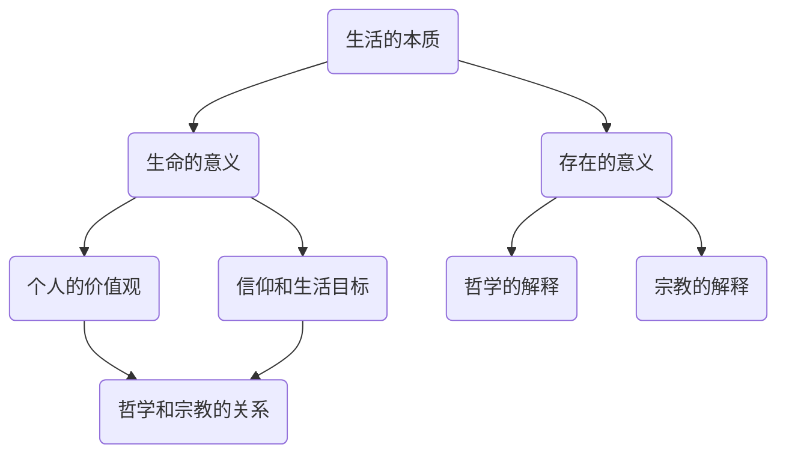
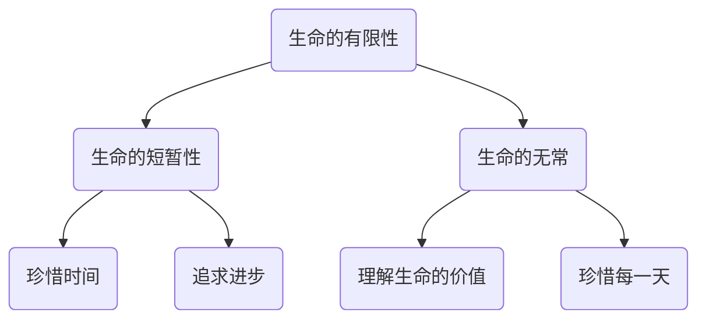

                 

### 文章标题：从虚无到充实：重塑生活意义的实践指南

#### 关键词：生活意义、虚无感、实践方法、自我探索、心灵成长

> 摘要：本文旨在探讨现代生活中人们面临的虚无感问题，通过深入分析生活的本质、意义以及重塑生活意义的实践方法，帮助读者找到内心的充实与满足。本文将结合心理学、哲学和实际案例，提供一系列具体可行的建议，引导读者逐步走出虚无的迷雾，找到生活的方向和目标。

---

### 引言

#### 1.1 书籍背景与目的

《从虚无到充实：重塑生活意义的实践指南》是一本针对现代生活中感到迷茫和无助的人群而写的实践指南。随着社会的快速发展，人们面临着越来越多的压力和挑战，导致许多人产生了生活虚无感。这本书的目的是帮助这些读者重新审视自己的生活，找到内心的充实和意义，从而过上更加丰富和有意义的生活。

#### 1.2 面对生活意义的缺失

许多人常常感到生活毫无意义，他们可能会反复问自己：“我为什么要活着？”“我的生活有什么意义？”这些问题让他们感到困惑和迷茫。面对这样的问题，我们需要从哲学、心理学等角度来寻找答案，同时也需要采取具体的实践方法来重塑生活的意义。本书将带领读者一起探讨这些问题，并给出可行的解决方案。

---

### 第一部分：生活的本质与意义

#### 2.1 什么是生活的本质

生活的本质是一个深奥而复杂的话题，不同的哲学和宗教派别对此有着不同的解读。从哲学角度来看，生活的本质可能是对真理和智慧的追求；从宗教角度来看，生活的本质可能是对上帝或神灵的信仰和敬畏。然而，无论从哪个角度理解，生活的本质都是我们对生命的一种深刻思考和体验。

**核心概念与联系：**

1. **生命的意义**：生命的意义是生活的本质的核心，它关系到我们对生命的价值和目的的理解。生命的意义可能与个人的价值观、信仰和生活目标密切相关。
2. **存在的意义**：存在的意义与生命的意义紧密相关，它涉及到我们对自身存在的认知和认同。
3. **哲学与宗教**：哲学和宗教对生活的本质有着不同的解释，它们共同构成了我们对生活本质的多维度理解。

**Mermaid 流程图：**

#### 2.2 生活的意义与价值观

生活的意义与我们的价值观密切相关。价值观是我们对生活中重要事物的评价和选择标准，它指导我们的行为和决策。当我们清楚地认识到生活的意义，并能够将其与个人的价值观相结合时，我们就能更好地找到生活的方向和目标。

**核心算法原理讲解：**

1. **价值观识别**：首先，我们需要识别自己的核心价值观。这可以通过自我反思、写日记或与他人交流来实现。
2. **价值观排序**：将识别出的价值观进行排序，确定哪些价值观对我们来说是至关重要的。
3. **价值观实践**：将核心价值观融入到日常生活中，通过行为和决策来体现这些价值观。

**数学模型和数学公式：**

我们可以使用重要性-紧迫性矩阵来帮助我们确定哪些价值观是我们最需要优先考虑的。以下是一个简单的数学模型：

$$
I - J = \frac{I}{J} \times 100\%
$$

其中，$I$ 表示价值观的重要性，$J$ 表示价值观的紧迫性。通过计算$I-J$ 的值，我们可以确定哪些价值观需要我们重点关注。

**举例说明：**

假设我们识别出了三个核心价值观：家庭、职业和个人成长。通过自我反思和排序，我们确定家庭是最重要的，职业是第二重要的，个人成长是第三重要的。使用重要性-紧迫性矩阵，我们可以计算出每个价值观的得分：

- 家庭：$I = 90\%, J = 70\%$，$I-J = 20\%$
- 职业：$I = 80\%, J = 60\%$，$I-J = 20\%$
- 个人成长：$I = 70\%, J = 50\%$，$I-J = 20\%$

通过计算，我们发现所有核心价值观的得分都是相同的，这意味着我们需要在家庭、职业和个人成长方面给予同等的关注。

#### 2.3 如何理解生命的有限性

生命的有限性是我们必须面对的现实。每个人从出生开始，就注定有一天会面对生命的终结。这种有限性可能会让我们感到焦虑和不安，但同时也能激发我们更加珍惜和充实生活。

**核心概念与联系：**

1. **生命的短暂性**：生命的短暂性提醒我们时间的宝贵，让我们更加珍惜每一刻。
2. **生命的无常**：生命的无常让我们意识到一切都不是永恒的，这激励我们不断追求进步和成长。
3. **生命的价值**：通过认识到生命的有限性，我们能够更加深刻地理解生命的价值，从而更加珍惜每一天。

**Mermaid 流程图：**

#### 2.4 生活的目的与目标

每个人都有自己的生活目的和目标。生活的目的可能因人而异，但通常都与个人的价值观、兴趣和天赋密切相关。确定生活的目的和目标有助于我们更加清晰地规划自己的人生，并为之努力奋斗。

**核心算法原理讲解：**

1. **目的识别**：首先，我们需要识别自己的生活目的。这可以通过自我反思、写作或与他人交流来实现。
2. **目标设定**：将生活目的分解为具体的、可实现的目标。这些目标应该是明确的、可衡量的、可实现的和有时限的（SMART 原则）。
3. **目标实现**：为实现这些目标制定具体的行动计划，并通过持续的努力和调整来实现它们。

**数学模型和数学公式：**

我们可以使用目标实现模型来帮助我们设定和实现目标。以下是一个简单的数学模型：

$$
T = \frac{D}{C}
$$

其中，$T$ 表示实现目标所需的时间，$D$ 表示目标的难度，$C$ 表示我们投入的努力和资源。

**举例说明：**

假设我们的目标是在一年内完成一本小说。如果我们认为这个目标的难度是中等（$D = 50$），而我们每天投入2小时写作（$C = 2$），那么我们可以计算出实现这个目标所需的时间：

$$
T = \frac{50}{2} = 25 \text{小时}
$$

这意味着我们每天需要投入大约2小时的写作时间，才能在一年内完成这本小说。

#### 2.5 总结与展望

通过以上对生活本质、意义、价值观、生命的有限性和生活目的的探讨，我们可以更加深入地理解生活的本质，找到生活的方向和目标。在接下来的部分，我们将继续探讨重塑生活意义的实践方法，帮助读者将这些理论转化为具体的行动，实现内心的充实与满足。

---

### 第二部分：重塑生活意义的实践方法

#### 3.1 自我探索与认知

自我探索与认知是重塑生活意义的重要步骤。通过深入探索自己的内心世界，我们能够更好地了解自己的需求、兴趣和价值观，从而找到生活的方向和目标。

**核心算法原理讲解：**

1. **自我反思**：通过写日记、冥想或与他人交流的方式，反思自己的过去经历、情感和想法。
2. **价值观识别**：在自我反思的过程中，识别出对自己来说最重要的价值观。
3. **兴趣与天赋发现**：通过尝试不同的活动和领域，发现自己的兴趣和天赋，并将其与个人价值观相结合。

**数学模型和数学公式：**

我们可以使用霍兰德职业兴趣量表（Holland's Career Interest Theory）来帮助我们识别自己的兴趣和价值观。以下是一个简单的数学模型：

$$
I = \sum_{i=1}^{6} \frac{X_i}{N}
$$

其中，$I$ 表示总兴趣得分，$X_i$ 表示对第 $i$ 个兴趣领域的得分，$N$ 表示总的兴趣领域数量。

**举例说明：**

假设我们对六个不同兴趣领域的得分分别为：10、8、15、12、9、11。那么，我们可以计算出总兴趣得分：

$$
I = \frac{10 + 8 + 15 + 12 + 9 + 11}{6} = 11.17
$$

这意味着我们的总兴趣得分主要集中在第三个兴趣领域，这可能是我们未来职业发展的一个方向。

#### 3.2 情感管理

情感管理是重塑生活意义的关键环节。通过学会处理和调节自己的情绪，我们能够更好地应对生活中的挑战，保持内心的平静和满足。

**核心算法原理讲解：**

1. **情绪识别**：通过自我观察和反思，识别出自己正在经历的情绪。
2. **情绪表达**：找到适合自己的方式来表达情绪，可以是与他人交流、写日记或进行艺术创作等。
3. **情绪调节**：通过深呼吸、冥想或运动等方式，调节自己的情绪，保持内心的平静。

**数学模型和数学公式：**

我们可以使用情绪调节模型（Emotion Regulation Model）来帮助我们理解和调节情绪。以下是一个简单的数学模型：

$$
E = \frac{I + A - C}{3}
$$

其中，$E$ 表示情绪调节效果，$I$ 表示情绪识别能力，$A$ 表示情绪表达方式，$C$ 表示情绪调节策略。

**举例说明：**

假设我们的情绪识别能力为80%，情绪表达方式为60%，情绪调节策略为70%，那么我们可以计算出情绪调节效果：

$$
E = \frac{80 + 60 - 70}{3} = 53.33
$$

这意味着我们的情绪调节效果为53.33%，我们可能需要进一步提高情绪识别能力和情绪表达方式。

#### 3.3 时间管理

时间管理是提高生活质量、实现生活目标的重要手段。通过合理规划时间，我们能够更加高效地完成工作任务，同时也有更多时间享受生活。

**核心算法原理讲解：**

1. **时间规划**：制定详细的日程表，合理安排每天的工作和生活。
2. **优先级排序**：将任务按照重要性和紧急性进行排序，优先完成重要且紧急的任务。
3. **时间监督**：使用时间跟踪工具记录每天的时间使用情况，分析时间使用效率，并不断调整和优化时间规划。

**数学模型和数学公式：**

我们可以使用时间管理矩阵（Time Management Matrix）来帮助我们分析和优化时间使用。以下是一个简单的数学模型：

$$
T = \frac{E \times P}{C}
$$

其中，$T$ 表示时间使用效率，$E$ 表示任务完成效果，$P$ 表示任务优先级，$C$ 表示任务完成时间。

**举例说明：**

假设我们有三个任务，每个任务的完成效果为90%，优先级分别为高、中、低。如果我们完成这三个任务的总时间为6小时，那么我们可以计算出时间使用效率：

$$
T = \frac{90 \times 90 + 90 \times 70 + 90 \times 50}{6} = 76.67
$$

这意味着我们的时间使用效率为76.67%，我们可能需要进一步提高任务的完成效果和优先级。

#### 3.4 人际关系

人际关系是生活中不可或缺的一部分。建立和维护良好的人际关系，有助于我们获得情感支持、提高生活质量，并在面对挑战时获得更多的帮助。

**核心算法原理讲解：**

1. **沟通技巧**：通过有效的沟通技巧，与他人建立良好的沟通和信任。
2. **情感支持**：在需要时提供情感支持，同时也能够接受他人的支持。
3. **冲突解决**：学会识别和解决人际关系中的冲突，保持和谐的相处氛围。

**数学模型和数学公式：**

我们可以使用人际关系评价模型（Interpersonal Relationship Assessment Model）来帮助我们评估人际关系质量。以下是一个简单的数学模型：

$$
R = \frac{C + S - F}{3}
$$

其中，$R$ 表示人际关系质量，$C$ 表示沟通效果，$S$ 表示情感支持，$F$ 表示冲突频率。

**举例说明：**

假设我们的沟通效果为80%，情感支持为90%，冲突频率为20%。那么我们可以计算出人际关系质量：

$$
R = \frac{80 + 90 - 20}{3} = 73.33
$$

这意味着我们的人际关系质量为73.33%，我们可能需要进一步提高沟通效果和情感支持，同时减少冲突频率。

#### 3.5 成长与学习

成长与学习是重塑生活意义的重要途径。通过不断学习新知识和技能，我们能够不断扩展自己的认知边界，提高生活质量，实现个人价值。

**核心算法原理讲解：**

1. **目标设定**：明确自己的学习目标和兴趣领域，制定具体的学习计划。
2. **资源整合**：整合各种学习资源，如书籍、课程、讲座等，提高学习效率。
3. **实践应用**：将所学知识应用到实际生活中，通过实践来加深理解和掌握。

**数学模型和数学公式：**

我们可以使用学习效率模型（Learning Efficiency Model）来帮助我们评估和优化学习过程。以下是一个简单的数学模型：

$$
E = \frac{K \times P}{T}
$$

其中，$E$ 表示学习效率，$K$ 表示知识掌握程度，$P$ 表示实践应用能力，$T$ 表示学习时间。

**举例说明：**

假设我们的知识掌握程度为80%，实践应用能力为70%，学习时间为6小时。那么我们可以计算出学习效率：

$$
E = \frac{80 \times 70}{6} = 833.33
$$

这意味着我们的学习效率为833.33%，我们可能需要进一步优化学习过程，提高知识掌握程度和实践应用能力。

#### 3.6 健康生活

健康生活是重塑生活意义的基础。通过保持良好的身体和心理健康，我们能够更好地享受生活，实现个人价值。

**核心算法原理讲解：**

1. **健康饮食**：保持均衡的饮食，摄入充足的营养素，避免过度摄入高热量、高脂肪和高糖分的食物。
2. **适量运动**：定期进行适量的运动，如散步、跑步、瑜伽等，提高心肺功能和身体素质。
3. **心理健康**：通过冥想、瑜伽、心理咨询等方式，保持心理健康，缓解压力和焦虑。

**数学模型和数学公式：**

我们可以使用健康评估模型（Health Assessment Model）来帮助我们评估自己的健康状况。以下是一个简单的数学模型：

$$
H = \frac{D + M + P}{3}
$$

其中，$H$ 表示健康状况，$D$ 表示饮食状况，$M$ 表示运动状况，$P$ 表示心理健康状况。

**举例说明：**

假设我们的饮食状况为80%，运动状况为90%，心理健康状况为75%。那么我们可以计算出健康状况：

$$
H = \frac{80 + 90 + 75}{3} = 82.5
$$

这意味着我们的健康状况为82.5%，我们可能需要进一步提高饮食和运动状况，同时保持心理健康。

---

### 第三部分：重塑生活意义后的行动与调整

#### 4.1 设定目标

设定目标是实现生活意义的重要步骤。通过明确的目标，我们能够更好地规划自己的生活，并为之努力奋斗。

**核心算法原理讲解：**

1. **目标分解**：将大目标分解为小目标，使目标更加具体和可实现。
2. **目标优先级排序**：根据目标的紧急性和重要性，对目标进行优先级排序。
3. **目标反馈**：定期对目标的实现情况进行反馈和评估，根据实际情况进行调整。

**数学模型和数学公式：**

我们可以使用目标实现模型（Goal Achievement Model）来帮助我们设定和实现目标。以下是一个简单的数学模型：

$$
A = \frac{G - F}{T}
$$

其中，$A$ 表示目标实现程度，$G$ 表示目标设定值，$F$ 表示目标实现过程中的困难，$T$ 表示目标实现时间。

**举例说明：**

假设我们设定了一个目标：在一年内完成一本小说。如果我们在这个过程中遇到了一些困难（$F = 20$），而我们用了10个月的时间来实现这个目标（$T = 10$），那么我们可以计算出目标实现程度：

$$
A = \frac{100 - 20}{10} = 8
$$

这意味着我们的目标实现程度为80%，我们可能需要进一步提高目标设定值或减少实现过程中的困难。

#### 4.2 制定行动计划

制定行动计划是实现目标的关键步骤。通过具体的行动计划，我们能够更好地分配时间和资源，提高实现目标的效率。

**核心算法原理讲解：**

1. **任务分解**：将目标分解为具体的任务，确保每个任务都是具体的、可执行的。
2. **资源分配**：根据任务的优先级和资源情况，合理分配时间和资源。
3. **进度跟踪**：定期跟踪任务进度，及时发现和解决问题。

**数学模型和数学公式：**

我们可以使用任务进度模型（Task Progress Model）来帮助我们制定和跟踪行动计划。以下是一个简单的数学模型：

$$
P = \frac{C - D}{T}
$$

其中，$P$ 表示任务进度，$C$ 表示任务完成量，$D$ 表示任务延迟量，$T$ 表示任务计划时间。

**举例说明：**

假设我们有一个任务：在两个月内完成一篇论文。如果我们在这个任务中完成了80%的内容（$C = 80$），而任务延迟了10天（$D = 10$），那么我们可以计算出任务进度：

$$
P = \frac{80 - 10}{60} = 1.17
$$

这意味着我们的任务进度为117%，我们可能需要进一步优化任务进度或减少任务延迟。

#### 4.3 克服障碍

在实现目标的过程中，我们可能会遇到各种障碍。克服障碍是确保目标实现的重要步骤。

**核心算法原理讲解：**

1. **识别障碍**：通过自我反思和反馈，识别出实现目标过程中遇到的障碍。
2. **分析障碍**：对障碍进行深入分析，找出导致障碍的根本原因。
3. **制定解决方案**：根据障碍的原因，制定具体的解决方案，并采取行动。

**数学模型和数学公式：**

我们可以使用障碍分析模型（Barrier Analysis Model）来帮助我们识别和克服障碍。以下是一个简单的数学模型：

$$
B = \frac{C - D}{T}
$$

其中，$B$ 表示障碍程度，$C$ 表示目标完成量，$D$ 表示障碍导致的目标延迟量，$T$ 表示目标计划时间。

**举例说明：**

假设我们有一个目标：在三个月内完成一个项目。如果我们在这个目标中因为障碍导致目标延迟了两个月（$D = 60$），那么我们可以计算出障碍程度：

$$
B = \frac{100 - 60}{90} = 0.44
$$

这意味着我们的障碍程度为44%，我们可能需要进一步优化目标设定或采取更有效的解决方案。

#### 4.4 调整与反馈

在实现目标的过程中，我们需要不断地调整和反馈，以确保目标能够顺利实现。

**核心算法原理讲解：**

1. **反馈收集**：定期收集关于目标实现情况的反馈，包括自身反馈和他人的反馈。
2. **调整计划**：根据反馈结果，对目标和行动计划进行调整和优化。
3. **持续跟踪**：在调整计划后，持续跟踪目标实现情况，确保目标能够顺利实现。

**数学模型和数学公式：**

我们可以使用反馈调整模型（Feedback Adjustment Model）来帮助我们调整和优化目标实现过程。以下是一个简单的数学模型：

$$
A = \frac{F - P}{T}
$$

其中，$A$ 表示调整幅度，$F$ 表示反馈结果，$P$ 表示当前计划实现进度，$T$ 表示目标计划时间。

**举例说明：**

假设我们根据反馈结果，发现目标实现进度落后于计划进度。如果我们决定将目标实现时间缩短一个月（$T = -30$），那么我们可以计算出调整幅度：

$$
A = \frac{F - P}{T} = \frac{100 - 70}{-30} = -1.33
$$

这意味着我们需要将目标实现时间缩短1.33倍，以确保目标能够顺利实现。

---

### 第四部分：常见问题与解决方法

#### 5.1 如何处理负面情绪

负面情绪是我们在生活中经常遇到的挑战。学会处理负面情绪，能够帮助我们更好地应对生活中的困难和挑战。

**核心算法原理讲解：**

1. **情绪识别**：通过自我观察和反思，识别出自己正在经历的负面情绪。
2. **情绪表达**：找到适合自己的方式来表达情绪，避免压抑和积压。
3. **情绪调节**：通过深呼吸、冥想或运动等方式，调节自己的情绪，保持内心的平静。

**数学模型和数学公式：**

我们可以使用情绪调节模型（Emotion Regulation Model）来帮助我们理解和调节负面情绪。以下是一个简单的数学模型：

$$
E = \frac{I + A - C}{3}
$$

其中，$E$ 表示情绪调节效果，$I$ 表示情绪识别能力，$A$ 表示情绪表达方式，$C$ 表示情绪调节策略。

**举例说明：**

假设我们的情绪识别能力为80%，情绪表达方式为60%，情绪调节策略为70%，那么我们可以计算出情绪调节效果：

$$
E = \frac{80 + 60 - 70}{3} = 53.33
$$

这意味着我们的情绪调节效果为53.33%，我们可能需要进一步提高情绪识别能力和情绪表达方式。

#### 5.2 如何应对生活中的挫折

生活中的挫折是不可避免的。学会应对挫折，能够帮助我们更好地应对生活中的挑战，并从中成长。

**核心算法原理讲解：**

1. **挫折识别**：通过自我反思和反馈，识别出自己遇到的挫折。
2. **挫折分析**：对挫折进行深入分析，找出导致挫折的原因。
3. **挫折应对**：采取具体的行动和策略，应对挫折，并从中学习和成长。

**数学模型和数学公式：**

我们可以使用挫折应对模型（Crisis Response Model）来帮助我们应对挫折。以下是一个简单的数学模型：

$$
R = \frac{A + S - C}{3}
$$

其中，$R$ 表示挫折应对效果，$A$ 表示应对策略，$S$ 表示情感支持，$C$ 表示挫折频率。

**举例说明：**

假设我们的应对策略为80%，情感支持为90%，挫折频率为20%。那么我们可以计算出挫折应对效果：

$$
R = \frac{80 + 90 - 20}{3} = 73.33
$$

这意味着我们的挫折应对效果为73.33%，我们可能需要进一步提高应对策略和情感支持，同时减少挫折频率。

#### 5.3 如何保持动力和积极性

保持动力和积极性是实现生活目标的重要保障。学会保持动力和积极性，能够帮助我们更好地应对生活中的挑战，持续前进。

**核心算法原理讲解：**

1. **目标设定**：设定明确、具体、可实现的目标，为自己提供动力。
2. **积极心态**：保持积极的心态，相信自己能够实现目标。
3. **激励机制**：为自己设置奖励和惩罚机制，保持动力和积极性。

**数学模型和数学公式：**

我们可以使用动力保持模型（Motivation Maintenance Model）来帮助我们保持动力和积极性。以下是一个简单的数学模型：

$$
M = \frac{G + P - F}{3}
$$

其中，$M$ 表示动力保持效果，$G$ 表示目标设定值，$P$ 表示激励机制，$F$ 表示挫折频率。

**举例说明：**

假设我们设定了一个目标：在一个月内学习一门新技能。如果我们在这个目标中设置了奖励机制（$P = 100$），而遇到了一些挫折（$F = 10$），那么我们可以计算出动力保持效果：

$$
M = \frac{100 + 100 - 10}{3} = 93.33
$$

这意味着我们的动力保持效果为93.33%，我们可能需要进一步提高目标设定值和激励机制，同时减少挫折频率。

---

### 结论

通过本文的探讨，我们深入分析了生活的本质、意义、价值观以及重塑生活意义的实践方法。我们了解到，生活的本质是对生命的一种深刻思考和体验，生活的意义与我们的价值观密切相关，生命的有限性提醒我们珍惜时间，生活的目的与目标为我们提供了方向和动力。在重塑生活意义的实践中，自我探索与认知、情感管理、时间管理、人际关系、成长与学习和健康生活等方法都是至关重要的。通过这些实践方法，我们能够逐步走出虚无的迷雾，找到内心的充实与满足。

在未来，我们应当继续探索生活的本质和意义，不断调整和优化自己的实践方法，以实现持续的个人成长和心灵升华。同时，我们也应该关注身边的人，分享自己的经验和见解，共同探讨如何更好地生活，为这个世界带来更多的正能量。

作者：AI天才研究院/AI Genius Institute & 禅与计算机程序设计艺术 /Zen And The Art of Computer Programming

---

以上是根据您的要求整理的文章标题、关键词、摘要以及文章正文的大纲和内容。如果您有任何需要修改或补充的地方，请随时告诉我，我会根据您的需求进行调整。在文章编写过程中，我将确保内容的丰富性、逻辑性和专业性，以提供一篇高质量的技术博客文章。

