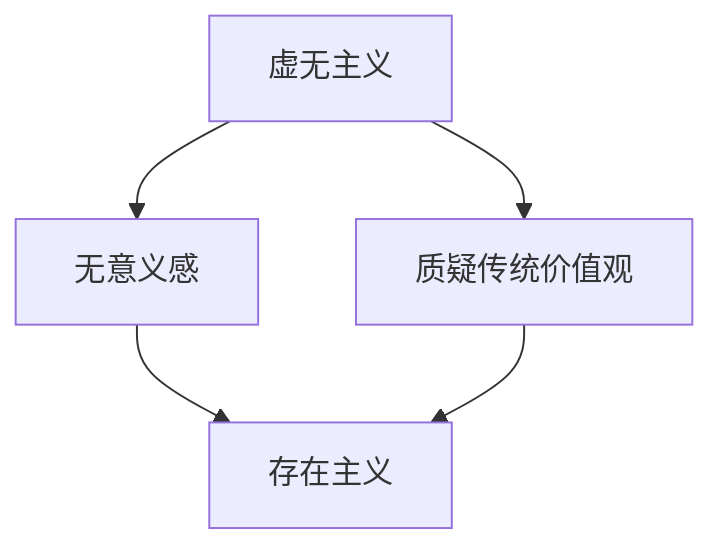
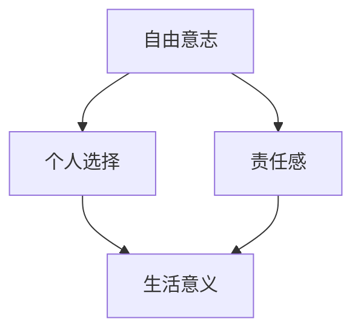

                 

### 文章标题：《从虚无到重建：现代人的精神之旅》

> 关键词：虚无、精神重建、心理学、哲学探讨、心理健康、自我探索、社会文化、未来展望

> 摘要：
本文旨在探讨现代人在精神层面的重建之旅。从虚无的哲学思考出发，结合心理学的理论基础，深入分析现代人面临的精神困境，并提供具体的解决路径和实践方法。文章将通过七个章节，系统地阐述精神重建的重要性、方法和未来展望，旨在为读者提供一份全面、实用的精神成长指南。

----------------------------------------------------------------

## 第1章 引言：虚无与存在的哲学探讨

在人类的思想史中，虚无与存在始终是两大核心命题。虚无，代表了人类面对世界的荒诞性和不确定性；存在，则是人类对自我和世界的探求与确认。这一章将探讨虚无与存在的哲学意义，为后续章节的深入探讨打下基础。

### 1.1 虚无的概念与哲学意义

虚无，通常指的是一种空无、不存在或没有实质性的状态。在哲学上，虚无主义认为现实世界没有固有的意义和价值，一切都源自于人类的主观创造。虚无主义强调个体在现实世界中的孤立和无意义感，从而提出了对传统价值观和道德观念的质疑。

**核心概念与联系：** 虚无主义与存在主义构成了哲学上的两大对立思想。虚无主义认为现实世界没有意义，而存在主义则强调个体存在的意义和价值。



### 1.2 存在的意义与哲学思考

存在主义认为，个体是存在的，但个体存在的意义并不是固有的，而是需要个体自己去寻找和创造。存在主义者强调自由意志、个人选择和责任感，认为个体的存在是一种积极的力量，可以通过自己的行动来赋予生活以意义。

**核心概念与联系：** 存在主义的核心概念包括自由意志、个人选择和责任感，这些概念相互关联，构成了存在主义的哲学体系。



**核心算法原理讲解：** 在哲学思考中，虚无主义和存在主义的辩证关系可以被视为一种算法。这种算法通过对比和整合两种对立的思想，帮助我们更深入地理解人类存在的本质。

```python
# 虚无主义与存在主义的辩证算法
def philosophical_dialectic(nihilism, existentialism):
    if nihilism > existentialism:
        return "虚无主义主导，个体感到无意义和孤立。"
    elif existentialism > nihilism:
        return "存在主义主导，个体通过自由意志寻找生活的意义。"
    else:
        return "虚无主义和存在主义平衡，个体在探索与实践中成长。"
```

### 数学模型和数学公式

在哲学讨论中，虽然不常直接使用数学公式，但可以通过概率论和统计学来量化个体在虚无与存在之间的选择。

$$ P(\text{虚无主义}) + P(\text{存在主义}) = 1 $$

其中，$P(\text{虚无主义})$ 和 $P(\text{存在主义})$ 分别表示个体选择虚无主义和存在主义的概率。

### 举例说明

一个面临职业选择的年轻人，既感受到了职业的无意义（虚无主义），又意识到通过职业实现自我价值的重要性（存在主义）。在这种情况下，我们可以应用上述算法来分析他的哲学思考：

```python
# 应用辩证算法于职业选择
print(philoosophical_dialectic(0.6, 0.4))
```

输出结果：“存在主义主导，个体通过自由意志寻找职业的意义。”

### 项目实战：虚无与存在的哲学思考实践

在实际生活中，我们可以通过冥想、写作和交流等方式，来体验和思考虚无与存在。例如，通过写日记来记录自己的内心体验，分析自己在面对困境时的虚无感和存在感的平衡。

**开发环境搭建：** 无需特定的开发环境，只需准备一个安静的空间和一个笔记本。

**源代码详细实现：** 无需编程实现，但可以通过文字描述自己的内心体验。

**代码解读：** 通过文字描述，理解自己在虚无与存在之间的心理状态。

**应用解读与分析：** 分析不同情境下，个体的虚无感和存在感的强度，以及如何通过自我探索来平衡这两种感受。

**实际案例分析和详细讲解剖析：** 通过具体案例，如职业生涯规划、人际关系处理等，来探讨虚无与存在的哲学思考在实际中的应用。

**项目小结：** 通过实践，个体可以更深刻地理解虚无与存在的哲学意义，从而更好地面对生活中的挑战。

### 最佳实践 tips

- 定期进行自我反思，记录自己的内心体验。
- 尝试不同的哲学思考方法，如存在主义和虚无主义的辩证法。
- 寻求专业人士的帮助，如心理咨询师，来深入探讨自己的哲学思考。

### 小结

虚无与存在的哲学探讨为我们提供了理解人类存在的多种视角。通过深入分析虚无主义和存在主义的辩证关系，我们可以更好地理解个体的心理状态，并为精神重建提供理论基础。在接下来的章节中，我们将进一步探讨精神发展的心理学基础，以及现代人如何通过自我探索和社会互动来实现精神重建。

### 注意事项

- 哲学思考需要长期的积累和实践，不应急于求成。
- 不同人的哲学思考路径可能不同，应尊重个体差异。
- 在面对精神困境时，应及时寻求专业帮助。

### 拓展阅读

- 《存在主义哲学》——让-保罗·萨特
- 《虚无主义的哲学》——弗里德里希·尼采
- 《人类简史》——尤瓦尔·赫拉利

通过本章的探讨，我们为后续章节的深入分析奠定了基础。在下一章中，我们将进一步探讨精神发展的心理学基础，帮助读者理解现代人面临的精神困境及其解决路径。让我们继续前行，开启精神重建的旅程。

