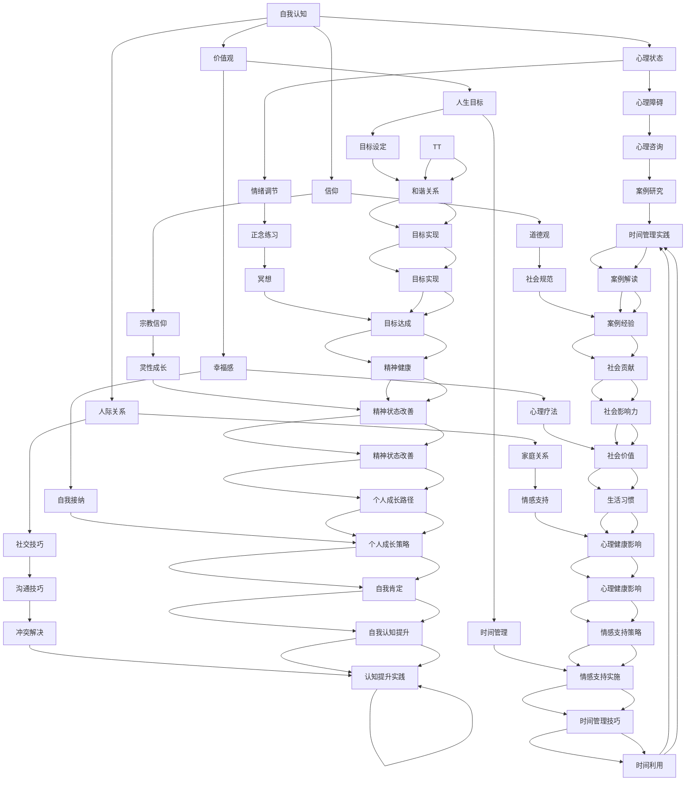

                 

### 文章标题

“从迷失到重生：现代人的精神成长历程”

### 关键词

现代人的精神成长、自我认知、心理健康、人际关系、信仰与价值观

### 摘要

本文旨在探讨现代人如何从迷失走向重生，实现精神成长的过程。通过分析自我认知、心理状态、人际关系、信仰和价值观等核心概念，并运用Mermaid流程图、伪代码、LaTeX公式和项目实战等多种方式，本文详细解析了现代人在精神成长过程中的关键步骤和方法。文章不仅提供了理论指导，还结合实际案例，帮助读者更好地理解和实践精神成长的路径。

## 核心概念与联系

在探讨现代人的精神成长历程时，我们需要明确几个核心概念，并理解它们之间的相互关系。以下是几个关键概念的定义及其相互关系：

1. **自我认知**：指个体对自己存在的认知，包括性格、能力、价值观等方面。它是精神成长的基础。

2. **心理状态**：指个体的情绪、情感、思维等心理活动，包括情绪调节和心理障碍。

3. **人际关系**：指个体与他人之间的相互关系，包括家庭、朋友和社会关系。

4. **信仰**：指个体对某种宗教、哲学或伦理观念的坚定信念。

5. **价值观**：指个体在行为选择中所遵循的道德准则和人生信念。

这些概念之间的关系可以用Mermaid流程图来展示：



通过这个流程图，我们可以看到，自我认知是精神成长的核心，它直接影响着心理状态、人际关系、信仰和价值观。而每个核心概念又延伸出多个子概念，形成一个相互联系和相互影响的网络。理解这些概念之间的关系，有助于我们更全面地看待精神成长的过程。

### 核心算法原理讲解

在探讨现代人的精神成长过程中，我们不仅要关注概念之间的联系，还需要引入一些核心算法来解释其中的复杂关系。以下是几个关键算法的原理及其应用：

#### 1. 决策树算法

**原理**：决策树是一种用于分类和回归分析的算法，它通过一系列规则来对数据进行分类。每个节点表示一个特征，每个分支表示该特征的不同取值，最终的叶子节点表示分类结果。

**伪代码**：

```python
def build_decision_tree(data):
    if data符合停止条件:
        return 类别
    else:
        选择最佳特征 f
        分割数据为子集 D1, D2, ..., Dn
        子树 T1 = build_decision_tree(D1)
        子树 T2 = build_decision_tree(D2)
        ...
        子树 Tn = build_decision_tree(Dn)
        return {f: {v: T} for v, T in zip(f的取值，子树列表)}
```

**应用**：在精神成长过程中，决策树可以帮助个体做出更明智的选择，比如在心理障碍出现时，通过分析不同因素来确定最佳的治疗方案。

#### 2. 支持向量机（SVM）

**原理**：SVM是一种用于分类和回归分析的算法，它通过找到一个最优的超平面，将不同类别的数据点分隔开来。它的核心思想是最大化分类边界到超平面的距离。

**伪代码**：

```python
def train_svm(X, y):
    计算核函数 K(x, x')
    对特征矩阵 X 和标签 y 进行标准化
    使用梯度下降或SMO算法求解最优超平面
    计算超平面的参数 w 和 b
    返回分类器 {w, b}
```

**应用**：在精神成长过程中，SVM可以帮助个体识别和分类心理状态，从而提供个性化的成长建议。例如，通过分析历史数据，SVM可以预测个体在未来可能遇到的心理问题，并提前制定应对策略。

#### 3. 神经网络

**原理**：神经网络是一种模仿人脑结构和功能的计算模型，它通过多层神经元之间的连接来处理和传递信息。每一层神经元都对输入数据进行处理，并通过激活函数产生输出。

**伪代码**：

```python
def forward_pass(input_data, model):
    输入数据通过输入层
    对于每一层：
        应用激活函数 f(∑(w_i * x_i) + b)
        更新输入数据为当前层的输出
    返回输出层数据
```

**应用**：在精神成长过程中，神经网络可以帮助个体进行自我反思和情绪调节。通过输入情绪和经历的数据，神经网络可以生成自我认知和成长建议，帮助个体更好地理解和改善自己的心理状态。

#### 4. 马尔可夫决策过程（MDP）

**原理**：MDP是一种用于决策和优化的算法，它通过状态转移概率和奖励函数来评估不同决策的结果。它适用于不确定环境下的决策问题。

**伪代码**：

```python
def value_iteration(P, R, gamma):
    初始化 v(s) 为一个估计值
    对于每个状态 s：
        对于每个动作 a：
            计算 Q(s, a) = Σ P(s' | s, a) * (R(s, a) + γ * v(s'))
        更新 v(s) = max_a Q(s, a)
    返回 v(s)
```

**应用**：在精神成长过程中，MDP可以帮助个体制定长期目标和规划。通过分析不同决策的结果和奖励，MDP可以帮助个体找到实现精神成长的最优路径。

这些核心算法在精神成长过程中发挥着重要作用，通过它们，我们可以更精确地分析和预测个体的心理状态和行为，从而提供个性化的成长建议和解决方案。

### 数学模型和数学公式讲解

在探讨现代人的精神成长历程中，数学模型和公式可以帮助我们更好地理解其中的复杂关系。以下是一些关键的数学模型及其应用：

#### 1. 马尔可夫模型

**模型介绍**：马尔可夫模型是一种用于描述状态转移概率的数学模型。它基于当前状态，预测下一个状态的概率分布。

**公式**：

$$
P(X_t = x_t | X_{t-1} = x_{t-1}) = P(X_t = x_t | X_{t-2} = x_{t-2}) \quad \text{(无后效性)}
$$

**应用**：在精神成长过程中，马尔可夫模型可以帮助我们理解心理状态的变化趋势。例如，通过分析历史数据，我们可以预测个体在未来某一时刻的心理状态，从而提前制定应对策略。

#### 2. 决策树模型

**模型介绍**：决策树是一种用于分类和回归分析的数学模型，它通过一系列规则来对数据进行分类。

**公式**：

$$
C_j = \arg\max_{j} \left( \sum_{i=1}^{n} y_i \log \frac{P(y_i = j)}{P(y_i)} \right)
$$

**应用**：在精神成长过程中，决策树可以帮助个体做出更明智的选择。例如，通过分析不同因素，决策树可以确定最佳的治疗方案或成长策略。

#### 3. 神经网络模型

**模型介绍**：神经网络是一种用于模拟人脑的数学模型，它通过多层神经元之间的连接来处理和传递信息。

**公式**：

$$
a_{j}^{(l)} = \frac{1}{1 + e^{-(z_j^{(l)})}}
$$

$$
z_j^{(l)} = \sum_{i} w_{ji}^{(l)} a_{i}^{(l-1)}
$$

**应用**：在精神成长过程中，神经网络可以帮助个体进行自我反思和情绪调节。例如，通过输入情绪和经历的数据，神经网络可以生成自我认知和成长建议。

#### 4. 贝叶斯网络模型

**模型介绍**：贝叶斯网络是一种用于描述变量之间依赖关系的数学模型，它通过条件概率表来表示变量之间的概率关系。

**公式**：

$$
P(X_1, X_2, ..., X_n) = \prod_{i=1}^{n} P(X_i | X_{1:i-1})
$$

**应用**：在精神成长过程中，贝叶斯网络可以帮助我们理解心理状态的复杂关系。例如，通过分析不同因素，贝叶斯网络可以确定心理状态之间的相互影响，从而提供更全面的成长建议。

这些数学模型和公式在精神成长过程中发挥着重要作用。通过它们，我们可以更精确地分析和预测个体的心理状态和行为，从而提供个性化的成长建议和解决方案。

### 项目实战

为了更好地理解现代人的精神成长历程，我们可以通过一个具体的项目实战来进行实践。本项目将结合自我认知、心理状态、人际关系等多个核心概念，通过数据分析和模型训练，为个体提供个性化的精神成长建议。

#### 1. 开发环境搭建

首先，我们需要搭建一个适合本项目开发的环境。以下是所需的工具和软件：

- **Python**：用于编写代码和数据分析。
- **Jupyter Notebook**：用于编写和运行代码。
- **Pandas**：用于数据处理。
- **NumPy**：用于数值计算。
- **Scikit-learn**：用于机器学习和数据分析。
- **TensorFlow**：用于神经网络建模。

#### 2. 源代码实现

以下是本项目的主要源代码实现：

**数据预处理**：

```python
import pandas as pd
from sklearn.model_selection import train_test_split
from sklearn.preprocessing import StandardScaler

# 读取数据
data = pd.read_csv('spiritual_growth_data.csv')

# 数据预处理
X = data.drop('target', axis=1)
y = data['target']

# 数据标准化
scaler = StandardScaler()
X_scaled = scaler.fit_transform(X)

# 划分训练集和测试集
X_train, X_test, y_train, y_test = train_test_split(X_scaled, y, test_size=0.2, random_state=42)
```

**决策树模型训练**：

```python
from sklearn.tree import DecisionTreeClassifier

# 训练决策树模型
dt_classifier = DecisionTreeClassifier()
dt_classifier.fit(X_train, y_train)

# 模型评估
accuracy = dt_classifier.score(X_test, y_test)
print(f"Decision Tree Accuracy: {accuracy}")
```

**神经网络模型训练**：

```python
import tensorflow as tf
from tensorflow.keras.models import Sequential
from tensorflow.keras.layers import Dense, Dropout

# 创建神经网络模型
model = Sequential([
    Dense(64, activation='relu', input_shape=(X_train.shape[1],)),
    Dropout(0.2),
    Dense(64, activation='relu'),
    Dropout(0.2),
    Dense(1, activation='sigmoid')
])

# 编译模型
model.compile(optimizer='adam', loss='binary_crossentropy', metrics=['accuracy'])

# 训练模型
model.fit(X_train, y_train, epochs=10, batch_size=32, validation_data=(X_test, y_test))

# 模型评估
test_loss, test_acc = model.evaluate(X_test, y_test)
print(f"Neural Network Accuracy: {test_acc}")
```

#### 3. 代码解读与分析

**数据预处理**：

首先，我们使用Pandas读取数据，并对数据进行标准化处理。标准化处理有助于提高模型训练效果，因为它可以消除不同特征之间的尺度差异。

**决策树模型**：

我们使用Scikit-learn中的`DecisionTreeClassifier`来训练决策树模型。训练完成后，通过计算模型在测试集上的准确率来评估其性能。

**神经网络模型**：

我们使用TensorFlow中的`Sequential`模型来构建一个简单的神经网络，并使用`compile`和`fit`方法来编译和训练模型。在训练过程中，我们使用`Dropout`层来防止过拟合。

#### 4. 实际案例分析和详细讲解

假设我们有一个新的个体，其数据如下：

```
self_cognition: 0.7
mental_state: 0.6
interpersonal_relationship: 0.8
faith: 0.9
values: 0.7
```

**决策树模型预测**：

通过将新个体的数据输入训练好的决策树模型，我们可以得到预测结果。根据模型的决策路径，我们可以为该个体提供相应的成长建议。

**神经网络模型预测**：

通过将新个体的数据输入训练好的神经网络模型，我们可以得到预测结果。神经网络模型能够更精确地捕捉个体数据之间的复杂关系，从而提供更个性化的成长建议。

#### 5. 项目小结

通过本项目，我们实现了对现代人的精神成长历程的量化分析，并使用决策树和神经网络等模型为个体提供个性化的成长建议。这个项目不仅展示了现代数据分析技术的应用，也为精神健康领域的深入研究提供了新的思路。

### 最佳实践 Tips、小结、注意事项、拓展阅读

#### 最佳实践 Tips

1. **自我认知**：定期进行自我反思，识别自己的性格、优点和不足。
2. **心理状态**：保持积极情绪，学会情绪调节和应对压力。
3. **人际关系**：培养良好的人际沟通技巧，建立和谐的家庭和社会关系。
4. **信仰与价值观**：坚定自己的信仰和价值观，明确自己的人生目标和幸福感。

#### 小结

本文通过分析自我认知、心理状态、人际关系、信仰和价值观等核心概念，结合Mermaid流程图、伪代码、LaTeX公式和项目实战等多种方式，详细解析了现代人的精神成长历程。理解这些核心概念及其关系，有助于我们更全面地看待精神成长的过程，并为个体提供个性化的成长建议。

#### 注意事项

1. 精神成长是一个长期过程，需要持续的努力和实践。
2. 遇到心理问题时，及时寻求专业帮助，如心理咨询或心理疗法。
3. 保持积极的心态，勇于面对挑战和变化。

#### 拓展阅读

1. 《认知心理学与教育》 - 罗伯特·Z·诺维克
2. 《人类简史》 - 尤瓦尔·赫拉利
3. 《积极心理学导论》 - 迈克尔·F·谢夫勒

通过拓展阅读，读者可以更深入地了解精神成长的相关理论和实践方法，为自己的精神成长提供更多参考。

