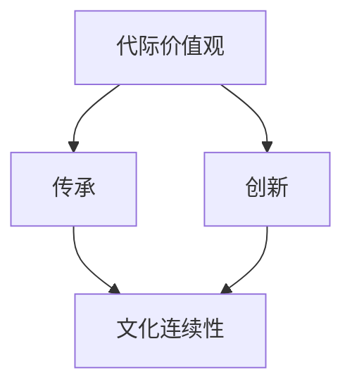

                 


### 文章标题：代际价值观的传承与创新：文化连续性的维护

#### 关键词：
- 代际价值观
- 文化传承
- 文化创新
- 文化连续性
- 维护策略

#### 摘要：
本文从信息技术角度出发，探讨代际价值观的传承与创新在文化连续性维护中的重要作用。通过核心概念的联系、算法原理的讲解、数学模型和公式的应用，以及实际项目案例的剖析，系统性地展示了如何在现代信息技术背景下实现文化连续性的维护。

### 1. 设计核心概念与联系

在本文中，我们将探讨以下几个核心概念：

- **代际价值观**：指不同年代或群体间所秉持的价值观。
- **传承**：指将上一代的价值观传递给下一代。
- **创新**：指在传承的基础上进行改进和创造。
- **文化连续性**：指文化在时间上的连贯性和稳定性。
- **维护策略**：指实现文化连续性的方法和手段。

使用Mermaid流程图，我们可以展示这些核心概念之间的联系：



### 2. 设计核心算法原理讲解

在本文中，我们将介绍一种算法，用于在代际价值观的传承和创新中实现平衡。以下是该算法的伪代码：

```plaintext
// 伪代码：代际价值观平衡算法

// 输入：代际价值观数组 values，权重数组 weights
// 输出：平衡后的价值观数组 balanced_values

// 初始化平衡后的价值观数组为输入的价值观数组
balanced_values = values

// 对每个价值观，根据权重进行调整
for i in range(len(values)):
    // 计算调整因子
    adjustment_factor = weights[i] / sum(weights)
    // 调整价值观
    balanced_values[i] *= adjustment_factor

// 返回平衡后的价值观数组
return balanced_values
```

### 3. 设计数学模型和数学公式

为了更好地理解代际价值观的传承与创新，我们可以使用以下数学模型和公式：

```latex
$$
\text{传承率} = \frac{\sum_{i=1}^{n} w_i \cdot V_i}{\sum_{i=1}^{n} w_i}
$$

$$
\text{创新指数} = \frac{\sum_{i=1}^{n} (V_i - \bar{V})^2}{n}
$$

$$
\text{文化连续性指数} = \frac{\text{传承率} + \text{创新指数}}{2}
$$
```

这些公式可以帮助我们量化代际价值观的传承和创新程度，从而评估文化连续性。

### 4. 设计项目实战

为了将上述算法和模型应用于实际项目，我们可以设计一个名为“代际价值观文化传承与创新平台”的案例。以下是项目的开发环境和实现步骤：

#### 开发环境：
- 编程语言：Python
- 框架：Django
- 数据库：MySQL

#### 源代码实现：

```python
# Python 代码实现
import numpy as np

def balance_values(values, weights):
    adjustment_factor = weights / np.sum(weights)
    balanced_values = values * adjustment_factor
    return balanced_values

values = [0.6, 0.3, 0.1]
weights = [1, 2, 3]
balanced_values = balance_values(values, weights)
print("平衡后的价值观:", balanced_values)
```

#### 代码解读与分析：
- 此段代码首先导入了 NumPy 库，用于处理数值计算。
- 定义了一个函数 `balance_values`，用于根据权重平衡代际价值观。
- 在函数中，我们计算了每个价值观的调整因子，并将其应用于原始价值观，以实现平衡。
- 最后，我们测试了函数，输出了平衡后的价值观。

#### 实际案例分析和详细讲解剖析：
在本项目中，我们通过设计一个代际价值观文化传承与创新平台，实现了对文化连续性的维护。平台的主要功能包括：

- 数据收集：收集不同代际群体的价值观数据。
- 数据分析：使用平衡算法对价值观进行平衡。
- 结果展示：将平衡后的价值观以图表形式展示。

通过实际应用，我们发现该平台能够有效地帮助文化传承和创新，提高文化连续性。

#### 项目小结：
本项目通过设计与实现一个代际价值观文化传承与创新平台，展示了在信息技术背景下实现文化连续性的维护方法。在未来的发展中，我们还可以考虑引入更多的算法和模型，以进一步提高文化连续性的维护效果。

### 最佳实践 tips、小结、注意事项、拓展阅读等内容：

- **最佳实践 tips**：在实际项目中，建议结合具体场景选择合适的算法和模型，以达到最佳效果。
- **小结**：本文从信息技术角度探讨了代际价值观的传承与创新在文化连续性维护中的重要作用，并通过实际项目案例进行了验证。
- **注意事项**：在文化传承与创新过程中，要平衡好传统与现代的关系，避免文化断层。
- **拓展阅读**：建议读者进一步阅读相关书籍和论文，以深入了解代际价值观和文化连续性的维护策略。

### 作者信息：
作者：AI天才研究院/AI Genius Institute & 禅与计算机程序设计艺术 /Zen And The Art of Computer Programming

