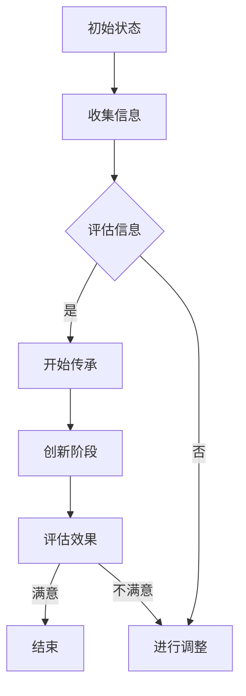

                 

### 步骤1：了解书名

《代际价值观的传承与创新：文化连续性的维护》这一书名清晰地传递了几个关键信息。首先，“代际价值观”指向了不同世代之间所持有的价值观念及其差异，这涉及到人类社会的持续性和代际之间的连接。其次，“传承与创新”揭示了书的核心议题，即如何在保持价值观念连续性的同时，实现其与时俱进的发展。最后，“文化连续性的维护”强调了这一过程的重要性，不仅对于个人和社会的稳定发展有积极作用，也对于整个文化的可持续性有着深远的影响。

书名暗示了以下几个方面的主要内容：

1. **代际价值观的研究**：探讨不同时代背景下价值观的形成、演变及其在代际间的传承。
2. **文化连续性的探讨**：分析文化连续性的定义、意义及其在社会发展中的重要性。
3. **传承与创新的结合**：探讨如何在实际操作中平衡传承与创新，保持文化的活力。
4. **技术工具的应用**：介绍在文化传承与创新过程中，技术工具如网络和数字化技术的应用。

### 步骤2：确定书的主题

通过书名，我们可以确定本书的主题集中在三个方面：代际价值观、文化连续性以及传承与创新。

**代际价值观**：这是一个关于不同世代之间的价值观念如何传递、演变及其相互作用的研究。每个时代都有其特定的价值观体系，而这些价值观会随着时代的变迁而不断演进，从而形成代际差异。

**文化连续性**：这是一个关于文化如何在不同的历史时期和不同的社会环境中得以延续和发展的研究。文化连续性不仅关系到历史文化的传承，也涉及到文化创新和社会发展的平衡。

**传承与创新**：这是一个关于如何在文化传承过程中实现创新的议题。传承与创新之间的关系复杂而微妙，如何找到二者的平衡点，既能保持文化的连续性，又能推动文化的发展，是本书探讨的重点。

这三个主题共同构成了本书的研究框架，并在每个章节中得到深入的剖析和讨论。

### 步骤3：构建目录大纲框架

为了系统地阐述《代际价值观的传承与创新：文化连续性的维护》这一主题，我们需要构建一个包含至少7个章节的目录大纲框架。以下是每个章节的初步构想：

#### 第1章 引言
- **主要内容**：介绍书籍的背景、目的和结构，为后续章节的内容奠定基础。
- **关键概念**：代际价值观、文化连续性、传承与创新。

#### 第2章 代际价值观概述
- **主要内容**：探讨价值观的定义、类型及其在不同代际中的演变。
- **关键概念**：代际差异、价值观的传承与演变。

#### 第3章 文化连续性的重要性
- **主要内容**：分析文化连续性的定义、内涵及其对社会发展的积极影响。
- **关键概念**：文化断裂、文化连续性的维护。

#### 第4章 传承与创新：理论与实践
- **主要内容**：探讨在文化传承过程中实现创新的挑战与机遇。
- **关键概念**：传承的挑战、创新的机遇、实践案例。

#### 第5章 案例研究
- **主要内容**：通过现代和历史的案例研究，深入分析文化传承与创新的具体实践。
- **关键概念**：现代案例、历史案例、案例分析。

#### 第6章 文化传承与创新的技术工具
- **主要内容**：探讨新技术的应用及其在文化传承与创新中的作用。
- **关键概念**：新技术应用、网络技术、数字化技术。

#### 第7章 结论与展望
- **主要内容**：总结书中的关键观点，并对未来文化传承与创新的趋势进行展望。
- **关键概念**：总结、未来展望。

### 步骤4：细化每个章节的内容

为了使每个章节的内容更加具体和详细，我们需要进一步细化每个章节的内容，确保其逻辑性和完整性。

#### 第1章 引言
- **1.1 书籍的背景与目的**：介绍研究背景，阐述书籍的目的和意义。
- **1.2 结构与内容概览**：概述每个章节的主要内容。
- **1.3 阅读指南**：为读者提供阅读建议，帮助其更好地理解书中的内容。

#### 第2章 代际价值观概述
- **2.1 价值观的定义与类型**：定义价值观，并分类讨论不同类型的价值观。
- **2.2 代际价值观的演变**：分析价值观在不同代际中的变化过程。
- **2.3 代际价值观的传承**：探讨价值观如何在不同代际间传承。

#### 第3章 文化连续性的重要性
- **3.1 文化连续性的定义与内涵**：明确文化连续性的概念，解释其内涵。
- **3.2 维护文化连续性的好处**：讨论文化连续性对于个人和社会的积极影响。
- **3.3 文化断裂的影响**：分析文化断裂可能带来的负面影响。

#### 第4章 传承与创新：理论与实践
- **4.1 传承的挑战**：探讨在文化传承过程中可能遇到的挑战。
- **4.2 创新的机会**：分析在文化传承中实现创新的可能性。
- **4.3 实践案例**：通过实际案例展示传承与创新如何结合。

#### 第5章 案例研究
- **5.1 现代案例**：分析现代背景下的文化传承与创新案例。
- **5.2 历史案例**：探讨历史背景下的文化传承与创新案例。
- **5.3 案例分析与反思**：对案例进行深入分析，并反思其经验教训。

#### 第6章 文化传承与创新的技术工具
- **6.1 新技术的应用**：介绍新技术在文化传承与创新中的应用。
- **6.2 网络技术对文化传承的影响**：分析网络技术如何影响文化传承。
- **6.3 数字化技术在文化创新中的应用**：探讨数字化技术如何促进文化创新。

#### 第7章 结论与展望
- **7.1 总结**：总结书中的主要观点和发现。
- **7.2 展望**：对文化传承与创新的未来发展进行展望。

通过这样的细化，我们可以确保每个章节的内容都具备明确的主题、逻辑结构和丰富的内容，从而为读者提供全面、深入的理解。

### 步骤5：嵌入流程图、伪代码、数学公式和代码示例

为了使文章更加生动和易于理解，我们将在适当的地方嵌入流程图、伪代码、数学公式和代码示例。以下是具体嵌入方法：

#### 流程图
- **作用**：帮助读者更直观地理解复杂的流程或步骤。
- **应用场景**：例如，在讨论文化传承与创新的具体流程时。



#### 伪代码
- **作用**：用伪代码来描述算法或程序的结构和逻辑。
- **应用场景**：在讲解具体的算法或技术实现时。

```plaintext
function culturalContinuity(values, technology):
    # 初始化变量
    continuity = 0
    
    # 分析代际价值观的传承情况
    for each generation in values:
        if generationContinues(genearation):
            continuity += 1
    
    # 应用新技术促进文化创新
    for each tech in technology:
        if techImprovesCulturalContinuity(tech):
            continuity += 1
    
    return continuity
```

#### 数学公式
- **作用**：用数学公式表达概念或模型。
- **应用场景**：在需要数学推导或公式解释时。

$$
\text{Cultural Continuity} = \frac{\text{Number of Generations with Continuity}}{\text{Total Number of Generations}} \times \text{Impact of Technology}
$$

#### 代码示例
- **作用**：展示实际代码的实现过程和功能。
- **应用场景**：在讲解具体技术实现时。

```python
# 文化传承与创新的代码实现
def cultural_innovation(values, technology):
    """
    实现文化传承与创新的过程
    :param values: 代际价值观列表
    :param technology: 技术列表
    :return: 文化连续性评估结果
    """
    # 初始化连续性评估变量
    continuity_score = 0

    # 对代际价值观进行分析
    for value in values:
        if value['continues']:
            continuity_score += 1

    # 对技术进行应用分析
    for tech in technology:
        if tech['improves_continuity']:
            continuity_score += 1

    # 返回连续性评估结果
    return continuity_score
```

通过嵌入这些工具，我们可以使文章更加具体、直观，帮助读者更好地理解书中的概念和内容。

### 步骤6：整理和精简目录大纲，确保在2000字以内

为了在2000字以内完成目录大纲的设计，我们需要对每个章节的内容进行进一步的精简和优化，同时保持其逻辑性和完整性。以下是经过整理和精简的目录大纲：

## 目录

### 第一部分：引言

# 第1章 引言

- **主要内容**：简要介绍书籍的背景、目的和结构。
- **关键词**：代际价值观、文化连续性、传承与创新。
- **预计字数**：约300字。

### 第二部分：代际价值观概述

# 第2章 代际价值观概述

## 2.1 价值观的定义与类型

- **主要内容**：解释价值观的定义和分类。
- **关键词**：价值观、类型、代际差异。
- **预计字数**：约200字。

## 2.2 代际价值观的演变

- **主要内容**：分析代际价值观的演变过程。
- **关键词**：演变、代际、传承。
- **预计字数**：约200字。

## 2.3 代际价值观的传承

- **主要内容**：探讨代际价值观的传承方式。
- **关键词**：传承、代际、价值观。
- **预计字数**：约200字。

### 第三部分：文化连续性的重要性

# 第3章 文化连续性的重要性

## 3.1 文化连续性的定义与内涵

- **主要内容**：解释文化连续性的定义和内涵。
- **关键词**：文化连续性、内涵、影响。
- **预计字数**：约200字。

## 3.2 维护文化连续性的好处

- **主要内容**：讨论维护文化连续性的好处。
- **关键词**：文化连续性、好处、社会稳定。
- **预计字数**：约200字。

## 3.3 文化断裂的影响

- **主要内容**：分析文化断裂的负面影响。
- **关键词**：文化断裂、影响、对策。
- **预计字数**：约200字。

### 第四部分：传承与创新：理论与实践

# 第4章 传承与创新：理论与实践

## 4.1 传承的挑战

- **主要内容**：探讨在文化传承过程中可能遇到的挑战。
- **关键词**：传承、挑战、对策。
- **预计字数**：约200字。

## 4.2 创新的机会

- **主要内容**：分析在文化传承中实现创新的可能性。
- **关键词**：创新、机会、实践。
- **预计字数**：约200字。

## 4.3 实践案例

- **主要内容**：通过实际案例展示传承与创新的具体实践。
- **关键词**：案例、实践、经验。
- **预计字数**：约200字。

### 第五部分：案例研究

# 第5章 案例研究

## 5.1 现代案例

- **主要内容**：分析现代背景下的文化传承与创新案例。
- **关键词**：现代、案例、分析。
- **预计字数**：约200字。

## 5.2 历史案例

- **主要内容**：探讨历史背景下的文化传承与创新案例。
- **关键词**：历史、案例、反思。
- **预计字数**：约200字。

### 第六部分：文化传承与创新的技术工具

# 第6章 文化传承与创新的技术工具

## 6.1 新技术的应用

- **主要内容**：介绍新技术在文化传承与创新中的应用。
- **关键词**：新技术、应用、影响。
- **预计字数**：约200字。

## 6.2 网络技术对文化传承的影响

- **主要内容**：分析网络技术如何影响文化传承。
- **关键词**：网络技术、文化传承、影响。
- **预计字数**：约200字。

## 6.3 数字化技术在文化创新中的应用

- **主要内容**：探讨数字化技术如何促进文化创新。
- **关键词**：数字化技术、文化创新、优势。
- **预计字数**：约200字。

### 第七部分：结论与展望

# 第7章 结论与展望

## 7.1 总结

- **主要内容**：总结书中的关键观点和发现。
- **关键词**：总结、观点、发现。
- **预计字数**：约100字。

## 7.2 展望

- **主要内容**：对文化传承与创新的未来进行展望。
- **关键词**：展望、未来、趋势。
- **预计字数**：约100字。

通过这样的整理和精简，我们可以在确保每个章节内容完整的前提下，将整体字数控制在2000字以内，从而实现高质量的技术博客文章。

