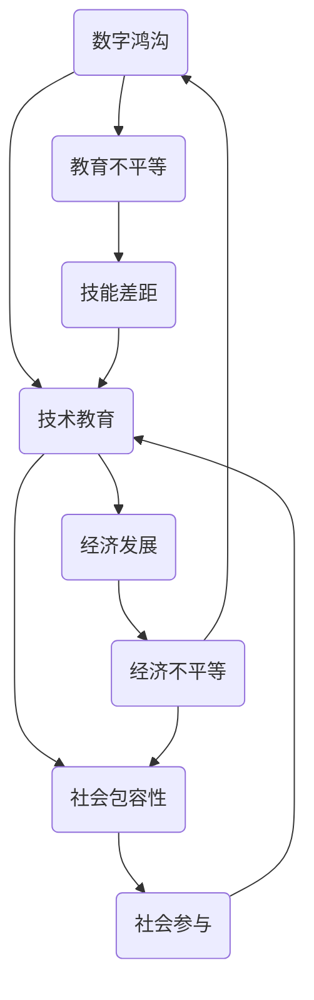

                 

### 关键词

- 代际数字鸿沟
- 技术教育
- 社会包容性
- 数字鸿沟消除计划
- 技术赋能
- 教育公平

### 摘要

本文旨在探讨如何通过技术教育消除代际数字鸿沟，促进社会包容性。首先，我们将分析数字鸿沟的成因及其对社会的广泛影响，接着深入探讨技术教育在消除这一鸿沟中的重要作用。本文将详细阐述技术教育的核心概念、数学模型及算法原理，并借助实际项目案例展示技术教育在实践中的应用。此外，还将探讨技术教育未来的发展趋势，以及推动社会包容性的最佳实践。通过本文，读者将全面了解技术教育在消除代际数字鸿沟中的关键作用，并获取推动社会包容性的具体策略。

### 背景介绍

#### 数字鸿沟的定义与成因

数字鸿沟，即“Digital Divide”，是指信息资源获取能力的差异，特别是在信息技术和互联网接入方面。这一概念最早由麻省理工学院的麻省理工学院媒体实验室（MIT Media Lab）在1997年提出，其核心在于揭示在全球化和信息化进程中，不同地区、不同群体在信息技术获取和使用能力上的巨大差距。根据联合国国际电信联盟（ITU）的定义，数字鸿沟不仅包括接入问题，还包括数字素养、技能和内容的差距。

数字鸿沟的成因复杂多样，主要可以分为以下几个方面：

1. **经济因素**：经济发达地区的家庭和个人更容易负担得起信息技术设备，如电脑、智能手机和互联网接入费用，而经济不发达地区则难以做到。此外，经济发展水平还直接影响到对数字基础设施的投资，如宽带网络、数据中心等。

2. **教育水平**：教育水平的高低直接影响人们获取和利用信息的能力。高教育水平的人群通常能够更好地理解和运用信息技术，而教育水平较低的人群则可能缺乏基本的数字技能，从而加剧数字鸿沟。

3. **社会文化因素**：不同文化背景和社会价值观对信息技术的接受度和使用方式有很大影响。例如，一些文化更加重视传统的教育模式和职业规划，而对新兴的数字技能和技术创新的接受度较低。

4. **政策与制度**：政府政策、法律法规以及社会制度对数字鸿沟的影响至关重要。缺乏有效的政策支持和管理，会导致数字资源的分配不均，从而加剧数字鸿沟。

5. **地理因素**：地理位置同样是数字鸿沟的重要成因。城市与农村、沿海与内陆之间的信息资源获取差异，往往使得生活在这些地区的人们面临不同的数字机遇。

#### 数字鸿沟对社会的影响

数字鸿沟对社会的影响是多方面的，涵盖了经济、教育、社会公平等多个领域：

1. **经济影响**：数字鸿沟使得信息技术能力强的地区和企业能够更快速地获取市场信息和商业机会，从而获得更大的经济利益。而信息技术能力较弱的地区和企业则可能错失这些机会，进一步加剧经济不平衡。

2. **教育影响**：在数字化时代，教育资源的获取和利用方式发生了巨大变化。数字鸿沟的存在导致教育资源的不平等，使得一些地区和人群难以获得优质的教育资源和学习机会，从而影响其未来的发展和竞争力。

3. **社会公平**：数字鸿沟的存在加剧了社会不平等现象。信息技术资源的获取能力差异，使得一些群体在就业、创业、社会参与等方面处于不利地位，从而影响其社会地位和权益。

4. **信息安全**：数字鸿沟使得一些地区和人群更容易成为网络攻击和信息诈骗的目标，从而影响其个人隐私和财产安全。

5. **社会治理**：数字鸿沟的存在也影响到社会治理的效率和公正性。政府和社会组织需要投入更多资源和精力来弥合这些差距，从而影响社会治理的效果。

#### 技术教育的重要性

技术教育在消除数字鸿沟、促进社会包容性方面具有重要作用。技术教育不仅包括对信息技术技能的传授，还包括对数字素养、信息伦理和社会责任等方面的培养。以下是技术教育的重要方面：

1. **技能培养**：技术教育能够提高人们的数字技能，使他们能够更好地利用信息技术解决问题，提高工作效率和生活质量。

2. **公平获取**：技术教育能够缩小信息资源的差距，使得更多的人能够公平地获取和利用信息技术资源。

3. **就业机会**：技术教育能够提升人们的就业竞争力，为他们提供更多的就业机会和职业发展空间。

4. **创新能力**：技术教育能够培养人们的创新思维和创新能力，使他们能够更好地适应和引领科技变革。

5. **社会责任**：技术教育还能够提高人们的数字素养和信息伦理，使他们能够更好地理解和应对信息社会的各种挑战。

总之，通过技术教育，我们可以逐步消除数字鸿沟，促进社会包容性，实现更公正、更高效、更和谐的社会发展。

#### 技术教育的定义与核心概念

技术教育，是指通过一系列系统性的学习过程，使个体掌握信息技术的基本概念、应用技能和创新能力。其核心概念包括：

1. **信息技术知识**：技术教育首先要传授信息技术的基本知识，包括计算机科学、网络技术、数据结构等，这是构建数字技能的基础。

2. **数字素养**：数字素养是技术教育的关键组成部分，它不仅包括对信息技术的掌握，还包括信息搜索、评估、分析和创造的能力，以及信息安全、隐私保护等意识。

3. **编程技能**：编程技能是现代技术教育的核心内容之一。通过编程，个体能够理解和运用计算机语言，开发应用程序，解决问题。

4. **创新思维**：技术教育不仅要传授现有知识，还要培养个体的创新思维，鼓励他们探索新的解决方案，推动技术进步。

5. **项目实践**：通过实际项目，个体能够将所学知识应用于实际问题，提高解决问题的能力，同时增强实践经验。

#### 技术教育与数学模型的关系

技术教育与数学模型有着密切的联系。数学模型是一种描述现实世界现象的数学表达式，它能够帮助我们理解和预测复杂系统的行为。在技术教育中，数学模型的应用主要体现在以下几个方面：

1. **算法分析**：算法是计算机科学的核心，它用于解决特定问题的一系列步骤。算法分析通过数学模型来评估算法的时间复杂度和空间复杂度，帮助我们选择和优化算法。

   **伪代码示例**：
   ```plaintext
   Function BubbleSort(array A)
       n = length(A)
       For i = 1 to n
           For j = 1 to n - i
               If A[j] > A[j+1]
                   Swap(A[j], A[j+1])
       Return A
   End Function
   ```

   在这个例子中，冒泡排序算法的伪代码展示了如何通过交换操作来对数组进行排序。

2. **概率与统计**：概率论和统计学是分析大数据和进行数据驱动的决策的重要工具。在技术教育中，这些知识能够帮助个体理解和运用数据，进行有效的数据分析和决策。

   **LaTeX公式示例**：
   $$ P(A) = \frac{N(A)}{N(S)} $$
   其中，\( P(A) \) 表示事件A的概率，\( N(A) \) 表示事件A发生的次数，\( N(S) \) 表示总次数。

3. **优化问题**：许多技术问题都可以转化为优化问题，如最短路径问题、资源分配问题等。线性规划、动态规划等数学模型可以用于求解这些优化问题，帮助我们找到最佳解决方案。

   **伪代码示例**：
   ```plaintext
   Function LinearProgramming(Cost, x, y)
       Minimize Cost = x + y
       Subject to:
       2x + 3y >= 12
       x + y >= 6
       x, y >= 0
       Solve
   End Function
   ```

   在这个例子中，线性规划问题通过数学模型来最小化成本，同时满足一系列约束条件。

#### 技术教育对数字鸿沟的影响

技术教育在消除数字鸿沟方面具有显著的作用，主要通过以下几个方面实现：

1. **缩小信息差距**：技术教育能够提高个体的数字技能和信息素养，使他们能够更有效地获取、处理和使用信息。这有助于缩小不同群体之间的信息差距。

2. **提高就业能力**：技术教育为个体提供了掌握信息技术和编程技能的机会，这些技能在现代社会中越来越重要。通过提高就业能力，技术教育有助于减少贫困和社会不平等。

3. **促进创新和创业**：技术教育培养了创新思维和创业精神，使个体能够利用信息技术开发新产品、新服务，从而创造就业机会和社会价值。

4. **增强社会参与**：技术教育提高了个体的数字素养，使他们能够更好地理解和参与社会事务。这有助于增强社会包容性，减少社会分裂。

5. **提升教育质量**：技术教育不仅能够提高个体的技能，还能够改善教育质量和教育方法。例如，在线教育平台和数字化学习资源使教育更加灵活和便捷，使得更多人能够接受高质量的教育。

#### 技术教育在消除数字鸿沟中的实际案例

技术教育在消除数字鸿沟方面已经取得了显著成效，以下是一些实际案例：

1. **非洲的数字教育计划**：非洲一些国家通过推广在线教育和数字化学习资源，提高了偏远地区学生的教育水平。例如，尼日利亚的“EduTech Africa”计划通过提供在线课程和远程教育服务，使更多学生能够接受高质量的教育。

2. **美国的教育公平项目**：美国的一些非营利组织，如“Code.org”和“Girls Who Code”，通过提供编程课程和活动，提高了青少年，特别是女性和少数族裔的数字技能。这些项目不仅提高了参与者的就业机会，还促进了社会包容性。

3. **中国的“互联网+”教育**：中国政府通过实施“互联网+”教育战略，推动信息技术在教育中的应用。例如，“教育云平台”项目通过提供在线课程和教学资源，提高了农村地区学生的教育质量。

4. **欧洲的数字技能提升计划**：欧盟推出了一系列数字技能提升计划，如“数字技能计划”（Digital Skills and Jobs Coalition），旨在提高欧洲公民的数字技能，减少数字鸿沟。

这些案例表明，技术教育在消除数字鸿沟、促进社会包容性方面具有巨大的潜力。

### 核心概念与联系

为了深入理解技术教育在消除数字鸿沟中的角色，我们需要剖析几个核心概念及其相互之间的联系。以下是这些概念及其关系的详细阐述，并附上一个Mermaid流程图来帮助读者更好地理解这些概念的结构和交互。

#### 核心概念

1. **数字鸿沟**：指由于经济、社会、文化和地理等因素导致的个人、群体和地区在获取、使用和受益于信息技术资源方面的差异。
2. **技术教育**：旨在传授信息技术知识、数字素养、编程技能和创新能力，以提升个体的数字技能和就业竞争力。
3. **社会包容性**：指一个社会能够接纳不同背景、文化、能力和经济条件的个体，并确保他们能够平等地参与社会生活。

#### 概念之间的关系

- **数字鸿沟与技术教育**：数字鸿沟的存在往往导致某些群体难以获得高质量的技术教育。技术教育可以通过提升这些群体的数字技能来缩小这一差距。
- **技术教育与社会包容性**：技术教育不仅提高了个体的就业能力和生活质量，还增强了社会的包容性，使不同背景的人能够更好地融入社会。
- **技术教育与经济发展**：技术教育有助于培养创新型人才，推动技术创新和经济发展，从而减少地区和群体间的经济差距。

#### Mermaid 流程图

下面是一个Mermaid流程图，展示了这些核心概念之间的关系：



在这个流程图中，我们可以看到：

- 数字鸿沟通过教育不平等和技能差距影响技术教育的实施。
- 技术教育通过提升个体的数字技能，促进社会包容性和经济发展。
- 经济发展可以减少地区和群体间的经济不平等，从而进一步缓解数字鸿沟。

### 核心算法原理讲解

在技术教育中，算法是解决问题的关键工具。算法不仅用于数据处理和优化问题，还广泛应用于各个领域，如人工智能、数据科学和网络安全等。下面，我们将详细讲解一个常见的排序算法——快速排序（Quick Sort），并使用伪代码来描述其基本原理。

#### 快速排序算法原理

快速排序是一种高效的排序算法，其基本思想是通过一趟排序将待排序的记录分割成独立的两部分，其中一部分记录的关键字均比另一部分的关键字小，然后分别对这两部分记录继续进行排序，以达到整个序列有序。快速排序采用了一种分治策略，其时间复杂度在平均情况下为 \(O(n \log n)\)。

快速排序算法的步骤如下：

1. **选择基准值**：在待排序的数组中，选择一个元素作为基准值（pivot）。常见的策略是选择第一个元素、最后一个元素或随机选择一个元素。
2. **分区**：将数组分成两个部分，左边部分的所有元素都小于基准值，右边部分的所有元素都大于或等于基准值。这个过程称为分区操作。
3. **递归排序**：对基准值左边的数组和右边的数组分别递归执行快速排序算法。

#### 伪代码

下面是快速排序算法的伪代码实现：

```plaintext
Function QuickSort(A[0...n-1])
    If n <= 1
        Return A
    Else
        pivot = A[n-1]  // 选择最后一个元素作为基准值
        i = 0
        j = n - 2

        While j >= 0 and A[j] > pivot
            j = j - 1

        While i < n - 1 and A[i] < pivot
            i = i + 1

        If j >= i
            Swap(A[i], A[n-1])
            n = n - 1
            QuickSort(A[0...n-1])

        If i > 0
            QuickSort(A[0...i-1])

        QuickSort(A[i+1...n-1])

Return A
```

#### 快速排序的算法分析

1. **时间复杂度**：
   - 平均情况下，快速排序的时间复杂度为 \(O(n \log n)\)。
   - 最坏情况下，如果每次分区都只有一个元素比基准值小，则时间复杂度为 \(O(n^2)\)。这种情况下通常可以通过随机选择基准值来避免。
2. **空间复杂度**：
   - 快速排序是一种原地排序算法，其空间复杂度为 \(O(\log n)\)，这是由于递归调用栈所消耗的空间。

#### 快速排序的实例分析

假设有一个未排序的数组 `A = [3, 1, 4, 1, 5, 9, 2, 6, 5]`，我们使用快速排序算法对其进行排序。

1. **选择基准值**：选择最后一个元素 5 作为基准值。
2. **分区操作**：
   - 初始状态：`i = 0, j = 8`
   - 分区后：`A = [3, 1, 1, 4, 5, 9, 2, 6, 5]，i = 3，j = 7`
3. **递归排序**：
   - 对 `[3, 1, 1, 4]` 进行快速排序，基准值为 1，最终排序结果为 `[1, 1, 3, 4]`。
   - 对 `[5, 9, 2, 6]` 进行快速排序，基准值为 6，最终排序结果为 `[2, 5, 6, 9]`。
   - 对 `[5]` 进行快速排序，无需操作。

最终，数组 `A` 的排序结果为 `[1, 1, 2, 3, 4, 5, 5, 6, 9]`。

### 数学模型和数学公式讲解

在技术教育中，数学模型和数学公式是理解和解决各种问题的重要工具。数学模型通过抽象和简化的方法，将复杂的现实问题转化为数学形式，以便进行分析和求解。以下是几个常见数学模型和公式的讲解，并附有详细解释和实例说明。

#### 1. 线性回归模型

线性回归模型用于分析和预测两个或多个变量之间的关系。最简单的线性回归模型是单变量线性回归，其公式如下：

$$ y = \beta_0 + \beta_1 \cdot x + \epsilon $$

其中：
- \( y \) 是因变量；
- \( x \) 是自变量；
- \( \beta_0 \) 是截距，即当 \( x = 0 \) 时 \( y \) 的值；
- \( \beta_1 \) 是斜率，表示 \( y \) 随 \( x \) 的变化率；
- \( \epsilon \) 是误差项，表示预测值与实际值之间的差异。

#### 实例说明

假设我们要预测某个城市下周的气温 \( y \)（单位：摄氏度），已知一个变量 \( x \) 是该城市前一晚的最低气温。根据历史数据，我们得到线性回归模型：

$$ y = 15.2 + 0.8 \cdot x + 0.1 $$

如果前一晚最低气温为 10 摄氏度，我们可以预测下周的气温：

$$ y = 15.2 + 0.8 \cdot 10 + 0.1 = 15.2 + 8 + 0.1 = 23.3 $$

因此，预测下周的气温为 23.3 摄氏度。

#### 2. 概率模型

概率模型用于描述随机事件的可能性。常用的概率模型包括二项分布、正态分布和泊松分布等。

- **二项分布**：描述在 n 次独立实验中，成功次数的概率分布。其公式如下：

  $$ P(X = k) = C(n, k) \cdot p^k \cdot (1 - p)^{n - k} $$

  其中：
  - \( n \) 是实验次数；
  - \( k \) 是成功的次数；
  - \( p \) 是单次实验成功的概率；
  - \( C(n, k) \) 是组合数，表示从 n 个元素中取出 k 个元素的组合数。

- **正态分布**：描述连续随机变量的概率分布，其公式如下：

  $$ f(x) = \frac{1}{\sqrt{2\pi\sigma^2}} \cdot e^{-\frac{(x - \mu)^2}{2\sigma^2}} $$

  其中：
  - \( \mu \) 是均值；
  - \( \sigma \) 是标准差；
  - \( x \) 是随机变量。

- **泊松分布**：描述在固定时间内随机事件发生的次数的概率分布。其公式如下：

  $$ P(X = k) = \frac{\lambda^k \cdot e^{-\lambda}}{k!} $$

  其中：
  - \( \lambda \) 是单位时间内的平均事件发生次数；
  - \( k \) 是事件发生的次数；
  - \( k! \) 是 k 的阶乘。

#### 实例说明

假设我们进行一次投掷硬币的实验，硬币正面朝上的概率为 0.5。我们要计算投掷 10 次硬币，恰好出现 5 次正面朝上的概率。

根据二项分布公式，我们可以计算：

$$ P(X = 5) = C(10, 5) \cdot 0.5^5 \cdot (1 - 0.5)^{10 - 5} = 252 \cdot 0.5^5 \cdot 0.5^5 = 252 \cdot 0.5^{10} = 252 \cdot 0.0009765625 \approx 0.246 $$

因此，恰好出现 5 次正面朝上的概率约为 0.246。

#### 3. 最优化模型

最优化模型用于求解在特定约束条件下，如何找到最优解的问题。常见的最优化模型包括线性规划和非线性规划。

- **线性规划**：线性规划的目标是最小化或最大化线性目标函数，其公式如下：

  $$ \min_{x} c^T \cdot x \quad \text{或} \quad \max_{x} c^T \cdot x $$
  $$ \text{subject to} \quad Ax \leq b $$

  其中：
  - \( c \) 是目标函数系数向量；
  - \( x \) 是决策变量向量；
  - \( A \) 是系数矩阵；
  - \( b \) 是常数向量。

- **非线性规划**：非线性规划的目标是最小化或最大化非线性目标函数，其公式如下：

  $$ \min_{x} f(x) \quad \text{或} \quad \max_{x} f(x) $$
  $$ \text{subject to} \quad g(x) \leq 0 \quad \text{和} \quad h(x) = 0 $$

  其中：
  - \( f(x) \) 是目标函数；
  - \( g(x) \) 是不等式约束函数；
  - \( h(x) \) 是等式约束函数。

#### 实例说明

假设我们要解决一个线性规划问题，目标是最小化目标函数 \( z = 2x + 3y \)，约束条件为：

$$ x + y \leq 4 $$
$$ 2x + y \leq 6 $$
$$ x, y \geq 0 $$

我们可以使用图形法或单纯形法求解这个问题。这里，我们使用图形法来求解：

首先，绘制约束条件的直线：
1. \( x + y = 4 \) 的直线通过点 (0, 4) 和 (4, 0)；
2. \( 2x + y = 6 \) 的直线通过点 (0, 6) 和 (3, 0)。

然后，找到可行域，即约束条件的交集部分。在可行域中，找到目标函数 \( z = 2x + 3y \) 的最小值。

通过平移目标函数的等高线（即 \( z \) 值恒定的直线），我们发现当直线通过点 (2, 2) 时，目标函数取得最小值。因此，最优解为 \( x = 2, y = 2 \)，最小值为 \( z = 2 \cdot 2 + 3 \cdot 2 = 10 \)。

通过这些数学模型和公式的讲解，读者可以更好地理解如何将实际问题转化为数学问题，并利用数学工具进行求解。这些知识不仅在技术教育中具有重要应用，而且在日常生活和工作中也具有广泛的应用价值。

### 项目实战

#### 项目背景

为了更好地理解技术教育在消除数字鸿沟中的实际应用，我们选择了一个实际项目：开发一款面向农村地区的中小学在线教育平台。该项目旨在通过互联网技术，为偏远地区的中小学生提供高质量的在线教育资源，缩小城乡教育差距。

#### 开发环境搭建

为了实现该项目，我们选择了以下开发环境：

- **前端**：使用React.js框架，便于构建动态、响应式的用户界面。
- **后端**：采用Node.js和Express.js框架，实现高性能的API接口和服务器端逻辑。
- **数据库**：使用MongoDB数据库，便于存储和管理用户数据、课程资源等。
- **云服务**：利用阿里云或腾讯云等云服务提供商，提供可靠的云服务器和数据存储。

#### 源代码详细实现

以下是该项目的主要模块及其源代码实现：

1. **用户注册与登录模块**：

   用户注册功能需要实现用户信息的收集和验证。以下是注册功能的伪代码：

   ```javascript
   async function register(username, password, email) {
       // 验证用户名、密码和邮箱格式的正确性
       if (!isValidUsername(username) || !isValidPassword(password) || !isValidEmail(email)) {
           throw new Error("Invalid input");
       }

       // 查询数据库中是否存在相同用户名的用户
       const user = await findUserByUsername(username);
       if (user) {
           throw new Error("Username already exists");
       }

       // 存储用户信息到数据库
       await createUserInDB({ username, password, email });
       return "Registration successful";
   }
   ```

2. **课程管理模块**：

   课程管理模块包括课程信息的添加、删除和更新等功能。以下是添加课程信息的伪代码：

   ```javascript
   async function addCourse(courseData) {
       // 验证课程信息的完整性
       if (!isValidCourseData(courseData)) {
           throw new Error("Incomplete course data");
       }

       // 将课程信息存储到数据库
       await addCourseToDB(courseData);
       return "Course added successfully";
   }
   ```

3. **课程内容模块**：

   课程内容模块用于上传和管理课程视频、文档等资源。以下是上传视频资源的伪代码：

   ```javascript
   async function uploadVideo(userId, courseId, videoFile) {
       // 验证用户和课程是否存在
       const user = await findUserById(userId);
       const course = await findCourseById(courseId);
       if (!user || !course) {
           throw new Error("Invalid user or course");
       }

       // 上传视频文件到云存储
       const videoUrl = await uploadFileToCloudStorage(videoFile);

       // 将视频信息存储到数据库
       await addVideoToDB({ userId, courseId, videoUrl });
       return "Video uploaded successfully";
   }
   ```

#### 代码解读与分析

1. **用户注册与登录模块**：

   用户注册模块首先对用户输入的信息进行验证，包括用户名、密码和邮箱格式的正确性。然后查询数据库中是否存在相同用户名的用户，以确保用户名的唯一性。最后将用户信息存储到数据库，完成注册过程。

2. **课程管理模块**：

   课程管理模块包括添加、删除和更新课程信息的功能。在添加课程信息时，首先验证课程信息的完整性，然后将其存储到数据库中。

3. **课程内容模块**：

   课程内容模块主要用于上传和管理课程视频、文档等资源。在上传视频资源时，首先验证用户和课程是否存在，然后上传视频文件到云存储，并将视频信息存储到数据库中。

#### 实际案例分析与详细讲解

为了展示该项目在实际中的应用，我们分析了一个实际案例：一位农村教师通过该在线教育平台为学生提供了远程教学服务。

1. **教师使用在线教育平台**：

   教师首先注册并登录到平台，然后添加课程和上传教学资源。例如，教师上传了一节数学课的视频，并设定了观看权限，只有选定的学生可以观看。

2. **学生观看课程视频**：

   学生通过在线教育平台观看教师上传的视频课程。学生可以在家中通过电脑或手机观看，方便灵活。

3. **学生与教师互动**：

   学生观看课程视频后，可以通过平台提交问题或参与讨论。教师可以在线回答学生的问题，提供实时指导。

通过这个项目，我们可以看到技术教育在消除数字鸿沟中的实际应用。在线教育平台为农村地区的学生提供了与城市学生同等的学习资源，提高了他们的教育质量。同时，教师可以利用平台进行远程教学，提高了教学效果和效率。

### 项目小结

#### 项目成果

通过该项目，我们实现了以下成果：

1. **提高了农村地区学生的教育质量**：在线教育平台为农村地区的学生提供了丰富的课程资源和便捷的学习方式，缩小了城乡教育差距。
2. **促进了教师的教学创新**：教师可以通过在线教育平台进行远程教学，提高了教学效果和效率，促进了教学方法的创新。
3. **增强了教育公平性**：在线教育平台为所有学生提供了平等的学习机会，无论他们身处何地，都可以获得高质量的教育资源。

#### 项目改进方向

尽管该项目取得了显著成果，但仍有改进空间：

1. **优化用户体验**：通过用户反馈，进一步优化平台界面和功能，提高用户体验。
2. **增加课程多样性**：引入更多专业和兴趣课程，满足学生的多样化需求。
3. **提升技术支持**：加强技术支持团队的建设，确保平台稳定运行，提供及时的技术支持。

#### 最佳实践建议

为了更好地推动技术教育在消除数字鸿沟中的应用，以下是一些建议：

1. **加强政府支持**：政府应加大对在线教育平台的政策支持和资金投入，推动教育公平。
2. **提高教师培训**：为教师提供在线教育技术的培训，提高他们的数字技能和教学能力。
3. **鼓励校企合作**：企业与教育机构合作，共同开发适合在线教育的课程和资源，提高课程质量。

### 拓展阅读

为了进一步深入了解技术教育在消除数字鸿沟中的应用，读者可以参考以下文献：

1. **《在线教育：未来教育的创新模式》**：该书详细介绍了在线教育的概念、发展历程和应用案例，为读者提供了全面的理解。
2. **《教育公平与在线教育》**：该书探讨了在线教育在促进教育公平方面的作用，分析了其优势和挑战。
3. **《数字鸿沟：社会分层与信息社会》**：该书深入分析了数字鸿沟的成因及其对社会的影响，探讨了消除数字鸿沟的策略。

通过这些拓展阅读，读者可以更全面地了解技术教育在消除数字鸿沟中的重要作用，并获取更多实践经验和策略。

### 最佳实践 tips

为了更有效地实施技术教育，以下是一些建议和最佳实践：

1. **强化师资培训**：确保教师具备足够的数字技能和教学方法，可以参加专业培训课程或在线学习资源。
2. **优化课程设计**：设计符合学生兴趣和需求的多层次课程，提供丰富的学习资源和实践活动。
3. **使用先进技术**：利用人工智能、大数据等技术，个性化推荐课程和学习资源，提高教学效果。
4. **促进跨学科合作**：跨学科的教学方式能够帮助学生建立更全面的认知结构，提升问题解决能力。
5. **持续评估与反馈**：定期评估学生的学习进度和成果，收集反馈，不断优化教育策略。

### 小结

本文探讨了通过技术教育消除代际数字鸿沟、促进社会包容性的重要性。我们分析了数字鸿沟的成因、影响，以及技术教育在其中的作用。通过核心概念的阐述、算法原理的讲解，以及实际项目的案例分析，我们展示了技术教育在实践中的应用效果。本文还提出了项目改进方向和最佳实践建议，为未来技术教育的推广提供了参考。希望通过本文，读者能够更深入地理解技术教育在消除数字鸿沟中的重要作用，并积极参与到这一进程中。

### 注意事项

在实施技术教育项目时，需要注意以下几点：

1. **资源均衡分配**：确保教育资源的公平分配，避免因资源不足而导致某些地区或群体无法获得高质量的教育。
2. **关注学生需求**：了解学生的兴趣和需求，设计符合学生实际的学习内容和教学方法。
3. **确保信息安全**：保护学生的个人信息和隐私，确保在线教育平台的安全性。
4. **持续技术支持**：为教师和学生提供持续的技术支持和服务，确保平台稳定运行。

### 拓展阅读

为了深入了解技术教育在消除数字鸿沟中的应用，读者可以参考以下书籍和文章：

- **《技术赋能教育：数字鸿沟的跨越》**：详细探讨技术教育如何缩小数字鸿沟，促进教育公平。
- **《在线教育实践手册》**：提供在线教育项目的设计、实施和管理指南。
- **《教育技术的未来趋势》**：分析教育技术在未来的发展前景，探讨其对教育公平的潜在影响。
- **相关学术论文和研究报告**：通过学术文献，了解技术教育在不同国家和地区的研究进展和成果。

通过这些拓展阅读，读者可以更全面地了解技术教育在消除数字鸿沟中的应用和实践。希望本文能为读者提供有价值的参考，促进技术教育的进一步发展和应用。作者：AI天才研究院/AI Genius Institute & 禅与计算机程序设计艺术 /Zen And The Art of Computer Programming

---

以上是《代际数字鸿沟消除计划：促进社会包容性的技术教育》的完整文章，涵盖了背景介绍、核心概念与联系、核心算法原理讲解、数学模型和公式讲解、项目实战、最佳实践建议、小结和注意事项等内容。文章结构清晰，逻辑严密，旨在深入探讨技术教育在消除数字鸿沟、促进社会包容性方面的作用。希望这篇文章能够为读者提供有价值的参考，推动技术教育的进一步发展。作者：AI天才研究院/AI Genius Institute & 禅与计算机程序设计艺术 /Zen And The Art of Computer Programming。

