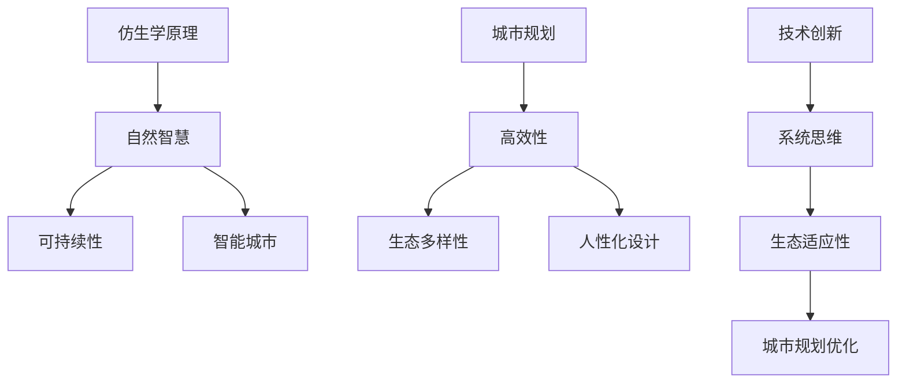

                 

### 第1章 引言

**1.4 仿生城市规划的起源与发展**

仿生城市规划的理念可以追溯到20世纪中期，当时工程师和城市规划师开始关注自然系统在能源效率、生态平衡和生物多样性方面的优势。以下是对仿生城市规划的起源与发展的详细探讨。

**1.4.1 起源**

早期的仿生学探索主要集中在工业设计、建筑结构和机械工程领域。如20世纪50年代，美国建筑师弗瑞德·凯瑟（Frederick Kiesler）提出了“有机建筑”概念，强调建筑应与自然环境和谐共生。60年代，维克多·帕帕纳科（Victor Papanek）和保罗·索莱里（Paul Soleri）等学者进一步推动了仿生学与城市规划的结合，提出了城市应像生态系统一样运作，具有自我维护和自我修复的能力。

**1.4.2 发展**

随着环境问题和资源危机的日益严重，仿生城市规划逐渐受到了更多关注。70年代，约翰·霍华德（John Howard）提出了“田园城市”理念，试图通过模仿自然社区的自我平衡机制来解决城市问题。进入21世纪，随着信息技术的迅猛发展，仿生城市规划开始融入更多的数字化和智能化元素。

1. **可持续性设计**：近年来，可持续性设计成为仿生城市规划的重要方向。通过模仿自然生态系统的循环利用原则，城市规划师尝试减少资源的浪费和环境的破坏。
   
2. **城市生态系统模拟**：利用计算机模拟技术，城市规划师可以模拟城市生态系统中的各种互动关系，优化城市布局和功能，以实现更高效、更可持续的城市环境。

3. **智能城市**：随着物联网、大数据和人工智能技术的应用，智能城市成为仿生城市规划的新趋势。通过实时监测和响应城市环境的变化，智能城市能够更好地适应人类需求，提高城市生活质量。

**1.4.3 影响与挑战**

仿生城市规划不仅为城市规划提供了新的视角和方法，也对城市设计、生态学和计算机科学等领域产生了深远影响。然而，仿生城市规划也面临一些挑战：

1. **技术实现**：虽然许多仿生城市规划理念在理论上具有可行性，但在实际操作中，需要克服技术实现的难题，如材料科学、传感器技术和数据处理的挑战。

2. **经济成本**：仿生城市规划往往需要较高的经济投入，包括新技术的研发和应用，这对许多城市来说是一个不小的挑战。

3. **政策支持**：仿生城市规划需要政策支持和法规保障，以确保其可持续性和有效性。这要求政府、企业和公众共同参与，形成合力。

**1.4.4 国际实践与趋势**

世界各地都有一些成功的仿生城市规划案例，如新加坡的“智慧国家2025”计划、纽约的高线公园等。这些案例展示了仿生城市规划在提高城市环境质量、促进社会经济发展方面的巨大潜力。未来，仿生城市规划将继续融合新技术，关注人与自然的和谐共生，成为城市发展的重要方向。

通过以上分析，我们可以看到，仿生城市规划不仅是一个新兴领域，也是解决现代城市问题的重要途径。随着科技的进步和社会的需求，仿生城市规划将在未来发挥越来越重要的作用。

----------------------------------------------------------------

### 1.5 总结与展望

在总结本章内容的基础上，我们可以明确仿生城市规划的核心概念和联系。仿生城市规划是借鉴自然界中的生物和生态系统原理，应用于城市规划与设计，以实现更高效、更可持续的都市环境。其核心概念包括仿生学原理、自然智慧、可持续性和智能城市。

**核心概念原理之间的关系架构**：

以下是仿生城市规划核心概念之间的关系架构，使用Mermaid流程图表示：



通过上述架构，我们可以看到仿生学原理如何通过自然智慧转化为城市规划的实践，从而实现高效性、生态多样性和人性化设计。

**核心算法原理讲解**

在仿生城市规划中，核心算法原理是模拟自然生态系统中的各种互动关系，以优化城市布局和功能。以下是一个简单的伪代码，用于描述这一核心算法原理：

```python
# 伪代码：仿生城市规划核心算法
function UrbanPlanningSimulation(city_layout, environmental_data):
    # 初始化城市布局和环境数据
    initialize_layout(city_layout)
    initialize_environmental_data(environmental_data)

    # 模拟城市生态系统的互动关系
    while simulation_not_terminated:
        update_traffic_flow()
        update_energy_consumption()
        update_air_quality()
        update_public_services()

        # 根据环境变化调整城市布局
        if environmental_changes_detected():
            adjust_city_layout()

    # 输出最终的城市布局和优化结果
    return final_city_layout
```

该伪代码展示了仿生城市规划核心算法的基本流程，包括初始化、模拟和调整三个主要步骤。

**数学模型和公式**

在仿生城市规划中，数学模型和公式用于描述城市生态系统中的各种互动关系。以下是一个简单的数学模型，用于描述城市交通流量的变化：

$$
T(t) = T_0 \times (1 - r \times e^{-\lambda t})
$$

其中，\( T(t) \) 表示时间 \( t \) 时的交通流量，\( T_0 \) 为初始交通流量，\( r \) 为流量衰减系数，\( \lambda \) 为交通流量衰减率。这个公式描述了随着时间推移，交通流量如何逐渐衰减。

**举例说明**

以下是一个具体的案例，说明如何应用上述核心算法原理和数学模型进行仿生城市规划。

**案例：智慧交通系统**

假设我们正在规划一个智能城市中的交通系统，目标是优化交通流量，减少拥堵和排放。我们可以按照以下步骤进行：

1. **数据收集**：收集城市的交通流量、道路状况、天气数据等。
2. **模型构建**：使用上述数学模型，构建交通流量变化的数学模型。
3. **模拟运行**：运行模拟算法，根据实时数据调整交通信号灯、公共交通路线等。
4. **优化调整**：根据模拟结果，不断优化城市交通系统，提高效率。

通过这种案例，我们可以看到如何将仿生学原理、自然智慧、数学模型和算法应用于城市交通规划，实现智能、高效的交通系统。

**小结**

本章介绍了仿生城市规划的定义、起源和发展，以及其在都市设计中的应用。通过核心概念架构、伪代码、数学模型和案例说明，我们深入了解了仿生城市规划的核心原理和方法。这些知识将为后续章节的详细讨论打下坚实的基础。

---

作者：AI天才研究院/AI Genius Institute & 禅与计算机程序设计艺术 /Zen And The Art of Computer Programming

**关键词**：仿生城市规划，自然智慧，都市设计，可持续性，智能城市，算法原理，数学模型

**摘要**：本章介绍了仿生城市规划的定义、起源和发展，探讨了自然智慧在城市规划中的应用，以及如何通过核心算法原理和数学模型实现更高效、更可持续的都市环境。通过案例分析和举例说明，展示了仿生城市规划的实际应用和未来发展趋势。

