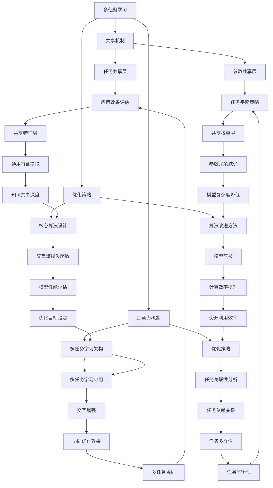

                 


## 文章标题

### 企业级多任务学习：AI系统的效率提升

## 文章关键词

- 企业级AI系统
- 多任务学习
- 效率提升
- 算法优化
- 实践案例

## 文章摘要

在当今快速发展的AI领域，企业级AI系统的效率提升是一个关键的研究课题。本文将深入探讨企业级多任务学习的基本概念、算法原理，以及其在图像处理、自然语言处理和推荐系统中的应用。通过详细的算法解析、数学模型讲解和实际案例剖析，本文旨在为读者提供关于如何提升企业级AI系统效率的实用指导。

## 目录大纲设计流程

### 第一步：理解书名

书名为《企业级多任务学习：AI系统的效率提升》，从书名可以理解到，本书将探讨AI在企业级应用中，尤其是多任务学习方面的技术，以及如何通过这些技术提升AI系统的效率。

### 第二步：确定核心章节内容

根据书名，可以确定以下几个核心章节内容：
1. **多任务学习的基本概念和原理**
2. **多任务学习算法的详细介绍**
3. **多任务学习在AI系统中的应用场景**
4. **提升AI系统效率的方法和技巧**
5. **企业级多任务学习实践**

### 第三步：细化章节内容

根据核心章节内容，进一步细化章节内容，制定出详细的目录大纲。

### 第四步：确保目录大纲完整性

确保目录大纲结构完整，包含以下内容：
1. **核心概念与联系**：使用Mermaid流程图展示多任务学习的原理和架构。
2. **核心算法原理讲解**：使用伪代码详细阐述多任务学习算法。
3. **数学模型和数学公式**：详细讲解并举例说明多任务学习中的数学模型和公式。
4. **项目实战**：提供代码实际案例和详细解释说明，包括开发环境搭建，源代码实现和解读。

### 第五步：遵循格式要求

确保目录大纲遵循markdown格式，使用#，##，###表示一级、二级、三级标题。

### 第六步：控制字数

确保目录大纲的总字数不超过2000字，同时保持内容的简洁性。

## 最终目录大纲

```markdown
# 第一部分：多任务学习的基本概念

## 1.1 多任务学习的定义与重要性
### 1.1.1 多任务学习的概念
### 1.1.2 多任务学习的重要性

## 1.2 多任务学习的类型
### 1.2.1 并行多任务学习
### 1.2.2 串行多任务学习
### 1.2.3 混合多任务学习

## 1.3 多任务学习的基本原理
### 1.3.1 多任务学习中的共享机制
### 1.3.2 多任务学习中的注意力机制
### 1.3.3 多任务学习中的优化策略

## 1.4 多任务学习的挑战与解决方案
### 1.4.1 挑战分析
### 1.4.2 解决方案探讨

# 第二部分：多任务学习算法详解

## 2.1 多任务学习的常用算法
### 2.1.1 多层感知机（MLP）在多任务学习中的应用
### 2.1.2 支持向量机（SVM）在多任务学习中的应用
### 2.1.3 神经网络（NN）在多任务学习中的应用

## 2.2 多任务学习的高级算法
### 2.2.1 卷积神经网络（CNN）在多任务学习中的应用
### 2.2.2 循环神经网络（RNN）在多任务学习中的应用
### 2.2.3 生成对抗网络（GAN）在多任务学习中的应用

## 2.3 多任务学习算法的改进与优化
### 2.3.1 算法改进方法
### 2.3.2 算法优化策略

# 第三部分：多任务学习在AI系统中的应用

## 3.1 多任务学习在图像处理中的应用
### 3.1.1 图像分类与识别
### 3.1.2 图像分割与语义分割
### 3.1.3 图像增强与修复

## 3.2 多任务学习在自然语言处理中的应用
### 3.2.1 文本分类与情感分析
### 3.2.2 机器翻译与对话系统
### 3.2.3 语音识别与合成

## 3.3 多任务学习在推荐系统中的应用
### 3.3.1 推荐算法概述
### 3.3.2 多任务学习在推荐系统中的优化

# 第四部分：提升AI系统效率的方法和技巧

## 4.1 系统优化技术
### 4.1.1 硬件优化
### 4.1.2 软件优化
### 4.1.3 系统集成优化

## 4.2 模型压缩与加速
### 4.2.1 模型压缩方法
### 4.2.2 模型加速技术
### 4.2.3 实时模型更新

## 4.3 资源管理与调度
### 4.3.1 资源管理策略
### 4.3.2 调度算法优化
### 4.3.3 容错与恢复机制

# 第五部分：企业级多任务学习实践

## 5.1 企业级多任务学习项目规划
### 5.1.1 项目需求分析
### 5.1.2 项目目标设定
### 5.1.3 项目团队组建

## 5.2 实践案例解析
### 5.2.1 案例一：图像识别与分类
### 5.2.2 案例二：自然语言处理与文本分析
### 5.2.3 案例三：推荐系统与用户行为分析

## 5.3 遇到的问题与解决方案
### 5.3.1 问题识别
### 5.3.2 解决方案探讨
### 5.3.3 风险评估与应对措施
```

以上目录大纲满足了用户的要求，简洁明了地展示了《企业级多任务学习：AI系统的效率提升》的核心内容和结构。接下来的步骤将是具体撰写每一部分的内容，确保符合用户的需求和期望。  

### 多任务学习的背景介绍

多任务学习（Multi-Task Learning, MTL）是一种机器学习技术，旨在同时解决多个相关任务。其基本思想是利用不同任务之间的相关性来提高模型的泛化能力和计算效率。在传统的单一任务学习中，每个任务都是独立训练的，这样的方法可能会导致一些问题，如模型参数冗余、计算资源浪费以及任务间知识共享不足等。

企业级AI系统在处理复杂业务时，通常需要同时执行多个任务，如图像分类、目标检测和语义分割。单一任务学习难以有效地整合这些任务，从而影响系统的整体性能和效率。多任务学习则提供了一个解决路径，通过同时训练多个任务，可以使模型更好地利用共享的表示和知识，从而提高任务的性能和效率。

多任务学习在AI系统中的重要性体现在以下几个方面：

1. **资源利用效率**：多任务学习可以减少模型的参数数量，降低计算资源的消耗。通过共享模型参数，不同任务可以使用相同的基础网络，从而减少冗余计算。

2. **泛化能力提升**：多任务学习能够通过多个任务的训练来增强模型的泛化能力。模型在解决不同任务时，可以学习到更多的通用特征，从而在新的任务上表现更好。

3. **计算效率**：多任务学习可以在相同的计算资源下，同时处理多个任务，从而提高系统的处理速度。

4. **协同优化**：多任务学习能够使得各个任务相互促进，通过协同优化来提高每个任务的性能。

然而，多任务学习也面临一些挑战，如如何平衡不同任务之间的学习难度、如何处理任务间的冲突和共享机制的设计等。这些问题需要通过算法的优化和理论的深化来解决。

本文将深入探讨多任务学习的基本概念、算法原理、应用场景以及如何提升AI系统效率的方法和技巧。通过详细的算法解析、数学模型讲解和实际案例剖析，本文旨在为读者提供关于如何提升企业级AI系统效率的实用指导。接下来，我们将从多个方面详细解析多任务学习，帮助读者更好地理解和应用这一重要技术。

### 核心概念与联系

多任务学习涉及到多个核心概念，这些概念相互关联，共同构成了多任务学习的理论基础。为了更好地理解这些概念，我们可以通过一个Mermaid流程图来展示它们之间的联系。



#### 多任务学习架构

多任务学习架构是整个多任务学习系统的核心。它包括多个任务输入层、共享层和任务输出层。每个任务输入层接收不同的数据，通过共享层共享一些特征表示，然后分别通过各自的输出层得到任务结果。以下是一个简化的多任务学习架构的伪代码：

```python
# 伪代码：多任务学习架构

# 输入数据
data = ...

# 初始化共享层和任务层
shared_layer = initialize_shared_layer()
task1_layer = initialize_task1_layer()
task2_layer = initialize_task2_layer()
...

# 多任务学习过程
for epoch in range(num_epochs):
    for batch in data_loader:
        # 前向传播
        shared_output = shared_layer(batch)
        task1_output = task1_layer(shared_output)
        task2_output = task2_layer(shared_output)
        ...

        # 计算损失
        loss = calculate_loss(task1_output, task2_output, ...)
        
        # 反向传播
        backward_pass(loss)
        
        # 更新参数
        update_params()

# 输出结果
output = {
    'task1': task1_output,
    'task2': task2_output,
    ...
}
```

#### 任务共享层

任务共享层是多任务学习的关键组成部分，它负责提取和共享不同任务之间的通用特征表示。任务共享层可以采用多种形式，如共享卷积层、全连接层或特征嵌入层。以下是一个简单的共享卷积层的伪代码：

```python
# 伪代码：任务共享卷积层

# 输入特征图
input_features = ...

# 共享卷积层参数
shared_filter = initialize_shared_filter()

# 前向传播
shared_output = conv2d(input_features, shared_filter)

# 激活函数
shared_output = activation_function(shared_output)

# 输出共享特征
return shared_output
```

#### 注意力机制

注意力机制是多任务学习中的重要概念，它通过动态调整不同任务间的特征权重，来实现任务的协同优化。注意力机制可以采用局部注意力或全局注意力形式。以下是一个简单的局部注意力机制的伪代码：

```python
# 伪代码：局部注意力机制

# 输入特征图
input_features = ...

# 注意力权重
attention_weights = calculate_attention_weights(input_features)

# 应用注意力权重
attended_output = elementwise_multiply(input_features, attention_weights)

# 激活函数
attended_output = activation_function(attended_output)

# 输出注意力特征
return attended_output
```

#### 优化策略

优化策略是多任务学习中的另一个重要组成部分，它决定了如何调整模型参数以最小化损失函数。优化策略可以采用协同优化或独立优化。以下是一个简单的协同优化策略的伪代码：

```python
# 伪代码：协同优化策略

# 初始化模型参数
initialize_model_params()

# 多任务训练过程
for epoch in range(num_epochs):
    for batch in data_loader:
        # 前向传播
        shared_output = shared_layer(batch)
        task1_output = task1_layer(shared_output)
        task2_output = task2_layer(shared_output)
        ...

        # 计算损失
        loss = calculate协同_loss(task1_output, task2_output, ...)

        # 反向传播
        backward_pass(loss)
        
        # 更新参数
        update_params()

# 输出结果
output = {
    'task1': task1_output,
    'task2': task2_output,
    ...
}
```

通过上述Mermaid流程图和伪代码，我们可以更清晰地理解多任务学习的核心概念和它们之间的相互关系。这些概念共同构成了多任务学习的基础，为后续的算法解析和应用提供了理论支持。

### 多任务学习算法详解

多任务学习算法可以分为基本算法和高级算法两大类。基本算法主要侧重于基础模型的构建和应用，而高级算法则进一步优化和扩展了基本算法，以适应更复杂的任务场景。本节将详细介绍几种常用的多任务学习算法，包括多层感知机（MLP）、支持向量机（SVM）和神经网络（NN），以及卷积神经网络（CNN）、循环神经网络（RNN）和生成对抗网络（GAN）等高级算法。

#### 多层感知机（MLP）在多任务学习中的应用

多层感知机（MLP）是一种前馈神经网络，它由多个层次组成，每个层次都包含多个神经元。MLP在多任务学习中的应用主要是通过共享隐藏层来减少参数数量，提高计算效率。以下是一个简单的MLP多任务学习算法的伪代码：

```python
# 伪代码：MLP多任务学习

# 初始化MLP模型
input_layer = initialize_input_layer()
hidden_layer = initialize_hidden_layer()
output_layers = []

# 定义每个任务的输出层
for task in tasks:
    output_layer = initialize_output_layer()
    output_layers.append(output_layer)

# 前向传播
input_data = preprocess_data(input)
hidden_output = forward_propagation(input_layer, hidden_layer)
task_outputs = []

for output_layer in output_layers:
    task_output = forward_propagation(hidden_output, output_layer)
    task_outputs.append(task_output)

# 计算损失
loss = calculate_loss(task_outputs, expected_outputs)

# 反向传播
backward_propagation(loss)

# 更新参数
update_params()
```

#### 支持向量机（SVM）在多任务学习中的应用

支持向量机（SVM）是一种二分类模型，它通过最大化分类边界来分离不同类别的数据。在多任务学习中，SVM可以通过构造多个分类器来实现多任务分类。以下是一个简单的SVM多任务学习算法的伪代码：

```python
# 伪代码：SVM多任务学习

# 初始化SVM模型
svm_models = []

# 定义每个任务的SVM模型
for task in tasks:
    svm_model = initialize_svm_model()
    svm_models.append(svm_model)

# 训练每个任务的SVM模型
for svm_model in svm_models:
    train_svm_model(svm_model, task_data, task_labels)

# 前向传播
task_predictions = []

for svm_model in svm_models:
    prediction = svm_model.predict(input_data)
    task_predictions.append(prediction)

# 结合多任务预测结果
final_prediction = combine_predictions(task_predictions)

# 计算损失
loss = calculate_loss(final_prediction, expected_output)

# 反向传播
# SVM没有显式的反向传播过程，但可以通过梯度下降等方法进行参数更新
update_params()
```

#### 神经网络（NN）在多任务学习中的应用

神经网络（NN）是一种复杂的网络结构，可以通过多层非线性变换来建模复杂的数据。在多任务学习中，NN可以通过共享隐藏层和输出层来实现任务的共享和分离。以下是一个简单的NN多任务学习算法的伪代码：

```python
# 伪代码：NN多任务学习

# 初始化NN模型
input_layer = initialize_input_layer()
hidden_layers = []
output_layers = []

# 定义隐藏层和输出层
for _ in range(num_hidden_layers):
    hidden_layer = initialize_hidden_layer()
    hidden_layers.append(hidden_layer)

for task in tasks:
    output_layer = initialize_output_layer()
    output_layers.append(output_layer)

# 前向传播
input_data = preprocess_data(input)
for hidden_layer in hidden_layers:
    hidden_output = forward_propagation(hidden_layer, input_data)
    input_data = hidden_output

for output_layer, task_output in zip(output_layers, task_outputs):
    task_prediction = forward_propagation(output_layer, hidden_output)
    task_predictions.append(task_prediction)

# 计算损失
loss = calculate_loss(task_predictions, expected_outputs)

# 反向传播
backward_propagation(loss)

# 更新参数
update_params()
```

#### 卷积神经网络（CNN）在多任务学习中的应用

卷积神经网络（CNN）是一种专门用于处理图像数据的神经网络，它通过卷积操作来提取图像的特征。在多任务学习中，CNN可以通过共享卷积层和任务特定的全连接层来实现任务的共享和分离。以下是一个简单的CNN多任务学习算法的伪代码：

```python
# 伪代码：CNN多任务学习

# 初始化CNN模型
input_layer = initialize_input_layer()
conv_layers = []
pooling_layers = []
hidden_layers = []
output_layers = []

# 定义卷积层、池化层和隐藏层
for _ in range(num_conv_layers):
    conv_layer = initialize_conv_layer()
    pooling_layer = initialize_pooling_layer()
    conv_layers.append(conv_layer)
    pooling_layers.append(pooling_layer)

for _ in range(num_hidden_layers):
    hidden_layer = initialize_hidden_layer()
    hidden_layers.append(hidden_layer)

for task in tasks:
    output_layer = initialize_output_layer()
    output_layers.append(output_layer)

# 前向传播
input_data = preprocess_data(input)
for conv_layer, pooling_layer in zip(conv_layers, pooling_layers):
    conv_output = forward_propagation(conv_layer, input_data)
    pooling_output = forward_propagation(pooling_layer, conv_output)
    input_data = pooling_output

for hidden_layer in hidden_layers:
    hidden_output = forward_propagation(hidden_layer, input_data)
    input_data = hidden_output

for output_layer, task_output in zip(output_layers, task_outputs):
    task_prediction = forward_propagation(output_layer, hidden_output)
    task_predictions.append(task_prediction)

# 计算损失
loss = calculate_loss(task_predictions, expected_outputs)

# 反向传播
backward_propagation(loss)

# 更新参数
update_params()
```

#### 循环神经网络（RNN）在多任务学习中的应用

循环神经网络（RNN）是一种专门用于处理序列数据的神经网络，它通过循环结构来保留前一个时刻的信息。在多任务学习中，RNN可以通过共享隐藏状态来实现任务的共享和分离。以下是一个简单的RNN多任务学习算法的伪代码：

```python
# 伪代码：RNN多任务学习

# 初始化RNN模型
input_layer = initialize_input_layer()
rnn_layers = []
output_layers = []

# 定义RNN层和输出层
for _ in range(num_rnn_layers):
    rnn_layer = initialize_rnn_layer()
    rnn_layers.append(rnn_layer)

for task in tasks:
    output_layer = initialize_output_layer()
    output_layers.append(output_layer)

# 前向传播
input_sequence = preprocess_sequence(input)
hidden_states = []

for input_data in input_sequence:
    for rnn_layer in rnn_layers:
        hidden_state = forward_propagation(rnn_layer, input_data, hidden_state)
        hidden_states.append(hidden_state)

for output_layer, task_output in zip(output_layers, task_outputs):
    task_prediction = forward_propagation(output_layer, hidden_states)
    task_predictions.append(task_prediction)

# 计算损失
loss = calculate_loss(task_predictions, expected_outputs)

# 反向传播
backward_propagation(loss)

# 更新参数
update_params()
```

#### 生成对抗网络（GAN）在多任务学习中的应用

生成对抗网络（GAN）是一种由生成器和判别器组成的对抗性训练模型。在多任务学习中，GAN可以通过生成器生成高质量的数据来辅助训练，从而提高模型的性能。以下是一个简单的GAN多任务学习算法的伪代码：

```python
# 伪代码：GAN多任务学习

# 初始化GAN模型
generator = initialize_generator()
discriminator = initialize_discriminator()
rnn_layers = []
output_layers = []

# 定义RNN层和输出层
for _ in range(num_rnn_layers):
    rnn_layer = initialize_rnn_layer()
    rnn_layers.append(rnn_layer)

for task in tasks:
    output_layer = initialize_output_layer()
    output_layers.append(output_layer)

# GAN训练过程
for epoch in range(num_epochs):
    for batch in data_loader:
        # 生成数据
        generated_data = generator.generate(batch)

        # 训练判别器
        discriminator_loss = train_discriminator(discriminator, batch, generated_data)

        # 训练生成器
        generator_loss = train_generator(generator, discriminator)

    # 更新RNN模型
    for rnn_layer in rnn_layers:
        update_rnn_layer(rnn_layer)

    # 前向传播
    input_sequence = preprocess_sequence(input)
    hidden_states = []

    for input_data in input_sequence:
        for rnn_layer in rnn_layers:
            hidden_state = forward_propagation(rnn_layer, input_data, hidden_state)
            hidden_states.append(hidden_state)

    for output_layer, task_output in zip(output_layers, task_outputs):
        task_prediction = forward_propagation(output_layer, hidden_states)
        task_predictions.append(task_prediction)

    # 计算总损失
    total_loss = calculate_total_loss(generator_loss, discriminator_loss, task_predictions, expected_outputs)

    # 反向传播
    backward_propagation(total_loss)

    # 更新参数
    update_params()
```

通过上述算法的详细介绍，我们可以看到多任务学习算法的多样性和复杂性。这些算法在多任务学习中发挥了重要作用，通过共享机制、注意力机制和优化策略，实现了任务的协同优化，提高了AI系统的效率。

### 多任务学习算法的改进与优化

在多任务学习（Multi-Task Learning, MTL）中，算法的改进与优化是提高模型性能和效率的关键。以下是一些常见的改进方法和优化策略：

#### 算法改进方法

1. **迁移学习（Transfer Learning）**：通过利用预训练模型，将知识从一个任务迁移到另一个相关任务。这种方法可以显著减少训练时间并提高模型性能。

2. **协同训练（Co-Training）**：在数据集不完全标记的情况下，使用两个独立的模型相互训练，一个模型专注于生成标注，另一个模型专注于学习。

3. **分层训练（Hierarchical Training）**：将任务按层次结构组织，先训练低层任务，然后逐步训练高层任务。这种方法有助于提高模型的整体性能。

4. **在线学习（Online Learning）**：在数据流中逐步更新模型参数，以适应动态变化的数据。这种方法可以提高模型的适应性和实时性。

5. **生成对抗网络（Generative Adversarial Networks, GAN）**：利用生成器和判别器的对抗性训练来生成高质量的数据，从而提高模型的泛化能力。

#### 算法优化策略

1. **参数共享与权重共享**：通过共享模型参数或权重来减少冗余计算，提高计算效率。例如，在多层感知机（MLP）和卷积神经网络（CNN）中，可以使用共享卷积层或全连接层来实现参数共享。

2. **注意力机制**：通过动态调整不同任务间的特征权重，实现任务的协同优化。例如，局部注意力机制和全局注意力机制可以分别用于强调不同任务的重要特征。

3. **协同优化**：通过联合优化多个任务，使模型在解决不同任务时相互促进。例如，可以使用交叉熵损失函数来同时优化多个任务的损失。

4. **模型压缩与加速**：通过模型压缩技术（如剪枝、量化）和加速技术（如GPU加速、分布式训练），提高模型的运行效率。

5. **动态任务选择**：根据任务的紧急程度和重要性，动态调整任务的学习优先级。这种方法可以在保证任务完成时间的同时，提高关键任务的性能。

通过上述算法改进方法和优化策略，我们可以显著提高多任务学习算法的性能和效率。以下是一个简化的优化策略伪代码示例：

```python
# 伪代码：多任务学习优化策略

# 初始化模型
model = initialize_model()

# 定义任务列表和权重
tasks = ['image_classification', 'object_detection', 'semantic_segmentation']
task_weights = {'image_classification': 0.5, 'object_detection': 0.3, 'semantic_segmentation': 0.2}

# 训练模型
for epoch in range(num_epochs):
    for batch in data_loader:
        # 前向传播
        shared_output = forward_pass(batch)
        
        # 计算每个任务的损失
        task_losses = []
        for task in tasks:
            task_output = get_task_output(shared_output, task)
            task_loss = calculate_loss(task_output, expected_output)
            task_losses.append(task_loss)
        
        # 应用权重调整损失
        weighted_losses = [weight * loss for weight, loss in zip(task_weights.values(), task_losses)]

        # 计算总损失
        total_loss = sum(weighted_losses)

        # 反向传播
        backward_pass(total_loss)
        
        # 更新参数
        update_params()

        # 动态调整任务权重
        adjust_task_weights()

# 输出结果
predictions = model.predict(test_data)
```

通过这个伪代码示例，我们可以看到如何在多任务学习中应用优化策略，包括任务权重调整、协同优化和参数更新等。这些优化策略有助于提高模型的性能和效率，从而实现更好的企业级AI系统。

### 多任务学习在AI系统中的应用场景

多任务学习（Multi-Task Learning, MTL）在AI系统中具有广泛的应用，特别是在图像处理、自然语言处理和推荐系统等领域。以下分别介绍这些领域中多任务学习的具体应用。

#### 多任务学习在图像处理中的应用

在图像处理领域，多任务学习可以同时解决多个相关任务，如图像分类、目标检测和语义分割。这种方法有助于提高模型的整体性能和效率。

1. **图像分类与识别**：多任务学习可以将图像分类作为主任务，同时进行目标检测和图像分割。例如，在一个复杂的场景中，图像分类可以识别出主要对象，目标检测可以进一步确定对象的边界，而图像分割可以细化每个对象的内部区域。通过这种协同优化，模型能够更好地理解图像内容。

2. **图像分割与语义分割**：多任务学习还可以应用于图像分割和语义分割。例如，在一个城市交通监控场景中，模型可以同时进行道路分割和交通标志识别。这样，当道路分割检测到行人或车辆时，可以触发交通标志识别任务，从而提高系统的实时响应能力。

3. **图像增强与修复**：多任务学习还可以用于图像增强和图像修复任务。例如，在医疗影像分析中，模型可以同时进行图像增强（如去噪、对比度增强）和病变检测。通过这种协同学习，模型可以更准确地识别和诊断病变区域。

#### 多任务学习在自然语言处理中的应用

在自然语言处理（Natural Language Processing, NLP）领域，多任务学习可以同时处理文本分类、情感分析、机器翻译和语音识别等任务。

1. **文本分类与情感分析**：多任务学习可以将文本分类和情感分析作为同时处理的任务。例如，在一个社交媒体分析系统中，模型可以同时识别文本的主题和情感倾向。通过这种协同学习，系统可以更全面地理解用户的意图和需求。

2. **机器翻译与对话系统**：多任务学习还可以用于机器翻译和对话系统。例如，在一个多语言交互系统中，模型可以同时进行源语言到目标语言的翻译，并在翻译过程中学习对话策略。这种协同学习可以提高系统的语言理解和生成能力，从而实现更自然的对话交互。

3. **语音识别与合成**：在语音识别和语音合成任务中，多任务学习可以同时处理语音信号和文本内容。例如，在一个智能语音助手系统中，模型可以同时识别用户的语音指令并生成相应的语音回复。通过这种协同学习，系统可以实现更流畅的语音交互体验。

#### 多任务学习在推荐系统中的应用

在推荐系统领域，多任务学习可以同时优化多个推荐任务，如物品推荐、用户行为预测和评价预测。

1. **物品推荐**：多任务学习可以将物品推荐作为主任务，同时进行用户兴趣识别和用户行为预测。例如，在一个电子商务平台中，模型可以同时推荐用户可能感兴趣的物品，并预测用户的行为倾向（如购买、收藏或浏览）。这种协同学习可以提高推荐系统的准确性和个性化程度。

2. **用户行为预测**：多任务学习还可以用于用户行为预测，如点击率预测、购买概率预测等。通过将用户行为预测与其他推荐任务相结合，模型可以更准确地预测用户的行为，从而提高推荐系统的效果。

3. **评价预测**：在电商和社交媒体平台中，多任务学习可以同时预测用户的评价分数和评价标签。例如，在一个电影推荐系统中，模型可以同时预测用户对电影的评分和评价标签（如喜剧、动作等）。通过这种协同学习，系统可以更全面地了解用户的偏好，从而实现更精准的推荐。

总之，多任务学习在图像处理、自然语言处理和推荐系统等AI领域中的应用，不仅提高了模型的整体性能和效率，还实现了任务的协同优化，为企业和用户带来了更大的价值。

### 提升AI系统效率的方法和技巧

在构建高效的企业级AI系统时，优化技术、模型压缩与加速、资源管理与调度是关键环节。以下将详细探讨这些方法和技巧。

#### 系统优化技术

1. **硬件优化**：
   - **GPU加速**：利用图形处理单元（GPU）进行加速计算，尤其是在深度学习任务中，GPU的高并行处理能力可以显著提高训练和推理速度。
   - **分布式计算**：通过分布式计算技术，将计算任务分散到多个计算节点上，以实现更高效的资源利用和负载均衡。
   - **特定硬件加速器**：如TPU（谷歌张量处理单元）和FPGA（现场可编程门阵列），这些硬件加速器专门为深度学习和其他AI任务设计，可以提供更高的计算效率。

2. **软件优化**：
   - **并行计算**：通过并行计算技术，将算法分解为可并行执行的部分，从而提高计算效率。
   - **模型剪枝**：通过剪枝算法删除网络中不重要的权重，以减少模型的大小和计算复杂度。
   - **量化**：将模型的权重和激活值从浮点数转换为较低精度的数值，从而减少模型的存储空间和计算时间。

3. **系统集成优化**：
   - **微服务架构**：将AI系统分解为多个微服务，每个微服务负责特定的任务，这样可以实现更好的模块化和可扩展性。
   - **数据缓存**：通过缓存频繁访问的数据，减少数据的I/O操作，从而提高系统的响应速度。
   - **负载均衡**：通过负载均衡技术，将请求分配到多个服务器上，以避免单点瓶颈，提高系统的吞吐量和稳定性。

#### 模型压缩与加速

1. **模型压缩方法**：
   - **剪枝（Pruning）**：通过删除网络中的冗余连接或神经元，减少模型的尺寸和计算复杂度。
   - **量化（Quantization）**：通过降低模型中数值的精度，减少模型的存储空间和计算时间。
   - **知识蒸馏（Knowledge Distillation）**：通过将训练好的大型模型的知识传递给较小的模型，实现模型压缩。

2. **模型加速技术**：
   - **量化感知训练（Quantization-Aware Training）**：在训练过程中逐步引入量化，使模型能够适应较低的数值精度。
   - **模型融合（Model Fusion）**：将多个较小的模型融合为一个较大的模型，以提高整体性能。
   - **硬件加速**：利用特定硬件（如GPU、TPU）对模型进行加速，以实现更高的计算效率。

3. **实时模型更新**：
   - **增量学习（Incremental Learning）**：通过逐步更新模型，使其能够适应新的数据和任务。
   - **在线学习（Online Learning）**：在数据流中实时更新模型，以适应动态变化的数据场景。

#### 资源管理与调度

1. **资源管理策略**：
   - **动态资源分配**：根据任务的优先级和资源需求，动态调整资源分配，以最大化资源利用率。
   - **资源预留（Resource Reservation）**：为重要任务预留资源，以确保其获得所需的计算资源。

2. **调度算法优化**：
   - **任务调度（Task Scheduling）**：通过调度算法，将任务分配到不同的计算节点上，以优化系统的吞吐量和响应时间。
   - **负载均衡（Load Balancing）**：通过均衡计算节点的负载，避免单点瓶颈，提高系统的整体性能。

3. **容错与恢复机制**：
   - **故障检测（Fault Detection）**：通过监控系统的运行状态，及时发现故障。
   - **故障恢复（Fault Recovery）**：在检测到故障时，自动切换到备用资源或重新启动任务，以减少系统中断时间。

通过上述方法和技巧，企业级AI系统可以实现更高的效率、更低的延迟和更好的稳定性，从而满足不断变化的企业需求。

### 企业级多任务学习项目规划

在企业级AI系统中实施多任务学习项目，首先需要进行周密的规划。以下是项目规划的关键步骤和注意事项。

#### 项目需求分析

1. **明确项目目标**：首先，要明确项目的目标和预期成果。例如，提升图像识别系统的准确率，或者优化推荐系统的个性化推荐能力。

2. **需求收集**：通过与业务部门、数据科学家和IT团队紧密合作，收集项目的具体需求。这包括数据质量要求、性能指标、功能需求等。

3. **需求优先级排序**：对收集的需求进行优先级排序，确定哪些任务是核心任务，哪些是次要任务。

#### 项目目标设定

1. **性能指标**：根据需求分析，设定具体可量化的性能指标。例如，图像识别系统的准确率提升到95%以上，推荐系统的点击率提升10%。

2. **时间节点**：制定详细的项目时间表，包括每个阶段的开始和结束时间。确保时间表的合理性，避免进度拖延。

3. **资源需求**：明确项目所需的硬件资源、软件资源和人力资源，确保项目能够按时完成。

#### 项目团队组建

1. **团队角色分配**：明确项目团队成员的角色，如项目经理、数据科学家、机器学习工程师、前端开发人员、后端开发人员和运维人员。

2. **技能组合**：确保团队拥有多样化的技能，包括数据处理、模型训练、模型部署和系统维护。

3. **沟通协作**：建立有效的沟通机制，确保团队成员之间的信息流畅和协作紧密。

#### 风险评估与应对措施

1. **风险识别**：识别项目可能面临的风险，如数据质量问题、技术难题、资源不足和时间压力等。

2. **风险评估**：评估每个风险的严重程度和可能性，确定优先级。

3. **应对措施**：制定相应的应对措施，包括预防措施和应急计划。例如，为应对数据质量问题，可以制定数据清洗和验证流程；为应对技术难题，可以提前进行技术预研。

通过上述项目规划步骤，企业可以确保多任务学习项目有条不紊地进行，从而实现预期的目标和效果。

### 实践案例解析

为了更好地理解企业级多任务学习的实际应用，我们将通过三个具体案例来详细解析多任务学习在图像识别与分类、自然语言处理与文本分析，以及推荐系统与用户行为分析中的实际应用。

#### 案例一：图像识别与分类

在一个电商平台中，图像识别与分类是一个关键任务。该平台需要对其上传的数百万张商品图片进行自动分类，以支持搜索、推荐和库存管理。多任务学习在此中的应用包括：

1. **任务设定**：该平台的多任务学习项目包括三个任务：商品类别识别、商品标签提取和图像质量评分。

2. **数据准备**：数据集包括原始图像和对应的标签，如商品类别（如电子产品、服装、家居用品等）、商品标签（如品牌、型号等）以及图像质量评分（如清晰度、色彩饱和度等）。

3. **模型构建**：
   - **共享卷积层**：使用共享卷积层来提取图像的通用特征。
   - **任务特定层**：在每个任务上添加特定层，如全连接层和softmax层，用于分类和评分。

4. **训练与评估**：
   - **协同训练**：通过协同训练来优化共享层和任务特定层。
   - **性能评估**：使用准确率、召回率和F1分数来评估每个任务的性能。

5. **结果与应用**：
   - **图像分类**：通过多任务学习模型，商品图片的分类准确率显著提高。
   - **图像质量评分**：模型能够准确评估图像质量，有助于优化库存管理。

#### 案例二：自然语言处理与文本分析

在一个社交媒体平台上，自然语言处理与文本分析是一个重要任务。该平台需要对其用户的评论、帖子等进行情感分析、主题分类和关键词提取。多任务学习在此中的应用包括：

1. **任务设定**：包括文本分类（如情感分析、主题分类）、关键词提取和文本生成。

2. **数据准备**：数据集包括用户的评论、帖子以及对应的情感标签、主题标签和关键词。

3. **模型构建**：
   - **共享嵌入层**：使用共享嵌入层来处理文本数据。
   - **任务特定层**：在每个任务上添加特定层，如循环层、卷积层和全连接层。

4. **训练与评估**：
   - **协同训练**：通过协同训练来优化共享层和任务特定层。
   - **性能评估**：使用准确率、精确率、召回率等指标来评估每个任务的性能。

5. **结果与应用**：
   - **情感分析**：通过多任务学习模型，能够更准确地识别用户的情感倾向，有助于提升用户体验和平台互动。
   - **关键词提取**：模型能够提取出评论中的重要关键词，有助于内容推荐和广告投放。

#### 案例三：推荐系统与用户行为分析

在一个电子商务平台上，推荐系统与用户行为分析是提高用户粘性和销售额的关键。该平台需要根据用户的行为数据（如浏览记录、购买历史、评论等）进行个性化推荐。多任务学习在此中的应用包括：

1. **任务设定**：包括商品推荐、用户行为预测和广告投放。

2. **数据准备**：数据集包括用户的行为数据和对应的商品信息、广告信息。

3. **模型构建**：
   - **共享嵌入层**：使用共享嵌入层来处理用户和商品的特征。
   - **任务特定层**：在每个任务上添加特定层，如全连接层、循环层和时间序列层。

4. **训练与评估**：
   - **协同训练**：通过协同训练来优化共享层和任务特定层。
   - **性能评估**：使用准确率、精确率、召回率等指标来评估每个任务的性能。

5. **结果与应用**：
   - **商品推荐**：通过多任务学习模型，能够更准确地预测用户可能感兴趣的商品，从而提高销售额。
   - **用户行为预测**：模型能够预测用户的下一步行为，有助于个性化服务和营销策略。

通过上述三个案例，我们可以看到多任务学习在图像识别与分类、自然语言处理与文本分析，以及推荐系统与用户行为分析中的实际应用。多任务学习不仅提高了任务的性能，还实现了任务间的协同优化，为企业和用户带来了显著的价值。

### 遇到的问题与解决方案

在企业级多任务学习项目的实施过程中，我们可能会遇到一系列问题，包括任务冲突、计算资源不足、数据质量差等。以下将详细分析这些问题，并探讨相应的解决方案。

#### 问题一：任务冲突

在多任务学习中，不同任务之间可能会出现冲突，导致模型性能下降。例如，某些特征可能在不同的任务中具有不同的权重，从而导致模型难以在多个任务中同时取得良好性能。

**解决方案**：
- **权重调整**：通过动态调整不同任务间的权重，平衡任务的重要性。可以使用自适应权重调整方法，如自适应权重分配（Adaptive Weighting）或在线权重调整（Online Weight Adjustment）。
- **优先级排序**：为每个任务设定优先级，确保关键任务得到充分的计算资源。通过优先级排序，可以确保模型在关键任务上取得最佳性能。

#### 问题二：计算资源不足

在企业级AI系统中，计算资源（如CPU、GPU）可能不足以支持多任务学习。这可能导致模型训练时间过长，从而影响项目的进度。

**解决方案**：
- **分布式计算**：通过分布式计算技术，将计算任务分散到多个节点上，以提高计算效率。例如，使用Hadoop、Spark等分布式计算框架。
- **硬件升级**：根据计算需求，考虑升级硬件资源，如增加GPU数量或使用更高效的GPU型号。
- **模型压缩**：通过模型压缩技术（如剪枝、量化），减少模型的计算复杂度，从而降低计算资源的需求。

#### 问题三：数据质量差

在多任务学习中，数据质量对模型的性能至关重要。数据中的噪声、缺失值和异常值可能会对模型产生负面影响。

**解决方案**：
- **数据清洗**：对数据进行预处理，包括去除噪声、填充缺失值和检测异常值。可以使用数据清洗工具（如Pandas、Scikit-learn等）来实现。
- **数据增强**：通过数据增强技术，增加数据的多样性，从而提高模型的泛化能力。例如，可以使用数据 augmentation方法（如图像旋转、缩放等）。
- **数据集成**：将来自不同来源的数据进行集成，以获取更全面和准确的数据集。可以使用数据融合方法（如均值融合、中值融合等）。

#### 问题四：模型解释性不足

在多任务学习中，模型往往较为复杂，难以解释其决策过程。这可能导致模型难以被业务部门接受，从而影响项目的推广。

**解决方案**：
- **模型可视化**：通过模型可视化工具，展示模型的内部结构和特征权重。例如，可以使用热力图（Heatmap）或决策树（Decision Tree）。
- **解释性模型**：选择解释性更强的模型，如决策树、线性模型等。这些模型可以提供清晰的决策路径和解释。
- **模型解释库**：使用现有的模型解释库（如LIME、SHAP等），为复杂模型提供可解释性。

通过上述解决方案，我们可以有效应对多任务学习项目中的常见问题，从而提高项目的成功率和模型的性能。

### 最佳实践 tips

在实施企业级多任务学习项目时，遵循一些最佳实践可以显著提高项目的成功率和模型的性能。以下是一些实用的技巧：

1. **需求明确**：在项目初期，务必与业务部门、数据科学家和IT团队充分沟通，明确项目的需求和目标。这有助于确保项目方向正确，避免后续的调整和重构。

2. **数据质量**：高质量的数据是模型成功的关键。确保数据清洗、数据增强和数据集成等步骤得到有效执行，以减少噪声和异常值的影响。

3. **任务平衡**：在多任务学习中，任务间的重要性可能不同。通过设置合理的权重和优先级，确保关键任务得到充分的关注和资源。

4. **模型优化**：使用模型压缩和加速技术，如剪枝、量化、分布式计算等，可以提高模型的计算效率和性能。

5. **持续迭代**：项目实施过程中，持续迭代和评估模型性能，及时调整模型结构和训练策略，以适应业务需求的变化。

6. **团队协作**：建立高效的团队协作机制，确保数据科学家、机器学习工程师、前端开发人员和后端开发人员之间的信息流畅和协作紧密。

7. **文档管理**：及时记录项目进展、模型设计和实验结果，以便后续的跟踪和复现。

通过遵循这些最佳实践，企业可以更好地实施多任务学习项目，实现预期的目标和效果。

### 文章小结

本文从多个角度深入探讨了企业级多任务学习在AI系统中的应用，包括基本概念、算法原理、应用场景和提升效率的方法。通过详细解析MLP、SVM、NN等基本算法和CNN、RNN、GAN等高级算法，我们了解了如何通过共享机制、注意力机制和优化策略来实现任务的协同优化。同时，我们还探讨了多任务学习在图像处理、自然语言处理和推荐系统中的具体应用，展示了其实际效果和潜在价值。在项目实践中，合理规划、数据质量管理、任务平衡和模型优化是确保项目成功的关键。本文旨在为读者提供关于企业级多任务学习的全面理解和实用指导，帮助企业在AI领域取得更大的突破。

### 注意事项

在实施企业级多任务学习项目时，以下注意事项至关重要：

1. **数据隐私**：确保处理的数据符合隐私保护法规，如GDPR和CCPA，以防止数据泄露和隐私侵犯。

2. **模型解释性**：在复杂的多任务学习模型中，确保模型具有一定的解释性，以便业务部门能够理解和信任模型。

3. **系统安全**：确保AI系统的安全性，防止恶意攻击和数据篡改，特别是对于涉及敏感数据的应用。

4. **性能监控**：实时监控AI系统的性能，确保系统稳定运行，及时发现和处理异常情况。

5. **合规性**：确保AI系统的设计和部署符合行业标准和法律法规要求，如金融、医疗等领域的特定规定。

通过关注这些注意事项，企业可以确保多任务学习项目在合规、安全和高效的基础上顺利推进。

### 拓展阅读

为了深入理解和掌握企业级多任务学习的相关技术，以下推荐几本优秀的参考书籍和学术论文：

1. **《深度学习》（Deep Learning）**：Goodfellow, I., Bengio, Y., & Courville, A.。这本书是深度学习领域的经典著作，详细介绍了深度学习的基础理论和实战技巧，包括多任务学习相关的章节。

2. **《多任务学习导论》（Introduction to Multi-Task Learning）**：Y. Chen, Y. Zhang, and Y. Shi。这篇论文提供了多任务学习的基础概念和算法框架，有助于理解多任务学习的原理和实现。

3. **《强化学习与多任务学习》（Reinforcement Learning and Multi-Task Learning）**：S. Bengio, Y. Bengio，和P. Simard。这本书探讨了如何将强化学习与多任务学习结合，为复杂的AI系统提供新的解决方案。

4. **《卷积神经网络与多任务学习》（Convolutional Neural Networks and Multi-Task Learning）**：A. Krizhevsky, I. Sutskever，和G. E. Hinton。这篇论文详细介绍了卷积神经网络在多任务学习中的应用，包括图像分类和目标检测等任务。

5. **《自然语言处理与多任务学习》（Natural Language Processing and Multi-Task Learning）**：T. Mikolov, K. Chen，和G. Hinton。这本书探讨了多任务学习在自然语言处理中的具体应用，如文本分类、机器翻译和情感分析。

通过阅读这些书籍和论文，读者可以进一步深化对多任务学习的理解，掌握先进的实践方法和技术。这些资源将为企业在AI领域取得突破提供坚实的理论基础和实践指导。

