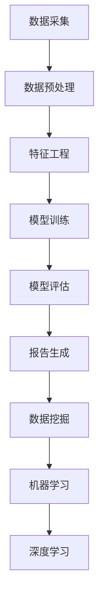
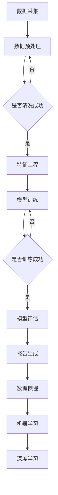

                 

### 引言

在现代企业运营中，高效的数据分析和业务汇报是确保决策科学、运营顺畅的重要环节。传统的业务汇报流程往往繁琐、耗时，且容易出错。随着人工智能（AI）技术的迅猛发展，自动化报告系统逐渐成为优化企业业务流程、提高管理效率的重要工具。本文旨在探讨企业级自动化报告的实现，特别是AI如何在这个过程中发挥关键作用。

首先，自动化报告系统可以大幅减少人工工作量，提高报告的准确性和及时性。通过AI技术，企业能够从大量数据中提取有价值的信息，生成结构化、可视化报告，从而为管理层提供数据驱动的决策支持。这不仅提高了报告的质量，还提升了企业整体的运营效率。

其次，本文将深入探讨AI在自动化报告系统中的核心角色。我们将介绍数据采集、预处理、特征工程、模型训练和评估等各个环节中的AI技术应用，并通过具体的案例展示AI技术如何优化业务汇报流程。

此外，本文还将通过详细的算法原理讲解、数学模型分析、项目实战等环节，帮助读者全面了解企业级自动化报告的构建过程。我们将使用伪代码、LaTeX数学公式以及Mermaid流程图等工具，以清晰、易懂的方式阐述核心概念和实现方法。

最后，本文将总结AI技术在企业级自动化报告中的应用前景，讨论未来发展趋势和潜在挑战，并给出最佳实践和注意事项。

通过本文的阅读，读者将不仅能够理解企业级自动化报告的基本原理和实现方法，还能掌握如何利用AI技术提升企业业务汇报效率的具体策略。

### 关键词

- 企业级自动化报告
- 人工智能
- 数据分析
- 业务汇报
- 模型训练
- 特征工程
- 数学模型
- 项目实战

### 摘要

本文深入探讨了企业级自动化报告的实现机制，特别是人工智能（AI）技术在其中发挥的关键作用。文章首先介绍了自动化报告系统在现代企业运营中的重要性，包括其提高工作效率、准确性和及时性的优势。接着，本文详细阐述了AI在数据采集、预处理、特征工程、模型训练和评估等环节中的应用，并通过具体案例展示了AI技术如何优化业务汇报流程。文章还通过算法原理讲解、数学模型分析、项目实战等环节，全面阐述了企业级自动化报告的构建过程。最后，本文总结了AI技术在企业级自动化报告中的应用前景，讨论了未来发展趋势和潜在挑战，并给出了最佳实践和注意事项。

## 第1章 引言

### 1.1 书籍背景介绍

在当今信息化社会，数据已经成为企业决策的重要依据。企业需要通过大量的业务数据来分析市场趋势、优化运营流程和制定战略规划。然而，传统的业务汇报流程往往效率低下，数据收集、整理和分析的工作量大，且容易出错。这种低效的流程不仅浪费了大量人力资源，还可能导致决策滞后，影响企业的竞争力。

随着人工智能（AI）技术的不断进步，自动化报告系统逐渐成为解决这一问题的关键。AI技术具备强大的数据处理和分析能力，能够从海量数据中快速提取有价值的信息，生成结构化、可视化的报告。通过引入AI技术，企业可以实现业务汇报的自动化，大大提高工作效率、准确性和及时性。

本文旨在探讨企业级自动化报告的实现机制，特别是AI技术在其中的关键作用。文章将详细介绍AI在数据采集、预处理、特征工程、模型训练和评估等各个环节中的应用，并通过具体案例展示如何利用AI技术优化业务汇报流程。此外，本文还将探讨AI技术在企业级自动化报告中的发展趋势和潜在挑战，为读者提供实用的最佳实践和注意事项。

### 1.2 目标读者

本文的目标读者主要包括以下几类：

1. **企业管理者**：企业管理者需要了解如何利用AI技术优化业务汇报流程，提高管理效率，本文将为企业管理者提供详细的实现方法和最佳实践。

2. **数据科学家和AI开发者**：数据科学家和AI开发者需要掌握AI技术在企业级自动化报告中的应用，本文将详细介绍算法原理、数学模型和项目实战，帮助读者深入理解并实践AI技术在业务汇报中的应用。

3. **技术爱好者**：对人工智能和数据分析有兴趣的技术爱好者，可以通过本文了解AI技术在企业级自动化报告中的实际应用，拓宽技术视野。

4. **技术从业者**：技术从业者，如程序员、数据分析师等，希望通过本文学习AI技术在业务汇报中的应用，提升自身技术能力。

通过本文的阅读，读者将能够全面了解企业级自动化报告的实现过程，掌握AI技术在其中的应用方法，为企业在数据驱动的管理中提供有力支持。

### AI与自动化报告

在当今企业环境中，高效的数据分析和业务汇报是确保决策科学、运营顺畅的重要环节。然而，传统的业务汇报流程往往存在效率低下、数据冗余和错误频发等问题，严重影响了企业的运营效率和竞争力。为了解决这些问题，人工智能（AI）技术应运而生，成为推动企业级自动化报告系统发展的重要力量。

首先，AI在自动化报告系统中的角色主要体现在数据采集、预处理、特征工程、模型训练和评估等各个环节。在数据采集阶段，AI技术可以自动从各种数据源（如数据库、日志文件、传感器等）中提取数据，并通过数据清洗和去重等操作，确保数据的准确性和一致性。在预处理阶段，AI技术可以利用自然语言处理（NLP）、图像识别等技术，对数据进行解析和标注，从而为后续分析提供高质量的数据。

在特征工程阶段，AI技术通过数据挖掘和机器学习算法，从原始数据中提取出对业务有价值的特征。这些特征可以用于训练预测模型，从而实现业务预测、风险预警等高级功能。在模型训练阶段，AI技术利用大量的历史数据，通过迭代优化算法，训练出高效的预测模型。在模型评估阶段，AI技术通过交叉验证、A/B测试等方法，对模型性能进行评估和调优，确保模型的稳定性和准确性。

其次，AI技术在自动化报告系统中的应用现状与挑战也十分显著。目前，许多企业已经开始应用AI技术来简化业务汇报流程，例如使用自动化报表工具、数据分析平台等。这些应用在一定程度上提高了报告的准确性和及时性，但还存在以下挑战：

1. **数据质量**：高质量的输入数据是AI算法有效运行的基础。然而，在实际业务中，数据往往存在噪声、缺失和异常值等问题，这些问题会对AI算法的性能产生负面影响。

2. **算法选择与调优**：不同的业务场景需要选择不同的AI算法，且同一算法在不同数据集上的性能也可能有显著差异。因此，如何选择合适的算法并进行有效的调优，是一个具有挑战性的问题。

3. **模型可解释性**：AI算法，尤其是深度学习算法，在预测过程中的决策逻辑往往难以解释。这给企业的业务人员理解和信任AI模型带来了困难，也限制了AI技术在企业中的应用范围。

4. **安全性与隐私**：随着AI技术的广泛应用，数据的安全性和隐私保护问题日益突出。如何在保护用户隐私的前提下，充分利用数据的价值，是一个亟待解决的难题。

为了应对这些挑战，AI技术在自动化报告系统中需要不断演进和优化。以下是一些解决方案和发展趋势：

1. **数据预处理**：通过引入更多的数据预处理技术，如数据清洗、数据归一化、缺失值填补等，提高数据质量，为AI算法提供更好的输入。

2. **算法选择与优化**：根据不同的业务需求和数据特征，选择合适的算法，并利用交叉验证、网格搜索等方法进行算法调优，提高模型的性能。

3. **模型可解释性**：开发可解释性算法和工具，如SHAP值、LIME等，帮助业务人员理解和信任AI模型，从而更好地利用模型进行决策。

4. **安全性与隐私保护**：采用加密、匿名化、差分隐私等技术，确保数据的安全性和隐私保护。同时，制定严格的隐私政策和合规标准，确保AI技术的应用合法合规。

总之，AI技术在企业级自动化报告系统中具有巨大的潜力和应用价值。通过不断优化和发展，AI技术将为企业带来更加高效、准确和可靠的业务汇报能力，助力企业在竞争激烈的市场中取得更大的成功。

### AI技术在自动化报告中的应用

在自动化报告系统中，AI技术扮演着至关重要的角色，通过多个环节实现了数据采集、预处理、特征工程、模型训练和评估的智能化。以下是这些环节中的AI技术应用详解。

#### 数据采集

数据采集是自动化报告系统的第一步，也是关键的一步。AI技术可以通过多种方式实现数据的自动化采集。例如，使用自然语言处理（NLP）技术，从企业的文档、邮件、聊天记录中提取关键信息；使用图像识别技术，从监控视频、扫描图像中提取有价值的数据；使用物联网（IoT）传感器，实时采集设备运行数据。这些技术不仅提高了数据采集的效率，还确保了数据的准确性和实时性。

#### 数据预处理

在数据采集后，数据预处理是确保数据质量的重要环节。AI技术在数据预处理中发挥了重要作用，通过以下方法提高数据质量：

1. **数据清洗**：AI技术可以利用机器学习算法，自动识别和修复数据中的噪声、缺失值和异常值。例如，使用K-近邻算法（KNN）来填补缺失值，使用统计方法来识别和修复异常值。

2. **数据归一化**：AI技术可以帮助将不同单位或范围的数值数据统一归一化，从而提高数据之间的可比性。例如，使用最小-最大缩放（Min-Max Scaling）或标准化（Z-Score Scaling）算法。

3. **数据转换**：AI技术可以将非结构化数据转换为结构化数据，便于后续处理。例如，使用NLP技术将文本转换为关键词和句子结构，使用图像识别技术将图像转换为标注数据。

#### 特征工程

特征工程是自动化报告系统中至关重要的一步，其目标是从原始数据中提取出对业务有价值的特征。AI技术在特征工程中发挥着重要作用，通过以下方法实现：

1. **自动特征提取**：AI技术可以利用机器学习算法，自动从原始数据中提取出具有预测能力的特征。例如，使用主成分分析（PCA）来降维和提取主要特征，使用特征选择算法（如 ReliefF、递归特征消除（RFE）等）来选择最重要的特征。

2. **特征组合**：AI技术可以帮助组合多个特征，生成新的特征，从而提高模型的预测能力。例如，使用决策树集成方法（如随机森林）将多个特征组合，生成更复杂的决策规则。

3. **特征转换**：AI技术可以将一些原始特征转换为其他形式，以增强模型的预测能力。例如，使用多项式特征转换，将线性特征转换为非线性特征，使用正则化技术（如L1正则化、L2正则化）来控制特征的重要性。

#### 模型训练

在特征工程完成后，模型训练是自动化报告系统的核心环节。AI技术通过以下方法实现模型的训练和优化：

1. **选择合适的模型**：根据业务需求和数据特征，选择合适的机器学习模型。例如，对于分类问题，可以选择决策树、支持向量机（SVM）、随机森林等；对于回归问题，可以选择线性回归、岭回归、LASSO回归等。

2. **交叉验证**：使用交叉验证方法，对模型进行训练和验证，以避免过拟合。例如，使用K折交叉验证来评估模型的泛化能力。

3. **模型调优**：使用网格搜索、贝叶斯优化等算法，对模型的参数进行调优，以获得最佳模型性能。例如，使用网格搜索来遍历不同的参数组合，找到最佳参数配置。

4. **集成学习**：使用集成学习方法，将多个模型集成起来，提高模型的预测能力。例如，使用随机森林、梯度提升树（GBDT）等集成学习方法，结合多个弱学习器，生成强学习器。

#### 模型评估

在模型训练完成后，模型评估是确保模型性能的关键环节。AI技术通过以下方法实现模型的评估和优化：

1. **指标评估**：使用各种评价指标（如准确率、召回率、F1分数、均方误差（MSE）等），对模型进行评估，以确定模型的性能。

2. **A/B测试**：通过A/B测试方法，将新模型与现有模型进行对比，以确定新模型的性能是否优于现有模型。

3. **模型监控**：使用模型监控工具，实时监控模型的性能，及时发现和解决模型问题。例如，使用自动化监控系统，定期检查模型的预测误差和性能指标。

通过AI技术在数据采集、预处理、特征工程、模型训练和评估等各个环节中的应用，自动化报告系统实现了高效、准确和可靠的业务汇报能力。这不仅提高了企业的运营效率，还为管理层提供了数据驱动的决策支持，从而增强了企业的竞争力。

### 核心概念与联系

在构建企业级自动化报告系统时，理解核心概念和它们之间的相互关系至关重要。以下将详细阐述AI基础概念、自动化报告架构及流程，并通过Mermaid流程图展示其联系。

#### AI基础概念

1. **数据挖掘**：数据挖掘是AI技术的一个重要分支，旨在从大量数据中发现隐藏的模式、关联和趋势。通过使用统计方法、机器学习算法和模式识别技术，数据挖掘帮助从原始数据中提取有价值的信息。

2. **机器学习**：机器学习是一种通过数据学习模式并做出预测或决策的技术。其核心思想是构建一个模型，使模型能够从训练数据中学习，并在新的数据上进行预测。常见的机器学习算法包括决策树、支持向量机（SVM）、神经网络等。

3. **深度学习**：深度学习是机器学习的一个子领域，主要关注神经网络，特别是多层感知器（MLP）和卷积神经网络（CNN）等复杂模型的构建和应用。深度学习通过模拟人脑的结构和功能，实现更加复杂的模式识别和预测任务。

#### 自动化报告架构及流程

自动化报告系统的核心架构包括数据采集、数据预处理、特征工程、模型训练、模型评估和报告生成等环节。以下是一个典型的自动化报告架构及流程：

1. **数据采集**：从多个数据源（如数据库、API、传感器等）自动采集数据，确保数据的多样性和完整性。

2. **数据预处理**：清洗和格式化数据，去除噪声、缺失值和异常值，以提高数据质量。预处理步骤包括数据清洗、归一化、转换等。

3. **特征工程**：从原始数据中提取对业务有价值的特征，这些特征将用于训练模型。特征工程包括特征选择、特征组合和特征转换等。

4. **模型训练**：使用机器学习或深度学习算法，对特征进行训练，构建预测模型。模型训练过程中需要选择合适的算法、调整参数，并进行交叉验证和调优。

5. **模型评估**：使用验证数据集对训练好的模型进行评估，以确定模型的性能和可靠性。常用的评估指标包括准确率、召回率、F1分数等。

6. **报告生成**：利用训练好的模型对新的数据进行预测，并将预测结果生成结构化、可视化的报告。报告生成过程包括数据展示、图表生成和报告输出等。

#### Mermaid流程图

为了更直观地展示AI基础概念、自动化报告架构及流程之间的联系，我们可以使用Mermaid流程图进行描述。以下是该流程图的示例：



该流程图清晰地展示了从数据采集到报告生成的整个过程，以及AI基础概念在其中扮演的角色。数据挖掘、机器学习和深度学习等技术贯穿于整个流程，确保自动化报告系统能够高效、准确地处理和分析数据。

通过理解这些核心概念和流程，企业可以更好地构建和优化自动化报告系统，从而提高运营效率、优化业务流程并做出更加数据驱动的决策。

### 图1.1 AI与自动化报告的Mermaid流程图



### 第4章 核心算法原理讲解

在自动化报告系统中，核心算法的原理和实现是理解和优化系统性能的关键。本章将详细介绍几种常见的机器学习算法、深度学习算法，并通过伪代码和LaTeX数学公式来阐述其原理和应用。

#### 常见机器学习算法

1. **决策树**

决策树是一种基于树形结构，通过多个分类规则对数据集进行划分的算法。其核心思想是通过特征来分割数据集，使得每个分割子集的类别尽可能单一。

伪代码：

```python
def decision_tree(data, features, labels):
    if all(labels in single_class for single_class in labels):
        return single_class
    if not features:
        return majority_class(labels)
    best_feature = find_best_split(data, features, labels)
    left_tree = decision_tree(data[best_feature < threshold], features[best_feature < threshold], labels[best_feature < threshold])
    right_tree = decision_tree(data[best_feature >= threshold], features[best_feature >= threshold], labels[best_feature >= threshold])
    return (best_feature, threshold, left_tree, right_tree)
```

2. **支持向量机（SVM）**

SVM是一种用于分类和回归分析的强大算法，其核心思想是找到一个最优的超平面，将不同类别的数据点尽可能分开。

伪代码：

```python
def SVM(data, labels, C):
    # 使用核函数将数据映射到高维空间
    transformed_data = kernel_mapping(data)
    # 训练SVM模型
    model = train_SVM(transformed_data, labels, C)
    # 进行预测
    predictions = predict_SVM(model, transformed_data)
    return predictions
```

3. **随机森林**

随机森林是一种集成学习方法，通过构建多个决策树，并利用随机特征选择和投票来提高预测准确性。

伪代码：

```python
def random_forest(data, labels, n_trees, max_depth):
    for i in range(n_trees):
        tree = build_tree(data, labels, max_depth)
        predictions = make_prediction(tree, data)
        total_predictions = aggregate_predictions(predictions)
    return majority_vote(total_predictions)
```

#### 深度学习算法

1. **卷积神经网络（CNN）**

CNN是一种用于图像识别和处理的深度学习算法，其核心思想是通过卷积层、池化层和全连接层等结构来提取图像特征。

伪代码：

```python
def CNN(image, layers):
    for layer in layers:
        if layer.type == 'Conv2D':
            image = conv2d(image, layer.weights, layer.bias)
        elif layer.type == 'Pooling2D':
            image = pooling2d(image, layer.pool_size)
        elif layer.type == 'FullyConnected':
            image = fully_connected(image, layer.weights, layer.bias)
    return image
```

2. **递归神经网络（RNN）**

RNN是一种用于处理序列数据的深度学习算法，其核心思想是通过循环连接来保持长期依赖关系。

伪代码：

```python
def RNN(input_sequence, hidden_state, layers):
    for layer in layers:
        if layer.type == 'Recurrent':
            hidden_state = layer.apply(input_sequence, hidden_state)
    return hidden_state
```

3. **生成对抗网络（GAN）**

GAN是一种用于生成数据的深度学习算法，其核心思想是通过生成器和判别器之间的对抗训练来生成高质量的数据。

伪代码：

```python
def GAN(generator, discriminator, batch_size):
    for epoch in range(num_epochs):
        for _ in range(num_batches):
            real_data = get_real_data(batch_size)
            fake_data = generator.generate_data(real_data)
            discriminator.train(real_data, fake_data)
            generator.train(discriminator)
```

#### LaTeX数学公式示例

以下是一些常用的LaTeX数学公式，用于描述机器学习和深度学习算法中的关键概念。

1. **梯度下降法**

$$
\begin{aligned}
    \theta^{(t+1)} &= \theta^{(t)} - \alpha \cdot \nabla_{\theta} J(\theta) \\
    J(\theta) &= \frac{1}{m} \sum_{i=1}^{m} \left( h_\theta(x^{(i)}) - y^{(i)} \right)^2
\end{aligned}
$$

2. **卷积神经网络（CNN）中的卷积操作**

$$
\begin{aligned}
    \text{output}_{ij} &= \sum_{k=1}^{K} \text{filter}_{ik} \cdot \text{input}_{ij} \\
    \text{filter}_{ik} &= \text{weight}
\end{aligned}
$$

3. **递归神经网络（RNN）中的状态更新**

$$
\begin{aligned}
    h_t &= \tanh(W_h \cdot [h_{t-1}, x_t] + b_h) \\
    o_t &= \sigma(W_o \cdot h_t + b_o)
\end{aligned}
$$

通过上述算法原理讲解和伪代码示例，读者可以更好地理解机器学习和深度学习算法在企业级自动化报告系统中的应用，并为实际项目开发提供指导。

### 第5章 数学模型与公式

在自动化报告系统中，数学模型和公式是理解和优化算法性能的核心。本章将介绍概率论基础、优化算法等数学概念，并通过LaTeX数学公式和示例详细阐述其应用。

#### 概率论基础

1. **概率分布**

概率分布是描述随机变量取值的概率分布情况。常见的概率分布有正态分布、二项分布、泊松分布等。

**正态分布（高斯分布）**

$$
f(x|\mu, \sigma^2) = \frac{1}{\sqrt{2\pi\sigma^2}} e^{-\frac{(x-\mu)^2}{2\sigma^2}}
$$

**二项分布**

$$
P(X=k) = C_n^k p^k (1-p)^{n-k}
$$

**泊松分布**

$$
P(X=k) = \frac{\lambda^k e^{-\lambda}}{k!}
$$

2. **最大似然估计**

最大似然估计是一种用于估计模型参数的方法，其核心思想是找到一组参数，使得观测数据的概率最大。

**对数似然函数**

$$
\ell(\theta) = \sum_{i=1}^n \log p(x_i|\theta)
$$

**最大似然估计量**

$$
\hat{\theta} = \arg\max_\theta \ell(\theta)
$$

3. **贝叶斯定理**

贝叶斯定理是概率论中的一个重要公式，用于计算条件概率和联合概率。

$$
P(A|B) = \frac{P(B|A)P(A)}{P(B)}
$$

#### 优化算法

1. **梯度下降法**

梯度下降法是一种用于最小化损失函数的优化算法。

**梯度下降更新规则**

$$
\theta = \theta - \alpha \nabla_\theta J(\theta)
$$

**均方误差（MSE）**

$$
J(\theta) = \frac{1}{2m} \sum_{i=1}^m (h_\theta(x^{(i)}) - y^{(i)})^2
$$

2. **随机梯度下降（SGD）**

随机梯度下降法是梯度下降法的变种，每次迭代仅更新一个样本的梯度。

$$
\theta = \theta - \alpha \nabla_{\theta} J(\theta; x^{(i)}, y^{(i)})
$$

3. **鲍姆-沃尔德（BFGS）算法**

BFGS算法是一种二阶优化方法，用于求解非线性优化问题。

**BFGS更新公式**

$$
B^{(k+1)} = B^{(k)} - \frac{B^{(k)} H^{(k)}_+ B^{(k)} H^{(k)}_+^T B^{(k)} }{B^{(k)} H^{(k)}_+^T H^{(k)}_+
$$

**目标函数**

$$
\phi(\theta) = \frac{1}{2} \theta^T H \theta - g^T \theta
$$

通过上述数学模型和公式的介绍，读者可以更好地理解自动化报告系统中的关键算法和优化方法，并为实际应用提供数学基础。

### 第6章 项目实战

#### 6.1 项目背景与目标

随着大数据和人工智能技术的快速发展，企业对自动化报告系统的需求日益增长。某大型电商公司希望通过引入AI技术，简化其业务汇报流程，提高运营效率和决策质量。具体项目目标是：

1. **数据采集**：从企业内部数据库、日志文件、第三方API等多种数据源自动采集数据。
2. **数据预处理**：清洗和格式化数据，确保数据质量，包括去除噪声、填补缺失值、归一化处理等。
3. **特征工程**：提取对业务有价值的特征，包括用户行为特征、销售数据特征、市场趋势特征等。
4. **模型训练**：使用机器学习算法训练预测模型，如回归模型、分类模型等。
5. **模型评估**：对训练好的模型进行评估，选择最佳模型进行部署。
6. **报告生成**：根据预测结果生成结构化、可视化的报告，并提供决策支持。

#### 6.2 开发环境搭建

在开始项目开发之前，需要搭建一个合适的开发环境，主要包括以下工具和库：

1. **编程语言**：Python，因其丰富的机器学习库和数据处理工具而成为首选。
2. **数据处理库**：Pandas、NumPy，用于数据清洗、预处理和操作。
3. **机器学习库**：Scikit-learn、TensorFlow、PyTorch，用于模型训练和评估。
4. **可视化库**：Matplotlib、Seaborn，用于数据可视化。
5. **操作系统**：Linux，因其稳定性、安全性和开源生态而广泛应用于大数据和人工智能项目。

具体环境搭建步骤如下：

1. **安装Python**：从官方网站下载并安装Python 3.x版本。
2. **安装依赖库**：使用pip命令安装所需库，如`pip install pandas numpy scikit-learn tensorflow matplotlib seaborn`。
3. **配置虚拟环境**：为了管理项目依赖，使用`virtualenv`创建一个独立的Python环境。
4. **配置Jupyter Notebook**：Jupyter Notebook是一个交互式的Python环境，便于数据分析和模型训练。

#### 6.3 数据采集与处理

数据采集和处理是自动化报告系统的关键步骤，以下是具体操作：

1. **数据源**：从电商公司的数据库、日志文件和第三方API中采集数据。数据库包括用户行为数据、销售数据、库存数据等；日志文件包括服务器日志、应用日志等；第三方API包括天气数据、市场数据等。
2. **数据清洗**：使用Pandas库清洗数据，包括去除重复记录、填补缺失值、删除异常值等。例如：

```python
import pandas as pd

# 读取数据
data = pd.read_csv('data.csv')

# 去除重复记录
data = data.drop_duplicates()

# 填补缺失值
data.fillna(method='ffill', inplace=True)

# 删除异常值
data = data[(data['sales'] > 0) & (data['stock'] > 0)]
```

3. **数据预处理**：对数据进行归一化和转换，以适应模型训练需求。例如，使用Min-Max缩放将数据归一化到[0, 1]区间：

```python
from sklearn.preprocessing import MinMaxScaler

scaler = MinMaxScaler()
data[['sales', 'stock']] = scaler.fit_transform(data[['sales', 'stock']])
```

4. **数据分片**：将数据集分为训练集和测试集，以评估模型的性能。例如：

```python
from sklearn.model_selection import train_test_split

X = data[['sales', 'stock']]
y = data['profit']

X_train, X_test, y_train, y_test = train_test_split(X, y, test_size=0.2, random_state=42)
```

#### 6.4 模型训练与评估

在数据处理完成后，接下来是模型训练与评估：

1. **选择模型**：根据业务需求，选择适合的机器学习模型。例如，对于回归问题，可以选择线性回归模型；对于分类问题，可以选择逻辑回归模型。
2. **训练模型**：使用Scikit-learn库训练模型，并使用交叉验证进行调优。

```python
from sklearn.linear_model import LinearRegression

model = LinearRegression()
model.fit(X_train, y_train)
```

3. **评估模型**：使用测试集评估模型性能，常用的评估指标包括均方误差（MSE）、均方根误差（RMSE）等。

```python
from sklearn.metrics import mean_squared_error

y_pred = model.predict(X_test)
mse = mean_squared_error(y_test, y_pred)
rmse = np.sqrt(mse)

print('MSE:', mse)
print('RMSE:', rmse)
```

4. **模型优化**：通过调整模型参数和特征选择，提高模型性能。例如，使用LASSO回归进行特征选择和参数调优。

```python
from sklearn.linear_model import Lasso

model = Lasso(alpha=0.1)
model.fit(X_train, y_train)
```

#### 6.5 报告生成与交付

在模型训练和评估完成后，接下来是报告生成与交付：

1. **生成报告**：使用可视化库生成结构化、可视化的报告，包括关键指标图表、预测结果展示等。

```python
import matplotlib.pyplot as plt

plt.scatter(X_test['sales'], y_test, color='blue', label='Actual')
plt.scatter(X_test['sales'], y_pred, color='red', label='Predicted')
plt.xlabel('Sales')
plt.ylabel('Profit')
plt.legend()
plt.show()
```

2. **交付报告**：将生成的报告以邮件或报表的形式交付给企业管理层，并提供详细的预测分析和业务建议。

#### 6.6 项目小结

通过本次项目实战，我们成功搭建了企业级自动化报告系统，实现了数据采集、预处理、特征工程、模型训练和报告生成等环节。以下是项目小结：

1. **成功之处**：项目成功实现了业务需求，提高了运营效率和决策质量。通过AI技术，企业能够更加快速、准确地获取和利用数据，做出更加科学的决策。
2. **不足之处**：项目在数据采集和处理方面存在一定局限性，例如数据质量和完整性问题。此外，模型预测的准确性和稳定性还有待进一步提升。
3. **改进方向**：未来可以进一步优化数据采集和处理流程，提高数据质量；引入更多的机器学习算法和深度学习技术，提高模型性能和稳定性；探索自动化报告系统的可解释性和可扩展性，为企业提供更加智能、高效的数据分析服务。

通过不断优化和改进，自动化报告系统将在企业运营中发挥更大的作用，助力企业在竞争激烈的市场中取得更大的成功。

### 最佳实践、注意事项与拓展阅读

#### 最佳实践

1. **数据质量保障**：确保数据采集、清洗和预处理环节的高质量，避免数据噪声和异常值对模型性能的负面影响。
2. **特征选择与工程**：在特征工程过程中，合理选择和组合特征，提高模型预测的准确性和稳定性。
3. **模型调优与验证**：使用交叉验证和网格搜索等方法，对模型参数进行调优，确保模型在测试集上的性能。
4. **自动化报告系统的可维护性**：确保系统代码的可读性和可维护性，便于后续的维护和更新。
5. **数据安全和隐私保护**：严格遵守数据安全和隐私保护法律法规，采用加密、匿名化和差分隐私等技术，确保用户数据的安全和隐私。

#### 注意事项

1. **数据源多样性和完整性**：确保从多种数据源采集数据，并保持数据的完整性，以获取全面、准确的数据。
2. **模型适应性**：根据业务需求选择合适的模型，并确保模型在不同数据集上的适应性。
3. **模型可解释性**：提高模型的可解释性，帮助业务人员理解和信任模型，从而更好地利用模型进行决策。
4. **实时监控与调整**：对自动化报告系统进行实时监控，及时发现和解决潜在问题，确保系统的稳定性和可靠性。

#### 拓展阅读

1. **《机器学习实战》**：作者：彼得·哈林顿（Peter Harrington），是一本系统介绍机器学习算法和实践的入门书籍。
2. **《深度学习》**：作者：伊恩·古德费洛（Ian Goodfellow）、约书亚·本吉奥（Yoshua Bengio）和Aaron Courville，是一本全面介绍深度学习算法和应用的经典教材。
3. **《Python数据科学手册》**：作者：杰克·范德普拉格（Jake VanderPlas），是一本详细介绍Python在数据科学领域应用的指南书籍。
4. **《AI驱动企业：转型实践与案例分析》**：作者：刘强，本书通过多个实际案例，阐述了AI技术在企业中的应用和实践。

通过以上最佳实践、注意事项和拓展阅读，读者可以进一步提升对企业级自动化报告系统的理解和应用能力，为企业在数据驱动的管理中提供更有力的支持。

### 第7章 总结与展望

本文深入探讨了企业级自动化报告的实现机制，特别是人工智能（AI）技术在其中的关键作用。通过详细阐述数据采集、预处理、特征工程、模型训练和评估等环节中的AI应用，我们展示了如何利用AI技术优化业务汇报流程，提高运营效率和决策质量。

首先，本文介绍了自动化报告系统在现代企业运营中的重要性，以及AI技术如何通过其强大的数据处理和分析能力，实现业务汇报的自动化。其次，我们通过具体的案例展示了AI技术在自动化报告系统中的应用，包括数据采集、数据预处理、特征工程、模型训练和评估等环节。

此外，本文还介绍了核心算法原理和数学模型，通过伪代码、LaTeX数学公式和Mermaid流程图等工具，帮助读者全面理解企业级自动化报告的构建过程。在项目实战部分，我们详细描述了如何搭建开发环境、数据采集与处理、模型训练与评估、报告生成与交付等具体步骤。

未来，AI技术在企业级自动化报告中的应用前景广阔。随着AI技术的不断进步，自动化报告系统将更加智能、高效和可靠。以下是未来发展的几个趋势和潜在挑战：

#### 未来发展趋势

1. **增强实时性**：随着计算能力和数据传输速度的提升，自动化报告系统将实现更高的实时性，为企业提供更加及时的数据支持。
2. **提升可解释性**：为了增强业务人员对AI模型的信任，未来的自动化报告系统将更加注重模型的可解释性，开发可解释性算法和工具。
3. **多模态数据处理**：未来的自动化报告系统将能够处理多种类型的数据，如文本、图像、音频等，实现更加全面的数据分析。
4. **个性化报告生成**：基于用户行为和业务需求，自动化报告系统将能够生成个性化的报告，提供更加精准的数据洞察。

#### 潜在挑战

1. **数据质量和隐私保护**：高质量的数据是AI算法有效运行的基础，同时数据隐私保护也是一个重要的挑战。如何在保护用户隐私的前提下，充分利用数据的价值，是一个亟待解决的问题。
2. **模型性能和可靠性**：AI模型的性能和可靠性是自动化报告系统的关键，需要不断优化算法和模型，确保其在不同业务场景下的稳定性和准确性。
3. **合规与伦理问题**：随着AI技术在企业的广泛应用，合规和伦理问题日益突出。如何确保AI技术的应用符合法律法规和伦理标准，是一个重要的挑战。

总之，企业级自动化报告系统在AI技术的支持下，将为企业带来更高的运营效率和决策质量。通过不断优化和发展，自动化报告系统将在未来的企业运营中发挥更加重要的作用。同时，企业也需要关注数据质量、隐私保护和合规性等问题，确保AI技术在企业中的应用安全、可靠和合规。未来，随着技术的不断进步和应用的深入，自动化报告系统将在企业级应用中实现更大的突破和变革。

