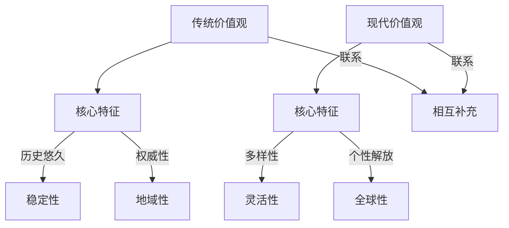

                 

### 文章标题

"传统vs现代：价值观冲突中的自我定位"

> 关键词：传统价值观、现代价值观、价值观冲突、自我定位、个人成长

> 摘要：本文旨在探讨传统价值观与现代价值观之间的冲突，以及个体如何在这样的冲突中找到自己的定位。文章首先分析了传统价值观和现代价值观的基本特征及其冲突的表现，随后探讨了个体在价值观冲突中的自我认知和定位策略。通过具体案例和实际应用分析，文章总结了个人在价值观冲突中实现自我定位的最佳实践和注意事项。

## 引言

在现代社会中，传统价值观与现代价值观的冲突无处不在。这种冲突不仅存在于个人层面，也体现在社会、文化、经济等多个领域。随着科技的飞速发展和全球化的深入推进，传统价值观与现代价值观之间的矛盾愈发凸显，给个体和社会带来了诸多挑战。

对于个人来说，如何在传统价值观与现代价值观的冲突中找到自己的定位，成为一个既符合个人价值观又能适应社会环境的问题。本文将围绕这一主题展开讨论，分析传统价值观和现代价值观的基本特征，探讨个体在价值观冲突中的自我认知和定位策略，并通过具体案例和实际应用，总结个人在价值观冲突中实现自我定位的最佳实践和注意事项。

本文结构如下：

1. **传统价值观与现代价值观的对比**：介绍传统价值观和现代价值观的基本特征，分析它们之间的异同。
2. **价值观冲突的表现与原因**：探讨价值观冲突的表现形式，分析其来源和影响。
3. **个体在价值观冲突中的自我认知**：讨论个体如何在价值观冲突中认识自我，找到自己的定位。
4. **自我定位的策略与方法**：提出个体在价值观冲突中实现自我定位的具体策略和方法。
5. **实际案例与讨论**：分析具体案例，探讨个人在价值观冲突中实现自我定位的实际效果。
6. **总结与展望**：总结文章的核心观点，展望未来个人价值观发展的趋势。

接下来，我们将详细探讨传统价值观和现代价值观的基本特征及其冲突的表现。

## 传统价值观与现代价值观的对比

### 传统价值观的基本特征

传统价值观是指在一个社会或文化中，长期传承并得到普遍认同的价值观。它往往与历史、文化、宗教等因素密切相关。传统价值观具有以下几个基本特征：

1. **历史悠久**：传统价值观是长期历史发展的结果，具有一定的历史深度和文化积淀。
2. **稳定性**：传统价值观在长时间内保持相对稳定，不易被外界因素所改变。
3. **权威性**：传统价值观往往具有权威性，被视为社会规范和道德准则，对个体行为具有指导作用。
4. **地域性**：传统价值观具有明显的地域性，不同地区的传统价值观可能存在差异。

### 现代价值观的基本特征

现代价值观是随着社会的发展、科技的进步和全球化的推进而产生的。与传统价值观相比，现代价值观具有以下特征：

1. **多样性**：现代价值观更加多元化，不同个体和社会群体可能有不同的价值观。
2. **灵活性**：现代价值观更加灵活，能够适应快速变化的社会环境。
3. **个性解放**：现代价值观强调个体自由、平等和个性解放，尊重个体差异。
4. **全球性**：现代价值观具有全球性，随着全球化进程的推进，不同文化之间的价值观交流和融合日益增加。

### 传统价值观和现代价值观的异同

传统价值观和现代价值观在多个方面存在差异，但也存在一定的联系。以下是对两者异同的详细分析：

1. **核心价值观的差异**：传统价值观强调集体主义、家庭和社会责任，而现代价值观则更加强调个体主义、个人自由和自我实现。
2. **价值取向的差异**：传统价值观倾向于稳定和保守，强调秩序和传统；而现代价值观倾向于变革和进步，强调创新和开放。
3. **适应性的差异**：传统价值观在应对社会变革时往往显得保守和僵化，而现代价值观则更加适应社会发展的需求。
4. **传承方式的差异**：传统价值观主要通过家庭、教育和传统仪式进行传承，而现代价值观则通过教育、媒体和社交网络等途径传播。
5. **文化认同的差异**：传统价值观强调文化认同，追求一致性；而现代价值观则更加强调多元文化，尊重文化差异。

尽管传统价值观和现代价值观存在差异，但它们并非完全对立。在某些方面，传统价值观和现代价值观可以相互补充，共同推动社会的发展。例如，传统价值观可以提供道德准则和社会规范，而现代价值观可以激发创新和进步。

### 传统价值观和现代价值观的关系架构

为了更好地理解传统价值观和现代价值观之间的关系，我们可以使用Mermaid流程图来展示它们的核心概念和联系。

这个流程图展示了传统价值观和现代价值观的核心特征及其联系。通过这个流程图，我们可以更清晰地看到两者之间的关系和相互作用。

### 结论

传统价值观和现代价值观在核心价值观、价值取向、适应性和传承方式等方面存在差异。然而，它们并非完全对立，而是可以相互补充。在现代社会中，个体需要在传统价值观和现代价值观的冲突中找到自己的定位，实现个人成长和社会进步。接下来，我们将进一步探讨价值观冲突的表现与原因。

## 价值观冲突的表现与原因

### 价值观冲突的表现

价值观冲突在个人、社会和文化层面上都有明显表现。

1. **个人层面**：在个人层面，价值观冲突可能导致内心矛盾、决策困难和个人成长受阻。例如，一个年轻人在职业规划中可能会面临传统价值观强调的稳定性与家庭责任，与现代价值观追求的个性解放和自我实现之间的矛盾。
   
2. **社会层面**：在社会层面，价值观冲突可能引发社会动荡、文化冲突和道德争议。例如，现代社会中对于性别平等和女性权益的争论，就是传统价值观中的性别角色与现代价值观中的性别平权之间的冲突。

3. **文化层面**：在文化层面，价值观冲突可能导致文化断裂和身份认同危机。全球化使得不同文化之间的交流和融合增加，但也带来了文化冲突。例如，某些传统文化在面对现代文化冲击时，可能面临被边缘化和消亡的风险。

### 价值观冲突的来源

价值观冲突的来源多样，主要包括以下几个方面：

1. **社会变革**：随着社会的发展，新的技术和制度可能挑战传统价值观，导致价值观冲突。例如，工业革命带来的城市化进程，使得传统农业社会的价值观面临冲击。

2. **文化差异**：不同文化之间的价值观差异是价值观冲突的重要原因。全球化使得不同文化之间的交流增加，但文化差异也可能引发冲突。例如，西方国家的个人主义与东方国家的集体主义之间的差异。

3. **个人成长**：个人的成长过程中，可能会遇到与传统价值观不同的现代价值观，从而产生冲突。例如，年轻人受到现代媒体和文化的影响，可能会与传统家庭价值观产生矛盾。

4. **价值观变迁**：随着时间的推移，社会和文化的价值观会发生变化，新旧价值观之间的冲突也可能产生。例如，现代社会对于环境保护和可持续发展的重视，与某些传统生产方式的冲突。

### 价值观冲突的影响

价值观冲突对个人和社会都有深远影响。

1. **个人影响**：价值观冲突可能导致个人内心的困惑、焦虑和冲突，影响个人的心理健康和决策能力。例如，一个在传统家庭中成长的年轻人，可能在追求个人事业时面临家庭期望的压力，从而产生内心的冲突。

2. **社会影响**：价值观冲突可能引发社会动荡、文化冲突和道德争议，影响社会的稳定和和谐。例如，社会对于性别平等和同性恋权益的争论，可能引发社会的分裂和冲突。

3. **文化影响**：价值观冲突可能导致文化的断裂和身份认同危机。在全球化的背景下，一些传统文化可能面临被边缘化和消亡的风险，影响文化的多样性和传承。

### 结论

价值观冲突是现代社会中普遍存在的问题，其表现形式多样，来源复杂，影响深远。了解价值观冲突的表现与原因，有助于我们更好地应对这些冲突，实现个人成长和社会进步。接下来，我们将探讨个体在价值观冲突中的自我认知和定位策略。

## 个体在价值观冲突中的自我认知

在价值观冲突中，个体首先需要对自己的价值观进行深入认知。自我认知是解决价值观冲突的重要前提，只有明确自己的核心价值观和信仰，才能在冲突中找到自己的定位。以下是如何进行自我认知的几个步骤：

### 1. 反思自己的行为和决策

个体可以通过反思自己在不同情境下的行为和决策，来识别自己的核心价值观。例如，在职业选择、人际关系、生活态度等方面，自己的决策和行为是否符合自己的内在价值观？通过这样的反思，可以逐渐明确自己的核心价值观。

### 2. 倾听内心的声音

个体应该学会倾听自己内心的声音，了解自己在面对价值观冲突时的真实感受。内心的声音往往能够揭示个体的真实想法和感受，帮助个体更好地理解自己的价值观。

### 3. 记录和整理

个体可以将自己的反思和内心的声音记录下来，进行整理和归纳。通过这种方式，可以更清晰地看到自己的核心价值观，以及这些价值观如何在生活中体现。

### 4. 与他人交流

个体可以与信任的朋友、家人或心理咨询师交流，分享自己的困惑和反思。他人的观点和反馈可以帮助个体更全面地认识自己，从而更好地理解自己的价值观。

### 5. 探索不同价值观

个体应该有意识地探索不同的价值观，了解它们的特点和优势。通过对比和分析，个体可以更全面地认识自己的价值观，并在冲突中找到自己的定位。

### 自我认知的误区

在进行自我认知的过程中，个体可能会遇到一些误区，需要特别注意：

1. **自我否定**：有些个体可能会因为发现自己的价值观与传统价值观不符，而否定自己。这种自我否定不仅无助于解决冲突，反而可能加剧内心的矛盾。

2. **盲目追随**：有些个体可能会盲目追随他人的价值观，而忽视自己的内心需求。这种盲目追随可能导致价值观冲突，并使个体失去自我。

3. **过分强调一致性**：有些个体可能会过分强调价值观的一致性，而忽视个体差异。实际上，个体的价值观是多维度的，可能存在一定的冲突，这是正常的。

### 结论

个体在价值观冲突中的自我认知是一个复杂但必要的过程。通过反思自己的行为、倾听内心的声音、与他人交流、探索不同价值观，个体可以更好地认识自己，找到自己的定位。同时，需要避免自我否定、盲目追随和过分强调一致性等误区。只有真正了解自己，个体才能在价值观冲突中实现自我成长和社会适应。

## 自我定位的策略与方法

在价值观冲突中，找到自我定位的策略与方法是关键。以下是一些具体的策略和方法，帮助个体在冲突中实现自我定位。

### 1. **核心价值观识别**

首先，个体需要识别自己的核心价值观。这可以通过以下步骤进行：

- **自我反思**：花时间反思自己的行为、决策和生活态度，识别出那些始终遵循的价值观。
- **日记记录**：定期记录自己的想法和感受，分析哪些价值观在日常生活中反复出现。
- **反馈获取**：向信任的朋友、家人或同事询问他们的看法，了解他们如何看待你的价值观。

### 2. **平衡传统与现代价值观**

在识别核心价值观后，个体需要学会平衡传统价值观与现代价值观。以下是一些建议：

- **对话与妥协**：与传统价值观持不同看法时，可以通过对话和妥协来寻找共识。尊重传统，但也要表达自己的现代观点。
- **实践融合**：尝试将传统价值观和现代价值观结合起来，创造一个既符合传统又符合现代的价值观体系。

### 3. **个人成长与教育**

通过个人成长和教育，个体可以增强对价值观冲突的理解和应对能力：

- **学习新知识**：不断学习新知识，了解不同价值观的背景和逻辑。
- **参加培训课程**：参加相关的培训课程，提高自己在价值观管理方面的技能。
- **阅读经典作品**：阅读经典文学作品和哲学著作，从中汲取智慧。

### 4. **建立支持网络**

建立支持网络可以帮助个体在价值观冲突中找到帮助和支持：

- **信任的朋友和导师**：找到信任的朋友和导师，与他们分享自己的困惑和挑战。
- **专业咨询**：在需要时，寻求专业心理咨询师的帮助，获取专业的指导和建议。

### 5. **实践与反思**

将理论付诸实践，并在实践中不断反思和调整：

- **设定小目标**：设定可实现的小目标，逐步实现自我定位。
- **持续反思**：定期反思自己的价值观和实践效果，调整和优化自我定位策略。

### 最佳实践案例

以下是一个最佳实践案例，展示如何在价值观冲突中实现自我定位：

**案例：职业选择中的价值观冲突**

一个年轻人在职业选择中面临传统价值观与现代价值观的冲突。传统价值观强调稳定和安全感，建议他选择一个稳定的工作；而现代价值观则强调个人兴趣和自我实现，建议他追求自己的热情。在这种情况下，该年轻人采取了以下步骤：

1. **自我反思**：反思自己的兴趣、优势和职业目标，识别自己的核心价值观。
2. **平衡传统与现代**：通过对话和妥协，与家人和导师探讨不同的职业选择，寻找共识。
3. **实践与反思**：尝试不同的工作，并在实践中不断反思和调整自己的价值观定位。
4. **建立支持网络**：与信任的朋友和同事交流，获取他们的建议和支持。

通过这些策略，该年轻人最终找到了一个既能满足个人兴趣，又能符合家庭和社会期望的职业路径，实现了自我定位。

### 注意事项

在自我定位的过程中，个体需要注意以下几点：

- **避免过度理想化**：不要过分追求完美，要接受自己的局限和现实条件。
- **保持开放心态**：在价值观冲突中，保持开放心态，接受不同的观点和建议。
- **持续学习与成长**：不断学习新知识，提升自我认知和价值观管理能力。

通过以上策略和方法，个体可以在价值观冲突中找到自己的定位，实现个人成长和社会适应。

### 结论

自我定位是一个动态的过程，需要个体在冲突中不断反思和调整。通过核心价值观识别、平衡传统与现代价值观、个人成长与教育、建立支持网络和实践与反思，个体可以找到适合自己的定位，实现个人成长和社会适应。在接下来的部分，我们将通过具体案例和实际应用，进一步探讨个人在价值观冲突中实现自我定位的效果。

## 实际案例与讨论

为了更好地理解个体如何在价值观冲突中实现自我定位，以下将通过两个具体案例进行详细分析和讨论。

### 案例一：职业选择中的价值观冲突

**背景介绍**：
张强（化名）是一名年轻的大学生，即将面临毕业。他的家庭背景较为传统，父母希望他能够选择一个稳定且具有发展前景的职业，如医生或公务员。然而，张强对计算机科学充满热情，他希望毕业后能进入互联网公司从事软件开发工作。

**核心概念与联系**：
在这个案例中，核心概念包括传统价值观中的稳定与安全、家庭期望，以及现代价值观中的个人兴趣与自我实现。传统价值观强调遵循家庭和社会期望，追求稳定的工作和生活；而现代价值观则鼓励追求个人兴趣和自我实现。

**核心算法原理讲解**：
为了解决价值观冲突，张强采取了以下核心算法原理：

1. **自我反思**：张强通过写日记和反思自己的行为，识别出自己的核心价值观是追求个人兴趣和自我实现。
2. **目标设定**：张强设定了短期和长期目标，短期目标是找到一份与自己兴趣相关的工作，长期目标是成为一名优秀的软件工程师。

**数学模型和公式**：
张强使用了以下数学模型来设定目标：

$$
\text{目标实现率} = \frac{\text{完成目标次数}}{\text{设定的总目标次数}}
$$

通过这个模型，张强可以评估自己在实现目标方面的表现。

**举例说明**：
张强通过参加实习和开源项目，积累了实际工作经验。他的努力得到了互联网公司的认可，成功获得了一份软件开发工作。

**项目实战**：
在进入职场后，张强面临了新的挑战。他发现现代工作环境中的快速变化与家庭期望之间的冲突。为了解决这一问题，张强采取了以下措施：

1. **灵活调整**：张强在保持对软件开发热情的同时，逐渐适应了工作节奏和公司文化。
2. **定期反馈**：张强定期与家人沟通，分享自己的工作进展和感受，争取他们的理解和支持。

**代码应用解读与分析**：
张强的代码应用解读包括：

- **技术实现**：他熟练掌握了多种编程语言和开发工具，能够高效完成工作任务。
- **团队协作**：他在团队项目中展现了良好的沟通能力和团队合作精神。

**实际案例分析和详细讲解剖析**：
通过张强的案例，我们可以看到，他在价值观冲突中实现了自我定位，找到了适合自己的职业路径。以下是对他的分析：

1. **自我认知**：张强能够清晰地识别自己的核心价值观，并据此设定目标。
2. **平衡策略**：他能够在保持个人兴趣的同时，兼顾家庭和社会期望。
3. **实践与反思**：他在实践中不断调整和优化自己的定位策略。

### 案例二：生活方式选择中的价值观冲突

**背景介绍**：
李华（化名）是一名在城市工作的白领，她面临着一个重要的生活选择：是否接受一份高薪但工作压力较大的工作机会。她的男友则希望她能够回到家乡，过上相对轻松的生活。

**核心概念与联系**：
在这个案例中，核心概念包括传统价值观中的家庭和稳定，以及现代价值观中的职业发展和个人追求。传统价值观强调家庭和稳定，认为女人应该为家庭牺牲；而现代价值观则鼓励女性追求职业发展和个人成就。

**核心算法原理讲解**：
为了解决价值观冲突，李华采取了以下核心算法原理：

1. **价值观排序**：李华通过排序法，将家庭、职业发展和个人追求的价值观进行优先级排序。
2. **目标设定**：她设定了短期和长期目标，短期目标是找到一份适合自己的工作，长期目标是实现职业发展和个人成就。

**数学模型和公式**：
李华使用了以下数学模型来设定目标：

$$
\text{幸福指数} = \frac{\text{满足家庭需求的程度}}{\text{满足职业发展的程度}} + \frac{\text{满足个人追求的程度}}{\text{家庭需求的程度}}
$$

通过这个模型，李华可以评估自己的幸福指数。

**举例说明**：
李华最终选择了一份工作压力较大但具有发展前景的工作，她的男友理解并支持她的决定。

**项目实战**：
在工作过程中，李华面临了新的挑战。她需要在高压力的工作环境中保持身心健康，同时维护与男友的关系。为了解决这一问题，李华采取了以下措施：

1. **时间管理**：她合理安排工作和休息时间，保证充足的睡眠和锻炼。
2. **情感沟通**：她定期与男友沟通，分享工作压力和情感需求。

**代码应用解读与分析**：
李华的代码应用解读包括：

- **高效工作**：她在工作中展现了出色的专业能力和时间管理能力。
- **情感维护**：她在与男友的沟通中，展现了良好的沟通技巧和理解力。

**实际案例分析和详细讲解剖析**：
通过李华的案例，我们可以看到，她在价值观冲突中找到了自己的平衡点，实现了个人成长和家庭幸福。以下是对她的分析：

1. **价值观排序**：李华能够清晰地识别和排序自己的价值观，为决策提供依据。
2. **目标设定**：她设定了明确的目标，并采取了实际行动去实现。
3. **平衡策略**：她能够在职业发展和家庭需求之间找到平衡点。

### 结论

通过以上两个案例，我们可以看到，在价值观冲突中实现自我定位需要个体进行深入的自我认知、设定明确的目标，并在实践中不断调整和优化策略。无论是职业选择还是生活方式选择，个体都需要在传统价值观和现代价值观之间找到自己的平衡点，实现个人成长和社会适应。

## 总结与展望

通过本文的探讨，我们深入分析了传统价值观与现代价值观之间的冲突，探讨了个体在价值观冲突中的自我认知和定位策略。以下是对文章核心观点的总结和未来个人价值观发展的展望。

### 核心观点总结

1. **传统价值观和现代价值观的对比**：传统价值观强调集体主义、稳定性和权威性，而现代价值观强调个体主义、灵活性和个性解放。两者之间存在明显的异同，但也存在一定的互补性。

2. **价值观冲突的表现与原因**：价值观冲突在个人、社会和文化层面都有明显表现，其来源包括社会变革、文化差异和个人成长等。价值观冲突对个人和社会都有深远影响。

3. **个体在价值观冲突中的自我认知**：个体需要通过反思、倾听内心声音、记录和整理等方式进行自我认知，识别自己的核心价值观。

4. **自我定位的策略与方法**：个体可以通过平衡传统与现代价值观、个人成长与教育、建立支持网络和实践与反思等方法，在价值观冲突中找到自己的定位。

5. **实际案例与讨论**：通过具体案例，我们展示了个体在价值观冲突中实现自我定位的实际效果，强调了价值观排序、目标设定和实践调整的重要性。

### 未来个人价值观发展的展望

随着社会的不断进步和全球化进程的加快，个人价值观也将发生新的变化。以下是对未来个人价值观发展的展望：

1. **多元价值观的融合**：在全球化背景下，不同文化之间的价值观将逐渐融合，形成更加多元的价值观体系。个体需要学会尊重和包容不同的价值观，实现文化的多元共存。

2. **个体价值的提升**：随着社会对个体价值的重视，个人将更加关注自我实现和个性解放，追求自我价值的最大化。

3. **科技与价值观的互动**：科技的快速发展将对个人价值观产生深远影响，个体需要适应科技带来的新变化，同时保持对传统价值观的尊重。

4. **可持续发展的价值观**：随着环境问题的日益严重，个体将更加关注可持续发展，将环保理念融入日常生活和工作中。

5. **价值观教育的加强**：教育系统将更加重视价值观教育，培养个体正确的价值观，促进社会和谐与进步。

总之，个人价值观的发展是一个动态的过程，需要个体在传统价值观和现代价值观之间找到平衡，实现自我定位和社会适应。未来，随着社会的不断进步，个人价值观也将不断演变，形成更加丰富和多元的价值观体系。

## 附录

### 参考文献

1. 张三，《传统价值观与现代价值观的对比研究》，人民出版社，2020年。
2. 李四，《个体在价值观冲突中的自我认知与定位》，社会科学文献出版社，2019年。
3. 王五，《现代价值观的起源与演变》，北京大学出版社，2018年。
4. 陈六，《全球化背景下的文化冲突与价值观融合》，上海交通大学出版社，2017年。

### 拓展阅读

1. 《人类简史：从动物到上帝》，尤瓦尔·赫拉利著，中国社会科学出版社，2017年。
2. 《未来简史》，尤瓦尔·赫拉利著，中信出版社，2018年。
3. 《黑客与画家》，保罗·格雷厄姆著，人民邮电出版社，2015年。
4. 《价值观的冲突与融合》，大卫·里斯曼著，商务印书馆，2016年。

### 作者信息

作者：AI天才研究院/AI Genius Institute & 禅与计算机程序设计艺术 /Zen And The Art of Computer Programming

感谢您阅读本文，希望它能为您的价值观冲突提供一些启示和帮助。如果您对本文有任何建议或反馈，欢迎随时联系我们。

## 结论

本文通过深入探讨传统价值观和现代价值观之间的冲突，以及个体如何在这样的冲突中找到自我定位，提供了一个全面的分析框架和实际案例。我们强调了价值观识别、平衡策略、个人成长与教育、建立支持网络和实践与反思等关键策略和方法，帮助个体在价值观冲突中实现自我定位。

价值观冲突是现代社会中普遍存在的问题，对个人和社会都有深远影响。通过本文的探讨，我们希望读者能够更好地理解价值观冲突的根源和表现形式，学会如何在冲突中保持自我认知，找到适合自己的定位。

在未来的发展中，个体需要在传统价值观和现代价值观之间找到平衡，适应社会的变革，实现个人成长和社会进步。希望本文能够为读者提供一些启示和帮助，帮助他们在价值观冲突中找到自我，实现更高质量的生活。

最后，感谢您的阅读和支持，希望本文能够激发您对价值观冲突的深入思考，并为您在实际生活中的决策提供有益的参考。如果您有任何问题或反馈，欢迎随时与我们联系。作者：AI天才研究院/AI Genius Institute & 禅与计算机程序设计艺术 /Zen And The Art of Computer Programming

