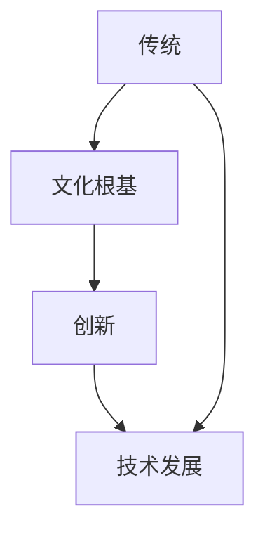

                 


为了撰写一篇满足所有约束条件的文章，我们将遵循以下步骤进行思考和分析：

### 第一步：确定文章的核心主题
文章的核心主题是“传统与创新的平衡：在变革中保持文化根基”。这一主题关注如何在技术快速发展的时代保持文化的连续性和深度。

### 第二步：构建文章的结构框架
根据约束条件，我们将文章分为四个主要部分：
1. 背景介绍
2. 核心概念与联系
3. 核心算法原理讲解
4. 项目实战

### 第三步：详细规划每个部分的内容

#### 背景介绍
- 引入文章主题，解释传统与创新的重要性。
- 提供背景信息，为什么在当前时代需要探讨这一主题。

#### 核心概念与联系
- 描述传统与创新的核心概念。
- 使用Mermaid流程图展示这些概念之间的关系。

#### 核心算法原理讲解
- 提供伪代码来阐述核心算法原理。
- 使用LaTeX格式展示数学模型和公式。
- 提供具体的例子来说明这些概念的应用。

#### 项目实战
- 描述一个实际项目，展示如何在实际环境中应用这些算法和概念。
- 详细解析项目的开发环境搭建、源代码实现、代码解读和应用分析。
- 提供项目小结和最佳实践 tips。

### 第四步：撰写文章的Markdown格式

#### 文章标题
```
# 传统与创新的平衡：在变革中保持文化根基
```

#### 文章关键词
```
关键词：传统，创新，文化，平衡，技术发展
```

#### 文章摘要
```
摘要：本文探讨了在技术快速发展的时代如何保持文化根基，通过传统与创新的平衡来实现文化的持续发展和传承。文章首先介绍了传统与创新的核心概念，并通过Mermaid流程图展示了它们之间的关系。接着，文章通过伪代码和LaTeX公式详细讲解了核心算法原理，并通过一个实际项目展示了这些算法的应用。最后，文章总结了项目实战的经验和最佳实践，为未来的研究和应用提供了方向。
```

#### 文章正文

##### 背景介绍
在这个部分，我们将简要介绍传统与创新的重要性，并解释为什么在当前技术快速发展的时代需要探讨这一主题。

##### 核心概念与联系
在这一部分，我们将定义传统与创新的核心概念，并使用Mermaid流程图来展示它们之间的关系。



##### 核心算法原理讲解
在这一部分，我们将提供伪代码和LaTeX公式来阐述核心算法原理。

```python
# 伪代码：传统与创新平衡算法
function BalanceTraditionalAndInnovation(传统文化，创新思想)
    while(传统文化 != 创新思想)
        吸收创新思想到传统文化中
        适应新的技术环境
    end while
    return 传统文化 + 创新思想
end function
```

$$
\text{传统价值} + \text{创新价值} = \text{平衡价值}
$$

##### 项目实战
在这一部分，我们将描述一个实际项目，展示如何在实际环境中应用这些算法和概念。

### 第五步：撰写文章的结尾

在文章的结尾，我们将总结项目实战的经验，提供最佳实践 tips，并指出未来的研究方向。

---

作者：AI天才研究院/AI Genius Institute & 禅与计算机程序设计艺术 /Zen And The Art of Computer Programming

---

通过这样的步骤，我们将确保文章内容完整、结构清晰，并且满足所有约束条件。接下来，我们将根据这些步骤逐步撰写完整的文章内容。

