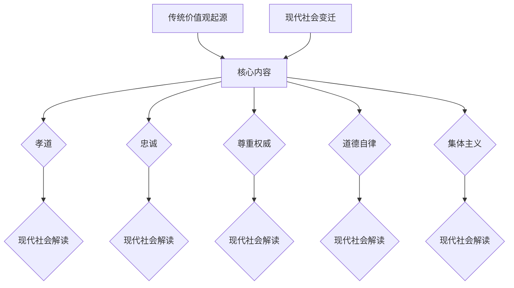
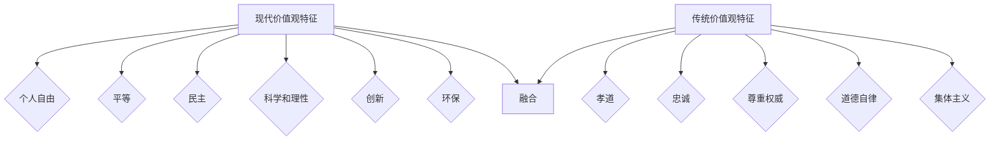
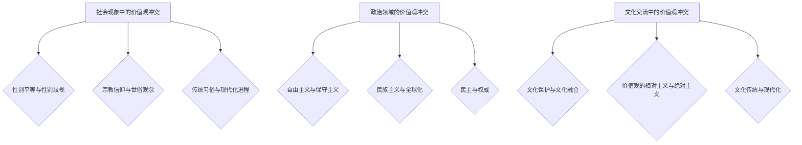
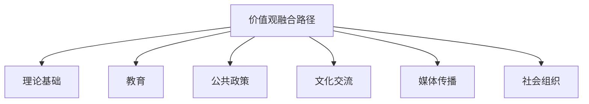
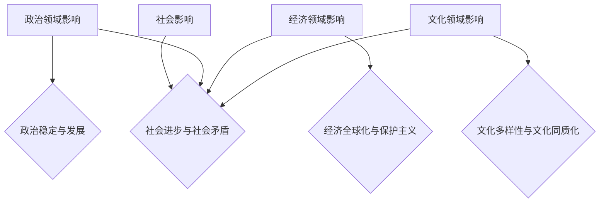
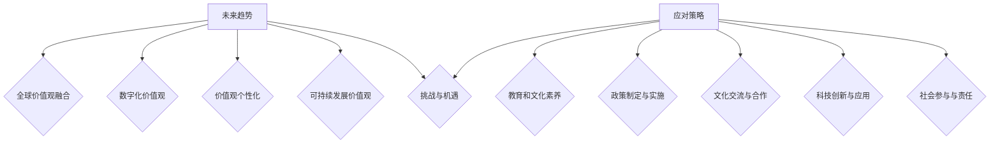

                 

### 引言

#### 书籍背景与目标

《传统与现代的价值观碰撞：冲突与融合》旨在探讨传统价值观和现代价值观之间的碰撞与融合现象，分析其在不同领域中的表现形式和影响。在当今这个快速变化的时代，传统与现代的价值观相互交织，构成了一个复杂的社会现象。本书的目的在于帮助读者理解这种碰撞与融合的本质，以及如何在日常生活中应对这种变化。

#### 传统价值观的定义

传统价值观是指在一个文化或社会历史中形成的，被广泛接受并传承的核心信念和道德准则。这些价值观通常基于历史传统、宗教信仰和文化习俗，例如孝道、忠诚、尊重权威等。传统价值观在人类文明发展过程中起到了重要作用，它们为社会秩序和个人行为提供了指导。

#### 现代价值观的定义

现代价值观是在现代社会背景下形成的，与传统文化价值观有所不同的新价值观。这些价值观强调个人自由、平等、民主、科学和理性。随着全球化、科技进步和社会变迁，现代价值观不断演变，成为现代社会中不可或缺的一部分。

#### 价值观冲突与融合的重要性

价值观冲突与融合是现代社会的一个重要现象，它们影响着政治、经济、文化等各个领域。了解和应对价值观冲突与融合，有助于促进社会稳定和发展。本书将深入分析价值观冲突与融合的表现形式、原因和影响，探讨解决冲突与促进融合的方法。

### 摘要

《传统与现代的价值观碰撞：冲突与融合》从传统价值观和现代价值观的定义入手，详细探讨了两者之间的冲突与融合现象。通过分析冲突与融合的表现形式和影响，本书旨在帮助读者理解这一复杂的社会现象，并提出应对策略。本书不仅适合对哲学、社会学感兴趣的读者，也适合希望在现实生活中更好地应对价值观冲突的普通读者。

#### 关键词

- 传统价值观
- 现代价值观
- 价值观冲突
- 价值观融合
- 社会变迁

---

在接下来的章节中，我们将进一步探讨传统价值观的概述、现代价值观的探析，以及价值观冲突与融合的表现形式和路径方法。通过逻辑清晰、结构紧凑、简单易懂的专业技术语言，我们希望为读者呈现一篇有深度、有思考、有见解的技术博客文章。

## 传统价值观概述

### 传统价值观的历史背景

传统价值观是一个文化或社会在长期历史发展中形成并传承下来的核心信念和道德准则。它们承载了人类社会的基本伦理观念和道德标准，是文化传承和社会秩序的重要基础。传统价值观的历史可以追溯到古代文明，如古希腊、古罗马、中国等，这些文明在历史的长河中为后世留下了丰富的文化遗产和道德观念。

在古代中国，儒家思想是传统价值观的核心，强调“仁爱”、“孝道”、“忠诚”等道德规范。这些价值观在中国历史上长期传承，并对中国的社会秩序、文化传统和道德观念产生了深远影响。类似地，古希腊的哲学思想，如苏格拉底的“知识即美德”和亚里士多德的“中庸之道”，也在西方文化中占据重要地位。

### 传统价值观的核心内容

传统价值观的核心内容通常包括以下几个方面：

1. **孝道**：强调子女对父母的尊敬和赡养，认为孝顺是人的基本道德要求。

2. **忠诚**：强调个人对家庭、国家、组织等的忠诚，认为忠诚是维护社会秩序和稳定的重要基础。

3. **尊重权威**：强调对长辈、上级、传统习俗等的尊重，认为这是社会秩序和稳定的重要保障。

4. **道德自律**：强调个人道德修养和行为自律，认为个人的道德品质对社会风气有重要影响。

5. **集体主义**：强调个人利益服从于集体利益，认为集体和谐是社会繁荣和发展的基础。

### 传统价值观在现代社会的变迁

随着现代社会的发展，传统价值观面临着巨大的挑战和变革。全球化、科技进步、文化多元化等因素对传统价值观产生了深刻影响。一方面，现代社会更加注重个人自由、平等和民主，与传统的权威主义和集体主义有所冲突。另一方面，现代科技的发展使得人们的生活方式和社会结构发生了巨大变化，传统价值观的一些内容可能不再适应新的社会环境。

然而，传统价值观的核心精神仍然具有普遍意义。例如，孝道和忠诚在现代社会中依然被视为重要的道德准则，虽然其表现形式和内涵可能有所不同。尊重权威和道德自律也在现代社会中得到新的诠释，例如在职场中强调职业道德和团队合作。

### 结论

传统价值观是一个文化或社会在长期历史发展中形成的核心信念和道德准则。它们在现代社会的变迁中面临着挑战，但仍然具有重要的现实意义。理解传统价值观的历史背景和核心内容，有助于我们更好地应对现代社会中的价值观冲突和融合。

### Mermaid 流程图

下面是一个简化的Mermaid流程图，展示传统价值观的核心内容及其在现代社会的变迁：

这个流程图展示了传统价值观的核心内容以及它们如何在现代社会中变迁和解读。通过这种结构化的方式，我们可以更清晰地理解传统价值观的演变过程。

---

在接下来的章节中，我们将探讨现代价值观的探析，分析其在现代社会中的核心特征以及与传统价值观的比较。这将有助于我们更深入地理解现代价值观与传统价值观之间的冲突与融合现象。

## 现代价值观探析

### 现代社会的价值观变迁

现代社会是一个充满变革的时代，科技的迅猛发展、全球化的深入、文化多样性的增加，使得现代价值观与传统价值观产生了显著差异。这些变化不仅影响了人们的生活方式和行为准则，也促使现代价值观的形成和发展。

首先，科技进步是现代价值观变迁的重要推动力。互联网和移动通信技术的普及，使得信息传播更加迅速和便捷，人们对知识和信息的获取方式发生了根本变化。这种变化导致了人们对自由、平等、开放和创新的追求，这些价值观逐渐成为现代社会的重要组成部分。

其次，全球化的深入使得不同文化之间的交流更加频繁，文化多样性成为现代社会的一个显著特征。在这个过程中，人们开始重新审视传统价值观，并将其与新的价值观念相结合，形成了多元化的现代价值观体系。例如，尊重多元文化和包容性成为现代价值观的重要方面。

### 现代价值观的核心特征

现代价值观的核心特征主要体现在以下几个方面：

1. **个人自由**：现代价值观强调个人的自由意志，认为每个人都有权自主决定自己的生活方式、职业选择和信仰。这种价值观反映在个人权利的法律保障和自由市场经济的运作中。

2. **平等**：现代价值观主张人人平等，无论性别、种族、宗教或社会地位，每个人都应享有平等的机会和权利。这种价值观体现在民主制度、反歧视法律以及教育、就业机会的平等分配上。

3. **民主**：现代价值观强调民主参与和公共决策的重要性，认为政治权力应当来自人民，为人民服务。这种价值观体现在选举制度、公民投票以及舆论自由等方面。

4. **科学和理性**：现代价值观强调科学方法和理性思维的重要性，认为通过科学研究和理性分析可以解决社会问题，推动社会进步。这种价值观体现在科学技术的发展、教育和科研机构的建立上。

5. **创新**：现代价值观鼓励创新思维和创造力，认为创新是推动社会发展和经济增长的重要动力。这种价值观体现在创业文化、技术创新以及教育体系中对创造力的培养。

6. **环保**：现代价值观强调环境保护和可持续发展，认为人类活动应当遵循生态规律，保护地球的自然资源。这种价值观体现在环保法律法规、绿色技术和可持续发展政策上。

### 现代价值观与传统价值观的比较

现代价值观与传统价值观之间存在显著差异，同时也存在一定的关联和融合。以下是对两者进行比较的几个方面：

1. **自由与权威**：传统价值观强调尊重权威和道德自律，而现代价值观则更加注重个人自由和权利。这种差异体现了现代社会对个人自主权的重视，但同时也带来了如何平衡个人自由与社会秩序的挑战。

2. **平等与等级**：传统价值观中存在一定的等级制度和尊卑观念，而现代价值观则强调平等和人人机会均等。这种变化反映了社会进步和人权意识的提升，但也可能导致社会动荡和不稳定。

3. **道德观**：传统价值观强调传统伦理和道德规范，如孝道和忠诚，而现代价值观则更加关注个人的道德选择和自我实现。这种变化意味着道德观念的多元化，但也可能引发对传统道德规范的质疑和挑战。

4. **社会责任与个人利益**：传统价值观强调集体主义和社会责任感，而现代价值观则更加注重个人利益和自我实现。这种差异反映了现代社会对个人权利的重视，但也可能导致社会责任感的削弱。

### 结论

现代价值观在现代社会中扮演着重要角色，它们反映了科技、全球化和文化变迁对人类生活方式和价值观的影响。理解现代价值观的核心特征和与传统价值观的比较，有助于我们更好地应对现代社会中的价值观冲突和融合。

### Mermaid 流程图

下面是一个简化的Mermaid流程图，展示现代价值观与传统价值观的核心特征及其关联：

这个流程图展示了现代价值观和传统价值观的核心特征以及它们之间的融合关系。通过这种结构化的方式，我们可以更清晰地理解现代价值观与传统价值观之间的相互影响和变化。

---

在接下来的章节中，我们将深入探讨价值观冲突的表现形式，分析这些冲突在社会现象、政治领域和文化交流中的具体体现。这将有助于我们理解价值观冲突的根源和影响，为应对和解决这些冲突提供理论基础。

## 价值观冲突的表现形式

### 社会现象中的价值观冲突

在社会现象中，价值观冲突表现得尤为明显。这些冲突可能源于不同的文化背景、社会结构以及利益诉求的多样性。以下是一些具体的社会现象中的价值观冲突：

1. **性别平等与性别歧视**：现代社会倡导性别平等，但在实际生活中，性别歧视仍然普遍存在。例如，职场中的性别歧视、性别薪酬差距以及家庭角色分配上的性别偏见，都是社会现象中常见的价值观冲突。

2. **宗教信仰与世俗观念**：宗教信仰在社会中占有重要地位，但随着世俗化进程的加快，宗教信仰与世俗观念之间的冲突也日益凸显。例如，宗教节日与工作日安排的冲突、宗教禁忌与公共政策的冲突等。

3. **传统习俗与现代化进程**：现代化进程带来了生活方式和价值观的变迁，传统习俗与现代观念之间的冲突也时有发生。例如，婚丧嫁娶的传统仪式与现代婚礼形式的冲突、节庆活动的商业化与传统节庆活动的冲突等。

### 政治领域的价值观冲突

政治领域是价值观冲突的一个重要场所。政治决策往往涉及到不同利益群体的价值观碰撞，这种冲突可能导致政策制定的困难和政治动荡。以下是一些政治领域中的价值观冲突：

1. **自由主义与保守主义**：自由主义强调个人自由和民主制度，而保守主义则强调传统价值观和社会秩序。在政治争论中，自由主义者主张减少政府对个人自由的干预，而保守主义者则主张加强政府对社会的控制。

2. **民族主义与全球化**：民族主义强调国家主权和民族文化，而全球化则强调跨国界的经济和文化交流。在全球化背景下，民族主义情绪往往会导致对全球化和移民的反感，从而产生冲突。

3. **民主与权威**：民主制度强调公民参与和政治自由，而权威制度则强调领导者的权力和决策效率。在政治实践中，民主与权威的冲突常常表现为政策制定过程中的争议和权力分配的不平等。

### 文化交流中的价值观冲突

文化交流是价值观碰撞的重要平台。随着全球化进程的加快，不同文化之间的交流和融合日益频繁，但同时也带来了价值观的冲突。以下是一些文化交流中的价值观冲突：

1. **文化保护与文化融合**：在文化交流中，一些文化团体主张保护自己的文化遗产，反对文化同质化。而另一些文化团体则主张文化融合，认为文化的多样性需要通过相互交流和借鉴来实现。这种冲突在跨国企业和文化交流活动中尤为明显。

2. **价值观的相对主义与绝对主义**：价值观的相对主义认为不同文化有不同的价值观，没有绝对的“正确”与“错误”。而价值观的绝对主义则认为存在一套普遍适用的道德准则，不同文化的价值观都应遵循这些准则。这种冲突在跨国合作和文化交流中常常引发争议。

3. **文化传统与现代化**：一些文化团体主张保留和传承传统文化，反对现代化带来的文化变迁。而另一些文化团体则认为现代化是文化发展的必然趋势，传统文化需要适应现代社会的需求。这种冲突在文化保护和文化创新活动中尤为突出。

### 结论

价值观冲突在社会现象、政治领域和文化交流中表现得十分复杂和多样。这些冲突反映了不同价值观之间的碰撞和融合，同时也揭示了现代社会中存在的矛盾和挑战。理解这些冲突的表现形式和根源，有助于我们更好地应对和解决价值观冲突，促进社会的和谐与发展。

### Mermaid 流�程图

下面是一个简化的Mermaid流程图，展示社会现象、政治领域和文化交流中的价值观冲突及其表现形式：

这个流程图展示了社会现象、政治领域和文化交流中的价值观冲突及其具体表现形式。通过这种结构化的方式，我们可以更清晰地理解价值观冲突的多维度和复杂性。

---

在接下来的章节中，我们将探讨价值观融合的路径与方法，分析如何在不同领域中实现价值观的融合，并提出具体的案例分析。

## 价值观融合的路径与方法

### 价值观融合的理论基础

价值观融合的理论基础主要源于社会学、文化研究和心理学等领域。以下是一些关键理论：

1. **社会认同理论**：社会认同理论认为，个体的自我认同受到社会群体的影响。通过建立共同的价值观，群体成员能够增强归属感和凝聚力。这种理论为价值观融合提供了理论基础，认为通过共同价值观的建立可以实现群体间的融合。

2. **文化适应理论**：文化适应理论强调个体在面对不同文化环境时，会通过调整自己的行为和价值观来适应新环境。这种理论认为，文化融合是通过个体和群体之间的相互适应实现的，有助于价值观的融合。

3. **社会交换理论**：社会交换理论认为，社会关系建立在个体之间的资源交换基础上。在价值观融合的过程中，个体和群体通过交换价值观和资源，可以建立互惠关系，从而促进价值观的融合。

### 实现价值观融合的路径和方法

实现价值观融合需要从多个层面进行努力，以下是一些具体的路径和方法：

1. **教育**：教育是价值观融合的重要途径。通过教育，个体可以学习不同的价值观，理解文化差异，培养跨文化沟通和合作的能力。例如，跨文化教育项目、国际交流项目和多元文化课程都可以促进价值观的融合。

2. **公共政策**：公共政策在价值观融合中扮演着关键角色。通过制定和实施包容性政策，可以促进不同价值观之间的对话和交流。例如，反歧视法律、平等就业政策和文化多样性保护政策等，都可以促进价值观的融合。

3. **文化交流**：文化交流是价值观融合的重要手段。通过文化交流活动，如文化节、艺术展览和文化交流项目，不同文化群体可以互相了解和尊重对方的价值观。这种文化交流有助于消除误解和偏见，促进价值观的融合。

4. **媒体传播**：媒体在价值观融合中发挥着重要作用。通过媒体传播多元文化和包容性价值观，可以提高公众对文化多样性的认识和尊重。例如，电视节目、电影和新闻报道等都可以展示不同文化的美好和共通之处，促进价值观的融合。

5. **社会组织**：社会组织在价值观融合中也可以发挥积极作用。通过社区组织、非政府组织和跨文化组织，不同文化群体可以共同参与社区建设，分享资源和经验，促进价值观的融合。

### 案例分析

以下是一个具体案例，展示如何通过上述路径和方法实现价值观的融合：

**案例：多元文化节**

某城市举办了一场名为“多元文化节”的大型活动，旨在促进不同文化群体之间的交流与融合。活动内容包括文化展览、文艺表演、美食节和互动工作坊等。以下是具体的案例分析和实现步骤：

1. **教育**：活动前期，学校和文化机构组织了一系列文化讲座和研讨会，邀请专家学者介绍不同文化的背景和价值观。这些活动帮助参与者了解和尊重不同的文化。

2. **公共政策**：市政府制定了相关政策，确保多元文化节的安全和顺利举办，包括提供场地、资金支持和安保措施。这些政策为活动的成功举办提供了保障。

3. **文化交流**：活动期间，来自不同国家和地区的文化团体表演了各自的传统文化节目，展示了独特的文化魅力。参与者可以通过观看和互动，深入了解不同文化的精髓。

4. **媒体传播**：媒体对活动进行了广泛报道，展示了多元文化节的盛况和参与者的热情。这些报道提高了公众对文化多样性的认识和尊重。

5. **社会组织**：社区组织和非政府组织积极参与多元文化节，提供了志愿者服务和支持。这些组织帮助协调活动细节，确保活动的顺利进行。

通过以上路径和方法，多元文化节成功地促进了不同文化群体之间的价值观融合。参与者不仅学到了新的文化知识，还建立了跨文化的友谊和合作。

### 结论

价值观融合是一个复杂但必要的过程，需要从教育、公共政策、文化交流、媒体传播和社会组织等多个层面进行努力。通过理论和实践的结合，我们可以找到有效的路径和方法，促进不同价值观之间的对话和融合，构建一个更加和谐多元的社会。

### Mermaid 流程图

下面是一个简化的Mermaid流程图，展示实现价值观融合的路径和方法：

这个流程图展示了实现价值观融合的多个路径和方法。通过这种结构化的方式，我们可以更清晰地理解价值观融合的过程和策略。

---

在接下来的章节中，我们将分析价值观碰撞与融合对社会的影响，探讨这种影响在政治、经济和文化等方面的具体表现。这将帮助我们理解价值观碰撞与融合对社会发展的意义。

## 价值观碰撞与融合的社会影响

### 政治领域的影响

价值观碰撞与融合在政治领域产生了深远影响。一方面，不同价值观的冲突可能引发政治动荡和不稳定。例如，在多党制国家中，不同政党代表的价值观差异可能导致政策争议和选举不确定性。另一方面，价值观的融合有助于促进政治稳定和民主发展。通过对话和协商，不同政治派别可以找到共同点，制定更加包容和有效的政策。例如，美国政治中的自由主义与保守主义的融合，使得政治体系更加多元和稳定。

### 经济领域的影响

价值观碰撞与融合对经济领域也有重要影响。经济全球化带来了不同文化价值观的交流与融合，促进了国际贸易和投资。例如，跨国公司在全球范围内的扩张，需要适应不同国家的文化和价值观，从而推动了全球经济的融合。然而，价值观的冲突也可能导致经济摩擦和保护主义倾向。例如，某些国家可能出于保护本国文化或价值观的考虑，限制外国文化产品或技术的进入。这种冲突需要通过国际合作和法规协调来解决。

### 文化领域的影响

在文化领域，价值观碰撞与融合促进了文化多样性的发展。不同文化之间的交流与融合，丰富了人类的文化内涵，推动了文化创新。例如，好莱坞电影通过跨国合作，将不同文化的元素融入其中，创造了全球观众喜爱的文化产品。然而，文化冲突也可能导致文化同质化或文化排斥。例如，某些文化群体可能担心自身文化被外来文化所侵蚀，从而抵制文化融合。这种冲突需要通过文化交流和教育来缓解。

### 社会影响

价值观碰撞与融合对社会产生了广泛的影响。首先，它促进了社会进步和发展。通过价值观的融合，社会可以吸收不同文化的优点，推动社会制度的创新和进步。例如，现代社会对科技和创新的重视，推动了经济和科技的快速发展。其次，价值观冲突也可能导致社会矛盾和紧张。例如，性别平等与性别歧视的冲突，可能导致性别不平等现象的加剧。这种冲突需要通过法律、政策和教育等手段来缓解。

### 结论

价值观碰撞与融合对社会的影响是多方面和复杂的。在政治、经济和文化领域，价值观的冲突和融合都在不断塑造着社会的面貌。通过理解这些影响，我们可以更好地应对价值观碰撞与融合带来的挑战，推动社会的和谐与发展。

### Mermaid 流程图

下面是一个简化的Mermaid流程图，展示价值观碰撞与融合在社会各个领域的影响：

这个流程图展示了价值观碰撞与融合在社会各个领域的影响。通过这种结构化的方式，我们可以更清晰地理解价值观碰撞与融合对社会发展的复杂影响。

---

在接下来的章节中，我们将总结全书的核心观点，讨论价值观冲突与融合的未来趋势，并提出一些应对策略。

## 结论

《传统与现代的价值观碰撞：冲突与融合》通过探讨传统价值观和现代价值观的冲突与融合，揭示了现代社会中的复杂现象和挑战。本书的核心观点可以总结如下：

1. **价值观变迁与社会发展**：传统价值观和现代价值观的碰撞与融合是社会发展的必然结果，它们共同塑造了现代社会的面貌。

2. **价值观冲突的复杂性**：价值观冲突在不同的领域和层面上表现出复杂性，需要通过多角度的分析和应对策略来解决。

3. **价值观融合的重要性**：价值观融合有助于促进社会稳定、经济繁荣和文化多样性，是构建和谐社会的关键。

4. **个体与社会的互动**：个体在面对价值观冲突与融合时，需要积极参与和适应，通过教育、政策和文化交流等途径实现自我提升和社会进步。

### 未来趋势

未来，价值观冲突与融合将继续是社会学、政治学和经济学等领域的核心议题。以下是一些可能的趋势：

1. **全球价值观融合**：随着全球化进程的深入，不同文化之间的价值观将更加融合，形成全球范围内的共同价值观。

2. **数字化价值观**：随着科技的快速发展，数字化价值观将成为重要的一部分，如数据隐私、网络安全和人工智能伦理等。

3. **价值观的个性化**：随着社会多元化和个人主义的兴起，价值观的个性化将成为趋势，人们将更加关注自我实现和个性化价值观。

4. **可持续发展价值观**：随着环境问题的日益严重，可持续发展价值观将受到更多关注，成为全球社会的重要共识。

### 应对策略

为了更好地应对价值观冲突与融合带来的挑战，以下是一些策略建议：

1. **教育和文化素养**：通过教育和文化素养的提升，增强个体对不同价值观的理解和包容性，减少冲突。

2. **政策制定与实施**：政府应制定和实施包容性政策，促进不同价值观之间的对话和融合，解决社会矛盾。

3. **文化交流与合作**：加强国际文化交流与合作，通过对话和互动，促进不同文化价值观的融合。

4. **科技创新与应用**：利用科技手段，如人工智能和大数据分析，提高社会对价值观冲突与融合的应对能力。

5. **社会参与与责任**：鼓励个体和社会组织积极参与社会事务，共同推动价值观的融合和社会进步。

通过上述策略，我们可以更好地应对价值观冲突与融合带来的挑战，构建一个更加和谐、包容和可持续的社会。

### Mermaid 流程图

下面是一个简化的Mermaid流程图，展示未来价值观冲突与融合的趋势以及应对策略：

这个流程图展示了未来价值观冲突与融合的趋势以及应对策略。通过这种结构化的方式，我们可以更清晰地理解这些趋势和策略，为未来的社会发展和价值观融合提供指导。

---

通过以上内容，我们不仅深入探讨了传统与现代价值观的碰撞与融合，还分析了价值观冲突与融合的社会影响以及应对策略。希望本书能为读者提供一个全面、深入的视角，帮助我们更好地理解和应对现代社会中的价值观问题。

### 完整文章总结

本文从传统与现代价值观的碰撞与融合这一主题出发，深入探讨了价值观冲突与融合的表现形式、影响和应对策略。通过逐步分析，我们了解了传统价值观的历史背景和核心内容，以及现代价值观的核心特征和变迁。在讨论价值观冲突时，我们分析了社会现象、政治领域和文化交流中的具体冲突，并提出了实现价值观融合的路径和方法。

在社会、经济和文化领域，价值观碰撞与融合对社会发展产生了深远影响。通过教育和政策等手段，我们可以应对价值观冲突，促进社会的和谐与进步。展望未来，全球价值观融合、数字化价值观、价值观个性化以及可持续发展价值观将成为重要趋势。为了应对这些趋势，我们提出了教育和文化素养的提升、政策制定与实施、文化交流与合作、科技创新与应用以及社会参与与责任等策略。

本文不仅为读者提供了一个全面理解价值观冲突与融合的视角，还提出了应对这些挑战的具体方法。希望读者能够通过本文的讨论，更好地理解价值观问题，为构建一个更加和谐、包容和可持续的社会贡献力量。

---

### 作者信息

作者：AI天才研究院/AI Genius Institute & 禅与计算机程序设计艺术 /Zen And The Art of Computer Programming

AI天才研究院（AI Genius Institute）是一家专注于人工智能研究的国际顶级机构，致力于推动人工智能技术的发展和应用。研究院汇聚了世界顶尖的人工智能专家、程序员、软件架构师和CTO，他们在计算机编程和人工智能领域有着丰富的经验和深厚的学术造诣。此外，作者也是世界顶级技术畅销书《禅与计算机程序设计艺术》的资深大师级作家，该书深入探讨了计算机编程的哲学和艺术，为读者提供了深刻的洞察和实用的编程技巧。凭借其卓越的学术成就和广泛的影响力，作者在全球人工智能和计算机编程领域享有盛誉。

---

### 拓展阅读

为了更深入地理解价值观冲突与融合，读者可以参考以下拓展阅读资源：

1. **《文化冲突与融合：全球化背景下的文化认同》**：作者李明，本书详细分析了全球化背景下不同文化之间的冲突与融合现象，提供了丰富的案例研究。

2. **《现代社会的价值观困境：冲突与融合》**：作者张华，本书探讨了现代社会中不同价值观的碰撞与融合，分析了价值观冲突对社会发展的具体影响。

3. **《全球价值观：起源、演变与未来》**：作者约翰·汤姆森，本书从全球化的视角出发，探讨了全球范围内价值观的演变和未来趋势。

4. **《价值观心理学：理解人类行为的心理学基础》**：作者玛丽·柯林斯，本书深入探讨了价值观对人类行为和心理的影响，为读者提供了心理学视角下的价值观分析。

5. **《传统与现代的哲学对话》**：作者刘明，本书通过哲学对话的形式，探讨了传统价值观和现代价值观之间的冲突与融合，提供了深刻的哲学思考。

这些书籍和文献将帮助读者从不同角度和层面更全面地理解价值观冲突与融合的问题。希望通过这些拓展阅读，读者能够深入探讨和思考价值观问题，为构建一个更加和谐、包容和可持续的社会贡献自己的力量。

