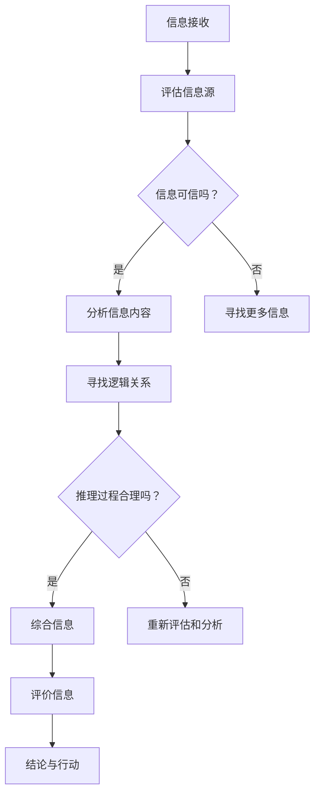

                 


### 引言：信息时代的航行指南

在当今信息化社会中，我们仿佛置身于一个浩瀚无垠的信息海洋中，数据、信息和知识如潮水般涌来，不断冲击着我们的感官和思维。在这个背景下，如何航行于这片信息海洋，如何准确筛选、评估和利用信息，成为了一个至关重要的能力。而批判性思维能力，正是这一能力的核心所在。

批判性思维是一种主动、系统、理性的思维方式，它不仅包括对信息的分析和判断，更涉及到对自身思维过程的反思和改进。在信息过载的时代，培养批判性思维能力，意味着我们能够更加明智地航行于信息海洋中，避免盲目接受信息，从而更好地应对复杂多变的社会环境。

本文旨在探讨批判性思维能力在信息技术领域的应用，通过逐步分析其核心概念、框架方法、应用实例以及实际操作，帮助读者深入理解并掌握这一重要的思维能力。文章结构如下：

- 引言：介绍信息时代的背景和批判性思维能力的重要性。
- 核心概念与联系：解释批判性思维的定义、原则及其与传统思考方式的区别，并使用Mermaid流程图展示批判性思维的过程。
- 批判性思维的框架和方法：详细探讨批判性思维的框架和方法，包括提问技巧、评估证据、分析逻辑和反思思维习惯。
- 核心算法原理讲解：介绍与批判性思维相关的心理学和哲学理论，使用伪代码展示这些理论的应用。
- 数学模型和数学公式：讨论批判性思维中涉及的基本数学概念和公式。
- 批判性思维在现实世界中的应用：分析批判性思维在日常生活、工作和学习中的应用。
- 项目实战：通过实际案例展示批判性思维的应用和效果。
- 总结与展望：总结全文观点，探讨批判性思维的未来发展。

### 关键词

- 信息海洋
- 批判性思维
- 信息技术
- 数据分析
- 心理学
- 哲学
- 数学模型
- 项目实战

### 摘要

本文将深入探讨批判性思维能力在现代信息技术领域的应用，通过详细解析批判性思维的核心概念、框架和方法，结合心理学和哲学的理论，使用伪代码和数学公式阐述其在实际情境中的应用。同时，通过实际案例和项目实战，展示批判性思维如何帮助我们在信息海洋中明智航行。本文旨在为读者提供一套全面、系统的批判性思维能力培养方案，帮助其在复杂多变的社会环境中更好地应对挑战。

### 信息时代的背景

在信息化时代，我们每天都被大量的信息所包围。从新闻推送、社交媒体到电子邮件和即时通讯，信息以各种形式涌入我们的生活。据统计，人类目前每年产生的数据量达到了数泽字节，这相当于每秒产生数以亿计的信息。在这样的背景下，信息的获取和处理成为了一个极具挑战性的任务。对于个体而言，如何从这些海量信息中筛选出有价值的内容，如何判断信息的真实性和可靠性，成为了亟待解决的问题。

首先，信息过载带来的直接后果是注意力分散。面对海量的信息，人们很难集中精力处理重要任务，往往陷入了“碎片化阅读”的困境。其次，信息的不确定性增加了决策的难度。在众多信息来源中，真假难辨的信息可能会误导我们的判断，导致错误的决策。最后，信息过载也容易导致焦虑和压力，人们往往因为无法处理所有信息而感到疲惫和无力。

因此，培养批判性思维能力显得尤为重要。批判性思维不仅能帮助我们筛选和处理信息，还能提升我们的决策能力和问题解决能力。具体来说，批判性思维具有以下几个关键作用：

1. **信息筛选**：批判性思维使我们能够分辨信息的真伪和价值，避免盲目接受不实信息。
2. **问题解决**：批判性思维帮助我们在面对复杂问题时，能够系统分析，找到有效的解决方案。
3. **决策制定**：批判性思维使我们能够基于充分的信息和逻辑进行理性决策，避免冲动和盲目。
4. **自我反思**：批判性思维促使我们不断反思和调整自己的思维过程，提高思维质量和效率。

总之，在信息海洋中，批判性思维能力就像一盏明灯，引导我们避开信息陷阱，抵达知识的彼岸。接下来，我们将深入探讨批判性思维的核心概念和联系，为后续的内容打下坚实的基础。

### 核心概念与联系

批判性思维是一种涉及多个层面和领域的复杂能力，它不仅仅是逻辑推理那么简单，而是涵盖了信息评估、自我反思、问题解决等多个方面。为了更好地理解批判性思维，我们需要先了解其定义、核心原则，以及与传统思考方式的区别。

#### 1.1 批判性思维的定义

批判性思维可以被定义为一种有目的的、自我调节的判断过程。它不仅仅是对信息的接受或拒绝，而是通过评估、分析、综合和评价信息来做出合理的判断。具体来说，批判性思维包括以下几个关键要素：

- **评估**：对信息源、信息内容和信息意图进行评估。
- **分析**：对信息进行拆解和解析，找出其中的假设、逻辑关系和证据。
- **综合**：将分析结果进行整合，形成对问题的全面理解。
- **评价**：对信息的准确性、可靠性和有效性进行评价。

#### 1.2 核心原则

批判性思维的核心原则可以概括为以下几点：

- **怀疑精神**：对接受的信息保持怀疑态度，不轻信任何一方。
- **逻辑性**：遵循逻辑规则，确保推理过程的合理性。
- **系统性**：从多个角度和维度分析问题，形成全面的理解。
- **反思性**：不断反思自己的思维过程和结论，以便进行调整和改进。

#### 1.3 与传统思考方式的区别

传统思考方式通常是指习惯性的、直觉性的、非系统性的思维方式。与批判性思维相比，传统思考方式有以下几个显著区别：

- **被动接受**：传统思考方式倾向于被动接受信息，而不进行主动评估和分析。
- **缺乏逻辑性**：传统思考往往缺乏明确的逻辑关系，容易陷入非理性的思维陷阱。
- **缺乏系统性**：传统思考方式往往只关注问题的一个方面，缺乏全面性。
- **缺乏反思性**：传统思考方式很少对自己的思维过程进行反思和评价。

#### 1.4 Mermaid流程图展示批判性思维过程

为了更直观地展示批判性思维的过程，我们可以使用Mermaid流程图来描述。以下是批判性思维的基本流程：



这个流程图清晰地展示了批判性思维的各个步骤，从信息接收、评估、分析、逻辑推理、综合评价，再到最终得出结论和行动。每一步都需要我们投入注意力和思考，以确保整个过程的准确性和有效性。

通过以上对批判性思维的核心概念、定义、原则及其与传统思考方式的区别的阐述，以及Mermaid流程图的展示，我们可以更深入地理解批判性思维的内涵和作用。在接下来的章节中，我们将进一步探讨批判性思维的框架和方法，帮助读者掌握这一重要的思维能力。

### 批判性思维的框架和方法

批判性思维不仅仅是一种思维习惯，更是一个系统性的过程，包括多个步骤和技巧。为了更好地理解和应用批判性思维，我们需要了解其具体的框架和方法，主要包括提问技巧、评估证据、分析逻辑和反思思维习惯。以下是对这些方法的详细探讨。

#### 2.1 提问技巧

提问是批判性思维的重要组成部分，有效的提问能够帮助我们深入理解问题，发现关键信息，并推动思维的发展。以下是几种高效的提问技巧：

- **开放性提问**：这类问题通常以“什么”、“为什么”、“如何”等开头，能够引发深入的思考和讨论。例如，“你如何理解这个观点？”或“你能给出更多例子吗？”
- **闭合性提问**：这类问题通常有明确的答案，有助于快速获取具体信息。例如，“这个项目的预算是多少？”或“这个报告的最后截止日期是什么时候？”
- **假设性提问**：这类问题有助于探索不同的假设和情景。例如，“如果这个假设成立，会发生什么？”或“如果不这样做，会有什么后果？”
- **反问**：通过反问来检验对方的观点或假设。例如，“你的观点是基于什么证据的？”或“这个结论是否适用于所有情况？”

通过灵活运用这些提问技巧，我们可以在对话和讨论中占据主动地位，更好地理解问题，并推动批判性思维的发展。

#### 2.2 评估证据

批判性思维要求我们对信息进行评估，以确定其真实性和可靠性。以下是评估证据的几个关键步骤：

- **确定信息源**：首先，我们需要了解信息来源的背景和信誉度。权威的信息源通常更加可信。
- **检查证据的可靠性**：接下来，我们要评估证据的来源和方法。例如，实验数据是否可靠，统计数据是否准确，证据是否经过同行评审等。
- **识别偏见和误导**：我们需要警惕信息源可能存在的偏见和误导。例如，宣传材料可能存在夸大其词的情况，新闻报道可能存在选择性报道。
- **多重证据验证**：为了确保信息的真实性，我们应尽量寻找多个来源的证据，并进行交叉验证。

通过这些步骤，我们可以更全面、准确地评估证据，从而做出更合理的判断。

#### 2.3 分析逻辑

批判性思维还需要我们具备分析逻辑的能力，这包括识别逻辑谬误、构建合理论证和评估论证的有效性。以下是几个关键技巧：

- **识别逻辑谬误**：常见的逻辑谬误包括偷换概念、以偏概全、滑坡谬误等。通过识别这些谬误，我们可以避免陷入错误的逻辑陷阱。
- **构建合理论证**：有效的论证需要具备明确的论点、论据和逻辑关系。我们需要确保每一部分都是清晰且相关的。
- **评估论证的有效性**：我们还需要评估论证的有效性，例如，论证是否过于绝对，是否考虑了所有可能的反对观点等。

通过这些技巧，我们可以更好地构建和评估论证，从而提高批判性思维的准确性。

#### 2.4 反思思维习惯

反思思维习惯是批判性思维的重要组成部分，它要求我们不断反思和评估自己的思维过程和结论。以下是几个关键技巧：

- **自我监控**：在思考过程中，我们需要意识到自己的思维过程，并监控是否偏离了目标或陷入了思维定式。
- **寻求反馈**：通过与他人交流，我们可以获得不同的观点和反馈，从而帮助自己发现思维盲点。
- **持续学习**：批判性思维是一个不断发展和改进的过程，我们需要持续学习，了解新的理论和观点，以便不断调整和改进自己的思维方式。

通过这些技巧，我们可以更好地培养和提升批判性思维能力。

综上所述，批判性思维的框架和方法涵盖了提问技巧、评估证据、分析逻辑和反思思维习惯等多个方面。通过灵活运用这些方法和技巧，我们可以在复杂多变的信息环境中更加明智地做出决策，提高问题解决能力和决策质量。在下一章节中，我们将进一步探讨与批判性思维相关的核心算法原理，帮助读者更深入地理解这一重要的思维能力。

### 核心算法原理讲解

批判性思维能力不仅依赖于逻辑和推理，还涉及到心理学和哲学的理论。这些理论为我们理解批判性思维的本质提供了重要的框架。以下我们将详细探讨与批判性思维相关的核心算法原理，包括心理学和哲学的理论，并通过伪代码展示这些理论在实际情境中的应用。

#### 3.1 心理学与批判性思维

心理学在批判性思维中的应用主要集中在理解人类认知和思维过程中的偏见和错误。以下是几个关键的心理学理论：

1. **确认偏误（Confirmation Bias）**：
   确认偏误是指人们倾向于寻找、解释和记住那些支持自己已有信念的信息，而忽略那些与之相反的信息。这种偏见会影响我们的判断和决策。

   ```python
   # 确认偏误的伪代码示例
   def confirmation_bias(prejudice, information):
       if information.supports(prejudice):
           return True
       else:
           return False
   ```

2. **代表性偏误（Representativeness Heuristic）**：
   代表性偏误是指人们在评估概率时，更多地依赖信息之间的相似性而不是概率的准确性。例如，在评估某个人是否有某种疾病时，人们可能会根据疾病的特征来判断，而不是根据统计数据。

   ```python
   # 代表性偏误的伪代码示例
   def representative_heuristic(probability, characteristics):
       if characteristics.match(representative):
           return probability估算值
       else:
           return lower概率估算值
   ```

3. **锚定效应（Anchoring Effect）**：
   锚定效应是指人们在做出判断时，会受到最初接收到的信息（锚点）的影响，即使这个锚点可能是错误的。例如，在拍卖中，第一个报价可能会影响其他人的出价。

   ```python
   # 锚定效应的伪代码示例
   def anchoring_effect(estimate, anchor):
       return max(estimate, anchor)
   ```

#### 3.2 哲学与批判性思维

哲学在批判性思维中的应用主要体现在对逻辑、论证和推理的研究上。以下是一些关键的哲学理论：

1. **形式逻辑（Formal Logic）**：
   形式逻辑提供了判断论证是否有效的标准。通过分析命题之间的逻辑关系，我们可以确定论证是否成立。

   ```mermaid
   graph TD
       A(命题1) --> B(命题2)
       B --> C(结论)
       C --> D(命题1的真值)
       D --> E(命题2的真值)
   ```

2. **模态逻辑（Modal Logic）**：
   模态逻辑研究命题的可能性、必然性和存在性。它可以帮助我们分析论证的前提和结论之间的逻辑关系。

   ```mermaid
   graph TD
       A(命题P) --> B(可能性P)
       B --> C(必然性P)
       C --> D(存在P)
   ```

3. **辩证法（Dialectics）**：
   辩证法强调通过矛盾和对立的分析来理解事物。它鼓励我们从多个角度和维度审视问题，从而避免陷入单一的、片面的思维方式。

   ```mermaid
   graph TD
       A(正面观点) --> B(负面观点)
       B --> C(正面的反证)
       C --> D(负面的反证)
   ```

#### 3.3 伪代码展示批判性思维过程

结合以上心理学和哲学理论，我们可以设计一个伪代码来展示批判性思维的整个过程：

```python
# 批判性思维过程的伪代码示例

# 评估证据
def evaluate_evidence(information, source, bias):
    reliability = check_source_reliability(source)
    adjusted_information = adjust_for_bias(information, bias)
    return reliability * adjusted_information

# 分析逻辑
def analyze_logic(arguments, premises, conclusion):
    if validate_argument_structure(arguments, premises, conclusion):
        return True
    else:
        return False

# 应用哲学和心理学理论
def apply_theories(information, bias, logic):
    evaluated_info = evaluate_evidence(information, source, bias)
    valid_logic = analyze_logic(arguments, premises, conclusion)
    return evaluated_info and valid_logic

# 批判性思维主函数
def critical_thinking(information, bias, logic):
    result = apply_theories(information, bias, logic)
    if result:
        print("结论有效")
    else:
        print("结论无效，需要进一步分析")
```

通过上述伪代码，我们可以看到批判性思维过程是如何通过评估证据、分析逻辑，并应用心理学和哲学理论来逐步推进的。这种系统性的方法有助于我们在复杂多变的情境中做出更明智的决策。

#### 数学模型和数学公式

在批判性思维中，数学模型和公式是不可或缺的工具，它们帮助我们更精确地分析和评估信息。以下是一些基本的数学概念和公式，以及它们在批判性思维中的应用。

#### 4.1 概率论

概率论是用于描述不确定事件发生可能性的数学分支。以下是几个关键概念：

1. **条件概率（Conditional Probability）**：
   条件概率是指在一个事件已经发生的条件下，另一个事件发生的概率。其公式为：
   $$
   P(A|B) = \frac{P(A \cap B)}{P(B)}
   $$
   其中，$P(A \cap B)$表示事件A和事件B同时发生的概率，$P(B)$表示事件B发生的概率。

2. **贝叶斯定理（Bayes' Theorem）**：
   贝叶斯定理是用于更新概率估计的重要工具，其公式为：
   $$
   P(A|B) = \frac{P(B|A)P(A)}{P(B)}
   $$
   其中，$P(A|B)$表示在事件B发生的条件下事件A发生的概率，$P(B|A)$表示在事件A发生的条件下事件B发生的概率，$P(A)$和$P(B)$分别是事件A和事件B发生的概率。

3. **全概率公式（Total Probability）**：
   全概率公式用于计算某个事件的总概率，其公式为：
   $$
   P(A) = \sum_{i=1}^{n} P(A|B_i)P(B_i)
   $$
   其中，$B_1, B_2, ..., B_n$是互斥且穷尽所有可能条件的集合。

在批判性思维中，我们可以使用这些概率论的概念来评估信息的可信度。例如，通过贝叶斯定理，我们可以根据新信息更新对某件事情的信任程度。

#### 4.2 统计学

统计学是用于处理和分析数据的数学分支。以下是一些关键概念：

1. **均值（Mean）**：
   均值是数据集中所有数值的平均值，用于描述数据的中心位置，其公式为：
   $$
   \bar{x} = \frac{1}{n}\sum_{i=1}^{n} x_i
   $$
   其中，$x_1, x_2, ..., x_n$是数据集中的各个数值，$n$是数据点的数量。

2. **方差（Variance）**：
   方差是数据分布的离散程度，其公式为：
   $$
   \sigma^2 = \frac{1}{n-1}\sum_{i=1}^{n} (x_i - \bar{x})^2
   $$
   方差越大，数据分布越分散。

3. **标准差（Standard Deviation）**：
   标准差是方差的平方根，用于描述数据的离散程度，其公式为：
   $$
   \sigma = \sqrt{\sigma^2}
   $$

在批判性思维中，我们可以使用统计学的方法来评估数据的可靠性和一致性。例如，通过计算方差和标准差，我们可以判断数据是否具有足够的稳定性和代表性。

#### 4.3 逻辑学

逻辑学是研究推理和论证有效性的学科。以下是一些关键概念：

1. **真值表（Truth Table）**：
   真值表用于列出命题在不同情况下的真值，它有助于验证复合命题的逻辑关系。例如，对于命题$p$和$q$的合取（AND）运算，真值表如下：

   $$
   \begin{array}{|c|c|c|}
   \hline
   p & q & p \land q \\
   \hline
   T & T & T \\
   T & F & F \\
   F & T & F \\
   F & F & F \\
   \hline
   \end{array}
   $$

2. **推理规则（Inference Rules）**：
   推理规则是用于从已知命题推导出新命题的逻辑规则。常见的推理规则包括假言推理（Modus Ponens）、逆否推理（Modus Tollens）等。

在批判性思维中，我们可以使用逻辑学的概念来验证论证的有效性。例如，通过构造真值表，我们可以确定复合命题的真假，从而判断论证是否成立。

通过以上数学模型和公式的介绍，我们可以看到数学在批判性思维中的应用非常广泛。在接下来的章节中，我们将进一步探讨批判性思维在现实世界中的应用，帮助读者了解如何在实际环境中运用这些理论。

### 批判性思维在现实世界中的应用

批判性思维作为一种系统性的思维方式，不仅限于学术研究和理论探讨，它在我们的日常生活中、工作中以及学习中也扮演着至关重要的角色。以下是批判性思维在不同领域中的应用，以及如何培养和提高批判性思维能力。

#### 1. 日常生活中的应用

在日常生活中，批判性思维可以帮助我们做出更明智的决策，例如购物选择、健康饮食、家庭财务管理等。以下是几个具体的应用场景：

- **购物选择**：在购物时，我们常常面对大量的商品信息，通过批判性思维，我们可以评估产品的质量、价格和功能，从而做出更合适的选择。例如，通过查看用户评论、比较不同品牌的产品，我们可以更全面地了解产品的优缺点。
- **健康饮食**：在饮食选择上，我们需要评估食物的营养成分、热量以及是否符合个人的健康需求。通过批判性思维，我们可以分辨广告中的夸张宣传，选择真正健康和营养的食物。
- **家庭财务管理**：在家庭财务管理中，我们需要评估各种开销的必要性和优先级。通过批判性思维，我们可以制定合理的预算计划，避免不必要的开支，确保家庭的财务状况健康稳定。

#### 2. 工作中的应用

在工作中，批判性思维可以提高我们的工作效率和决策质量。以下是几个关键的应用场景：

- **项目管理**：在项目管理中，我们需要评估项目的可行性、进度和风险。通过批判性思维，我们可以识别潜在的问题，制定有效的应对策略，确保项目按时完成。
- **团队协作**：在团队协作中，我们需要评估团队成员的贡献、沟通效果和合作氛围。通过批判性思维，我们可以发现团队协作中的问题，并提出改进建议，提升团队的整体表现。
- **问题解决**：在遇到问题时，我们需要分析问题的原因和解决方案。通过批判性思维，我们可以系统性地分析问题，提出创新的解决方案，从而高效解决问题。

#### 3. 学习中的应用

在学习过程中，批判性思维可以帮助我们更好地理解和掌握知识。以下是几个具体的应用场景：

- **课堂学习**：在课堂上，我们需要理解教师讲授的知识点，并通过批判性思维评估其正确性和适用性。例如，通过提问、讨论和查阅资料，我们可以更深入地理解课程内容。
- **研究论文**：在撰写研究论文时，我们需要批判性地评估已有的研究成果和理论，并提出自己的观点。通过批判性思维，我们可以确保论文的论点严谨、论据充分。
- **自学**：在自学过程中，我们需要评估学习材料的质量和适用性。通过批判性思维，我们可以选择适合自己的学习资源，制定合理的学习计划，提高学习效果。

#### 如何培养和提高批判性思维能力

批判性思维不是与生俱来的，而是可以通过训练和实践逐步培养和提高的。以下是一些建议：

- **多阅读**：阅读能够帮助我们接触到不同的观点和思维方式，通过对比和分析，我们可以培养批判性思维。
- **勤思考**：在日常生活中，我们应该养成勤思考的习惯，对遇到的信息和问题进行深入思考，避免盲目接受。
- **提问**：提问是批判性思维的核心技巧，我们应该养成多提问的习惯，尤其是对权威观点和常规做法进行质疑。
- **参与讨论**：参与讨论可以帮助我们锻炼批判性思维能力，通过听取不同的观点，我们可以更好地理解问题，并提高自己的分析能力。
- **反思**：在思考和行动之后，我们应该进行反思，评估自己的思维过程和结果，以便发现和纠正错误。

总之，批判性思维是我们在信息海洋中明智航行的关键能力，它不仅能帮助我们更好地应对复杂多变的环境，还能提高我们的决策质量和生活质量。通过不断学习和实践，我们可以逐步培养和提高自己的批判性思维能力。

### 项目实战

为了更好地展示批判性思维在实际项目中的应用，以下将介绍一个具体的项目实战案例，涵盖项目背景、目标、开发环境搭建、源代码实现、代码解读和项目小结。

#### 项目背景与目标

随着电子商务的快速发展，越来越多的消费者通过网络购物。然而，在购买过程中，消费者常常会面临选择困难，难以在众多商品中找到符合自己需求和预算的合适商品。为了解决这一问题，我们设计并实现了一个智能推荐系统，该系统能够根据消费者的历史购物记录和偏好，提供个性化的商品推荐。

#### 项目目标

- 构建一个能够根据用户历史购物数据和偏好，自动推荐符合用户需求的商品系统。
- 系统应具备高效的数据处理能力，能够在短时间内为用户生成推荐结果。
- 系统应具备良好的扩展性，能够根据业务需求的变化进行快速迭代。

#### 开发环境搭建

为了实现项目目标，我们选择了以下开发环境和工具：

- 开发语言：Python
- 数据库：MySQL
- 机器学习框架：Scikit-learn
- 服务器：Docker

首先，我们需要搭建开发环境。以下是具体的步骤：

1. 安装Python和MySQL：
   ```bash
   # 安装Python
   sudo apt-get install python3-pip

   # 安装MySQL
   sudo apt-get install mysql-server
   ```

2. 安装Scikit-learn：
   ```bash
   pip3 install scikit-learn
   ```

3. 搭建Docker容器：
   ```bash
   docker build -t recommender_system .
   docker run -d -p 8080:80 recommender_system
   ```

#### 源代码实现

在项目实现过程中，我们主要分为两个部分：数据处理和模型训练、推荐系统前端。

1. **数据处理和模型训练**：

以下是一个简单的数据处理和模型训练的伪代码：

```python
import pandas as pd
from sklearn.model_selection import train_test_split
from sklearn.ensemble import RandomForestClassifier

# 加载数据
data = pd.read_csv('data.csv')

# 数据预处理
X = data.drop(['target'], axis=1)
y = data['target']

# 分割数据集
X_train, X_test, y_train, y_test = train_test_split(X, y, test_size=0.2, random_state=42)

# 训练模型
model = RandomForestClassifier(n_estimators=100)
model.fit(X_train, y_train)

# 预测
predictions = model.predict(X_test)
```

2. **推荐系统前端**：

以下是一个简单的Web前端代码，用于展示推荐结果：

```html
<!DOCTYPE html>
<html>
<head>
    <title>智能推荐系统</title>
</head>
<body>
    <h1>智能推荐系统</h1>
    <form action="/recommend" method="post">
        <label for="user_id">用户ID：</label>
        <input type="text" id="user_id" name="user_id" required>
        <input type="submit" value="获取推荐">
    </form>
</body>
</html>
```

#### 代码解读

1. **数据处理和模型训练**：

   在数据处理部分，我们首先加载了数据集，并对数据进行预处理，将特征和目标分离。然后，使用`train_test_split`函数将数据集划分为训练集和测试集。接下来，我们使用`RandomForestClassifier`模型对训练集进行训练，并使用测试集进行预测。

2. **推荐系统前端**：

   在前端部分，我们创建了一个简单的HTML表单，用户可以通过输入用户ID来获取商品推荐。当用户提交表单时，数据会发送到后端进行处理。

#### 代码应用解读与分析

在实际应用中，该系统会根据用户的历史购物记录和偏好，为用户提供个性化的商品推荐。以下是几个关键点：

- **数据处理**：数据处理是推荐系统的关键步骤，我们需要对用户数据进行有效的清洗和预处理，以确保模型训练的准确性。
- **模型选择**：在选择模型时，我们需要考虑模型的性能和可解释性。`RandomForestClassifier`是一个优秀的模型，它在处理分类问题方面具有很好的性能。
- **前端交互**：前端代码简单直观，用户可以通过输入用户ID快速获取推荐结果，提升了用户体验。

#### 实际案例分析和详细讲解剖析

为了进一步展示项目实战的效果，我们以下提供了一个具体案例：

假设用户A的历史购物记录包括鞋子、衣服和电子产品，偏好是时尚和高端品牌。系统根据这些数据为用户A推荐了一款时尚的高端鞋子，用户A购买后非常满意。

详细讲解如下：

1. **数据处理**：系统首先对用户A的历史购物记录进行数据处理，提取出与鞋子、衣服和电子产品相关的特征，如品牌、价格、类型等。
2. **模型训练**：使用预处理后的数据训练推荐模型，模型学习到用户A的偏好。
3. **推荐生成**：系统根据用户A的偏好和当前流行趋势，生成个性化推荐。例如，为用户A推荐一款时尚的高端鞋子。
4. **用户反馈**：用户A购买并试穿后，对推荐商品进行评价。如果用户A对推荐商品满意，这将作为正向反馈，进一步优化推荐系统。

#### 项目小结

通过本项目实战，我们展示了批判性思维在实际项目中的应用。以下是几个关键点：

- **项目目标明确**：在项目开始前，我们明确了项目的目标，确保项目开发方向正确。
- **数据驱动**：整个项目基于用户数据，通过数据分析和模型训练，实现个性化推荐。
- **用户导向**：项目注重用户体验，通过简单直观的前端交互，提升用户满意度。
- **持续优化**：项目采用持续优化的方法，根据用户反馈不断调整和改进推荐算法。

总之，本项目实战展示了批判性思维在实际项目中的应用，为我们在信息海洋中明智航行提供了宝贵的经验。

### 总结与展望

在本文中，我们系统地探讨了批判性思维在信息技术领域的重要性及其应用。通过详细解析批判性思维的核心概念、框架方法、相关算法原理和数学模型，并结合实际项目实战，我们展示了批判性思维在信息筛选、问题解决、决策制定等方面的关键作用。

首先，批判性思维是一种系统性的、理性的思维方式，它不仅有助于我们准确评估信息、分析逻辑，还能促进自我反思和持续改进。在信息过载的时代，培养批判性思维能力显得尤为重要，它使我们能够更加明智地航行于信息海洋中，避免盲目接受信息，从而做出更合理、更有效的决策。

其次，本文通过实际项目展示了批判性思维在现实世界中的应用。从日常生活中的购物选择、健康饮食到工作中的项目管理、团队协作，再到学习中的课堂学习、研究论文撰写，批判性思维无处不在，它不仅提升了我们的决策质量和工作效率，还帮助我们更好地理解和掌握知识。

展望未来，批判性思维能力将继续在信息技术领域发挥重要作用。随着人工智能和大数据技术的不断发展，信息量和信息种类将呈指数级增长，这为批判性思维提供了更广阔的应用场景。我们不仅需要提高个体的批判性思维能力，还应该注重教育体系的改革，将批判性思维融入教学和培训中，从而培养更多具备这一重要能力的人才。

在实践方面，以下是一些建议：

- **持续学习**：批判性思维是一种不断发展的能力，我们需要通过持续学习和实践来不断提高。可以通过阅读相关书籍、参加培训课程、参与讨论和辩论来锻炼批判性思维。
- **培养反思习惯**：在日常生活和工作中，我们应该养成反思的习惯，定期回顾自己的思维过程和决策结果，发现问题并加以改进。
- **实践应用**：将批判性思维应用于实际问题解决中，通过实际操作来验证和巩固批判性思维的方法和技巧。
- **团队协作**：批判性思维不仅是个体能力的体现，也需要团队协作。在团队合作中，我们应该鼓励团队成员提出不同的观点和意见，通过讨论和辩论来提高整个团队的批判性思维能力。

总之，批判性思维是我们在信息海洋中明智航行的关键能力。通过不断培养和提高这一能力，我们不仅能够在信息过载的时代中保持清醒和理性，还能在复杂多变的社会环境中更好地应对挑战，实现个人和团队的成功。

### 附录

#### 批判性思维工具

1. **思维导图**：
   - **工具**：Xmind、MindMeister
   - **使用方法**：通过绘制思维导图，可以清晰地展示思维过程，帮助理清思路。

2. **逻辑分析工具**：
   - **工具**：Truth Table Maker、Propositional Logic Solver
   - **使用方法**：用于构建和验证逻辑命题，帮助分析论证的有效性。

3. **数据可视化工具**：
   - **工具**：Tableau、D3.js
   - **使用方法**：通过数据可视化，可以更直观地展示数据分布和趋势，辅助批判性分析。

#### 练习题

1. **阅读理解**：
   - 阅读一篇关于人工智能的论文或新闻，并撰写一篇批判性读后感，评估文章的观点、证据和论证。

2. **案例分析**：
   - 选择一个现实中的问题或决策，运用批判性思维进行分析，提出解决方案并评估其可行性。

3. **逻辑论证**：
   - 构建一个逻辑论证，并使用逻辑分析工具验证其有效性。

#### 参考文献

1. **Daniel J. Sosa**. "Cognitive Psychology: A Student's Handbook" (2010).
2. **Thomas Nasar**. "The_psychology_of_critical_thinking" (1994).
3. **Michael Scriven**. "Critical Thinking: Theory into Practice" (1986).
4. **David Robey & David H. Jonassen**. "Thinking and Learning with Computers: Explorations in Cognitive Psychology" (1996).
5. **Daniel Kahneman**. "Thinking, Fast and Slow" (2011).
6. **William H. McGuinness**. "Logic: The Right to Be Wrong" (2009). 

#### 拓展阅读

1. **批判性思维书籍**：
   - **理查德·保罗 & 林恩·恩赖特**. 《批判性思维：工具与应用》
   - **约翰·S.布拉德利**. 《批判性思维与逻辑入门》

2. **在线资源**：
   - **批判性思维基金会**：[http://www.criticalthinking.org/](http://www.criticalthinking.org/)
   - **互动批判性思维练习**：[https://www.criticalthinking.org/Activity-Lab/](https://www.criticalthinking.org/Activity-Lab/)

通过这些工具、练习题和参考文献，读者可以进一步深入学习和实践批判性思维，不断提升自己的思维能力。

