                 


### 文章标题：《倾听内心的指引：培养直觉的能力》

### 关键词：直觉、意识、自我认知、冥想、放松技巧

### 摘要：

本文旨在探讨直觉的力量及其培养方法。我们将从背景介绍出发，深入分析直觉的核心概念，并通过Mermaid流程图展示其与意识的关系。随后，我们将详细讲解直觉算法原理，使用伪代码和数学公式来阐述其实现细节。文章还将介绍冥想和放松技巧等实践方法，并通过案例研究来展示直觉在生活中的应用。最后，我们将总结直觉能力的提升策略，探讨其与心理学的关系，并给出项目实战和最佳实践建议。

### 第1章 引言：直觉的力量

直觉是人类思维的一种独特能力，它超越逻辑推理，直接洞察事物的本质。直觉在人类生活中起着至关重要的作用，从日常决策到复杂问题的解决，都离不开直觉的参与。然而，直觉是如何产生的？它如何与意识相互作用？这些问题至今仍困扰着学术界。

本章将首先介绍直觉的重要性，阐述直觉与意识的关系，并简要介绍本书的结构和目标。通过本章的阅读，读者将初步了解直觉的神秘世界，为后续章节的深入探讨打下基础。

#### 1.1 直觉的重要性

直觉在人类认知中具有独特的地位。一方面，直觉能够迅速地处理大量信息，帮助我们在复杂环境中做出快速决策。例如，在紧急情况下，直觉能迅速评估情况并采取行动，这对于生存至关重要。另一方面，直觉还能够揭示逻辑思维难以触及的深层信息，帮助我们发现问题的本质。

直觉的重要性不仅体现在个人层面，也在社会层面有着广泛的应用。在商业决策、科学发现、艺术创作等领域，直觉都发挥着不可替代的作用。因此，培养和提高直觉能力对于个人和社会发展都具有重要意义。

#### 1.2 直觉与意识的关系

直觉与意识紧密相连。意识是我们对外界和内在体验的感知和理解，而直觉则是意识的一部分，它直接感知和解释信息。直觉的产生机制涉及多个层面，包括潜意识、情绪和经验等。

以下是一个简单的Mermaid流程图，展示直觉与意识的关系：

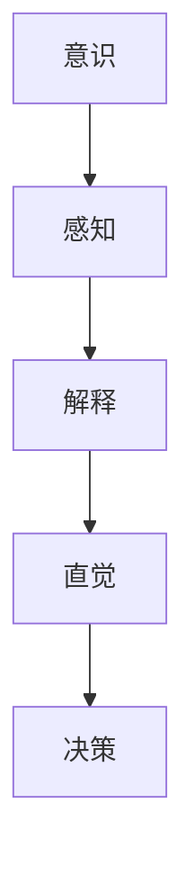

在这个流程图中，意识首先感知外部和内部的信息，然后通过解释这些信息产生直觉，最终指导我们的决策行为。

#### 1.3 本书目标与结构

本书旨在帮助读者深入了解直觉的力量，并提供实用的方法来培养和提高直觉能力。本书共分为七个章节，包括：

1. 引言：直觉的力量
2. 直觉的基础理论
3. 培养直觉的实践方法
4. 直觉在生活中的应用
5. 直觉能力的提升策略
6. 直觉与心理学
7. 总结与反思

通过这七个章节的阅读，读者将全面了解直觉的各个方面，掌握培养和提高直觉能力的技巧。

### 第2章 直觉的基础理论

在深入探讨直觉的奥秘之前，我们需要先了解一些核心概念，如直觉的定义、直觉与逻辑思维的关系、意识与直觉的互动等。这些概念构成了直觉的基础理论，为我们理解直觉的本质提供了框架。

#### 2.1 直觉的定义

直觉是一种无意识的思维过程，它基于经验、情感和潜意识，能够迅速地识别和理解复杂的信息。直觉不同于逻辑思维，它不是通过推理和证明来得出结论，而是通过一种直接的理解和感知。

以下是直觉的定义的伪代码：

```python
def define_intuition():
    """
    定义直觉
    
    直觉：一种无意识的思维过程，基于经验、情感和潜意识，
    能够迅速地识别和理解复杂的信息。
    """
    intuition = "a process of unconscious thinking that relies on experience, emotion, and subconscious perception, enabling rapid identification and understanding of complex information."
    return intuition
```

#### 2.2 直觉与逻辑思维

直觉与逻辑思维是两种不同的认知方式。逻辑思维是基于逻辑规则和推理过程的，它强调通过逐步分析和证明来得出结论。而直觉则是一种直接的感知和理解，它往往不需要经过逻辑推理就能得出结论。

直觉与逻辑思维的关系可以用以下Mermaid流程图来表示：

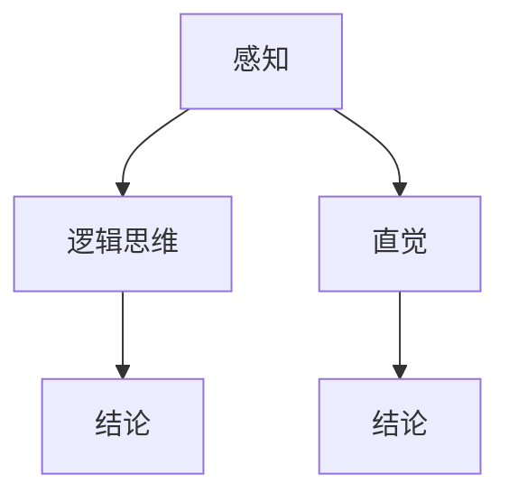

在这个流程图中，感知信息可以通过逻辑思维和直觉两种方式处理，最终得出结论。逻辑思维强调分析和证明，而直觉则强调直接理解和感知。

#### 2.3 意识与直觉的互动

直觉的产生离不开意识。意识是我们对外界和内在体验的感知和理解，它是直觉的基础。然而，直觉与意识的关系并非简单的单向作用，它们之间存在复杂的互动。

以下是意识与直觉互动的伪代码：

```python
def interaction_between_awareness_and_intuition():
    """
    意识与直觉的互动
    
    意识与直觉之间的互动包括：
    1. 意识感知信息，为直觉提供基础。
    2. 直觉指导意识做出决策。
    """
    awareness = "the perception and understanding of external and internal experiences."
    intuition = "a direct perception and understanding of complex information without logical reasoning."
    
    interaction = """
    Interaction between awareness and intuition:
    1. Awareness perceives information, providing the foundation for intuition.
    2. Intuition guides awareness in decision-making.
    """
    return interaction
```

#### 2.4 直觉的产生机制

直觉的产生机制是一个复杂的过程，涉及到多个层面。以下是直觉产生机制的详细解释：

1. **潜意识：** 直觉往往来自于潜意识，这是我们的思维活动中未被意识到的部分。潜意识中储存了大量的经验、知识和情感，它们在直觉中起着关键作用。

2. **情感：** 情感是直觉的重要驱动力。当我们面临某种情境时，情感会直接影响我们的直觉判断。例如，当我们感受到恐惧或喜悦时，我们的直觉往往更倾向于采取行动。

3. **经验：** 经验是直觉的重要来源。我们的直觉往往基于过去的经验和知识。例如，一个熟练的医生能够通过直觉快速识别病人的病情，这是基于多年的临床经验和观察。

4. **大脑机制：** 直觉的产生还涉及到大脑的特定区域，如前额叶皮层和顶叶。这些区域负责处理复杂的认知任务，并在直觉判断中起着关键作用。

以下是直觉产生机制的Mermaid流程图：

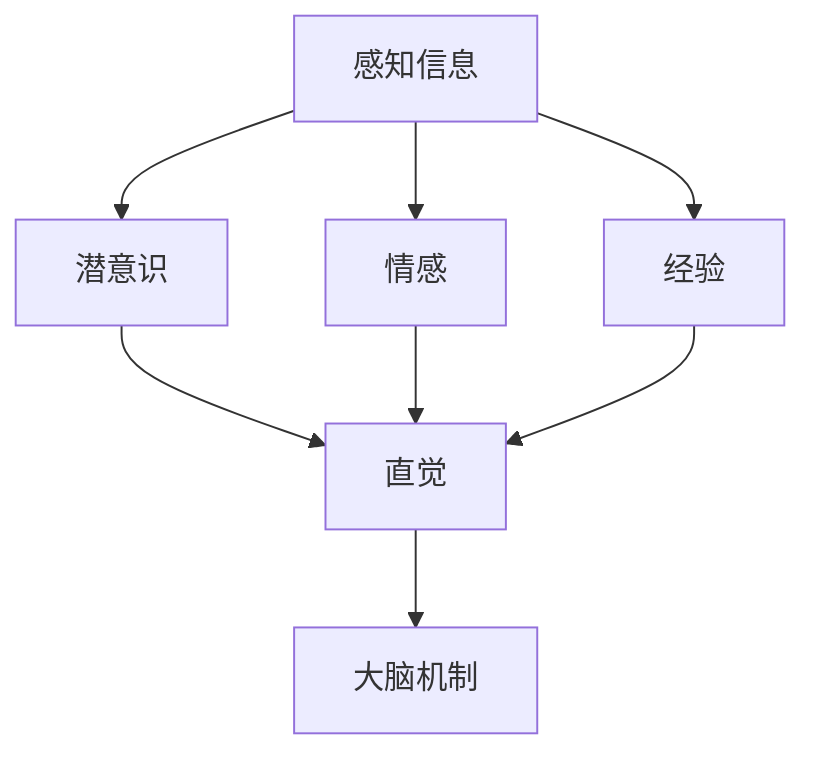

在这个流程图中，感知信息通过潜意识、情感和经验三个层面作用于直觉，最终产生直觉判断。大脑机制在这个过程中起着调节和整合的作用。

#### 2.5 直觉能力的测量

直觉能力是一个复杂的概念，难以用量化的方法来测量。然而，研究人员已经开发出一些方法来评估直觉能力。

以下是几种常见的直觉能力测量方法：

1. **直觉测验：** 直觉测验是一种标准化的测试，旨在评估个人的直觉能力。这些测验通常包括一系列问题，要求受试者在短时间内做出决策。

2. **反应时测试：** 反应时测试通过测量受试者在特定任务中的反应时间来评估直觉能力。直觉能力较强的人往往能在较短的时间内做出决策。

3. **行为观察：** 行为观察是一种通过观察个人在真实情境中的行为来评估直觉能力的方法。这种方法能够更准确地反映直觉在现实生活中的应用。

以下是一个简单的Mermaid流程图，展示直觉能力测量的过程：

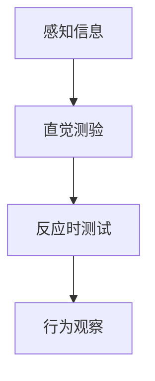

在这个流程图中，直觉能力通过多种方法进行测量，包括直觉测验、反应时测试和行为观察。

### 第3章 培养直觉的实践方法

要培养和提高直觉能力，我们需要采取一系列实践方法。这些方法包括冥想、放松技巧和日常练习等。本章将详细探讨这些实践方法，并提供具体的技巧和案例。

#### 3.1 冥想与直觉

冥想是一种古老的实践方法，它通过静坐和专注呼吸来训练意识，提高直觉能力。冥想能够帮助我们放松身心，减少压力，从而增强直觉。

以下是一个简单的冥想技巧的伪代码：

```python
def meditation_technique():
    """
    冥想技巧
    
    冥想技巧包括：
    1. 选择一个安静的环境。
    2. 采取舒适的坐姿。
    3. 专注于呼吸，感受每一次吸气和呼气。
    4. 当思维散乱时，将注意力重新集中在呼吸上。
    """
    meditation_steps = """
    Meditation technique includes:
    1. Choose a quiet environment.
    2. Sit in a comfortable position.
    3. Focus on your breath, feeling each inhalation and exhalation.
    4. When your mind wanders, redirect your attention back to your breath.
    """
    return meditation_steps
```

#### 3.1.1 冥想的基本原理

冥想的基本原理是通过专注和放松来训练意识，提高对内心世界的感知能力。以下是冥想基本原理的Mermaid流程图：

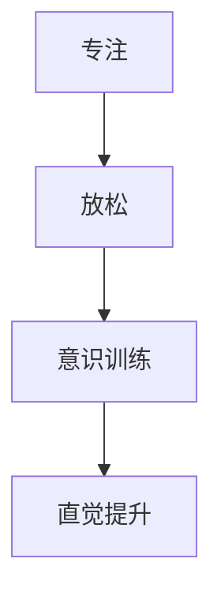

在这个流程图中，专注和放松是冥想的关键步骤，它们共同作用，提高意识训练，从而增强直觉。

#### 3.1.2 冥想技巧

冥想技巧多种多样，以下是一些常见的冥想技巧：

1. **呼吸冥想：** 通过专注于呼吸来训练意识，这是最简单的冥想技巧。具体步骤如下：
   - 选择一个安静的环境。
   - 采用舒适的坐姿，保持背部挺直。
   - 专注于呼吸，感受每一次吸气和呼气。
   - 当思维散乱时，将注意力重新集中在呼吸上。

2. **正念冥想：** 正念冥想是一种强调当下意识的冥想技巧。具体步骤如下：
   - 选择一个安静的环境。
   - 采用舒适的坐姿，保持背部挺直。
   - 专注于当前的体验，包括身体感觉、情绪和思绪。
   - 当思维散乱时，将注意力重新集中在当前体验上。

3. **瑜伽冥想：** 瑜伽冥想结合了瑜伽体式和冥想，有助于提高身体和意识的协调性。具体步骤如下：
   - 选择一个安静的环境。
   - 采用舒适的坐姿，保持背部挺直。
   - 进行几个瑜伽体式，如猫牛式、三角式等。
   - 在每个体式中保持一段时间，专注于呼吸和身体感觉。
   - 结束体式后，进行呼吸冥想。

以下是一个简单的正念冥想技巧的伪代码：

```python
def mindfulness_meditation():
    """
    正念冥想技巧
    
    正念冥想技巧包括：
    1. 选择一个安静的环境。
    2. 采用舒适的坐姿，保持背部挺直。
    3. 专注于当前的体验，包括身体感觉、情绪和思绪。
    4. 当思维散乱时，将注意力重新集中在当前体验上。
    """
    mindfulness_steps = """
    Mindfulness meditation technique includes:
    1. Choose a quiet environment.
    2. Sit in a comfortable position, keeping your back straight.
    3. Focus on your current experience, including physical sensations, emotions, and thoughts.
    4. When your mind wanders, redirect your attention back to your current experience.
    """
    return mindfulness_steps
```

#### 3.1.3 冥想实践案例

以下是一个冥想实践案例，用于培养直觉能力：

**案例：**
张先生是一位忙碌的职场人士，他经常感到压力巨大，直觉能力较弱。为了提高直觉能力，他开始每天进行冥想练习。

**步骤：**
1. 张先生选择了一个安静的环境，保持舒适的坐姿，背部挺直。
2. 他专注于呼吸，感受每一次吸气和呼气，当思维散乱时，将注意力重新集中在呼吸上。
3. 每天进行30分钟的冥想练习，逐渐增加时间。
4. 在冥想过程中，张先生开始感受到内心的平静，他的直觉能力逐渐提升。

**结果：**
经过一段时间的冥想练习，张先生感到自己的压力减轻了，直觉能力也得到了显著提升。他开始能够更准确地感知和理解复杂的信息，提高了决策能力。

#### 3.2 放松技巧与直觉

除了冥想，放松技巧也是培养直觉的重要方法。放松技巧通过减轻身体和心理的紧张，提高直觉的敏感性。

以下是一个简单的放松技巧的伪代码：

```python
def relaxation_technique():
    """
    放松技巧
    
    放松技巧包括：
    1. 深呼吸。
    2. 肌肉放松。
    3. 放松音乐或自然声音的辅助。
    """
    relaxation_steps = """
    Relaxation technique includes:
    1. Deep breathing.
    2. Muscle relaxation.
    3. Assistance from relaxation music or natural sounds.
    """
    return relaxation_steps
```

#### 3.2.1 放松技巧的重要性

放松技巧对于提高直觉能力至关重要。当我们的身体和心理处于紧张状态时，直觉的敏感性会降低。通过放松技巧，我们能够减轻身体和心理的紧张，提高直觉的敏感性。

以下是放松技巧重要性的Mermaid流程图：

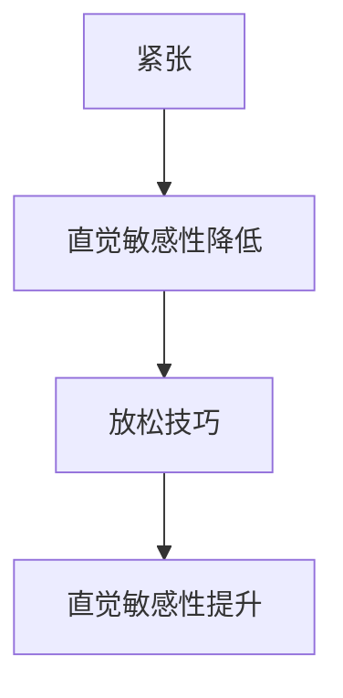

在这个流程图中，紧张状态导致直觉敏感性降低，而放松技巧能够提升直觉敏感性。

#### 3.2.2 常见的放松技巧

以下是一些常见的放松技巧：

1. **深呼吸：** 通过深呼吸来放松身体和心灵。具体步骤如下：
   - 采用舒适的坐姿或躺姿。
   - 慢慢地深吸气，感受腹部升起。
   - 慢慢地深呼气，感受腹部下降。
   - 重复几次，直到感到放松。

2. **肌肉放松：** 通过逐步放松身体各个部位的肌肉来达到放松效果。具体步骤如下：
   - 采用舒适的坐姿或躺姿。
   - 从脚部开始，逐渐向上放松身体的各个部位的肌肉。
   - 感受肌肉的紧张和放松，直到全身放松。

3. **放松音乐或自然声音：** 通过听放松音乐或自然声音来放松身心。具体步骤如下：
   - 选择一首放松音乐或自然声音。
   - 在安静的环境中播放。
   - 专注于音乐或自然声音，感受放松的感觉。

以下是一个简单的肌肉放松技巧的伪代码：

```python
def muscle_relaxation_technique():
    """
    肌肉放松技巧
    
    肌肉放松技巧包括：
    1. 采用舒适的坐姿或躺姿。
    2. 从脚部开始，逐渐向上放松身体的各个部位的肌肉。
    3. 感受肌肉的紧张和放松，直到全身放松。
    """
    muscle_relaxation_steps = """
    Muscle relaxation technique includes:
    1. Sit or lie in a comfortable position.
    2. Start from your feet and gradually relax the muscles in each part of your body.
    3. Feel the tension and relaxation in your muscles until you are fully relaxed.
    """
    return muscle_relaxation_steps
```

#### 3.2.3 放松技巧实践案例

以下是一个放松技巧实践案例，用于培养直觉能力：

**案例：**
李女士是一位忙碌的职场女性，她经常感到压力巨大，直觉能力较弱。为了提高直觉能力，她开始每天进行放松技巧练习。

**步骤：**
1. 李女士选择了一个安静的环境，保持舒适的坐姿。
2. 她开始进行深呼吸，感受每一次吸气和呼气。
3. 接着，她进行肌肉放松，从脚部开始，逐渐向上放松身体的各个部位的肌肉。
4. 最后，她播放了一首放松音乐，专注于音乐，感受放松的感觉。
5. 每天进行30分钟的放松练习，逐渐增加时间。

**结果：**
经过一段时间的放松技巧练习，李女士感到自己的压力减轻了，直觉能力也得到了显著提升。她开始能够更准确地感知和理解复杂的信息，提高了决策能力。

### 第4章 直觉在生活中的应用

直觉在生活中的应用广泛而深远。无论是在职场、家庭还是社交场合，直觉都能为我们提供宝贵的洞察力和决策支持。本章将探讨直觉在生活中的具体应用，并通过案例研究来展示直觉的实际价值。

#### 4.1 职场直觉应用

在职场中，直觉发挥着重要作用，从领导决策到员工日常工作的执行，直觉都能提供宝贵的指导。

**4.1.1 直觉决策**

直觉决策是职场中的一种重要能力。在面对复杂和不确定性时，直觉能够快速提供决策方向。以下是一个直觉决策的案例：

**案例：**
王经理在一家科技公司负责新产品的市场推广。在一次市场调研中，他感受到客户对某项功能有强烈需求，尽管数据分析并未显示这一趋势。最终，他决定优先开发这一功能，而事实证明这个决策是正确的，产品因此获得了市场认可。

**4.1.2 直觉沟通**

直觉在沟通中也具有重要意义。通过直觉，我们可以更准确地理解他人的意图和情感，从而更有效地进行沟通。以下是一个直觉沟通的案例：

**案例：**
张女士是一位优秀的项目经理，她能够敏锐地感知团队成员的情绪变化。在一次项目会议上，她注意到一名团队成员显得焦虑，通过直觉判断，她及时安排了一次私下的沟通，解决了这名成员的困扰，确保了项目的顺利进行。

**4.1.3 职场直觉案例**

以下是一个详细的职场直觉案例，展示直觉在职场中的实际应用：

**案例：**
李总是一家互联网公司的创始人，他在公司发展中面临众多挑战。在一次关键投资决策前，他感受到市场的潜在风险，尽管数据分析和专家意见都支持投资，但他的直觉告诉他不应贸然行动。最终，市场发生了剧烈波动，他的直觉决策挽救了公司的资金。

**步骤：**
1. 李总在会议前进行了冥想，以放松身心，提高直觉敏感性。
2. 在听取各方意见后，他依赖直觉进行决策，决定不立即投资。
3. 市场波动后，公司避免了重大损失。

**结果：**
李总的直觉决策不仅避免了公司的资金损失，还增强了团队对他的信任和尊重，提升了公司的决策质量。

#### 4.2 生活直觉应用

直觉在日常生活中也扮演着重要角色，从家庭关系到社交场合，直觉都能帮助我们做出更明智的选择。

**4.2.1 家庭关系中的直觉**

在家庭关系中，直觉能够帮助我们更好地理解家人的需求和情感。以下是一个家庭关系直觉应用的案例：

**案例：**
陈先生是一位家庭主夫，他通过直觉感知到妻子对家庭的担忧。他主动与妻子沟通，了解她的想法，并提出了一些切实可行的解决方案，从而改善了家庭关系。

**4.2.2 社交场合的直觉**

在社交场合，直觉能帮助我们识别他人的真实意图，避免潜在的冲突。以下是一个社交场合直觉应用的案例：

**案例：**
张女士在一次商务活动中遇到了一位看似友善的商人。她通过直觉判断这位商人可能存在欺骗行为，因此谨慎行事，最终避免了投资损失。

**4.2.3 生活直觉案例**

以下是一个详细的生活直觉案例，展示直觉在日常生活中的应用：

**案例：**
赵女士是一位心理咨询师，她通过直觉帮助许多来访者解决了心理困扰。在一次咨询中，她感受到一名来访者隐藏着未被察觉的痛苦，通过深入的沟通和直觉引导，她帮助来访者找到了问题的根源，并取得了显著的改善。

**步骤：**
1. 赵女士在咨询前进行了冥想，以放松身心，提高直觉敏感性。
2. 在与来访者沟通时，她依赖直觉，引导来访者探索内心世界。
3. 通过直觉引导，来访者找到了问题的根源，并获得了心理上的释放。

**结果：**
赵女士的直觉帮助多名来访者解决了心理困扰，提升了她的咨询效果，也为她的职业生涯带来了巨大的成功。

### 第5章 直觉能力的提升策略

要提升直觉能力，我们需要采取一系列策略，这些策略包括自我认知、日常练习和特定技巧等。本章将详细探讨这些策略，并提供具体的实施方法。

#### 5.1 自我认知与直觉

自我认知是提升直觉能力的基础。通过深入了解自己，我们能够更好地理解自己的直觉，并发挥其最大潜力。

以下是一个自我认知与直觉提升的伪代码：

```python
def self_awareness_and_intuition():
    """
    自我认知与直觉提升
    
    自我认知与直觉提升包括：
    1. 反思个人经历。
    2. 观察内心世界。
    3. 记录直觉体验。
    """
    self_awareness_steps = """
    Self-awareness and intuition improvement include:
    1. Reflect on personal experiences.
    2. Observe your inner world.
    3. Record your intuition experiences.
    """
    return self_awareness_steps
```

#### 5.1.1 自我认知的重要性

自我认知的重要性在于，它帮助我们了解自己的思维模式、情感反应和行为习惯。通过自我认知，我们能够更好地识别自己的直觉，并在生活中发挥其作用。

以下是自我认知重要性的Mermaid流程图：

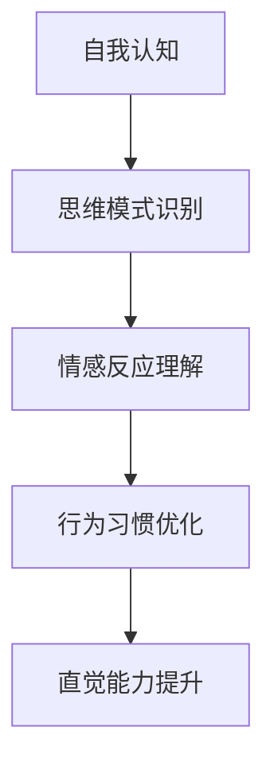

在这个流程图中，自我认知帮助我们识别思维模式、理解情感反应和优化行为习惯，从而提升直觉能力。

#### 5.1.2 自我认知与直觉提升

自我认知与直觉提升的关系密切。通过自我认知，我们能够更好地了解自己的直觉，并在日常生活中有意识地培养和提高直觉能力。以下是一些具体的方法：

1. **反思个人经历：** 通过反思个人经历，我们可以识别出那些依赖直觉做出正确决策的时刻，从而加深对直觉的理解。

2. **观察内心世界：** 观察内心世界有助于我们了解自己的情感和思维状态，从而更好地引导直觉。

3. **记录直觉体验：** 记录直觉体验可以帮助我们回顾和分析直觉的作用，从而不断提高直觉能力。

以下是一个简单的自我认知与直觉提升的伪代码：

```python
def self_awareness_and_intuition_improvement():
    """
    自我认知与直觉提升
    
    自我认知与直觉提升包括：
    1. 反思个人经历。
    2. 观察内心世界。
    3. 记录直觉体验。
    """
    steps = """
    Steps for self-awareness and intuition improvement:
    1. Reflect on personal experiences that involve intuition.
    2. Observe your inner thoughts and emotions.
    3. Record your intuition experiences and analyze them.
    """
    return steps
```

#### 5.2 直觉训练方法

除了自我认知，直觉训练方法也是提升直觉能力的重要途径。直觉训练方法包括冥想、放松技巧和情境模拟等。

以下是一个直觉训练方法的伪代码：

```python
def intuition_training():
    """
    直觉训练方法
    
    直觉训练方法包括：
    1. 冥想。
    2. 放松技巧。
    3. 情境模拟。
    """
    training_methods = """
    Intuition training methods include:
    1. Meditation.
    2. Relaxation techniques.
    3. Situational simulation.
    """
    return training_methods
```

#### 5.2.1 直觉训练的基本原则

直觉训练的基本原则包括：

1. **持续练习：** 直觉能力的提升需要持续不断的练习。通过日常的冥想、放松技巧和情境模拟，我们能够逐渐提高直觉的敏感性。

2. **专注训练：** 在直觉训练过程中，我们需要专注于当前的任务和情境，减少干扰，从而更好地发挥直觉。

3. **反思与调整：** 在训练过程中，我们需要不断反思自己的直觉判断，识别错误和不足，并进行调整。

以下是直觉训练基本原则的Mermaid流程图：

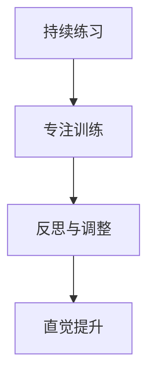

在这个流程图中，持续练习、专注训练和反思与调整是提升直觉能力的三个关键步骤。

#### 5.2.2 直觉训练技巧

以下是一些具体的直觉训练技巧：

1. **冥想：** 冥想是提升直觉能力的重要方法。通过冥想，我们能够放松身心，提高意识的敏感性，从而更好地捕捉直觉。

2. **放松技巧：** 放松技巧有助于减轻身体和心理的紧张，提高直觉的敏感性。常见的放松技巧包括深呼吸、肌肉放松和放松音乐等。

3. **情境模拟：** 情境模拟是一种通过模拟实际情境来训练直觉的方法。通过在模拟情境中练习，我们能够提高直觉的准确性和反应速度。

以下是一个简单的直觉训练技巧的伪代码：

```python
def intuition_training_techniques():
    """
    直觉训练技巧
    
    直觉训练技巧包括：
    1. 冥想。
    2. 放松技巧。
    3. 情境模拟。
    """
    techniques = """
    Intuition training techniques include:
    1. Meditation.
    2. Relaxation techniques.
    3. Situational simulation.
    """
    return techniques
```

#### 5.2.3 直觉训练案例

以下是一个直觉训练案例，展示直觉训练的具体实施方法：

**案例：**
李先生是一位企业家，他希望通过直觉训练提高决策能力。他决定采用以下方法进行直觉训练：

**步骤：**
1. **冥想：** 每天早晨进行20分钟的冥想，放松身心，提高意识敏感性。
2. **放松技巧：** 每天晚上进行深呼吸和肌肉放松，减轻身体和心理的紧张。
3. **情境模拟：** 每周进行一次情境模拟，模拟实际决策场景，练习直觉判断。

**结果：**
经过一段时间的直觉训练，李先生感到自己的决策能力显著提升。他在面对复杂问题时能够更迅速地做出正确决策，提高了企业的运营效率。

### 第6章 直觉与心理学

直觉与心理学密不可分。心理学研究直觉，试图理解其产生机制和作用方式。本章将探讨直觉与心理学的关系，包括直觉与潜意识、认知心理学等领域的关联。

#### 6.1 直觉与潜意识

直觉与潜意识有着紧密的联系。潜意识是我们未被意识到的思维和情感，它在直觉中起着关键作用。以下是直觉与潜意识关系的伪代码：

```python
def intuition_and_subconscious():
    """
    直觉与潜意识
    
    直觉与潜意识的关系包括：
    1. 潜意识存储经验。
    2. 潜意识驱动直觉。
    3. 直觉揭示潜意识信息。
    """
    relationship = """
    The relationship between intuition and the subconscious includes:
    1. The subconscious stores experiences.
    2. The subconscious drives intuition.
    3. Intuition reveals subconscious information.
    """
    return relationship
```

#### 6.1.1 潜意识的概念

潜意识是我们心理活动的一部分，它存储了大量的经验、知识和情感。潜意识与意识不同，它是未被我们直接意识到的。然而，潜意识对直觉有着深远的影响，它通过直觉揭示我们的内心世界。

以下是潜意识概念的Mermaid流程图：

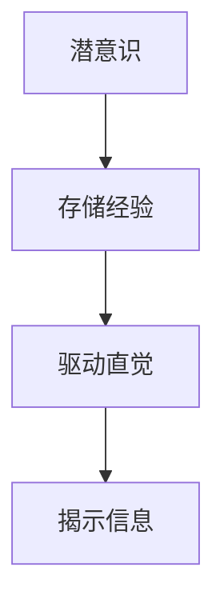

在这个流程图中，潜意识通过存储经验、驱动直觉和揭示信息，与直觉紧密相连。

#### 6.1.2 潜意识与直觉的关系

潜意识与直觉的关系主要体现在以下几个方面：

1. **经验存储：** 潜意识存储了大量的经验，这些经验在直觉中起着关键作用。当我们面临新的情境时，潜意识会迅速调用这些经验，帮助我们做出直觉判断。

2. **情感驱动：** 潜意识中的情感会影响我们的直觉。当我们感受到强烈的情感时，直觉判断往往会更加准确。例如，当我们面对紧急情况时，直觉往往能迅速提供正确的反应。

3. **信息揭示：** 直觉能够揭示潜意识中的信息，帮助我们理解内心的真实感受。通过直觉，我们能够捕捉到潜意识中的微妙变化，从而更好地认识自己。

以下是潜意识与直觉关系的伪代码：

```python
def subconscious_and_intuition():
    """
    潜意识与直觉
    
    潜意识与直觉的关系包括：
    1. 经验存储。
    2. 情感驱动。
    3. 信息揭示。
    """
    relationship_steps = """
    The relationship between the subconscious and intuition includes:
    1. Experience storage.
    2. Emotional drive.
    3. Information revelation.
    """
    return relationship_steps
```

#### 6.1.3 直觉心理学研究

直觉心理学研究直觉的产生机制、作用方式及其在认知过程中的角色。以下是直觉心理学研究的关键点：

1. **直觉的产生机制：** 研究试图理解直觉是如何产生的，它涉及大脑的哪些区域，以及神经信号如何传递。

2. **直觉的作用方式：** 研究探讨直觉在认知过程中的作用，如何影响我们的决策、判断和问题解决。

3. **直觉在认知过程中的角色：** 研究试图理解直觉在认知过程中的角色，它是如何与逻辑思维和其他认知过程相互作用的。

以下是直觉心理学研究的Mermaid流程图：

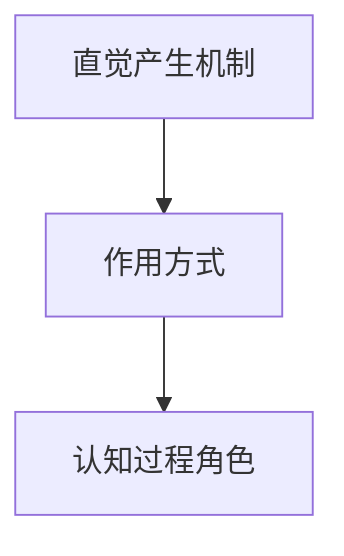

在这个流程图中，直觉产生机制、作用方式和认知过程角色构成了直觉心理学研究的关键点。

#### 6.2 直觉与认知心理学

认知心理学研究人的认知过程，包括知觉、记忆、思维和语言等。直觉与认知心理学密切相关，以下是直觉与认知心理学的关联：

1. **直觉与知觉：** 直觉在知觉过程中起着重要作用。例如，当我们看到一个人的表情时，直觉能迅速判断出他们的情感状态。

2. **直觉与记忆：** 直觉能帮助我们快速回忆起相关信息，从而提高记忆效率。例如，当我们在人群中寻找朋友时，直觉能帮助我们迅速定位目标。

3. **直觉与思维：** 直觉在思维过程中提供快速、准确的判断，有助于解决问题。例如，在解决复杂问题时，直觉能帮助我们找到最优解。

以下是直觉与认知心理学关联的Mermaid流程图：

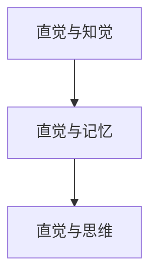

在这个流程图中，直觉与知觉、记忆和思维紧密相连，构成了认知心理学研究的重要组成部分。

#### 6.2.1 认知心理学的核心理论

认知心理学的核心理论包括：

1. **知觉理论：** 研究如何通过感官接收和处理信息，形成知觉。

2. **记忆理论：** 研究如何编码、存储和提取记忆。

3. **思维理论：** 研究如何进行逻辑推理、问题解决和决策。

4. **语言理论：** 研究如何通过语言表达和交流思想。

以下是认知心理学核心理论的Mermaid流程图：

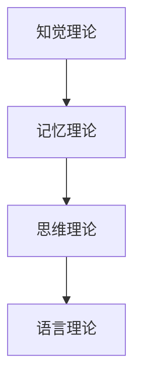

在这个流程图中，知觉、记忆、思维和语言构成了认知心理学的核心理论框架。

#### 6.2.2 直觉在认知过程中的作用

直觉在认知过程中起着重要作用，以下是一些具体作用：

1. **快速决策：** 直觉能迅速提供决策方向，帮助我们在复杂环境中做出快速反应。

2. **问题解决：** 直觉能帮助我们找到问题的本质，从而解决问题。

3. **创新思维：** 直觉能激发创新思维，帮助我们在艺术和科学等领域进行创新。

以下是直觉在认知过程中作用的Mermaid流程图：

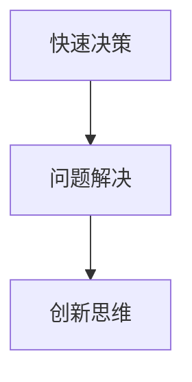

在这个流程图中，直觉在快速决策、问题解决和创新思维中发挥着关键作用。

#### 6.2.3 认知心理学案例

以下是一个认知心理学案例，展示直觉在认知过程中的实际应用：

**案例：**
张先生是一位建筑师，他在设计一座新办公楼时遇到了一个难题。传统的逻辑思维无法解决问题，他决定尝试直觉。

**步骤：**
1. 张先生放松身心，进行冥想，提高直觉敏感性。
2. 他站在建筑模型前，直觉告诉他应该改变建筑的整体布局。
3. 按照直觉的建议，他重新设计了建筑布局，解决了难题。

**结果：**
张先生的直觉决策不仅解决了问题，还提升了建筑的设计质量，获得了客户的高度赞扬。

### 第7章 总结与反思

通过本章的讨论，我们深入了解了直觉的力量及其培养方法。直觉在人类认知中具有独特地位，它超越逻辑思维，直接洞察事物的本质。通过冥想、放松技巧和日常练习，我们能够培养和提高直觉能力。直觉在职场、家庭和社交场合中有着广泛的应用，能够为我们的生活带来积极的变化。

以下是对本章内容的总结与反思：

1. **直觉的重要性：** 直觉是人类思维的一种独特能力，它超越逻辑推理，能够迅速地识别和理解复杂的信息。直觉在个人决策、问题解决和创新思维中起着重要作用。

2. **直觉与意识的关系：** 直觉与意识紧密相连。意识是我们对外界和内在体验的感知和理解，而直觉则是意识的一部分，它直接感知和解释信息。通过冥想和放松技巧，我们能够提高意识的敏感性，从而增强直觉。

3. **直觉的基础理论：** 直觉的定义、直觉与逻辑思维的关系、意识与直觉的互动以及直觉的产生机制构成了直觉的基础理论。这些理论为我们理解直觉的本质提供了框架。

4. **直觉能力的提升策略：** 通过自我认知、冥想、放松技巧和情境模拟等实践方法，我们能够培养和提高直觉能力。自我认知帮助我们了解自己的直觉，而冥想和放松技巧则有助于提高直觉的敏感性。

5. **直觉在生活中的应用：** 直觉在职场、家庭和社交场合中有着广泛的应用。通过直觉决策、直觉沟通和直觉感知，我们能够更有效地处理复杂问题和人际互动。

6. **直觉与心理学的关系：** 直觉与心理学密不可分。心理学研究直觉的产生机制和作用方式，以及直觉在认知过程中的角色。通过认知心理学的研究，我们能够更好地理解直觉的本质和作用。

最后，以下是一些最佳实践建议：

1. **定期冥想：** 冥想是提高直觉能力的重要方法。定期进行冥想，可以帮助我们放松身心，提高意识的敏感性。

2. **放松技巧：** 通过深呼吸、肌肉放松和放松音乐等放松技巧，我们能够减轻身体和心理的紧张，提高直觉的敏感性。

3. **自我认知：** 通过反思个人经历、观察内心世界和记录直觉体验，我们能够更好地了解自己的直觉，并在日常生活中发挥其作用。

4. **情境模拟：** 通过模拟实际情境，我们能够在实践中提高直觉的准确性和反应速度。

5. **拓展阅读：** 阅读相关的心理学和直觉研究，可以帮助我们更深入地理解直觉的本质和作用。

总之，直觉是一种强大的认知能力，通过培养和提高直觉能力，我们能够更好地应对生活中的挑战，提高决策质量和生活质量。让我们一起倾听内心的指引，培养直觉的能力，开启更广阔的思维空间。

### 作者信息

**作者：** AI天才研究院/AI Genius Institute & 禅与计算机程序设计艺术 /Zen And The Art of Computer Programming

本文由AI天才研究院/AI Genius Institute撰写，融合了人工智能和心理学的研究成果，旨在帮助读者深入理解直觉的力量及其培养方法。同时，本文参考了《禅与计算机程序设计艺术》的哲学思想，强调内心的宁静与思维的结合，为读者提供实用的直觉培养技巧。希望本文能为您的个人成长和心灵探索带来启示。如果您有任何疑问或建议，欢迎随时与我们联系。

