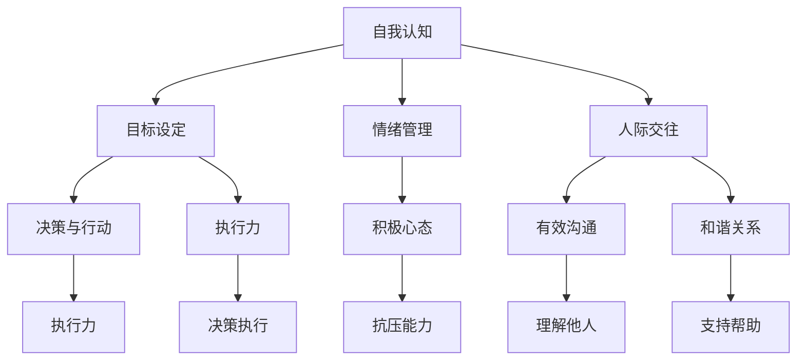

                 

### 引言与背景

在当今复杂多变的社会环境中，个体面临的选择和挑战日益增多。面对这些挑战，人们需要具备自我引导的能力，以便在生活和工作中做出明智的决策、实现个人目标和持续成长。本篇文章将围绕《做自己人生的主角：自我引导的艺术》这本书的核心内容进行阐述，旨在帮助读者理解自我引导的重要性，掌握实用的方法和技巧。

首先，我们需要明确自我引导的概念。自我引导是指个体在生活、工作和学习中，依靠自身的认知、情感和意志力量，主动进行目标设定、决策制定、行动执行和情绪管理的过程。这种能力不仅关乎个人的幸福感和成就感，还直接影响着社会的和谐与进步。

在现代社会，自我引导的重要性愈发凸显。随着信息爆炸和全球化的加速，人们面临的选择和诱惑越来越多，同时也承受着更大的压力和不确定性。在这种情况下，具备自我引导能力的人能够更加冷静、理智地面对挑战，做出明智的决策，实现个人目标。此外，自我引导能力还能帮助个体在人际交往中建立和谐的关系，提升自身的适应能力和抗压能力，从而更好地适应社会的发展。

《做自己人生的主角：自我引导的艺术》这本书旨在帮助读者掌握自我引导的核心方法和技巧。作者通过丰富的案例、实用的工具和深入的分析，系统地阐述了自我引导的各个方面，包括自我认知、目标设定、决策与行动、情绪管理和人际交往等。此外，书中还提供了大量的互动练习和实际案例，帮助读者将理论知识应用到实践中，真正掌握自我引导的能力。

本书的主要目标是帮助读者：

1. 理解自我引导的概念和意义，明确其在个人成长中的重要性。
2. 掌握自我认知的方法，包括自我反思、自我评估和自我定位。
3. 学会设定和实现个人目标，制定具体的行动计划。
4. 做出明智的决策，面对困难和挑战时保持冷静和理智。
5. 管理情绪，保持积极心态，提高抗压能力。
6. 建立和谐的人际关系，提升人际交往技巧。
7. 持续学习和成长，适应不断变化的环境。

通过阅读本书，读者将能够：

1. 提高自我认知，明确自己的优势和劣势，更好地规划个人发展。
2. 学会设定和实现目标，提升个人的成就感和幸福感。
3. 做出更加明智的决策，减少错误和失败的风险。
4. 管理情绪，保持积极心态，提升自身的抗压能力。
5. 建立良好的人际关系，提升个人的社会适应能力。
6. 持续学习和成长，不断提升自己的能力和素质。

总之，《做自己人生的主角：自我引导的艺术》这本书将为读者提供一套实用的自我引导方法和技巧，帮助读者在复杂多变的社会环境中找到自己的方向，实现个人目标和人生价值。通过阅读本书，读者将能够更好地掌控自己的人生，成为真正的人生主角。

### 核心概念与联系

在《做自己人生的主角：自我引导的艺术》这本书中，涉及的核心概念主要包括自我认知、目标设定、决策与行动、情绪管理和人际交往。这些概念彼此之间有着密切的联系，构成了一个完整的自我引导体系。

#### 自我认知

自我认知是自我引导的基石。它包括自我反思、自我评估和自我定位。通过自我反思，个体可以深入了解自己的内心世界，发现自身的优点和不足。自我评估则帮助个体客观地认识自己的能力和潜力，从而更好地制定个人目标和行动计划。自我定位则是在了解自己的基础上，为自己在人生舞台上找到合适的角色和位置。

#### 目标设定

目标设定是自我引导的关键步骤。一个明确、具体、可行的目标能够为个体指明方向，提供动力和激励。目标设定需要遵循SMART原则（具体、可测量、可达成、相关性强、时限性），以确保目标的可行性和有效性。同时，目标设定也需要与自我认知相结合，确保目标符合个体的实际能力和需求。

#### 决策与行动

决策与行动是自我引导的核心环节。在面对选择时，个体需要运用决策模型和框架，如SWOT分析、机会成本分析等，来做出明智的决策。在决策过程中，情绪管理也起着重要作用。个体需要保持冷静和理智，避免被情绪左右。一旦做出决策，个体需要付诸行动，将决策转化为实际行动。执行力是决策与行动的关键，个体需要培养坚定的意志力和毅力，确保决策得到有效执行。

#### 情绪管理

情绪管理是自我引导的重要组成部分。情绪对个体的认知和行为有着重要影响。一个良好的情绪管理能力能够帮助个体保持积极的心态，提高应对压力和挑战的能力。情绪管理包括情绪识别、情绪调节和情绪表达。通过情绪识别，个体可以清楚地了解自己的情绪状态；通过情绪调节，个体可以控制情绪的强度和持续时间；通过情绪表达，个体可以与他人有效地沟通和互动。

#### 人际交往

人际交往是自我引导的重要方面。个体在人际交往中需要学会有效沟通和建立和谐的关系。有效的沟通包括倾听、表达、反馈和解决问题的能力。建立和谐的关系则需要相互理解、尊重和支持。通过人际交往，个体可以获得他人的帮助和资源，实现个人目标和成长。

#### 关系架构

这些核心概念之间的关系可以用一个Mermaid流程图来表示：

通过这个流程图，我们可以清晰地看到各个核心概念之间的联系，以及它们在自我引导体系中的重要作用。自我认知为其他概念提供基础，目标设定和决策与行动是实现自我引导的关键步骤，情绪管理和人际交往则帮助个体在实现目标的过程中保持积极的心态和良好的人际关系。执行力是确保目标得以实现的核心，而积极心态、有效沟通和和谐关系则是自我引导的重要组成部分。

### 自我认知的重要性

自我认知是自我引导的基石，它为个体提供了一个清晰的认识框架，帮助我们在生活和工作中更好地定位自己、设定目标并实现个人成长。首先，让我们从自我反思谈起。

#### 自我反思

自我反思是指通过深入思考自己的行为、思想和感受，来了解自己的内在世界。这种反思不仅包括过去的经历和成就，还涵盖了当前的感受和未来的期望。通过自我反思，个体能够更加清晰地认识到自己的优点和不足，从而为自己的未来发展提供有针对性的指导。

例如，一个经常拖延的人可能会通过自我反思发现，自己拖延的原因可能是因为害怕失败或者不擅长某个任务。这种认知可以帮助他制定具体的改进计划，比如分解任务、设定截止日期或者寻求他人的帮助。通过持续的自我反思，个体可以逐渐培养出更好的时间管理能力和自信心。

#### 自我评估

自我评估是自我认知的另一个重要方面，它通过量化和分析自己的能力、兴趣和价值观，来更客观地认识自己。自我评估的工具可以包括心理测试、技能评估、职业规划问卷等。这些工具可以帮助个体了解自己在各个方面的表现，从而为个人目标和职业规划提供依据。

例如，一个想要提升自己沟通能力的职场人士可以通过自我评估发现，自己在倾听、表达和反馈方面还有待提高。基于这个评估结果，他可以制定一个具体的提升计划，比如参加沟通技巧培训、阅读相关书籍或者找一位导师进行指导。通过自我评估，个体可以更加明确自己的发展方向，从而更有针对性地进行自我提升。

#### 自我定位

自我定位是指根据自我认知的结果，为自己在人生舞台上找到合适的角色和位置。自我定位不仅关乎职业选择，还涉及个人价值观、生活目标和人生使命。一个明确的自我定位可以帮助个体在复杂多变的社会环境中保持清晰的自我认知，从而更好地应对挑战和把握机遇。

例如，一个在职场中感到迷茫的年轻人可能通过自我定位发现自己真正热爱的是艺术创作。他可以据此调整自己的职业规划，选择从事与艺术相关的工作，或者将其作为自己的业余爱好。通过自我定位，个体可以更加清晰地认识到自己的价值和使命，从而更有动力地追求个人目标和人生价值。

#### 自我认知在目标设定中的作用

自我认知在目标设定中起着至关重要的作用。一个明确、具体、可行的目标需要建立在对自己充分了解的基础上。只有了解自己的能力、兴趣和价值观，个体才能设定出符合自己实际情况的目标，并为之付出努力。

例如，一个在自我反思中发现自己擅长逻辑思考和解决问题的年轻人，可能会设定一个成为一名数据科学家的目标。这个目标不仅符合他的能力和兴趣，还能为他提供广阔的职业发展空间。同时，通过自我评估，他可以了解自己在数学、编程和数据分析方面的知识储备，从而有针对性地进行学习和提升。通过自我定位，他可以明确自己在数据科学领域的职业发展方向，比如数据分析师、数据工程师或数据科学家等。

#### 自我认知在个人成长中的作用

自我认知不仅是设定目标和实现目标的基础，还在个人成长中发挥着重要作用。通过自我认知，个体可以更加清楚地认识到自己的优点和不足，从而有针对性地进行自我提升。这种自我提升不仅包括知识和技能的积累，还涉及情感和心理素质的完善。

例如，一个在自我反思中发现自己情绪管理能力不足的职场人士，可能会通过学习情绪管理技巧、参加心理咨询等方式来提升自己的情绪管理能力。这种提升不仅有助于他在工作中更好地应对压力和挑战，还能提高他的幸福感和生活质量。通过自我认知，个体可以更加全面地认识自己，从而实现更加全面和持续的成长。

总之，自我认知是自我引导的基石，它为个体提供了一个清晰的认识框架，帮助我们在生活和工作中更好地定位自己、设定目标并实现个人成长。通过自我反思、自我评估和自我定位，个体可以更好地了解自己的内在世界，从而为自己的人生航程指明方向。在接下来的章节中，我们将进一步探讨如何通过目标设定、决策与行动、情绪管理和人际交往等具体方法，来实现自我引导，成为自己人生的主角。

### 目标设定与规划

在自我引导的过程中，目标设定与规划是一个关键环节。一个明确、具体、可行的目标不仅能够为个体提供清晰的方向，还能激发内在的动力和毅力，促使我们朝着目标不断前进。那么，如何设定和实现个人目标呢？以下是详细的步骤和技巧。

#### 明确目标的重要性

首先，明确目标的重要性。一个明确的目标可以为我们提供清晰的方向，减少迷茫和困惑。目标还能激发内在的动力，让我们在实现过程中保持持续的努力和热情。此外，明确的目标有助于我们更好地规划资源，提高效率，从而更快地实现目标。

#### 设定目标的SMART原则

SMART原则是一种常用的目标设定方法，它要求目标具有以下五个特征：

1. **具体（Specific）**：目标应该明确、具体，避免模糊和宽泛。例如，“提高销售业绩”不如“在接下来的三个月内，将销售额提高20%”具体。

2. **可测量（Measurable）**：目标应该可以量化或衡量，以便我们了解进展和成果。例如，“减肥”不如“减掉5公斤”可测量。

3. **可实现（Achievable）**：目标应该具有可行性，避免过高或过低。例如，“成为全球首富”虽然具有吸引力，但过于不切实际。

4. **相关性强（Relevant）**：目标应该与我们的价值观和长远目标相一致。例如，“每天阅读一小时”比“每天跑步一小时”更相关，因为阅读有助于个人成长。

5. **时限性（Time-bound）**：目标应该设定一个明确的截止日期，以便我们能够有一个时间概念。例如，“在年底前完成项目”比“尽快完成项目”时限性更强。

#### 制定具体行动计划

在设定了SMART目标后，我们需要制定具体的行动计划。一个有效的行动计划应该包括以下内容：

1. **分解目标**：将大目标分解为小目标，以便逐步实现。例如，将“提高销售额20%”分解为“每月提高销售额5%”。

2. **确定关键任务**：列出实现目标所需的关键任务，并明确每个任务的负责人和时间安排。例如，“制定营销策略”和“开展促销活动”。

3. **资源配置**：明确实现目标所需的资源，包括人力、物力和财力。例如，需要增加营销预算、招聘新员工等。

4. **监控与调整**：制定监控机制，定期检查目标的进展情况，并根据实际情况进行必要的调整。例如，每月进行一次进度汇报，必要时调整计划和资源分配。

#### 实现目标的方法和技巧

以下是实现目标的一些具体方法和技巧：

1. **设定优先级**：将目标按照重要性和紧急性进行排序，确保首先完成最重要的任务。例如，使用艾森豪威尔矩阵来管理任务。

2. **分解任务**：将大任务分解为小任务，以便逐步完成。例如，将“撰写报告”分解为“收集数据”、“整理数据和撰写报告草稿”。

3. **利用时间管理工具**：使用时间管理工具，如日程表、待办事项列表和番茄工作法等，来提高工作效率。例如，使用谷歌日历和Trello来管理任务。

4. **定期反思与调整**：定期反思目标实现的进展情况，及时发现问题并调整计划。例如，每周进行一次反思，每月进行一次全面的评估。

5. **保持积极心态**：保持积极的心态，相信自己能够实现目标。例如，通过积极的自我暗示和肯定来增强信心。

6. **寻求支持**：在实现目标的过程中，寻求家人、朋友或同事的支持和鼓励。例如，与导师或同事定期交流进展，获取反馈和建议。

#### 案例研究

假设一个人设定了一个目标：“在接下来的六个月内，将体重减掉10公斤”。以下是一个具体的实现步骤：

1. **具体目标**：明确目标为“在接下来的六个月内，将体重减掉10公斤”。

2. **分解目标**：将六个月分解为两个三个月，每个月减掉5公斤。

3. **关键任务**：
   - **收集数据**：记录当前体重，了解基础代谢率。
   - **制定饮食计划**：减少高热量食物摄入，增加蔬菜和水果的比例。
   - **制定运动计划**：每周进行三次有氧运动，如跑步或游泳，每次30分钟以上。

4. **资源配置**：购买运动装备，如跑步鞋、运动服等。

5. **监控与调整**：
   - **每周进行一次体重测量**：记录体重变化，及时调整饮食和运动计划。
   - **每月进行一次全面评估**：检查目标进展情况，必要时调整计划。

通过以上步骤，这个人可以逐步实现减重目标，并在过程中学会有效的目标设定和规划方法。

总之，目标设定与规划是实现个人目标的关键步骤。通过遵循SMART原则、制定具体行动计划和运用有效的方法和技巧，我们能够更好地实现个人目标，提升自我引导能力。在接下来的章节中，我们将进一步探讨如何在面对困难和挑战时做出明智的决策，以及如何管理情绪和建立和谐的人际关系。

### 决策与行动

在自我引导的过程中，决策与行动是不可或缺的两个环节。一个有效的决策能够为我们的行动提供明确的方向，而果断的行动则是实现目标的关键。那么，如何做出明智的决策并付诸行动呢？以下是详细的步骤和技巧。

#### 决策模型与框架

1. **SWOT分析**：SWOT分析是一种常用的决策模型，它通过分析自身的优势（Strengths）、劣势（Weaknesses）、机会（Opportunities）和威胁（Threats），帮助个体全面了解自身状况，从而做出更加明智的决策。

   - **优势**：分析自己在某个领域或任务中的优势，如技能、经验和资源。
   - **劣势**：识别自己在某个领域或任务中的劣势，如知识不足、技能不熟练等。
   - **机会**：评估外部环境中可能出现的机遇，如市场需求、技术进步等。
   - **威胁**：识别外部环境中可能出现的威胁，如竞争对手、政策变化等。

   通过SWOT分析，个体可以更清楚地了解自身情况，从而制定出更加符合实际的决策。

2. **机会成本分析**：机会成本是指为了选择某一方案而放弃的其他方案的潜在收益。通过机会成本分析，个体可以评估每个决策选项的成本和收益，从而做出更加明智的选择。

   - **列出所有可能的决策选项**。
   - **评估每个选项的潜在收益**。
   - **计算每个选项的机会成本**。
   - **选择成本最低且收益最高的选项**。

   例如，一个公司需要决定是否扩大生产线。通过机会成本分析，他们可以评估扩大生产线所需的资金、人力和资源，以及放弃其他投资机会的潜在收益，从而做出明智的决策。

#### 面对困难时的决策

在生活和工作中，我们不可避免地会遇到各种困难和挑战。在这种情况下，如何做出明智的决策至关重要。

1. **保持冷静和理智**：面对困难和挑战时，保持冷静和理智，避免被情绪左右。可以通过深呼吸、冥想等方式来调节情绪。

2. **收集更多信息**：在做出决策之前，收集尽可能多的信息，以便全面了解问题的各个方面。可以通过咨询专家、查阅资料、与他人交流等方式来获取信息。

3. **评估不同方案的优缺点**：列出所有可能的解决方案，并评估每个方案的优缺点。可以从以下几个方面进行评估：

   - **可行性**：评估方案是否实际可行，是否需要额外的资源和支持。
   - **成本效益**：评估方案的成本和潜在收益，是否值得投入。
   - **风险和不确定性**：评估方案可能面临的风险和不确定性，是否能够承担。

4. **权衡利弊**：在评估每个方案的优缺点后，权衡利弊，选择最符合实际情况和长远利益的方案。

5. **制定备选方案**：为了应对可能出现的意外情况，制定备选方案。这样即使原方案出现问题，也能有应对措施。

#### 行动与执行力

一旦做出决策，果断地付诸行动是至关重要的。执行力是决策与行动的核心，它决定了决策是否能够得到有效实施和目标是否能够实现。

1. **明确行动步骤**：将决策转化为具体的行动步骤，明确每个步骤的具体内容和负责人。例如，如果决策是扩大生产线，那么需要明确生产计划、采购材料、招聘工人等具体步骤。

2. **制定时间表**：为每个行动步骤设定一个明确的时间表，确保在规定时间内完成。例如，将生产计划分为短期、中期和长期目标，每个目标都有明确的时间节点。

3. **资源分配**：根据行动步骤和时间表，合理分配资源，确保每个步骤都有足够的资源支持。例如，招聘工人、采购原材料等。

4. **监控与调整**：在行动过程中，定期监控进展情况，及时发现并解决问题。如果发现原方案存在问题，需要及时调整计划，确保目标得以实现。

5. **建立激励机制**：为团队成员建立激励机制，鼓励他们积极参与行动，提高执行力。例如，设立奖金、晋升机会等。

#### 案例研究

假设一个人面临以下决策：是否参加一个高薪但繁忙的工作机会。以下是一个具体的决策过程：

1. **SWOT分析**：
   - **优势**：拥有丰富的相关经验、良好的专业技能。
   - **劣势**：家庭责任重，可能需要减少个人时间。
   - **机会**：有机会获得更高的薪资和职业发展。
   - **威胁**：工作压力可能影响家庭和生活质量。

2. **机会成本分析**：
   - **列出所有可能的决策选项**：接受工作机会、拒绝工作机会、寻找其他工作机会。
   - **评估每个选项的潜在收益**：接受工作机会可以获得更高的薪资和职业发展，拒绝工作机会可以保持现有的生活平衡，寻找其他工作机会需要时间成本和风险。

3. **权衡利弊**：
   - **可行性**：接受工作机会可能需要牺牲家庭时间，但能够带来更高的收入和职业发展。
   - **成本效益**：考虑家庭责任和长期职业规划，接受工作机会的收益大于成本。

4. **制定备选方案**：如果工作压力过大，可以寻求家庭支持，调整工作时间和方式。

通过以上步骤，这个人可以做出明智的决策，并付诸行动，实现个人目标和职业发展。

总之，决策与行动是自我引导的重要环节。通过运用决策模型和框架、面对困难时保持冷静和理智、明确行动步骤和提高执行力，我们能够更好地实现个人目标，成为自己人生的主角。在接下来的章节中，我们将探讨如何管理情绪，保持积极心态，以及如何与他人建立和谐的人际关系。

### 情绪管理

在自我引导的过程中，情绪管理是至关重要的一环。情绪对个体的认知、行为和心理健康有着深远的影响。一个良好的情绪管理能力能够帮助个体保持积极的心态，提高抗压能力，从而更好地应对生活和工作的挑战。以下我们将从情绪的类型、情绪管理技巧以及培养积极心态三个方面进行探讨。

#### 情绪的类型

首先，我们需要了解情绪的类型。情绪可以分为积极情绪和消极情绪两大类：

1. **积极情绪**：积极情绪包括喜悦、幸福、满足、兴奋等。这些情绪能够提升个体的心理健康，增强幸福感，促进个体与社会和他人的积极互动。

2. **消极情绪**：消极情绪包括焦虑、沮丧、愤怒、恐惧等。这些情绪可能对个体的身心健康造成负面影响，导致个体产生逃避、抵触等消极行为。

#### 情绪管理技巧

为了有效地管理情绪，我们需要掌握一些实用的技巧：

1. **情绪识别**：情绪识别是情绪管理的第一步。通过自我观察和反思，个体可以识别出自己正在经历的情绪，并理解情绪的来源和影响。

2. **情绪调节**：情绪调节是指通过调整情绪的强度和持续时间，使其更加符合实际情况和需求。以下是一些常用的情绪调节技巧：

   - **认知重构**：通过改变对事件的认知和解读，来调节情绪。例如，将“我不擅长这项任务”改变为“这是一个机会，我可以从中学习和成长”。
   - **放松训练**：通过深呼吸、冥想、瑜伽等放松训练，缓解紧张和焦虑情绪。
   - **积极自我暗示**：通过积极的自我暗示，如“我可以做到”、“我值得幸福”等，来提升积极情绪。
   - **倾诉与支持**：通过与亲朋好友、心理咨询师等倾诉，获得情感上的支持和理解。

3. **情绪表达**：情绪表达是指通过适当的方式表达自己的情绪，避免情绪压抑和爆发。以下是一些有效的情绪表达技巧：

   - **非暴力沟通**：通过表达自己的感受、需求和请求，而不是指责或攻击他人。例如，“我感到很难过，因为你没有按时完成我们的任务，我希望你能帮助我解决这个问题”。
   - **艺术表达**：通过绘画、写作、音乐等艺术形式来表达情绪，减轻心理压力。

#### 培养积极心态

积极心态是情绪管理的重要基础。一个积极的心态能够帮助个体更好地应对生活中的挑战，保持心理健康。以下是一些培养积极心态的方法：

1. **感恩练习**：每天花时间反思和感恩生活中的美好事物，如家人、朋友、工作等。感恩能够提升幸福感，增强心理韧性。

2. **正面思维**：通过积极的思考和自我暗示，来替代消极的思维模式。例如，将“我总是失败”改变为“每次失败都是一次学习和成长的机会”。

3. **目标设定**：设定明确、具体、可行的目标，并为实现目标而努力。目标能够为个体提供方向和动力，增强积极心态。

4. **自我激励**：通过积极的自我激励，如奖励、赞美自己等，来增强自信心和动力。例如，每完成一个小目标，就给自己一个小奖励。

#### 案例研究

假设一个人在面临工作压力时感到焦虑和沮丧。以下是一个具体的情绪管理案例：

1. **情绪识别**：通过自我反思，这个人意识到自己感到焦虑和沮丧的原因是工作压力过大，任务繁重，时间紧迫。

2. **情绪调节**：这个人通过深呼吸和冥想来缓解紧张情绪，并尝试通过认知重构来调整自己的思维。例如，将“我无法完成任务”改变为“我可以一步步完成，每次完成一小部分”。

3. **情绪表达**：这个人与同事和上司进行了沟通，表达了自己的担忧和需求，并寻求他们的支持和理解。

4. **培养积极心态**：这个人设定了明确的工作目标，并为实现目标而努力。同时，通过感恩练习和正面思维来提升自己的心态。

通过以上步骤，这个人成功地管理了自己的情绪，提升了心理健康，并在工作中取得了更好的表现。

总之，情绪管理是自我引导的重要组成部分。通过了解情绪的类型、掌握情绪管理技巧以及培养积极心态，个体能够更好地应对生活中的挑战，提升心理健康，实现个人目标和人生价值。在接下来的章节中，我们将探讨如何建立和谐的人际关系，进一步提升自我引导能力。

### 人际交往

人际交往是自我引导过程中不可或缺的一环。良好的人际关系不仅能够为个体提供情感支持，还能在职业发展和个人成长中起到重要作用。以下从人际交往的重要性、有效沟通技巧和建立和谐关系三个方面进行探讨。

#### 人际交往的重要性

人际交往的重要性不言而喻。首先，它有助于情感支持。在生活中，我们会遇到各种各样的困难和挑战，良好的人际关系能够为我们提供情感上的支持和安慰，减轻心理压力。其次，人际交往对职业发展有着重要影响。无论是在求职过程中还是在职场中，人际网络都为我们提供了宝贵的资源和支持。一个广泛的人际网络能够帮助我们获取更多信息、机会和资源，从而提升职业竞争力。最后，人际交往对个人成长也有积极影响。通过与他人的交流和互动，我们可以学习到新的知识和技能，拓宽视野，提升自我认知和自我发展能力。

#### 有效沟通技巧

有效沟通是建立和谐人际关系的基础。以下是一些关键的有效沟通技巧：

1. **倾听**：倾听是有效沟通的核心。通过倾听，我们能够理解他人的观点和需求，建立信任和共鸣。倾听的技巧包括：

   - **全身心倾听**：专注地听，不要打断对方，给予对方足够的注意和尊重。
   - **积极反馈**：通过肢体语言和口头表达，表示自己在认真倾听，如点头、微笑、回应“嗯嗯”、“我懂”等。

2. **表达清晰**：表达清晰是有效沟通的重要保障。通过清晰、简洁、有条理地表达自己的观点和需求，避免产生误解和冲突。表达清晰的技巧包括：

   - **明确表达**：使用具体的词汇和例子来传达信息，避免模糊和含糊不清。
   - **避免指责和攻击**：用“我”语言来表达自己的感受和需求，而不是用“你”语言指责对方。

3. **非暴力沟通**：非暴力沟通是一种有效的沟通方法，通过表达自己的感受、需求和请求，而不是指责或攻击他人。非暴力沟通的四个步骤包括：

   - **观察**：描述观察到的事实，避免主观评价和判断。
   - **感受**：表达自己的感受，避免使用情绪化的语言。
   - **需要**：表达自己的需求和请求，明确说明希望对方做什么。
   - **请求**：提出具体的请求，以便对方理解你的意图。

4. **反馈与确认**：在沟通过程中，及时给予对方反馈，并确认对方是否理解了自己的意思。通过反馈与确认，可以避免误解和沟通障碍。

#### 建立和谐关系

建立和谐关系需要时间和耐心。以下是一些建立和谐关系的建议：

1. **相互理解**：建立和谐关系的关键在于相互理解。通过倾听和沟通，了解他人的需求和期望，尊重他人的观点和感受。

2. **尊重与信任**：尊重他人是建立和谐关系的基础。通过尊重他人的意见和选择，建立信任和共鸣。信任是和谐关系的基石，它能够为双方提供安全感，增强合作意愿。

3. **共同目标**：与对方建立共同目标，共同为实现目标而努力。共同目标能够增强合作和互动，提升人际关系质量。

4. **积极互动**：通过积极的互动和交流，加深彼此的了解和信任。例如，共同参加活动、分享经验和观点等。

#### 案例研究

假设两个人，小张和小王，因为工作上的分歧产生了矛盾。以下是一个建立和谐关系的案例：

1. **相互理解**：小张和小王通过沟通，了解对方的工作压力和挑战，认识到双方都需要支持和理解。

2. **尊重与信任**：小张和小王相互尊重对方的意见，避免指责和攻击。他们通过积极倾听，建立了信任和共鸣。

3. **共同目标**：小张和小王共同设定了工作目标，决定一起为实现目标而努力。他们制定了一个详细的计划，并分配了各自的任务。

4. **积极互动**：小张和小王通过积极的互动和交流，分享了工作上的经验和观点。他们共同面对挑战，共同庆祝成就。

通过以上步骤，小张和小王成功建立了和谐的工作关系，不仅提升了工作效率，还增强了彼此的信任和合作意愿。

总之，人际交往是自我引导过程中不可或缺的一部分。通过了解人际交往的重要性、掌握有效沟通技巧和建立和谐关系，个体能够更好地与他人互动，提升个人和团队的效能，实现共同的目标。

### 持续成长与适应

在快速变化的时代，持续成长和适应能力成为个体在职场和生活中取得成功的关键因素。持续成长不仅关乎知识和技能的提升，还包括心理素质、思维方式的转变。以下我们将从学习与成长的方法、适应变化与应对挑战以及持续发展的策略三个方面进行探讨。

#### 学习与成长的方法

1. **自我驱动学习**：自我驱动学习是指个体主动寻求知识、技能和经验的过程。以下是一些自我驱动学习的方法：

   - **阅读**：阅读是获取知识的重要途径。选择与自己职业和兴趣相关的书籍、文章和报告，定期阅读并总结心得。
   - **在线课程**：利用在线教育平台，如Coursera、edX等，参加各种专业课程，提升自己的专业知识和技能。
   - **实践**：将理论知识应用到实际工作中，通过实践来验证和巩固所学知识。例如，参加项目、实验或实际操作。
   - **交流与分享**：与他人交流观点和经验，通过分享和学习他人的成功经验和失败教训，提升自己的认知水平。

2. **建立学习小组**：与志同道合的人组成学习小组，定期讨论和分享学习心得，相互激励和支持。通过小组学习，可以拓宽视野，提升学习效果。

3. **定期反思**：定期反思自己的学习过程和方法，总结经验教训，调整学习策略。通过反思，可以找到自己的优势和不足，有针对性地进行改进。

#### 适应变化与应对挑战

1. **灵活应对**：在变化的环境中，保持灵活和适应性是关键。以下是一些适应变化的方法：

   - **保持开放心态**：对新事物保持开放和好奇，愿意接受和尝试新方法和新思维。
   - **持续学习**：不断学习新知识和技能，以适应不断变化的环境和需求。
   - **调整策略**：在面对挑战时，及时调整自己的策略和方法，寻找新的解决方案。

2. **风险管理**：在面对不确定性和风险时，进行风险评估和管理，制定应对措施。通过风险管理，可以降低风险带来的负面影响。

3. **积极心态**：保持积极的心态，相信自己能够应对挑战和变化。积极心态能够提升个体的抗压能力和适应能力。

#### 持续发展的策略

1. **设定长期目标**：设定明确、具体、可实现的长期目标，为自己的成长和职业发展提供方向和动力。

2. **持续反馈与评估**：定期进行自我反馈和评估，了解自己的成长进度和成果。通过反馈和评估，可以及时发现问题，调整策略。

3. **职业规划**：制定详细的职业规划，包括职业目标、发展路径、技能提升计划等。通过职业规划，可以系统地提升自己的职业能力和竞争力。

4. **多元化发展**：在职业发展中，不要局限于单一领域，要尝试多样化的工作和挑战。通过多元化发展，可以拓宽视野，提升综合素质。

#### 案例研究

假设一个人，小李，在一家科技公司工作。以下是一个关于持续成长和适应变化的案例：

1. **自我驱动学习**：小李通过阅读相关书籍、参加在线课程和实际操作，不断提升自己的技术能力和项目管理技能。

2. **建立学习小组**：小李加入了一个技术交流小组，定期与同行分享和学习最新的技术动态和实战经验。

3. **适应变化**：随着公司业务的发展和市场需求的变化，小李主动学习新的技术和工具，并调整自己的工作方法和策略，以适应新的工作需求。

4. **职业规划**：小李制定了详细的职业规划，包括在未来的三年内成为一名资深项目经理，并在五年内晋升为部门主管。

通过以上策略，小李在持续学习和适应变化的过程中，不断提升自己的职业能力和竞争力，实现了个人和职业的持续发展。

总之，持续成长和适应变化是自我引导的重要方面。通过自我驱动学习、适应变化和制定持续发展的策略，个体能够在快速变化的环境中保持竞争力，实现个人和职业的持续成长。

### 总结与展望

《做自己人生的主角：自我引导的艺术》这本书为我们提供了一套完整的自我引导方法和技巧，帮助我们在复杂多变的社会环境中找到自己的方向，实现个人目标和人生价值。通过自我认知、目标设定、决策与行动、情绪管理和人际交往，我们能够更好地掌控自己的人生，提升自我管理和生活品质。

首先，自我认知是自我引导的基石。通过自我反思、自我评估和自我定位，我们能够深入了解自己的内在世界，明确自己的优势和不足，从而更好地规划个人发展。

其次，目标设定与规划是实现个人目标的关键。遵循SMART原则，制定明确、具体、可行的目标，并制定具体的行动计划，我们能够逐步实现目标，提升成就感和幸福感。

在决策与行动方面，通过运用决策模型和框架、面对困难时保持冷静和理智、明确行动步骤和提高执行力，我们能够更加明智地做出决策，果断地付诸行动。

情绪管理是自我引导的重要组成部分。通过了解情绪的类型、掌握情绪管理技巧以及培养积极心态，我们能够保持心理健康，提高抗压能力，更好地应对生活中的挑战。

人际交往是建立和谐关系的基础。通过有效沟通技巧和建立和谐关系的方法，我们能够与他人建立良好的关系，提升人际交往能力，为个人和职业发展提供支持。

持续成长和适应变化是实现自我引导的重要策略。通过自我驱动学习、适应变化和制定持续发展的策略，我们能够不断提升自己的能力和竞争力，在快速变化的环境中保持竞争力。

展望未来，自我引导将成为每个人必备的技能。随着社会的发展和科技的进步，我们面临的选择和挑战将越来越多，自我引导能力将成为我们实现个人目标和人生价值的关键。通过不断学习和实践，我们能够不断提升自我引导能力，成为真正的人生主角。

让我们牢记，做自己人生的主角，不仅需要勇敢面对挑战，更需要智慧地引导自己的生活。通过阅读本书，相信读者已经掌握了自我引导的核心方法和技巧，能够在未来的道路上更加自信、自主和成功。祝愿每一位读者都能在自我引导的道路上越走越远，实现自己的人生价值和梦想。

### 拓展阅读

为了进一步提升自我引导能力，读者可以参考以下相关书籍和资源：

1. **《高效能人士的七个习惯》（Stephen R. Covey）**：这本书详细介绍了高效人士的七个习惯，包括积极主动、以终为始、要事第一等，为读者提供了实用的自我管理和成长策略。

2. **《心理学与生活》（Richard J. Gerrig & Philip G. Zimbardo）**：这本书通过通俗易懂的语言介绍了心理学的核心概念和应用，帮助读者更好地理解自己和他人，提升人际交往能力。

3. **《如何赢得朋友与影响他人》（Dale Carnegie）**：这本书被誉为人际关系领域的经典之作，提供了实用的沟通技巧和人际交往策略，帮助读者建立和谐的人际关系。

4. **《认知升级》（李笑来）**：这本书探讨了认知心理学和自我提升的关系，通过实际案例和理论分析，帮助读者提升自我认知和思维能力。

5. **在线课程**：如Coursera、edX等平台上的相关课程，提供了丰富的自我引导和职业发展资源，包括心理学、时间管理、人际关系等领域的课程。

6. **博客和公众号**：如“得到”、“简书”等平台上的专业博客和公众号，提供了大量的自我引导和成长类文章，读者可以订阅和关注这些平台，获取最新的知识和观点。

通过阅读这些书籍和资源，读者可以进一步拓宽自己的视野，提升自我引导能力，实现个人和职业的持续成长。在自我引导的道路上，不断学习和实践是关键，祝愿每一位读者都能取得丰硕的成果。

