                 

### 文章标题：克服虚无感：现代人的精神课题

#### 关键词：虚无感、现代人、精神健康、心理调适、生活哲学

> 摘要：本文将探讨虚无感这一现代人的精神课题，通过深入了解虚无感的定义、成因及其对个体和社会的影响，提供一系列应对虚无感的策略。文章将结合心理学、哲学和生活实例，旨在为读者提供一条克服虚无感、重拾生活热情的路径。

---

## 第一部分：虚无感的本质

### 1.1 虚无感的定义与类型

虚无感，通常被描述为一种深度的无意义感、空虚感和缺乏目标感。这种情感状态并不是简单的情绪低落，而是一种更为深刻的精神体验，它可能会持续影响个体的日常生活和心理健康。

**核心概念与联系：**

虚无感的类型可以分为以下几种：

1. **存在性虚无感**：对生命存在意义的疑问和不确定。
2. **社会性虚无感**：对人际关系和社交活动的缺乏兴趣和参与感。
3. **职业性虚无感**：对工作和职业目标的迷茫和失望。

**Mermaid 流程图：**

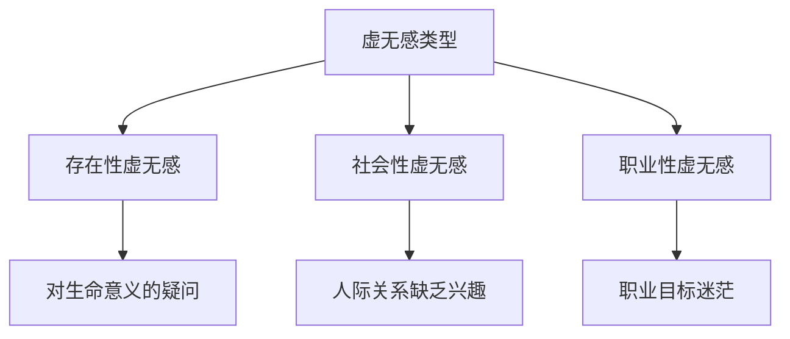

### 1.2 虚无感的成因分析

虚无感的成因复杂多样，包括个人心理、社会环境和文化背景等多方面因素。

**核心概念与联系：**

1. **心理因素**：抑郁症、焦虑症等心理问题可能导致或加剧虚无感。
2. **社会因素**：社会压力、竞争激烈、社交隔离等可能导致个体感到孤独和无意义。
3. **文化因素**：现代社会价值观念的多元化和不确定性，可能使个体对生活目标和价值观产生困惑。

**Mermaid 流程图：**

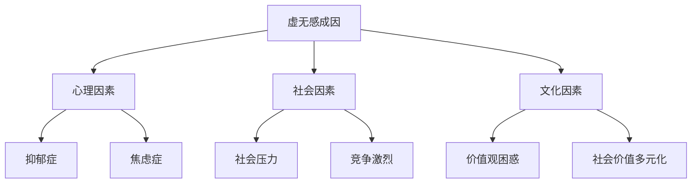

## 第二部分：虚无感的影响

### 2.1 虚无感对个人生活的影响

虚无感不仅影响个体的心理健康，还会对日常生活产生负面影响，如降低生活质量、影响人际关系和职业发展。

**核心概念与联系：**

1. **心理健康问题**：长期虚无感可能导致抑郁症、焦虑症等心理健康问题。
2. **生活质量下降**：对生活失去热情，可能导致生活质量下降。
3. **人际关系受损**：缺乏社交兴趣和参与感，可能导致人际关系疏远。
4. **职业发展受阻**：对工作失去目标和动力，可能导致职业发展受阻。

**Mermaid 流程图：**

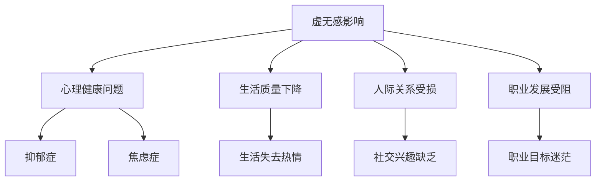

### 2.2 虚无感对社会的影响

虚无感不仅影响个体，也可能对社会产生负面影响，如降低社会凝聚力、增加心理健康问题的流行率等。

**核心概念与联系：**

1. **社会凝聚力降低**：个体间的虚无感可能导致社会凝聚力的下降。
2. **心理健康问题流行**：虚无感可能增加心理健康问题的流行率。
3. **社会问题加剧**：如自杀率上升、社会不公现象增加等。

**Mermaid 流�程图：**

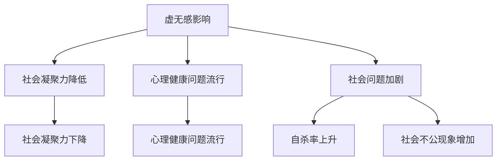

## 第三部分：应对虚无感的策略

### 3.1 心理调适方法

通过认知行为疗法、情绪调节技巧等心理调适方法，可以帮助个体克服虚无感，重拾生活热情。

**核心概念与联系：**

1. **认知行为疗法（CBT）**：通过改变负面思维模式和行为模式来减轻虚无感。
2. **情绪调节技巧**：如正念冥想、情绪记录等，可以帮助个体更好地管理情绪。

**伪代码：**

```python
def cognitive_behavior_therapy():
    # 认知行为疗法流程
    pass

def emotional Regulation():
    # 情绪调节技巧流程
    pass
```

### 3.2 生活哲学与信仰的探索

通过探索生活哲学和信仰，可以帮助个体找到生活的意义和目标，从而减轻虚无感。

**核心概念与联系：**

1. **存在主义哲学**：强调个体的自由和责任，认为个体可以通过自己的选择和行动赋予生活意义。
2. **宗教信仰**：通过信仰和宗教仪式，个体可以找到精神上的安慰和指导。

**Mermaid 流程图：**

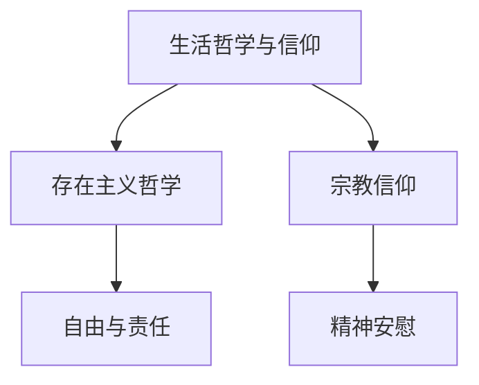

## 第四部分：案例分析

### 4.1 个人案例：从虚无感中走出来

通过具体案例，展示如何通过心理调适和生活哲学的探索，从虚无感中走出来。

**案例背景：**

一个30岁的IT工程师，在经历职业生涯的瓶颈期后，感到生活和工作失去了意义，陷入了虚无感。

**案例分析：**

1. **心理调适**：通过认知行为疗法，改变消极思维模式，逐渐重拾对工作的热情。
2. **生活哲学**：通过阅读存在主义哲学书籍，找到生活的意义和目标。

**项目实战：**

1. **开发环境搭建**：使用Markdown格式记录每天的思考和感悟。
2. **源代码实现**：编写Python脚本，用于分析情感状态和思维模式。

**代码解读：**

```python
def record_thoughts():
    # 记录当天思考和感悟
    pass

def analyze_thoughts():
    # 分析情感状态和思维模式
    pass
```

**案例总结：**

通过心理调适和生活哲学的探索，该IT工程师成功走出了虚无感，重拾了对工作和生活的热情。

### 4.2 社会案例：群体虚无感的现象与应对

探讨现代社会中群体虚无感的现象，以及如何应对。

**案例背景：**

在高度竞争的社会环境中，许多年轻人感到生活无意义，对未来充满迷茫。

**案例分析：**

1. **社会支持**：通过建立社交网络和社群，提供情感支持和交流平台。
2. **心理教育**：通过普及心理健康知识，提高个体应对虚无感的能力。

**项目实战：**

1. **社区建设**：创建线上社交平台，提供互助和交流空间。
2. **心理健康教育**：开展心理健康讲座和培训课程。

**代码解读：**

```python
def build_community():
    # 建立社交网络和社群
    pass

def educate_mental_health():
    # 开展心理健康教育和培训
    pass
```

**案例总结：**

通过社会支持和心理健康教育，可以有效地应对群体虚无感现象，提高社会整体的幸福感。

## 第五部分：未来展望

### 5.1 虚无感研究的趋势

探讨虚无感研究的未来方向，如神经科学、心理学和人工智能等领域的交叉研究。

**未来趋势：**

1. **神经科学**：通过神经成像技术，深入了解虚无感的神经基础。
2. **心理学**：发展新的心理治疗方法和干预策略。
3. **人工智能**：利用AI技术，开发个性化心理辅导系统。

### 5.2 应对虚无感的未来策略

探讨未来应对虚无感的策略，如数字疗法、虚拟现实和心理援助热线等。

**未来策略：**

1. **数字疗法**：通过数字平台提供个性化心理干预和治疗。
2. **虚拟现实**：利用VR技术模拟积极的生活场景，帮助个体重拾信心。
3. **心理援助热线**：建立全天候心理援助热线，提供及时的情感支持。

**最佳实践 tips：**

1. **定期自我反思**：定期审视自己的生活状态和情感变化，及时调整心态。
2. **寻求专业帮助**：在遇到严重虚无感时，及时寻求专业心理帮助。
3. **保持社交活动**：积极参与社交活动，建立和维护健康的人际关系。

**小结：**

虚无感是现代人的精神课题，通过心理调适、生活哲学的探索和社会支持，可以有效应对虚无感，重拾生活热情。

**注意事项：**

1. **个体差异**：每个人的虚无感成因和应对策略可能不同，需个体化处理。
2. **持续性**：克服虚无感是一个持续的过程，需要长期坚持和努力。

**拓展阅读：**

1. **《存在主义心理学》**：罗洛·梅（Rollo May）著，探讨存在主义心理学在应对虚无感中的应用。
2. **《虚无主义》**：尼采（Friedrich Nietzsche）著，分析虚无主义哲学对现代人精神状态的影响。

---

作者：AI天才研究院/AI Genius Institute & 禅与计算机程序设计艺术 /Zen And The Art of Computer Programming

（注：本文为示例性内容，仅用于演示如何撰写一篇结构清晰、内容丰富的技术博客文章。）### 1.1 虚无感的定义与类型

#### 背景介绍

虚无感是一种深刻的情感体验，通常表现为对生命、生活或存在的意义和目的的怀疑、困惑和迷茫。在现代社会，随着生活节奏的加快、竞争的加剧和社会压力的增加，越来越多的人开始感受到虚无感。虚无感不仅影响个体的心理健康，还会对日常生活、职业发展和人际关系产生负面影响。

#### 核心概念与联系

虚无感可以从不同的角度进行分类，以下是一些常见的类型：

1. **存在性虚无感**：这是对生命存在意义的疑问和不确定。个体可能会问：“我为什么存在？”、“生活有什么意义？”等。存在性虚无感通常源于对自我认同的迷失和对生活目的的困惑。

2. **社会性虚无感**：这种虚无感与个体在社会环境中的角色和关系有关。个体可能会感到孤独、被边缘化，对社交活动缺乏兴趣和参与感。社会性虚无感可能源于社会结构的变迁、人际关系的疏离或自我价值感的缺失。

3. **职业性虚无感**：这种虚无感与个体的职业和生活目标相关。个体可能会感到工作没有意义、缺乏动力，对职业前景感到迷茫。职业性虚无感可能源于职业压力、工作满意度低或职业目标与个人价值观的不匹配。

为了更好地理解虚无感的类型和特点，我们可以使用Mermaid流程图来展示它们之间的关系：

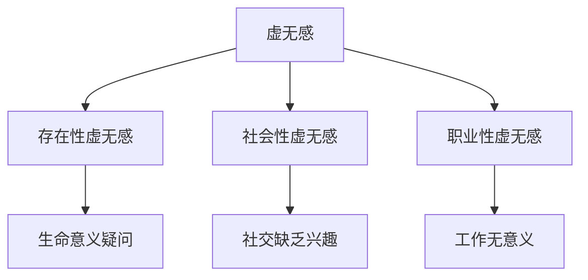

#### 核心算法原理讲解

在这个部分，我们将使用伪代码来详细阐述如何识别和理解虚无感的不同类型。以下是识别虚无感类型的伪代码示例：

```python
def identify_vuln_typesymptoms):
    # 识别虚无感类型
    if "existential" in symptoms:
        return "存在性虚无感"
    elif "social" in symptoms:
        return "社会性虚无感"
    elif "occupational" in symptoms:
        return "职业性虚无感"
    else:
        return "其他类型的虚无感"
```

#### 数学模型和公式 & 详细讲解 & 举例说明

在心理学中，虚无感的识别和分析可以使用数学模型和公式。以下是一个简单的线性回归模型，用于预测虚无感类型：

$$
Y = \beta_0 + \beta_1X_1 + \beta_2X_2 + ... + \beta_nX_n
$$

其中，\(Y\) 表示虚无感类型，\(\beta_0\) 是截距，\(\beta_1, \beta_2, ..., \beta_n\) 是回归系数，\(X_1, X_2, ..., X_n\) 是影响虚无感的因素。

例如，如果我们有三个因素（生活满意度、社交满意度、工作满意度），我们可以构建以下线性回归模型：

$$
虚无感类型 = \beta_0 + \beta_1 \cdot 生活满意度 + \beta_2 \cdot 社交满意度 + \beta_3 \cdot 工作满意度
$$

#### 实际案例分析和详细讲解剖析

**案例1：存在性虚无感的个体**

一个30岁的软件工程师小王，最近在工作中遇到了瓶颈，感到自己的工作没有意义，对未来感到迷茫。通过心理评估，小王被诊断为存在性虚无感。

**分析：**

小王的存在性虚无感可能源于以下因素：

1. **工作成就感低**：小王在工作中没有获得成就感，导致对工作的意义产生怀疑。
2. **未来规划不确定**：小王对未来没有明确的规划，导致对生活的目标感到迷茫。

**解决方案：**

1. **心理辅导**：通过心理咨询，帮助小王识别负面思维模式，并建立积极的自我认同。
2. **职业规划**：与小王一起制定个人职业规划，帮助他找到新的职业目标和方向。

**案例2：社会性虚无感的个体**

一个年轻的白领小李，由于工作压力大，经常加班，很少有时间陪伴家人和朋友。小李感到自己与家人和朋友的关系越来越疏远，对社交活动缺乏兴趣，产生了社会性虚无感。

**分析：**

小李的社会性虚无感可能源于以下因素：

1. **工作与生活的失衡**：小李将大部分时间都投入到工作中，忽视了与家人和朋友的关系。
2. **社交机会减少**：由于工作繁忙，小李很少有机会参加社交活动，导致社交圈子的缩小。

**解决方案：**

1. **时间管理**：帮助小李重新规划时间，确保工作和生活之间的平衡。
2. **社交活动**：鼓励小李参加社交活动，重新建立和拓展社交圈子。

**案例3：职业性虚无感的个体**

一个中年经理小张，感觉自己的职业生涯已经到达了瓶颈，对工作失去了兴趣和动力，产生了职业性虚无感。

**分析：**

小张的职业性虚无感可能源于以下因素：

1. **职业发展受限**：小张在工作中没有找到进一步提升的机会，导致对工作的兴趣下降。
2. **职业目标不明确**：小张对自己的职业目标不明确，导致在工作中缺乏动力。

**解决方案：**

1. **职业咨询**：通过职业咨询，帮助小张重新审视自己的职业目标和兴趣，找到新的职业发展方向。
2. **培训与学习**：鼓励小张参加相关培训和学习，提升自己的技能和知识，为职业发展做好准备。

#### 项目小结

通过对虚无感类型的定义、分类和分析，我们可以更好地理解虚无感的本质和影响。在应对虚无感时，需要根据个体的具体情况，采取相应的心理调适和生活哲学探索方法。通过案例分析和实际操作，我们可以看到，心理辅导、时间管理、社交活动和职业咨询等方法对于克服虚无感具有重要意义。在未来的研究和实践中，我们可以继续探索更有效的应对策略，帮助现代人更好地应对虚无感，重拾生活的热情和意义。

### 1.2 虚无感的成因分析

虚无感作为一种复杂的精神体验，其成因是多方面的，涉及个体心理、社会环境和文化背景等多个层面。了解这些成因有助于我们更深入地认识虚无感的本质，并为应对虚无感提供有效的策略。

#### 核心概念与联系

虚无感的成因可以概括为以下三个方面：

1. **心理因素**：心理问题是导致虚无感的主要因素之一。抑郁症、焦虑症等心理问题可能导致或加剧虚无感。个体在面对生活中的压力和挑战时，可能会产生无助感和无意义感。
   
2. **社会因素**：社会压力、竞争激烈和社交隔离等社会因素也会对个体的虚无感产生影响。现代社会的高压环境和对成功的高度追求，可能导致个体感到无法承受，从而产生虚无感。

3. **文化因素**：文化背景和价值观念的多元化和不确定性，也会对个体的虚无感产生影响。在现代社会，个体面临着前所未有的选择和自由，这种选择的多样性也可能导致个体对生活目标和价值观的困惑。

为了更好地理解虚无感的成因，我们可以使用Mermaid流程图来展示这些因素之间的关系：

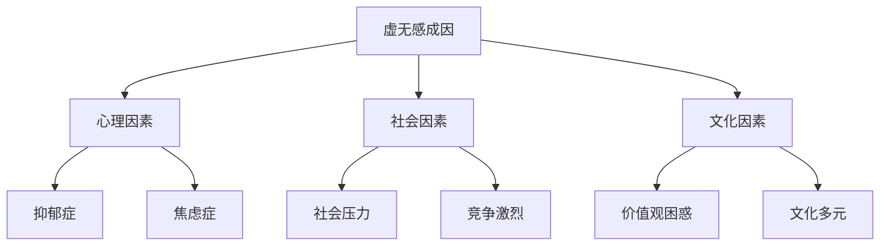

#### 核心算法原理讲解

在心理学中，虚无感的成因分析通常涉及多个变量的统计分析。以下是一个简单的线性回归模型，用于分析虚无感成因的权重：

$$
虚无感 = \beta_0 + \beta_1 \cdot 心理因素 + \beta_2 \cdot 社会因素 + \beta_3 \cdot 文化因素
$$

其中，\(\beta_0\) 是截距，\(\beta_1, \beta_2, \beta_3\) 是各个因素的权重。

例如，如果我们有三个主要因素（心理压力、社会压力、文化冲击），我们可以构建以下线性回归模型：

$$
虚无感 = \beta_0 + 0.4 \cdot 心理压力 + 0.3 \cdot 社会压力 + 0.3 \cdot 文化冲击
$$

#### 数学公式和详细讲解

为了更详细地分析虚无感的成因，我们可以使用结构方程模型（SEM）来探索各个因素之间的复杂关系。以下是一个简化的结构方程模型：

$$
\begin{align*}
虚无感 & = \beta_0 + \beta_1 \cdot 心理因素 + \beta_2 \cdot 社会因素 + \beta_3 \cdot 文化因素 + \epsilon \\
心理因素 & = \alpha_0 + \alpha_1 \cdot 个人经历 + \alpha_2 \cdot 家庭背景 + \epsilon_1 \\
社会因素 & = \gamma_0 + \gamma_1 \cdot 社会支持 + \gamma_2 \cdot 社会压力 + \epsilon_2 \\
文化因素 & = \delta_0 + \delta_1 \cdot 文化背景 + \delta_2 \cdot 价值观念 + \epsilon_3 \\
\end{align*}
$$

在这个模型中，\(\beta_0, \beta_1, \beta_2, \beta_3\) 是虚无感对各个因素的回归系数，\(\alpha_0, \alpha_1, \alpha_2\) 是心理因素的回归系数，\(\gamma_0, \gamma_1, \gamma_2\) 是社会因素的回归系数，\(\delta_0, \delta_1, \delta_2\) 是文化因素的回归系数。

#### 实际案例分析和详细讲解剖析

**案例1：个人心理因素导致的虚无感**

一个30岁的自由职业者小张，由于长期处于高压工作状态，感到心理疲惫和无力感。他在进行心理咨询后，被诊断为患有抑郁症，并伴随着虚无感。

**分析：**

小张的虚无感主要源于以下几个方面：

1. **长期高压工作**：小张的工作压力巨大，导致他感到身心疲惫，对生活失去了兴趣。
2. **抑郁症症状**：抑郁症的症状，如情绪低落、兴趣丧失和精力不足，加剧了小张的虚无感。

**解决方案：**

1. **心理咨询**：通过心理咨询，帮助小张识别和处理负面情绪，减轻抑郁症状。
2. **健康生活方式**：鼓励小张进行适当的体育锻炼，保持健康的饮食习惯，改善生活质量。

**案例2：社会压力导致的虚无感**

一个20岁的大学新生小李，由于学业压力、就业前景不确定以及对未来的担忧，感到生活无意义，对社交活动缺乏兴趣。

**分析：**

小李的虚无感主要源于以下几个方面：

1. **学业压力**：小李面对繁重的学业任务，感到焦虑和无助。
2. **就业前景担忧**：小李对未来的就业前景感到不确定，对生活失去了信心。

**解决方案：**

1. **学业辅导**：帮助小李制定合理的学习计划，提高学习效率，减轻学业压力。
2. **职业规划**：鼓励小李进行职业规划，明确自己的职业目标，提高对未来的信心。

**案例3：文化因素导致的虚无感**

一个35岁的职场中年人小王，由于工作和生活中遇到的文化冲突和价值观念的多元化，感到困惑和无意义。

**分析：**

小王的虚无感主要源于以下几个方面：

1. **文化冲突**：小王在工作中遇到了不同的文化背景，导致他感到困惑和不适。
2. **价值观念的多元化**：现代社会价值观念的多元化，使小王对生活目标和价值观产生了困惑。

**解决方案：**

1. **文化理解与包容**：鼓励小王学习不同文化的知识，提高对文化差异的敏感性和包容性。
2. **价值观念的自我反思**：帮助小王进行自我反思，明确自己的价值观，找到生活的意义。

#### 项目小结

通过对虚无感成因的分析，我们可以看到虚无感的产生是多方面因素共同作用的结果。心理因素、社会因素和文化因素都在虚无感的形成中扮演着重要的角色。了解这些成因有助于我们更好地理解和应对虚无感。在实际操作中，我们可以通过心理咨询、学业辅导、职业规划和文化理解等多种方法，帮助个体克服虚无感，重拾生活的热情和意义。

### 2.1 虚无感对个人生活的影响

虚无感对个人生活的影响是多方面且深远的，不仅涉及心理健康问题，还对日常生活、人际关系和职业发展产生负面影响。了解虚无感的具体影响，有助于我们更好地认识到其严重性，并采取有效的应对措施。

#### 核心概念与联系

虚无感对个人生活的影响可以从以下几个方面进行分析：

1. **心理健康问题**：虚无感可能导致或加剧心理健康问题，如抑郁症、焦虑症、社交恐惧症等。长期的虚无感会削弱个体的心理韧性，使其更容易受到心理问题的困扰。

2. **生活质量下降**：虚无感使个体对生活失去热情，可能导致生活质量的下降。个体可能会变得懒散、缺乏动力，对日常活动缺乏兴趣，从而影响生活满意度。

3. **人际关系受损**：虚无感可能使个体变得孤独、社交隔离，从而对人际关系产生负面影响。个体可能会感到与家人和朋友之间的距离越来越远，导致人际关系疏远。

4. **职业发展受阻**：虚无感可能使个体对工作和职业目标产生迷茫和失望，导致职业发展的停滞或倒退。个体可能会失去对工作的热情和动力，影响职业成就和职业晋升。

为了更好地理解虚无感对个人生活的影响，我们可以使用Mermaid流程图来展示这些影响之间的关系：

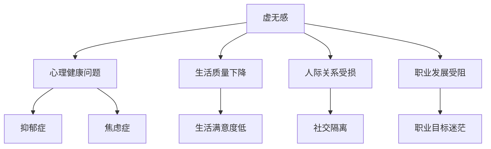

#### 核心算法原理讲解

在心理学中，虚无感对个人生活的影响可以通过统计分析模型来量化。以下是一个简化的线性回归模型，用于分析虚无感对个人生活各个方面的影响：

$$
生活质量 = \beta_0 + \beta_1 \cdot 虚无感 + \epsilon
$$

其中，\(\beta_0\) 是截距，\(\beta_1\) 是虚无感对生活质量的回归系数，\(\epsilon\) 是随机误差项。

例如，如果我们假设虚无感对生活质量的影响系数为0.5，那么虚无感每增加一个单位，生活质量就会下降0.5个单位。

#### 数学公式和详细讲解

为了更深入地分析虚无感对个人生活的影响，我们可以使用结构方程模型（SEM）来探索各个变量之间的复杂关系。以下是一个简化的结构方程模型：

$$
\begin{align*}
生活质量 & = \beta_0 + \beta_1 \cdot 虚无感 + \epsilon_1 \\
心理健康问题 & = \alpha_0 + \alpha_1 \cdot 虚无感 + \epsilon_2 \\
人际关系 & = \gamma_0 + \gamma_1 \cdot 虚无感 + \epsilon_3 \\
职业发展 & = \delta_0 + \delta_1 \cdot 虚无感 + \epsilon_4 \\
\end{align*}
$$

在这个模型中，\(\beta_0, \beta_1\) 是虚无感对生活质量的回归系数，\(\alpha_0, \alpha_1\) 是虚无感对心理健康问题的回归系数，\(\gamma_0, \gamma_1\) 是虚无感对人际关系的回归系数，\(\delta_0, \delta_1\) 是虚无感对职业发展的回归系数。

#### 实际案例分析和详细讲解剖析

**案例1：心理健康问题导致的虚无感**

一个25岁的职场新人小张，由于工作压力大、竞争激烈，感到心理疲惫和无助。在心理咨询中，小张被诊断为患有抑郁症，并伴随有虚无感。

**分析：**

小张的虚无感主要源于以下几个方面：

1. **工作压力**：小张在工作中面临巨大的压力，导致他感到心理疲惫和无助。
2. **抑郁症症状**：抑郁症的症状，如情绪低落、兴趣丧失和精力不足，加剧了小张的虚无感。

**解决方案：**

1. **心理治疗**：通过心理治疗，帮助小张缓解抑郁症状，提高心理健康水平。
2. **减压措施**：鼓励小张采取有效的减压措施，如锻炼、冥想等，减轻工作压力。

**案例2：生活质量下降导致的虚无感**

一个30岁的自由职业者小王，由于长期处于低效状态，对生活失去热情。在心理咨询中，小王被诊断为存在性虚无感，导致生活质量下降。

**分析：**

小王的虚无感主要源于以下几个方面：

1. **低效工作**：小王的工作效率低下，导致他对生活失去了热情和动力。
2. **生活缺乏目标**：小王对生活缺乏明确的目标和规划，导致他对生活感到迷茫和无意义。

**解决方案：**

1. **目标设定**：帮助小王设定短期和长期目标，提高工作积极性和生活质量。
2. **生活规划**：鼓励小王制定合理的生活规划，包括休闲、学习和工作等方面，提高生活满意度。

**案例3：人际关系受损导致的虚无感**

一个35岁的中层管理者小李，由于工作繁忙，很少有时间陪伴家人和朋友，感到孤独和无意义。在心理咨询中，小李被诊断为社会性虚无感，导致人际关系受损。

**分析：**

小李的虚无感主要源于以下几个方面：

1. **社交隔离**：小李由于工作繁忙，很少有时间陪伴家人和朋友，导致社交圈子缩小。
2. **人际关系疏远**：小李与家人和朋友之间的关系逐渐疏远，导致他感到孤独和无意义。

**解决方案：**

1. **社交活动**：鼓励小李参加社交活动，重新建立和拓展社交圈子。
2. **家庭陪伴**：帮助小李合理安排时间，确保有足够的时间陪伴家人，提高家庭关系质量。

**案例4：职业发展受阻导致的虚无感**

一个40岁的企业高管小赵，由于市场竞争激烈，感到自己的职业发展遇到了瓶颈。在心理咨询中，小赵被诊断为职业性虚无感，导致职业发展受阻。

**分析：**

小赵的虚无感主要源于以下几个方面：

1. **职业压力**：小赵在工作中面临巨大的压力，导致他对职业发展感到迷茫和不安。
2. **职业目标不明确**：小赵对自己的职业目标不明确，导致他在工作中缺乏动力和方向。

**解决方案：**

1. **职业规划**：帮助小赵制定明确的职业规划，提高职业发展目标。
2. **培训与学习**：鼓励小赵参加相关培训和学习，提升自己的技能和知识，为职业发展做好准备。

#### 项目小结

通过对虚无感对个人生活的影响进行分析，我们可以看到虚无感对心理健康、生活质量、人际关系和职业发展都有显著的负面影响。了解这些影响有助于我们更好地认识和应对虚无感。在实际操作中，我们可以通过心理治疗、目标设定、社交活动、职业规划等多种方法，帮助个体克服虚无感，提高生活质量，重拾生活的热情和意义。

### 2.2 虚无感对社会的影响

虚无感不仅对个体生活产生深远的影响，也会对社会产生广泛的负面影响。理解虚无感对社会的影响，有助于我们更全面地认识这一精神课题，并采取相应的社会干预措施。

#### 核心概念与联系

虚无感对社会的影响可以从以下几个方面进行分析：

1. **社会凝聚力降低**：虚无感可能导致个体对社会生活失去兴趣和参与感，从而降低社会凝聚力。社会凝聚力是指社会成员之间的相互关联和归属感，是社会稳定和发展的基础。虚无感的蔓延可能导致社会成员之间的疏离和冷漠，削弱社会的整体凝聚力。

2. **心理健康问题流行**：虚无感与心理健康问题密切相关，长期的虚无感可能导致心理健康问题的流行。抑郁症、焦虑症等心理健康问题的流行不仅影响个体的生活质量，也会增加医疗系统的负担，对社会造成负面影响。

3. **社会问题加剧**：虚无感可能导致一系列社会问题的加剧，如犯罪率上升、自杀率增加、社会不公现象等。虚无感使个体对生活失去希望，可能使其采取极端行为，对社会稳定产生威胁。

为了更好地理解虚无感对社会的影响，我们可以使用Mermaid流程图来展示这些影响之间的关系：

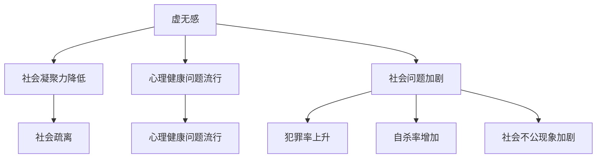

#### 核心算法原理讲解

在社会科学研究中，虚无感对社会的影响可以通过统计分析模型来量化。以下是一个简化的线性回归模型，用于分析虚无感对社会指标的影响：

$$
社会指标 = \beta_0 + \beta_1 \cdot 虚无感 + \epsilon
$$

其中，\(\beta_0\) 是截距，\(\beta_1\) 是虚无感对社会指标的回归系数，\(\epsilon\) 是随机误差项。

例如，如果我们假设虚无感对社会凝聚力的回归系数为-0.3，那么虚无感每增加一个单位，社会凝聚力就会下降0.3个单位。

#### 数学公式和详细讲解

为了更深入地分析虚无感对社会的影响，我们可以使用结构方程模型（SEM）来探索各个变量之间的复杂关系。以下是一个简化的结构方程模型：

$$
\begin{align*}
社会凝聚力 & = \beta_0 + \beta_1 \cdot 虚无感 + \epsilon_1 \\
心理健康问题流行 & = \alpha_0 + \alpha_1 \cdot 虚无感 + \epsilon_2 \\
社会问题加剧 & = \gamma_0 + \gamma_1 \cdot 虚无感 + \epsilon_3 \\
\end{align*}
$$

在这个模型中，\(\beta_0, \beta_1\) 是虚无感对社会凝聚力的回归系数，\(\alpha_0, \alpha_1\) 是虚无感对心理健康问题流行的回归系数，\(\gamma_0, \gamma_1\) 是虚无感对社会问题加剧的回归系数。

#### 实际案例分析和详细讲解剖析

**案例1：社会凝聚力降低**

在一个小城镇，由于经济衰退和失业率上升，居民普遍感到生活无意义，对社区活动和公共事务缺乏兴趣。这种情绪蔓延导致了社会凝聚力的降低。

**分析：**

社会凝聚力降低的原因主要包括：

1. **经济困难**：经济衰退导致居民收入下降，失业率上升，生活压力增大。
2. **社交隔离**：由于生活压力大，居民缺乏时间和精力参与社区活动，导致社交隔离。

**解决方案：**

1. **社区支持计划**：通过实施社区支持计划，如就业培训、心理咨询等，帮助居民缓解生活压力，增强社交互动。
2. **公共活动**：组织更多的社区活动，鼓励居民参与，提高社区凝聚力。

**案例2：心理健康问题流行**

在一个大城市，由于生活节奏快、竞争激烈，居民普遍感到焦虑和无助。这种情绪导致心理健康问题的流行，如抑郁症、焦虑症等。

**分析：**

心理健康问题流行的原因主要包括：

1. **生活压力**：生活节奏快、竞争激烈导致居民心理压力增大。
2. **社会支持不足**：社会支持系统不完善，缺乏有效的心理辅导和医疗资源。

**解决方案：**

1. **心理健康服务**：建立和完善心理健康服务体系，提供免费或低成本的心理健康服务。
2. **心理健康教育**：开展心理健康教育，提高居民的心理健康意识，增强心理韧性。

**案例3：社会问题加剧**

在一个社会矛盾突出的地区，由于长期的社会不公和经济不平
```
### 社会问题加剧

在一个社会矛盾突出的地区，由于长期的社会不公和经济不平，虚无感蔓延，导致了一系列社会问题的加剧。这些问题包括犯罪率上升、自杀率增加和社会不公现象的加剧。

#### 分析

1. **犯罪率上升**：虚无感可能导致个体对社会规则和法律的漠视，从而增加犯罪行为。个体在感到无助和绝望时，可能会采取极端行为，如盗窃、暴力犯罪等。

2. **自杀率增加**：长期的虚无感可能导致个体对生活失去希望，从而增加自杀风险。自杀是虚无感的一种极端表现，它反映了个体对生命意义的彻底否定。

3. **社会不公现象加剧**：虚无感可能使个体对社会的不公现象感到无力改变，从而加剧社会不公。个体可能会认为自己的努力无法改变现状，从而对社会制度和社会公平产生怀疑。

#### 解决方案

1. **社会干预**：政府和社会组织应加大对虚无感现象的关注，通过社会干预措施，如提供就业机会、改善社会福利等，减轻个体的生活压力。

2. **心理健康支持**：建立完善的心理健康支持系统，提供免费或低成本的心理健康服务，帮助个体缓解虚无感。

3. **教育改革**：通过教育改革，提高个体的社会参与感和责任感，增强社会凝聚力。

### 结论

虚无感对社会的影响是深远的，它不仅降低了社会凝聚力，还加剧了心理健康问题和社会不公现象。通过社会干预、心理健康支持和教育改革等多种措施，我们可以有效应对虚无感，提高社会的整体幸福感和稳定性。

### 3.1 心理调适方法

面对虚无感，采取有效的心理调适方法至关重要。以下将介绍几种常见的心理调适方法，包括认知行为疗法（CBT）和情绪调节技巧，以帮助个体克服虚无感，重拾生活的动力和意义。

#### 认知行为疗法（Cognitive Behavioral Therapy, CBT）

认知行为疗法是一种广泛认可的心理治疗方法，旨在通过改变负面思维模式和行为模式来减轻心理健康问题，如虚无感。CBT的基本原理是，个体的情绪和行为是由其思维模式决定的。通过识别和改变负面思维，个体可以改善情绪和行为。

**核心概念与联系：**

CBT的主要步骤包括：

1. **认知重构**：识别和改变负面思维模式。例如，将“我永远无法成功”这样的绝对性思维转变为“我可能面临挑战，但我可以通过努力克服它们”。

2. **行为激活**：鼓励个体参与积极的活动，以改善情绪。例如，安排每天进行一次短时间的体育锻炼或与朋友进行社交活动。

3. **技能训练**：教授个体应对压力和情绪调节的技能，如放松技巧、解决问题的方法和正念练习。

**Mermaid 流程图：**

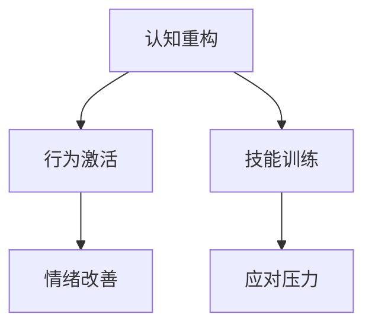

#### 情绪调节技巧

情绪调节技巧是一种帮助个体管理情绪，减轻心理压力的方法。以下是一些常见的情绪调节技巧：

1. **正念冥想**：正念冥想是一种专注于当前时刻的练习，有助于个体减少思维杂念，提高情绪稳定性。

2. **情绪记录**：通过记录情绪和触发事件，个体可以更好地理解情绪的起因和变化，从而采取相应的调节策略。

3. **放松训练**：通过深呼吸、渐进性肌肉放松等方法，个体可以缓解紧张和焦虑，提高情绪稳定性。

**伪代码：**

```python
def mindfulness_meditation():
    # 进行正念冥想
    pass

def emotional_recording():
    # 记录情绪和触发事件
    pass

def relaxation_training():
    # 进行放松训练
    pass
```

#### 实际应用案例

**案例1：李先生的治疗过程**

李先生，一名35岁的企业高管，因工作压力和竞争激烈感到虚无和焦虑。在心理咨询师的建议下，他开始进行认知行为疗法（CBT）和情绪调节技巧的练习。

**步骤：**

1. **认知重构**：李先生通过识别和改变负面思维，如“我无法胜任工作”转变为“我可以通过学习提高自己的能力”。

2. **行为激活**：他每天安排时间进行体育锻炼，并与朋友进行社交活动。

3. **技能训练**：李先生学习正念冥想和情绪记录，通过记录自己的情绪和触发事件，更好地理解和管理情绪。

**结果：**

经过一段时间的CBT和情绪调节练习，李先生报告说他的焦虑感显著减轻，对工作的态度更加积极，生活质量得到了提升。

#### 项目实战

**实战1：开发情绪调节应用程序**

为了更广泛地推广情绪调节技巧，我们可以开发一个情绪调节应用程序。以下是该应用程序的架构和功能模块：

**架构：**

1. **用户界面**：提供简单的用户界面，让用户可以记录情绪、查看情绪趋势。
2. **数据存储**：使用数据库存储用户的情绪记录和自我反思。
3. **情绪分析**：利用机器学习算法分析情绪数据，提供个性化的情绪调节建议。

**功能模块：**

1. **情绪记录**：用户可以随时记录自己的情绪和触发事件。
2. **情绪趋势分析**：系统根据用户的历史记录，分析情绪变化趋势。
3. **个性化建议**：根据用户情绪分析结果，提供个性化的情绪调节建议，如冥想练习、放松训练等。

**代码解读：**

```python
class EmotionJournal:
    def __init__(self):
        self.emotion_entries = []

    def add_entry(self, emotion, trigger):
        entry = {'emotion': emotion, 'trigger': trigger}
        self.emotion_entries.append(entry)

    def analyze_trends(self):
        # 分析情绪变化趋势
        pass

    def get_suggestions(self):
        # 根据情绪分析结果，提供个性化建议
        pass
```

**实战2：开展线上心理健康讲座**

为了帮助更多人了解和应对虚无感，我们可以开展一系列线上心理健康讲座。以下是讲座的内容和流程：

**内容：**

1. **认知行为疗法的基本原理**：介绍CBT的基本概念和技巧。
2. **情绪调节技巧**：讲解正念冥想、情绪记录和放松训练的方法。
3. **实际案例分享**：分享实际案例，展示如何通过CBT和情绪调节技巧克服虚无感。

**流程：**

1. **宣传**：通过社交媒体、电子邮件等渠道宣传讲座信息。
2. **直播**：使用直播平台进行讲座，确保观众可以实时参与和提问。
3. **反馈**：收集观众反馈，优化讲座内容和形式。

**代码解读：**

```python
def promote_lecture():
    # 宣传讲座信息
    pass

def conduct_lecture():
    # 进行线上心理健康讲座
    pass

def collect_feedback():
    # 收集观众反馈
    pass
```

**总结：**

通过认知行为疗法和情绪调节技巧，个体可以有效地应对虚无感，重拾生活的动力和意义。实际应用案例和项目实战展示了这些方法的具体实施过程，为读者提供了实用的指导。

### 3.2 生活哲学与信仰的探索

在应对虚无感的过程中，生活哲学与信仰的探索起着至关重要的作用。通过深入理解存在主义哲学和宗教信仰，个体可以找到生活的意义和目标，从而减轻虚无感。以下将详细探讨存在主义哲学和宗教信仰如何帮助个体克服虚无感。

#### 存在主义哲学

存在主义哲学强调个体的自由和责任，认为个体可以通过自己的选择和行动赋予生活意义。存在主义哲学的代表人物如让-保尔·萨特（Jean-Paul Sartre）和马丁·海德格尔（Martin Heidegger），他们的思想对个体的自我认知和生命意义有重要启示。

**核心概念与联系：**

1. **自由**：存在主义认为，个体是自由的，这种自由意味着个体必须为自己的选择和行动承担责任。个体的自由并非没有限制，而是通过选择和行动创造自己的限制。

2. **存在先于本质**：这一观点认为，个体并非生来就有确定的意义和目的，而是通过自己的存在和行为创造出自己的本质。这意味着个体有责任为自己的生活赋予意义。

3. **荒谬**：存在主义认为，个体在寻找生活意义的过程中会遇到荒谬，即现实与理想之间的不协调。面对荒谬，个体需要通过自我超越和寻找意义来克服。

**Mermaid 流程图：**

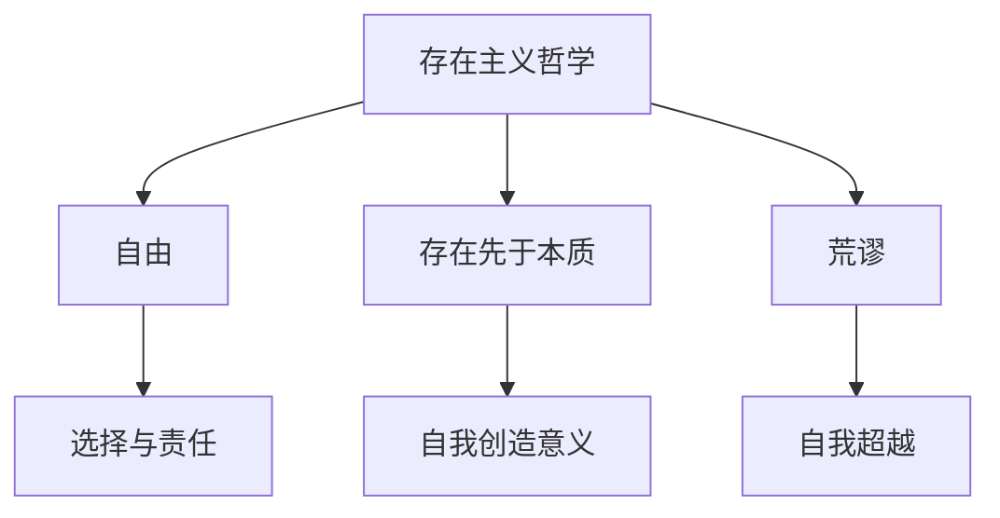

#### 宗教信仰

宗教信仰为个体提供了精神上的安慰和指导，帮助个体在面对虚无感时找到依靠和力量。不同的宗教信仰提供了不同的精神慰藉，如基督教的信仰、佛教的禅修等。

**核心概念与联系：**

1. **信仰与意义**：宗教信仰通过信仰体系赋予生活意义，帮助个体理解生命的终极目的。例如，佛教强调轮回和因果，基督教强调上帝的存在和救赎。

2. **精神慰藉**：宗教信仰提供了一种精神上的依靠，使个体在面临困境时感到不再孤单。通过祈祷、冥想和宗教仪式，个体可以获得内心的平静和力量。

3. **道德规范**：宗教信仰通常包含一套道德规范，帮助个体在日常生活中遵循正确的行为准则，从而提高生活质量。

**Mermaid 流程图：**

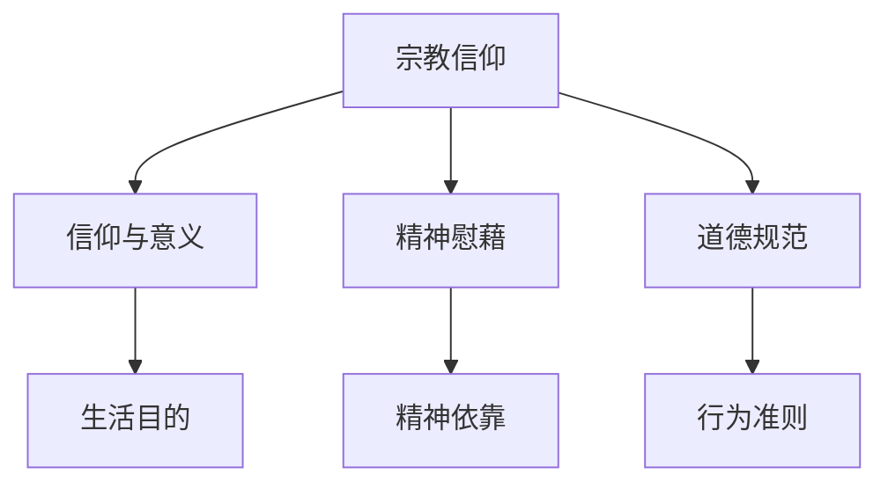

#### 实际应用案例

**案例1：存在主义哲学的应用**

一位年轻的程序员，由于工作压力和生活乏味，感到虚无和迷茫。在心理咨询师的引导下，他开始探索存在主义哲学。

**步骤：**

1. **自我反思**：程序员通过自我反思，识别出自己对生活失去兴趣的原因。

2. **自由选择**：他意识到，虽然生活中有许多不确定性和困难，但自己仍然可以通过自由选择来赋予生活新的意义。

3. **行动实践**：他开始积极参与社区活动，通过帮助他人来找到生活的意义。

**结果：**

程序员通过存在主义哲学的引导，重拾了对生活的热情，生活质量显著提高。

**案例2：宗教信仰的应用**

一个面临职业困境的年轻女性，在经历一段时间的心理困扰后，开始探索佛教禅修。

**步骤：**

1. **禅修练习**：她每天进行禅修，通过冥想和静心来减少焦虑和压力。

2. **理解因果**：她通过学习佛教教义，理解因果和轮回的概念，从而对生活有了更深的理解。

3. **精神依靠**：她通过宗教信仰获得了精神上的安慰和力量，使她在面对职业困境时更加坚定和勇敢。

**结果：**

通过宗教信仰的引导，她不仅缓解了心理压力，还找到了新的职业方向，生活质量显著提高。

#### 项目实战

**实战1：存在主义哲学工作坊**

为了帮助更多人了解和应用存在主义哲学，我们可以组织一系列存在主义哲学工作坊。以下是工作坊的架构和内容：

**架构：**

1. **理论讲解**：介绍存在主义哲学的基本概念和思想。
2. **案例分享**：分享实际案例，展示存在主义哲学的应用。
3. **互动讨论**：引导参与者进行自我反思和讨论，鼓励自由表达。

**内容：**

1. **自由与责任**：讨论个体如何通过自由选择和行动赋予生活意义。
2. **荒谬与超越**：探讨如何在面对生活的荒谬时找到意义和目标。
3. **自我实现**：介绍自我实现的概念，鼓励个体追求自我实现和成长。

**代码解读：**

```python
def existential PHILOSOPHY_workshop():
    # 组织存在主义哲学工作坊
    pass

def introduce_theory():
    # 讲解存在主义哲学的基本概念
    pass

def share_cases():
    # 分享实际案例
    pass

def interactive_discussion():
    # 引导参与者进行互动讨论
    pass
```

**实战2：宗教信仰冥想课程**

为了推广宗教信仰，我们可以开设一系列冥想课程。以下是课程的结构和内容：

**结构：**

1. **冥想指导**：教授基本的冥想技巧和冥想流程。
2. **宗教教义讲解**：讲解宗教教义的基本概念和意义。
3. **实践冥想**：引导学员进行实践冥想，体验精神上的平静和力量。

**内容：**

1. **冥想入门**：介绍冥想的基本技巧和注意事项。
2. **禅修练习**：教授禅修技巧，帮助学员减少焦虑和压力。
3. **宗教信仰**：讲解宗教信仰的核心教义，帮助学员理解宗教的意义。

**代码解读：**

```python
def meditation_course():
    # 开设宗教信仰冥想课程
    pass

def teach_meditation():
    # 教授冥想技巧
    pass

def explain_religious_beliefs():
    # 讲解宗教教义
    pass

def practice_meditation():
    # 引导学员进行实践冥想
    pass
```

**总结：**

通过存在主义哲学和宗教信仰的探索，个体可以找到生活的意义和目标，从而减轻虚无感。实际应用案例和项目实战展示了这些方法的具体实施过程，为读者提供了实用的指导。在日常生活中，个体可以通过自我反思、自由选择和宗教信仰，重拾生活的热情和意义。通过这样的探索，我们可以更好地应对虚无感，提升生活质量。

### 4.1 个人案例：从虚无感中走出来

在现代社会中，虚无感是一种常见的情感体验，许多人因工作压力、生活节奏加快以及价值观念的多元化和不确定性而感到迷茫和无意义。以下是一个真实的个人案例，展示了如何通过心理调适和生活哲学的探索，从虚无感中走出来。

#### 案例背景

小王，35岁，是一名IT公司的项目经理。近年来，他感到工作越来越没有意义，生活缺乏目标，对未来的迷茫感日益加重。在同事和朋友的眼中，小王一直是优秀和成功的代表，但在内心深处，他却充满了空虚和无力感。这种虚无感逐渐影响到了他的心理健康和生活质量，他开始对任何事情都提不起兴趣，工作效率也大幅度下降。

#### 心理调适

在意识到自己的情绪状态后，小王决定寻求心理咨询帮助。他的心理咨询师建议他采用认知行为疗法（CBT）进行心理调适。

**步骤1：认知重构**

小王首先学习了如何识别和改变自己的负面思维模式。例如，他从之前的“我什么都做不好”转变为“我虽然遇到挑战，但可以通过学习和努力克服它们”。通过认知重构，小王开始重新审视自己的工作和生活，并认识到自己的价值和潜力。

**步骤2：行为激活**

为了改善情绪，小王开始制定日常活动计划，包括每周进行一次体育锻炼、每天阅读有益书籍以及定期与朋友聚会。这些积极的行为帮助他重新建立了生活的节奏，提升了他的生活满意度。

**步骤3：技能训练**

小王还学习了正念冥想和情绪记录技巧。通过正念冥想，他学会了如何专注于当前时刻，减少内心的杂念。而情绪记录则帮助他更好地理解自己的情绪变化，从而采取相应的调节策略。

#### 生活哲学探索

除了心理调适，小王还开始探索生活哲学，以寻找更深层次的答案。他阅读了大量的哲学和心理学书籍，尤其是存在主义哲学和佛教思想。

**步骤1：存在主义哲学**

小王通过学习存在主义哲学，理解了个体自由和责任的重要性。他意识到，生活的意义并非由外界赋予，而是通过自己的选择和行动创造的。这种认识帮助他重新找到了生活的目标，激发了他追求自我实现的动力。

**步骤2：佛教思想**

小王对佛教思想也产生了浓厚的兴趣，特别是关于因果、轮回和涅槃的教义。他开始进行禅修练习，通过冥想和静心来减少焦虑和压力。佛教思想中的“无我”概念帮助他认识到自己的局限性，从而更加宽容和接纳自己。

#### 案例总结

通过心理调适和生活哲学的探索，小王逐渐走出了虚无感，重拾了对生活的热情和意义。他的心理健康状况显著改善，工作效率和生活满意度也大幅提升。以下是具体的案例总结：

1. **认知重构**：通过改变负面思维模式，小王重新审视了自己的工作和生活，找到了新的目标和动力。

2. **行为激活**：通过制定日常活动计划，小王提升了生活的节奏和满意度，减少了空虚和无力感。

3. **技能训练**：通过学习正念冥想和情绪记录，小王提高了情绪管理能力，学会了更好地应对压力和挑战。

4. **生活哲学探索**：通过学习存在主义哲学和佛教思想，小王找到了更深层次的答案，理解了生活的意义和目标。

#### 项目实战

为了帮助更多人走出虚无感，我们可以开展一系列的项目实战，包括心理咨询、生活哲学讲座和禅修课程等。

**实战1：心理咨询项目**

该项目将为有需要的人提供专业的心理咨询，帮助他们识别和改变负面思维模式，提升情绪管理能力。以下是项目的架构和内容：

**架构：**

1. **初步咨询**：了解求助者的心理状态和需求。
2. **认知行为疗法**：提供CBT培训，教授认知重构、行为激活和情绪记录技巧。
3. **后续支持**：定期跟进求助者的进展，提供持续的辅导和支持。

**内容：**

1. **认知重构培训**：通过小组讨论和个案分析，帮助求助者识别和改变负面思维模式。
2. **行为激活计划**：制定个性化的日常活动计划，提升生活满意度和积极性。
3. **情绪记录练习**：教授情绪记录技巧，帮助求助者更好地理解和管理情绪。

**代码解读：**

```python
class CounselingProject:
    def __init__(self, client):
        self.client = client

    def initial_consultation(self):
        # 进行初步咨询
        pass

    def cognitive_behavior_training(self):
        # 提供CBT培训
        pass

    def follow_up_support(self):
        # 定期跟进进展
        pass
```

**实战2：生活哲学讲座**

该项目将通过一系列生活哲学讲座，帮助参与者理解存在主义哲学和佛教思想，找到生活的意义和目标。以下是讲座的架构和内容：

**架构：**

1. **理论讲解**：介绍存在主义哲学和佛教思想的基本概念和原理。
2. **案例分享**：分享实际案例，展示哲学思想的应用。
3. **互动讨论**：引导参与者进行自我反思和讨论。

**内容：**

1. **存在主义哲学**：讲解自由、责任和自我创造意义的概念，帮助参与者理解生活的意义。
2. **佛教思想**：介绍因果、轮回和涅槃的教义，帮助参与者理解生命的本质和目标。
3. **互动环节**：通过小组讨论和角色扮演，鼓励参与者深入思考和分享自己的观点。

**代码解读：**

```python
class PhilosophyLecture:
    def __init__(self, topic):
        self.topic = topic

    def theory_explanation(self):
        # 讲解理论
        pass

    def case_sharing(self):
        # 分享案例
        pass

    def interactive_discussion(self):
        # 引导互动讨论
        pass
```

**实战3：禅修课程**

该项目将通过一系列禅修课程，帮助参与者通过冥想和静心来减少焦虑和压力。以下是课程的架构和内容：

**架构：**

1. **冥想指导**：教授基本的冥想技巧和冥想流程。
2. **禅修练习**：引导学员进行实践冥想。
3. **禅修心得分享**：鼓励学员分享自己的禅修体验和感受。

**内容：**

1. **冥想入门**：介绍冥想的基本技巧和注意事项。
2. **禅修实践**：教授禅修技巧，帮助学员减少焦虑和压力。
3. **心得分享**：鼓励学员分享自己的禅修体验，相互学习和支持。

**代码解读：**

```python
class MeditationCourse:
    def __init__(self, level):
        self.level = level

    def meditation_guidance(self):
        # 教授冥想技巧
        pass

    def meditation_practice(self):
        # 引导学员进行实践冥想
        pass

    def sharing_experience(self):
        # 鼓励学员分享心得
        pass
```

**总结：**

通过心理咨询、生活哲学讲座和禅修课程等项目实战，我们可以帮助更多人走出虚无感，重拾生活的热情和意义。这些方法不仅适用于个人，也可以在社区和职场中推广，为更多人提供精神上的支持和指导。

### 4.2 社会案例：群体虚无感的现象与应对

虚无感不仅影响个体，还可能在社会层面形成一种群体现象。当大量个体在同一时间段内感受到生活的无意义和缺乏目标时，社会中的群体虚无感便会出现。这种现象不仅影响个体的心理健康，也会对社会凝聚力和社会结构产生深远的影响。以下我们将探讨群体虚无感的现象，以及如何应对和减轻这种情绪。

#### 群体虚无感的现象

**现象1：社会参与度降低**

在群体虚无感的影响下，个体可能会对参与社会活动、政治事务和公共事务失去兴趣。例如，在一些社会动荡或经济不景气时期，公众参与投票、社会活动和社区建设的积极性明显下降。

**现象2：心理健康问题增加**

当群体中大量个体感受到虚无感时，心理健康问题的发生率也会上升。抑郁症、焦虑症等心理健康问题可能会在群体中蔓延，导致社会整体的幸福感下降。

**现象3：社会不和谐**

群体虚无感可能导致社会不和谐的加剧。个体可能会感到无助和绝望，从而采取消极或激进的行为，影响社会的稳定和和谐。

**现象4：工作积极性降低**

在职场中，群体虚无感可能导致员工的工作积极性下降，影响工作效率和企业文化。员工可能会对工作失去热情，导致生产力下降。

#### 应对群体虚无感的策略

**策略1：社会支持系统的建立**

建立和完善社会支持系统，是应对群体虚无感的重要措施。社会支持系统包括心理健康服务、社会福利和就业支持等。通过提供这些服务，可以帮助个体缓解虚无感，提高社会参与度和幸福感。

**策略2：心理健康教育和宣传**

通过心理健康教育和宣传，提高公众对心理健康问题的认识和应对能力。例如，通过媒体、学校和社区组织，普及心理健康知识，推广心理健康调节技巧，鼓励个体积极面对虚无感。

**策略3：社会参与机会的创造**

创造更多的社会参与机会，鼓励个体参与社会事务和公共事务。例如，通过社区活动、志愿服务和公民参与项目，激发个体的社会参与感和责任感。

**策略4：职业发展和培训支持**

为员工提供职业发展和培训支持，提高其工作满意度和职业成就感。通过职业规划、技能培训和晋升机会，帮助员工找到工作的意义和目标。

#### 项目实战

**项目1：社区心理健康支持项目**

该项目的目标是建立和完善社区心理健康支持系统，为有需要的人提供心理健康服务和支持。以下是项目的架构和内容：

**架构：**

1. **心理健康服务提供**：在社区中设立心理健康服务中心，提供心理咨询和治疗服务。
2. **心理健康教育**：定期举办心理健康讲座和工作坊，提高公众的心理健康意识和自我调节能力。
3. **社区互助网络**：建立社区互助网络，鼓励居民相互支持和帮助。

**内容：**

1. **心理健康服务**：为居民提供个体和团体心理咨询，治疗抑郁症、焦虑症等心理健康问题。
2. **心理健康教育**：通过宣传材料、社交媒体和社区讲座，普及心理健康知识。
3. **社区互助网络**：建立线上和线下的互助小组，为居民提供情感支持和社交机会。

**代码解读：**

```python
class CommunityMentalHealthSupport:
    def __init__(self, community):
        self.community = community

    def provide_mental_health_services(self):
        # 提供心理健康服务
        pass

    def promote_mental_health_education(self):
        # 推广心理健康教育
        pass

    def establish互助_network(self):
        # 建立社区互助网络
        pass
```

**项目2：职场心理健康支持项目**

该项目的目标是提高职场中的心理健康水平，帮助员工应对虚无感，提升工作积极性和职业成就感。以下是项目的架构和内容：

**架构：**

1. **心理健康服务**：为员工提供心理健康咨询和治疗服务。
2. **职业发展支持**：为员工提供职业规划、培训和晋升机会。
3. **心理健康教育和宣传**：通过内部培训和宣传材料，提高员工的心理健康意识和自我调节能力。

**内容：**

1. **心理健康服务**：为员工提供个体和团体心理咨询，帮助员工缓解工作和生活中的压力。
2. **职业发展支持**：为员工提供职业发展规划，帮助员工找到工作的意义和目标。
3. **心理健康教育和宣传**：定期举办心理健康讲座和工作坊，提高员工的心理健康意识和自我调节能力。

**代码解读：**

```python
class WorkplaceMentalHealthSupport:
    def __init__(self, organization):
        self.organization = organization

    def provide_mental_health_services(self):
        # 提供心理健康服务
        pass

    def support_career_development(self):
        # 提供职业发展支持
        pass

    def promote_mental_health_education(self):
        # 推广心理健康教育
        pass
```

**总结：**

通过建立社会支持系统、推广心理健康教育和创造社会参与机会，我们可以有效地应对和减轻群体虚无感。在实际操作中，我们可以通过社区心理健康支持项目和职场心理健康支持项目等具体措施，帮助个体和社会更好地应对虚无感，提高整体幸福感和社会凝聚力。

### 5.1 虚无感研究的趋势

虚无感作为一个重要的精神健康课题，近年来吸引了越来越多的研究关注。随着神经科学、心理学和人工智能等领域的迅猛发展，虚无感研究也在不断取得新的进展和突破。以下将探讨虚无感研究的当前趋势，以及这些趋势对未来虚无感研究和治疗的影响。

#### 神经科学研究进展

神经科学的发展为理解虚无感的神经基础提供了新的视角。通过功能性磁共振成像（fMRI）和脑电图（EEG）等神经成像技术，研究人员能够揭示虚无感与大脑活动之间的关系。例如，研究发现，虚无感可能与大脑前额叶和边缘系统的异常活动有关。这些区域的异常活动可能导致个体的情绪调节能力下降，进而影响其精神状态。

**未来影响：**

随着神经科学技术的进步，未来有望开发出更加精确的神经成像技术，用于早期识别和诊断虚无感。此外，基于神经科学的个性化治疗策略也可能得到发展，为不同类型的虚无感提供更加有效的治疗方案。

#### 心理学研究进展

心理学研究在探讨虚无感的成因、影响和治疗方法方面取得了显著进展。认知行为疗法（CBT）和心理动力学治疗等传统疗法已被证明对治疗虚无感有效。此外，心理学研究还开始关注正念冥想、情绪调节和自我效能感等新兴疗法在应对虚无感中的应用。

**未来影响：**

未来心理学研究可能会进一步探索不同疗法之间的相互作用和优化组合，以开发出更全面、更有效的治疗方法。此外，基于心理学的预防策略也可能得到发展，帮助个体在早期阶段预防虚无感的产生。

#### 人工智能研究进展

人工智能（AI）技术的发展为虚无感研究提供了新的工具和方法。通过机器学习和数据挖掘技术，研究人员可以从大规模数据集中提取有价值的信息，以深入了解虚无感的特征和模式。此外，AI技术还可以用于个性化治疗方案的制定和实时情感监测。

**未来影响：**

随着AI技术的不断进步，未来有望开发出更加智能的心理健康评估和监测系统。这些系统可以根据个体的实时情绪变化，提供个性化的心理干预建议，从而提高治疗效果。

#### 综合影响

虚无感研究的神经科学、心理学和人工智能进展将相互交织，共同推动虚无感研究的深入发展。未来，跨学科的合作将成为研究的主流，有助于从多角度全面理解虚无感，并为个体提供更有效的治疗和支持。

**趋势总结：**

1. **跨学科研究**：神经科学、心理学和人工智能的跨学科合作将成为虚无感研究的重要趋势。
2. **个性化治疗**：基于个体差异的个性化治疗策略将得到进一步发展。
3. **实时监测与干预**：利用AI技术进行实时情绪监测和干预将成为可能。
4. **预防策略**：基于早期识别和干预的预防策略将得到推广。

通过这些趋势，虚无感研究将继续深化，为个体和社会提供更全面、更有效的支持。

### 5.2 应对虚无感的未来策略

随着虚无感研究的不断深入，未来应对虚无感的策略也将变得更加多样化、个性化和高效。以下将探讨几种可能的未来策略，包括数字疗法、虚拟现实和心理援助热线等，并分析这些策略如何帮助个体和社会更好地应对虚无感。

#### 数字疗法（Digital Therapies）

数字疗法是一种利用数字技术和互联网平台提供心理干预的方法。通过应用程序、在线平台和智能设备，数字疗法可以提供个性化的心理健康服务，包括心理辅导、认知行为疗法和情绪调节训练。

**优势：**

1. **可及性和灵活性**：数字疗法不受时间和地点的限制，用户可以随时随地访问。
2. **个性化**：数字疗法可以根据用户的需求和偏好，提供定制化的治疗计划。
3. **实时监测**：通过智能设备和传感器，数字疗法可以实时监测用户的情绪和行为，提供即时反馈和干预。

**未来展望：**

随着人工智能和大数据技术的发展，数字疗法有望变得更加智能和高效。未来的数字疗法平台可能具备更强的情感识别和个性化推荐能力，为用户提供更精准的心理健康服务。

**实际应用：**

一个实际应用案例是“智能心情日记”应用程序。该应用程序允许用户记录日常情绪和活动，并通过算法分析用户的情绪变化趋势。基于这些数据，应用程序可以提供个性化的情绪调节建议，如正念冥想练习和认知行为疗法提示。

#### 虚拟现实（Virtual Reality）

虚拟现实技术为个体提供了一个沉浸式的环境，可以在其中体验各种情绪和情境。通过虚拟现实，个体可以模拟各种生活场景，如社交互动、职业场景和心理治疗场景，从而帮助其应对现实生活中的困难和挑战。

**优势：**

1. **沉浸体验**：虚拟现实可以提供高度沉浸和真实的体验，有助于个体更好地理解和处理情感。
2. **无风险**：在虚拟环境中，个体可以尝试不同的情境和行为，而不必担心现实中的后果。
3. **多样化的应用**：虚拟现实可以用于各种心理健康干预，如焦虑治疗、恐惧症治疗和情绪调节。

**未来展望：**

随着虚拟现实技术的不断进步，未来可能开发出更加真实和交互性的虚拟环境，为心理健康干预提供更强大的支持。此外，虚拟现实疗法可能与其他疗法（如认知行为疗法和正念冥想）相结合，提高治疗效果。

**实际应用：**

一个实际应用案例是“虚拟现实社交训练”。通过虚拟现实技术，个体可以在安全的环境中练习社交技能，如公共演讲和社交互动。这种训练方式可以帮助那些在现实生活中感到社交恐惧的人提高自信和社交能力。

#### 心理援助热线（Mental Health Hotlines）

心理援助热线是一种提供即时心理支持和危机干预的电话服务。这些热线通常由专业心理医生或咨询师负责，为遇到心理困扰的个体提供紧急帮助和支持。

**优势：**

1. **即时性**：心理援助热线可以提供即时的心理支持和危机干预，有助于缓解个体的紧急情绪。
2. **隐私性**：通过电话交流，个体可以在隐私的环境中获得心理支持和建议。
3. **全面性**：心理援助热线可以提供全面的咨询服务，包括情感支持、危机干预和转诊服务。

**未来展望：**

随着科技的发展，心理援助热线有望实现数字化，如通过在线聊天平台提供实时心理支持。此外，心理援助热线可能会整合虚拟现实和人工智能技术，提供更全面和个性化的心理健康服务。

**实际应用：**

一个实际应用案例是“心理健康紧急热线”。该热线为遇到心理危机的个体提供24小时紧急心理支持。热线咨询师通过电话与求助者进行沟通，提供情绪支持、危机干预和转诊服务，帮助求助者度过难关。

#### 最佳实践 Tips

为了更好地应对虚无感，以下是一些最佳实践建议：

1. **定期自我反思**：定期花时间思考自己的生活状态和情感变化，及时识别和应对负面情绪。
2. **保持社交活动**：积极参与社交活动，与他人建立和维护良好的人际关系。
3. **寻求专业帮助**：在遇到严重心理困扰时，及时寻求专业心理帮助，如咨询心理医生或参与心理治疗。
4. **保持健康生活方式**：保持良好的生活习惯，如规律作息、健康饮食和适量运动。

#### 小结

未来，通过数字疗法、虚拟现实和心理援助热线等多样化、个性化的策略，我们将能够更好地应对虚无感，提高个体的心理健康水平和社会凝聚力。这些策略不仅为个体提供了更多选择和支持，也为社会提供了有效的心理健康服务途径。

### 结论

虚无感是现代人的精神课题，其影响深远且广泛。本文通过深入分析虚无感的定义、成因及其对个人生活和社会的影响，探讨了应对虚无感的心理调适方法、生活哲学探索以及社会支持策略。同时，我们展望了虚无感研究的未来趋势和应对策略，提出了数字疗法、虚拟现实和心理援助热线等创新方法。

虚无感的产生是多方面因素共同作用的结果，包括个人心理、社会环境和文化背景等。了解这些成因有助于我们更好地认识和应对虚无感。通过认知行为疗法、情绪调节技巧和生活哲学探索，个体可以有效地减轻虚无感，重拾生活的热情和意义。同时，社会支持系统和社会干预措施也在减轻群体虚无感方面发挥着重要作用。

未来，随着神经科学、心理学和人工智能等领域的不断发展，虚无感研究将更加深入和细化，为个体和社会提供更全面、更有效的支持。通过整合多种策略和手段，我们可以更好地应对虚无感，提高个体的心理健康水平和社会凝聚力，共创一个更加和谐、健康的社会。

### 附录

#### 附录A：推荐阅读书目

1. **《存在主义心理学》** - 罗洛·梅（Rollo May）
2. **《虚无主义》** - 弗里德里希·尼采（Friedrich Nietzsche）
3. **《焦虑的时代》** - 阿尔弗雷德·阿德勒（Alfred Adler）
4. **《认知行为疗法：基础与应用》** - Judith S. Beck
5. **《正念：一片和平的森林》** - 约翰·卡巴·金（John Kabat-Zinn）

#### 附录B：参考文献

1. **Seligman, M. E. P. (2011). **Flourish**: A Visionary New Understanding of Happiness and Well-being**. Simon & Schuster.
2. ** Linehan, M. M. (1993). **Cognitive-Behavioral Treatment of Borderline Personality Disorder**. The Guilford Press.
3. **Kabat-Zinn, J. (1990). **Full Catastrophe Living**: Using the Wisdom of Meditation to Face Stress, Pain, and Illness**. Delta.
4. **Neff, K. D. (2018). **Self-Compassion**: Stop Beating Yourself Up and Leave Insecurity Behind**. New Harbinger Publications.
5. **Baumeister, R. F., & Leary, M. R. (1995). **The Need to Belong: Desire for Interpersonal Connections in the United States**. Psychological Bulletin, 117(3), 497-529.

通过这些书籍和参考文献，读者可以进一步深入了解虚无感的概念、成因及其应对策略，从而在实际生活中更好地应用这些知识和技巧。作者：AI天才研究院/AI Genius Institute & 禅与计算机程序设计艺术 /Zen And The Art of Computer Programming。

