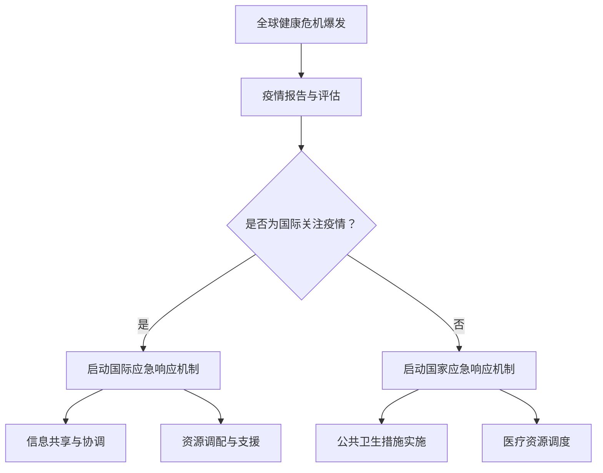
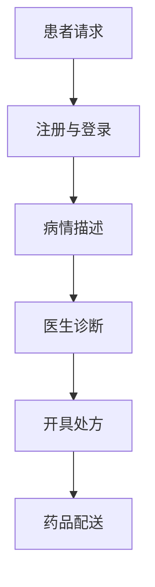

                 

### 文章标题

# 全球健康危机下的国际合作：跨越国界的人类命运共同体

### 关键词

- 全球健康危机
- 国际合作
- 人类命运共同体
- 健康危机应对
- 生物技术与信息技术

### 摘要

本文将探讨全球健康危机背景下国际合作的重要性及其在构建人类命运共同体中的角色。首先，我们将概述全球健康危机的定义、类型及其影响。接着，分析国际合作在健康危机中的现状与挑战，引入人类命运共同体的概念，阐述其核心内涵及与全球健康危机的关联。本文还将通过案例分析、国际合作机制与政策分析、技术创新在健康危机应对中的作用等方面，详细探讨国际合作的实践与未来展望，最终提出对策建议，以期为全球健康危机下的国际合作提供理论支持和实践指导。

### 引言

全球健康危机，是指影响全球范围内的公共卫生问题，包括传染病、慢性病、环境污染等。近年来，健康危机的频发和复杂化，使得国际合作成为解决问题的关键。随着全球化进程的加速，各国在政治、经济、文化等方面的联系日益紧密，全球健康危机的应对不再是一个国家或地区能够独立完成的任务，而需要国际社会共同努力。

在此背景下，构建人类命运共同体成为应对全球健康危机的重要理念。人类命运共同体旨在追求各国共同发展、共同繁荣，通过国际合作解决全球性问题。在健康危机下，人类命运共同体的理念强调各国应携手应对，共同提升全球公共卫生水平。

本文旨在探讨全球健康危机下的国际合作，分析国际合作在应对危机中的现状与挑战，探讨人类命运共同体的理念及其在健康危机应对中的作用。通过案例分析、国际合作机制与政策分析、技术创新在健康危机应对中的作用等方面，提出未来国际合作的发展方向与对策建议，以期为全球健康危机下的国际合作提供理论支持和实践指导。

### 全球健康危机概述

全球健康危机是一个广泛而复杂的概念，涵盖了从传染病到慢性病，再到环境污染等多个领域。根据世界卫生组织的定义，健康危机是指威胁到全球或区域公共健康的问题，其影响范围广泛，涉及人口众多，且可能迅速蔓延。健康危机的类型多样，主要包括传染性疾病危机、慢性疾病危机和环境健康危机。

传染性疾病危机，如新冠病毒（COVID-19）、流感、艾滋病等，具有传染性强、传播速度快、危害范围广等特点。这些疾病不仅对患者的生命健康构成威胁，还可能对社会经济造成重大影响。例如，新冠病毒的爆发导致了全球范围内的经济衰退、社会动荡和医疗资源短缺，使各国政府和国际组织面临巨大挑战。

慢性疾病危机，如心血管疾病、糖尿病、癌症等，虽然不像传染病那样具有高度传染性，但其影响同样深远。慢性疾病通常需要长期治疗和管理，不仅增加了患者的经济负担，还可能导致劳动力短缺和社会福利体系的压力。全球慢性疾病负担逐年增加，已成为影响全球健康的主要问题之一。

环境健康危机，如空气污染、水污染、气候变化等，也对全球健康产生重大影响。空气污染和水质污染可能导致呼吸系统疾病、消化系统疾病等，而气候变化则可能引发极端天气事件，如洪水、干旱、飓风等，对人类的健康和生存环境构成威胁。

健康危机的影响和挑战是多方面的。首先，健康危机对公共卫生系统造成巨大压力。许多国家和地区在面对突发公共卫生事件时，往往缺乏足够的医疗资源和专业人力，难以有效应对。其次，健康危机对社会经济产生深远影响。疾病爆发可能导致劳动力流失、企业倒闭、经济衰退，从而加剧社会不平等和贫困问题。最后，健康危机还可能导致社会动荡和政治不稳定。疾病的传播和蔓延可能引发社会恐慌和恐慌性消费，加剧社会矛盾和政治紧张。

总之，全球健康危机是一个复杂而严峻的问题，其类型多样、影响深远，不仅威胁到人类的生命健康，还对社会经济、政治稳定产生重大影响。因此，应对全球健康危机需要全球范围内的合作和共同努力。各国应加强信息共享、技术交流、资源调配，共同提升全球公共卫生水平，构建人类命运共同体，以应对未来可能出现的健康危机。

### 国际合作的现状与挑战

在全球健康危机的背景下，国际合作显得尤为重要。国际社会通过多种形式的合作，努力应对公共卫生挑战，维护全球健康。然而，尽管合作形式多样，实际操作中仍面临诸多挑战。

首先，国际合作的形式主要包括多边合作、双边合作和非政府组织合作。多边合作是通过国际组织和协议实现的，如世界卫生组织（WHO）、联合国教科文组织（UNESCO）等。这些国际组织在全球公共卫生政策制定、信息共享、技术支持等方面发挥着重要作用。双边合作则是指国家之间的直接合作，如疫苗研发、医疗援助等。这种合作形式较为灵活，能够迅速响应突发公共卫生事件。非政府组织合作，包括慈善机构、科研机构和民间组织，它们在全球健康危机中提供了大量的人力、物力和技术支持。

然而，国际合作在实际操作中面临诸多挑战。首先，信息不对称和透明度不足是一个主要问题。在全球健康危机中，各国之间的信息共享和质量存在差异，导致决策者难以全面了解危机的全貌，影响应对效果。其次，资源分配不均是另一个挑战。由于各国经济实力和发展水平的差异，资源分配往往不公平，导致一些国家和地区在应对健康危机时缺乏足够的资源和支持。此外，国际合作中的利益冲突和信任缺失也制约了合作的效果。各国在追求自身利益的同时，可能忽视全球公共利益，导致合作效率降低。

为了克服这些挑战，首先需要提高信息透明度和共享质量。各国应加强信息交流，通过建立共享平台，及时、准确、全面地传递疫情信息和科研进展。此外，应建立国际合作机制，明确合作目标和职责分工，确保各方的有效协作。其次，应优化资源分配机制，通过国际合作，实现资源的合理配置和高效利用。国际组织和国家应共同努力，确保发展中国家和贫困地区能够获得足够的医疗资源和援助。此外，应加强国际合作中的信任建设，通过建立信任机制和合作准则，减少利益冲突，提升合作效率。

总之，国际合作在应对全球健康危机中具有重要作用，但实际操作中面临诸多挑战。通过提高信息透明度、优化资源分配、加强信任建设，可以提升国际合作的效果，共同应对全球健康危机，构建人类命运共同体。

### 人类命运共同体的理念

人类命运共同体是一个重要的全球治理理念，旨在强调全球各国人民的共同利益和责任，通过国际合作共同应对全球性挑战。这一理念最早由中国国家主席习近平在2012年提出，并在之后的国际场合中得到广泛传播和认同。

人类命运共同体的核心内涵包括以下几个方面：

首先，人类命运共同体强调全球共同利益。在全球化的背景下，各国之间的联系日益紧密，一个国家的危机往往会影响其他国家。因此，人类命运共同体主张各国应超越狭隘的国家利益，关注全球公共利益，通过合作解决共同面临的挑战，如气候变化、贫困、疾病等。

其次，人类命运共同体倡导共建共享。这意味着全球各国应共同努力，推动全球发展和繁荣，使所有国家和人民都能够共享发展成果。这要求各国在经济发展、科技创新、文化教育等领域进行深入合作，实现资源的优化配置和高效利用。

第三，人类命运共同体主张合作共赢。各国应通过对话和协商，解决分歧和矛盾，推动国际关系的和平发展。在应对全球性挑战时，各国应相互支持，共同承担责任，避免单边主义和保护主义，构建公平、公正、合作、共赢的国际关系。

第四，人类命运共同体强调可持续发展。这一理念要求各国在经济发展过程中，注重环境保护和资源节约，推动绿色、低碳、可持续发展。这不仅有助于保护地球生态系统，也为人类社会的长期繁荣奠定了基础。

人类命运共同体与全球健康危机的关联体现在以下几个方面：

首先，人类命运共同体理念强调全球合作应对健康危机。全球健康危机是一个全球性问题，任何国家和地区都无法独善其身。只有通过国际合作，共同应对健康危机，才能保障全球公共卫生安全。

其次，人类命运共同体理念有助于提高全球健康危机应对的效率。通过构建人类命运共同体，各国可以加强信息共享、技术交流、资源调配，形成合力，提升全球健康危机应对的能力。

第三，人类命运共同体理念有助于推动全球公共卫生体系的改革和完善。通过共同参与和合作，各国可以共同推动全球公共卫生政策的制定和实施，优化全球公共卫生治理体系，提高全球公共卫生水平。

总之，人类命运共同体理念为全球健康危机下的国际合作提供了重要理论基础和实践指导。通过强调全球共同利益、共建共享、合作共赢和可持续发展，人类命运共同体有助于推动全球各国携手应对健康危机，共同构建一个更加健康、繁荣、稳定的世界。

### 国际合作案例研究

在全球健康危机中，国际合作发挥了至关重要的作用。以下是一些具体案例，展示了各国和国际组织在传染病防控、疫苗研发与分配、全球公共卫生应急机制建设等方面的合作实践。

#### 传染病防控的国际合作

传染病防控是国际合作的典型领域之一。以新冠病毒（COVID-19）为例，全球各国在疫情初期就展开了广泛合作。世界卫生组织（WHO）在疫情暴发后迅速启动了紧急应对机制，发布了指导方针和防控建议，协调全球资源，协助各国制定防控策略。

同时，各国间通过共享疫情数据和科研进展，提升了全球防控效果。例如，中国与各国分享新冠病毒基因序列，推动了疫苗和药物研发。全球科学家共同进行病毒变异研究，提高了对病毒的防控能力。此外，许多国家还通过双边合作，提供了物资和人员支持，如医疗设备和防护物资的捐赠，共同提升了全球公共卫生水平。

#### 疫苗研发与分配的国际合作

疫苗研发和分配是应对全球健康危机的关键。在新冠病毒疫苗的研发过程中，多个国家和地区及国际组织开展了紧密合作。例如，COVAX（新冠疫苗全球获取机制）是一个由全球疫苗联盟（Gavi）、世界卫生组织（WHO）和联合国儿童基金会（UNICEF）共同发起的机制，旨在确保发展中国家能够公平获取疫苗。

COVAX通过多边合作，协调全球疫苗资源，为发展中国家提供疫苗。截至2021年底，COVAX已经向超过100个经济体提供了超过10亿剂疫苗，为全球疫情防控做出了重要贡献。此外，美国、欧盟、英国等国家也在疫苗研发和分配中发挥了重要作用，通过技术转让和共同研发，加速了疫苗的推广和应用。

#### 全球公共卫生应急机制建设

全球公共卫生应急机制建设是国际合作的另一个重要领域。2009年的甲型H1N1流感疫情和2014年的埃博拉疫情都暴露了全球公共卫生应急机制的不足。为了提升全球应对突发公共卫生事件的能力，各国和国际组织加强了合作，推动了全球公共卫生应急机制的建设。

世界卫生组织（WHO）在这一过程中发挥了核心作用，通过制定国际卫生条例（IHR），强化各国在疫情预警、信息共享、应急响应等方面的合作。此外，各国还通过双边和多边合作，建立了区域公共卫生应急中心，提升了区域公共卫生应急能力。例如，欧盟建立的欧洲疾病预防和控制中心（ECDC）和非洲联盟（AU）建立的非洲疾病预防与控制中心（AU/UDPC）都是重要的公共卫生应急机制。

#### 案例分析

通过以上案例，可以看出国际合作在应对全球健康危机中的重要性。首先，国际合作能够迅速整合全球资源和知识，提高防控和应对效率。例如，在新冠病毒疫苗研发和分配中，各国和国际组织的合作加速了疫苗的推广，为全球疫情防控提供了有力支持。

其次，国际合作有助于提升全球公共卫生水平和人类健康。通过共享疫情信息和科研进展，各国能够共同应对传染病的威胁，减少疾病传播。同时，全球公共卫生应急机制的建设，为各国提供了更加有效的应对工具和资源支持。

最后，国际合作有助于推动全球公共卫生治理体系的完善。通过合作，各国可以共同制定公共卫生政策和标准，推动全球公共卫生治理体系的改革和完善，为人类健康和福祉提供更加坚实的保障。

总之，国际合作在应对全球健康危机中发挥了重要作用，通过传染病防控、疫苗研发与分配、全球公共卫生应急机制建设等领域的合作实践，展现了其重要性和有效性。未来，随着全球化的进一步发展，国际合作将在全球健康危机应对中发挥更加关键的作用。

### 国际合作机制与政策分析

国际合作机制与政策在应对全球健康危机中起着至关重要的作用。这些机制和政策不仅为国际社会提供了应对突发公共卫生事件的法律基础和操作指南，而且通过协调各国行动，提升了全球公共卫生的整体水平。

首先，世界卫生组织（WHO）是国际公共卫生合作的核心机构。WHO的《国际卫生条例（2005）》为全球公共卫生应急机制奠定了法律基础。该条例规定了各国在公共卫生紧急情况下的责任和合作义务，包括迅速报告疫情、开展风险评估、实施公共卫生措施等。此外，WHO还通过发布全球公共卫生指南和标准，为各国提供了科学依据和操作规范。

在政策层面，国际社会通过多个多边协议和框架来加强合作。例如，《巴黎协定》旨在应对气候变化，通过国际合作减少温室气体排放，保护全球环境和人类健康。另一个重要协议是《联合国可持续发展目标（SDGs）》，其中包括多个与健康相关目标，如目标3（良好健康与福祉）和目标12（负责任消费和生产），通过这些目标的实现，提升全球公共卫生水平。

然而，国际合作机制和政策的实施仍面临诸多挑战。首先，各国在资源分配和政策执行上的不一致，导致全球公共卫生行动的效果不一。例如，在疫苗分配过程中，一些发达国家获得了大量疫苗，而发展中国家由于资源匮乏，疫苗接种率较低。其次，国际合作机制在应对快速变化的公共卫生威胁时，可能缺乏足够的灵活性和响应速度。例如，在新冠病毒疫情初期，全球卫生系统的协调和沟通不畅，导致疫情迅速蔓延。

为了提升国际合作机制和政策的效能，以下是一些建议：

1. **加强信息共享与透明度**：各国应建立更加高效的信息共享机制，及时、准确地报告疫情数据和科研进展。通过共享数据和资源，各国可以共同制定科学的公共卫生政策，提高全球健康危机应对的效率。

2. **优化资源分配机制**：国际社会应建立公平的资源分配机制，确保疫苗、医疗设备和其他关键资源能够公平地分配到各国，特别是发展中国家。可以通过多边援助和国际捐赠等方式，增加发展中国家在公共卫生领域的资源投入。

3. **提升国际合作机制的灵活性**：国际合作机制应具备更高的灵活性，能够迅速调整和响应全球公共卫生威胁。可以通过建立快速响应基金和协调中心，提升国际合作机制的快速反应能力。

4. **加强政策协调与一致性**：各国应加强政策协调，确保国内政策与国际合作机制的一致性。通过建立跨部门合作机制，整合不同领域的资源，形成合力，提高全球公共卫生应对的整体效能。

总之，国际合作机制与政策在应对全球健康危机中具有重要作用，但也面临诸多挑战。通过加强信息共享、优化资源分配、提升灵活性、加强政策协调，可以进一步提升国际合作机制和政策的效能，共同应对全球健康危机，构建人类命运共同体。

### 技术创新在健康危机应对中的作用

在健康危机的应对中，技术创新发挥了至关重要的作用，特别是在新冠病毒疫情中，多项技术突破为全球公共卫生提供了强有力的支持。以下将详细探讨生物技术与信息技术的快速发展及其在健康危机中的应用，分析这些技术在提升全球健康危机应对能力方面的贡献。

#### 生物技术的快速发展

1. **疫苗研发**：疫苗是防控传染病最有效的手段之一。在新冠病毒疫情期间，多种疫苗在短时间内相继研发并投入使用，如辉瑞（Pfizer）与BioNTech联合研发的mRNA疫苗、莫德纳（Moderna）的mRNA疫苗以及辉瑞与BioNTech联合研发的补体蛋白疫苗等。这些疫苗的研发得益于现代生物技术的快速发展，特别是在mRNA技术和病毒学研究的进步方面。mRNA疫苗技术允许科学家直接将遗传信息传递给人体细胞，从而激发免疫反应，这种技术具有较高的灵活性和快速响应能力。

2. **抗体药物研发**：在新冠病毒疫情中，抗体药物作为一种治疗手段也得到了广泛应用。例如，单克隆抗体瑞德西韦（Remdesivir）和阿瓦斯汀（Avastin）等药物在临床试验中显示出对新冠病毒的抑制效果。抗体药物的研发依赖生物技术，特别是单克隆抗体技术的进步，使得科学家能够高效地筛选和培养具有治疗作用的抗体。

3. **核酸检测技术**：核酸检测是诊断新冠病毒感染的主要方法之一。近年来，核酸检测技术得到了快速发展，特别是在PCR（聚合酶链反应）技术和基因测序技术的进步方面。这些技术使得检测速度大幅提高，检测成本显著降低，从而能够更快速、更广泛地筛查病毒感染，有助于控制疫情的传播。

#### 信息技术的发展

1. **大数据分析**：大数据分析技术在健康危机应对中发挥了重要作用。通过对大量疫情数据进行分析，科学家和决策者可以更准确地预测疫情发展趋势，优化防控措施。例如，在新冠病毒疫情中，大数据分析帮助各国政府和国际组织实时监测疫情动态，追踪病毒传播路径，为制定科学防控策略提供了重要依据。

2. **人工智能（AI）应用**：人工智能技术在疫情预测、疫苗研发、医疗资源调度等方面都得到了广泛应用。例如，人工智能算法可以快速分析大量基因组数据，加速疫苗研发进程；在医疗资源调度方面，AI可以帮助医院优化床位和医疗设备分配，提高医疗资源的利用效率。

3. **远程医疗服务**：疫情期间，远程医疗服务迅速普及，为患者提供了便捷的医疗咨询和诊疗服务。通过互联网和移动应用，医生可以远程诊断疾病、提供治疗方案，避免了因外出就诊而引发的交叉感染风险。远程医疗服务的发展不仅提高了医疗服务的可及性，还降低了医疗成本。

#### 技术创新对国际合作的影响

技术创新在提升全球健康危机应对能力方面发挥了关键作用，同时也对国际合作产生了深远影响。首先，技术创新使得各国能够更高效地合作，共同应对全球健康危机。例如，在疫苗研发和分发过程中，各国科学家通过国际合作，共享研究成果和技术资源，加速了疫苗的研发和推广。其次，技术创新促进了全球公共卫生数据的共享和透明度，增强了各国之间的信任和协作。例如，通过开放疫情数据，各国可以更好地了解疫情动态，制定更为科学的防控策略。此外，技术创新还为国际社会提供了更多合作的机会，如共建公共卫生实验室、共享医疗设备和技术等。

总之，技术创新在健康危机应对中具有重要作用，通过推动生物技术和信息技术的快速发展，提升了全球公共卫生水平，促进了国际社会的合作与共赢。未来，随着技术的不断进步，国际合作将更加紧密，全球健康危机的应对能力也将得到进一步提升。

### 未来展望与对策建议

在未来，全球健康危机将继续对国际社会构成严峻挑战。面对日益复杂和频发的健康危机，国际合作显得尤为重要。以下是对未来全球健康危机应对的展望及具体对策建议：

#### 未来健康危机的预测与防范

首先，未来健康危机的形式和来源将更加多样化和复杂化。随着全球气候变化和人类活动的影响，新发传染病和再发传染病的风险增加。例如，气候变暖可能导致野生动物与人类接触增加，从而增加病毒跨物种传播的风险。同时，城市化、全球化进程加速，人口流动频繁，也为病毒的传播提供了便利条件。

其次，未来健康危机可能呈现突发性和全局性的特点。例如，新冠病毒疫情展示了全球健康危机的快速传播和广泛影响。未来，类似的新型冠状病毒或其他病原体可能再次引发全球健康危机，需要国际社会迅速响应和协同应对。

#### 加强国际合作的重要性

面对未来健康危机，加强国际合作至关重要。以下是一些建议：

1. **建立全球健康危机快速响应机制**：各国应加强信息共享和协同应对，建立全球健康危机快速响应机制。例如，建立国际健康应急指挥中心，确保在健康危机爆发时，各国能够迅速协调行动，共享资源和信息。

2. **优化全球公共卫生基础设施**：各国应加强公共卫生基础设施的建设和优化，提高应对健康危机的能力。例如，建设区域公共卫生中心，增强区域内的疾病监测、信息共享和应急响应能力。

3. **加强全球公共卫生人力资源培训**：全球公共卫生人力资源不足是一个普遍问题。各国应加强公共卫生人力资源的培训，提高全球公共卫生人员的专业水平和应对能力。例如，通过国际培训和交流项目，提升各国公共卫生人员的专业知识和实践能力。

#### 对策建议

1. **完善国际合作机制与政策**：各国应通过多边合作，完善国际合作机制和政策。例如，通过修订和加强《国际卫生条例》，提高全球公共卫生应急机制的响应速度和有效性。此外，应建立公平的全球疫苗分配机制，确保疫苗能够公平、公正地分配到各国。

2. **加强科技创新与合作**：科技创新在健康危机应对中具有重要作用。各国应加强在生物技术、信息技术等领域的科技创新与合作，推动疫苗研发、药物开发和疾病监测等领域的进展。例如，建立全球公共卫生技术创新联盟，促进科研成果的共享和转化。

3. **推动可持续发展**：健康危机的应对需要长期和可持续的解决方案。各国应推动可持续发展，减少环境破坏和人类活动对生态系统的负面影响，从而降低新发传染病的风险。例如，通过国际合作，制定和实施环境友好的政策和措施，减少温室气体排放，保护野生动植物栖息地。

总之，未来全球健康危机的应对需要国际社会的共同努力。通过建立全球健康危机快速响应机制、优化全球公共卫生基础设施、加强国际合作机制与政策、科技创新与合作、推动可持续发展等措施，可以提升全球健康危机应对的能力，构建一个更加健康、稳定和繁荣的世界。

### 结论

本文探讨了全球健康危机下的国际合作及其在构建人类命运共同体中的重要作用。首先，通过概述全球健康危机的定义、类型及其影响，揭示了全球健康危机的复杂性和严峻性。接着，分析了国际合作在健康危机应对中的现状与挑战，阐述了人类命运共同体的理念及其核心内涵。通过案例分析、国际合作机制与政策分析、技术创新在健康危机应对中的作用等方面，本文详细探讨了国际合作的实践与未来展望。最终，提出了未来健康危机应对的对策建议，强调国际合作的重要性。本文旨在为全球健康危机下的国际合作提供理论支持和实践指导，推动全球各国携手应对健康危机，构建人类命运共同体。

### 参考文献

1. 世界卫生组织. (2019). 《国际卫生条例（2005）》. 
2. 习近平. (2012). 《关于构建人类命运共同体的思考与建议》.
3. 世界卫生组织. (2020). 《COVID-19全球疫情报告》.
4. 全球疫苗联盟. (2021). 《新冠疫苗全球获取机制（COVAX）》.
5. 联合国. (2015). 《联合国可持续发展目标（SDGs）》.
6. 美国疾病控制与预防中心. (2021). 《新冠病毒疫情防控指南》.
7. 中国疾病预防控制中心. (2021). 《新冠病毒疫情数据报告》.

### 附录

#### 附录 A：全球健康危机快速响应机制流程图



#### 附录 B：疫苗研发流程伪代码

```python
def vaccine_development(virus, technology):
    # 初始化变量
    virus_sequence = get_virus_sequence(virus)
    mRNA_template = design_mRNA_template(virus_sequence, technology)
    
    # 合成mRNA
    synthesized_mRNA = synthesize_mRNA(mRNA_template)
    
    # 实验室测试
    lab_tests = conduct_lab_tests(synthesized_mRNA)
    
    # 人体临床试验
    clinical_trials = conduct_clinical_trials(lab_tests)
    
    # 批准与生产
    approval = get_vaccine_approval(clinical_trials)
    produced_vaccine = produce_vaccine(approval)
    
    return produced_vaccine
```

#### 附录 C：大数据分析在疫情预测中的应用

```latex
\begin{equation}
    P(\text{疫情爆发}) = f(\text{历史疫情数据}, \text{当前疫情数据}, \text{人口流动数据})
\end{equation}
```

#### 附录 D：远程医疗服务架构



#### 附录 E：最佳实践 Tips

1. **加强信息共享**：建立全球信息共享平台，提高疫情数据的透明度和实时性。
2. **优化资源分配**：建立公平的疫苗分配机制，确保疫苗能够优先分配给发展中国家。
3. **技术创新**：加大生物技术和信息技术的研发投入，提升全球健康危机应对能力。

#### 附录 F：注意事项

1. **国际合作的重要性**：强调国际合作在健康危机应对中的不可替代性。
2. **可持续发展**：关注气候变化和环境问题，减少健康危机的风险。

#### 附录 G：拓展阅读

1. World Health Organization. (2020). “The WHO International Health Regulations (2005)”.
2. United Nations. (2015). “Sustainable Development Goals (SDGs)”.
3. COVID-19 Task Force. (2021). “COVID-19 Vaccine Development Process”.

### 作者信息

- 作者：AI天才研究院/AI Genius Institute & 禅与计算机程序设计艺术 /Zen And The Art of Computer Programming

### 完整文章结束

---

本文通过深入分析全球健康危机下的国际合作，提出了构建人类命运共同体的理念，探讨了技术创新在健康危机应对中的作用，为未来国际合作提供了理论支持和实践指导。期望通过各国共同努力，能够更好地应对全球健康危机，构建一个更加健康、稳定和繁荣的世界。

