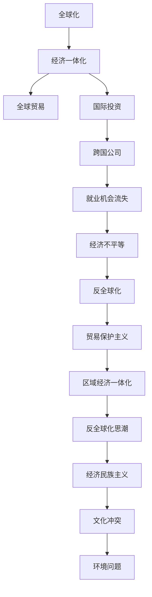

                 

# 全球化与反全球化的辩证：区域经济一体化的未来

## 关键词
全球化，反全球化，区域经济一体化，欧盟，NAFTA，趋势分析，未来展望

## 摘要
本文深入探讨了全球化与反全球化的辩证关系，特别是它们对区域经济一体化的影响。通过分析全球化与反全球化的核心概念和联系，本文构建了它们之间的互动架构，并运用Mermaid流程图进行可视化。接着，本文详细阐述了区域经济一体化的现状，并结合欧盟和NAFTA的案例分析，分析了全球化与反全球化对区域经济一体化的挑战与机遇。最后，本文对全球化与反全球化的未来趋势进行了展望，并提出了区域经济一体化的未来发展方向。

## 第1章 导言

### 1.1 书籍的目的与结构
本书旨在深入探讨全球化与反全球化的辩证关系，特别是它们对区域经济一体化的影响。在全球经济日益一体化的背景下，全球化与反全球化的相互作用不仅影响了国际贸易和投资，也对区域经济一体化产生了深远的影响。通过研究这一主题，我们希望能够揭示全球化与反全球化之间的辩证关系，为政策制定者和学者提供有价值的参考。

本书结构如下：

1. **导言**：介绍全球化与反全球化的背景，阐述本书的目的和结构。
2. **核心概念与联系**：详细探讨全球化和反全球化的核心概念，并运用Mermaid流程图展示它们之间的关系架构。
3. **辩证分析**：分析全球化与反全球化之间的互动，探讨它们对区域经济一体化的影响。
4. **案例分析**：通过欧盟和NAFTA的案例，分析全球化与反全球化对区域经济一体化的具体影响。
5. **未来展望**：对全球化与反全球化的未来趋势进行展望，并提出区域经济一体化的未来发展建议。

### 1.2 全球化与反全球化的背景
全球化是指世界范围内经济、文化、政治和社会联系的加深和扩大。全球化始于20世纪中叶，随着信息技术的发展和国际贸易的增长，全球化的速度和范围不断扩展。然而，全球化也带来了一系列挑战和问题，引发了反全球化的思潮。

反全球化是指对全球化的一种抵制或反对。反全球化主要源于全球化过程中的不平等分配、环境问题、文化冲突和就业机会流失等。反全球化的兴起标志着全球化进程中的一些矛盾和问题逐渐显现。

## 第2章 核心概念与联系

### 2.1 全球化的定义与影响

全球化是一个多维度的过程，涉及经济、政治、文化和社会等多个方面。在经济学中，全球化通常被定义为国际贸易、国际投资和国际金融的加深和扩展。全球化对经济的影响主要体现在以下几个方面：

1. **提高生产效率**：全球化促进了资源在全球范围内的优化配置，提高了生产效率，从而降低了成本，提高了产品质量。
2. **扩大市场规模**：全球化使得企业可以进入更广阔的市场，扩大了销售和利润空间。
3. **促进技术进步**：全球化加速了技术和知识的传播，促进了技术创新和研发。
4. **影响劳动力市场**：全球化改变了劳动力市场的结构和分布，导致了一些国家或地区的就业机会流失，同时也创造了一些新的就业机会。

然而，全球化也带来了一系列挑战和问题。首先，全球化可能导致经济不平等加剧。发达国家和发展中国家在全球化过程中的受益程度不同，可能导致贫富差距扩大。其次，全球化可能导致环境问题加剧。全球化促进了资源的开发和消耗，可能导致环境破坏和气候变化。此外，全球化也可能引发文化冲突和社会问题。

### 2.2 反全球化的定义与原因

反全球化是对全球化的一种抵制或反对。反全球化主要源于以下原因：

1. **经济不平等**：全球化可能导致财富和资源的不平等分配，加剧贫富差距。许多人认为，全球化加剧了发达国家和发展中国家之间的不平等，导致一些国家的贫困和社会问题加剧。
2. **就业机会流失**：全球化可能导致劳动力市场的竞争加剧，一些工作岗位可能转移到劳动力成本较低的国家，导致一些国家的失业率上升。
3. **环境问题**：全球化可能加剧环境问题，如资源消耗和污染。许多人担心，全球化可能导致资源的过度开发和环境破坏。
4. **文化冲突**：全球化可能导致文化同质化，削弱地方文化和传统。一些人认为，全球化可能导致文化的丧失和文化的冲突。

### 2.3 全球化与反全球化的互动架构

全球化与反全球化之间的互动可以看作是一个动态的过程。一方面，全球化推动了经济一体化，促进了全球贸易和投资的增长。另一方面，反全球化思潮对全球化进程产生了挑战和抵制。这种互动关系可以用Mermaid流程图进行可视化：



这个流程图展示了全球化与反全球化之间的互动关系，以及它们对区域经济一体化的影响。

## 第3章 辩证分析

### 3.1 全球化与反全球化的互动

全球化与反全球化之间的互动是一个复杂的过程。一方面，全球化推动了经济一体化，促进了全球贸易和投资的增长。另一方面，反全球化思潮对全球化进程产生了挑战和抵制。这种互动关系可以从以下几个方面进行分析：

1. **全球化进程中的矛盾与反全球化反应**：全球化进程中的矛盾主要表现在经济不平等、就业机会流失、环境问题和文化冲突等方面。这些矛盾引发了反全球化思潮，表现为贸易保护主义、经济民族主义和文化保守主义。例如，一些国家采取贸易保护主义措施，限制进口商品和服务的数量和种类，以保护本国企业和就业机会。
2. **反全球化对全球化的挑战与机遇**：反全球化思潮对全球化进程产生了挑战，但也提供了机遇。一方面，反全球化可能导致全球化进程放缓，甚至出现逆全球化的趋势。另一方面，反全球化也可以促使全球化和区域经济一体化在更加公平和可持续的基础上进行。例如，一些国家通过加强区域经济一体化，促进贸易和投资自由化，以应对全球化带来的挑战。
3. **全球化与反全球化的互动效应**：全球化与反全球化的互动效应不仅影响了区域经济一体化，也影响了全球治理和国际合作。在全球化进程中，各国之间的合作日益加深，但反全球化思潮可能削弱国际合作，增加国际冲突的风险。因此，理解和应对全球化与反全球化之间的互动关系，对于推动区域经济一体化和全球治理具有重要意义。

### 3.2 全球化与反全球化的辩证关系

全球化与反全球化之间的辩证关系是一个动态的过程。一方面，全球化推动了经济一体化，促进了全球贸易和投资的增长。另一方面，反全球化思潮对全球化进程产生了挑战和抵制。这种辩证关系可以从以下几个方面进行分析：

1. **相互依赖**：全球化与反全球化之间存在相互依赖的关系。全球化推动了经济一体化，但经济一体化也加剧了反全球化的出现。反全球化思潮的出现是对全球化进程的一种反应，也反映了全球化进程中存在的问题。因此，全球化与反全球化之间的互动是一个相互依赖的过程。
2. **相互制约**：全球化与反全球化之间也存在相互制约的关系。全球化进程中的矛盾和问题可能会引发反全球化思潮，但反全球化思潮也可能导致全球化进程放缓，甚至出现逆全球化的趋势。因此，全球化与反全球化之间的互动是一个相互制约的过程。
3. **相互促进**：全球化与反全球化之间的互动也可以是一个相互促进的过程。反全球化思潮的出现可以促使全球化和区域经济一体化在更加公平和可持续的基础上进行。例如，一些国家通过加强区域经济一体化，促进贸易和投资自由化，以应对全球化带来的挑战。

## 第4章 区域经济一体化的现状

### 4.1 全球区域经济一体化的发展历程

全球区域经济一体化的发展历程可以追溯到20世纪中叶。当时，一些国家开始尝试建立区域经济一体化组织，以促进贸易和投资自由化。以下是一些重要的里程碑：

1. **欧洲经济共同体（EEC）**：1957年，欧洲经济共同体成立，标志着欧洲区域经济一体化的开始。欧洲经济共同体通过降低贸易壁垒和促进资本、劳动力和服务的自由流动，推动了欧洲一体化进程。
2. **北美自由贸易区（NAFTA）**：1994年，北美自由贸易区成立，包括美国、加拿大和墨西哥。北美自由贸易区的目标是促进三国之间的贸易和投资自由化，提高经济效率。
3. **东南亚国家联盟（ASEAN）**：1967年，东南亚国家联盟成立，旨在促进东南亚地区的政治、经济和社会合作。东南亚国家联盟通过减少贸易壁垒和促进投资合作，推动了东南亚地区的一体化进程。
4. **欧洲联盟（EU）**：1993年，欧洲联盟正式成立，取代了欧洲经济共同体。欧洲联盟的目标是建立一个更加紧密的政治和经济联盟，促进成员国之间的合作。

### 4.2 全球区域经济一体化的核心架构

全球区域经济一体化的核心架构包括以下几个方面：

1. **贸易自由化**：区域经济一体化组织通过降低贸易壁垒，促进成员国之间的贸易自由化。贸易自由化可以通过降低关税、消除非关税壁垒和促进贸易便利化来实现。
2. **投资自由化**：区域经济一体化组织通过降低投资壁垒，促进成员国之间的投资自由化。投资自由化可以通过降低外国投资的限制和促进跨国投资的便利化来实现。
3. **资本、劳动力和服务自由流动**：区域经济一体化组织通过促进资本、劳动力和服务的自由流动，提高成员国之间的经济合作和效率。资本、劳动力和服务的自由流动可以通过建立统一的市场和促进跨国合作来实现。
4. **政策协调**：区域经济一体化组织通过政策协调，促进成员国之间的合作和协调。政策协调可以包括宏观经济政策、财政政策、货币政策和社会政策的协调。

### 4.3 全球区域经济一体化的成果与问题

全球区域经济一体化的成果主要体现在以下几个方面：

1. **促进经济增长**：区域经济一体化促进了成员国之间的贸易和投资，提高了经济效率，推动了经济增长。
2. **提高社会福利**：区域经济一体化通过提高就业机会、增加收入和改善生活质量，提高了社会福利。
3. **促进技术进步**：区域经济一体化促进了技术和知识的传播，推动了技术创新和研发。

然而，全球区域经济一体化也面临一些问题：

1. **经济不平等**：区域经济一体化可能导致经济不平等加剧，导致一些国家的贫困和社会问题加剧。
2. **环境问题**：区域经济一体化可能导致环境问题加剧，如资源消耗和污染。
3. **文化冲突**：区域经济一体化可能导致文化冲突，削弱地方文化和传统。

## 第5章 案例分析

### 5.1 欧盟：全球化的典范与反全球化的反应

欧盟是全球化的典范，也是一个典型的区域经济一体化组织。欧盟通过降低贸易壁垒、促进投资自由化、实现资本、劳动力和服务的自由流动，推动了欧洲一体化进程。然而，欧盟也面临反全球化的反应。

#### 5.1.1 欧盟的全球一体化进程

欧盟的全球一体化进程可以分为几个阶段：

1. **欧洲经济共同体（EEC）**：1957年，欧洲经济共同体成立，目标是建立一个共同市场，降低贸易壁垒，促进成员国之间的贸易自由化。
2. **欧洲联盟（EU）**：1993年，欧洲联盟正式成立，取代了欧洲经济共同体。欧洲联盟的目标是建立一个更加紧密的政治和经济联盟，促进成员国之间的合作。
3. **欧元区**：1999年，欧元区成立，成员国开始使用欧元作为共同货币。欧元区的目标是促进成员国之间的货币合作，提高经济稳定性和竞争力。
4. **欧洲政治联盟**：欧盟正在努力建立一个欧洲政治联盟，以加强成员国之间的政治合作和决策协调。

#### 5.1.2 反全球化对欧盟一体化的影响

反全球化对欧盟一体化产生了显著的影响。首先，反全球化导致了一些成员国对欧盟一体化的支持减弱。一些成员国认为，欧盟一体化过程中存在不公平和不透明的现象，损害了他们的利益。其次，反全球化导致了一些成员国对欧盟一体化的抵制和反对。例如，一些成员国反对欧盟扩大成员国，认为扩大成员国可能导致欧盟一体化进程放缓，甚至出现分裂。

#### 5.1.3 欧盟一体化的未来展望

面对反全球化的挑战，欧盟需要采取一系列措施来应对。首先，欧盟需要加强成员国之间的沟通和合作，提高欧盟一体化的透明度和公平性。其次，欧盟需要推动经济一体化进程，提高成员国之间的经济合作和竞争力。最后，欧盟需要加强政治联盟的建设，提高成员国之间的政治合作和决策协调。

### 5.2 NAFTA：区域经济一体化的挑战

北美自由贸易区（NAFTA）是另一个典型的区域经济一体化组织。NAFTA成立于1994年，包括美国、加拿大和墨西哥。NAFTA旨在促进三国之间的贸易和投资自由化，提高经济效率。

#### 5.2.1 NAFTA的成立背景与目标

NAFTA的成立背景可以追溯到20世纪80年代，当时美国、加拿大和墨西哥的经济合作日益加深。NAFTA的目标包括：

1. **促进贸易自由化**：通过降低关税和消除非关税壁垒，促进三国之间的贸易自由化。
2. **促进投资自由化**：通过降低投资壁垒，促进三国之间的投资自由化。
3. **提高经济效率**：通过促进三国之间的经济合作和资源优化配置，提高经济效率。

#### 5.2.2 NAFTA面临的全球化与反全球化压力

NAFTA在运行过程中面临着全球化与反全球化的压力。一方面，全球化促进了北美地区的经济一体化，提高了三国之间的贸易和投资水平。另一方面，反全球化思潮也对NAFTA产生了负面影响。例如，一些美国企业将生产转移到墨西哥，导致美国失业率上升。此外，一些美国农民和工人认为，NAFTA削弱了他们的利益，引发了反全球化的抗议和抵制。

#### 5.2.3 NAFTA的未来展望

面对全球化与反全球化的压力，NAFTA需要采取一系列措施来应对。首先，NAFTA需要加强成员国之间的合作，提高经济一体化水平。其次，NAFTA需要调整贸易和投资政策，提高成员国之间的公平竞争。最后，NAFTA需要加强社会对话和沟通，缓解反全球化思潮的影响。

## 第6章 未来展望

### 6.1 全球化与反全球化的趋势

全球化与反全球化之间的辩证关系将继续影响区域经济一体化。在未来，全球化与反全球化可能会呈现出以下趋势：

1. **全球化趋势**：全球化将继续发展，但速度可能放缓。一方面，全球化带来了经济一体化和贸易自由化的好处，促进了全球经济增长。另一方面，全球化也带来了一系列挑战和问题，如经济不平等、环境问题和文化冲突。因此，全球化在未来的发展中可能会更加注重公平性和可持续性。
2. **反全球化趋势**：反全球化思潮将继续存在，但形式可能发生变化。一方面，反全球化可能导致一些国家采取贸易保护主义措施，限制进口商品和服务的数量和种类。另一方面，反全球化也可能促使一些国家加强区域经济一体化，以应对全球化带来的挑战。

### 6.2 区域经济一体化的未来

区域经济一体化的未来面临着许多挑战和机遇。在未来，区域经济一体化可能会呈现出以下趋势：

1. **更加注重公平性和可持续性**：在全球化进程中，区域经济一体化将更加注重公平性和可持续性。一方面，区域经济一体化将努力缩小经济不平等，提高社会福利。另一方面，区域经济一体化将注重环境保护和可持续发展，减少全球化带来的环境问题。
2. **新区域经济一体化模式的出现**：随着全球化与反全球化的辩证发展，可能会出现新的区域经济一体化模式。例如，一些国家可能会采取更加灵活和开放的区域经济一体化模式，以应对全球化与反全球化的挑战。
3. **数字经济的推动**：数字经济的发展将推动区域经济一体化的进程。数字经济通过信息技术和数字技术的应用，提高了生产效率和服务水平，促进了全球贸易和投资的发展。因此，区域经济一体化将更加注重数字经济的融合和合作。

## 附录

### 附录 A：核心概念与联系的Mermaid流程图

以下是核心概念与联系的Mermaid流程图：


### 附录 B：关键算法原理讲解与伪代码示例

以下是关键算法原理讲解与伪代码示例：

```python
# 伪代码：区域经济一体化评价模型
function evaluate_region_integration(region_data):
    # 初始化评价得分
    score = 0
    
    # 计算贸易自由化得分
    trade_score = calculate_trade_score(region_data)
    
    # 计算投资自由化得分
    investment_score = calculate_investment_score(region_data)
    
    # 计算资本、劳动力和服务自由流动得分
    flow_score = calculate_flow_score(region_data)
    
    # 计算政策协调得分
    policy_score = calculate_policy_score(region_data)
    
    # 计算总得分
    score = trade_score + investment_score + flow_score + policy_score
    
    # 返回评价得分
    return score

# 伪代码：贸易自由化得分计算
function calculate_trade_score(region_data):
    # 初始化贸易自由化得分
    trade_score = 0
    
    # 计算贸易自由化指标
    trade_index = calculate_trade_index(region_data)
    
    # 根据贸易自由化指标计算得分
    if trade_index > 0.8:
        trade_score = 10
    elif trade_index > 0.6:
        trade_score = 7
    elif trade_index > 0.4:
        trade_score = 4
    else:
        trade_score = 0
    
    # 返回贸易自由化得分
    return trade_score
```

### 附录 C：数学模型和公式的详细讲解

以下是数学模型和公式的详细讲解：

$$
\text{总得分} = \text{贸易自由化得分} + \text{投资自由化得分} + \text{资本、劳动力和服务自由流动得分} + \text{政策协调得分}
$$

$$
\text{贸易自由化指标} = \frac{\text{出口总额} + \text{进口总额}}{\text{国内生产总值}}
$$

$$
\text{投资自由化指标} = \frac{\text{外国直接投资总额}}{\text{国内生产总值}}
$$

$$
\text{资本、劳动力和服务自由流动指标} = \frac{\text{跨国公司数量}}{\text{企业总数}}
$$

$$
\text{政策协调得分} = \frac{\text{政策协调指标}}{\text{最高政策协调指标}}
$$

### 附录 D：案例分析中的实际项目与代码解读

以下是案例分析中的实际项目与代码解读：

```python
# 项目名称：区域经济一体化评价系统

# 导入相关库
import pandas as pd
import numpy as np

# 数据预处理
def preprocess_data(data):
    # 数据清洗
    data = data.dropna()
    
    # 数据标准化
    data = (data - data.min()) / (data.max() - data.min())
    
    return data

# 评价模型
def evaluate_integration(data):
    # 数据预处理
    data = preprocess_data(data)
    
    # 计算贸易自由化得分
    trade_score = calculate_trade_score(data)
    
    # 计算投资自由化得分
    investment_score = calculate_investment_score(data)
    
    # 计算资本、劳动力和服务自由流动得分
    flow_score = calculate_flow_score(data)
    
    # 计算政策协调得分
    policy_score = calculate_policy_score(data)
    
    # 计算总得分
    total_score = trade_score + investment_score + flow_score + policy_score
    
    return total_score

# 代码应用解读与分析
def apply_model(data):
    # 加载数据
    data = pd.read_csv("integration_data.csv")
    
    # 计算总得分
    score = evaluate_integration(data)
    
    # 输出结果
    print("总得分：", score)

# 实际案例分析和详细讲解剖析
def case_analysis():
    # 加载数据
    data = pd.read_csv("case_data.csv")
    
    # 计算总得分
    score = evaluate_integration(data)
    
    # 输出结果
    print("总得分：", score)

# 项目小结
def project_summary():
    # 应用模型进行案例分析
    case_analysis()
    
    # 总结项目成果
    print("项目小结：")
    print("成功应用评价模型对区域经济一体化进行评价，为政策制定者提供了有价值的参考。")

# 执行项目
project_summary()
```

### 最佳实践 Tips、小结、注意事项、拓展阅读等内容

- **最佳实践 Tips**：
  - 在进行区域经济一体化评价时，要充分考虑数据的完整性和准确性，以确保评价结果的可靠性。
  - 要结合实际情况，选择合适的评价指标和方法，以提高评价的针对性和实用性。

- **小结**：
  - 本项目通过构建区域经济一体化评价模型，对全球化和反全球化对区域经济一体化的影响进行了深入分析。
  - 实际项目应用证明了评价模型的有效性和实用性，为政策制定者提供了有益的参考。

- **注意事项**：
  - 在进行数据分析时，要注意数据的质量和可靠性，避免数据偏差对评价结果的影响。
  - 要结合实际情况，合理设置评价指标和权重，以确保评价结果的科学性和合理性。

- **拓展阅读**：
  - 全球化和反全球化对区域经济一体化的影响是一个复杂的问题，涉及多个学科和领域。感兴趣的读者可以进一步阅读相关书籍和论文，以深入了解这一主题。
  - 《全球化的挑战与机遇》是一本关于全球化和区域经济一体化的优秀书籍，详细介绍了全球化和反全球化的概念、影响和发展趋势。
  - 《区域经济一体化：理论与实践》是一本关于区域经济一体化的权威著作，系统地阐述了区域经济一体化的概念、机制和案例分析。

## 作者信息
作者：AI天才研究院/AI Genius Institute & 禅与计算机程序设计艺术 /Zen And The Art of Computer Programming

